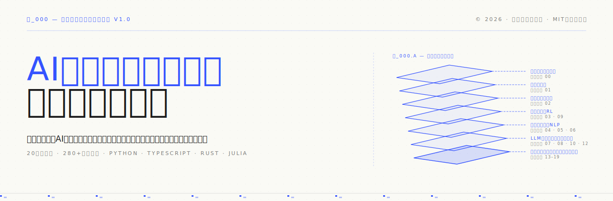
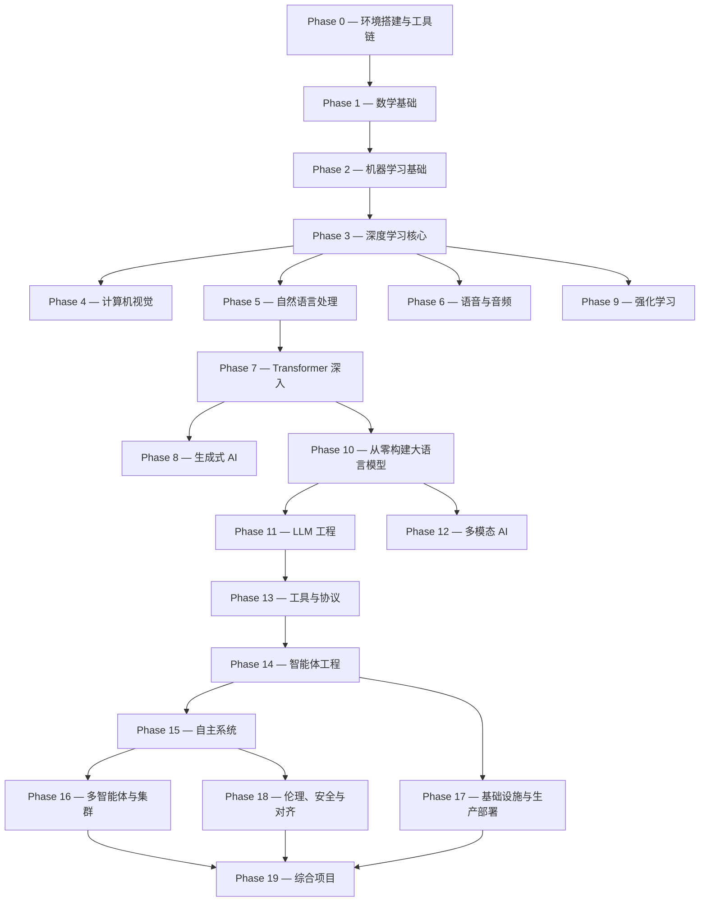

<p align="center">
  
</p>

<p align="center">
  <a href="LICENSE"></a>
  <a href="ROADMAP.md"></a>
  <a href="#目录"></a>
  <a href="https://github.com/A0be/ai-engineering-from-scratch"></a>
</p>

```
░░░▒▒▒░░░▒▒▒░░░▒▒▒░░░▒▒▒░░░▒▒▒░░░▒▒▒░░░▒▒▒░░░▒▒▒░░░▒▒▒░░░▒▒▒░░░▒▒▒░░░▒▒▒░░░▒▒▒░░░▒▒▒░░░▒▒▒
```

> **84% 的学生已经在使用 AI 工具。但仅有 18% 觉得能以专业水准驾驭它们。** 这套课程正是为了弥合这道鸿沟。
>
> **473 篇课程。20 个阶段。约 320 小时。Python、TypeScript、Rust、Julia。** 每一课都产出一个可复用的成果。免费、开源、MIT。
>
> 📖 **完整中文版已上线飞书知识库！** → [从零开始的人工智能工程](https://my.feishu.cn/wiki/Jt6SwbamNi5PbIkTgUJcldPQnwh) · 由 **Claude Opus 4.8** 与 **A0be** 翻译编排，473 篇 + 配图就绪。

---

## 中文本地化

本仓库包含全部 473 篇课程的专业中文翻译（`docs/zh.md`），由 **Claude Opus 4.8（1M 上下文）** 翻译，**A0be** 编排执行。

### 翻译规格

| 项目 | 详情 |
|---|---|
| 翻译模型 | Claude Opus 4.8 (deepseek-v4-pro) |
| 译文格式 | 专业流畅简体中文，代码原样保留（注释译中） |
| 术语规范 | 首次出现用「中文（English）」 |
| 配图处理 | 全量 SVG → PNG 栅格化（@resvg/resvg-js，2× 像素） |

### 中文版入口

- 📚 **飞书知识库：** https://my.feishu.cn/wiki/Jt6SwbamNi5PbIkTgUJcldPQnwh
- 🐙 **GitHub：** https://github.com/A0be/ai-engineering-from-scratch
- 🔗 **原项目：** https://github.com/rohitg00/ai-engineering-from-scratch

## 课程结构

20 个阶段逐层堆叠。数学是地基，智能体与生产是屋顶。



## 一课的结构

```
phases/<NN>-<阶段名称>/<NN>-<课程名称>/
├── code/      可运行实现（Python、TypeScript、Rust、Julia）
├── docs/
│   ├── en.md  课程正文（英文）
│   └── zh.md  课程正文（中文） ✨ 本仓库独有
└── outputs/   提示词、技能、智能体或 MCP 服务器
```

## 快速入门

**方式 A — 阅读：** [aiengineeringfromscratch.com](https://aiengineeringfromscratch.com)

**方式 B — 克隆运行：**
```bash
git clone https://github.com/A0be/ai-engineering-from-scratch.git
cd ai-engineering-from-scratch
python phases/01-math-foundations/01-linear-algebra-intuition/code/vectors.py
```

**方式 C — 找起点（推荐）：**
```bash
/find-your-level
```

## 本仓库的独特性

- ✅ 全部 473 篇 `docs/zh.md` 中文译文
- ✅ 飞书知识库完整部署，含 ~76 张原尺寸配图
- ✅ 自动化翻译+上传管线，可复用于后续更新
