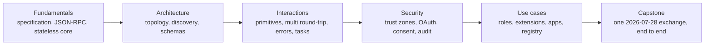

# MCPA Certification Curriculum

> Learn the judgment the exam measures by building the protocol the exam describes.

**Status:** Local preview
**Guide version:** 1.0
**Guide effective date:** September 2026
**Last verified:** 2026-09-24

This free curriculum prepares you for the Model Context Protocol Associate
(MCPA) exam from the Agentic AI Foundation, delivered through Linux Foundation
Training and Certification:

| Exam | Credential | Level | Time | Fee | Core route |
|------|------------|-------|------|-----|-----------:|
| MCPA | Model Context Protocol Associate | Beginner | 90 min | $250 | 34 lessons |

The exam is online proctored, multiple choice, aligned to the Model Context
Protocol specification dated 2026-07-28, valid for two years, with one retake
included and a twelve-month eligibility window. The official exam item count and
passing score are not published, so this curriculum's three 60-question mocks
are original practice sets, not the official length, and practice percentages
cannot predict an official outcome. The MCPA page lists 90 minutes; the launch
announcement stated 120 minutes. Confirm current pricing, format, duration, and
eligibility on the official page before scheduling, because program details can
change. Every exam fact and its retrieval date is recorded in
[research/source-verification-ledger.md](research/source-verification-ledger.md).

## Learn From GitHub With an AI Tutor

This curriculum is AI-native. Claude Code, Codex, ChatGPT, Cursor, or another
agent can teach the route, run the checked-in lab, review the artifact you
build, administer the lesson quiz, and resume from saved progress.

Start with the [GitHub learner guide](GETTING_STARTED.md), or install the
portable certification tutor skill at
[../../skills/mcpa-certification/SKILL.md](../../skills/mcpa-certification/SKILL.md):

```bash
npx skills add rohitg00/ai-engineering-from-scratch
```

Then ask your agent to run:

```text
/mcpa-certification
```

A local Claude Code session discovers the same skill from `.claude/skills/`
after you clone the repository. Harnesses without slash-command support can read
`GETTING_STARTED.md` and the tutor skill directly. Learner progress lives in
`MCPA-CERTIFICATION.md`; learner work lives under `learning-artifacts/mcpa/`.
The checked-in `outputs/` files remain reference artifacts and are never
overwritten. This curriculum lives outside the EPUB/PDF book workflow and is not
converted into the books.

## What You Build

One route, built from first principles, that assembles a working MCP exchange:



Each lesson ships a runnable standard-library MCP mock, a test suite, a lesson
quiz, and a reusable artifact. Every lesson teaches the stateless 2026-07-28
revision as current, and `scripts/check_mcpa_wire.py` checks each lab's
transcript for that wire shape. The protocol facts, their primary sources, and
the source conflicts resolved while writing live in
[research/mcp-2026-07-28-brief.md](research/mcp-2026-07-28-brief.md). The route
includes a 30-question diagnostic and three full-length original mocks, each
with a different emphasis, whose question mix follows the published blueprint
weights within practical rounding. They do not imitate or reproduce live exam
questions.

The MCPA blueprint has five domains:

| Domain | Weight |
|--------|-------:|
| MCP Fundamentals | 16% |
| Architecture and Components | 14% |
| Interactions and Execution | 26% |
| Security and Governance | 24% |
| Use Cases and Ecosystem | 20% |

## GitHub Lesson Index

The tutor reads the track file for route order. This complete index also makes
every lesson directly browsable from GitHub.

| # | Lesson |
|---:|--------|
| 00 | [The MCPA Blueprint Is a Study Budget, Not a Checklist](lessons/00-mcp-exam-strategy/) |
| 01 | [Reading the MCP Specification](lessons/01-reading-the-specification/) |
| 02 | [The Integration Problem MCP Solves](lessons/02-the-integration-problem/) |
| 03 | [The JSON-RPC Envelope](lessons/03-json-rpc-and-meta/) |
| 04 | [The Stateless Core of MCP](lessons/04-the-stateless-core/) |
| 05 | [Telling a Modern MCP Server From a Legacy One](lessons/05-protocol-eras-and-compatibility/) |
| 06 | [Hosts, Clients, and Servers: MCP's Process Topology](lessons/06-hosts-clients-and-servers/) |
| 07 | [Discovering a Server and Negotiating What It Can Do](lessons/07-discovery-and-capability-negotiation/) |
| 08 | [The Contract Inside a Tool Definition](lessons/08-tool-schemas-and-structured-content/) |
| 09 | [Reading a Server Manifest Like a Reviewer](lessons/09-reading-server-manifests/) |
| 10 | [The Model Interaction Flow](lessons/10-model-interaction-flow/) |
| 11 | [The Tools Primitive: Calling Actions and Reading Their Results](lessons/11-the-tools-primitive/) |
| 12 | [Resources: Addressable Content for a Stateless Server](lessons/12-the-resources-primitive/) |
| 13 | [Prompt Templates and Argument Completion](lessons/13-prompts-and-completion/) |
| 14 | [Multi Round-Trip Requests and Elicitation](lessons/14-multi-round-trip-requests-and-elicitation/) |
| 15 | [Deprecated, Not Removed: Roots, Sampling, and Logging](lessons/15-deprecated-client-features/) |
| 16 | [The Subscription Stream: Notifications, Progress, and Cancellation](lessons/16-notifications-and-subscriptions/) |
| 17 | [The Tool Invocation Lifecycle](lessons/17-tool-invocation-lifecycle/) |
| 18 | [Two Ways for a Request to Fail](lessons/18-error-handling/) |
| 19 | [Transports and the HTTP Header Contract](lessons/19-transports-and-http-headers/) |
| 20 | [Cache Freshness and Cursor-Based Pagination](lessons/20-caching-and-pagination/) |
| 21 | [Long-Running Work and the Tasks Extension](lessons/21-long-running-work-and-tasks/) |
| 22 | [Trust Zones in an MCP Exchange](lessons/22-trust-boundaries/) |
| 23 | [Authorizing Access to an MCP Server](lessons/23-oauth-authorization/) |
| 24 | [Proving a Client's Identity to an Authorization Server](lessons/24-client-registration-and-identity/) |
| 25 | [Consent and Least Privilege](lessons/25-consent-and-least-privilege/) |
| 26 | [Risk and Safety Controls for MCP Tool Calls](lessons/26-risk-and-safety-controls/) |
| 27 | [One Trace ID Ties Auditability to Observability](lessons/27-auditability-and-observability/) |
| 28 | [Every MUST Needs an Owner](lessons/28-roles-and-adoption/) |
| 29 | [Choosing MCP's Shape for the Job](lessons/29-operational-use-cases/) |
| 30 | [The Extensions Framework](lessons/30-the-extensions-framework/) |
| 31 | [Interactive Interfaces Inside the Conversation](lessons/31-mcp-apps/) |
| 32 | [Finding, Routing To, and Trusting a Server](lessons/32-registry-gateways-and-sdk-tiers/) |
| 33 | [Reading One MCP Exchange End to End](lessons/33-mcpa-capstone-readiness/) |

## Not Affiliated

This is an independent community curriculum. It is not affiliated with, endorsed
by, sponsored by, or authorized by the Agentic AI Foundation or the Linux
Foundation. It does not contain live exam questions. The official exam page and
current program policies always take precedence.
