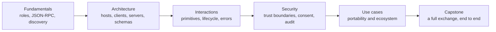

# MCPA Certification Curriculum

> Learn the judgment the exam measures by building the protocol the exam describes.

**Status:** Local preview
**Guide version:** 1.0
**Guide effective date:** September 2026
**Last verified:** 2026-09-24

This free curriculum prepares you for the Model Context Protocol Associate
(MCPA) exam from the Agentic AI Foundation, delivered through Linux Foundation
Training and Certification:

| Exam | Credential | Level | Time | Fee | Core route |
|------|------------|-------|------|-----|-----------:|
| MCPA | Model Context Protocol Associate | Beginner | 90 min | $250 | 10 lessons |

The exam is online proctored, multiple choice, aligned to the Model Context
Protocol specification dated 2026-07-28, valid for two years, with one retake
included and a twelve-month eligibility window. The official exam item count and
passing score are not published, so this curriculum's 60-question mock is an
original practice set, not the official length, and practice percentages cannot
predict an official outcome. The MCPA page lists 90 minutes; the launch
announcement stated 120 minutes. Confirm current pricing, format, duration, and
eligibility on the official page before scheduling, because program details can
change. Every exam fact and its retrieval date is recorded in
[research/source-verification-ledger.md](research/source-verification-ledger.md).

## Learn From GitHub With an AI Tutor

This curriculum is AI-native. Claude Code, Codex, ChatGPT, Cursor, or another
agent can teach the route, run the checked-in lab, review the artifact you
build, administer the lesson quiz, and resume from saved progress.

Start with the [GitHub learner guide](GETTING_STARTED.md), or install the
portable certification tutor skill at
[../../skills/mcpa-certification/SKILL.md](../../skills/mcpa-certification/SKILL.md):

```bash
npx skills add rohitg00/ai-engineering-from-scratch
```

Then ask your agent to run:

```text
/mcpa-certification
```

A local Claude Code session discovers the same skill from `.claude/skills/`
after you clone the repository. Harnesses without slash-command support can read
`GETTING_STARTED.md` and the tutor skill directly. Learner progress lives in
`MCPA-CERTIFICATION.md`; learner work lives under `learning-artifacts/mcpa/`.
The checked-in `outputs/` files remain reference artifacts and are never
overwritten. This curriculum lives outside the EPUB/PDF book workflow and is not
converted into the books.

## What You Build

One route, built from first principles, that assembles a working MCP exchange:



Each lesson ships a runnable standard-library MCP mock, a test suite, a lesson
quiz, and a reusable artifact. The route includes a short diagnostic and a
full-length original mock whose question mix follows the published blueprint
weights within practical rounding. It does not imitate or reproduce live exam
questions.

The MCPA blueprint has five domains:

| Domain | Weight |
|--------|-------:|
| MCP Fundamentals | 16% |
| Architecture and Components | 14% |
| Interactions and Execution | 26% |
| Security and Governance | 24% |
| Use Cases and Ecosystem | 20% |

## GitHub Lesson Index

- [00-mcp-exam-strategy/](lessons/00-mcp-exam-strategy/) how the blueprint is weighted
- [01-mcp-fundamentals/](lessons/01-mcp-fundamentals/) the integration problem MCP solves
- [02-architecture-and-components/](lessons/02-architecture-and-components/) hosts, clients, and servers
- [03-schemas-and-structured-data/](lessons/03-schemas-and-structured-data/) tools described by JSON Schema
- [04-interaction-patterns-and-primitives/](lessons/04-interaction-patterns-and-primitives/) requests, notifications, primitives
- [05-tool-invocation-lifecycle-and-errors/](lessons/05-tool-invocation-lifecycle-and-errors/) the call lifecycle and error codes
- [06-trust-boundaries-and-consent/](lessons/06-trust-boundaries-and-consent/) the trust boundary and consent
- [07-risk-controls-and-auditability/](lessons/07-risk-controls-and-auditability/) audit logs and risk controls
- [08-use-cases-and-ecosystem/](lessons/08-use-cases-and-ecosystem/) portability across hosts
- [09-mcpa-capstone-readiness/](lessons/09-mcpa-capstone-readiness/) a full exchange, end to end

## Not Affiliated

This is an independent community curriculum. It is not affiliated with, endorsed
by, sponsored by, or authorized by the Agentic AI Foundation or the Linux
Foundation. It does not contain live exam questions. The official exam page and
current program policies always take precedence.
