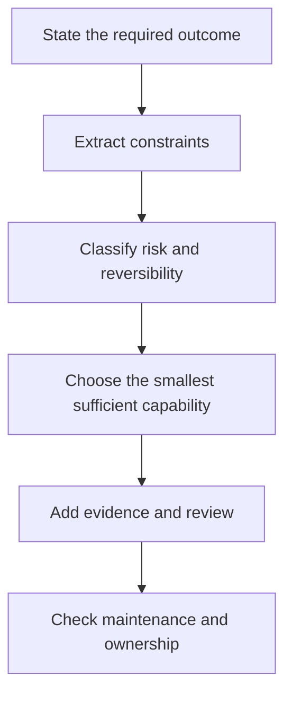

# Изучайте решения, а не термины

> План сертификации — это карта решений, которые компетентный специалист способен обосновать. Если воспринимать его как список терминов, вы будете изучать наименее полезную для экзамена часть материала.

**Тип:** Обучение
**Языки:** Python
**Предварительные требования:** Нет
**Время:** ~75 минут

## Цели обучения

- Преобразовать план сертификации во взвешенный план подготовки.
- Отделять устойчивые инженерные принципы от деталей продукта, которые могут измениться.
- Создать реестр доказательств, в котором фиксируются решения, обоснования и официальные источники.
- Отрабатывать принятие решений по сценариям, не используя дампы и не реконструируя реальные экзаменационные вопросы.
- Определить критерий готовности на основе результатов по предметным областям, а не одной удачной оценки на пробном экзамене.

## Проблема

Майя две недели запоминала названия возможностей. Она может дать определение Project, контекстному окну и коннектору. Но затем ей попадается сценарий.

Команде нужно составлять сводку конфиденциального еженедельного отчёта. Исходный файл меняется каждую пятницу. Итоговая сводка предназначена для руководителей. Среди вариантов — вставить отчёт в новый чат, добавить его в старый Project, подключить актуальный источник или создать собственное приложение. Любой вариант позволяет получить сводку. Но только один соответствует частоте обновлений, требованиям к проверке, политике работы с данными и затратам на сопровождение.

Майя пытается вспомнить определение коннектора. Однако сценарий требует принять решение.

Это различие лежит в основе всей учебной программы. В официальных руководствах описываются такие задачи, как выбор продукта, проверка вывода, управление знаниями и эскалация рисков. Определение может помочь выполнить эти задачи, но не выполнит их за вас.

Кроме того, на экзаменах используется шкалированная оценка. Процент за практическую работу не является официальной оценкой, и ни один пробный экзамен от сообщества не способен предсказать результат. Ваша задача — развить способность принимать решения настолько, чтобы даже незнакомые сценарии имели понятную структуру.

## Концепция

### План экзамена — это модель профессиональной деятельности

Каждая предметная область представляет часть работы, ожидаемой от специалиста соответствующей роли. Вес приблизительно показывает, какая доля оцениваемых заданий экзамена относится к этой области. Вес — это не сложность. В области с малым весом тоже могут встречаться сложные вопросы. Вес помогает распределить практику.

В Associate Foundations наибольший вес имеет область оценивания и проверки вывода. Это важный сигнал. Специалист этой роли должен не просто уметь запросить у Claude ответ, но и определить, пригоден ли этот ответ для использования.

При чтении каждой цели используйте три метки:

1. **Знать:** факты или термины, которые нужно помнить.
2. **Делать:** процедура, которую нужно выполнить.
3. **Решать:** компромисс, который нужно найти с учётом ограничений.

В большинстве слабых планов подготовки слишком много внимания уделяется категории «Знать». Большинство сценарных вопросов сосредоточено на категориях «Делать» и «Решать».

### Устойчивые принципы и изменчивые факты

Некоторые знания меняются медленно:

- Для конфиденциальных данных требуется одобренный способ обработки.
- Прежде чем утверждение попадёт в документ с существенными последствиями, его нужно подтвердить доказательствами.
- Постоянные инструкции должны быть краткими, ограниченными по области действия и актуальными.
- Необратимые действия требуют более строгой проверки, чем обратимые черновые изменения.
- Использовать более крупную модель расточительно, если модель меньшего размера соответствует измеримым требованиям.

Другие знания могут измениться между написанием этого урока и моментом, когда вы начнёте его изучать:

- Названия и цены моделей, а также ограничения контекста.
- Доступность тарифных планов и возможностей.
- Навигация по продукту и подписи элементов интерфейса.
- Возможности коннекторов и порядок подтверждения действий.
- Стоимость сертификации, правила и условия доступа.

Для второй группы необходимо указывать дату проверки и официальный источник. Эта учебная программа сверена с руководствами версии 1.0 за июль 2026 года. Перед записью на экзамен снова откройте актуальное официальное руководство и FAQ по сертификации.

### Последовательность принятия решений по сценарию

Когда несколько ответов кажутся обоснованными, анализируйте сценарий в следующем порядке:



Важно выбрать минимально достаточную возможность. Если в обычном чате можно безопасно подготовить одноразовый черновик, управляемый Project может быть излишним. Если источник меняется каждый день, вставленная копия может оказаться слишком устаревшей. Если рабочий процесс выполняет действие с существенными последствиями, удобство не важнее согласования.

### Неверные ответы обычно верны в узком контексте

Хорошие дистракторы редко бывают бессмысленными. Они решают не ту задачу, игнорируют одно ограничение или добавляют ненужные механизмы.

Распространённые варианты:

- **Возможность без соответствия требованиям:** функция позволяет выполнить задачу, но не с заданными требованиями к конфиденциальности или актуальности.
- **Максимальная мощность по умолчанию:** самая крупная модель выбирается без подтверждённой необходимости.
- **Исправление только промпта:** промпт переписывают, хотя на самом деле ошибка вызвана устаревшими знаниями или отсутствием источника.
- **Автоматизация без ответственного:** в рабочем процессе нет проверяющего, пути эскалации или ответственного за сопровождение.
- **Политика после выполнения:** конфиденциальные материалы сначала обрабатывают и лишь потом классифицируют.
- **Один успешный пример:** единственный качественный результат считают доказательством надёжности.

### Создайте реестр доказательств

В заметках следует фиксировать решения, а не скопированные абзацы. Создайте по одной записи для каждой цели:

```json
{
  "objective": "Choose when human verification is required",
  "decision_rule": "Require independent review when an error could create material harm or the claim lacks authoritative evidence",
  "counterexample": "A low-risk brainstorming list can be reviewed by the author during normal editing",
  "artifact": "claim-evidence matrix",
  "official_source": "URL and verification date",
  "confidence": "practiced"
}
```

Контрпример крайне важен. Если вы не можете привести ситуацию, в которой правило не следует применять, вероятно, вы запомнили лозунг, а не усвоили границы применимости.

## Практическая работа

Создайте реестр Associate Foundations из семи строк — по одной для каждой предметной области. В каждой строке укажите:

- Вес предметной области.
- Два решения, которые вам, вероятно, придётся принимать.
- Один артефакт, подтверждающий, что вы способны выполнить эту работу.
- Один вид ошибки, который вы хотите научиться быстро распознавать.
- Один официальный источник.
- Текущий уровень уверенности: не изучено, понято, отработано или выполнено на время.

Затем пропорционально распределите десять часов подготовки. Начните с математического распределения, но скорректируйте его с учётом слабых мест. На устранение пробелов в области с весом 21 процент, в которой у вас уже есть устойчивые навыки, может потребоваться меньше времени, чем на область с весом 12 процентов, с которой вы никогда не работали.

Используйте эту формулу:

```text
domain hours = total hours x domain weight x weakness multiplier
```

Нормализуйте итоговые значения, чтобы в сумме они соответствовали доступному времени. Для незнакомой области разумно использовать множитель слабости 1.5. Не применяйте множитель, чтобы уклониться от работы над областью с большим весом, которая вам не нравится.

Наконец, создайте журнал ошибок для практических вопросов. Записывайте:

- Принятое вами решение.
- Ограничение, которое вы упустили.
- Почему выбранный вариант выглядел привлекательным.
- Правило, которое помогло бы дать более точный ответ.
- Новый сценарий, в котором применяется то же правило.

Анализ журнала ошибок полезнее, чем многократное прохождение одного и того же пробного экзамена.

### Следуйте ритму подготовки, а не пытайтесь освоить всё в последний момент

Используйте этот четырёхэтапный ритм как ориентир для прохождения учебной программы. Распределите его на четыре
недели или сократите в соответствии с фактически доступным временем:

1. **Сориентируйтесь:** прочитайте актуальное руководство, один раз пройдите новый диагностический тест и сопоставьте
   каждую ошибку с целью и уровнем уверенности.
2. **Создайте:** пройдите обязательные уроки и подготовьте собственные артефакты. Запускайте
   тесты, а не воспринимайте примеры кода, политик или архитектуры как обычный текст.
3. **Перенесите навыки:** решайте новые сценарии, обосновывайте, почему каждый правдоподобный альтернативный вариант
   проигрывает, и устраняйте пробелы в слабых областях с помощью журнала ошибок.
4. **Смоделируйте экзамен:** выполняйте новые наборы заданий на время по опубликованным правилам без использования материалов,
   анализируйте правильные ответы, данные наугад, и не добавляйте новый материал непосредственно перед
   оцениванием.

Прежде чем выбирать способ устранения пробела, классифицируйте каждую ошибку:

- **Пробел в знаниях:** вы не знали устойчивый факт или определение.
- **Устаревший факт:** вы запомнили деталь продукта, которую нужно сверить с актуальным официальным источником.
- **Упущенное ограничение:** вы не учли конфиденциальность, актуальность, задержку, стоимость, полномочия или обратимость.
- **Ошибка последовательности:** вы выбрали допустимое действие не на том этапе жизненного цикла.
- **Неверный выбор средства:** вы выбрали подходящий по возможностям продукт или инструмент, который не был минимальным сопровождаемым решением.
- **Ошибка доказательства:** вы приняли уверенность, наличие ссылки или один успешный запуск за доказательство.
- **Избыточное проектирование:** вы усложнили архитектуру до того, как этого потребовал сценарий.

Способ устранения пробела зависит от категории. Если факт устарел, нужно обратиться к документации. Если
упущено ограничение, нужны новые сценарии. При ошибке последовательности нужна карта жизненного цикла.
Повторное чтение одного и того же объяснения не является универсальной стратегией подготовки.

## Интерактивная лабораторная работа

Используйте схему маршрута, чтобы изменить уровень уверенности по предметным областям и количество доступных часов. Обратите внимание, как слабая область с большим весом меняет последовательность подготовки, вместо того чтобы уделять всем целям одинаковое внимание.

```figure
00-certification-route-map
```

## Практическая лабораторная работа

Запустите локальный оценщик сценариев, затем измените одну метку уверенности и проследите за изменением взвешенного порядка подготовки. Нарушьте корректность весов предметных областей или распределённых часов и убедитесь, что средство запуска отклоняет недопустимый план.

## Готовый артефакт

Заполненный артефакт в `outputs/readiness-plan.json` представляет собой полный десятичасовой план Associate Foundations. Он включает все семь предметных областей из плана экзамена, текущий уровень уверенности, два решения для каждой области, один вид ошибки, официальный источник, конкретный артефакт, который нужно создать, четырёхэтапный ритм практики и таксономию неверных ответов.

## Проверка

Проверьте пакет и его тесты без ключа API:

```bash
cd certifications/claude/lessons/00-certification-strategy/code
python3 main.py
python3 -m unittest discover tests -v
```

Валидатор подтверждает, что веса предметных областей согласуются с распределёнными часами, каждый источник является официальным и содержит дату, для каждой области есть свидетельства практики, а способы устранения пробелов охватывают разные классы ошибок. После успешной проверки примера замените заполненные значения своими.

## Связь с итоговым проектом

Тест из шести вопросов проверяет, умеете ли вы рассуждать на основе весов, датированных фактов, ограничений и сведений об ошибках. Используйте проверенный план в итоговом проекте выбранного маршрута. В маршруте Associate он становится документом, фиксирующим охват материала и готовность для урока 29.

## Применение

Пройдите учебную программу в четыре этапа.

**Первый этап — сориентироваться.** Прочитайте актуальное руководство, один раз пройдите диагностический тест и отметьте слабые предметные области. Не изучайте ответы диагностического теста до его завершения.

**Второй этап — создать.** Пройдите уроки и подготовьте предусмотренные в них артефакты. Выполните итоговый проект по рабочей неделе без заметок. Этот проект объединяет в одном рабочем процессе выбор продукта, сопровождение знаний, создание промптов, проверку, управление и передачу результатов.

**Третий этап — объяснить.** Для каждого решения объясните, почему ближайший альтернативный вариант проигрывает при заданных ограничениях. Объяснение выявляет поверхностную уверенность.

**Четвёртый этап — выполнить на время.** Пройдите полный пробный экзамен без использования материалов. Разберите каждый ответ, включая правильные догадки. Угаданный правильный ответ не означает, что тема усвоена.

Консервативный критерий готовности:

- Два новых набора практических заданий, выполненных на время с результатом не ниже вашей цели.
- Ни одна предметная область не ниже 75 процентов по исходной оценке практических заданий.
- Все артефакты итогового проекта готовы.
- Каждая ошибка объяснена через упущенное ограничение.
- После полного пробного экзамена осталось не менее десяти минут.

Это критерий готовности к экзамену, а не прогноз шкалированной оценки Anthropic.

## Закономерности принятия решений на экзамене

- Предпочитайте вариант, который соответствует всем явным ограничениям, а не вариант с наибольшим числом возможностей.
- Воспринимайте такие слова, как «актуальный», «конфиденциальный», «регулярный», «одобренный», «аудируемый» и «для руководителей», как исходные требования к архитектуре.
- Разделяйте качество содержимого и качество рабочего процесса. Хороший ответ, полученный через неодобренный канал работы с данными, всё равно является неверным решением.
- Когда важна актуальность, выбирайте сопровождаемый источник, а не скопированный снимок данных.
- Добавляйте проверку человеком при серьёзных последствиях, высокой неопределённости или необратимости.
- Сверяйте сведения о продукте с актуальными официальными материалами, а не полагайтесь на запомнившийся интерфейс.

## Распространённые ловушки

- Использование дампов реальных вопросов. Это нарушает правила программы и тренирует узнавание, а не способность принимать решения.
- Предположение, что более длинный ответ с большей вероятностью окажется правильным.
- Запоминание точных цен без указания даты.
- Отождествление самой крупной модели с самым безопасным вариантом.
- Прохождение множества некачественных пробных экзаменов вместо изучения объяснений.
- Представление о том, что знакомый сценарий доказывает способность справиться с незнакомым.
- Смешение исходного процента за практическую работу с официальной шкалированной оценкой.

## Упражнения

1. Возьмите по одной цели из каждой предметной области и пометьте её как «Знать», «Делать» или «Решать». Обоснуйте каждую метку.
2. Напишите один сценарий, в котором Project не нужен, и другой, где Project — самое простое сопровождаемое решение.
3. Найдите в этой учебной программе один факт о продукте, который может измениться. Проверьте его по официальному источнику и запишите дату.
4. Перепишите слабую запись в журнале ошибок «Я забыл ответ» как объяснение упущенного ограничения.
5. Разработайте личный критерий готовности, который будет строже одной оценки за пробный экзамен, но останется достижимым за доступное время.

## Ключевые термины

| Термин | Значение |
|---|---|
| План экзамена | Официальная карта предметных областей и целей, определяющая охват экзамена |
| Шкалированная оценка | Преобразованная экзаменационная оценка, не равная исходному проценту правильных ответов |
| Дистрактор | Неверный вариант ответа, задуманный так, чтобы казаться правдоподобным при неполном прочтении условия |
| Правило принятия решений | Многократно применимый способ выбирать из альтернатив с учётом известных ограничений |
| Реестр доказательств | Датированная запись, связывающая цель с правилом, артефактом и официальным источником |
| Критерий готовности | Набор условий, которые необходимо выполнить перед переходом к следующему этапу оценивания |

## Дополнительные материалы

- [Каталог партнёрских сертификаций Anthropic](https://anthropic-partners.skilljar.com/page/partner-certifications)
- [FAQ по сертификации Anthropic](https://anthropic-partners.skilljar.com/page/faq-certifications)
- [Руководство по экзамену Claude Certified Associate Foundations](https://everpath-course-content.s3-accelerate.amazonaws.com/instructor%2F6nizmqk8tpzpfjvt6qmmav7rh%2Fpublic%2F1783542847%2FClaude+Certified+Associate+%E2%80%93+Foundations+Exam+Guide.pdf)
- [Обзор точных правил CCAR-F](../../../references/ccar-f-exact-mechanics.md)
- [Проектирование промптов: техники и паттерны](../../../../../phases/11-llm-engineering/01-prompt-engineering/)
- [Оценивание и тестирование приложений на базе LLM](../../../../../phases/11-llm-engineering/10-evaluation/)
