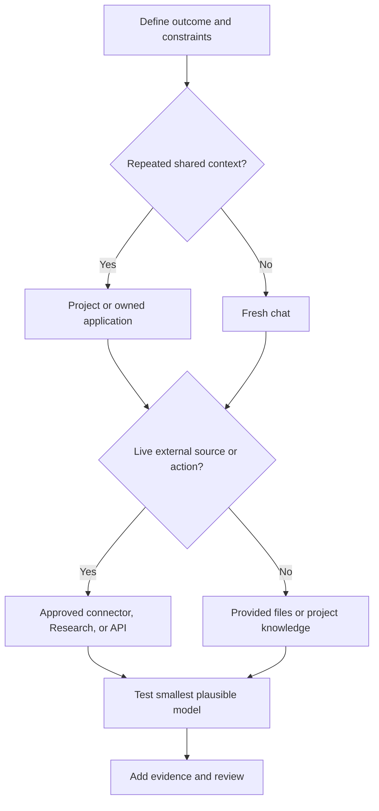

# Выбирайте самую простую среду, способную выполнить работу

> Выбор продукта — это архитектурное решение в масштабе интеллектуальной работы. Неподходящая среда может сделать правильный результат устаревшим, непроверяемым или неоправданно дорогим.

**Тип:** Изучение
**Языки:** Python
**Предварительные требования:** [Изучайте решения, а не термины](../../00-certification-strategy/), [Управляемые платформы LLM](../../../../../phases/17-infrastructure-and-production/01-managed-llm-platforms/)
**Время:** ~90 минут

## Цели обучения

- Выбирать между чатом, Projects, Research, файлами и Artifacts, коннекторами и программными средами.
- Объяснять устойчивые роли Haiku, Sonnet и Opus без привязки к конкретной версии модели.
- Подбирать среду и модель с учётом ограничений по качеству, скорости, стоимости, актуальности и управлению.
- Сравнивать варианты развёртывания через Anthropic напрямую, Amazon Bedrock, Google Vertex AI и Microsoft Foundry с помощью записи архитектурного решения.
- Определять, когда для сохранения контекста следует использовать память, знания Project или новую беседу.
- Снабжать изменяемые сведения о продукте ссылкой на официальный источник и датой проверки.

## Проблема

Руководитель операционного направления готовит еженедельную сводку о конкурентах. Она открывает чат с прошлой недели, вставляет три новые ссылки, просит обновить сводку и пересылает результат.

Результат выглядит профессионально. Однако в нём указана старая цена продукта из предыдущей беседы, пропущено изменение политики во внутреннем документе и приведено утверждение о конкуренте без источника. Ошибка началась не с формулировки. Она началась с выбора рабочей среды.

Старый чат принёс с собой устаревший контекст. Вставленные ссылки не гарантировали всестороннего исследования. Внутренняя политика не входила в доступные знания. В рабочем процессе не было этапа проверки утверждений.

Экзаменационная цель называется выбором продукта и модели, но настоящий навык заключается в проектировании границ. Вы определяете, что Claude может видеть, запоминать, находить и создавать, а также какой уровень способности к рассуждению необходим задаче.

## Концепция

### Начинайте с работы, а не с меню возможностей

Опишите задачу по шести параметрам:

| Параметр | Вопрос |
|---|---|
| Повторяемость | Это разовая, повторяющаяся или непрерывная задача? |
| Знания | Требуемый источник мал, велик, конфиденциален или изменяется? |
| Актуальность | Может ли вчерашняя копия оказаться неверной сегодня? |
| Результат | Нужен ответ, отчёт, файл, анализ или многократно используемый рабочий процесс? |
| Последствия | Что произойдёт, если результат окажется неверным или действие будет непреднамеренным? |
| Совместная работа | Результатом пользуется один человек или команда должна совместно использовать и поддерживать его? |

Только после этого выбирайте среду.

### Чат подходит для ограниченной диалоговой работы

Новый чат часто служит правильным вариантом по умолчанию для разовой задачи с чёткими входными данными. Он создаёт чистую границу контекста. Используйте его для подготовки черновиков, мозгового штурма, объяснений, преобразования предоставленного текста и краткого анализа.

Долгая переписка становится опасной, когда прежние допущения незаметно влияют на новую работу. Начните заново, если изменилась цель, в контексте есть противоречащие друг другу инструкции или вы не можете объяснить, какие предыдущие сообщения по-прежнему важны. Если нужно сохранить преемственность, перед началом новой беседы подготовьте краткую проверенную передачу контекста.

Поиск по чатам и память помогают восстановить прежний контекст, но не заменяют утверждённый источник достоверных данных. Память полезна для предпочтений и устойчивого рабочего контекста. Политику, прайс-лист или запись о клиенте следует хранить в поддерживаемой системе с назначенными ответственными и датами.

### Projects — поддерживаемые границы контекста

Project объединяет тематические чаты, инструкции проекта и базу знаний. Он лучше подходит для повторяющейся работы с одним и тем же стабильным контекстом, например с руководством по стилю бренда, исследовательской программой, операционной процедурой или клиентским проектом.

Преимущество заключается не только в хранении, но и в повторяемости. Каждая новая беседа начинается внутри преднамеренно заданной границы.

Риск связан с устаревшей конфигурацией. Project, в котором хранится политика за прошлый квартал, может последовательно приводить к одному и тому же ошибочному решению. Для каждого Project необходимы ответственный, перечень источников, периодичность проверки и процедура удаления.

Поведение официального продукта меняется. Согласно материалам справочного центра Anthropic, проверенным 8 августа 2026 года, Projects могут содержать инструкции и загруженные знания, а также использовать поиск, когда объём знаний приближается к пределам контекста. Доступность, ограничения и требования к тарифному плану необходимо повторно проверять в актуальном справочном центре.

### Cowork — управляемый цикл выполнения задач

Cowork — продуктовая среда для многоэтапной интеллектуальной работы, а не отдельный вариант развёртывания и не экзаменационная цель этого урока. Согласно актуальным материалам справочного центра Anthropic, проверенным 9 августа 2026 года, это ориентированный на результат цикл выполнения задач: вы описываете результат, проверяете подход, наблюдаете за ходом работы и по мере выполнения направляете или корректируете её. Projects могут предоставлять постоянные файлы, ссылки, инструкции и память для связанных задач. Навыки (Skills) предоставляют многократно используемые рабочие процессы, а плагины могут объединять навыки, коннекторы, агентов и хуки.

Используйте Cowork, когда результатом должен стать настоящий файл или скоординированная задача по утверждённым источникам, а работе полезно руководство человека. Сохраняйте границы доступа к файлам узкими: в текущей документации сказано, что локальный доступ ограничен подключёнными папками, операции с файлами проходят через систему разрешений, а для безвозвратного удаления требуется явное подтверждение. При работе с конфиденциальными файлами, незнакомыми плагинами, действиями с серьёзными последствиями или широким доступом к компьютеру используйте ручное подтверждение, внимательно следите за выполнением задачи и проверяйте полученные файлы. Длительный цикл выполнения не переносит ответственность на модель.

### Research предназначен для исследования по нескольким источникам

Используйте Research, когда задача требует широкого сбора информации, нескольких поисковых запросов, обобщения и цитирования. Прямой веб-поиск лучше подходит для одного конкретного актуального факта. Research лучше подходит для таких задач, как сравнение рынков, обзор нескольких научных работ или согласование общедоступных источников с подключёнными внутренними материалами.

Research не отменяет необходимости оценивать источники. Даже длинный отчёт может ссылаться на слабые доказательства, объединять утверждения с разными датами или не учитывать внутреннее ограничение. Рассматривайте ссылки как средство перехода к доказательствам, а не как автоматическое подтверждение.

### Файлы и Artifacts делают результат доступным для проверки

Выбирайте форму результата с учётом его дальнейшего использования. Текст непосредственно в ответе уместен, если его прочитают и отбросят. Структурированная таблица лучше, когда необходимо сравнить поля. Загружаемый документ или электронная таблица предпочтительнее, когда результат становится частью бизнес-процесса.

Артефакт должен явно показывать допущения, источники, даты и нерешённые вопросы. Красивый файл, скрывающий неопределённость, сложнее проверить, чем простую таблицу с понятным столбцом доказательств.

Возможности создания и редактирования файлов могут зависеть от среды, тарифного плана, типа и размера файла. Проверяйте текущие ограничения, прежде чем строить вокруг них повторяющийся рабочий процесс.

### Коннекторы заменяют копирование актуальным доступом с учётом разрешений

Коннекторы позволяют Claude получать данные из внешних сервисов или выполнять в них действия. Они полезны, когда важна актуальность источников, а ручное копирование и вставка приводят к расхождениям.

Не выбирайте коннектор лишь потому, что он существует. Проверьте:

- Предоставляет ли он доступ только для чтения или позволяет изменять данные.
- Какие разрешения он наследует от подключённой учётной записи.
- Требуется ли подтверждение для каждого действия.
- Какие данные сохраняются вместе с беседой.
- Должны ли администраторы организации включить его.
- Предоставляет ли коннектор именно тот тип содержимого, который вам нужен.

Согласно официальной документации, проверенной 8 августа 2026 года, коннекторы Google Workspace могут выполнять поиск в Gmail, работать с Calendar и Drive, а для действий требуют явного подтверждения. В документации также указаны ограничения, включая содержимое, которое может быть недоступно. Эти подробности относятся к изменяемым сведениям о продукте.

### API и среды программирования предназначены для программного поведения под вашим контролем

Переходите к API, Claude Code или среде выполнения агентов, когда требуются детерминированная интеграция, собственные интерфейсы, автоматизированные тесты, конфигурация с управлением версиями или многократное выполнение внутри программной системы.

Не создавайте приложение только для того, чтобы не разбираться в настройке Project. Создавайте его, если рабочему процессу нужен контракт, который невозможно выразить в чат-продукте, например типизированная схема вывода, авторизация под контролем приложения или автоматическое оценивание при каждом выпуске.

### Развёртывание — это решение о плоскости управления

Выбор рабочей среды и выбор места выполнения Claude — разные решения. Project может быть подходящей средой для сотрудников, в то время как отдельное приложение использует API, размещённый в облаке. Не скрывайте оба решения за словом «Claude».

Согласно официальной документации Anthropic, проверенной 9 августа 2026 года, при анализе корпоративной архитектуры следует сравнивать четыре варианта развёртывания:

| Вариант | Плоскость управления и закупка | Хорошо подходит, когда | Что повторно проверить перед утверждением |
|---|---|---|---|
| Claude for Enterprise и прямой Claude API | Anthropic администрирует продукт для пользователей и собственные сервисы API. Корпоративные рабочие места и рабочие пространства прямого API представляют собой разные способы использования. | Допустима прямая закупка у Anthropic, важен доступ к продукту от производителя и маркетплейс облачного провайдера не обязателен. | Корпоративные правила идентификации и предоставления рабочих мест, аутентификацию API, бюджеты рабочих пространств, условия обработки данных, доступные возможности и жизненный цикл моделей. |
| Amazon Bedrock | Аутентификация, биллинг и регионы средствами AWS, квоты и границы инференса под управлением AWS. | Организация уже управляет промышленным ИИ через AWS IAM, закупки AWS и средства контроля соответствия требованиям AWS. | Доступ к моделям, региональную конечную точку, различия возможностей, обработку данных AWS, квоты и точное поколение API Bedrock. |
| Google Vertex AI | Идентификация и биллинг на уровне проекта Google Cloud, а также глобальные, мультирегиональные или региональные конечные точки. | Рабочая нагрузка относится к существующей целевой среде Google Cloud и её средствам IAM, биллинга, журналирования и контроля резидентности данных. | Поддержку моделей и возможностей, географию конечных точек, зарезервированные ресурсы или оплату по факту использования и обработку данных Google Cloud. |
| Microsoft Foundry | Конечные точки и аутентификация средствами Azure с биллингом через Azure Marketplace. В текущей документации описаны варианты размещения в Azure и у Anthropic. | Закупки Azure, идентификация Entra, Azure RBAC и эксплуатация Foundry уже утверждены. | Вариант размещения, тип развёртывания, регион или зону данных, поддержку моделей и возможностей, а также актуальные условия для обработчика данных. |

Эти строки не являются рейтингом. Это карта распределения ответственности. Лучший вариант — тот, который удовлетворяет ограничениям организации при минимальном количестве новых плоскостей управления.

Считайте прямой доступ к Anthropic единым семейством вариантов закупки, но явно разделяйте его средства контроля. Claude for Enterprise управляет именными пользователями и совместной работой. Прямой Claude API управляет нагрузками приложений через организации и рабочие пространства API. Рабочее место пользователя — не ресурс API, а лимит расходов API — не политика предоставления рабочих мест.

Партнёрские облака также различаются тем, кто управляет и обрабатывает каждый уровень. Согласно документации Anthropic о хранении данных, проверенной 9 августа 2026 года, Anthropic является обработчиком данных для собственного Claude API и Microsoft Foundry, а для Amazon Bedrock и Google Cloud обработчиком данных выступает облачный провайдер. Кроме того, у Foundry есть варианты размещения, границы которых следует уточнять на актуальной странице Foundry. Записывайте точное предложение, регион и вариант размещения, а не просто «Azure» или «AWS».

### Оценивайте требования, а не провайдера

Запишите критерии решения до встречи с поставщиком:

| Критерий | Архитектурный вопрос |
|---|---|
| Привязка к облаку | Какие целевые среды, средства сетевого контроля, системы журналирования и команды поддержки уже существуют? |
| Закупка | Должно ли потребление оформляться через облачный маркетплейс или прямое соглашение с Anthropic? |
| Соответствие требованиям и границы данных | Кто является обработчиком, где выполняется инференс, что может покидать границу и какие условия хранения применяются? |
| Идентификация | Будут ли люди использовать корпоративные SSO и SCIM, а рабочие нагрузки — облачную идентификацию, федерацию или учётные данные API с ограниченной областью действия? |
| Рабочие места и бюджеты | Покупаете ли вы доступ для именных пользователей, токены приложений, зарезервированные ресурсы или несколько из этих вариантов? Где применяются ограничения? |
| Операционное управление | Кто отвечает за включение моделей, квоты, регионы, журналы, реагирование на инциденты, работу при прекращении поддержки и проверку возможностей? |

Назначьте вес каждому критерию с учётом конкретной рабочей нагрузки, оцените каждый вариант с кратким обоснованием и вычислите результат. Оценка без обоснования — украшение. Оценка, скопированная для другой организации, — дезинформация.

Завершите работу записью архитектурного решения. Укажите выбранный вариант, отклонённые альтернативы, последствия и условия пересмотра. Привязка к облаку, условия обработки данных, требуемые возможности или порядок закупки могут измениться, поэтому даже принятое решение должно иметь дату пересмотра.

### Семейства моделей — это роли, а не уровни статуса

Устойчивое распределение ролей между семействами выглядит так:

- **Haiku:** приоритет скорости и низкой стоимости для узких, чётко определённых задач с большим объёмом.
- **Sonnet:** баланс возможностей, задержки и стоимости для большинства профессиональных рабочих процессов.
- **Opus:** приоритет возможностей для самых сложных задач рассуждения, обобщения и агентной работы, где измеренное повышение качества оправдывает дополнительные затраты или задержку.

Конкретные поколения, псевдонимы, цены, ограничения контекста и вывода, режимы рассуждений и доступность на платформах меняются. Никогда не преподносите таблицу версий как постоянное знание. Используйте актуальный обзор моделей и страницу с ценами.

Выбор требует доказательств. Прогоните репрезентативные примеры на самой малой подходящей модели. Переходите к более мощной модели, только если после исправления промпта, контекста и схемы проверки сохраняются измеренные ошибки.



## Практическая работа

Создайте документ выбора продукта с двумя связанными решениями.

Сначала выберите рабочую среду для еженедельной сводки о конкурентах.

1. Определите результат: двухстраничная сводка для руководства с приложением, содержащим источники.
2. Задайте требования к актуальности: публичные утверждения не старше семи дней; внутренние сведения о продукте — из текущей утверждённой дорожной карты.
3. Выберите Research для широкого сбора общедоступной информации, а для внутренних документов — утверждённый коннектор или поддерживаемый источник Project.
4. Выберите модель, протестировав репрезентативную сводку по пяти источникам на двух уровнях семейств.
5. Сравните полноту фактов, неподтверждённые утверждения, задержку и время проверки.
6. Назначьте человека, ответственного за утверждение окончательных формулировок.
7. Для каждого изменяемого факта укажите использованную документацию продукта и дату.

Документ решения должен включать отклонённые альтернативы. Объясните, почему повторное использование старого чата проигрывает из-за устаревшего контекста и почему собственное приложение преждевременно, если встроенный рабочий процесс удовлетворяет требованиям.

Затем заполните матрицу выбора развёртывания для нагрузки приложения:

1. До выставления оценок опишите конкретную рабочую нагрузку и шесть критериев развёртывания.
2. Сравните Claude for Enterprise и прямой доступ к API, Amazon Bedrock, Google Vertex AI и Microsoft Foundry.
3. Назначьте каждому критерию для этой нагрузки вес от одного до пяти.
4. Для каждого варианта по каждому критерию укажите оценку соответствия от одного до пяти и её обоснование.
5. Подкрепите каждое изменяемое утверждение о платформе ссылкой на актуальную официальную документацию и укажите дату проверки.
6. Выберите вариант с наивысшей взвешенной оценкой соответствия, затем опишите последствия и условия пересмотра в ADR.

Не изменяйте веса ради заранее выбранного провайдера. Если жёсткое требование соответствия исключает какой-либо вариант, укажите его как обязательное условие до выставления оценок.

## Интерактивная лабораторная работа

Используйте схему соответствия моделей, чтобы изменять требования к повторяемости, актуальности, последствиям, совместной работе и форме результата. Цель не в том, чтобы найти одну универсально лучшую среду, а в том, чтобы увидеть, какое ограничение делает более простую среду неподходящей.

```figure
01-claude-model-fit
```

## Практическая лабораторная работа

Запустите локальный оценщик соответствия, а затем добейтесь, чтобы более дешёвая модель не прошла одну из проверок или чтобы более простая среда удовлетворила всем ограничениям. Измените веса развёртывания, сделайте оценку одного из вариантов несостоятельной или удалите датированное доказательство. Рекомендация должна меняться на основании доказательств, а не предпочтения продукта или облака.

## Готовый артефакт

`outputs/product-selection-record.json` содержит заполненное решение по рабочей среде для еженедельной сводки о конкурентах, а также матрицу развёртывания и ADR для регулируемого приложения на базе Azure. Раздел развёртывания охватывает все четыре актуальных варианта, шесть взвешенных критериев, обоснования для конкретного сценария, датированные официальные доказательства, последствия и условия пересмотра.

## Проверка

Запустите детерминированный валидатор и его тесты:

```bash
cd certifications/claude/lessons/01-claude-product-and-model-landscape/code
python3 main.py
python3 -m unittest discover tests -v
```

Валидатор отклоняет факты о продукте без дат, выбор модели, отсутствующей в бенчмарке, отсутствие ответственного человека, решения без отклонённых альтернатив, неполный список вариантов развёртывания, расхождения в расчётах, ADR, игнорирующий вариант с наивысшей взвешенной оценкой соответствия, и отсутствие официальных доказательств. Адаптируйте заполненный документ к одному из повторяющихся рабочих процессов, за которые вы отвечаете.

## Связь с итоговым проектом

Тест урока проверяет выбор продукта и модели при изменении ограничений. Артефакт передаёт решения по выбору продукта и границам источников в итоговые проекты с 29 по 32, где вам предстоит обосновать, почему более простая или нативная среда проигрывает.

## Применение

Перед началом работы используйте эту компактную карточку решения:

```text
Outcome:
Recurrence:
Required sources and freshness:
Sensitivity:
Output form:
Human owner:
Chosen surface:
Chosen model family:
Chosen deployment path:
Cloud commitment and procurement route:
Data boundary and processor:
Human seats versus application budget:
Why smaller or simpler alternatives fail:
Changeable facts verified on:
```

Если вы не можете заполнить поля источника и ответственного, вы ещё не готовы составлять промпт.

Для выбора модели держите небольшой набор для сравнения. Десять репрезентативных задач полезнее одного выдающегося примера. Включите простые, обычные, неоднозначные и склонные к ошибкам случаи. Измерьте, соответствует ли меньшая модель требованиям. Не сравнивайте только стиль текста.

## Шаблоны решений для экзамена

- Разовое ограниченное преобразование обычно следует начинать в новом чате.
- Повторяющаяся работа с общим стабильным контекстом указывает на поддерживаемый Project.
- Масштабное актуальное исследование по нескольким источникам указывает на Research.
- Актуальные внешние данные или действия во внешней системе указывают на утверждённый коннектор или собственную интеграцию.
- Структурированное, автоматизированное и тестируемое поведение указывает на API или среду программирования.
- Существующие правила управления и закупок AWS могут сделать Bedrock вариантом с наименьшими операционными изменениями.
- Существующие правила управления Google Cloud и требования к конечным точкам могут сделать Vertex AI вариантом с наименьшими операционными изменениями.
- Существующие закупки Azure, идентификация и эксплуатация Foundry могут сделать Microsoft Foundry вариантом с наименьшими операционными изменениями.
- Прямой доступ к Anthropic может подойти, если допустимы прямая закупка и средства контроля от производителя, однако корпоративные рабочие места и нагрузки API остаются отдельными решениями.
- Выбирайте самую малую модель, которая обеспечивает измеренное качество, а не модель с самой высокой репутацией.
- Начинайте заново, когда старый контекст скорее помешает, чем поможет.

## Распространённые ошибки

- Повторное использование старого чата просто потому, что это удобно.
- Отношение к памяти как к авторитетной базе данных.
- Однократная загрузка файла с предположением, что он останется актуальным.
- Выбор Research для поиска одного простого факта.
- Предоставление коннектору более широких полномочий, чем требует задача.
- Жёсткое встраивание текущих цен моделей в постоянное правило принятия решений.
- Выбор Opus до проверки того, удовлетворяют ли требованиям Sonnet или Haiku.
- Создание собственного приложения, когда достаточно поддерживаемой встроенной среды.
- Выбор облака по заголовку о возможности без учёта закупок, идентификации и ответственности за инциденты.
- Отношение к рабочему месту именного пользователя как к ресурсу приложения или к бюджету API как к политике предоставления рабочих мест.
- Формулировка «работает в нашем облаке» без указания точного предложения, варианта размещения, географии конечной точки и обработчика данных.
- Закрепление сегодняшней поддержки моделей и возможностей в постоянной матрице провайдеров.

## Упражнения

1. Выберите среду для разовой переработки текста, повторяющегося рабочего процесса вопросов и ответов по политике, отчёта о рынке по пяти источникам и автоматизированного классификатора заявок. Обоснуйте каждый выбор.
2. Придумайте два случая, в которых коннектор хуже загрузки файла.
3. Сравните малую и большую модели на пяти репрезентативных задачах. Определите критерии успеха до запуска.
4. Проведите аудит одного используемого вами Project. Укажите его ответственного, устаревшие источники, постоянные инструкции и дату проверки.
5. Найдите одно актуальное ограничение продукта в официальном справочном центре и запишите его как датированный факт, а не постоянное правило.
6. Оцените четыре варианта развёртывания для одного приложения в вашей организации, затем измените вес привязки к облаку и объясните, должен ли измениться ADR.

## Ключевые термины

| Термин | Значение |
|---|---|
| Рабочая среда | Граница продукта, в пределах которой управляются входные данные, контекст, инструменты и результаты |
| Знания Project | Файлы или источники, поддерживаемые для бесед внутри Project |
| Память | Управляемая пользователем преемственность, основанная на предыдущей работе и отделённая от авторитетных исходных данных |
| Коннектор | Ссылка на внешний сервис или источник данных с контролем разрешений |
| Research | Возможность многоэтапного сбора и обобщения информации |
| Минимальная достаточная возможность | Наименее сложные среда и модель, удовлетворяющие всем измеренным требованиям |
| Вариант развёртывания | Коммерческий и операционный способ, с помощью которого люди или приложения получают доступ к Claude |
| Плоскость управления | Система, которая управляет идентификацией, политиками, биллингом, квотами, развёртыванием и операционной конфигурацией |
| Запись архитектурного решения | Датированный документ с решением, его контекстом, альтернативами, последствиями и условиями пересмотра |

## Дополнительные материалы

- [Обзор моделей](https://platform.claude.com/docs/en/about-claude/models/overview)
- [Аутентификация](https://platform.claude.com/docs/en/manage-claude/authentication)
- [Рабочие пространства](https://platform.claude.com/docs/en/manage-claude/workspaces)
- [Настройка единого входа](https://support.claude.com/en/articles/13132885-set-up-single-sign-on-sso)
- [Лимиты расходов Claude Enterprise](https://platform.claude.com/docs/en/manage-claude/spend-limits-api)
- [API и хранение данных](https://platform.claude.com/docs/en/manage-claude/api-and-data-retention)
- [Claude в Amazon Bedrock](https://platform.claude.com/docs/en/build-with-claude/claude-in-amazon-bedrock)
- [Claude в Google Cloud](https://platform.claude.com/docs/en/build-with-claude/claude-on-vertex-ai)
- [Claude в Microsoft Foundry](https://platform.claude.com/docs/en/build-with-claude/claude-in-microsoft-foundry)
- [Что такое Projects?](https://support.claude.com/en/articles/9517075-what-are-projects)
- [Начало работы с Claude Cowork](https://support.claude.com/en/articles/13345190-get-started-with-claude-cowork)
- [Безопасное использование Claude Cowork](https://support.claude.com/en/articles/13364135-use-claude-cowork-safely)
- [Использование Skills в Claude](https://support.claude.com/en/articles/12512180-use-skills-in-claude)
- [Установка плагинов Cowork](https://claude.com/docs/cowork/guide/plugins)
- [Когда использовать веб-поиск, расширенное мышление и Research](https://support.claude.com/en/articles/11095361-when-should-i-use-web-search-extended-thinking-and-research)
- [Расширение возможностей Claude с помощью коннекторов](https://support.claude.com/en/articles/11176164-use-connectors-to-extend-claude-s-capabilities)
- [Использование коннекторов Google Workspace](https://support.claude.com/en/articles/10166901-use-google-workspace-connectors)
- [Проектирование контекста](../../../../../phases/11-llm-engineering/05-context-engineering/)
- [Маршрутизация моделей](../../../../../phases/17-infrastructure-and-production/16-model-routing/)
