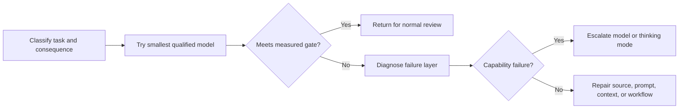

# Направляйте возможности туда, где цена ошибки высока

> Выбор модели — не составление рейтинга, а распределение ресурсов с учётом качества, задержки, контекста и стоимости.

**Тип:** Изучение
**Языки:** Python
**Предварительные требования:** [Выбирайте наименьшую поверхность, достаточную для задачи](../../01-claude-product-and-model-landscape/), [Кеширование, ограничение частоты запросов и оптимизация стоимости](../../../../../phases/11-llm-engineering/11-caching-cost/)
**Время:** ~90 минут

## Цели обучения

- Оценивать стоимость токенов и рабочего процесса, не полагаясь на запомненную таблицу цен.
- Выбирать модель на основе измеренных качества, задержки и последствий ошибки.
- Объяснять недетерминированность сэмплирования и необходимость многократного оценивания для обоснования решения о выпуске.
- Выбирать настройки скорости, уровня усилий и режима рассуждения только после проверки актуальной информации о модели и платформе.
- Отличать сбой модели от ошибок промпта, контекста, источника и рабочего процесса.
- Использовать маршрутизацию, кеширование, пакетную обработку и ограничения вывода как отдельные рычаги оптимизации.

## Задача

Команда поддержки направляет каждый запрос самой мощной модели. Первый месяц кажется успешным. Качество высокое, но время ответа нестабильно, а расходы в четыре раза превышают прогноз.

Руководитель переводит все запросы на самую быструю модель. Расходы снижаются. Но теперь в сводках по эскалациям пропускаются исключения, а в сложных случаях возврата средств выдаются уверенные, но неполные рекомендации.

В обоих вариантах названия моделей используются как политика. Ни один из них не описывает саму работу.

Производственное решение начинается с оценки цены ошибки. Опечатка во внутреннем мозговом штурме обходится дёшево. Пропущенное исключение при принятии решения о возврате средств — дороже. Выбор модели, промпта, контекста, качество источников и процесс проверки должны отражать эту разницу.

## Концепция

### Токены — мера рабочей нагрузки

Модели обрабатывают токены, а не страницы или слова. К входным токенам относятся инструкции, история диалога, предоставленные документы, определения инструментов и найденные материалы. К выходным токенам относятся ответ и, в зависимости от продукта или API, вычисления, связанные с рассуждением, либо другие тарифицируемые единицы, указанные в актуальных тарифах.

При планировании разделяйте входные и выходные данные на четыре категории:

```text
total input = stable instructions + task input + retrieved knowledge + prior turns
total output = requested answer + structured metadata
```

Не объединяйте все входные данные в одно число. Для стабильных инструкций может быть полезно кеширование. Найденные сведения можно отсеивать. Предыдущие реплики можно сводить в краткое резюме или удалять. Входные данные самой задачи обычно удалить нельзя.

### Сначала используйте переменные, а не актуальные цены

Цены меняются, а основная формула остаётся прежней:

```text
request cost = input_tokens / 1,000,000 x input_rate
             + output_tokens / 1,000,000 x output_rate
             + tool or feature charges
```

Для рабочего процесса:

```text
workflow cost = request cost x requests per case x cases per month
              + review cost
              + failure and rework cost
```

Проверка и доработка имеют значение. Более дешёвая модель, которая вдвое увеличивает объём ручных исправлений, может оказаться дорогим вариантом.

Рассмотрим условную, неактуальную тарифную сетку. В модели A ввод стоит 1 единицу, а вывод — 5; в модели B — 3 и 15 соответственно. Один случай использует 20 000 входных и 2 000 выходных токенов. Каждый вызов модели B стоит втрое дороже. Если модель A успешно обрабатывает 98 процентов случаев первичного разбора и сложные случаи можно выявить, направляйте обычные задачи модели A, а оставшуюся неопределённую часть эскалируйте. Если сложные случаи нельзя безопасно выявить, схема маршрутизации не завершена.

### Для качества нужен порог, а не субъективное впечатление

До тестирования моделей определите минимально приемлемый результат. Полезные критерии включают:

- Наличие обязательных фактов.
- Отсутствие неподтверждённых утверждений.
- Соблюдение инструкций.
- Валидность схемы вывода.
- Задержку ниже предельной для рабочего процесса.
- Время ручного исправления ниже заданного порога.
- Сохранение механизмов безопасности и конфиденциальности.

Лучшая модель — самый дешёвый вариант, который с достаточным запасом проходит все обязательные пороги. Одного среднего показателя качества недостаточно. Модель может показывать хороший общий результат, но проваливать каждый пограничный случай с серьёзными последствиями.

### Сэмплирование создаёт распределение, а не точное воспроизведение

При генерации каждого токена языковая модель формирует распределение вероятностей возможных продолжений. Сэмплирование выбирает вариант из этого распределения. Настройка температуры в поддерживающих её моделях изменяет степень концентрации распределения. Она не превращает инференс модели в детерминированную функцию.

В официальной документации Anthropic API указано, что даже при нулевой температуре результат не становится полностью детерминированным. Одинаковые запросы могут давать разные результаты как через собственный API, так и в облачных сервисах партнёров. Закреплённый идентификатор модели стабилизирует веса модели, но в документации Anthropic по управлению версиями также сказано, что инфраструктура обслуживания, включая маршрутизацию, классификаторы безопасности и логику сэмплирования, может меняться.

Это меняет представление о достаточных доказательствах:

- Один успешный ответ доказывает лишь то, что успешным оказался этот конкретный ответ.
- Единственное среднее значение скрывает редкие сбои и различия между запусками.
- Детерминированные валидаторы могут проверять схему и арифметику, но не способны сделать генерацию детерминированной.
- Повторные испытания одной и той же задачи с одной версией выявляют минимальное качество, дисперсию, серьёзные сбои и хвостовую задержку.
- При изменении модели, промпта, инструмента, платформы или режима обслуживания требуется новое сравнение.

Для небольшого учебного упражнения выполняйте не менее трёх независимых запусков каждой конфигурации. Размер производственной выборки должен определяться наблюдаемыми риском и дисперсией, а не этим минимумом. Сравнивайте категории риска по отдельности и отдавайте предпочтение таким контрольным порогам, как минимальное качество в критических случаях и задержка p95, а не одному привлекательному среднему значению.

Элементы управления сэмплированием также относятся к изменяемым характеристикам продукта. Согласно проверенным 9 августа 2026 года актуальным рекомендациям Anthropic по Messages, Claude 4.7 и более новые версии отклоняют значения `temperature`, `top_p` или `top_k`, отличные от стандартных. Более старые поддерживаемые модели всё ещё могут принимать некоторые из них. Никогда не копируйте настройки сэмплирования из старого запроса, не сверившись с актуальной документацией модели и платформы.

### Определяйте уровень возникновения сбоя

Если результат неудовлетворителен, выясните, на каком уровне возник сбой:

1. **Ошибка требований:** критерии успеха не были определены.
2. **Ошибка источника:** нужный факт отсутствовал или устарел.
3. **Ошибка контекста:** релевантные данные были затеряны, усечены или смешаны с противоречащими материалами.
4. **Ошибка промпта:** инструкции или критерии вывода были неясными.
5. **Ошибка модели:** модели не хватило возможностей, несмотря на качественные входные данные и критерии.
6. **Ошибка рабочего процесса:** отсутствовали проверка, эскалация или нужное поведение инструмента.

Переход на более мощную модель помогает преимущественно с пятым уровнем. Он может на время скрыть остальные проблемы, что усложнит отладку системы.

### Задержка состоит из нескольких компонентов

Пользователи воспринимают не только общее время выполнения:

- Время до появления первого видимого результата.
- Время между передаваемыми потоковыми фрагментами.
- Общее время генерации.
- Время работы инструментов и поиска данных.
- Время согласования человеком.

Более мощная модель может сократить число повторных попыток, хотя каждый её вызов длится дольше. Модель меньшего размера может отвечать быстро, но требовать больше циклов. Измеряйте весь рабочий процесс.

### Маршрутизируйте по наблюдаемым ограничениям

Простая политика маршрутизации может распределять работу по трём направлениям:

| Направление | Пример | Политика |
|---|---|---|
| Типовое | Отформатировать предоставленное обновление | Быстрая модель, строгий шаблон |
| Неоднозначное | Сопоставить противоречащие заметки | Сбалансированная модель, требования к источникам |
| С серьёзными последствиями | Рекомендовать исключение | Мощная модель и обязательная проверка |

Сам классификатор тоже может ошибаться. По возможности используйте детерминированные сигналы: длину документа, тип задачи, метку конфиденциальности, запрашиваемое действие или явный выбор пользователя. Журналируйте решения о маршрутизации и проверяйте случаи ошибочного направления запросов.



### Кеширование, пакетная обработка и ограничения решают разные задачи

**Кеширование промптов** снижает стоимость и задержку повторной обработки стабильных префиксов промпта, если текущие модель и платформа его поддерживают. Оно не исправляет устаревшие инструкции.

**Семантическое кеширование** повторно использует предыдущий результат для достаточно похожего запроса. Для него нужна политика актуальности; оно рискованно для персонализированных, быстро меняющихся задач или задач с серьёзными последствиями.

**Пакетная обработка** позволяет снизить стоимость и повысить пропускную способность за счёт увеличения времени ответа. Она подходит для фоновых задач вроде ночной классификации или массового извлечения данных, но не для интерактивной работы, когда пользователь ждёт ответа.

**Ограничения вывода** предотвращают излишне длинные ответы. Но если установить их ниже требований задачи, результат будет усечён. Запрашивайте минимальный полезный объём вывода и проверяйте его полноту.

**Отсечение контекста** удаляет нерелевантные входные данные до того, как они повлияют на стоимость и отвлекут модель. Больше контекста не означает автоматически больше знаний.

### Конфигурация — это привязанный ко времени набор параметров

Выбор модели — лишь один из параметров конфигурации:

| Параметр | Что он изменяет | Что измерять |
|---|---|---|
| Модель | Базовые возможности, цену, поддерживаемые функции и жизненный цикл | Качество по категориям риска, стоимость, задержку, совместимость |
| Скорость | Скорость обслуживания там, где поддерживается быстрый режим, часто за дополнительную плату | Число выходных токенов в секунду, время до первого токена, задержку p95, стоимость принятого результата |
| Уровень усилий | Объём работы и расход токенов модели на текст, рассуждение и использование инструментов, если это поддерживается | Качество, число вызовов инструментов, выходные токены, задержку, стоимость |
| Режим рассуждения | Использует ли модель явное рассуждение и как распределяет на него ресурсы, если это поддерживается | Качество в сложных случаях, токены рассуждения, общий объём вывода, задержку, стоимость |
| Промпт и контракт вывода | Инструкции, границы доказательств, формат и запрошенную длину | Соблюдение инструкций, валидность схемы, время исправления |
| Сэмплирование | Управление случайностью генерации в моделях, которые по-прежнему его принимают | Различия результатов, серьёзные сбои, разнообразие стиля |

Согласно проверенному 9 августа 2026 года официальному обзору моделей, точными идентификаторами Claude API являются `claude-sonnet-5` и `claude-opus-5`. В Sonnet 5 адаптивное рассуждение включено по умолчанию, его можно отключить; модель поддерживает используемые в артефакте низкий и высокий уровни усилий. Opus 5 поддерживает адаптивное рассуждение и используемый в артефакте средний уровень усилий.

Быстрый режим доступен в более узком наборе случаев. В актуальной официальной документации перечислены Opus 5 и Opus 4.8, но не Sonnet 5; эта функция ограничена Claude API, включая Managed Agents, и недоступна на партнёрских платформах. Это исследовательская предварительная версия, для которой необходимы доступ, `speed: "fast"` и заголовок `anthropic-beta: fast-mode-2026-02-01`. В ней используется та же модель с более быстрым инференсом и повышенной стоимостью; более высокий интеллект не гарантируется. Доступность, поддержка и цены могут меняться независимо друг от друга.

Не встраивайте постоянную матрицу совместимости в код маршрутизации или учебные заметки. Перед каждым экспериментом:

1. Зафиксируйте точный идентификатор модели и платформу.
2. Откройте актуальные официальные страницы о поддержке моделей, режиме рассуждения, уровне усилий, скорости и ценах.
3. Пометьте каждую предлагаемую конфигурацию как `docs-supported` или `docs-unsupported`, указав дату и источник. Наличие поддержки в документации не доказывает, что вашей учётной записи предоставлен доступ к предварительной версии.
4. Не испытывайте неподдерживаемые сочетания и не предполагайте, что для них будет незаметно выбран резервный вариант.
5. Неоднократно запускайте поддерживаемые конфигурации на одном и том же наборе задач с одним и тем же контрольным порогом.

Если платформа позволяет, меняйте по одному параметру за раз. Если из-за ограничений поддержки приходится менять и модель, и скорость, называйте это альтернативным вариантом маршрутизации, а не доказательством того, что результат изменился только из-за скорости.

### Масштабированный экзаменационный балл — не процент

Согласно проверенным 9 августа 2026 года данным из FAQ по сертификации Anthropic, результаты представляются как масштабированный балл от 100 до 1 000, а минимальный проходной балл равен 720. Масштабирование позволяет сопоставлять варианты экзамена разной сложности.

Следовательно, 720 ни в коем случае не доказывает, что для прохождения нужно дать 72 процента правильных ответов. Проценты за тесты и пробные экзамены в этой программе — исходные результаты тренировочных заданий. Их нельзя преобразовать в официальный масштабированный балл или использовать для прогнозирования результата экзамена.

## Практическая реализация

Создайте бенчмарк выбора модели из десяти случаев для еженедельного операционного рабочего процесса.

- Четыре типовых случая форматирования и классификации.
- Три неоднозначных случая синтеза информации.
- Два случая с противоречащими исходными материалами.
- Один случай с серьёзными последствиями, который обязательно должен быть эскалирован человеку.

До запуска любой модели определите рубрику оценивания:

```json
{
  "required_facts": 4,
  "unsupported_claims_allowed": 0,
  "format_valid": true,
  "latency_seconds_max": 20,
  "human_correction_minutes_max": 3,
  "consequential_case_must_escalate": true
}
```

Сначала протестируйте самое компактное из подходящих семейств моделей. Запишите число входных и выходных токенов, задержку, оценку по рубрике и время исправления. Эскалируйте только неудачные случаи. Сравните маршрутизируемый рабочий процесс с отправкой всех десяти случаев более крупной модели.

Ваш отчёт должен отвечать на следующие вопросы:

- Какие случаи можно безопасно обрабатывать моделью меньшего размера?
- Какой наблюдаемый сигнал направляет случай на более высокий уровень?
- Какие сбои не были сбоями модели?
- Какую экономию при условном объёме обеспечивает маршрутизация?
- Что происходит, когда маршрутизатор не уверен?

Затем создайте артефакт испытаний режимов для одного неоднозначного случая или случая с серьёзными последствиями:

1. До получения результатов задайте минимальное качество, максимальную задержку p95, максимальную среднюю стоимость и минимальное число повторных запусков.
2. Предложите не менее трёх конфигураций, различающихся скоростью, уровнем усилий или режимом рассуждения.
3. Проверьте каждое точное сочетание модели и платформы по актуальной официальной документации. Сохраните одно документированное неподдерживаемое сочетание как отклонённый вариант.
4. Запустите каждую поддерживаемую конфигурацию не менее трёх раз с одинаковыми промптом, источниками, инструментами и рубрикой оценивания.
5. Для каждого запуска запишите качество, задержку, стоимость и отпечаток результата.
6. Сверьте минимальное качество, задержку p95 и среднюю стоимость с необработанными данными запусков.
7. Выберите самую дешёвую поддерживаемую конфигурацию, которая проходит все контрольные пороги.

Предоставленный артефакт сравнивает низкий и высокий уровни усилий, адаптивное и отключённое рассуждение, стандартное и быстрое обслуживание на одной модели, а также неподдерживаемое сочетание с быстрым режимом. Скорость `standard` в нём — нормализованная метка эксперимента, означающая отсутствие соответствующего поля в запросе. Для быстрой конфигурации отдельно указаны необходимые доступ к предварительной версии, поле запроса и бета-заголовок. Это привязанный к дате пример, а не пригодная для повторного использования таблица совместимости или доказательство наличия доступа у учётной записи.

## Интерактивная лабораторная работа

Используйте схему рисков, чтобы менять серьёзность последствий, неопределённость, обратимость и надёжность проверки. Она показывает скрытую цену ложного прохождения до того, как вы приступите к оптимизации расхода токенов.

```figure
02-responsible-ai-risk
```

## Практическая лабораторная работа

Запустите бенчмарк маршрутизации из десяти случаев. Измените случай с серьёзными последствиями так, чтобы он пропускал проверку, продублируйте идентификатор случая или неверно укажите стоимость после маршрутизации — и посмотрите, как завершится ошибкой детерминированная валидация. Затем удалите один повторный запуск режима, измените сверенное значение p95, попытайтесь применить документированный неподдерживаемый режим или выберите конфигурацию, не прошедшую ограничение стоимости. Исправьте доказательства, а не ослабляйте контрольный порог.

## Готовый артефакт

`outputs/model-routing-benchmark.json` сохраняет контракт маршрутизации десяти случаев для типовых, неоднозначных задач, задач с противоречащими источниками и задач с серьёзными последствиями. В нём содержатся измеряемые контрольные пороги, выбранные направления, оценки числа токенов, время проверки и сравнение маршрутизации с использованием более крупной модели для каждого случая.

`outputs/mode-trials.json` — прикладной артефакт конфигурации. В нём фиксируются подтверждения из актуальной документации, скорость, уровень усилий, режим рассуждения, требования к запросу для быстрого режима, результаты повторных измерений качества, задержка p95, средняя стоимость, неподдерживаемые сочетания, выбранный режим и условия повторного запуска.

Утверждения о поддержке датированы на основании официальной документации и имеют статус `docs-supported`, а не live-request-verified. Значения качества, задержки и стоимости — условные данные упражнения, а не результаты запусков у провайдера или бенчмарка. Замените их результатами повторных запусков на собственном наборе задач с использованием своей учётной записи.

## Проверка

Проверьте бенчмарк без обращения к провайдеру:

```bash
cd certifications/claude/lessons/02-model-selection-and-token-economics/code
python3 main.py
python3 -m unittest discover tests -v
```

Валидатор сохраняет исходные проверки бенчмарка и отдельно проверяет испытания режимов. Он требует актуальные официальные подтверждения поддержки, явную отметку об условном характере измерений, соблюдение требований к запросу для быстрого режима, не менее трёх повторных запусков каждого режима со статусом docs-supported, наблюдаемые отпечатки результатов, сверенные сводные данные, неопробованный вариант со статусом docs-unsupported и выбор самой дешёвой конфигурации, прошедшей все пороги. В нём нет жёстко заданных утверждений о том, какая будущая модель поддерживает тот или иной режим.

## Связь с итоговым проектом

Тест проверяет знания маршрутизации, определения уровня сбоя и расчёта стоимости. Используйте проверенный бенчмарк как доказательство выбора модели в итоговых проектах 29–32, а затем замените условные измерения результатами собственных репрезентативных случаев.

## Применение

Используйте следующую формулировку решения:

```text
For [task class], choose [model family or mode] because it clears [quality gate]
across [repeated runs] within [p95 latency and mean cost limit]. Escalate when
[observable condition], and require [review rule] when [consequence threshold].
Model, platform, speed, effort, and thinking support checked in official docs on [date].
```

Если всё обоснование сводится к фразе «она умнее», решение ещё не готово.

Перед запуском бенчмарка просмотрите актуальные страницы обзора моделей и цен. Сохраняйте точные идентификаторы моделей в результатах бенчмарка, а не в долгосрочной политике. Так изменение псевдонима модели не сможет незаметно обесценить ваши доказательства.

Сохраняйте неподдерживаемые конфигурации в протоколе решения, но не в производственных запросах. Зафиксированная причина отклонения объясняет, почему привлекательный режим не испытывался, и создаёт ясное условие для будущей проверки.

## Шаблоны решений для экзамена

- Исправьте отсутствующие критерии, источники и контекст, прежде чем платить за более мощную модель.
- Используйте самую компактную модель, которая проходит репрезентативный контрольный порог качества.
- Учитывайте стоимость ручных исправлений и сбоев, а не только цену токенов.
- Направляйте задачи с серьёзными последствиями или неоднозначные задачи на более высокий уровень по наблюдаемым сигналам.
- Используйте пакетную обработку, только если рабочий процесс допускает отложенное завершение.
- Кешируйте стабильные материалы, пригодные для повторного использования, только когда это допускают требования к актуальности и изоляции.
- Считайте возможности моделей, цены и ограничения фактами, привязанными к дате.
- Повторяйте вероятностные оценивания: низкая температура или закреплённый идентификатор модели не гарантируют идентичный результат.
- Сравнивайте скорость, уровень усилий и режим рассуждения как измеряемые параметры конфигурации, а не как уровни статуса.
- Считайте 720 масштабированным сертификационным баллом, а не исходным процентом.

## Распространённые ошибки

- Выбор по репутации семейства вместо бенчмарка задачи.
- Сравнение моделей на одном простом примере.
- Публикация среднего качества со скрытыми сбоями в критических случаях.
- Отнесение любого плохого результата к ограничениям модели.
- Добавление контекста до тех пор, пока стоимость и отвлекающие факторы не начнут расти вместе.
- Повторное использование кешированного результата после изменения исходного источника.
- Исключение времени проверки из модели стоимости.
- Маршрутизация с помощью непрозрачного классификатора без журнала аудита.
- Объявление промпта детерминированным на основании одного успешного запуска или низкой температуры.
- Копирование настроек скорости, уровня усилий, режима рассуждения или сэмплирования из другой модели либо платформы.
- Незаметный переход на менее мощный режим при неподдерживаемой конфигурации вместо безопасного отказа и фиксации несовместимости.
- Сравнение средней задержки с сокрытием хвоста, нарушающего целевой показатель для пользователя.
- Преобразование масштабированного проходного балла 720 в исходную цель 72 процента.

## Упражнения

1. Символически рассчитайте месячную стоимость рабочего процесса с 50 000 случаев и двумя уровнями моделей.
2. Сформулируйте три детерминированных сигнала маршрутизации для рабочего процесса поддержки.
3. Отнесите пять сбоев к проблемам требований, источника, контекста, промпта, модели или рабочего процесса.
4. Приведите пример задачи, для которой подходит пакетная обработка, и задачи, которая должна оставаться интерактивной.
5. Проверьте одну актуальную функцию режима рассуждения в официальной документации и запишите модель, платформу и дату.
6. Запустите одну конфигурацию три раза, сохраните отпечатки результатов и объясните, что осталось бы незамеченным при единственном запуске.
7. Найдите в официальной документации одно сочетание режимов, которое сейчас не поддерживается, и зафиксируйте его, не отправляя запрос.

## Ключевые термины

| Термин | Значение |
|---|---|
| Экономика токенов | Взаимосвязь входных и выходных данных, объёма запросов, тарифов моделей и стоимости рабочего процесса |
| Контрольный порог качества | Измеримый порог, который должна пройти рассматриваемая конфигурация |
| Маршрутизация | Выбор модели или направления выполнения по сигналам задачи |
| Эскалация | Передача неопределённой работы или работы с серьёзными последствиями более мощной модели либо на проверку человеку |
| Кеширование промптов | Повторное использование вычислений на стороне провайдера для стабильного содержимого промпта |
| Стоимость доработки | Усилия человека или машины, необходимые для исправления неудовлетворительного результата |
| Сэмплирование | Выбор генерируемых токенов из распределений вероятностей модели |
| Испытание режима | Повторное оценивание с привязкой к дате для одной точной конфигурации модели, платформы, скорости, уровня усилий и режима рассуждения |
| Хвостовая задержка | Высокопроцентильный показатель задержки, например p95, который выявляет медленные запросы, скрытые средним значением |
| Масштабированный балл | Преобразованный результат экзамена для сопоставления его вариантов, а не исходный процент правильных ответов |

## Дополнительные материалы

- [Обзор моделей](https://platform.claude.com/docs/en/about-claude/models/overview)
- [Справочник API по созданию Message](https://platform.claude.com/docs/en/api/messages/create)
- [Работа с Messages](https://platform.claude.com/docs/en/build-with-claude/working-with-messages)
- [Идентификаторы и версии моделей](https://platform.claude.com/docs/en/about-claude/models/model-ids-and-versions)
- [Что нового в Claude Sonnet 5](https://platform.claude.com/docs/en/about-claude/models/whats-new-sonnet-5)
- [Что нового в Claude Opus 5](https://platform.claude.com/docs/en/about-claude/models/whats-new-opus-5)
- [Цены Claude](https://platform.claude.com/docs/en/about-claude/pricing)
- [Режим рассуждения](https://platform.claude.com/docs/en/build-with-claude/thinking)
- [Уровень усилий](https://platform.claude.com/docs/en/build-with-claude/effort)
- [Быстрый режим](https://platform.claude.com/docs/en/build-with-claude/fast-mode)
- [Кеширование промптов](https://platform.claude.com/docs/en/build-with-claude/prompt-caching)
- [Пакетная обработка](https://platform.claude.com/docs/en/build-with-claude/batch-processing)
- [FAQ по сертификации Anthropic](https://anthropic-partners.skilljar.com/page/faq-certifications)
- [Кеширование, ограничение частоты запросов и оптимизация стоимости](../../../../../phases/11-llm-engineering/11-caching-cost/)
- [Экономика кеширования промптов и семантического кеширования](../../../../../phases/17-infrastructure-and-production/14-prompt-semantic-caching/)
- [Маршрутизация моделей как средство снижения стоимости](../../../../../phases/17-infrastructure-and-production/16-model-routing/)
