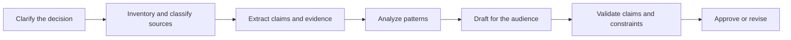

# Превратите запрос в проверяемый контракт

> Хороший промпт не просто описывает, что нужно написать. Он позволяет понять, как выглядит успех, ещё до начала генерации.

**Тип:** Обучение
**Языки:** Python
**Предварительные требования:** [Изучайте решения, а не термины](../../00-certification-strategy/), [Проектирование промптов](../../../../../phases/11-llm-engineering/01-prompt-engineering/)
**Время:** ~100 минут

## Цели обучения

- Преобразовывать неоднозначный запрос в ожидаемый результат, требования к доказательствам, ограничения и приёмочные проверки.
- Разбивать сложную работу на этапы, которые можно независимо проверять и корректировать.
- Выбирать между прямым промптом, примерами, структурированными разделами, итеративным улучшением и переработкой рабочего процесса.
- Диагностировать ошибки промптов, не считая каждый неудачный результат ошибкой модели.
- Создавать переиспользуемые пакеты промптов для важных рабочих процессов Claude.

## Проблема

Операционный руководитель просит Claude «изучить жалобы наших клиентов и подготовить убедительный отчёт для руководства с рекомендациями». Результат написан гладко. В нём есть четыре рекомендации, две тенденции и аккуратная таблица.

Но использовать его нельзя. Одна рекомендация противоречит политике компании. В таблице объединены два временных диапазона. Региональное исключение пропущено. Никто не может определить, какая жалоба подтверждает какое утверждение.

Команда пытается исправить результат тремя способами. Сначала добавляет требование «будь точным». Затем просит Claude «подумать тщательнее». Наконец, отправляет тот же запрос более мощной модели. Текст становится лучше, но проблема с доказательствами остаётся.

В запросе не были определены решение, допустимые источники, требуемый охват, аудитория и критерий обоснованности рекомендации. Claude оптимизировал результат под правдоподобный отчёт, поскольку правдоподобие было единственной явной целью.

## Концепция

### Создание промптов — это проектирование интерфейсов

Промпт — это интерфейс между намерением человека и поведением модели. Хорошие интерфейсы явно задают входные данные, ограничения, выходные данные и состояния ошибки. В слабых промптах все четыре составляющие скрыты за прилагательными вроде «отличный», «исчерпывающий» или «профессиональный».

Используйте следующий контракт:

1. **Результат:** Какое решение или действие должен поддерживать результат работы?
2. **Контекст:** Какие исходные сведения необходимы, а какие не имеют отношения к задаче?
3. **Задача:** Какое преобразование должен выполнить Claude?
4. **Доказательства:** Какие источники разрешено использовать для подтверждения утверждений и как следует обрабатывать пробелы в данных?
5. **Ограничения:** Чего допускать нельзя?
6. **Формат:** Какую точную структуру должен иметь результат?
7. **Приёмочные проверки:** Как человек или программа определит, пройдена ли проверка?

Порядок менее важен, чем наличие каждой составляющей. Разделы можно обозначать заголовками Markdown, тегами в стиле XML или другим последовательно применяемым разделителем. Структура помогает модели отличать данные от инструкций, а рецензентам — находить допущения.

```text
<outcome>
Prepare the weekly support review so the director can choose two process fixes.
</outcome>

<sources>
Use only the attached tickets and policy handbook. Treat the handbook as authoritative.
</sources>

<task>
Group complaints by root cause, quantify each group, and propose no more than three fixes.
</task>

<constraints>
Do not infer customer intent. Mark missing dates as unknown. Do not include names.
</constraints>

<output>
Return: executive summary, evidence table, recommendations, uncertainties.
</output>

<checks>
Every recommendation must cite at least two ticket IDs and one policy section.
</checks>
```

### Сначала критерии, потом формулировки

Оптимизировать промпт невозможно без цели. Сначала определите критерии, а затем улучшайте промпт, проверяя его на репрезентативных примерах.

Для отчёта по жалобам критерии могут быть такими:

- Каждая жалоба отнесена ровно к одной категории или явно помечена как неклассифицированная.
- Сумма по категориям совпадает с общим количеством во входных данных.
- Утверждения о политике содержат ссылку на предоставленный раздел.
- Рекомендации не выходят за пределы полномочий команды.
- Персональные данные отсутствуют.
- Неопределённость обозначена явно, а не превращена в догадку.

Требование «сделай лучше» не даёт диагностического сигнала. Требование «сумма по категориям должна совпадать с общим количеством» показывает, что именно не сработало и что нужно изменить.

### Декомпозируйте по границам проверки

Длительные задачи становятся безопаснее, когда каждый этап создаёт артефакт, который можно проверить. Полезный вариант декомпозиции выглядит так:



Это не то же самое, что произвольное разбиение по количеству страниц. На каждой границе должен решаться конкретный вопрос:

- Можно ли проверить набор источников до начала анализа?
- Можно ли проверить извлечённые факты до их интерпретации?
- Можно ли проверить рекомендации до публикации?

Выполняйте независимые задачи параллельно, только если они не зависят друг от друга. Классификацию категорий жалоб и извлечение ограничений из политики можно выполнять параллельно. К написанию рекомендаций можно приступать только после завершения обеих задач.

Последовательные этапы уменьшают число скрытых связей. Кроме того, они создают точку восстановления. Если данные извлечены неверно, вы исправляете этап извлечения, а не генерируете весь отчёт заново.

### Примеры показывают границы

Промпты с несколькими примерами (few-shot prompting) полезны, когда правило трудно сформулировать или когда формат должен соблюдаться в точности. Хороший пример показывает границу принятия решения, а не только очевидные случаи.

Для меток тональности не стоит приводить три однозначно положительных примера. Добавьте неоднозначную жалобу, смешанное высказывание и случай с меткой «неизвестно». Объясните, почему применима каждая метка. Так модель узнает, что отличает категории друг от друга.

Примеры могут также непреднамеренно создавать правила. Если во всех демонстрациях упоминаются розничные клиенты, модель может решить, что лексика розничной торговли — часть задачи. Примеры должны быть разнообразными, минимальными и соответствовать письменным критериям.

### Осторожно назначайте роли

Промпты с ролями могут задавать точку зрения, например «действуй как специалист по проверке соответствия требованиям». Они не наделяют модель знаниями, полномочиями или доступом. Роль не может заменить текст политики, доказательства из источников или этап утверждения человеком.

Предпочитайте конкретную точку зрения:

```text
Review the draft from the perspective of the privacy owner.
Identify each sentence that exposes personal data, cite the applicable supplied policy,
and propose the smallest compliant revision.
```

Это можно проверить. А утверждение «Ты лучший в мире эксперт по конфиденциальности» — нельзя.

### Для итерации нужна гипотеза

При полезном итеративном улучшении изменяется одна значимая переменная, а эффект измеряется на небольшом наборе оценочных примеров. Например:

- Гипотеза: обязательная таблица соответствия утверждений и доказательств сократит число необоснованных рекомендаций.
- Гипотеза: если разместить политику перед обращениями, модель будет лучше обрабатывать исключения.
- Гипотеза: один контрпример улучшит классификацию смешанных случаев.

При сравнении вариантов промпта не меняйте оценочные примеры. Иначе вы не сможете отличить улучшение промпта от упрощения входных данных.

Если повторные изменения не помогают, перестаньте шлифовать формулировки. Причиной могут быть отсутствующие доказательства, противоречивые требования, избыточный контекст, недостаточные возможности модели или небезопасный рабочий процесс.

## Создание

### Шаг 1. Составьте карточку приёмки

Выберите одну регулярно выполняемую рабочую задачу. Перед написанием промпта составьте краткую карточку приёмки:

```text
Decision supported:
Primary reader:
Authoritative sources:
Required facts:
Forbidden content or actions:
Output structure:
Pass conditions:
Escalation conditions:
```

Каждое условие прохождения должно быть наблюдаемым. «Профессионально» — ненаблюдаемое условие. «Не содержит необъяснённых сокращений и начинается с резюме из трёх предложений» — наблюдаемое.

### Шаг 2. Создайте иерархию источников

Противоречия между источниками — обычное явление. Укажите Claude, какой источник имеет приоритет.

```text
Authority order:
1. Approved policy handbook dated 2026-07-01
2. Current operating procedure
3. Ticket notes

If sources conflict, report the conflict. Do not silently choose the newer or longer text.
```

Актуальность и авторитетность — не одно и то же. Недавнее сообщение в чате не отменяет автоматически утверждённую политику.

### Шаг 3. Спроектируйте этапы

Для каждого этапа определите входные данные, результат и контрольное условие:

| Этап | Входные данные | Результат | Контрольное условие |
|---|---|---|---|
| Приём задачи | Запрос и перечень источников | Карточка границ задачи | Ответственное лицо подтверждает решение и срок |
| Извлечение | Утверждённые источники | Строки соответствия утверждений и доказательств | Обязательные поля заполнены |
| Анализ | Проверенные строки | Закономерности и исключения | Суммы совпадают |
| Черновик | Утверждённый анализ | Отчёт, подготовленный для аудитории | Проверки формата и границ задачи пройдены |
| Проверка | Черновик и источники | Замечания и исправления | Замечания высокого риска устранены |

Эта таблица — спецификация рабочего процесса. Промпт для каждого этапа может оставаться короче и точнее, чем один гигантский промпт.

### Шаг 4. Задайте поведение при неопределённости

Укажите Claude, что делать при отсутствии доказательств:

```text
If a required fact is unavailable, write "Not established from supplied sources."
List the missing source and explain which conclusion cannot be made.
Do not estimate a number unless the task explicitly permits estimation.
```

Отказ от вывода — это предусмотренный результат, а не дефект модели.

### Шаг 5. Проверьте на состязательных примерах

Создайте как минимум пять примеров:

- Обычный запрос с полным набором доказательств.
- Запрос, в котором отсутствует один обязательный источник.
- Два противоречащих друг другу источника.
- Инструкция, скрытая в содержимом источника.
- Запрос, выходящий за пределы полномочий пользователя.

Для каждого примера зафиксируйте успешное или неуспешное прохождение по карточке приёмки. Не полагайтесь на одну впечатляющую демонстрацию.

## Интерактивная лаборатория

Используйте схему контракта промпта, чтобы по отдельности редактировать результат, доказательства, ограничения, форму вывода и проверки. Пройдите контрольные условия этапов, чтобы понять, почему при отсутствии источника анализ следует остановить, а не просто лучше форматировать описание неопределённости.

```figure
03-prompt-contract
```

## Практическая лаборатория

Запустите оценщик контракта и удалите одну приёмочную проверку, один уровень источников, одно контрольное условие этапа или один состязательный пример. Исправьте конкретную ошибку, не добавляя расплывчатых формулировок в промпт.

## Готовый артефакт

`outputs/prompt-contract-packet.json` — заполненный контракт для анализа жалоб. Он содержит все семь частей контракта, порядок авторитетности источников, пять состязательных оценочных примеров, явно заданное поведение при отказе от вывода и контрольные условия для отдельных этапов.

## Проверка

Проверьте его локально:

```bash
cd certifications/claude/lessons/03-prompting-and-task-decomposition/code
python3 main.py
python3 -m unittest discover tests -v
```

Валидатор отклоняет расплывчатые критерии прохождения, отсутствие порядка авторитетности, поведения при эскалации или набора оценочных примеров, в котором нет обычного случая, случая с отсутствующим источником, конфликтом, инъекцией и несанкционированным запросом.

## Связь с итоговым проектом

Тест проверяет проектирование контрактов, декомпозицию, иерархию доказательств и отказ от вывода. Используйте проверенный пакет в итоговых проектах с 29-го по 32-й как версионируемый промпт и приёмочный контракт для создаваемого вами рабочего процесса.

## Применение

### Алгоритм принятия решений на экзамене

В вопросах со сценариями действуйте в следующем порядке:

1. Определите ожидаемый результат.
2. Найдите отсутствующее требование или доказательство.
3. Предпочтите исправление, которое делает ошибку наблюдаемой.
4. При серьёзных последствиях сохраняйте явно заданную границу, требующую вмешательства человека или применения политики.
5. Переходите к более мощной модели только после устранения причин, связанных с промптом, контекстом и рабочим процессом.

Лучший ответ обычно улучшает контракт или рабочий процесс. И почти никогда не заключается в добавлении расплывчатого прилагательного.

### Распространённые ловушки

- **Один промпт на весь проект:** в сложной работе нет точек проверки.
- **Больше деталей без иерархии:** более длинный промпт может содержать больше противоречий.
- **Роль как источник полномочий:** роль не создаёт достоверных фактов и не предоставляет разрешений.
- **Примеры без пограничных случаев:** модель усваивает простой шаблон, но не распознаёт границу.
- **Зависимость от цепочки рассуждений:** требование предоставить скрытый текст рассуждений не заменяет проверяемые промежуточные артефакты.
- **Переход к более мощной модели как первая мера:** более широкие возможности не компенсируют отсутствие политики.
- **Бесконечные исправления в диалоге:** для переиспользуемой задачи нужны версионируемые инструкции и оценочные примеры.

### Упражнения

1. Перепишите запрос «Подготовь резюме для руководства» в виде контракта промпта из семи частей.
2. Возьмите задачу из пяти шагов и определите, какие шаги можно выполнять параллельно. Объясните каждую зависимость.
3. Создайте три примера для метки категории: однозначный, пограничный и требующий отказа от вывода.
4. Разработайте пять оценочных примеров для своего промпта, включая противоречивые доказательства и несанкционированный запрос.
5. Проанализируйте недавний неудачный результат и отнесите ошибку к одной из категорий: требование, источник, контекст, промпт, модель или рабочий процесс.

## Ключевые термины

- **Критерий приёмки:** наблюдаемое условие, которому должен соответствовать результат.
- **Декомпозиция:** разбиение работы на этапы с явно заданными зависимостями и результатами.
- **Промпт с несколькими примерами (few-shot prompting):** предоставление примеров, демонстрирующих требуемую задачу или границу.
- **Контракт промпта:** структурированное описание результата, контекста, задачи, доказательств, ограничений, формата и проверок.
- **Иерархия источников:** правило, определяющее, какие доказательства считаются авторитетными при конфликте источников.
- **Отказ от вывода:** явный отказ делать вывод при недостатке доказательств или полномочий.
- **Граница проверки:** точка, в которой промежуточный артефакт можно проверить до продолжения работы.

## Дополнительные материалы

- [Anthropic: обзор проектирования промптов](https://platform.claude.com/docs/en/build-with-claude/prompt-engineering/overview)
- [Anthropic: рекомендации по созданию промптов](https://platform.claude.com/docs/en/build-with-claude/prompt-engineering/claude-4-best-practices)
- [Anthropic: определение критериев успеха и создание оцениваний](https://platform.claude.com/docs/en/test-and-evaluate/develop-tests)
- [AI Engineering from Scratch: промпты с несколькими примерами и цепочка рассуждений](../../../../../phases/11-llm-engineering/02-few-shot-cot/)
- [AI Engineering from Scratch: паттерны рабочих процессов Anthropic](../../../../../phases/14-agent-engineering/12-anthropic-workflow-patterns/)

Официальное поведение продуктов и рекомендации по созданию промптов для конкретных моделей могут меняться. Приведённые выше ссылки были проверены 2026-08-08. Сверьтесь с актуальной документацией Anthropic, прежде чем зафиксировать промпт для промышленного использования или изучать возможность, относящуюся к конкретному выпуску.
