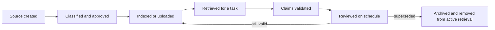

# Помещайте каждый факт в подходящий тип контекста

> Контекст — это временное внимание. Знания — поддерживаемые в актуальном состоянии свидетельства. Память обеспечивает непрерывность. Кеширование позволяет повторно использовать данные. Их смешение приводит к уверенным ответам на основе устаревшей информации.

**Тип:** Learn
**Языки:** Python
**Предварительные требования:** [Превратите запрос в проверяемый контракт](../../03-prompting-and-task-decomposition/), [Проектирование контекста](../../../../../phases/11-llm-engineering/05-context-engineering/)
**Время:** ~105 минут

## Цели обучения

- Различать контекст текущего чата, Project instructions, Project knowledge, память, коннекторы, поиск и кеширование промптов API.
- Выбирать, что сохранять, находить, обобщать, обновлять или отбрасывать.
- Создать реестр источников с метаданными об авторитетности, владельце, конфиденциальности и актуальности.
- Снизить перегрузку контекста, не удаляя необходимые свидетельства.
- Объяснять, какие особенности работы продуктов Claude могут меняться и должны проверяться по актуальной документации.

## Проблема

Команда создаёт Claude Project для квартального планирования. В него загружают файлы политик, заметки со встреч, выгрузки данных о продажах и старую дорожную карту продукта. Кроме того, команда добавляет Project instructions: «Используйте последний утверждённый план».

Три месяца спустя Claude рекомендует дату запуска из старой дорожной карты. Эта дата присутствует в Project knowledge, встречается в нескольких архивных заметках со встреч и противоречит более новому решению, которое хранится в системе, доступной через коннектор. Ответ звучит уверенно, поскольку в контексте содержатся многократно повторяющиеся свидетельства в пользу неверного ответа.

Команда называет это галлюцинацией. Но в основном это сбой в управлении знаниями. Участники команды отнеслись к Project как к хранилищу документов, к памяти — как к авторитетному источнику, а к поиску — как к гарантии истины.

Больший объём контекста не означает более качественный контекст. Надёжная система знает, какие факты временны, какие авторитетны и кто отвечает за поддержание их актуальности.

## Концепция

### Семь механизмов для семи задач

Claude может получать или повторно использовать информацию с помощью нескольких механизмов. Их точная доступность, ограничения и названия могут меняться в зависимости от тарифного плана и продукта. Устойчивое различие между ними заключается в их назначении.

| Механизм | Основная задача | Главный риск |
|---|---|---|
| Контекст текущего чата | Сохранять ход текущего разговора | Старые реплики занимают внимание или создают противоречия |
| Project instructions | Задавать многократно используемые правила поведения и ограничения | Общие инструкции устаревают или становятся неоднозначными |
| Project knowledge | Предоставлять поддерживаемый набор справочных материалов | У файлов нет владельцев или контроля актуальности |
| Память | Сохранять полезную непрерывность между разговорами | Запомнённое предпочтение принимают за утверждённый факт |
| Коннекторы | Предоставлять доступ к внешней системе с учётом текущих разрешений | Разрешения источника, синхронизацию или актуальность понимают неверно |
| Поиск | Выбирать релевантные фрагменты из более крупного корпуса | Внешне релевантный текст неполон или недостаточно авторитетен |
| Кеширование промптов | Эффективно повторно использовать стабильные префиксы промптов API | Динамическое содержимое кешируется или инвалидация игнорируется |

Одна возможность может решать несколько задач, но эти различия помогают избежать категориальных ошибок. Память может напомнить Claude, что вы предпочитаете краткие отчёты. Она не должна незаметно становиться источником актуальной политики возврата средств. Коннектор может предоставить доступ к последней версии файла. Но это не доказывает, что файл утверждён.

### У контекста есть бюджет внимания

Большое контекстное окно увеличивает вместимость, а не достоверность. Каждый дополнительный документ усиливает конкуренцию за внимание и создаёт ещё одну возможность для противоречия.

Рассматривайте контекст как четыре слоя:

```text
context package = governing instructions
                + task-specific input
                + retrieved authoritative evidence
                + minimal continuity
```

Стабильные инструкции должны оставаться стабильными. Добавляйте только те входные данные задачи, которые нужны для текущего решения. Ищите свидетельства с учётом метаданных и правил авторитетности. Переносите предыдущую беседу только тогда, когда она влияет на текущую задачу.

В долгих разговорах часто накапливаются отброшенные планы, исправленные факты и эксперименты с форматированием. Начать новый разговор с проверенного резюме может быть безопаснее, чем бесконечно продолжать старый. Делайте обобщение только после того, как отделите решения от обсуждений.

### Поиск — это отбор, а не проверка

Поисковые системы обычно ранжируют фрагменты по релевантности. Релевантность не отвечает на следующие вопросы:

- Утверждён ли этот источник?
- Актуален ли он?
- Охватывает ли он правило целиком или содержит только выдержку?
- Противоречит ли ему более авторитетный источник?
- Разрешён ли этому пользователю доступ к источнику?

Добавьте метаданные к каждому источнику и выполняйте фильтрацию до проверки семантической релевантности или одновременно с ней. Минимальный реестр включает:

| Поле | Вопрос |
|---|---|
| ID источника | Можно ли по утверждению найти первоисточник? |
| Владелец | Кто отвечает за точность? |
| Авторитетность | Это политика, процедура, заметка или черновик? |
| Дата вступления в силу | Когда источник начал действовать? |
| Дата проверки | Когда его необходимо проверить снова? |
| Конфиденциальность | Кто может обрабатывать или просматривать его? |
| Заменяет | Какой более ранний источник больше не является авторитетным? |
| Теги поиска | Какие задачи и регионы он охватывает? |

Документы без владельца или даты проверки следует рассматривать как кандидатов на карантин, а не автоматически загружать в систему.

### Инструкции и знания — не одно и то же

Инструкции описывают поведение. Знания предоставляют свидетельства.

Пример инструкции:

```text
For refund questions, cite the governing section and expose regional conflicts.
```

Знания должны содержать саму утверждённую политику возврата средств. Если поместить текст политики в поведенческие инструкции, его будет сложнее поддерживать. Если же поместить поведенческие правила в случайные файлы знаний, их легко не заметить.

Разрешение конфликтов между Project instructions и запросом пользователя или предоставленным источником зависит от иерархии инструкций продукта и политики организации. Не выдумывайте иерархию. Протестируйте фактический интерфейс и задокументируйте ожидаемый приоритет.

### Память обеспечивает непрерывность, но не является системой учёта

Память полезна для стабильных предпочтений и долгосрочного контекста: предпочитаемого тона, повторяющихся целей или самого факта существования проекта. Она становится опасной, когда запомнённое утверждение принимается за актуальную рабочую информацию.

Прежде чем полагаться на память, задайте три вопроса:

1. Мог ли этот факт измениться?
2. Есть ли авторитетный источник, который легко проверить?
3. Каковы последствия, если запомнённый факт неверен?

Если расхождение с актуальными данными возможно, а последствия значимы, выполните проверку. В рабочем процессе помечайте контекст, полученный из памяти, и сохраняйте ссылки на фактический эталонный источник.

### Кеширование промптов — экономический механизм

Кеширование промптов API может сократить повторную обработку стабильного префикса. Оно не повышает достоверность и не создаёт долговременную память.

Размещайте повторно используемое содержимое перед динамическим, если текущий механизм кеширования API поддерживает такой подход:

```text
stable prefix: system rules + tool definitions + approved reference corpus
dynamic suffix: user request + fresh retrieval + current state
```

Для кеширования подходят большие, часто повторяющиеся и стабильные данные. Плохие кандидаты меняются с каждым запросом или содержат данные, которые не должны сохраняться за пределами разрешённой для них области.

Срок жизни кеша, минимальные размеры, цены, поддержка моделей и механизм инвалидации — изменяемые характеристики продукта. Проверяйте их по актуальной официальной документации. Корректность архитектуры не должна зависеть от устаревшего кеша.

### Для качества контекста необходимо управление жизненным циклом

У знаний есть жизненный цикл:



Сложная работа заключается не в загрузке, а в утверждении, обновлении и выводе из использования.

## Практическая реализация

### Шаг 1: Проведите инвентаризацию контекста

Для одного повторяющегося рабочего процесса перечислите все источники информации и классифицируйте их:

```text
Behavioral instruction:
Task input:
Authoritative knowledge:
Reference knowledge:
Conversation continuity:
External connected data:
Temporary calculation:
```

Если один элемент попал в несколько категорий, определите, какая копия является авторитетной и как будут удаляться дубликаты.

### Шаг 2: Создайте реестр источников

Создайте простую таблицу или запись JSON для каждого источника:

```json
{
  "source_id": "refund-policy-uk",
  "owner": "customer-operations",
  "authority": "approved-policy",
  "effective_date": "2026-07-01",
  "review_date": "2026-10-01",
  "sensitivity": "internal",
  "supersedes": "refund-policy-uk-2025"
}
```

Даты здесь приведены для примера. Используйте даты из своих записей. Отклоняйте или помечайте источники, дата проверки которых уже прошла.

### Шаг 3: Спроектируйте поиск с возможностью отказа от ответа

Определите контракт поиска:

- Фильтруйте по разрешениям пользователя, региону, продукту и активному статусу.
- Отдавайте утверждённой политике приоритет перед заметками с обсуждений.
- Извлекайте достаточно окружающего текста, чтобы сохранить исключения.
- Возвращайте ID источников и даты вступления в силу вместе с фрагментами.
- Отказывайтесь от ответа, если источник требуемого уровня авторитетности отсутствует.
- Показывайте конфликты вместо того, чтобы незаметно объединять противоречащие данные.

Протестируйте обычный случай, устаревший источник, несоответствие разрешений, конфликт и вопрос за пределами области применения.

### Шаг 4: Рассчитайте бюджет промпта

Измерьте или оцените каждый раздел контекста. Если промпт перегружен, сокращайте его в следующем порядке:

1. Удалите дублирующиеся и заменённые материалы.
2. Исключите не относящиеся к задаче реплики разговора.
3. Извлекайте более узкие авторитетные разделы, сохраняя достаточный окружающий контекст.
4. Замените историю обсуждения проверенной записью о решении.
5. Разделите задачу по границе, на которой выполняется проверка.

Не начинайте с удаления ограничений безопасности или необходимых свидетельств.

### Шаг 5: Организуйте сопровождение

Назначьте владельца и периодичность:

| Ресурс | Владелец | Условие проверки | Правило вывода из использования |
|---|---|---|---|
| Project instructions | Владелец рабочего процесса | Изменение процесса | Заменить старую версию |
| Знания о политике | Владелец политики | Утверждение или дата проверки | Удалить заменённую копию |
| Поисковый индекс | Владелец платформы | Обновление источника | Переиндексировать и проверить |
| Набор для оценивания | Владелец качества | Новый класс сбоев | Добавить репрезентативный случай |

Управление знаниями — часть продукта, а не обслуживание после запуска.

## Интерактивная лабораторная работа

Используйте схему контекста и кеша, чтобы изменять размер стабильного префикса, объём запросов, долю попаданий в кеш, актуальность источников и поведение инвалидации. Сопоставьте экономию с границей корректности: попадание в кеш полезно, только пока повторно используемый префикс остаётся утверждённым.

```figure
04-context-cache
```

## Практическая лабораторная работа

Запустите планировщик контекста. Попробуйте кешировать динамический источник с данными аккаунта, повторно активировать заменённую политику без нового утверждения или превысить бюджет промпта. Средство выполнения должно ставить правила корректности и жизненного цикла выше экономии от кеширования.

## Готовый артефакт

`outputs/context-registry.json` — заполненный реестр источников для рабочего процесса возврата средств. В нём отдельно представлены поведенческие инструкции, утверждённая политика, заменённый черновик, контекст разговора и динамические данные из подключённой системы. Он также содержит бюджет промпта и явную политику кеширования.

## Проверка

Проверьте реестр:

```bash
cd certifications/claude/lessons/04-context-knowledge-memory-and-caching/code
python3 main.py
python3 -m unittest discover tests -v
```

Валидатор проверяет уникальность ID источников, даты в формате ISO, наличие владельцев, авторитетность, активный или заменённый статус, итоговые значения бюджета, а также то, что в кешируемый префикс входят только стабильные источники без секретных данных.

## Связь с итоговым проектом

Тест проверяет понимание авторитетности источников, ограничений поиска, пригодности для кеширования и решений о сбросе контекста. Используйте реестр и политику кеширования в итоговых проектах с 29 по 32 как артефакт происхождения данных и бюджета контекста.

## Применение

### Схема принятия решений на экзамене

Если в сценарии упоминаются повторяющаяся работа, устаревшие ответы или недостающий контекст:

1. Определите, относится ли недостающий элемент к поведению, свидетельствам, непрерывности или внешним данным.
2. Поместите его в механизм, предназначенный для этой задачи.
3. Добавьте средства контроля авторитетности, актуальности, конфиденциальности и владения.
4. Протестируйте сбои поиска и проверки разрешений.
5. Используйте кеширование только после обеспечения корректности.

### Распространённые ошибки

- **Загрузить всё:** объём увеличивает число противоречий и стоимость сопровождения.
- **Память как истина:** непрерывность ошибочно принимают за эталонный источник.
- **Коннектор как подтверждение:** доступ к файлу ошибочно принимают за доказательство его авторитетности.
- **Поиск как доказательство:** релевантный фрагмент принимают без проверки происхождения или полноты.
- **Один бесконечный чат:** исправленный и отброшенный контекст остаётся активным.
- **Кеш как память:** от оптимизации API ожидают сохранения долговременного состояния пользователя.
- **Отсутствие механизма вывода из использования:** заменённые файлы навсегда остаются доступными для поиска.

### Упражнения

1. Распределите десять элементов реального рабочего процесса по семи механизмам.
2. Создайте реестр для пяти источников и определите, какие из них не должны участвовать в активном поиске.
3. Перепишите перегруженный промпт, используя четырёхслойный пакет контекста.
4. Спроектируйте пять тестов сбоев поиска, включая устаревшие свидетельства и несанкционированный доступ.
5. Решите, что сохранить, обобщить или отбросить в конце рабочей недели проекта. Объясните каждое решение.

## Ключевые термины

- **Контекст:** информация, доступная модели для текущего запроса.
- **Project instructions:** многократно используемые указания по поведению, связанные с Claude Project.
- **Project knowledge:** справочные материалы, связанные с Project.
- **Память:** поддерживаемая продуктом непрерывность между разговорами с учётом текущих особенностей работы этой функции.
- **Коннектор:** интеграция, которая предоставляет внешние данные или возможности в соответствии с настроенными разрешениями.
- **Поиск:** выбор релевантных запросу материалов из более крупного корпуса.
- **Кеширование промптов:** повторное использование подходящего содержимого промпта для сокращения повторной обработки API.
- **Эталонный источник:** авторитетная система или документ, содержащие факт.
- **Актуальность:** соответствие информации текущему состоянию, достаточное для её использования по назначению.

## Дополнительные материалы

- [Справочный центр Anthropic: что такое Projects?](https://support.claude.com/en/articles/9517075-what-are-projects)
- [Справочный центр Anthropic: используйте поиск по чатам и память Claude, чтобы опираться на предыдущий контекст](https://support.claude.com/en/articles/11817273-use-claude-s-chat-search-and-memory-to-build-on-previous-context)
- [Справочный центр Anthropic: используйте коннекторы, чтобы расширить возможности Claude](https://support.claude.com/en/articles/11176164-use-connectors-to-extend-claude-s-capabilities)
- [Anthropic: кеширование промптов](https://platform.claude.com/docs/en/build-with-claude/prompt-caching)
- [Инженерия ИИ с нуля: генерация с дополнением поиском](../../../../../phases/11-llm-engineering/06-rag/)
- [Инженерия ИИ с нуля: память и состояние репозитория](../../../../../phases/14-agent-engineering/34-repo-memory-and-state/)

Названия, доступность, ограничения, правила хранения и цены Projects, памяти, коннекторов, режимов поиска и кеширования промптов могут меняться. Эти источники проверены 2026-08-08. Перед развёртыванием или подготовкой к экзамену сверяйтесь с актуальной официальной документацией по продуктам и конфиденциальности.
