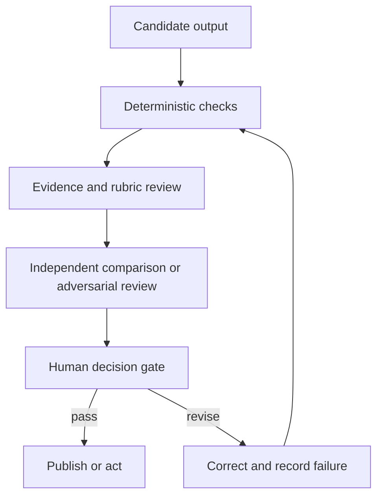

# Проверяйте утверждение, а не уверенность

> Беглость текста — это качество подачи. Валидация — это свидетельство того, что результат может безопасно выполнять свою задачу.

**Тип:** Обучение
**Языки:** Python
**Предварительные требования:** [Превратите запрос в проверяемый контракт](../../03-prompting-and-task-decomposition/), [Поместите каждый факт в контекст подходящего типа](../../04-context-knowledge-memory-and-caching/), [Оценивание и тестирование](../../../../../phases/11-llm-engineering/10-evaluation/)
**Время:** ~115 минут

## Цели обучения

- Разработать критерии для конкретной задачи, охватывающие точность, полноту, согласованность, соответствие аудитории, предвзятость и формат.
- Прослеживать значимые утверждения до авторитетных свидетельств.
- Сочетать детерминированные проверки, оценивание по рубрике, независимую проверку и человеческое суждение.
- Диагностировать галлюцинации, пропуски, противоречия, нарушения области действия и ошибки цитирования.
- Диагностировать неожиданный результат с учётом ограничений возможностей модели, прежде чем выбирать способ исправления.
- Превращать сбои в рабочей среде в постоянные тестовые случаи для оценивания.

## Проблема

Claude составляет еженедельную сводку для руководства на основе данных клиентов и внутренних политик. У сводки убедительное вступление, лаконичные рекомендации и ссылки в каждом разделе. Руководство одобряет на её основании изменение политики.

Позже аналитик обнаруживает три проблемы. Одна ссылка ведёт на документ, в котором упоминается тема, но который не подтверждает утверждение. Небольшой сегмент клиентов исчез при агрегации. Одна из рекомендаций выходит за пределы полномочий команды.

Документ выглядел проверенным благодаря ссылкам и профессиональному тону. Но никто не проверил охват, логическое следование и область допустимых действий.

Именно поэтому оценивание результатов — самая крупная предметная область в программе Claude Certified Associate. Полезный рабочий процесс Claude не заканчивается с появлением текста. Он заканчивается, когда результат проходит проверки, соразмерные его последствиям.

## Концепция

### Начните с назначения результата

Критерии оценивания должны соответствовать решению, для поддержки которого предназначен результат. Для списка идей и документа, подаваемого регулятору, нужны разные свидетельства и проверки.

В качестве отправной точки используйте шесть аспектов:

1. **Точность:** Подтверждены ли фактические утверждения и верны ли расчёты?
2. **Полнота:** Присутствуют ли обязательные элементы, группы, исключения и оговорки?
3. **Согласованность:** Согласуются ли друг с другом разделы, числа, метки и рекомендации?
4. **Соответствие аудитории:** Может ли целевой читатель понять результат и действовать на его основе?
5. **Справедливость и безопасность:** Не привносит ли результат необоснованную предвзятость, не раскрывает ли данные и не выходит ли за рамки политики?
6. **Соответствие формату:** Выполняет ли он структурные требования для людей и систем?

Это категории, а не оценки. Преобразуйте их в наблюдаемые проверки.

Слабый критерий:

```text
The report is accurate and complete.
```

Проверяемые критерии:

```text
Every quantitative claim must reconcile with the supplied dataset.
Every recommendation must cite at least one supporting finding and one governing constraint.
All seven operating regions must appear or be marked "no data."
The summary must state the two largest uncertainties.
```

### Прослеживайте утверждения до свидетельств

Ссылки — это указатели. Валидация устанавливает, подтверждает ли указанное свидетельство конкретное утверждение.

Создайте матрицу «утверждение — свидетельство»:

| Идентификатор утверждения | Утверждение | Источник | Тип подтверждения | Авторитетность | Результат проверки |
|---|---|---|---|---|---|
| C-01 | Число возвратов в северном регионе выросло | строки 120-184 набора данных | прямой расчёт | первичные данные | пройдено |
| C-02 | Обучение вызвало изменение | запись интервью 7 | предположение | отдельное свидетельство | не пройдено |
| C-03 | Для возврата средств требуется одобрение | политика 4.2 | прямая цитата | утверждённая политика | пройдено |

Матрица разделяет четыре распространённых вопроса:

- Существует ли источник?
- Авторитетен ли он для этого утверждения?
- Следует ли утверждение из него логически, а не просто относится к обсуждаемой теме?
- Не является ли утверждение более сильным, чем свидетельство?

Отчёт может содержать корректные ссылки и при этом преувеличивать причинно-следственную связь. «Произошло после» не доказывает «вызвано этим».

### Диагностируйте свойство перед повторной попыткой

Неожиданный результат сам по себе не является полезным диагнозом. Обычная повторная попытка часто приводит к тому же сбою, поскольку не устраняет его причину.

Вводный курс Anthropic о возможностях систематизирует диагностику вокруг четырёх свойств модели. Используйте их как практическое дерево неисправностей, а не как четыре изолированные метки:

| Свойство | Признак сбоя | Целевое действие |
|---|---|---|
| Предсказание следующего токена | Ответ звучит гладко и правдоподобно, но не подтверждён | Основывайте значимые утверждения на предоставленных свидетельствах, требуйте отказа от ответа при их отсутствии и проверяйте логическое следование |
| Знания | Задача зависит от недавних, редких, закрытых или спорных фактов | Добавьте актуальные авторитетные источники и явно обозначьте неопределённость вместо того, чтобы полагаться на параметрическую память |
| Рабочая память | Важный контекст скрыт среди других данных, отсутствует в текущем сеансе или конкурирует с избыточным материалом | Извлекайте только релевантный контекст, разбивайте задачу, суммируйте состояние и проверяйте охват |
| Управляемость | Инструкции расплывчаты, противоречивы, чрезмерно длинны или не допускают проверки | Перепишите запрос в виде лаконичного контракта с приоритетами, примерами, ограничениями и приёмочными тестами |

Несколько свойств могут дать сбой одновременно. Длинный вопрос о политике может превысить полезный объём рабочей памяти и одновременно требовать фактов за пределами знаний модели. Зафиксируйте одно основное свойство, все способствующие свойства, свидетельства в пользу диагноза и исправление, направленное на каждую причину.

Необязательная проверка AI Fluency 4D дополняет это решение с человеческой стороны:

- **Делегирование (Delegation):** Решите, какую работу следует делегировать, а какие суждения должны оставаться за человеком.
- **Описание (Description):** Предоставьте контекст, цель, ограничения и критерии успеха, необходимые системе.
- **Критическая оценка (Discernment):** Оцените точность, полезность и уместность результата.
- **Добросовестность (Diligence):** Соблюдайте требования к конфиденциальности, атрибуции, политикам и ответственности на всех этапах рабочего процесса.

Эти проверки не заменяют оценивание для конкретной задачи. Они помогают выбрать подходящего оценщика и способ исправления, а не считать любой сбой следствием «плохого проектирования промптов».

### Используйте многоуровневую валидацию

Одного оценщика недостаточно. Сочетайте несколько уровней:



**Детерминированные проверки** — это код или точные правила. Используйте их для проверки схемы, обязательных полей, итогов по строкам, диапазонов, существования идентификаторов ссылок, запрещённых терминов и флагов разрешений.

**Проверка по рубрике** охватывает качества, которые требуют интерпретации, например сохранение ключевого исключения в кратком изложении. Модель может выставлять оценку по рубрике, но самого оценщика также нужно тестировать.

**Независимая или состязательная проверка** — это отдельный проход для поиска неподтверждённых утверждений, пропущенных групп, конфликтов и небезопасных рекомендаций. Независимость важна. Если попросить модель оценить собственную генерацию, возникнут коррелированные слепые зоны.

**Проверка человеком** отвечает за последствия, неоднозначные компромиссы и организационные полномочия. Человек не должен повторять каждую механическую проверку. Ему следует предоставить свидетельства, неопределённости, непройденные проверки и решение, требующее суждения.

### Подбирайте оценщика под свойство

Для каждого свойства используйте самого экономичного надёжного оценщика:

| Свойство | Предпочтительный первый оценщик |
|---|---|
| Корректный JSON | Парсер или валидатор схемы |
| Арифметический итог | Детерминированный расчёт |
| Точно заданные обязательные поля | Программная проверка условия |
| Сохранение смысла | Сравнение по рубрике |
| Подтверждение утверждения фрагментом | Проверка свидетельства с процитированным фрагментом |
| Уместный тон для руководства | Человек или протестированный оценщик по рубрике |
| Решение о справедливости с серьёзными последствиями | Проверка квалифицированным специалистом на основе политики |

Не просите LLM оценивать то, что код может установить точно. Не заставляйте код принимать зависящее от контекста этическое решение.

### Галлюцинация — не единственный вид сбоя

Классифицируйте дефект, прежде чем исправлять его:

- **Фабрикация:** Факт или источник выдуман.
- **Ошибочная атрибуция:** Реальное утверждение приписано неверному источнику.
- **Чрезмерный вывод:** Вывод сильнее, чем свидетельства.
- **Пропуск:** Обязательный факт, сегмент или исключение отсутствует.
- **Противоречие:** Две части результата не могут быть истинными одновременно.
- **Нарушение области действия:** Ответ выходит за пределы запроса или полномочий.
- **Устаревание:** Некогда верный факт больше не актуален.
- **Ошибка формата:** Следующая система не может обработать содержимое.

Разные дефекты требуют разных исправлений. При фабрикации могут потребоваться ограниченный набор источников и отказ от ответа. При пропуске — контрольный список охвата. При противоречии — проход для согласования. При ошибке формата — структурированный вывод и проверка парсером.

### Наборы для оценивания отражают риски

Полезный набор для оценивания содержит не только обычные примеры. Включите в него:

- Распространённые репрезентативные задачи.
- Важные пограничные случаи.
- Ранее наблюдавшиеся сбои.
- Отсутствующие и противоречащие друг другу свидетельства.
- Состязательные инструкции внутри исходного текста.
- Случаи, связанные с конфиденциальностью, справедливостью или несанкционированными действиями.
- Входные данные, близкие к ограничениям по длине и форматированию.

Отслеживайте результаты по группам риска. Совокупный показатель 95 процентов может скрывать долю успешных проверок 40 процентов для наиболее важных случаев.

Сохраняйте отложенный набор для крупных изменений промпта или модели. Если многократно настраивать рабочий процесс на каждом случае, он может запомнить форму тестов, не приобретя способности к обобщению.

### Сравнивайте результаты без предвзятости к бренду

При сравнении вариантов промпта или модели:

1. Используйте одинаковые случаи и критерии.
2. По возможности скрывайте, какая система создала каждый результат.
3. Рандомизируйте порядок показа.
4. Оценивайте отдельные аспекты до определения общего предпочтения.
5. Исследуйте расхождения между рецензентами.
6. Выполните достаточно повторных запусков, чтобы выявить нестабильность.

Один предпочтительный результат — лишь единичный пример. Решение о развёртывании требует распределения результатов по репрезентативным рискам.

## Создание

### Шаг 1: Определите критерии допуска к выпуску

Задайте критерии допуска на трёх уровнях:

```text
Blocker: unsupported high-impact claim, exposed restricted data, invalid total
Required: all regions covered, citations resolvable, recommendation within authority
Quality: concise summary, readable headings, minimal repetition
```

Блокирующая проблема препятствует публикации. Проблема качества может допускать публикацию с задачей на исправление — это зависит от политики. Такой подход не позволяет косметическим предпочтениям конкурировать со сбоями безопасности.

### Шаг 2: Создайте запись о валидации

Для каждого запуска фиксируйте:

```json
{
  "workflow_version": "brief-v3",
  "source_snapshot": "2026-W31",
  "checks": {
    "schema": "pass",
    "totals_reconcile": "pass",
    "claim_support": "fail",
    "privacy": "pass"
  },
  "failed_claims": ["C-08"],
  "uncertainties": ["West region sample incomplete"],
  "reviewer_decision": "revise"
}
```

Значения приведены для иллюстрации. В рабочей среде применяйте к журналам валидации правила хранения данных и конфиденциальности вашей организации.

Для неожиданного результата приложите краткую диагностику:

```json
{
  "primaryProperty": "knowledge",
  "contributingProperties": ["next-token-prediction"],
  "evidence": "The cited policy was published after the model's supplied source snapshot.",
  "targetedFix": "Retrieve the approved current policy and rerun claim-support checks.",
  "humanCompetency": "discernment"
}
```

Сама по себе метка бесполезна. Свидетельства и целевое исправление делают диагноз проверяемым.

### Шаг 3: Разделите генерацию и проверку

Передайте рецензенту черновик, критерии и исходные свидетельства. Не разрешайте ему молча переписывать результат.

```text
Return one row per finding:
claim_id | severity | evidence | criterion | proposed correction

If no supplied source supports a claim, mark it unsupported.
Do not invent replacement evidence.
```

Затем генератор сможет внести изменения на основе явного списка замечаний. Для аудита сохраняйте исходное замечание и исправление.

### Шаг 4: Откалибруйте оценщиков

Создайте примеры результатов, которые проходят проверку, находятся на границе и не проходят её. Попросите квалифицированных рецензентов присвоить им метки. Сравните решения автоматизированного оценщика с эталоном, подготовленным людьми.

Сначала исследуйте ложные допуски, поскольку из-за них выпускаются неудовлетворительные результаты. Затем исследуйте ложные отказы, поскольку они напрасно расходуют ресурсы рецензентов. Фиксируйте случаи, когда человеческие суждения обоснованно расходятся, вместо того чтобы добиваться искусственного согласия.

### Шаг 5: Замкните цикл

Каждый существенный сбой в рабочей среде должен породить хотя бы один устойчивый артефакт:

- Новый случай для оценивания.
- Более точный критерий.
- Детерминированную проверку.
- Исправление управления источниками.
- Изменение промпта или рабочего процесса.
- Сигнал мониторинга или правило эскалации.

Не ограничивайтесь исправлением отдельного отчёта. Улучшайте систему, которая его пропустила.

## Интерактивная лабораторная работа

Используйте конвейер обработки документов и изображений, чтобы исследовать каждое преобразование: от входных свидетельств к извлечённым полям, утверждениям, результатам валидации и решению о выпуске. Переключите состояние неудачного визуального извлечения или неподтверждённого утверждения и проследите, какой критерий должен заблокировать выпуск.

```figure
05-document-vision-pipeline
```

## Практическая лабораторная работа

Запустите оценщик выпуска для заполненной матрицы утверждений. Измените решение при блокирующей проблеме на публикацию, укажите для утверждения отсутствующий источник, поручите точные подсчёты модели-оценщику либо удалите одно свойство возможностей из диагностики неожиданного результата и убедитесь, что валидация выпуска завершается неудачно.

## Готовый артефакт

`outputs/claim-validation-record.json` — это заполненный пакет проверки с матрицей «утверждение — свидетельство», диагностикой возможностей по четырём свойствам, критериями допуска к выпуску, назначениями оценщиков, неопределённостями и итоговым решением `revise`. Он намеренно содержит одно неподтверждённое причинно-следственное утверждение, чтобы продемонстрировать путь блокировки.

## Проверка

Запустите детерминированные проверки:

```bash
cd certifications/claude/lessons/05-output-evaluation-and-validation/code
python3 main.py
python3 -m unittest discover tests -v
```

Валидатор доказывает, что идентификаторы утверждений уникальны, каждая ссылка на источник разрешается, диагностика возможностей содержит все четыре свойства и целевое исправление, для точных свойств используются детерминированные оценщики, а блокирующая ошибка не может привести к решению о публикации.

## Связь с итоговым проектом

Тест проверяет логическое следование, выбор оценщика, сбои в отдельных сегментах и обучение на регрессиях. Используйте этот пакет как свидетельства валидации и проверки для итоговых проектов с 29 по 32.

## Применение

### Подход к принятию решений на экзамене

На вопрос о том, как повысить качество результата, отвечайте следующим образом:

1. Определите назначение результата и его последствия.
2. Выберите явные критерии для конкретной задачи.
3. Используйте точные проверки для точных свойств.
4. Прослеживайте важные утверждения до авторитетных свидетельств.
5. Сохраняйте независимую проверку и проверку человеком для неоднозначных ситуаций и решений с серьёзными последствиями.
6. Добавляйте наблюдавшиеся сбои обратно в набор для оценивания.

### Распространённые ошибки

- **Беглость текста принимают за корректность:** Отточенный ответ может быть неверным.
- **Наличие ссылки принимают за подтверждение:** Из содержимого по ссылке утверждение может не следовать.
- **Единая совокупная оценка:** Критически важные сегменты риска исчезают в среднем значении.
- **Только самопроверка:** Генератор и рецензент разделяют предположения и пропуски.
- **LLM для точной арифметики:** Детерминированная проверка дешевле и надёжнее.
- **Проверка человеком без пакета материалов:** Рецензент получает текст, но не утверждения, свидетельства или результаты непройденных проверок.
- **Тестирование только успешных сценариев:** Отсутствующие, противоречивые, устаревшие и состязательные входные данные остаются незамеченными.
- **Исправление симптомов:** Отчёт редактируют, но случай сбоя так и не попадает в набор тестов.

### Упражнения

1. Преобразуйте пять субъективных целей качества в наблюдаемые критерии.
2. Постройте матрицу «утверждение — свидетельство» для одностраничного отчёта и отметьте чрезмерные выводы.
3. Назначьте для десяти проверок детерминированных оценщиков, оценщиков по рубрике, независимых оценщиков или людей.
4. Создайте набор для оценивания из четырёх обычных, трёх пограничных и трёх высокорисковых случаев.
5. Проведите слепое сравнение двух результатов и задокументируйте расхождения между рецензентами.

## Ключевые термины

- **Логическое следование (Entailment):** Действительно ли свидетельство подтверждает заявленное утверждение.
- **Набор для оценивания (Evaluation set):** Коллекция репрезентативных и ориентированных на риски случаев, используемая для измерения поведения.
- **Детерминированная проверка (Deterministic check):** Повторяемый программный тест с точно заданным ожидаемым свойством.
- **Оценщик по рубрике (Rubric grader):** Человек или модель, применяющие заданные качественные критерии.
- **Независимая проверка (Independent review):** Отдельный проход оценивания, который не опирается на самопроверку генератора.
- **Критерий допуска к выпуску (Release gate):** Условие, которое необходимо выполнить до публикации результата или действия на его основе.
- **Ложный допуск (False pass):** Некорректный результат, ошибочно принятый оценщиком.
- **Регрессия (Regression):** Поведение, которое прежде проходило проверку, но перестало после изменения.

## Дополнительные материалы

- [Anthropic: определение критериев успеха и построение оценивания](https://platform.claude.com/docs/en/test-and-evaluate/develop-tests)
- [Anthropic: инструмент оценивания](https://platform.claude.com/docs/en/test-and-evaluate/eval-tool)
- [Anthropic: снижение числа галлюцинаций](https://platform.claude.com/docs/en/test-and-evaluate/strengthen-guardrails/reduce-hallucinations)
- [Anthropic Academy: возможности и ограничения ИИ](https://anthropic.skilljar.com/ai-capabilities-and-limitations)
- [Anthropic Academy: основы AI Fluency Framework](https://anthropic.skilljar.com/ai-fluency-framework-foundations)
- [Инженерия ИИ с нуля: продвинутые RAG и оценивание](../../../../../phases/11-llm-engineering/07-advanced-rag/)
- [Инженерия ИИ с нуля: агент-рецензент](../../../../../phases/14-agent-engineering/39-reviewer-agent/)
- [Инженерия ИИ с нуля: критерии групповой, индивидуальной и контрфактической справедливости](../../../../../phases/18-ethics-safety-alignment/21-fairness-criteria-group-individual-counterfactual/)

Инструменты оценивания, поведение моделей и интерфейсы продуктов могут меняться. Эти официальные источники были проверены 2026-08-08. Повторно валидируйте оценщиков и пороговые значения при каждом изменении моделей, промптов, источников, инструментов или политики рабочего процесса.
