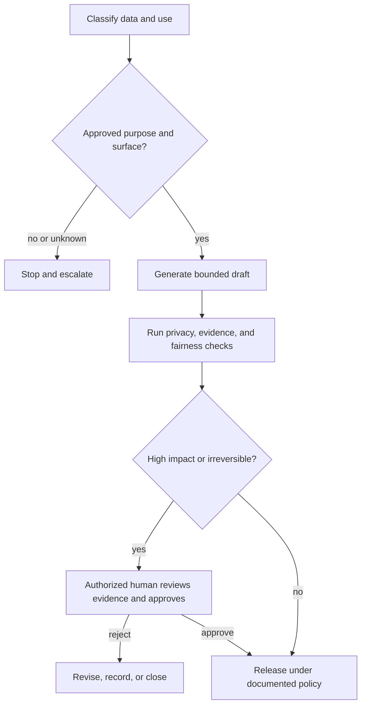

# Ограничьте возможности рамками полномочий

> Модель может выдать ответ, не имея разрешения просматривать данные, принимать решение или выполнять действие.

**Тип:** Обучение
**Языки:** Python
**Предварительные требования:** [Помещайте каждый факт в контекст нужного типа](../../04-context-knowledge-memory-and-caching/), [Проверяйте утверждение, а не уверенность](../../05-output-evaluation-and-validation/), [Защитные ограничения](../../../../../phases/11-llm-engineering/12-guardrails/)
**Время:** ~110 минут

## Цели обучения

- Классифицировать информацию и сценарии использования до выбора интерфейса Claude или рабочего процесса.
- Разделять технические возможности, разрешения организации и полномочия человека.
- Проектировать меры контроля конфиденциальности, безопасности, предвзятости, прозрачности, хранения данных и неправомерного использования.
- Предусматривать проверку человеком с учётом последствий, обратимости и неоднозначности.
- Создавать порядок реагирования на инциденты и эскалации небезопасного поведения или несоблюдения требований.

## Проблема

Менеджер по работе с клиентами хочет ускорить анализ клиентских аккаунтов. Он копирует стенограммы обращений в службу поддержки, выдержки из договоров и заметки о продлении в неодобренную личную учётную запись ИИ. Claude создаёт полезные сводки, поэтому менеджер просит его ранжировать клиентов по риску непродления и автоматически отправлять специальные предложения.

В этом рабочем процессе есть несколько нарушений ещё до рассмотрения качества вывода:

- Стенограммы содержат персональные и коммерчески конфиденциальные данные.
- Никто не проверил, какие условия продукта и правила хранения данных применимы.
- Ранжирование может привести к неодинаковому отношению к разным группам клиентов.
- У менеджера нет полномочий автоматически одобрять скидки.
- Источники, результаты проверки и отправленные сообщения нигде не фиксируются.

Добавление фразы «защищай конфиденциальность» в промпт не исправит систему. Управление определяет, кто, какие данные, для какой цели и в каком интерфейсе вправе использовать, какие меры контроля при этом обязательны и кто сохраняет ответственность.

## Концепция

### Классифицируйте данные до обработки

Начинайте с данных и решения, а не с модели.

Простая классификация в организации может выглядеть так:

| Класс | Пример | Типичное направление мер контроля |
|---|---|---|
| Общедоступные | Опубликованная документация | Проверка целостности и указания авторства |
| Внутренние | Неопубликованные заметки о процессах | Одобренная учётная запись и контроль доступа |
| Конфиденциальные | Договоры, сведения о клиентах | Минимально необходимые данные, строгие разрешения, проверка сроков хранения |
| Ограниченного доступа | Секреты, регулируемые записи, особо чувствительные идентификаторы | Запрет или требование использовать специально одобренный контролируемый рабочий процесс |

Это лишь примеры категорий, а не универсальные правила. Руководствуйтесь действующими политиками своей организации и рекомендациями юристов.

Классифицируйте и сценарий использования. Обобщение текста для проверки человеком отличается от определения права на услугу или отправки сообщения, имеющего обязательную силу. Даже данные низкой чувствительности могут использоваться для принятия решения с серьёзными последствиями.

При приёме сценария задайте пять вопросов:

1. Какие данные поступают в рабочий процесс?
2. Какая цель одобрена?
3. Кто вправе получать доступ к входным данным и результатам?
4. Какое решение или действие может последовать?
5. Как долго разрешено хранить записи?

Если ответ хотя бы на один вопрос неизвестен, правильным следующим шагом может быть уточнение политики, а не генерация.

### Возможности, разрешения и полномочия — разные понятия

Claude может быть технически способен составить предложение. У коннектора может быть разрешение на доступ к записи о клиенте. Ни то ни другое не означает, что рабочему процессу разрешено одобрить скидку или отправить сообщение.

Используйте три уровня проверки:

```text
Capability: Can the system perform the operation?
Permission: May this identity access the required data or tool?
Authority: May this role make or execute the decision?
```

Необходимо пройти все три уровня. Разрешения инструментов должны соответствовать принципу минимальных привилегий. Предоставляйте рабочему процессу доступ только к тем данным и действиям, которые требуются для одобренной цели. Если последствия имеют значение, разделяйте роли чтения, подготовки черновика, одобрения и выполнения.

### Минимизируйте данные и ограничивайте цель

Ограничение цели означает, что данные, одобренные для одной задачи, не становятся автоматически разрешёнными для другой. Стенограммы обращений в поддержку, собранные для устранения инцидентов, могут быть не одобрены для профилирования клиентов.

Минимизация данных требует использовать наименьший достаточный объём входных данных:

- Удаляйте имена, если личность не имеет значения.
- Заменяйте точные идентификаторы ссылками ограниченной области действия.
- Извлекайте релевантные разделы, а не записи целиком.
- Не помещайте секреты в промпты или журналы.
- Ограничивайте вывод полями, необходимыми для следующего шага.

Минимизация снижает риск раскрытия, размер промпта и вероятность случайного вторичного использования. Она не отменяет необходимости применять одобренный интерфейс и документированную политику.

### Условия продуктов могут меняться

Использование и хранение данных, региональная обработка, административные средства контроля и доступность возможностей могут различаться в потребительских продуктах, коммерческих предложениях, при работе через API, в разных тарифах и при разных настройках. Эти сведения могут меняться.

Не переносите предположения с одного интерфейса Claude на другой. Перед развёртыванием проверьте действующие официальные условия и договор вашей организации в отношении следующего:

- Используются ли отправленные данные и каким образом.
- Сроки хранения по умолчанию и возможности их настройки.
- Порядок удаления и предусмотренные законом исключения.
- Административный доступ и возможности аудита.
- Варианты региона обработки или места хранения данных.
- Обработка данных коннекторами и третьими сторонами.

Зафиксируйте источник и дату проверки в журнале решений по рабочему процессу.

### Проверка человеком нужна на границах принятия решений

Формулировка «человек в контуре» слишком расплывчата. Определите, что именно человек видит, какое решение принимает и что может остановить.

Усиливайте проверку, если высок хотя бы один из следующих факторов:

- Последствия для людей, финансов, прав, безопасности или репутации.
- Необратимость действия.
- Неоднозначность политики или доказательств.
- Новизна случая.
- Сложность обнаружения ошибки после выполнения действия.



Проверяющему нужны исходные доказательства, вывод модели, сведения о неопределённости, ограничения политики и предлагаемое действие. Одна лишь кнопка одобрения превращает надзор в формальность.

### Для обеспечения справедливости необходимо определить затрагиваемую группу и результат

Предвзятость нельзя устранить, просто попросив модель быть непредвзятой. Определите:

- Кого затрагивает решение?
- Какой результат предоставляется или в нём отказывают?
- Какие характеристики или их косвенные признаки могут привести к необоснованным различиям?
- Какое сравнение и какое пороговое значение будут использоваться?
- Кто обладает квалификацией для интерпретации результата?
- Как можно обжаловать или исправить результат?

Тестируйте по релевантным сегментам там, где это законно и уместно. Исследуйте как дисбаланс данных, так и устройство рабочего процесса. Проверка человеком способна воспроизвести ту же предвзятость, если проверяющие видят те же вводящие в заблуждение доказательства.

Для решений в сфере занятости, кредитования, жилья, здравоохранения, образования, государственных услуг или юридических прав привлекайте квалифицированных ответственных за политику, юридические и предметные вопросы. Этот курс не является юридической консультацией.

### Прозрачность должна помогать человеку, которого затрагивает решение

Полезная прозрачность объясняет:

- Что ИИ оказал существенную помощь, если политика требует раскрыть этот факт.
- Какая информация повлияла на результат.
- Какая неопределённость или какие ограничения сохраняются.
- Кто принял окончательное решение.
- Как запросить исправление или подать апелляцию.

Не раскрывайте скрытые системные инструкции, механизмы безопасности, персональные данные или конфиденциальные внутренние рассуждения ради удовлетворения расплывчатого требования прозрачности. Объясняйте процесс и доказательства на уровне, необходимом для подотчётности.

### Защитные ограничения требуют эшелонированной защиты

Инструкции в промпте — лишь один уровень. Надёжный рабочий процесс может включать:

- Классификацию входных данных и контроль доступа.
- Обнаружение секретов и персональных данных.
- Фильтры поиска по доверенным источникам.
- Списки разрешённых инструментов и учётные данные с ограниченной областью действия.
- Структурированный вывод и детерминированную валидацию.
- Проверки содержимого и соблюдения политик.
- Одобрение до выполнения действий с существенными последствиями.
- Ограничения частоты запросов и расходов.
- Журналы аудита с надлежащими сроками хранения.
- Мониторинг, откат и реагирование на инциденты.

Исходите из того, что содержимое источников может включать вредоносные инструкции. Рассматривайте найденные документы как данные, а не команды. Чётко отделяйте их от инструкций и не задавайте авторизацию инструментов в тексте модели.

### Для инцидентов нужен заранее подготовленный порядок действий

Инцидентом может быть раскрытие конфиденциальных данных, небезопасная рекомендация, несанкционированное использование инструментов, систематическая предвзятость, инъекция промпта или повторяющийся вывод без подтверждений.

Подготовьтесь до запуска:

1. **Обнаружение:** Определите сигналы и каналы для сообщений об инцидентах.
2. **Сдерживание:** Приостановите рабочий процесс, отзовите учётные данные или отключите путь выполнения действия.
3. **Сохранение:** Сохраните разрешённые доказательства, не распространяя чувствительные данные.
4. **Уведомление:** Соблюдайте организационные и юридические правила эскалации.
5. **Исправление:** Исправьте данные, разрешения, промпт, модель или меры контроля рабочего процесса.
6. **Обучение:** Добавьте оценочные примеры и мониторинг, чтобы предотвратить повторение.

Не обещайте удалить данные или отправить уведомление в определённый срок и не делайте юридических выводов без проверки действующей политики и применимой юрисдикции.

## Практическая реализация

### Шаг 1. Составьте карточку сценария использования

```text
Purpose:
Data classes:
Affected people:
Allowed sources:
Approved Claude surface:
Allowed outputs:
Prohibited actions:
Human decision owner:
Retention rule:
Incident owner:
```

Требуйте явного одобрения при изменении цели, класса данных или полномочий на выполнение действий.

### Шаг 2. Создайте карту мер контроля

Сопоставьте каждому риску превентивные, детективные и корректирующие меры контроля:

| Риск | Предотвращение | Обнаружение | Исправление |
|---|---|---|---|
| Раскрытие персональных данных | Минимизировать и редактировать входные данные | Сканировать промпты и вывод | Сдержать инцидент, уведомить, заменить данные доступа |
| Неподтверждённая рекомендация | Ограничить источники | Проверять соответствие утверждений доказательствам | Заблокировать и переработать |
| Несанкционированное действие | Использовать инструменты только для чтения и одобрение | Регистрировать попытки действий | Отозвать учётные данные и расследовать |
| Неодинаковое отношение | Определить критерии и репрезентативные тесты | Выполнять оценивание по сегментам | Переработать данные, политику или рабочий процесс |

Одна мера контроля редко охватывает весь путь возникновения сбоя.

### Шаг 3. Подготовьте пакет материалов для одобрения

Проверяющий должен получить:

- Предлагаемое решение или действие.
- Подтверждающие и противоречащие ему доказательства.
- Классификацию данных и политики.
- Результаты автоматических проверок.
- Сведения об известной неопределённости.
- Информацию об обратимости и затрагиваемой группе.
- Явные варианты: одобрить, отправить на доработку, отклонить или эскалировать.

Фиксируйте решение человека отдельно от рекомендации модели.

### Шаг 4. Проведите семинар по моделированию угроз

Протестируйте как минимум следующие случаи:

- Неожиданно появляются данные ограниченного доступа.
- Подключённый документ содержит инструкции игнорировать политику.
- Пользователь запрашивает использование за пределами одобренной цели.
- Модель предлагает действие за пределами полномочий роли.
- Оценивание выявляет различия для затрагиваемого сегмента.
- Сторонний коннектор становится недоступен или меняет поведение.

Зафиксируйте, какая мера контроля обнаруживает проблему и кто должен действовать дальше.

## Интерактивная лабораторная работа

С помощью диаграммы «уверенность — риск» изменяйте уверенность в доказательствах, серьёзность последствий, обратимость и размер затрагиваемой группы. Это взаимодействие показывает, почему вывод с высокой уверенностью всё равно может требовать проверки, если велики полномочия или последствия.

```figure
06-data-analysis-confidence
```

## Практическая лабораторная работа

Запустите оценщик управления. Увеличьте уверенность анализа до 1.0, уберите этап проверки человеком или разрешите недоверенному содержимому авторизовать изменение. Результат должен показать, что уверенность никогда не заменяет контроль полномочий и последствий.

## Готовый артефакт

`outputs/responsible-use-control-map.json` — заполненный пакет управления для помощи с продлением договоров с клиентами. Он включает одобренную цель, классы данных, запрещённые действия, превентивные, детективные и корректирующие меры контроля, пакет материалов для одобрения человеком и ответственного за инциденты.

## Проверка

Проверьте меры контроля:

```bash
cd certifications/claude/lessons/06-governance-safety-and-responsible-use/code
python3 main.py
python3 -m unittest discover tests -v
```

Валидатор отклоняет конфигурации, в которых отсутствуют уровни контроля, не назначены ответственные за инциденты, действия с серьёзными последствиями выполняются без одобрения уполномоченным человеком или недоверенное содержимое может авторизовать изменение.

## Связь с итоговыми заданиями

Тест проверяет понимание различий между возможностями и полномочиями, минимизации, условий конкретных интерфейсов, качества проверки, границ защиты от инъекций и реагирования на проблемы справедливости. Используйте этот пакет в капстоунах Associate 29 и Professional Architect 32 как свидетельство управления и одобрения.

## Применение

### Схема принятия решений на экзамене

В сценариях управления:

1. Классифицируйте данные, цель и последствия.
2. Проверьте действующие одобренные условия продукта и политику организации.
3. Минимизируйте входные данные и разрешения.
4. Отделите генерацию от полномочий принимать решение или действовать.
5. Предусмотрите содержательную проверку человеком перед действием с серьёзными последствиями или необратимым действием.
6. Обеспечьте сохранение доказательств, возможность аудита и обжалования, а также реагирование на инциденты.

### Распространённые ошибки

- **Управление только через промпт:** Одна фраза не может обеспечить соблюдение правил доступа или хранения данных.
- **Технический доступ как полномочие:** Разрешение коннектора ошибочно принимают за одобрение со стороны бизнеса.
- **Единое правило конфиденциальности для всех интерфейсов:** Поведение различается в зависимости от продукта и договора.
- **Собрать сейчас, найти применение потом:** Вторичная цель не одобрена.
- **Формальное одобрение человеком:** У проверяющего нет доказательств или полномочий отклонить решение.
- **Справедливость по инструкции:** Не определены затрагиваемая группа, метрика и порядок обжалования.
- **Максимальное журналирование:** Данные аудита создают новые риски для конфиденциальности и безопасности.
- **Уверенность в соответствии требованиям:** Рабочий процесс делает юридические заявления без квалифицированной проверки.

### Упражнения

1. Классифицируйте данные и действия в трёх рабочих процессах своей организации.
2. Создайте карточку сценария использования для одного процесса с участием Claude.
3. Составьте карту с превентивными, детективными и корректирующими мерами контроля.
4. Переработайте широкие разрешения коннектора по принципу минимальных привилегий.
5. Составьте пакет материалов для одобрения рекомендации с серьёзными последствиями.
6. Проведите кабинетное моделирование инцидента и определите первое действие по сдерживанию.

## Ключевые термины

- **Ограничение цели:** Использование данных только для одобренной цели.
- **Минимизация данных:** Обработка только информации, необходимой для этой цели.
- **Минимальные привилегии:** Предоставление минимально необходимых прав доступа и области разрешённых действий.
- **Этап принятия решения человеком:** Определённая точка, в которой уполномоченный человек может изучить, отклонить, изменить или одобрить решение.
- **Эшелонированная защита:** Несколько мер контроля на всём пути возникновения сбоя.
- **Инъекция промпта:** Попытка недоверенного содержимого изменить поведение модели или инструмента.
- **Порядок обжалования:** Процесс, позволяющий затронутому человеку оспорить или исправить результат.
- **Реагирование на инциденты:** Заранее подготовленные действия по обнаружению, сдерживанию, уведомлению, исправлению и учёту опыта.

## Дополнительные материалы

- [Anthropic: API и хранение данных](https://platform.claude.com/docs/en/manage-claude/api-and-data-retention)
- [Центр конфиденциальности Anthropic](https://privacy.anthropic.com/)
- [Центр доверия Anthropic](https://trust.anthropic.com/)
- [Anthropic: Responsible Scaling Policy](https://www.anthropic.com/responsible-scaling-policy)
- [Anthropic: предотвращение утечки промпта](https://platform.claude.com/docs/en/test-and-evaluate/strengthen-guardrails/reduce-prompt-leak)
- [AI Engineering from Scratch: безопасность, секреты и аудит](../../../../../phases/17-infrastructure-and-production/25-security-secrets-audit/)
- [AI Engineering from Scratch: фреймворки соответствия требованиям](../../../../../phases/17-infrastructure-and-production/26-compliance-frameworks/)
- [AI Engineering from Scratch: критерии справедливости](../../../../../phases/18-ethics-safety-alignment/21-fairness-criteria-group-individual-counterfactual/)

Требования к конфиденциальности и хранению данных, административные средства контроля, условия продуктов и регуляторные обязательства меняются и могут различаться в зависимости от интерфейса, тарифа, договора, местоположения и настроек. Эти официальные источники были проверены 2026-08-08. Перед обработкой чувствительных данных или автоматизацией решений с существенными последствиями проверьте действующие условия и получите квалифицированные рекомендации в своей организации.
