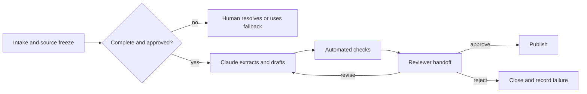

# Спроектируйте передачу работы до автоматизации

> Рабочий процесс не завершается, когда Claude заканчивает свою работу. Он завершается, когда следующий участник может проверить результат, принять решение, выполнить действие и восстановить процесс после сбоя.

**Тип:** Обучение
**Языки:** Python
**Предварительные требования:** [Проверяйте утверждение, а не уверенность](../../05-output-evaluation-and-validation/), [Ограничивайте полномочия при предоставлении возможностей](../../06-governance-safety-and-responsible-use/), [Паттерны рабочих процессов Anthropic](../../../../../phases/14-agent-engineering/12-anthropic-workflow-patterns/)
**Время:** ~105 минут

## Цели обучения

- Составлять карту текущего рабочего процесса, прежде чем выбирать, где должен участвовать Claude.
- Решать, следует ли помогать с выполнением шага рабочего процесса, автоматизировать или перепроектировать его либо отказаться от использования Claude.
- Задавать входные и выходные данные, ответственных, контрольные этапы, резервный вариант и требования к уровню обслуживания для каждого шага.
- Создавать пакеты передачи работы человеку, сохраняющие свидетельства, неопределённость и полномочия.
- Измерять ценность рабочего процесса с учётом затрат на проверку, устранение сбоев и сопровождение.

## Проблема

Команда продукта автоматизирует подготовку еженедельного отчёта о релизе. Claude читает сводки по задачам, создаёт черновик отчёта и каждую пятницу публикует его в общем канале.

Первые два отчёта экономят время. В третий попадает функция, которую исключили из объёма релиза. В четвёртом пропущена нерешённая проблема безопасности. Инженер, который раньше готовил отчёт, полагает, что теперь за проверку отвечает менеджер продукта. Менеджер продукта полагает, что автоматическая публикация уже была одобрена.

Команда автоматизировала создание текста, но устранила модель ответственности. Не определены ни момент фиксации источников, ни этап утверждения, ни путь эскалации, ни резервный вариант на случай неполных данных.

Успешный рабочий процесс — это не цепочка вызовов модели, а цепочка обязанностей с явно указанными свидетельствами и состоянием, которое можно восстановить.

## Концепция

### Сначала составьте карту текущего состояния

Прежде чем добавлять Claude, проследите, как работа выполняется на самом деле:

- Какое событие запускает процесс?
- Кто предоставляет каждые входные данные?
- Какие системы являются источниками достоверных данных?
- Где людям приходится выносить суждения?
- Какие исключения отнимают больше всего времени?
- Кто утверждает результат?
- Какое последующее действие выполняется?
- Как обнаруживают сбой и восстанавливают процесс?

Не документируйте только идеальный процесс. Проследите за несколькими реальными случаями. Неофициальные проверки часто заключают в себе критически важные знания. Если устранить их, не формализовав и не назначив ответственных, качество снизится, хотя новый рабочий процесс будет казаться эффективным.

### Выбирайте способ изменения процесса, а не только инструмент

Для каждого шага выберите один из четырёх вариантов:

1. **Помощь:** Claude предлагает варианты, создаёт сводку, извлекает данные или готовит черновик, а оператором остаётся человек.
2. **Автоматизация:** Система выполняет ограниченный, тщательно протестированный и обратимый шаг в рамках правил.
3. **Перепроектирование:** Текущий шаг — лишняя работа из-за некачественных входных данных или дублирующих систем, поэтому его следует удалить или перестроить.
4. **Отказ:** На этом шаге не следует использовать Claude, поскольку данные, последствия, неоднозначность или правила создают неприемлемый риск.

Автоматизация не всегда является признаком наивысшей зрелости. Если аналитики часами сверяют две противоречащие друг другу таблицы, ускоренное создание текста о результатах сверки не устраняет конфликт источников.

### Опишите каждый шаг как контракт

У каждого шага должны быть:

```text
Trigger:
Owner:
Allowed inputs and sources:
Transformation:
Output schema:
Pass criteria:
Timeout or service expectation:
Escalation condition:
Fallback:
Next owner:
```

Контракт позволяет независимо тестировать шаг и не даёт ответственности раствориться между системами.

Для шага извлечения данных для отчёта о релизе:

```text
Trigger: Thursday 15:00 source freeze
Owner: release coordinator
Inputs: approved tracker view and signed security status
Output: structured candidate items with source IDs and status
Pass: all required teams represented; unresolved fields marked
Escalate: missing security status or conflicting launch state
Fallback: coordinator uses the manual template
Next owner: product manager validates inclusion decisions
```

### Размещайте средства контроля с учётом последствий и обратимости

Глубину автоматизации определяют два вопроса:

1. Насколько серьёзными будут последствия, если результат окажется неверным?
2. Можно ли с небольшими затратами отменить действие до того, как оно причинит вред?

| Последствия | Обратимость | Направление проектирования |
|---|---|---|
| Незначительные | Да | Может подойти ограниченная автоматизация с мониторингом |
| Серьёзные | Да | Создать или подготовить результат, а перед публикацией потребовать проверки |
| Незначительные | Нет | Добавить подтверждение и аудит, сузить область применения |
| Серьёзные | Нет | Сохранить этап принятия решения уполномоченным человеком и надёжный резервный вариант |

Черновик, сохранённый для проверки, отличается от сообщения, отправленного тысячам клиентов. Рассматривайте полномочие на совершение действий как отдельную возможность.

### Выбирайте паттерн рабочего процесса с учётом зависимостей

В рабочих процессах с Claude часто используется небольшое число паттернов:

- **Цепочка промптов (prompt chaining):** Фиксированная последовательность, в которой можно проверить каждый этап.
- **Маршрутизация (routing):** Классификация работы и направление её по специализированному пути.
- **Распараллеливание (parallelization):** Независимое выполнение анализа с последующим согласованием результатов.
- **Оркестратор и исполнители (orchestrator-workers):** Координатор разбивает работу переменного состава на подзадачи и синтезирует результат.
- **Оценщик и оптимизатор (evaluator-optimizer):** Создание результата, его проверка по критериям и доработка до прохождения контрольного этапа или достижения установленного ограничения.

Отдавайте предпочтение простейшему паттерну, соответствующему работе. Для фиксированного отчёта из пяти этапов не нужен агент с открытым циклом выполнения. Рабочему процессу с маршрутизацией нужны наблюдаемые сигналы маршрутизации и резервный вариант для неоднозначных случаев.



### Передача работы — это отдельный продукт

Передача работы должна сводить к минимуму необходимость заново собирать информацию. Предоставьте следующему ответственному:

- Требуемое решение и срок его принятия.
- Область действия и версию рабочего процесса.
- Идентификаторы источников и сведения об актуальности.
- Предлагаемый результат.
- Список пройденных и непройденных проверок.
- Известные факторы неопределённости и противоречия.
- Уже выполненные действия.
- Возможные действия: одобрить, отправить на доработку, отклонить, эскалировать.
- Инструкции по переходу на резервный вариант и восстановлению.

Не прячьте критически важную оговорку в конце длинной стенограммы. Организуйте передачу работы вокруг требуемого решения.

Получатель должен понимать, какая ответственность остаётся за ним. «Пожалуйста, проверьте» — недостаточная формулировка. «Подтвердите, что элементы R-14 и R-19 разрешены к внешней публикации; все остальные проверки пройдены» — конкретная задача, по которой можно действовать.

### Сохраняйте состояние при сбоях

Длительные рабочие процессы дают сбои. Истекает время ожидания API, коннекторы возвращают неполные данные, проверяющие не соблюдают сроки, а входные данные меняются после генерации.

Создавайте контрольные точки на значимых границах:

- Снимок источников принят.
- Извлечение проверено.
- Версия черновика создана.
- Результаты проверки зафиксированы.
- Утверждение зафиксировано.
- Внешнее действие выполнено.

По возможности обеспечивайте идемпотентность повторных попыток. Повторная генерация черновика обычно безопасна. Повторная отправка или финансовая операция без ключа идемпотентности может причинить вред дважды.

Определите ручной резервный вариант до запуска. Если ни один действующий сотрудник не может выполнить резервную процедуру, такая отказоустойчивость существует лишь на бумаге.

### Измеряйте рабочий процесс, а не демонстрацию

Отслеживайте ценность и риск вместе:

```text
net value = time saved
          - human review time
          - correction and incident cost
          - platform and model cost
          - maintenance cost
```

К полезным операционным показателям относятся:

- Полное время выполнения.
- Время ожидания в очереди и проверки.
- Доля результатов, принятых с первой попытки.
- Доля ошибочно пройденных проверок с серьёзными последствиями.
- Частота эскалаций и переходов на резервный вариант.
- Объём доработок на один случай.
- Стоимость одного принятого результата.
- Сбои из-за неактуальности источников.
- Результаты исправлений и апелляций пользователей.

Ускорение этапа генерации может не сократить полное время выполнения, если проверка станет сложнее.

### Сообщайте об ограничениях с учётом заинтересованных сторон

Руководителям нужны ожидаемая ценность, границы риска и свидетельства готовности. Операторам нужны точные входные данные, признаки сбоев и шаги перехода на резервный вариант. Проверяющим нужны критерии и полномочия. Ответственным за безопасность и соблюдение правил нужны потоки данных, разрешения, порядок хранения и средства управления инцидентами.

Не выдавайте демонстрацию возможностей за свидетельство готовности к эксплуатации. Укажите, что и на каких случаях тестировалось, что остаётся в ведении людей и какие актуальные сведения о продукте необходимо проверить повторно.

## Практическая работа

### Шаг 1. Составьте карту одного реального случая

Изобразите текущий процесс с ролями и системами. Отметьте:

- Время ожидания.
- Циклы доработки.
- Точки вынесения суждений.
- Обращения к источникам достоверных данных.
- Внешние действия.
- Известные исключения.

Спросите оператора, какая неофициальная проверка предотвращает самую серьёзную ошибку.

### Шаг 2. Оцените возможные изменения

Для каждого шага выставьте оценку от 1 до 5:

| Фактор | Вопрос |
|---|---|
| Повторяемость | Повторяется ли одно и то же преобразование? |
| Чёткость | Можно ли сформулировать критерии прохождения? |
| Утверждение данных | Утверждены и контролируются ли входные данные? |
| Обратимость | Можно ли остановить или отменить ошибочное действие? |
| Обнаруживаемость | Будет ли сбой заметен до причинения вреда? |

Низкие оценки указывают, что вместо автоматизации лучше выбрать помощь, перепроектирование или отказ.

### Шаг 3. Составьте контракт будущего процесса

Определите каждый шаг, ответственного, контрольный этап, контрольную точку, резервный вариант и требования к уровню обслуживания. Явно опишите ручной путь. Затем попросите оператора, проверяющего и ответственного за соблюдение правил разобрать обычный случай и исключение.

### Шаг 4. Создайте пакет передачи работы

Используйте стабильный шаблон:

```text
Decision required:
Deadline and owner:
Workflow and source versions:
Candidate result:
Evidence:
Checks passed:
Checks failed:
Uncertainty:
Actions available:
Fallback:
```

Отклоняйте пакеты, в которых не указан обязательный блокирующий фактор или версия источника.

### Шаг 5. Проведите пилотный запуск в теневом режиме

Запустите Claude параллельно с существующим процессом, не разрешая ему выполнять внешнее действие. Сравните результаты и трудозатраты на проверку. Включите исключения, а не только простые случаи. Переходите к ограниченному запуску лишь после прохождения контрольных этапов и подготовки ответственных за инциденты.

## Интерактивная лабораторная работа

Используйте схему порога обязательной проверки, чтобы менять последствия, обратимость, неоднозначность и полноту свидетельств. По мере приближения к необратимому состоянию средство контроля должно переходить от ограниченной автоматизации к обязательной проверке.

```figure
07-human-review-threshold
```

## Практическая лабораторная работа

Запустите средство оценки передачи работы. Удалите из шага публикации ответственного, контрольную точку, резервный вариант или утверждение и посмотрите на контракт, не прошедший проверку. Затем устраните нерешённую проблему проверки и сравните рекомендуемое следующее действие.

## Готовый артефакт

`outputs/workflow-handoff-packet.json` — заполненное описание рабочего процесса подготовки отчёта о релизе с ответственными за шаги, контрольными этапами, контрольными точками, резервным вариантом, требованиями к уровню обслуживания и пакетом конкретных задач для проверяющего.

## Проверка

Проверьте рабочий процесс локально:

```bash
cd certifications/claude/lessons/07-workflow-design-and-human-handoffs/code
python3 main.py
python3 -m unittest discover tests -v
```

Валидатор проверяет, что для каждого шага указаны ответственный, контрольный этап, эскалация, резервный вариант и следующий ответственный; что для необратимой публикации требуется утверждение человеком; а также что в передаче работы названы непройденные проверки и доступные решения.

## Связь с итоговым проектом

Тест проверяет умение составлять карту текущего состояния, перепроектировать процесс, определять содержимое передачи работы, обеспечивать безопасность повторных попыток, распределять ответственность и оценивать готовность теневого режима. Отправьте проверенный пакет в качестве операционной передачи работы и передачи работы проверяющему для Associate capstone 29.

## Применение

### Порядок принятия решений на экзамене

Для сценариев с рабочими процессами:

1. Опишите текущее решение, свидетельства, роли и путь обработки исключений.
2. Устраните потери процесса до его автоматизации.
3. Выберите простейший паттерн, соответствующий зависимостям.
4. Сохраняйте полномочия человека на границах с серьёзными последствиями или необратимыми действиями.
5. Передавайте структурированный пакет со свидетельствами и непройденными проверками.
6. До запуска определите контрольную точку, резервный вариант, мониторинг и ответственность.

### Распространённые ошибки

- **Автоматизировать текст и устранить ответственного:** Никто не знает, кто утверждает результат.
- **Считать демонстрацию доказательством готовности к развёртыванию:** Обычные примеры скрывают исключения и эксплуатационные аспекты.
- **Использовать агента с открытым циклом для фиксированного процесса:** Сложность растёт без дополнительной ценности.
- **Распараллелить зависимые задачи:** Синтез начинается до проверки свидетельств.
- **Превратить участие человека в лозунг:** Нет ни пакета для проверки, ни полномочий отклонить результат.
- **Не зафиксировать источники:** Входные данные меняются во время утверждения результата.
- **Повторять все операции:** Необратимые действия могут выполниться дважды.
- **Использовать сэкономленное время как единственную метрику:** Затраты на проверку, исправление, устранение сбоев и сопровождение остаются без внимания.

### Упражнения

1. Составьте карту повторяющегося рабочего процесса и определите одну неофициальную проверку качества.
2. Классифицируйте каждый шаг: помощь, автоматизация, перепроектирование или отказ.
3. Составьте контракт шага для наиболее ценного кандидата.
4. Спроектируйте пакет передачи работы для проверяющего, у которого есть пять минут.
5. Проведите настольное моделирование сбоя: источник изменяется после утверждения, но до публикации.
6. Определите пять метрик, которые покажут, создаёт ли рабочий процесс чистую ценность.

## Ключевые термины

- **Карта текущего состояния (current-state map):** Представление того, как работа фактически выполняется сегодня.
- **Контракт шага (step contract):** Триггер, ответственный, входные данные, преобразование, выходные данные, контрольный этап, эскалация, резервный вариант и следующий ответственный для шага рабочего процесса.
- **Пакет передачи работы (handoff packet):** Структурированные сведения о состоянии и свидетельства, подготовленные для следующего ответственного.
- **Контрольная точка (checkpoint):** Надёжно сохранённая точка восстановления после проверенного этапа.
- **Идемпотентность (idempotency):** Свойство операции, благодаря которому её повторение не дублирует результат её выполнения.
- **Теневой режим (shadow mode):** Выполнение нового рабочего процесса без предоставления ему контроля над реальным результатом.
- **Резервный вариант (fallback):** Протестированный альтернативный путь, используемый, когда автоматизированный путь небезопасен или недоступен.
- **Момент фиксации источников (source cutoff):** Граница версий, определяющая, какие входные данные представляет результат.

## Дополнительные материалы

- [Anthropic: Создание эффективных агентов](https://www.anthropic.com/research/building-effective-agents)
- [Anthropic: Определение критериев успеха и разработка оценивания](https://platform.claude.com/docs/en/test-and-evaluate/develop-tests)
- [Инженерия ИИ с нуля: контракты области действия](../../../../../phases/14-agent-engineering/36-scope-contracts/)
- [Инженерия ИИ с нуля: контрольные этапы проверки](../../../../../phases/14-agent-engineering/38-verification-gates/)
- [Инженерия ИИ с нуля: передача работы между сеансами](../../../../../phases/14-agent-engineering/40-multi-session-handoff/)
- [Инженерия ИИ с нуля: сначала предложение, затем фиксация](../../../../../phases/15-autonomous-systems/15-propose-then-commit/)

Возможности продукта Claude, поведение коннекторов, возможности и ограничения моделей, а также стоимость могут меняться. Эти источники были проверены 2026-08-08. Ещё раз сверьтесь с актуальной официальной документацией и организационными средствами контроля, прежде чем переводить рабочий процесс из теневого режима в эксплуатацию.
