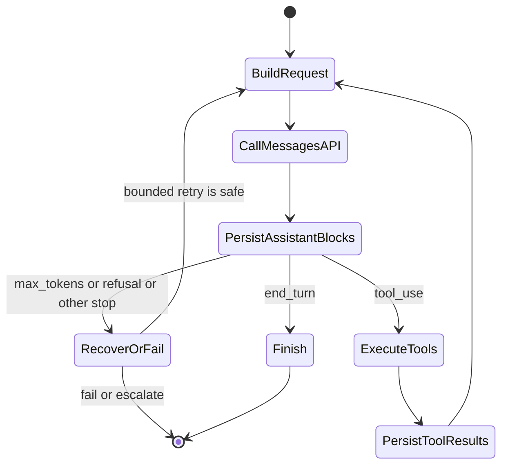

# Messages API — это конечный автомат

> API не запоминает ваш диалог. Это делает ваше приложение, и один неверно размещённый блок содержимого может нарушить весь цикл.

**Тип:** Build
**Языки:** Python
**Предварительные требования:** [Расходуйте возможности там, где цена ошибки высока](../../02-model-selection-and-token-economics/), [Превратите запрос в проверяемый контракт](../../03-prompting-and-task-decomposition/), [Помещайте каждый факт в контекст подходящего типа](../../04-context-knowledge-memory-and-caching/)
**Время:** ~120 минут

## Цели обучения

- Представлять запрос к Claude как явный переход состояния приложения
- Выбирать между SDK и низкоуровневым REST независимо от синхронного, потокового или пакетного режима доставки
- Формировать блоки содержимого с изображениями и документами, явно определяя границы ресурсов
- Сохранять типизированные блоки ответа и выбирать ветвь выполнения по `stop_reason`
- Обеспечивать надлежащую работу с сессиями, повторными попытками, тайм-аутами, сроками хранения и бюджетом контекста
- Тестировать полный жизненный цикл без действующего ключа API

## Сбой, который помогает понять протокол

Инженер отправляет следующую последовательность:

1. Пользователь спрашивает: «Где заказ A-17?»
2. Claude возвращает блок `tool_use` с идентификатором `toolu_01`.
3. Приложение запускает `lookup_order`.
4. Приложение отправляет в новом запросе только результат инструмента.

Второй запрос завершается ошибкой, либо Claude отвечает так, словно никогда не запрашивал инструмент.

Ничего загадочного не произошло. Messages API не хранит состояние. Клиент не отправил повторно сообщение ассистента с исходным блоком `tool_use`. `tool_result` — не самостоятельный факт. Он отвечает на конкретный запрос инструмента по идентификатору в последовательности диалога, которой управляет ваш код.

При работе с фреймворками это легко упустить, поскольку они поддерживают массив за вас. Для сертификации необходимо понимать происходящее под этим уровнем абстракции. Один раз реализуйте конечный автомат напрямую. После этого отлаживать любой SDK, агентный фреймворк и управляемую среду выполнения станет проще.

## Один запрос — один переход

Запрос передаёт модель, системные инструкции, сообщения, параметры управления токенами и необязательные возможности. Ответ содержит блоки содержимого, метаданные использования и причину остановки генерации. Что произойдёт дальше, решает ваше приложение.

```json
{
  "model": "<current-model-id>",
  "max_tokens": 800,
  "system": "Answer from verified order data only.",
  "messages": [
    {
      "role": "user",
      "content": "Where is order A-17?"
    }
  ]
}
```

Точные идентификаторы моделей и необязательные поля запроса меняются. Считайте их конфигурацией, явно фиксируйте версии там, где это позволяет платформа, и сверяйте их с актуальным [обзором моделей](https://platform.claude.com/docs/en/about-claude/models/overview). Неизменная часть контракта состоит в том, что клиент отправляет контекст и получает типизированный ответ.



Эта диаграмма полезнее, чем запоминание метода SDK. Каждая стрелка обозначает ответственность приложения. Соответствующее действие можно журналировать, тестировать, повторять или запрещать.

## Выберите два независимых шаблона доступа

Клиентская библиотека и способ завершения отвечают на разные вопросы. Выбирайте их независимо друг от друга.

| Клиент | Когда стоит выбрать | За что по-прежнему отвечаете вы |
|---|---|---|
| Официальный SDK | Ваш язык поддерживается, и вам нужны типизированные модели запросов и ответов, типизированные ошибки, управление заголовками, стандартные настройки повторных попыток, пагинация и вспомогательные средства для накопления потока | Состояние приложения, политика обработки `stop_reason`, безопасность повторных попыток, авторизация инструментов, журналирование и итоговая проверка |
| Низкоуровневый REST | Для среды выполнения нет поддерживаемого SDK, ограничения среды запрещают эту зависимость либо вам нужен собственный HTTP-транспорт или фикстура уровня протокола | Заголовки аутентификации и версии, типы JSON, кадрирование SSE, тайм-ауты, повторные попытки, сопоставление ошибок, совместимость с будущими версиями и закрытие соединений |

Для поддерживаемого языка в рабочей среде SDK — более безопасный вариант по умолчанию, поскольку он избавляет от низкоуровневой работы с протоколом, а не потому, что управляет жизненным циклом приложения. Низкоуровневый REST уместен, когда дополнительный контроль оправдывает дополнительную нагрузку по тестированию. В [руководстве по Python SDK](https://platform.claude.com/docs/en/cli-sdks-libraries/sdks/python) описаны синхронные и асинхронные клиенты, типизированные модели, вспомогательные средства потоковой передачи, стандартные настройки повторных попыток и доступ к необработанным ответам. [Обзор API](https://platform.claude.com/docs/en/api/overview) содержит непосредственный контракт HTTP.

Затем выберите, как будут поступать один или несколько результатов:

| Способ завершения | Для чего подходит лучше всего | Признак завершения | Для чего подходит плохо |
|---|---|---|---|
| Синхронное сообщение | Один интерактивный запрос, полный ответ на который требуется до продолжения работы | Один разобранный `Message` с обработанным `stop_reason` | Постепенное отображение или большие очереди фоновых заданий |
| Потоковое сообщение | Один интерактивный или длинный ответ, когда важны частичное отображение или время до первого токена | Накопленное содержимое, завершающее событие `message_stop` и итоговые метаданные сообщения | Необратимые действия на основе частичных изменений |
| Message Batch | Множество независимых запросов, которые могут завершиться позднее | Сопоставленный результат каждого элемента по стабильному `custom_id` после асинхронной обработки | Диалоговый цикл инструментов или обратная связь пользователю по каждому токену |

Асинхронный клиент SDK — не то же самое, что Message Batches. Он позволяет процессу конкурентно ожидать завершения обычных HTTP-операций. Message Batch — это асинхронная серверная рабочая нагрузка с сохранёнными входными данными и результатами, отдельными исходами для каждого элемента и последующим сопоставлением. В актуальном [руководстве по пакетной обработке](https://platform.claude.com/docs/en/build-with-claude/batch-processing) также указано, что порядок результатов не соответствует порядку отправки, поэтому идентификация выполняется по `custom_id`.

## Содержимое — это последовательность типизированных блоков

Не сводите ответ к `response.content[0].text`. Claude может вернуть несколько блоков в одном сообщении:

- `text` содержит предназначенный для пользователя или промежуточный текст.
- `tool_use` задаёт имя инструмента, передаёт структурированные входные данные и содержит уникальный идентификатор запроса.
- `thinking` может содержать данные расширенного рассуждения, когда эта возможность включена.
- Со временем возможности провайдера могут вводить дополнительные типы блоков.

Защитный код выбирает ветвь по `type`, явно обрабатывает поддерживаемые блоки и регистрирует неизвестные, не интерпретируя их молча как текст. Это важно при смене версий. Парсер, который предполагает наличие свойства `text` у каждого блока, превращает корректный запрос инструмента в пустой ответ.

Полный цикл вызова инструмента требует строгого порядка:

```json
[
  {
    "role": "user",
    "content": "Where is order A-17?"
  },
  {
    "role": "assistant",
    "content": [
      {
        "type": "tool_use",
        "id": "toolu_01",
        "name": "lookup_order",
        "input": {"id": "A-17"}
      }
    ]
  },
  {
    "role": "user",
    "content": [
      {
        "type": "tool_result",
        "tool_use_id": "toolu_01",
        "content": "{\"status\":\"ready\"}"
      }
    ]
  }
]
```

Сначала идёт запрос ассистента. За ним следует результат с ролью пользователя. Значение `tool_use_id` должно в точности совпадать с исходным идентификатором. Если одновременно поступило несколько вызовов инструментов, верните результат для каждого из них и сохраните соответствия.

## Причины остановки — это управляющие сигналы

В тексте может быть сказано «Сейчас проверю», хотя на самом деле ответ остановился для вызова инструмента. Текст может выглядеть завершённым, хотя генерация остановилась из-за ограничения по токенам. Выбирайте ветвь по сигналу протокола.

| Сигнал | Интерпретация приложением | Безопасная реакция |
|---|---|---|
| `end_turn` | Claude завершил текущий ход | Проверить и представить ответ |
| `tool_use` | Запрошен один или несколько клиентских инструментов | Проверить, авторизовать, выполнить, добавить результаты и продолжить |
| `max_tokens` | Настроенный бюджет вывода завершил генерацию | Считать вывод потенциально неполным; повторять запрос только по продуманному плану |
| `stop_sequence` | Настроенная последовательность завершила генерацию | Убедиться, что граница соответствует вашему контракту |
| `pause_turn` | Серверной операции может потребоваться продолжение | Следовать актуальному контракту продолжения для конкретной возможности |
| `refusal` | Модель отклонила запрос | Сохранить отказ и воспользоваться одобренным резервным вариантом или эскалацией |
| `model_context_window_exceeded` | Генерация заполнила контекстное окно модели | Считать ответ усечённым и пересмотреть бюджет контекста |

Примечание о продукте, проверено 2026-08-08: поддерживаемые причины остановки и требования к продолжению могут меняться. Актуальным источником истины служит раздел [Обработка причин остановки](https://platform.claude.com/docs/en/build-with-claude/handling-stop-reasons). При неизвестном значении код должен переходить в безопасное состояние с запретом действий и сохранять достаточно метаданных для диагностики.

Никогда не пишите `while stop_reason != "end_turn"`. Такой код превращает любое незнакомое состояние в очередной запрос и создаёт неуправляемые циклы. Реализуйте исчерпывающее ветвление с максимальным числом ходов, ограничением по общему времени выполнения и отдельными бюджетами для инструментов.

## Состоянием диалога управляет клиент

Сервис не хранит скрытый объект чата для Messages API. Каждый вызов получает контекст, который вы решили отправить. Это даёт вам контроль, но одновременно возлагает на вас ответственность за гигиену сессии.

Поддерживайте следующие границы:

1. **Изоляция пользователей.** Никогда не используйте массив сообщений одного арендатора для другого.
2. **Отделение системных данных.** Храните доверенные инструкции отдельно от недоверенного содержимого документов.
3. **Каноническое хранение.** Сохраняйте типизированные блоки, а не плоскую расшифровку диалога, по которой нельзя восстановить идентификаторы инструментов.
4. **Бюджетирование контекста.** Измеряйте рост входных данных и сокращайте их до достижения ограничения, сохраняя факты и неисполненные обязательства.
5. **Политика хранения.** Храните только то, что требуется продукту. Удаляйте секреты и чувствительные поля перед записью в журналы.
6. **Идемпотентность.** Повторная попытка после сетевой ошибки не должна повторно проводить платёж, отправлять письмо или выполнять развёртывание без стабильного ключа операции.

Если вы суммируете длинную сессию, сохраните активные запросы инструментов, ограничения пользователя, проверенные факты, нерешённые вопросы, состояние одобрения и ссылки на источники. Складное резюме, в котором потеряно указание «не отправлять», ошибочно с операционной точки зрения.

## Мультимодальные запросы — это типизированная передача ресурсов

Текст, изображения и документы должны находиться в одном упорядоченном массиве содержимого. Сформулируйте задачу перед ресурсами, используйте соответствующий типу данных тип блока и явно укажите источник.

```json
{
  "model": "<current-model-id>",
  "max_tokens": 400,
  "messages": [
    {
      "role": "user",
      "content": [
        {
          "type": "text",
          "text": "Compare the chart with the approved policy document."
        },
        {
          "type": "image",
          "source": {
            "type": "base64",
            "media_type": "image/png",
            "data": "<base64-image-bytes>"
          }
        },
        {
          "type": "document",
          "source": {
            "type": "file",
            "file_id": "<application-owned-file-id>"
          }
        }
      ]
    }
  ]
}
```

Для изображений можно использовать источники `base64`, `url` или `file` из Files API. Для PDF в блоках `document` можно использовать URL, base64 или источники Files API. Порядок блоков — часть промпта: размещайте инструкцию и сведения о доверии рядом с ресурсом, к которому они относятся. Актуальные ограничения для медиа и моделей приведены в разделах [Компьютерное зрение](https://platform.claude.com/docs/en/build-with-claude/vision) и [Поддержка PDF](https://platform.claude.com/docs/en/build-with-claude/pdf-support).

Files API меняет порядок повторного использования и хранения, но не смысл блока содержимого. Загрузите файл один раз, получите непрозрачный идентификатор `file_id` и вместо повторной отправки байтов ссылайтесь на него в последующих запросах Messages. Это удобно для PDF с политикой или изображения, которые многократно используются в разных запросах.

Примечание о продукте, проверено 2026-08-09: [Files API](https://platform.claude.com/docs/en/build-with-claude/files) находится на стадии бета-тестирования, и сейчас, когда Message ссылается на файл, используется бета-заголовок `files-api-2025-04-14`. Область видимости файлов ограничена рабочим пространством; после загрузки они неизменяемы и хранятся до удаления. На них может ссылаться любой ключ API из этого рабочего пространства. Считайте текущие заголовки, доступность платформы, ограничения и правила скачивания изменчивыми и проверяйте руководство перед реализацией.

| Источник | Данные, пересекающие границу | Ответственность за повторное использование и хранение |
|---|---|---|
| Встроенный base64 | Закодированные байты передаются в каждом запросе | Не журналировать полезную нагрузку; явно задавать сроки хранения запросов и ограничения размера |
| URL | Провайдер получает ресурс из удалённого источника | Авторизовать источник, избегать URL с секретами и учитывать журналы и доступность источника |
| `file_id` Files API | Идентификатор ссылается на байты, хранящиеся в рабочем пространстве API | Вносить принадлежащие приложению идентификаторы в список разрешённых, фиксировать владельца и назначение, обеспечивать изоляцию рабочих пространств и удалять данные по окончании срока хранения |

Наличие `file_id` не доказывает, что текущий арендатор вправе использовать файл. Свяжите его с записью приложения, содержащей арендатора, рабочее пространство, тип медиа, уровень чувствительности, хеш содержимого, время загрузки и срок удаления. Никогда не принимайте произвольный идентификатор от модели или пользователя и не пересылайте его напрямую. Не включайте необработанные байты изображений, текст PDF, подписанные URL и непрозрачные идентификаторы файлов в обычные трассировки; вместо этого журналируйте хеш содержимого и решение политики.

## Потоковая передача меняет доставку, а не смысл

Потоковая передача позволяет пользователю увидеть вывод до поступления полного сообщения. Она не отменяет необходимость собрать и проверить итоговый ответ.

Типичная обработка событий имеет следующий вид:

```python
text_parts = []

for event in stream:
    if event.type == "content_block_delta" and event.delta.type == "text_delta":
        text_parts.append(event.delta.text)
    elif event.type == "message_delta":
        final_stop_reason = event.delta.stop_reason
    elif event.type == "message_stop":
        complete = True
```

Показывайте предварительный текст, если это улучшает взаимодействие, но не запускайте необратимые действия из частичного потока. Входные данные инструмента также могут поступать постепенно. Буферизуйте их до завершения блока, однократно разберите, проверьте и лишь затем авторизуйте.

Обрыв соединения создаёт неопределённость. Отслеживайте, поступило ли полное завершающее событие. Если нет, пометьте попытку как незавершённую. Повторяйте запросы только для чтения, когда это безопасно. Перед повторным выполнением изменяющих операций обязательно проверяйте запись идемпотентности.

Актуальные типы событий и вспомогательные средства SDK описаны в разделе [Потоковая передача Messages](https://platform.claude.com/docs/en/build-with-claude/streaming).

## Пакетная обработка, кеширование и расширенное рассуждение решают разные задачи

Эти возможности часто смешивают, поскольку каждая из них влияет на стоимость или задержку. Однако их назначение различается.

**Message Batches** асинхронно обрабатывают множество независимых запросов. Они обменивают немедленное получение ответа на пропускную способность и выгодную экономику пакетной обработки. Используйте их для фоновой классификации, извлечения, оценивания или миграции. Не применяйте их в интерактивном цикле инструментов, которому следующий ответ нужен прямо сейчас. Отслеживайте каждый запрос по собственному идентификатору и обрабатывайте частичный сбой пакета. См. раздел [Пакетная обработка](https://platform.claude.com/docs/en/build-with-claude/batch-processing).

**Кеширование промптов** позволяет повторно использовать стабильный префикс промпта. Размещайте долговечные системные инструкции, определения инструментов и общие справочные материалы перед изменчивым пользовательским содержимым. Изменение одного байта внутри кешируемого префикса может сделать недействительным всё последующее повторное использование. Попадания в кеш сокращают время до первого токена и стоимость входных данных, но не расширяют контекстное окно и не делают устаревшие факты верными. См. раздел [Кеширование промптов](https://platform.claude.com/docs/en/build-with-claude/prompt-caching).

**Расширенное рассуждение** выделяет вычислительный бюджет на рассуждение для задач, которым это полезно. Оно расходует бюджет, меняет блоки ответа и подчиняется особым правилам сохранения блоков рассуждения между ходами с инструментами. Не редактируйте и не создавайте подписанное содержимое рассуждений. Не включайте эту возможность автоматически для простого извлечения. Сравнивайте качество, задержку и стоимость на наборе оценивания. См. раздел [Расширенное рассуждение](https://platform.claude.com/docs/en/build-with-claude/extended-thinking).

Логика на экзамене проста: выбирайте механизм исходя из рабочей нагрузки. Для независимых фоновых заданий подходят пакеты. Для повторяющихся стабильных префиксов — кеширование. Для сложных рассуждений с измеримым приростом качества — расширенное рассуждение. Для быстрой доставки токенов — потоковая передача.

## Реализуйте жизненный цикл и границу ресурсов без подключения к сети

Исполняемый симулятор в `code/main.py` принимает подготовленные ответы провайдера. Он делает видимой скрытую работу клиента:

- Сохраняет каждый блок содержимого ассистента.
- Выполняет запрошенные инструменты.
- Возвращает соответствующие блоки `tool_result`.
- Повторно отправляет полное состояние.
- Отклоняет неизвестные причины остановки.
- Прерывает неуправляемые циклы.
- Собирает имитируемый поток только после `message_stop`.
- Выбирает SDK или REST независимо от синхронного, потокового или пакетного режима.
- Формирует и проверяет блоки содержимого с изображениями и многократно используемыми файлами.
- Отклоняет идентификаторы файлов, отсутствующие в принадлежащем приложению списке разрешённых.
- Создаёт хешированный реестр границы без байтов ресурсов и идентификаторов файлов.

Запустите его:

```bash
cd certifications/claude/lessons/08-messages-api-and-application-lifecycle/code
python3 main.py
python3 -m unittest discover tests -v
```

Код этого урока не импортирует SDK, не читает учётные данные, не загружает файлы, не получает данные по URL и не вызывает модель. `multimodal_lab_fixture()` использует синтетическое изображение размером в один пиксель и автономный идентификатор-заполнитель файла. В закрытом эксперименте заменяйте `ScriptedTransport.create()` реальным вызовом SDK, а заполнитель — реальным значением только после аутентифицированной загрузки. Не изменяйте конечный автомат, список разрешённых и реестр.

## Интерактивная лабораторная работа

Используйте схему жизненного цикла, чтобы пошагово пройти через пользовательский ввод, блоки содержимого ассистента, выполнение инструментов, сопоставленные результаты и завершающие причины остановки. Нарушьте порядок и посмотрите, какой переход станет недопустимым.

```figure
08-messages-lifecycle
```

## Практическая лабораторная работа

Запустите подготовленный жизненный цикл, а затем удалите сообщение ассистента `tool_use`, измените идентификатор соответствия или завершите поток без `message_stop`. После этого замените идентификатор многократно используемого файла на отсутствующий в принадлежащем приложению списке разрешённых, повредите base64 изображения или запросите у селектора доступа одновременно пакетную обработку и постепенную выдачу токенов. Каждый сбой должен соответствовать именованной ошибке протокола или границы данных, а не приводить к повторной попытке с промптом.

## Готовый артефакт

`outputs/messages-lifecycle-transcript.json` остаётся полной не зависящей от провайдера записью цикла вызова инструмента. `outputs/multimodal-request-fixture.json` добавляет четыре решения о доступе, один смешанный запрос с изображением и документом, принадлежащий приложению список разрешённых файлов и реестр границы ресурсов со скрытыми чувствительными данными. Команда `python3 main.py` выводит обе фикстуры. Набор модульных тестов проверяет каждый включённый в репозиторий артефакт без доступа к сети.

## Проверка

```bash
cd certifications/claude/lessons/08-messages-api-and-application-lifecycle/code
python3 main.py
python3 -m unittest discover tests -v
```

## Связь с итоговым проектом

Тест проверяет те же решения по протоколу в незнакомых сценариях. Используйте проверенную запись как свидетельство жизненного цикла в итоговом проекте 30 для Developer и итоговых проектах 31 и 32 для Architect.

## Жизненный цикл приложения за пределами одного хода

У рабочего приложения Claude больше состояний, чем просто «запрос» и «ответ».

```mermaid
flowchart LR
    Intake[Validate intake] --> Authorize[Authorize capabilities]
    Authorize --> Invoke[Invoke model]
    Invoke --> Parse[Parse typed blocks]
    Parse --> Act[Execute approved tools]
    Act --> Verify[Verify result and final state]
    Verify --> Deliver[Deliver or escalate]
    Deliver --> Observe[Record trace and metrics]
    Observe --> Evaluate[Run regression evals]
    Evaluate --> Improve[Version prompt, model, tools, or code]
    Improve --> Intake
```



Ошибки модели — лишь один класс сбоев. Кроме них возможны тайм-ауты транспорта, ограничения частоты запросов, некорректное состояние приложения, несоответствия схем, отказы в авторизации, сбои инструментов, устаревшие кеши, отмена пользователем и регрессии развёртывания. Помечайте их раздельно. Повторная попытка, полезная при тайм-ауте, может усугубить сбой авторизации.

В каждой трассировке фиксируйте версии системной инструкции, выбранной модели, каталога инструментов, схемы вывода и кода приложения. Без этих идентификаторов вы не сможете воспроизвести регрессию или корректно сравнить прогоны оценивания.

## Правила принятия решений на экзамене

- Если в сценарии теряются предыдущие сообщения, прежде чем подозревать память модели, проверьте состояние, которым управляет клиент.
- Если результат инструмента отклонён, проверьте порядок ролей и соответствующий идентификатор использования инструмента.
- Если вывод выглядит оборванным, прежде чем менять промпт, проверьте `stop_reason` и сведения об использовании.
- Если пользователю нужно немедленное постепенное отображение, выбирайте потоковую, а не пакетную обработку.
- Если тысячи независимых заданий могут завершиться позднее, выбирайте Message Batches.
- Если поддерживаемый SDK удовлетворяет требованиям к транспорту, отдайте предпочтение его типизированным моделям и вспомогательным средствам; политику жизненного цикла оставьте в коде приложения.
- Если среде выполнения с ограничениями нужен низкоуровневый REST, предусмотрите явные тесты заголовков, ошибок, SSE, повторных попыток и неизвестных полей.
- Если ресурс используется повторно, сравните встроенную передачу с повторным использованием через Files API и явной политикой удаления.
- Если `file_id` не связан с аутентифицированными арендатором и рабочим пространством, отклоните его до отправки запроса.
- Если длинный общий префикс повторяется, оцените кеширование промпта.
- Если повторная попытка может повторить побочный эффект, сначала обеспечьте идемпотентность или сверку состояния.
- Если появилась новая причина остановки, запретите дальнейшие действия и обновите реализацию в соответствии с актуальной документацией.

## Упражнения

1. Добавьте подготовленный ответ с двумя блоками `tool_use`. Убедитесь, что оба результата появляются в одном следующем сообщении пользователя с правильными идентификаторами.
2. Добавьте явную обработку `max_tokens`. Возвращайте типизированный неполный результат вместо отображения частичного текста как окончательного.
3. Имитируйте поток, который отключается до `message_stop`. Зарегистрируйте незавершённую попытку и докажите, что необратимые действия не выполняются.
4. Добавьте в трассировку метаданные арендатора и версии промпта, не сохраняя исходное сообщение пользователя.
5. Расширьте мультимодальную фикстуру изображением, получаемым по URL. Зафиксируйте его источник, авторизацию, хранение и границы сбоев, не выполняя сетевой запрос.

## Дополнительные материалы

- [Справочник Messages API](https://platform.claude.com/docs/en/api/messages)
- [Примеры Messages](https://platform.claude.com/docs/en/api/messages-examples)
- [Python SDK](https://platform.claude.com/docs/en/cli-sdks-libraries/sdks/python)
- [Компьютерное зрение](https://platform.claude.com/docs/en/build-with-claude/vision)
- [Поддержка PDF](https://platform.claude.com/docs/en/build-with-claude/pdf-support)
- [Files API](https://platform.claude.com/docs/en/build-with-claude/files)
- [Обработка причин остановки](https://platform.claude.com/docs/en/build-with-claude/handling-stop-reasons)
- [Потоковая передача Messages](https://platform.claude.com/docs/en/build-with-claude/streaming)
- [Пакетная обработка](https://platform.claude.com/docs/en/build-with-claude/batch-processing)
- [Кеширование промптов](https://platform.claude.com/docs/en/build-with-claude/prompt-caching)
- [Расширенное рассуждение](https://platform.claude.com/docs/en/build-with-claude/extended-thinking)
