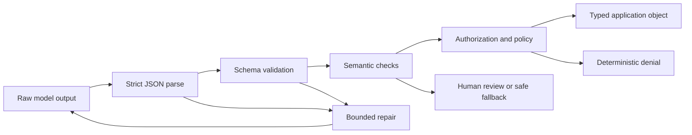

# Структурированный вывод — это контракт, которому нельзя доверять

> Корректный JSON ещё не означает корректного бизнес-решения. Разберите байты, проверьте структуру, подтвердите смысл и лишь затем разрешайте действие.

**Тип:** Build
**Языки:** Python
**Предварительные требования:** [Проверяйте утверждение, а не уверенность](../../05-output-evaluation-and-validation/), [Messages API — это конечный автомат](../../08-messages-api-and-application-lifecycle/)
**Время:** ~95 минут

## Цели обучения

- Различать синтаксис JSON, соответствие схеме, семантическую корректность и авторизацию
- Проектировать узкие схемы, в которых сложно выразить недопустимые состояния
- Разбирать вывод Claude без небезопасной очистки и оптимистичного приведения типов
- Исправлять некорректные ответы с помощью ограниченного числа повторных попыток, снабжённых подробными данными об ошибках
- Развивать контракты вывода, не нарушая незаметно работу потребителей
- Тестировать структурированный вывод в состязательных сценариях и на границах потоковой передачи

## JSON, который не должен был пройти проверку

Ваше приложение поддержки запрашивает приоритет от 1 до 5. Получен следующий ответ:

```json
{
  "category": "billing",
  "priority": 9,
  "summary": "Customer reports a duplicate charge",
  "needs_human": false
}
```

Парсер JSON успешно отрабатывает. Объект содержит все ожидаемые ключи. Приложение направляет обращение как экстренное с наивысшим приоритетом, пропускает проверку человеком и вызывает дежурного инженера.

Модель не нарушила синтаксис JSON. Это ваше приложение не обеспечило соблюдение контракта.

У структурированного вывода четыре этапа проверки:

1. **Синтаксис:** Содержится ли в выводе ровно одно значение JSON, которое можно разобрать?
2. **Структура:** Соответствует ли значение типам, обязательным полям, enum, границам и правилам в отношении дополнительных свойств?
3. **Семантика:** Согласуются ли поля с фактами предметной области и друг с другом?
4. **Полномочия:** Разрешено ли запрошенное последующее действие?

Прохождение предыдущего этапа никогда не означает прохождения следующего.



## Запрос JSON в промпте — не контракт

«Верните только JSON» — это инструкция. Она повышает вероятность нужного результата, но не исключает некорректный вывод, не защищает от дрейфа схемы и не проверяет бизнес-смысл.

Если текущие модель и API поддерживают структурированный вывод, можно передать JSON Schema и попросить платформу ограничить генерацию. Это уменьшает число синтаксических и структурных ошибок. Но такой подход всё равно не доказывает, что указанный заказ существует, возврат средств разрешён или категория выбрана верно.

Примечание о продукте, проверено 2026-08-09: доступность структурированного вывода, поддерживаемые ключевые слова схемы, несовместимость с другими возможностями и поддержка моделей могут меняться. Перед выпуском проверьте документацию [Структурированный вывод](https://platform.claude.com/docs/en/build-with-claude/structured-outputs). Даже при включённом декодировании с ограничениями сохраняйте проверку на стороне приложения.

Схема принадлежит приложению. Версионируйте её как API.

```json
{
  "$id": "support-triage-v1",
  "type": "object",
  "required": ["category", "priority", "summary", "needs_human"],
  "additionalProperties": false,
  "properties": {
    "category": {
      "type": "string",
      "enum": ["billing", "bug", "account", "other"]
    },
    "priority": {
      "type": "integer",
      "minimum": 1,
      "maximum": 5
    },
    "summary": {
      "type": "string",
      "minLength": 1,
      "maxLength": 240
    },
    "needs_human": {
      "type": "boolean"
    }
  }
}
```

Строгость этой схемы оправданна. Потребитель ожидает ровно четыре поля. Неожиданное поле `debug_context` может перенести конфиденциальный текст в журналы. Ограничение целого числа не пропустит `9`. Enum не позволит разным вариантам написания категорий раздробить аналитику.

## Проектируйте схемы исходя из решений потребителя

Начинайте не с вопроса «Что может сгенерировать Claude?», а с вопроса «Какое решение должен принять следующий детерминированный компонент?»

Если потребитель выбирает очередь, предоставьте ему enum. Если он сортирует по приоритету, предоставьте целое число в заданных границах. Если неопределённость влияет на маршрутизацию, представьте её явно, а не надейтесь, что она проявится в обычном тексте.

Сравните два контракта:

```json
{"answer": "Probably a billing issue. It seems urgent."}
```

```json
{
  "category": "billing",
  "priority": 4,
  "evidence_ids": ["invoice-483", "message-12"],
  "uncertainty": "medium",
  "needs_human": true
}
```

Второй объект позволяет выполнить маршрутизацию и проверку. Он по-прежнему может быть неверным, но его можно исследовать.

Используйте следующие правила проектирования:

- Предпочитайте enum меткам в свободной форме.
- Объявляйте поля обязательными, только если их можно заполнить в каждом корректном ответе.
- Используйте `null` осознанно для обозначения «известного отсутствия», а не как универсальный способ обхода требований.
- Отклоняйте дополнительные свойства, если потребители не поддерживают расширение намеренно.
- Ограничивайте строки и массивы, чтобы контролировать затраты и объём хранения.
- Включайте идентификаторы свидетельств, когда должна быть возможность проследить происхождение фактов.
- Кодируйте действия как предложения, а не как доказательства авторизации.
- Присваивайте схемам стабильные имена и версии.

Избегайте одной огромной схемы, которая представляет несвязанные режимы через десятки необязательных полей. Используйте размеченное объединение или отдельные контракты конечных точек. Когда каждое поле необязательно, число недопустимых состояний растёт.

## Выполняйте строгий разбор

Оптимистичная очистка скрывает сбои. Рассмотрим следующий шаблон:

```python
raw = raw.replace("```json", "").replace("```", "")
payload = json.loads(raw)
```

Он кажется удобным, но изменяет контракт после генерации. Ответ с пояснением, двумя объектами JSON или управляемым пользователем текстом ограничителя блока может превратиться в нечто, чего модель в действительности не возвращала как единое значение.

Предпочитайте строгий разбор:

```python
payload = json.loads(raw)
validate_against_schema(payload)
```

Если контракт требует один объект JSON, отклоняйте Markdown-ограничители и текст после объекта. Записывайте класс ошибки. Тогда при попытке исправления можно будет передать точные сведения об ошибках.

Не выполняйте неявное приведение типов:

- `"4"` — не целое число.
- `1` — не логическое значение.
- `"false"` — не false.
- Строка со значениями через запятую — не массив.
- Отсутствующее поле не эквивалентно безопасному значению по умолчанию, если схема не объявляет это значение, а приложение не применяет его намеренно.

В Python один случай особенно коварен: `bool` является подклассом `int`. Наивная проверка `isinstance(True, int)` принимает логическое значение там, где требуется целое число. Исполняемый валидатор явно отклоняет его.

## После структуры проверяйте смысл

Схема может доказать, что `invoice_id` — строка. Она не может доказать, что счёт существует или принадлежит аутентифицированному пользователю.

При семантических проверках используются доверенные данные приложения:

```python
if payload["invoice_id"] not in invoices_for(authenticated_user):
    raise SemanticError("invoice is not visible to this user")

if payload["refund_amount"] > verified_charge_amount:
    raise SemanticError("refund exceeds verified charge")
```

Важны и правила, связывающие несколько полей. Значение `needs_human: false` может быть недопустимым при `uncertainty: high`. Для предложенного `action: close_account` может потребоваться токен одобрения. Идентификатор цитаты должен разрешаться в источник, который действительно подтверждает утверждение.

Модель может помочь сформировать предложение. Детерминированный код проверяет личность, принадлежность, денежные лимиты, разрешения и переходы между состояниями.

## Исправляйте с ограниченным бюджетом

Некорректный вывод не всегда означает окончательный сбой. Синтаксическую ошибку или нарушение схемы можно исправить, если задача сопряжена с низким риском, а исправление не требует придумывать недостающие свидетельства.

Цикл исправления должен включать:

1. Исходную задачу и неизменённый доверенный контекст.
2. Схему или точное краткое описание контракта.
3. Сгенерированные машиной ошибки проверки с путями к полям.
4. Строгое максимальное число попыток.
5. Конечный переход к резервному варианту или эскалацию.

```text
Repair the previous output.
Return one JSON object and no surrounding text.
Validation errors:
- $.priority: expected integer from 1 through 5
- $.needs_human: required field is missing
Do not invent evidence that was not present in the source.
```

Не вставляйте необработанные дампы исключений, секреты, записи базы данных или произвольные недоверенные строки в область инструкций с более высоким уровнем доверия. Обратная связь от валидатора — это данные. Отделяйте её ограничителями, а доверенные инструкции по исправлению держите отдельно.

Двух попыток часто достаточно, чтобы понять, вызвана ли ошибка случайными проблемами форматирования или более глубоким несоответствием контракта. Бесконечные повторные попытки расходуют бюджет и могут усилить полезную нагрузку инъекции промпта. Подсчитывайте попытки, токены и задержку, а также отслеживайте повторяющиеся сигнатуры ошибок.

Если в источнике нет необходимых свидетельств, исправлять JSON — неверное действие. Верните явное состояние неполноты или выполните эскалацию.

## Входные данные инструментов и итоговый вывод — разные контракты

При использовании инструментов Claude также предоставляет структурированные входные данные, но они обслуживают другую границу.

- Схема входных данных инструмента помогает модели сформировать вызов.
- Обработчик инструмента всё равно проверяет значения и авторизует вызывающую сторону.
- Результат инструмента является недоверенными внешними данными, если получен от удалённого сервиса.
- Итоговый вывод приложения имеет собственную схему, предназначенную для потребителя.

Не используйте широкую внутреннюю схему инструмента как публичный контракт ответа. Внутренние поля могут раскрывать детали реализации или секреты. Преобразуйте проверенные результаты инструмента в минимальный итоговый объект.

Аналогично, никогда не выполняйте действие лишь потому, что итоговый JSON содержит `"approved": true`. Одобрение исходит из аутентифицированного состояния приложения, а не из вывода модели.

Когда использование инструментов служит механизмом структурированного вывода, учитывайте три общедоступных
варианта `tool_choice`, описанных в руководстве CCAR-F:

| Вариант | Поведение модели | Когда использовать |
|---|---|---|
| `auto` | Модель может вызвать инструмент или вернуть диалоговый текст | Допустим любой из двух вариантов |
| `any` | Модель должна вызвать один из предоставленных инструментов | Требуется типизированный результат инструмента, но допустимы несколько схем |
| `{"type":"tool","name":"extract_metadata"}` | Должен быть выбран указанный инструмент | Перед дальнейшей работой необходимо выполнить одно известное извлечение |

Для итогового машиночитаемого ответа предпочитайте актуальный нативный интерфейс
структурированного вывода, если он поддерживает требуемое сочетание схемы и возможностей.
Используйте схему инструмента, когда рабочий процесс действительно выбирает или вызывает инструмент.
В обоих случаях семантические проверки и авторизация остаются задачей приложения.

## Pydantic — реализация валидатора, а не контракт

В общедоступном руководстве CCAR-F Pydantic упоминается наряду с проверкой JSON Schema и
циклами повторных попыток после проверки. В Python модель Pydantic может сгенерировать схему,
привести или отклонить входные данные согласно своей конфигурации, а также выразить проверку
связанных полей. Она не делает утверждения модели истинными и не предоставляет полномочий на последующие действия.

В этом репозитории приоритет отдаётся стандартной библиотеке, поэтому исполняемая лабораторная работа реализует соответствующие
проверки напрямую. Если ваше промышленное приложение уже использует Pydantic, явно сопоставьте
с ним те же четыре этапа:

```text
JSON parse -> Pydantic shape validation -> domain validation -> authorization
```

Изучите поведение при приведении типов. Валидатор, который неявно превращает `"4"` в `4`, может
быть уместен на одной внешней границе и неприемлем на другой. Передавайте в цикл исправления
ограниченные ошибки проверки на уровне полей и выполняйте эскалацию, когда в источнике
нет необходимых свидетельств.

## При потоковой передаче синтаксис остаётся неполным

JSON, получаемый в потоке, остаётся неполным до завершения соответствующего блока содержимого. Префикс `{"category":"bill` пока не некорректен. Он не закончен.

Буферизуйте структурированный блок. Не пытайтесь повторно разбирать каждый символ, если только вы не используете парсер, предназначенный для инкрементального разбора JSON, и не понимаете его семантику частичного состояния. Не запускайте последующие действия только потому, что одно обязательное поле появилось раньше остальных.

Когда блок завершится:

1. Убедитесь, что поток достиг корректного завершающего события.
2. Выполните разбор ровно один раз.
3. Проверьте схему.
4. Проверьте семантику и политики.
5. Атомарно зафиксируйте последующий переход состояния.

Если поток разорван, отбросьте частичный объект или поместите его в карантин. Пользовательский интерфейс может показывать предварительный текст, но контракт приложения ещё не завершён.

## Развитие схемы — это миграция API

Предположим, версия 1 возвращает `priority` как целое число. В версии 2 оно заменено на `severity: "low" | "medium" | "high"`. Если сначала развернуть промпт, старые потребители сломаются. Если сначала развернуть потребитель, он может отклонить старый вывод.

Используйте одну из следующих стратегий:

- Добавьте поле версии контракта и поддерживайте обе версии во время миграции.
- Разверните толерантный считыватель на узкое, заранее запланированное окно совместимости.
- Перед переключением запускайте параллельную генерацию и сравнивайте результаты.
- На границе адаптера преобразуйте новый вывод в старый внутренний тип.

Никогда не изменяйте схему без явного уведомления. Записывайте в трассировках версию схемы, промпта, модели и валидатора. Регрессионные оценивания должны охватывать старые и новые примеры, граничные значения, пропущенные и неожиданные поля, враждебные строки и большие входные данные.

## Создайте валидатор и цикл исправления

`code/main.py` реализует полезное подмножество JSON Schema без внешних зависимостей. Он проверяет объекты, обязательные поля, дополнительные свойства, примитивные типы, enum, числовые и строковые границы, массивы и вложенные пути. Затем валидатор помещается в ограниченный экстрактор.

Запустите его:

```bash
cd certifications/claude/lessons/09-structured-output-and-defensive-parsing/code
python3 main.py
python3 -m unittest discover tests -v
```

В первом подготовленном ответе используется `"high"` там, где требуется целое число. Во втором поле исправляется. Тесты доказывают, что Markdown-ограничители, отсутствующие поля, логические значения вместо целых чисел, неожиданные поля и исчерпание повторных попыток приводят к явному сбою.

В промышленной среде отдавайте предпочтение зрелому валидатору, который поддерживается стеком вашего приложения. Подмножество, написанное вручную, предназначено для демонстрации проверок, выполняемых библиотекой, а не для замены полной реализации JSON Schema.

## Интерактивная лабораторная работа

Используйте схему восстановления, чтобы пропустить варианты вывода через этапы проверки синтаксиса, схемы, семантики и авторизации. Израсходуйте бюджет исправления на структурную ошибку, а затем сравните результат со сбоем из-за отсутствующих свидетельств, который требует эскалации.

```figure
09-structured-output-recovery
```

## Практическая лабораторная работа

Запустите ограниченный экстрактор, затем передайте JSON в Markdown-ограничителях, логическое значение вместо целого числа, неожиданное поле и две некорректные попытки. Определите, к какому этапу относится каждый сбой: синтаксису, структуре, смыслу или авторизации.

## Готовый артефакт

`outputs/validated-triage.json` — заполненный контракт, созданный демонстрационным исправлением без провайдера. Запустите `python3 main.py`, чтобы воспроизвести его, а затем выполните набор модульных тестов. Один тест сравнивает сохранённый в репозитории артефакт с `demo()`, остальные охватывают ограничители блоков, отсутствующие поля, логические значения вместо целых чисел, дополнительные свойства, ограниченное исправление и исчерпание повторных попыток.

## Проверка

```bash
cd certifications/claude/lessons/09-structured-output-and-defensive-parsing/code
python3 main.py
python3 -m unittest discover tests -v
```

## Связь с итоговыми проектами

Тест проверяет, к какому этапу относится каждый сбой. Используйте проверенный объект и данные об исправлении в итоговом проекте 30 для Developer и итоговых проектах 31 и 32 для Architect.

## Правила принятия решений на экзамене

- Если вывод разбирается, но нарушает диапазон или enum, выбирайте проверку схемы, а не очистку промпта.
- Если вывод соответствует схеме, но противоречит доверенным записям, выбирайте семантическую проверку.
- Если объект предлагает привилегированное действие, выполняйте авторизацию на основе подтверждённых приложением данных об идентичности и политики.
- Если форматирование временно нарушено, используйте ограниченное исправление с точной обратной связью от валидатора.
- Если свидетельства отсутствуют, вместо исправления фактов выполните эскалацию или верните явное состояние неполноты.
- Если потоковая передача не завершена, не выполняйте разбор и не действуйте так, словно контракт уже завершён.
- Если схема меняется, версионируйте и мигрируйте её как любой публичный API.
- Если доступна генерация с ограничениями, используйте её для сокращения числа ошибок, но сохраняйте последующую проверку.

## Упражнения

1. Добавьте `evidence_ids` как массив строк ограниченной длины. Напишите тесты для корректного списка, элемента-целого числа и списка, превышающего выбранный предел.
2. Добавьте правило для связанных полей: `uncertainty: high` требует `needs_human: true`.
3. Создайте семантический валидатор, который подтверждает принадлежность счёта аутентифицированному пользователю, не раскрывая модели полную запись счёта.
4. Добавьте поле `contract_version` и реализуйте адаптер версии 1 к версии 2.
5. Передайте валидатору десять состязательных строк: ограничители блоков, дублирующиеся объекты, неожиданные поля, экранированный управляющий текст, огромные сводки, логические значения вместо целых чисел и вложенные тексты инъекций промпта.
6. Воссоздайте контракт сортировки обращений как модель Pydantic в отдельной промышленной песочнице. Сравните строгое поведение и поведение с приведением типов, не добавляя Pydantic в зависимости этого урока.

## Дополнительные материалы

- [Структурированный вывод](https://platform.claude.com/docs/en/build-with-claude/structured-outputs)
- [Справочник Messages API](https://platform.claude.com/docs/en/api/messages)
- [Обзор использования инструментов](https://platform.claude.com/docs/en/agents-and-tools/tool-use/overview)
- [Повышение согласованности вывода](https://platform.claude.com/docs/en/test-and-evaluate/strengthen-guardrails/increase-consistency)
- [Спецификация JSON Schema](https://json-schema.org/specification)
- [Руководство по экзамену Claude Certified Architect Foundations](https://everpath-course-content.s3-accelerate.amazonaws.com/instructor%2F6nizmqk8tpzpfjvt6qmmav7rh%2Fpublic%2F1783542750%2FClaude+Certified+Architect+%E2%80%93+Foundations+Exam+Guide.pdf)
