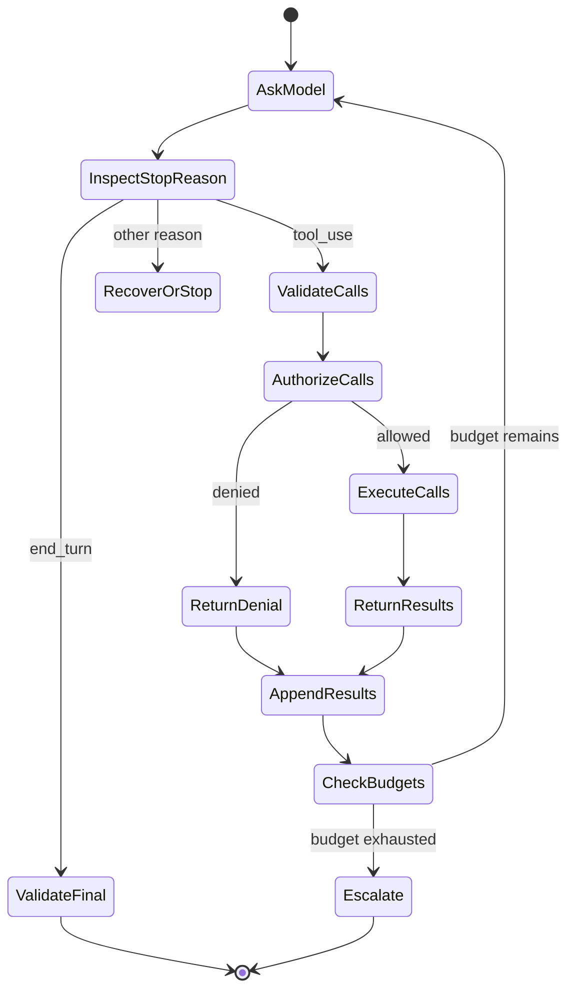

# Цикл инструментов — это контролируемое делегирование

> Claude может предложить действие. Ваше приложение проверяет запрос, предоставляет возможность, наблюдает за результатом и решает, продолжать ли цикл.

**Тип:** Build
**Языки:** Python
**Предварительные требования:** [Messages API — это конечный автомат](../../08-messages-api-and-application-lifecycle/), [Структурированный вывод — это недоверенный контракт](../../09-structured-output-and-defensive-parsing/)
**Время:** ~130 минут

## Цели обучения

- Реализовать полный цикл протокола `tool_use` и `tool_result`
- Проектировать узкоспециализированные контракты инструментов и выбирать границу их выполнения
- Отделять выбор инструмента моделью от детерминированной авторизации
- Сравнить написанный вручную цикл, SDK Tool Runner и управляемых агентов
- Возвращать сбои в виде типизированных результатов и обрабатывать пригодные к действию события среды выполнения
- Ограничивать автономность и выбирать фиксированный рабочий процесс, когда путь известен

## Агент, который повторяет платёж

Ассистент по расчётам получает запрос «Верните деньги за повторное списание». Claude запрашивает `issue_refund`. Приложение выполняет операцию. Соединение обрывается до получения итогового текста. Приложение повторяет весь ход, Claude снова запрашивает инструмент, и клиент получает два возврата.

Проблема не в том, что модель воспользовалась инструментом. Приложение перепутало генерацию текста с управлением транзакцией.

Надёжный цикл инструментов опирается на два контракта:

1. Модель может предложить именованную возможность со структурированными аргументами.
2. Детерминированный код приложения решает, будет ли эта возможность выполнена, каким образом и не более какого количества раз.

Использование инструментов расширяет возможности Claude. Оно не наделяет Claude полномочиями.

## Контракт протокола до выбора фреймворка

Клиентские инструменты объявляются в запросе. Каждое объявление предоставляет модели имя, описание и контракт входных данных в формате JSON Schema.

```json
{
  "name": "lookup_order",
  "description": "Look up one order by its exact public order ID. Returns status and last update. This tool never changes an order.",
  "input_schema": {
    "type": "object",
    "required": ["order_id"],
    "additionalProperties": false,
    "properties": {
      "order_id": {
        "type": "string",
        "description": "Order ID in the form A-12345"
      }
    }
  }
}
```

Claude может вернуть:

```json
{
  "stop_reason": "tool_use",
  "content": [
    {
      "type": "tool_use",
      "id": "toolu_7f3",
      "name": "lookup_order",
      "input": {"order_id": "A-12345"}
    }
  ]
}
```

Ваш клиент сохраняет всё содержимое ответа ассистента, проверяет и запускает инструмент, а затем добавляет:

```json
{
  "role": "user",
  "content": [
    {
      "type": "tool_result",
      "tool_use_id": "toolu_7f3",
      "content": "{\"found\":true,\"status\":\"in_transit\"}"
    }
  ]
}
```

Совпадающий идентификатор — не декоративный элемент. Он связывает результат с конкретным запросом. В истории диалога, предусмотренной протоколом, сообщение ассистента должно находиться непосредственно перед последовательностью результатов.

Актуальные структуры SDK и API описаны в разделе [Реализация клиентских инструментов](https://platform.claude.com/docs/en/agents-and-tools/tool-use/implement-tool-use).

## У цикла есть явные состояния



Сбой возможен при каждом переходе. В ответе может отсутствовать идентификатор инструмента. Имя инструмента может быть неизвестным. Аргументы могут не соответствовать схеме. Авторизация может отклонить вызов. Обработчик может превысить время ожидания. Результат может оказаться слишком большим. Claude может запросить ещё один инструмент. Даже итоговый ответ может не соответствовать своему контракту вывода.

Не скрывайте эти состояния за одним широким `try/except` и универсальным повтором. Классифицируйте их и выбирайте способ восстановления в зависимости от класса сбоя.

## Проектирование инструментов — это проектирование интерфейсов

Claude выбирает инструменты по их интерфейсам. Человек должен понимать, когда использовать каждый инструмент, не читая его обработчик.

### У каждого инструмента должна быть одна задача

`manage_customer` — слишком расплывчатое название. Инструмент может искать, редактировать, возвращать деньги, приостанавливать обслуживание или удалять данные. Каталог узкоспециализированных инструментов упрощает как выбор, так и защиту:

- `get_customer_profile`
- `list_customer_invoices`
- `propose_refund`
- `issue_approved_refund`

Разделение предложения и выполнения имеет значение. Инструмент с низким риском может рассчитать предлагаемую сумму. Инструмент с высоким риском требует аутентифицированного токена подтверждения, созданного вне модели.

### Описывайте условия выбора, а не внутреннее устройство

Полезное описание сообщает, что делает инструмент, когда его следует и не следует использовать, а также что означает результат. Не нужно вставлять в него полное руководство по API.

Плохо:

```text
Calls GET /v3/orders/{id} in the Commerce service.
```

Лучше:

```text
Read the current status of one existing order from the commerce system.
Use only when the user supplies an exact order ID. This tool is read-only.
Do not use it to search by email or to modify shipment details.
```

Примеры в описаниях помогают пояснить сложные форматы, но каждый их токен повторяется вместе с каталогом инструментов. Измеряйте, достаточно ли пример улучшает выбор, чтобы оправдать затраты контекста.

### Затрудните выражение недопустимых вызовов

Используйте перечисления, обязательные поля, границы и `additionalProperties: false`. Разделяйте взаимоисключающие режимы. Избегайте команд оболочки в свободной форме, SQL, URL и путей файловой системы, если достаточно узкого значения из предметной области.

Схема направляет генерацию. Обработчик всё равно проверяет данные. Никогда не считайте созданные моделью входные данные безопасными лишь потому, что они сгенерированы по схеме.

## Сохраняйте каталог инструментов небольшим и однозначным

Большее количество инструментов не всегда даёт больше возможностей. Пересекающиеся названия и длинные каталоги создают неоднозначность выбора и расходуют контекст.

Начните с минимального набора инструментов, необходимого для реалистичных задач. Добавляйте инструмент, когда оценивание выявляет недостающую возможность. Удаляйте или объединяйте инструменты, когда траектории показывают путаницу.

Используйте следующие вопросы:

- Кажутся ли два инструмента взаимозаменяемыми судя по их названиям и описаниям?
- Может ли универсальный инструмент для кода или CLI уже выполнить эту задачу в песочнице?
- Нужна ли агенту эта возможность на каждом ходу?
- Можно ли поместить возможность в Skill и загружать её только тогда, когда она актуальна?
- Следует ли предоставить этот инструмент отдельному субагенту вместо основного агента?
- Позволит ли стандартизованный сервер MCP безопасно использовать его нескольким хостам?

Количество инструментов — не показатель качества архитектуры. Важны правильный выбор и контролируемое выполнение.

## Авторизация выполняется после валидации

Безопасная граница выполнения предполагает следующий порядок:

1. Сопоставьте имя инструмента со списком разрешённых имён.
2. Проверьте типы и границы входных данных.
3. Получите аутентифицированные идентификационные данные и контекст арендатора из приложения, а не из аргументов.
4. Проверьте область действия возможности и принадлежность ресурса.
5. Требуйте подтверждения для действий с существенными последствиями.
6. Примените ограничения идемпотентности, времени ожидания, частоты и размера.
7. Выполните операцию в наиболее изолированной доступной песочнице.
8. Скройте конфиденциальные данные в результате, прежде чем возвращать его Claude или записывать в журналы.

Если аргумент инструмента содержит `user_id`, не доверяйте ему как идентификационным данным. Сравните его с аутентифицированным сеансом или полностью исключите его из-под контроля модели.

Для изменения данных запись о подтверждении должна связывать пользователя, действие, нормализованные аргументы, срок действия и идентификатор операции. Фраза «пользователь ранее согласился» в тексте диалога не является защищённым токеном подтверждения.

## Возвращайте сбои как результаты

Сбой обработчика не обязательно означает аварийное завершение приложения. Claude может восстановиться, если получит краткий и правдивый результат инструмента.

```json
{
  "type": "tool_result",
  "tool_use_id": "toolu_7f3",
  "is_error": true,
  "content": "Order service timed out. No order state was changed. Retry is allowed once."
}
```

Хорошее описание ошибки сообщает модели:

- Что именно не сработало.
- Возник ли какой-либо побочный эффект.
- Безопасно ли повторить попытку.
- Какое исправление возможно.

Не раскрывайте трассировки стека, значения окружения, запросы к базе данных, токены доступа и внутренние имена хостов. Сохраняйте эти сведения в защищённой телеметрии с редактированием конфиденциальных данных и контролем доступа.

Ошибки валидации могут содержать пути к полям. Отказы по правилам политики не должны побуждать модель искать обходной путь. Сообщение «Этот агент не может оформлять возвраты» безопаснее, чем перечисление всех правил безопасности.

Запрос неизвестного инструмента должен превращаться в связанный с ним результат с ошибкой или в терминальную ошибку протокола — в зависимости от вашей архитектуры. Никогда не импортируйте динамически и не запускайте обработчик, имя которого указала модель.

## Множественные и параллельные вызовы инструментов

Claude может запросить несколько инструментов в одном ответе. Выполняйте их параллельно только тогда, когда они независимы, доступны только для чтения и допускают изменение порядка.

Два поиска зачастую можно выполнять одновременно. Между действиями «создать счёт» и «отправить счёт» есть зависимость, поэтому они должны выполняться последовательно. Две записи в одну и ту же сущность могут конфликтовать. Для платежа и электронного письма может потребоваться транзакция или компенсирующий рабочий процесс.

Возвращайте по одному `tool_result` для каждого запрошенного идентификатора `tool_use`. Сохраняйте порядок, достаточный для реконструкции траектории. Если один из параллельных вызовов завершается сбоем, сообщите результат каждого вызова, а не делайте вид, что весь пакет выполнен одинаково успешно.

Примечание о продукте, проверено 2026-08-08: вспомогательные API для автоматического выполнения инструментов и параллельных вызовов различаются между SDK. Они не снимают с приложения ответственность за авторизацию. Сверяйтесь с актуальным [обзором использования инструментов](https://platform.claude.com/docs/en/agents-and-tools/tool-use/overview).

## Ограничивайте агента

Циклу агента нужны условия завершения помимо `end_turn`:

- Максимальное количество ходов модели.
- Максимальное количество вызовов инструментов — общее и для каждого инструмента.
- Предельное время выполнения.
- Бюджет токенов и денежных средств.
- Максимальное количество последовательных ошибок.
- Максимальное количество повторений одного и того же вызова.
- Отмена пользователем.
- Обязательное подтверждение человеком.
- Проверяемый предикат конечного состояния.

Предикат конечного состояния надёжнее вопроса о том, выглядит ли ответ завершённым. Агент развёртывания достигает цели, когда ожидаемая версия работоспособна, а не когда он сообщает «развёрнуто». Исследовательский агент достигает цели, когда у необходимых утверждений есть доступные для проверки источники, а не когда создаёт длинный отчёт.

Записывайте траекторию: версию промпта, модель, причину остановки, имя инструмента, отпечаток нормализованных аргументов, решение, задержку, класс результата и изменение состояния. Скрывайте конфиденциальные значения.

## Рабочий процесс или агент

Используйте фиксированный рабочий процесс, когда шаги и ветвления известны. Используйте агента, когда путь зависит от наблюдений и модель должна выбирать между инструментами.

| Задача | Предпочтительный вариант по умолчанию | Причина |
|---|---|---|
| Извлечь поля, проверить, сохранить | Рабочий процесс | Известная последовательность и ясный контракт |
| Классифицировать, затем направить в одну очередь | Рабочий процесс | Конечный набор ветвей |
| Исследовать незнакомый дефект в репозитории | Агент | Путь поиска зависит от обнаруженных сведений |
| Вернуть деньги после подтверждения повторного списания | Рабочий процесс с подтверждением | Действие с существенными последствиями и известные меры контроля |
| Собрать доказательства в меняющихся внутренних системах | Ограниченный агент | Выбор инструмента зависит от недостающих доказательств |

Автономность оправданна, если задача ценна, среда доступна через инструменты, ошибки можно обнаружить и восстановление возможно. Если ошибки невозможно обнаружить, дополнительные ходы агента лишь скрывают риск.

## Выберите, какой частью цикла управлять самостоятельно

После выбора между рабочим процессом и агентом используйте минимальную обвязку, отвечающую эксплуатационным требованиям.

| Среда выполнения | Что она обрабатывает | Что по-прежнему обрабатывает ваше приложение | Когда предпочесть |
|---|---|---|---|
| Написанный вручную цикл Messages API | Только реализованную вами работу с протоколом | Полную историю, причины остановки, схему и политику, выполнение, повторы, бюджеты, трассировки и восстановление | Нужны контроль на уровне протокола, ограниченная среда выполнения, собственный конечный автомат либо обучение протоколу и его тестирование |
| SDK Tool Runner | Вспомогательные средства объявления инструментов, последовательность `tool_use` и `tool_result`, обновление состояния сообщений и необязательную потоковую передачу в каждом ходе | Авторизацию, песочницу, идемпотентность, раскрытие ошибок, ограничение итераций, наблюдаемость и доказательство конечного состояния | Поддерживаемый SDK соответствует требованиям, а клиентские инструменты по-прежнему выполняются под контролем вашего приложения |
| Claude Managed Agents | Удалённую обвязку агента, сеанса и среды с настроенной песочницей, встроенными инструментами и событийно-ориентированным выполнением | Конфигурацию агента, согласование границ данных, выполнение пользовательских инструментов, решения о подтверждении, сохранение событий, бизнес-авторизацию и проверку результата | Нужны управляемый сеанс и граница песочницы, а вас устраивают текущий статус бета-версии и контракты платформы и событий |

Код в этом уроке намеренно реализует первый вариант. В нём виден каждый переход. Переход на [Tool Runner](https://platform.claude.com/docs/en/agents-and-tools/tool-use/tool-runner) устраняет повторяющийся служебный код цикла, но не делает возврат денег безопасным. Задайте ограничение числа итераций, перехватывайте выполнение инструментов или оборачивайте его, сохраняйте подтверждение на уровне приложения и проверяйте конечное состояние.

Примечание о продукте, проверено 2026-08-09: [Claude Managed Agents](https://platform.claude.com/docs/en/managed-agents/overview) сейчас находится на этапе публичного бета-тестирования и использует версионируемый бета-контракт. Сервис предоставляет управляемых агентов, среды, сеансы, встроенные инструменты и потоковую передачу событий с сервера. Считайте заголовок, ресурсы, типы событий, набор инструментов, ограничения и доступность у провайдеров изменчивыми. Не выбирайте этот вариант лишь потому, что задача называется агентной.

Интеграция с управляемым агентом — это потребитель событий, а не вызов для получения итогового текста. Приложение отправляет пользовательские события, обрабатывает сохранённые события сеанса и агента и отслеживает состояние. Вызов пользовательского инструмента или инструмента, требующего разрешения, может приостановить сеанс в состоянии `requires_action`; приложение разрешает события с указанными идентификаторами, передавая результаты или решения о подтверждении. Закрытое SSE-соединение не означает успеха. Сверяйте сохранённые события и терминальное состояние. В уроке 12 эта граница реализована с использованием офлайн-фикстуры событий; актуальным источником служит раздел [Поток событий сеанса](https://platform.claude.com/docs/en/managed-agents/events-and-streaming).

## Принадлежность провайдеру не означает единую границу выполнения

Классифицируйте возможность по тому, где выполняются код и обработка данных, кто её авторизует и как она обнаруживается.

| Тип возможности | Граница выполнения и данных | Для чего использовать | Чего не следует предполагать |
|---|---|---|---|
| Серверный инструмент Messages API | Anthropic выполняет поддерживаемые инструменты, такие как веб-поиск, получение веб-страниц, выполнение кода и поиск инструментов | Поддерживаемая собственная возможность, для которой подходят выполнение на стороне провайдера и его политика обработки данных | В обычном случае ваше приложение получает клиентский `tool_use`, который должно выполнить |
| Клиентский инструмент со схемой Anthropic | Anthropic определяет встроенную в обучение схему; ваше приложение выполняет такие инструменты, как bash, текстовый редактор, память или управление компьютером | Типовые операции, в которых стандартная схема улучшает знакомство модели с инструментом, но за выполнение должен отвечать клиент | Собственная схема означает выполнение провайдером или автоматическую авторизацию |
| Встроенный инструмент управляемого агента | Настроенная управляемая или самостоятельно размещённая агентная среда выполняет свой набор инструментов | Работу с репозиторием и веб-ресурсами, соответствующую песочнице и политике разрешений этой среды выполнения | Включение набора инструментов предоставляет бизнес-полномочия или устраняет необходимость подтверждения |
| Пользовательский клиентский инструмент | Ваше приложение проверяет и выполняет контракт JSON Schema | Закрытые бизнес-операции, узкие предметные API и точную политику приложения | Соответствующие схеме входные данные являются подтверждением идентичности, авторизации или идемпотентности |
| Skill | Поддерживаемая среда выполнения загружает многократно используемые инструкции, справочные материалы, скрипты или ресурсы | Процедуру, которую следует раскрывать только тогда, когда она актуальна | Skill сам по себе является границей выполнения или авторизации |
| MCP | Клиент или коннектор MCP вызывает стандартизованный внешний сервер | Возможности или контекст, общие для совместимых хостов с явными границами сервера, идентификационных данных и транспорта | Обнаружение сервера делает каждый возвращённый инструмент безопасным или актуальным |

Skill и инструмент часто дополняют друг друга, а не служат альтернативами. Skill для проверки возвратов может описывать процедуру, а пользовательский клиентский инструмент — предоставлять доступ к одобренной операции. MCP может передавать эту операцию, когда нескольким хостам нужен одинаковый стандартный интерфейс. Выбирайте серверный инструмент, выполняемый провайдером, только если его сеть, правила хранения и семантика результатов подходят для этих данных. Выбирайте клиентский инструмент со схемой Anthropic, только если ваша песочница и валидатор действий готовы его выполнять.

Актуальные категории выполнения описаны в разделе [Принцип работы инструментов](https://platform.claude.com/docs/en/agents-and-tools/tool-use/how-tool-use-works), а у управляемой обвязки есть отдельная [конфигурация инструментов](https://platform.claude.com/docs/en/managed-agents/tools). Версии и совместимость моделей меняются, поэтому сохраняйте выбранные тип и версию инструмента в трассировке.

## Реализуйте цикл

`code/main.py` реализует реестр инструментов и низкоуровневый цикл. Он поддерживает множественные вызовы, проверку схемы, подтверждение инструментов, изменяющих данные, ошибки обработчиков, неизвестные инструменты, идентификаторы корреляции и бюджет ходов. Отдельная офлайн-лаборатория принятия решений выбирает рабочий процесс, написанный вручную цикл, SDK Tool Runner или управляемых агентов на основе явных требований. Она также формирует набор средств выполнения с необязательным Skill, не выдавая Skills за инструменты.

```bash
cd certifications/claude/lessons/10-tool-use-and-agentic-loops/code
python3 main.py
python3 -m unittest discover tests -v
```

Прочитайте расшифровку, которую выводит демонстрация. Найдите блок `tool_use` ассистента и следующий за ним пользовательский `tool_result`. Затем изучите фикстуру решения, напечатанную после него. Измените случай с управляемым агентом так, чтобы бета-версия не принималась, и добейтесь отказа решения до запуска любой среды выполнения. Корректность протокола и архитектуры должна быть видимой, а не предполагаемой.

## Интерактивная лабораторная работа

Используйте схему цикла инструментов, чтобы распределить бюджеты ходов, вызовов инструментов, времени и подтверждений. Инициируйте повторные вызовы или отклонённое изменение и проследите, какое детерминированное условие завершения останавливает цикл.

```figure
10-tool-loop-budget
```

## Практическая лабораторная работа

Запустите цикл инструментов, затем протестируйте неизвестный инструмент, недопустимые аргументы, отклонённое изменение, множественные вызовы, ошибку обработчика и исчерпанный бюджет ходов. Убедитесь, что каждый результат сохраняет свой идентификатор использования инструмента. Затем классифицируйте серверный инструмент провайдера, клиентский инструмент со схемой Anthropic, закрытый пользовательский инструмент, процедуру на основе Skill и сервис MCP по границе выполнения и владельцу авторизации.

## Готовый артефакт

`outputs/tool-loop-transcript.json` — заполненная расшифровка выполнения с корреляцией, полученная из `demo()`. `outputs/runtime-and-tool-surface-decisions.json` — датированное, не зависящее от провайдера сравнение четырёх сред выполнения и четырёх композиций возможностей. Запустите `python3 main.py`, чтобы изучить оба файла, и выполните набор модульных тестов, чтобы проверить артефакты, границы схемы, отказ в подтверждении, условия допуска сред выполнения, границы выполнения, сбой обработчика и предотвращение неограниченного выполнения.

## Проверка

```bash
cd certifications/claude/lessons/10-tool-use-and-agentic-loops/code
python3 main.py
python3 -m unittest discover tests -v
```

## Связь с итоговыми проектами

Тест проверяет различие между предложением и авторизацией, описания инструментов, идемпотентность, параллелизм, проверки конечного состояния и выбор рабочего процесса. Используйте проверенную расшифровку в итоговом проекте 30 для сертификации Developer и итоговых проектах 31 и 32 для сертификации Architect как доказательство корректности границы инструментов.

## Правила принятия решений на экзамене

- Выбор инструмента Claude — это предложение, а не авторизация.
- Проверяйте схему до политики, а политику — до выполнения.
- Используйте узкие имена и описания, позволяющие различать условия применения инструментов.
- Возвращайте краткие коррелированные ошибки, когда восстановление безопасно.
- Для повторяемых побочных эффектов требуйте идемпотентность или сверку состояния.
- Выполняйте параллельно только независимые вызовы, для которых порядок не имеет значения.
- Останавливайтесь при исчерпании бюджетов, повторных вызовах, отмене или нераспознанных управляющих состояниях.
- Предпочитайте детерминированный рабочий процесс, когда путь уже известен.
- Предпочитайте SDK Tool Runner, когда подходит выполнение на стороне клиента, а собственный контроль протокола не приносит пользы.
- Выбирайте управляемых агентов только при конкретной потребности в управляемой среде выполнения и приемлемых границах бета-версии и данных.
- Рассматривайте управляемый сеанс как событийный конечный автомат; разрешайте `requires_action` по идентификатору события и никогда не делайте вывод об успехе из разрыва потокового соединения.
- Различайте выполняемые на сервере инструменты, клиентские инструменты со схемой Anthropic, встроенные инструменты управляемой среды и пользовательские клиентские инструменты по месту выполнения.
- Рассматривайте Skills как процедуры, а MCP — как границу подключения; ни то ни другое не предоставляет авторизацию.
- Оценивайте траекторию инструментов и конечное состояние, а не только итоговый текст.

## Упражнения

1. Добавьте `issue_refund` с обязательным токеном подтверждения. Докажите, что текст диалога не может заменить токен.
2. Добавьте в один ответ два вызова только для чтения и выполните их параллельно. Сохраните детерминированную корреляцию результатов.
3. Настройте превышение времени ожидания одного инструмента после возникновения побочного эффекта. Добавьте ключ идемпотентности и сверку состояния перед повтором.
4. Добавьте детектор повторных вызовов, который останавливает выполнение после двух появлений одного и того же нормализованного запроса инструмента.
5. Преобразуйте один закрытый пользовательский инструмент в возможность MCP, общую для двух хостов. Определите, какие обязанности по аутентификации, согласию, фильтрации результатов и доступности переходят к границе сервера, а какие остаются у каждого хоста.

## Дополнительные материалы

- [Обзор использования инструментов](https://platform.claude.com/docs/en/agents-and-tools/tool-use/overview)
- [Реализация клиентских инструментов](https://platform.claude.com/docs/en/agents-and-tools/tool-use/implement-tool-use)
- [Обработка ошибок инструментов](https://platform.claude.com/docs/en/agents-and-tools/tool-use/implement-tool-use#handling-tool-use-and-tool-result-content-blocks)
- [Tool Runner](https://platform.claude.com/docs/en/agents-and-tools/tool-use/tool-runner)
- [Принцип работы инструментов](https://platform.claude.com/docs/en/agents-and-tools/tool-use/how-tool-use-works)
- [Claude Managed Agents](https://platform.claude.com/docs/en/managed-agents/overview)
- [Поток событий сеанса](https://platform.claude.com/docs/en/managed-agents/events-and-streaming)
- [Инструменты управляемых агентов](https://platform.claude.com/docs/en/managed-agents/tools)
- [Создание эффективных агентов](https://www.anthropic.com/research/building-effective-agents)
- [Обработка причин остановки](https://platform.claude.com/docs/en/build-with-claude/handling-stop-reasons)
