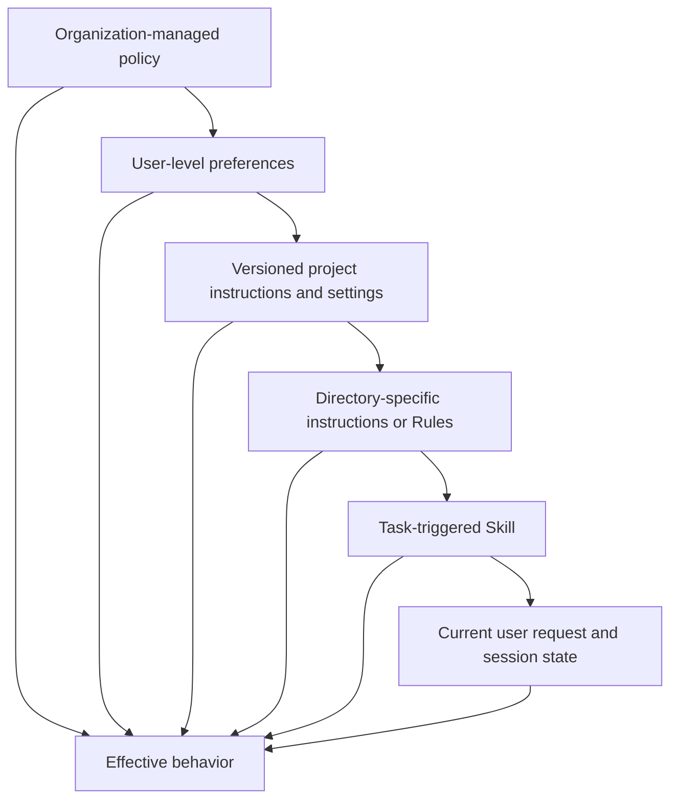
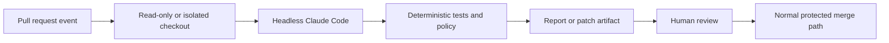

# Claude Code масштабируется благодаря общим ограничениям

> Команде нужен не один огромный промпт, а небольшой контракт проекта, повторно используемые процедуры, детерминированные проверки и версионируемая конфигурация.

**Тип:** Изучение
**Языки:** Python
**Предварительные требования:** [Claude Agent SDK — это среда выполнения, а не разрешение](../../12-claude-agent-sdk-and-hooks/), [Оценивания превращают поведение агента в инженерные свидетельства](../../14-evals-testing-debugging-and-observability/)
**Время:** ~170 минут

## Цели обучения

- Спроектировать компактный `CLAUDE.md`, который служит введением в проект
- Размещать инструкции, настройки, Rules, Skills, агентов, хуки и конфигурацию MCP в правильной области действия
- Работать с режимами разрешений, восстановлением контекста, целями, циклами, рабочими деревьями и расписаниями, не нарушая границ согласования
- Версионировать изменения моделей, промптов, плагинов и командной конфигурации
- Интегрировать Claude Code в CI как участника с ограниченными полномочиями, а не как неконтролируемый инструмент развёртывания
- Оценивать командные рабочие процессы по артефактам, тестам, трассировкам и точкам восстановления

## Файл инструкций на 900 строк

Команда добавляет каждое исправление в `CLAUDE.md`. В нём собраны история архитектуры, документация API, предпочтения по стилю, этапы выпуска, правила безопасности, примеры, рекомендации по устранению неполадок и инструкции для отдельных задач.

Claude читает его в каждом сеансе. Важные команды конкурируют с устаревшим текстом. Разработчики перестают проверять изменения, потому что файл слишком велик. Одна старая строка предписывает использовать выведенную из эксплуатации команду тестирования, и агент раз за разом сообщает об успехе после запуска не того набора тестов.

Команда создала не память, а долг контекста.

`CLAUDE.md` должен работать как точный сценарий введения в проект: что представляет собой этот репозиторий, как в нём ориентироваться, как его собирать и тестировать, какие ограничения неочевидны и где находится более подробная документация.

## Размещайте информацию в самой узкой устойчивой области действия

Claude Code может загружать конфигурацию и инструкции из нескольких областей действия. Точная иерархия и имена файлов зависят от продукта, но принцип проектирования неизменен: общая политика должна находиться в общей области действия, сведения о проекте — в репозитории, а процедура для конкретной задачи должна загружаться только тогда, когда она актуальна.



Общие средства контроля не должны легко ослабляться в рамках проектной задачи. Узкоспециализированные инструкции не следует копировать на глобальный уровень. Сверяйтесь с актуальной документацией по [настройкам Claude Code](https://code.claude.com/docs/en/settings) и [памяти](https://code.claude.com/docs/en/memory), чтобы узнать точный порядок приоритетов, расположение управляемых политик, правила импорта и обнаружения в установленной версии.

При конфликте источников явно указывайте приоритет. Не полагайтесь на два противоречащих друг другу предложения в надежде, что модель выберет более безопасное.

## Пишите лаконичный CLAUDE.md

Начните со сведений, которые постоянно нужны Claude:

```markdown
# Repository guide

## Purpose
This repository is a Python service that routes support tickets.

## Commands
- Install: `python3 -m venv .venv && .venv/bin/pip install -r requirements.txt`
- Focused tests: `python3 -m unittest discover tests -v`
- Full validation: `./scripts/validate.sh`

## Layout
- `src/`: application code
- `tests/`: unit and integration tests
- `docs/architecture.md`: boundaries and decision records

## Constraints
- Never commit credentials or `.env` files.
- Preserve public API compatibility unless the task explicitly changes it.
- Require explicit approval before deployment or external messages.
```

Включайте:

- Назначение и технологический стек.
- Канонические команды сборки, тестирования, линтинга и запуска.
- Схему важных каталогов.
- Специфичные для репозитория правила стиля или архитектуры.
- Границы безопасности и публичных действий.
- Ссылки на авторитетные подробные документы.

Исключайте:

- Общие рекомендации, которые Claude уже знает.
- Полные справочники API.
- Временный статус задачи.
- Секреты и значения среды.
- Инструкции, используемые только в одном специализированном рабочем процессе.
- Правила, соблюдение которых не обеспечивается и не проверяется.

Начинайте с малого. Если одно и то же исправление требуется в нескольких сеансах, определите, где ему место: в `CLAUDE.md`, Rule, Skill, хуке, тесте или непосредственно в коде. Лучшим способом обеспечить требование «всегда запускайте форматтер» может быть хук после редактирования и проверка CI, а не ещё одно предложение.

## Rules, Skills, команды и агенты

Эти механизмы решают разные задачи.

### Rules

Используйте Rules или инструкции с областью действия каталога для ограничений, относящихся к семейству файлов или части репозитория. Правило для фронтенда не должно занимать контекст при редактировании миграций базы данных.

Каждое правило должно быть целостным и проверяемым. Укажите механизм и источник истины. Не дублируйте одну инструкцию в корневых файлах и файлах каталогов: со временем они неизбежно разойдутся.

### Skills

Skill объединяет повторно используемую процедуру, справочные материалы, скрипты и ресурсы. Краткое описание помогает Claude решить, когда следует загрузить все материалы.

Используйте Skill для таких задач, как проверка миграций базы данных, создание примечаний к выпуску, моделирование угроз безопасности или принятый в организации стиль документации. Основной промпт сеанса должен оставаться небольшим. Версионируйте Skill вместе с репозиторием или с помощью одобренного механизма распространения.

Преимущество заключается в постепенном раскрытии. Skill, который загружается всегда и содержит всё руководство, — это ещё один системный промпт.

### Команды

Команды предоставляют явно запускаемый пользователем рабочий процесс. Они хорошо подходят для случаев, когда разработчик должен намеренно начать операцию, например `/release-check` или `/review-migration`.

Считайте аргументы команд недоверенным вводом. Команда не обходит авторизацию инструментов или согласование.

### Агенты

Пользовательские агенты или субагенты определяют изолированные роли, наборы инструментов и инструкции. Используйте их для независимой проверки, узкой специализации или параллельной работы с раздельными зонами ответственности.

Рецензенту, работающему только на чтение, не следует наследовать инструменты редактирования и развёртывания. Если важна независимость, генератор и оценщик не должны использовать общие скрытые рассуждения.

Примечание о продукте, проверено 2026-08-09: точное расположение файлов, поля frontmatter, поведение команд и конфигурация агентов меняются. Используйте актуальную [документацию Claude Code](https://code.claude.com/docs/en/overview) и указывайте для примеров в репозитории версию, на которую они рассчитаны.

## Настройки — это код

Командные настройки управляют разрешениями, средой, хуками, поведением модели, серверами MCP, плагинами и другими возможностями продукта. Проверяйте их так же, как рабочий код.

Разделяйте области действия:

- Политика организации — для ограничений, не допускающих исключений.
- Настройки проекта, зафиксированные в репозитории, — для общих безопасных значений по умолчанию.
- Локальные настройки — для зависящих от машины путей или экспериментов, которые не следует фиксировать в репозитории.
- Переменные среды — для имён секретов и значений, зависящих от развёртывания.

Никогда не фиксируйте токены в настройках. Не считайте шаблон запрета песочницей. Проверяйте поведение разрешений на безопасных тестовых данных.

При изменении настроек:

1. Опишите ожидаемое поведение.
2. Зафиксируйте или запишите соответствующую версию Claude Code.
3. Добавьте целевой приёмочный тест или скрипт ручной проверки.
4. Выполните одно запрещённое и одно разрешённое действие.
5. Проверьте итоговую объединённую конфигурацию.
6. Предоставьте инструкции по откату.

То, что файл настроек успешно разбирается, ещё не доказывает, что установленная версия учитывает каждый ключ.

## Режимы разрешений задают базовые условия

Режим разрешений определяет, что происходит, когда Claude предлагает вызов инструмента. Он не меняет политику репозитория, не предоставляет учётные данные и не делает внешнее действие обратимым.

Примечание о продукте, проверено 2026-08-09: в актуальной документации Claude Code перечислены именно эти режимы. Их доступность и подписи в интерфейсе зависят от поверхности продукта, тарифного плана, провайдера, модели, политики администратора и установленной версии.

| Режим | Практическая граница | Подходящее применение |
|---|---|---|
| `default` | Чтение выполняется без запроса; редактирование и команды могут требовать подтверждения | Первое использование, чувствительные репозитории |
| `acceptEdits` | Редактирование файлов и обычные операции с файловой системой выполняются без запроса; другие команды по-прежнему требуют подтверждения | Локальная итерация кода с проверкой diff |
| `plan` | Чтение и исследование выполняются без запроса; при доступном автоматическом режиме могут запускаться одобренные классификатором команды, но изменение исходного кода остаётся заблокированным | Сначала согласовать объём и подход |
| `auto` | Действия оценивает отдельный классификатор; явные средства контроля с запросом подтверждения всё равно могут выводить запрос | Автономная работа в доверенном направлении в режиме предварительного исследовательского доступа |
| `dontAsk` | Всё, что потребовало бы подтверждения, запрещается; выполняется только предварительно одобренная работа | Строго ограниченные CI и скрипты |
| `bypassPermissions` | Встроенные проверки разрешений обходятся; настроенные запреты, запросы подтверждения и средства контроля взаимодействия с пользователем продолжают действовать | Изолированный контейнер или виртуальная машина без ценных учётных данных |

Используйте `--permission-mode <mode>` для сеанса или настройку `permissions.defaultMode` там, где она поддерживается. Затем правила разрешений сужают допустимые вызовы с помощью шаблонов `deny`, `ask` и `allow`. Явные правила запрета и запроса, средства контроля коннекторов организации и обязательное взаимодействие с пользователем проверяются в каждом режиме, включая `bypassPermissions`. Жёсткую границу следует задавать правилом запрета, песочницей, областью действия учётных данных, защитой ветки или хуком, а не предложением, которое впоследствии может исчезнуть из расшифровки автоматического режима при сжатии.

`acceptEdits` означает именно то, что изменения требуют меньше формальностей. Этот режим не принимает автоматически публикацию, развёртывание, произвольные shell-команды или сообщения. `auto` — предварительная исследовательская версия, а не доказательство безопасности. `bypassPermissions` не подходит для обычного ноутбука или просто потому, что сеанс запущен в рабочем дереве Git.

## Хуки превращают рекомендации в проверки

Используйте хуки для детерминированных действий жизненного цикла:

- Блокируйте чтение путей с секретами до выполнения инструмента.
- Блокируйте коммиты в защищённые ветки.
- Требуйте согласования внешних операций записи.
- Форматируйте изменённые файлы после редактирования.
- Запускайте целевые тесты после изменения кода.
- Удаляйте чувствительные данные из вывода инструментов.
- Записывайте события аудита.
- Не допускайте завершения, пока обязательные проверки не предоставят свидетельства.

Хуки должны работать быстро. Медленный хук запускается многократно и резко увеличивает задержку интерактивной работы. Используйте тайм-ауты и ясно определите поведение при сбое. Если хук безопасности не может оценить запрос, он должен запрещать действие.

Claude Code передаёт хуку входные данные в формате JSON. У командного хука есть два разных способа управления:

- Завершиться с кодом `0` и вывести в stdout один объект JSON для структурированного управления.
- Завершиться с кодом `2` и вывести причину в stderr для блокировки, соответствующей конкретному событию.

Не сочетайте эти способы. Claude Code обрабатывает структурированный JSON только при коде завершения `0`; JSON, выведенный при коде `2`, игнорируется. Для большинства событий код `1` означает неблокирующую ошибку, поэтому хук политики не должен полагаться на обычную семантику ошибок Unix.

`PreToolUse` и `PermissionRequest` также используют разные форматы вывода. Хук `PreToolUse` может разрешить, запретить, запросить подтверждение или отложить решение с помощью `hookSpecificOutput.permissionDecision`:

```json
{
  "hookSpecificOutput": {
    "hookEventName": "PreToolUse",
    "permissionDecision": "deny",
    "permissionDecisionReason": "Publishing requires a human-controlled workflow"
  }
}
```

Хук `PermissionRequest` запускается только тогда, когда Claude Code собирается запросить подтверждение или был бы вынужден отказать из-за невозможности его запросить. Он использует вложенный объект решения:

```json
{
  "hookSpecificOutput": {
    "hookEventName": "PermissionRequest",
    "decision": {
      "behavior": "deny",
      "message": "External publishing requires interactive human approval",
      "interrupt": false
    }
  }
}
```

Решение о разрешении не может переопределить совпавшее правило запрета или запроса. Код завершения `2` блокирует вызов `PreToolUse` и отклоняет `PermissionRequest`, но поведение зависит от события: например, хук `PostToolUse` выполняется после действия и не может его отменить. Изучите таблицу событий, прежде чем считать какой-либо хук механизмом принудительного соблюдения правил.

Когда это уместно, храните общие хуки в проверенном коде проекта, но убедитесь, что ограниченный агент не может незаметно переписать политику, а затем выполнить запрещённое действие. Уровень хуков должен быть защищён средствами контроля организации, разрешениями репозитория и границами песочницы.

## MCP и плагины — это установленные возможности

Сервер MCP или плагин может добавлять инструменты, промпты, хуки, агентов, Skills, команды или средства анализа языков программирования. Установка меняет поверхность атаки и поверхность контекста.

Командная проверка должна охватывать:

- Издателя и исходный репозиторий.
- Точную версию и политику обновления.
- Устанавливаемые компоненты.
- Разрешения на инструменты и файловую систему.
- Сетевые адресаты.
- Запрашиваемые секреты и переменные среды.
- Поведение в безынтерактивной среде или CI.
- Порядок удаления и отката.

Отдавайте предпочтение небольшому одобренному каталогу. Закрепляйте версии там, где это поддерживается. Тестируйте обновления на репрезентативном репозитории и наборе оцениваний. Не устанавливайте большой плагин ради одной небольшой процедуры, которую можно оформить как проверенный локальный Skill.

Плагины и MCP не взаимозаменяемы. MCP стандартизирует подключение внешних возможностей. Плагин объединяет расширения Claude Code. Skill содержит процедуру и вспомогательные материалы. Выбирайте механизм исходя из потребности, а не из его популярности.

## Сеансы требуют дисциплины восстановления

Сеансы Claude Code помогают разработчикам возобновлять работу, создавать ответвления исследования и сохранять локальный контекст. История сеанса не является системой учёта.

Перед возобновлением работы с существенными последствиями:

- Проверьте текущие статус и diff Git.
- Повторно запустите соответствующие тесты.
- Сверьте внешние побочные эффекты.
- Подтвердите ветку и корень репозитория.
- Проверьте ожидающие согласования.
- Убедитесь, что инструкции, инструменты или конфигурация модели не изменились.

Очистите или начните новый сеанс, если накопленный контекст приводит к отклонению либо если вы переходите границу арендатора или конфиденциальности. Используйте сжатие для обеспечения непрерывности, а не как доказательство сохранения всех ограничений.

Если политика репозитория позволяет, создавайте небольшие коммиты как точки восстановления. Сводка сеанса не заменяет систему контроля версий.

Используйте команды сеанса для разных задач:

| Механизм | Результат | Когда использовать |
|---|---|---|
| `/context` | Показывает, что занимает контекстное окно | Диагностика разрастания памяти, Skills, инструментов и сообщений |
| `/compact [focus]` | Заменяет предыдущую беседу целевой сводкой | Продолжение той же задачи с меньшей историей |
| Автоматическое сжатие | Удаляет старый вывод инструментов, а затем создаёт сводку при приближении к пределу | Обычное продолжение длительного сеанса |
| `/clear` | Начинает пустую беседу; старую по-прежнему можно возобновить | Переход к несвязанной работе или новой границе доверия |
| `/rewind` или двойное нажатие `Esc` | Восстанавливает код, беседу или создаёт сводку с контрольной точки | Восстановление отслеживаемого изменения или удаление неудачной ветви беседы |

При сжатии обычные инструкции из расшифровки могут потеряться. `CLAUDE.md` в корне проекта и автоматическая память загружаются повторно, а правила с областью действия пути — после очередного чтения совпадающего файла. Помещайте устойчивые ограничения в версионируемую конфигурацию и заново формулируйте текущие границы приёмки после сжатия.

Перемотка — вспомогательный механизм, а не система контроля версий. Она отслеживает непосредственные изменения файлов через Claude Code, но не изменения, внесённые shell-командами, внешними системами или большинством субагентов. Исключение — выполняемые на переднем плане Skills с `context: fork`: их непосредственные изменения отслеживаются. Перед повторной операцией проверьте Git и внешнее состояние.

## У разных видов автономной работы разные условия остановки

Не считайте каждый повторяющийся рабочий процесс одним и тем же циклом.

### Сеансы с целью

`/goal <condition>` запускает новый ход после завершения предыдущего, пока отдельный оценщик на основе небольшой модели не решит, что условие выполнено. Оценщик читает свидетельства из беседы; он не запускает тесты и не проверяет файлы самостоятельно. Укажите измеримый результат, подтверждающую его команду и ограничения, которые должны оставаться соблюдёнными. Условие по времени или числу ходов видно оценщику, но не является жёстким ограничением времени выполнения; жёсткие ограничения задавайте вне сеанса с целью.

```text
/goal tests/auth exits 0 and lint is clean, without changing fixtures, or stop after 15 turns
```

В сеансе может быть активна одна цель. `/goal clear` останавливает её. Цель не меняет разрешения, поэтому в режиме по умолчанию всё ещё могут появляться запросы подтверждения. Сочетание цели с автоматическим режимом сокращает число обычных запросов, однако явные средства контроля с запросом подтверждения всё равно могут срабатывать. Кроме того, возрастает потребность в изолированной среде, правилах запрета, бюджетах и наблюдаемых свидетельствах.

### Циклы внутри сеанса и запланированные промпты

`/loop 5m check whether CI finished` планирует промпт, пока текущий сеанс CLI остаётся открытым. Если фиксированный интервал не задан, Claude может выбрать следующую задержку. Эти задачи наследуют инструменты и разрешения сеанса, выполняются между ходами и не являются устойчивой инфраструктурой заданий.

Используйте подходящий постоянный планировщик:

- Облачный Routine — для сохранённого промпта, выбранных репозиториев и коннекторов, а также запуска по расписанию, через API или триггер GitHub. Routines находятся в предварительном исследовательском доступе и работают автономно без запросов согласования, поэтому удалите все неиспользуемые коннекторы и строго ограничьте полномочия для веток.
- Запланированную задачу Desktop — когда машина и локальные незафиксированные файлы входят в предполагаемую границу.
- GitHub Actions — когда триггер и разрешения должны находиться в проверяемой конфигурации рабочего процесса репозитория.

`/schedule` создаёт облачные Routines или управляет ими там, где они доступны. Флаги продукта, ограничения, доступность для учётной записи и точное поведение планировщика зависят от версии; устойчивыми элементами проекта остаются самодостаточный промпт, явное условие успеха, минимальные полномочия и результат, пригодный для аудита.

## Для параллельной работы нужны изолированные файлы

Два агента, редактирующие одну рабочую копию, могут перезаписать изменения друг друга, даже если в их промптах указаны разные задачи. Запускайте независимые сеансы Claude Code в рабочих деревьях:

```bash
claude --worktree auth-hardening
claude --worktree docs-refresh
```

По умолчанию актуальная версия Claude Code создаёт `.claude/worktrees/<name>/` в отдельной ветке `worktree-<name>`. Назначьте каждому сеансу владельца, границы файлов, приёмочный тест и контракт интеграции. Пользовательский субагент может объявить `isolation: worktree`, если ему нужно параллельно редактировать файлы.

Рабочие деревья изолируют рабочие файлы и ветки. Они совместно используют метаданные Git репозитория, плагины проекта и сохранённые подтверждения разрешений и не изолируют сеть, учётные данные, базы данных и другие побочные эффекты. Проверьте эти общие поверхности, прежде чем называть запуск изолированным. Интегрируйте изменения через обычную проверку Git, а не копированием файлов между активными рабочими копиями.

## Управляемая проверка и GitHub Action — разные механизмы

Примечание о продукте, проверено 2026-08-09: управляемая интеграция Anthropic Code Review для GitHub находится в предварительном исследовательском доступе для планов Team и Enterprise. Она запускает набор специализированных агентов для pull request и может размещать встроенные замечания с указанием серьёзности. Для инструкций по проверке она может читать `CLAUDE.md` и `REVIEW.md`. Её замечания не одобряют и не блокируют pull request; решение о прохождении условий слияния по-прежнему определяется защитой ветки и детерминированными проверками.

Официальный `anthropics/claude-code-action@v1` запускает Claude Code внутри вашего рабочего процесса GitHub Actions. Он может отвечать на авторизованное упоминание `@claude` или выполнять фиксированный промпт по событиям репозитория и расписанию cron. Рабочий процесс управляет глубиной извлечения репозитория, разрешениями токена GitHub, источником секрета, инструментами, настройками, моделью и ограничениями числа ходов.

```yaml
name: bounded-claude-review
on:
  pull_request:
    types: [opened, synchronize]
permissions:
  contents: read
  pull-requests: read
  id-token: write
jobs:
  review:
    runs-on: ubuntu-latest
    steps:
      - uses: actions/checkout@v6
      - uses: anthropics/claude-code-action@v1
        with:
          anthropic_api_key: ${{ secrets.ANTHROPIC_API_KEY }}
          prompt: "Review this pull request and emit evidence-backed findings only."
          claude_args: "--max-turns 6 --allowedTools Read,Grep,Glob"
```

Храните учётные данные в GitHub Secrets или используйте идентификацию рабочей нагрузки, предоставляйте рабочему процессу только необходимые разрешения и проверяйте все изменения перед слиянием. Организации, которым требуется более строгое закрепление элементов цепочки поставок, могут привязывать actions к проверенным SHA коммитов, продолжая отслеживать документированный основной выпуск.

## Безынтерактивный Claude Code в CI

Безынтерактивное выполнение может анализировать код, создавать структурированный вывод или предлагать патчи в автоматизированном процессе. При этом устраняется участие человека, который при интерактивной работе обычно замечает опасный запрос.

Проектируйте использование в CI как задание с ограниченными полномочиями:



Средства контроля включают:

- Минимальные разрешения для репозитория и токена.
- Отсутствие доступа к не относящимся к задаче секретам.
- Закреплённые версии зависимостей и конфигурации.
- Список разрешённых сетевых адресов.
- Ограничения числа ходов, времени и стоимости.
- Схему структурированного вывода.
- Сохранение артефактов и трассировок.
- Запрет прямой отправки изменений в защищённую ветку.
- Проверку человеком перед слиянием, развёртыванием, отправкой сообщений или комментариев к задачам.

Используйте краткосрочные учётные данные автоматизации. Считайте текст pull request и файлы репозитория недоверенными. Не предоставляйте привилегированный токен заданию, которое оценивает недоверенные изменения.

Актуальные флаги безынтерактивного режима, режимы потокового структурированного вывода и варианты разрешений меняются. Сверяйтесь с официальной документацией установленного CLI по [безынтерактивному режиму](https://code.claude.com/docs/en/headless). В собственном репозитории указывайте версии для примеров команд.

## Командный рабочий процесс: от плана к доказательству

Надёжный цикл разработки выглядит так:

1. Claude читает лаконичный контракт проекта.
2. Перед масштабными изменениями он изучает соответствующий код и составляет план.
3. Если решения имеют внешние последствия, разработчик подтверждает объём работы.
4. Claude вносит небольшое целостное изменение.
5. Хуки форматируют код и запускают целевые проверки.
6. Claude изучает сбои и устраняет их причины.
7. Собранный артефакт выполняется от начала до конца.
8. Независимая проверка оценивает diff и свидетельства.
9. Слияние и развёртывание регулируются обычными средствами защиты системы контроля версий.

Для визуальных изменений запустите настоящую сборку и проверьте снимки экрана. Для API исследуйте реальные передаваемые данные и сериализацию. Для CLI запустите собранный артефакт. Если эти требования к свидетельствам специфичны для репозитория, их следует указать в командных инструкциях.

## Версионируйте всё, что меняет поведение

Записывайте:

- Версию Claude Code.
- Конфигурацию модели или псевдоним.
- Корневые инструкции и инструкции каталогов.
- Настройки и хуки.
- Skills, команды, агентов, плагины и серверы MCP.
- Версии промптов и схем вывода, используемых автоматизацией.

При изменении любого из этих элементов запускайте оценивание репрезентативного рабочего процесса. Сравнивайте правильность, безопасность, число ходов, задержку и стоимость. Обновление модели может улучшить общие способности к рассуждению, но изменить выбор инструментов в одном критически важном рабочем процессе.

Бессрочное закрепление версий — не решение. Решение — контролируемые обновления. Используйте окно совместимости, канареечные репозитории, набор регрессионных тестов и возможность отката.

## Проверка командной конфигурации

Рассмотрите следующее гипотетическое изменение:

```json
{
  "permissions": {
    "allow": ["Bash(*)", "Read(**)"]
  },
  "mcpServers": {
    "company": {
      "command": "npx",
      "args": ["latest-company-server"]
    }
  }
}
```

Среди проблем — широкий доступ к shell и файловой системе, незакреплённая версия пакета, неясное происхождение сервера, отсутствие сетевых границ, плана работы с секретами и политики согласования. Конфигурация с более широкими возможностями не становится от этого лучшей командной конфигурацией.

Рецензент должен запросить перечень возможностей и сузить каждое разрешение до потребностей реального рабочего процесса. Затем следует проверить одну разрешённую и одну запрещённую операцию в фактически установленной версии.

## Интерактивная лабораторная работа

```figure
15-team-agent-loop
```

Используйте интерактивный цикл, чтобы провести одно предлагаемое командное изменение через инструкции, выполнение, детерминированную проверку, рецензирование и восстановление. Меняйте область действия и средства принудительного контроля и наблюдайте, в какой момент правило, заданное только в промпте, перестаёт быть надёжной командной границей.

## Практическая лабораторная работа

Проведите аудит гипотетического изменения выше, сузьте поверхность shell и файловой системы и определите один разрешённый и один запрещённый тестовый сценарий, а также условие отката.

## Готовый артефакт

Заполненный файл [`outputs/team-configuration-review.md`](../outputs/team-configuration-review.md) превращает проверку в повторно используемую запись о возможностях, разрешениях, контексте, автономности, изоляции, планировании, принудительном контроле и восстановлении. [`outputs/permission-request-decision.json`](../outputs/permission-request-decision.json) содержит проверенное решение хука `PermissionRequest`, запрещающее внешнюю публикацию.

## Проверка

Отредактируйте копию для своего репозитория, затем запустите детерминированное средство проверки:

```bash
cd certifications/claude/lessons/15-claude-code-for-development-teams
python3 code/main.py
python3 -m unittest discover -s code/tests -v
```

Средство проверки контролирует наличие обязательных зон ответственности, разрешённых и запрещённых тестовых сценариев, версионируемой конфигурации и свидетельств возможности отката. Тест урока из шести вопросов проверяет правила принятия решений после того, как вы получите свидетельства.

## Связь с итоговым проектом

Перенесите завершённую проверку в итоговый проект Developer как приложение по командной конфигурации и средствам контроля CI.

## Правила принятия решений на экзамене

- Делайте `CLAUDE.md` компактным и специфичным для проекта.
- Размещайте информацию в самой узкой устойчивой области действия.
- Используйте Skills для повторно используемых процедур задач, а хуки — для детерминированных проверок жизненного цикла.
- Рассматривайте настройки, плагины и серверы MCP как проверяемый код и возможности.
- Используйте `acceptEdits` для быстрого редактирования, `dontAsk` — для предварительно одобренной автоматизации, а обход разрешений — только в одноразовой изолированной среде выполнения.
- Используйте `/context`, целевой `/compact`, `/clear` и `/rewind` для соответствующих им разных задач восстановления.
- Ограничивайте `/goal`, `/loop`, Routines и запланированные задания по свидетельствам, полномочиям, времени и стоимости.
- Предоставляйте параллельно работающим авторам отдельные рабочие деревья и явно определённые зоны ответственности.
- Храните секреты в защищённой среде или в границах диспетчера секретов.
- Перед возобновлением сеанса сверяйте состояние Git и внешних систем.
- Предоставляйте безынтерактивному CI минимальные токены, инструменты, сетевой доступ, время и полномочия.
- После автоматизированной работы агента требуйте обычную проверку и использование защищённых путей слияния.
- Версионируйте и оценивайте изменения конфигурации.

## Упражнения

1. Выполните одно и то же безопасное изменение в режимах `default`, `acceptEdits`, `plan` и `dontAsk`; запишите, какая граница меняется.
2. Сожмите тестовый сеанс, затем проверьте, какие инструкции проекта, пути и Skill загружаются повторно.
3. Напишите ограниченное условие `/goal` и отдельный промпт `/loop` для одной и той же задачи CI. Объясните различия между их условиями остановки.
4. Запустите два одноразовых сеанса в рабочих деревьях с непересекающимися зонами ответственности, затем интегрируйте изменения через проверенный diff.
5. Реализуйте запрет JSON как для `PreToolUse`, так и для `PermissionRequest`. Отдельно докажите поведение при кодах завершения `0` и `2`.
6. Сравните управляемый Code Review с рабочим процессом `anthropics/claude-code-action@v1` только для чтения на одном и том же pull request.

## Дополнительные материалы

- [Обзор Claude Code](https://code.claude.com/docs/en/overview)
- [Память Claude Code](https://code.claude.com/docs/en/memory)
- [Настройки Claude Code](https://code.claude.com/docs/en/settings)
- [Руководство по хукам Claude Code](https://code.claude.com/docs/en/hooks-guide)
- [Режимы разрешений Claude Code](https://code.claude.com/docs/en/permission-modes)
- [Команды Claude Code](https://code.claude.com/docs/en/commands)
- [Контрольные точки Claude Code](https://code.claude.com/docs/en/checkpointing)
- [Цели Claude Code](https://code.claude.com/docs/en/goal)
- [Запланированные задачи Claude Code](https://code.claude.com/docs/en/scheduled-tasks)
- [Routines Claude Code](https://code.claude.com/docs/en/routines)
- [Рабочие деревья Claude Code](https://code.claude.com/docs/en/worktrees)
- [Управляемый Code Review Claude Code](https://code.claude.com/docs/en/code-review)
- [Claude Code для GitHub Actions](https://code.claude.com/docs/en/github-actions)
- [Безынтерактивный режим Claude Code](https://code.claude.com/docs/en/headless)
- [Безопасность Claude Code](https://code.claude.com/docs/en/security)
- [Agent Skills](https://platform.claude.com/docs/en/agents-and-tools/agent-skills/overview)
