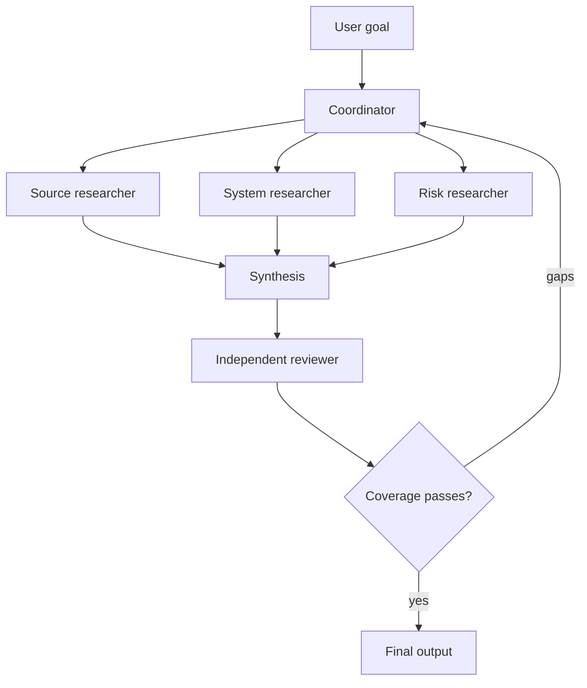

# Оркестрация нескольких агентов и делегирование

> Делегируйте ограниченный вопрос, а не всю свою неопределённость.

**Тип:** Справочный материал
**Языки:** Python
**Предварительные требования:** [Цикл использования инструментов — это контролируемое делегирование](../../10-tool-use-and-agentic-loops/); этап 14, уроки 12 и 28
**Время:** ~135 минут

## Цели обучения

- Выбирать между одним агентом, координатором, конвейером, параллельным выполнением и паттерном с рецензентом
- Формулировать делегируемые задачи с областью работы, инструментами, результатами и критериями завершения
- Использовать изоляцию контекста, чтобы уменьшить его разрастание и обеспечить независимость суждений
- Отличать детерминированные предварительные условия от адаптивных решений модели
- Объединять частичные результаты, не теряя сведения об их происхождении, ошибки и неустранённые пробелы

## Проблема

Исследовательскому агенту задан один огромный промпт. Он выполняет поиск по шести источникам, сопоставляет утверждения, рассчитывает уверенность, пишет отчёт, проверяет ссылки на источники и решает, нужны ли дополнительные исследования. По мере роста задачи агент забывает заданные вначале ограничения и повторяет поисковые запросы. Команда разделяет его работу между пятью агентами с широким набором инструментов и инструкцией «сотрудничать, пока отчёт не станет превосходным».

Новая система обходится дороже, и её сложнее отлаживать. Два агента исследуют одно и то же утверждение. Один возвращает обычный текст там, где координатор ожидает JSON. Рецензент видит рассуждения генератора и повторяет его допущения. Один агент незаметно завершает работу с ошибкой, но итоговый синтез интерпретирует отсутствие результата как свидетельство против утверждения.

Мультиагентная архитектура не решила проблему декомпозиции. Она лишь повысила цену отсутствующих контрактов.

## Концепция

### Определите, зачем нужен ещё один контекст

Создавайте субагента, только если он даёт конкретное преимущество:

- изоляцию контекста для ограниченной области задачи
- параллельное выполнение независимых работ
- специализированные инструменты или инструкции
- независимую проверку без контекста генератора
- экономию бюджета контекста координатора

Если подзадача сводится к одной детерминированной функции, используйте инструмент. Если это многократно используемые инструкции, загружаемые по требованию, используйте Skill. Если подзадаче нужны собственный цикл рассуждений, доказательства и условие остановки, может подойти субагент.

### Начните с пяти паттернов



#### Один агент

Лучший вариант, когда один контекст вмещает все необходимые доказательства, а последовательность использования инструментов коротка. Такую систему проще всего оценивать.

#### Последовательный конвейер

У каждого этапа есть строго определённый предшественник. Используйте этот паттерн, когда порядок и предварительные условия известны: например, сначала извлечение, затем проверка, рецензирование и формирование результата.

#### Параллельное разветвление и свёртка

Независимые задачи выполняются одновременно, после чего редуктор объединяет структурированные результаты. Используйте этот паттерн для рецензирования отдельных файлов или независимого исследования источников. Не распараллеливайте этапы, которые зависят от результатов друг друга.

#### Координатор и специалисты

Координатор выбирает и делегирует работу с учётом текущих пробелов. Используйте этот паттерн, если декомпозицию нельзя полностью определить заранее.

#### Генератор и независимый рецензент

Один контекст создаёт артефакт; другой получает этот артефакт, доказательства и критерии оценки без убедительно изложенного внутреннего нарратива генератора. Требуется именно независимость, а не второе мнение в рамках того же разговора.

### Составьте контракт делегирования

Полезная делегируемая задача содержит:

```text
Goal: one outcome the subagent owns
Scope: files, sources, claims, or systems included and excluded
Inputs: authoritative evidence and current state
Allowed tools: minimum necessary capabilities
Constraints: time, turns, cost, safety, and format
Output: machine-checkable schema with provenance and errors
Completion: observable conditions for done, partial, or blocked
Handoff: what the coordinator should do with each state
```

Формулировка «Тщательно исследуйте тему» не определяет критерий завершения. А формулировка «Верните до пяти подкреплённых утверждений, указав для каждого идентификатор источника, дату, ссылку на цитируемый фрагмент, класс уверенности, список противоречий и нерешённые вопросы» — определяет.

### Оставьте детерминированную последовательность вне модели

Если рецензирование должно выполняться после тестов, этот порядок должен обеспечиваться кодом. Если каждый файл необходимо проверить отдельно до проверки согласованности между файлами, оркестрация отслеживает манифест и блокирует второй проход до завершения первого.

Не полагайтесь на то, что под давлением разрастающегося контекста координатор не забудет обязательные предварительные условия из промпта.

Claude решает семантические вопросы, например определяет, какое отсутствующее утверждение требует дополнительного исследования. Код обеспечивает инварианты, такие как максимальная параллельность, обязательные результаты, состояние одобрения и порядок этапов.

### Используйте границу задачи осознанно

В Claude Code и средах выполнения агентов граница задачи или субагента может обеспечивать изолированный контекст и ограниченный набор инструментов. Конкретная конфигурация со временем меняется, поэтому сверяйтесь с актуальной документацией. Неизменными остаются следующие принципы проектирования:

- передавайте субагенту только необходимые доказательства
- ограничивайте инструменты явными списками разрешений
- запрашивайте вместе с результатом структурированные метаданные
- выполняйте независимые вызовы параллельно, только если они не зависят друг от друга
- оставляйте ответственность за глобальные ограничения и итоговое состояние координатору
- создавайте ответвление сеанса, если исследование альтернативы не должно изменять исходный сеанс

Изоляция предотвращает разрастание контекста. Она не гарантирует фактическую независимость, если все агенты получают одни и те же ошибочные доказательства или критерии оценки.

### Сохраняйте три состояния результата

Каждая подзадача должна возвращать одно из состояний:

- завершено: запрошенный контракт выполнен
- частично: получены корректные результаты, но явно указаны пробелы или недоступные источники
- заблокировано: безопасное продвижение невозможно без новых полномочий или нового состояния

Никогда не преобразуйте частичный результат в завершённый только потому, что заполнены некоторые поля. Координатор должен передавать сведения об отсутствующих доказательствах и структурированные ошибки на этап синтеза.

### Объединяйте по идентичности и происхождению

Редуктору нужны стабильные ключи. При рецензировании кода используйте идентификаторы файлов и замечаний. При исследовании — идентификаторы утверждений и источников. В поддержке — идентификаторы обращений и действий.

Правила объединения должны определять:

- обработку дубликатов
- сохранение противоречий
- приоритет источников, если он предусмотрен
- сравнение актуальности
- обработку неполных входных данных
- агрегирование уверенности
- эскалацию при разногласиях между агентами

Не позволяйте синтезатору скрывать противоречия ради более гладкого текста.

### Оценивайте траекторию

Итоговый результат может выглядеть правильным, даже если в процессе оркестрации работа выполнялась впустую или были нарушены границы. Проверяйте:

- правильность выбора субагента
- использование только разрешённых инструментов
- отсутствие дублирования ответственности за задачи
- порядок выполнения предварительных условий
- схему результатов и передачу ошибок
- бюджет ходов и затрат
- независимость рецензента
- полноту итогового состояния

Используйте искусственно созданные сбои инструментов и частичные результаты. Успешный сценарий — наименее интересное доказательство.

## Реализация

## Интерактивная лабораторная работа

```figure
16-multi-agent-topology
```

Используйте обозреватель топологий до добавления агентов. Сравните единый контекст, последовательный конвейер, параллельное разветвление, координатора и независимого рецензента; схема наглядно показывает затраты на координацию, предварительные условия и риск частичных результатов.

## Практическая лабораторная работа

Спроектируйте описанный ниже ограниченный исследовательский конвейер, затем удалите один лишний контекст и обоснуйте, изменится ли измеримый результат.

## Готовый артефакт

Заполненный файл [`outputs/orchestration-contract.md`](../outputs/orchestration-contract.md) — это конкретный пакет передачи исследовательского конвейера, а не пустой рабочий лист.

## Проверка

Локально проверьте идентификаторы задач, порядок зависимостей, бюджеты, частичное состояние и изоляцию рецензента:

```bash
cd certifications/claude/lessons/16-multi-agent-orchestration-and-delegation
python3 code/main.py
python3 -m unittest discover -s code/tests -v
```

Измените одну зависимость или удалите правило частичного состояния и убедитесь, что валидатор блокирует пакет. Тест урока проверяет решения по выбору топологии после выполнения практической части.

## Связь с итоговым проектом

Используйте проверенный контракт повторно как раздел об оркестрации в итоговом проекте по сценарию Architect Foundations.

Спроектируйте мультиагентный исследовательский конвейер для принятия технического решения.

### Шаг 1: Определите итоговый контракт

До определения агентов задайте формат аналитической записки для принятия решения, схему утверждений, требования к источникам и представление неустранённых пробелов.

### Шаг 2: Опробуйте базовый вариант с одним агентом

Измерьте качество, стоимость, задержку, объём повторной работы и рост контекста. Не добавляйте агентов, пока не выявите недостаток базового варианта.

### Шаг 3: Определите границы контекстов

Отделяйте только те аспекты, которым полезны изоляция, параллелизм, специализация или независимое рецензирование. Зафиксируйте ожидаемое улучшение от каждого нового контекста.

### Шаг 4: Составьте контракты задач

Создайте таблицу:

| Задача | Область | Разрешённые инструменты | Результат | Завершено | Частично | Бюджет |
|------|-------|---------------|--------|------|---------|--------|

### Шаг 5: Закодируйте предварительные условия

Используйте граф зависимостей или конечный автомат. Рецензент не может начать работу, пока все обязательные исследовательские задачи не получат состояние «завершено» или явно указанное состояние «частично».

### Шаг 6: Проведите стресс-тестирование объединения

Добавьте дублирующиеся утверждения, противоречащие друг другу даты, одного агента со сбоем, устаревшие доказательства и результат с неверной схемой. Убедитесь, что при синтезе сбой не будет незаметно стёрт.

## Применение

Для рецензирования кодовой базы надёжно работает следующая схема:

1. Составьте манифест файлов и межфайловых аспектов.
2. Параллельно выполните ограниченные проверки отдельных файлов с инструментами только для чтения.
3. Нормализуйте замечания по общей схеме.
4. Выполните один межфайловый проход по манифесту и нормализованным замечаниям.
5. Поручите независимому рецензенту отклонить слабо обоснованные и дублирующиеся замечания.
6. Применяйте принятые изменения только после детерминированных тестов и проверок области работы.

Не просите каждого агента проверять весь репозиторий. Это приводит к дублированию контекста и размывает ответственность.

В клиентской поддержке назначайте роли не только по компетенции, но и по полномочиям. Исследователь политик может читать документы. Специалист по рекомендациям возврата средств может анализировать случай. Полномочия на запись должен получать только отдельный исполнитель с соответствующим допуском.

## Паттерны принятия решений на экзамене

Для предварительных условий и полномочий выбирайте структурные механизмы контроля. Используйте субагентов для изолированных рассуждений, а не для детерминированных служебных вызовов.

Сильные варианты часто предусматривают следующее:

- использование координатора и специалистов с ограниченными задачами
- ограничение инструментов для каждой роли
- возврат структурированных результатов и частичных состояний
- параллельное выполнение независимых задач
- независимое рецензирование в новом контексте
- сохранение сведений о происхождении источников и ошибок
- повторное делегирование только выявленных пробелов

Слабые варианты предлагают большему числу агентов использовать один и тот же общий промпт и набор инструментов.

## Распространённые ошибки

### Агент для каждого этапа

Для фиксированного этапа не нужен автономный контекст. Если операция детерминирована, используйте код или инструмент.

### Параллельное выполнение по умолчанию

При параллельном выполнении зависимые задачи опираются на устаревшие допущения, а исправление результата их объединения требует значительных затрат.

### Координатор как хранилище данных

Необработанные стенограммы субагентов раздувают глобальный контекст. Возвращайте компактные структурированные результаты, а подробные доказательства храните вне промпта.

### Рецензент с контекстом генератора

Рецензент наследует ту же систему представлений и превращается в редактора стиля. Передавайте артефакт, доказательства и критерии оценки в чистом контексте.

## Упражнения

1. Разделите чрезмерно разросшийся промпт для одного агента на обязанности инструмента, Skill и субагента. Обоснуйте каждую границу.
2. Спроектируйте обработку частичного результата на случай, если истечёт время ожидания одного из трёх исследователей источников.
3. Добавьте детерминированные предварительные условия в конвейер проверки отдельных файлов и межфайловой проверки.
4. Сравните последовательную и адаптивную декомпозицию на одном и том же наборе оценивания.
5. Создайте тест траектории, который завершается с ошибкой, если два агента дублируют ответственность за задачу.

## Ключевые термины

| Термин | Как обычно говорят | Что это означает на самом деле |
|------|-----------------|------------------------|
| Координатор | Самый умный агент | Контекст, отвечающий за декомпозицию, глобальные ограничения, объединение и завершение |
| Субагент | Вызов функции | Изолированный цикл рассуждений с ограниченной задачей и инструментами |
| Разветвление | Использовать много агентов | Параллельно выполнять независимые ограниченные задачи |
| Свёртка | Обобщить всё | Объединить структурированные результаты по явным правилам обработки противоречий и частичных состояний |
| Передача | Отправить текст | Передать типизированное состояние, доказательства, ошибки и ответственность за следующий этап |
| Независимый рецензент | Спросить ещё раз | Оценить артефакт и доказательства в контексте, изолированном от убеждающего влияния генератора |

## Дополнительные материалы

- [Документация Claude Agent SDK](https://platform.claude.com/docs/en/agent-sdk/overview) об актуальных возможностях субагентов и сеансов
- [Создание эффективных агентов](https://www.anthropic.com/research/building-effective-agents) о паттернах оркестрации
- Этап 14, урок 28: более широкое сравнение подходов к оркестрации
- Этап 14, урок 39: проектирование независимого рецензента
