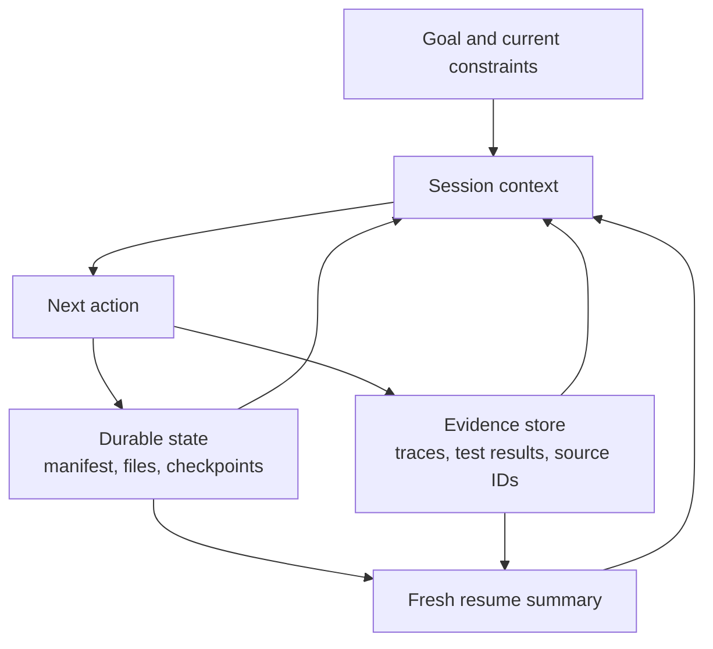

# Сессии, субагенты и контекст Agent SDK

> Возобновляйте состояние, когда важна непрерывность. Создавайте ответвление контекста, когда унаследованные предположения становятся источником риска.

**Тип:** Справочный материал
**Языки:** Python
**Предварительные требования:** [Agent SDK — это среда выполнения, а не разрешение](../../12-claude-agent-sdk-and-hooks/), [Мультиагентная оркестрация и делегирование](../../16-multi-agent-orchestration-and-delegation/); этап 14, урок 17
**Время:** ~120 минут

## Цели обучения

- Отделять сохраняемое состояние задачи от контекста диалога
- Выбирать новую, возобновлённую, ответвлённую или сжатую сессию с учётом риска сбоев
- Использовать субагентов для изоляции контекста и инструментов
- Размещать хуки вокруг детерминированных событий жизненного цикла
- Проектировать восстановление так, чтобы не воспроизводить устаревшие предположения и не дублировать побочные эффекты

## Проблема

Агент миграции репозитория работает несколько часов. Его контекст содержит
исходный план, вывод инструментов, неудачные эксперименты, частичные патчи, журналы тестов и
несколько сводок. После изменения зависимости команда возобновляет ту же сессию
и говорит: «Продолжай с того места, где остановился».

Агент следует устаревшему плану. Он повторяет операцию записи, которая уже
успешно завершилась до истечения времени ожидания. При сжатии сохранилась общая картина, но было потеряно
критически важное сообщение о сбое теста. Субагент-рецензент получает всю историю родительского агента
и предполагает, что прежнее поведение зависимости по-прежнему актуально.

Система смешала три сущности:

- сохраняемое внешнее состояние
- текущий контекст диалога
- историю выполнения

Они связаны, но не должны рассматриваться как единое хранилище.

## Основная идея

### Контекст — это рабочий набор

Контекст модели должен содержать информацию, необходимую для принятия следующих решений.
Он не является источником достоверных данных о завершённой работе, одобрениях, файлах,
контрольных точках или побочных эффектах инструментов.



Храните факты, которые должны сохраняться, вне контекста:

- текущий манифест задачи и статусы
- завершённые артефакты и их версии
- ключи идемпотентности и идентификаторы внешних действий
- одобрения и сроки их действия
- последние проверенные результаты тестирования и развёртывания
- неустранённые блокирующие проблемы
- ссылки на источники и трассировки

При запуске или возобновлении сессии формируйте из этого состояния компактный
актуальный рабочий набор.

### Выбор из четырёх операций с сессией

#### Новая сессия

Используйте чистую сессию, когда меняется цель или граница доверия, унаследованный контекст
ненадёжен либо предыдущая задача завершена. Передайте структурированное описание,
сформированное из достоверного состояния.

#### Возобновление сессии

Возобновляйте сессию, когда задача, ограничения и свидетельства остаются актуальными, а непрерывность
диалога полезна. Сначала повторно проверьте внешнее состояние. Идентификатор сессии
не доказывает, что окружающая среда не изменилась.

#### Ответвление сессии

Создавайте ответвление, когда при исследовании альтернативы нужно сохранить исходную ветвь. Это полезно
для сравнения конкурирующих архитектурных планов, независимых гипотез при отладке
или рискованного варианта миграции. Ответвление наследует отправную точку, но не должно
изменять общее состояние без явной координации.

#### Сжатие сессии

Сжимайте сессию, когда контекст разрастается, но непрерывность по-прежнему полезна для текущей работы. Хорошая
сжатая сводка сохраняет решения, ограничения, идентификаторы артефактов, состояние тестов,
нерешённые вопросы и следующее действие. Храните объёмные свидетельства вне контекста, оставляя ссылки на них.

Сжатие экономит место в контексте. Оно не обеспечивает надёжное выполнение с сохранением состояния, не гарантирует
сохранность критически важных фактов и не подтверждает актуальность данных.

### Используйте структурированный пакет возобновления

```json
{
  "goal": "Migrate the request client without changing public behavior",
  "scope": ["src/client.py", "tests/test_client.py"],
  "completed": [
    {"task": "inventory", "artifact": "work/inventory.json", "verified": true}
  ],
  "current_state": {
    "branch": "migration/client-v2",
    "dependency_version": "verified-at-resume",
    "tests": "12 passed, 1 blocked"
  },
  "open_gaps": ["timeout retry semantics need decision"],
  "constraints": ["no public API change", "no production writes"],
  "next_action": "compare retry behavior against the contract tests"
}
```

Пакет отражает актуальное состояние. Не пересказывайте каждый ход диалога.

### Изолируйте контекст субагента по зоне ответственности

Субагент должен получать:

- одну цель и область работы
- минимум релевантных свидетельств
- ограниченный набор инструментов
- явную схему вывода и ошибок
- бюджет ходов, времени и затрат
- правила завершения и эскалации

Он не должен получать несвязанную с задачей историю родительского агента. Изоляция помогает сосредоточиться и
может сохранить независимость рецензента.

Координатор хранит глобальное состояние и проверяет соответствие возвращённого результата контракту перед
объединением.

### Используйте хуки для детерминированных операций жизненного цикла

Хуки выполняются при определённых событиях, связанных с сессиями или инструментами. Точные названия событий и
конфигурация различаются, поэтому сверяйтесь с актуальной документацией Agent SDK и Claude Code.
Устойчивое правило размещения таково:

- хуки перед действием проверяют или блокируют его
- хуки после действия нормализуют, регистрируют или проверяют результат
- хуки остановки проверяют завершение и выполняют очистку
- хуки сессии загружают или сохраняют контролируемое состояние

Примеры:

- блокировать запись за пределами объявленной области
- требовать действующего одобрения перед использованием деструктивного инструмента
- обрезать или выносить во внешнее хранилище слишком большой вывод инструмента
- приводить ошибки инструментов к общей схеме
- запускать форматтер или целевой тест после редактирования
- записывать неизменяемую ссылку на трассировку

Не помещайте семантические решения, требующие рассуждения модели, в хрупкую логику shell-скриптов.
Не реализуйте строгую авторизацию в промпте.

### Сделайте побочные эффекты идемпотентными

При возобновлении после истечения времени ожидания действие может повториться, если его результат был потерян. Для каждой
внешней записи необходима стратегия идемпотентности или сверки.

Например:

- создавать возврат средств с уникальным ключом запроса
- записывать ожидаемый хеш файла перед применением патча
- проверять версию развёртывания перед повторной попыткой
- сохранять идентификатор вызова инструмента и статус результата
- сверять неизвестные результаты перед очередной записью

«Попробовать ещё раз» безопасно только после классификации ошибки.

### Повторно проверяйте состояние на границе

Перед продолжением:

1. Определите текущие файлы, версии зависимостей, ветвь и состояние сервиса.
2. Сравните их с контрольной точкой.
3. Отметьте устаревшие предположения.
4. Повторно выполните минимальную проверку, которая подтверждает безопасность следующего шага.
5. Создайте новую сводку текущего состояния.

Если среда существенно изменилась, запустите новую сессию или создайте ответвление с новым планом,
а не заставляйте старую сессию переосмысливать себя.

### Планируйте бюджет контекста

Выделяйте место в контексте для следующих данных:

- цель и жёсткие ограничения
- текущий план и манифест
- недавние свидетельства, необходимые для следующего выбора
- компактный релевантный вывод инструментов
- контракт итогового результата

Большие необработанные журналы, целые репозитории и повторяющиеся схемы инструментов должны находиться вне
активного рабочего набора либо загружаться по мере исследования.

Используйте субагентов для ограниченного поиска и возвращайте сводки со ссылками. Контекст —
дефицитное пространство для рассуждений, даже если его номинальное окно велико.

## Практическая реализация

## Интерактивная лабораторная работа

```figure
17-session-context-budget
```

Используйте симулятор бюджета контекста, чтобы распределить рабочий набор между целями,
ограничениями, свидетельствами, результатами инструментов и контрактом вывода. Он наглядно показывает, почему
сжатие может уменьшить объём, но не доказывает актуальность состояния.

## Практическая лабораторная работа

Сделайте одну контрольную точку в упражнении по миграции недействительной и исправьте пакет возобновления,
не доверяя истории диалога.

## Готовый артефакт

Заполненный файл [`outputs/session-recovery-packet.md`](../outputs/session-recovery-packet.md)
описывает одну прерванную миграцию с хешами, неизвестным побочным эффектом и
безопасным следующим действием.

## Проверка

Убедитесь, что он включает сохраняемое состояние, повторную проверку, ключ идемпотентности и
изолированное рецензирование:

```bash
cd certifications/claude/lessons/17-agent-sdk-sessions-subagents-and-context
python3 code/main.py
python3 -m unittest discover -s code/tests -v
```

Тест проверяет правила выбора сессии и восстановления.

## Связь с итоговым проектом

Приложите проверенный пакет к итоговому проекту Architect Foundations как свидетельство
реализации возобновления и управления контекстом.

Создайте упражнение по миграции с сохранением состояния между тремя сессиями.

### Сессия 1: инвентаризация и план

Подготовьте манифест файлов, тестов, публичных контрактов, зависимостей и рисков.
Сохраните его вне диалога. Пока ничего не реализуйте.

### Сессия 2: реализация и проверка

Начните с манифеста и текущего состояния репозитория. Используйте инструменты работы с файлами с ограниченными правами.
Сохраняйте идентификаторы завершённых задач, хеши файлов, ссылки на вывод тестов и нерешённые
вопросы.

На середине работы имитируйте истечение времени ожидания после записи файла. При возобновлении сначала сверьте хеш
файла и только затем при необходимости повторяйте действие.

### Сессия 3: независимое рецензирование

Создайте ответвление с чистым контекстом для рецензирования. Передайте diff, требования, тесты и рубрику,
но не стенограмму реализации. Рецензент возвращает структурированные замечания,
подкреплённые свидетельствами.

### Требования к хукам

- проверка области перед записью
- целевая проверка после записи
- ограничение размера вывода инструмента со ссылкой на внешнее свидетельство
- структурированная запись трассировки
- проверка при остановке, требующая завершённого манифеста или явно указанного частичного состояния

## Применение

Для агента службы поддержки храните состояние обращения, идентификаторы найденных свидетельств,
одобрение и результат инструмента в постоянной записи об обращении. Контекст сессии содержит
текущий вопрос и релевантные свидетельства. Если человек вернётся через несколько часов, заново сформируйте
рабочий набор из записи об обращении и повторно проверьте актуальность политики.

В CI каждый запуск должен начинаться с чистого состояния на основе коммита и объявленных входных данных. Повторное использование
интерактивной сессии может привнести неявное состояние. Вместо этого явно передавайте сохранённые результаты или
структурированную сводку.

## Принципы выбора на экзамене

Выбирайте возобновление, если непрерывность остаётся актуальной, ответвление — для изолированных альтернатив, а новую
сессию — когда риск связан с устаревшим контекстом. Сжатие решает проблему объёма, но не достоверности.

Предпочитайте ответы, которые:

- сохраняют состояние вне промпта
- повторно проверяют текущую среду при возобновлении
- изолируют контекст и инструменты субагента
- используют хуки для детерминированных проверок и нормализации
- сверяют неизвестные побочные эффекты перед повторной попыткой
- передают структурированные сводки со ссылками на артефакты

Избегайте ответов, в которых каждому новому агенту передают всю старую стенограмму.

## Распространённые ошибки

### Сессия равна состоянию

История диалога не обеспечивает транзакции, идемпотентность, управление версиями или
достоверное внешнее состояние.

### Сжатие равно восстановлению

В сводке может отсутствовать единственный существенный сбой. Для восстановления используются сохраняемое состояние и
проверка.

### Ответвление равно независимости

Ответвление может унаследовать ошибочные свидетельства. Для независимости рецензента также необходимы чистая
рубрика и контролируемые входные данные.

### Хуки повсюду

Избыток непрозрачных хуков затрудняет отладку поведения. Делайте их небольшими, наблюдаемыми,
версионируемыми и привязанными к именованному инварианту.

## Упражнения

1. Спроектируйте пакет возобновления для агента, работа которого была прервана во время развёртывания.
2. Добавьте идемпотентность и сверку в вызов инструмента с серьёзными последствиями.
3. Определите, что требуется в пяти сценариях: возобновление, ответвление, сжатие или новая сессия.
4. Создайте карту хуков, отделяющую семантическую работу модели от детерминированных проверок.
5. Протестируйте рецензента с контекстом стенограммы генератора и без него, затем сравните
   повторяющиеся предположения.

## Ключевые термины

| Термин | Как обычно говорят | Что это означает на самом деле |
|------|-----------------|------------------------|
| Сессия | Постоянная память | Рабочий контекст диалога, а не достоверное состояние системы |
| Возобновление | Продолжить вслепую | Повторно использовать актуальный контекст после сверки текущего внешнего состояния |
| Ответвление | Скопировать всё | Создать ветвь существующего контекста для изолированной альтернативной работы |
| Сжатие | Сохранить все подробности | Сжать текущий контекст, сохраняя достоверные свидетельства во внешнем состоянии |
| Хук | Промпт | Детерминированный код, привязанный к событию жизненного цикла |
| Идемпотентность | Повторить один раз | Повторное выполнение операции не создаёт дополнительного эффекта для запроса с тем же идентификатором |

## Дополнительные материалы

- [Документация по сессиям Claude Agent SDK](https://platform.claude.com/docs/en/agent-sdk/sessions) с актуальным описанием поведения сессий
- [Документация по хукам Claude Agent SDK](https://platform.claude.com/docs/en/agent-sdk/hooks) с актуальным перечнем событий жизненного цикла
- Этап 14, урок 40: передача работы между несколькими сессиями
- Этап 15, урок 12: надёжное выполнение с сохранением состояния
