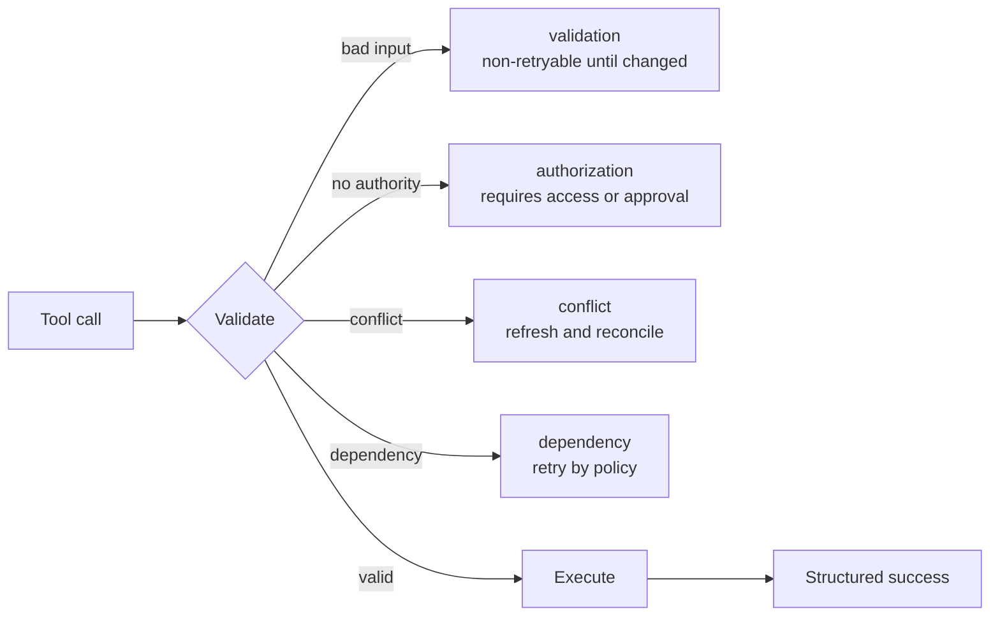

# Контракты инструментов, ошибки и прогрессивное обнаружение

> Модель выбирает из того интерфейса, который вы описали. Неоднозначные инструменты приводят к неоднозначному поведению.

**Тип:** Справочник
**Языки:** Python
**Предварительные требования:** [Цикл использования инструментов — это контролируемое делегирование](../../10-tool-use-and-agentic-loops/), [MCP отделяет возможности от хоста](../../11-mcp-server-design-and-integration/); фаза 13, урок 05
**Время:** ~120 минут

## Цели обучения

- Составлять имена, описания и схемы инструментов с непересекающимися границами
- Проектировать структурированные ошибки инструментов и MCP, направляющие безопасное восстановление
- Осознанно управлять выбором инструментов и предоставлять узкий набор инструментов
- Разграничивать конфигурацию и секреты MCP для пользователя и проекта
- Применять прогрессивное обнаружение к большим каталогам инструментов, не теряя контроля авторизации

## Проблема

Агент видит три инструмента:

- `search`
- `find`
- `lookup`

В описании каждого сказано «найти информацию». Один ищет по общедоступным веб-страницам,
другой обращается к внутренним записям клиентов, а третий извлекает утверждённые правила.
Схемы принимают одну строку. При ошибках возвращается произвольный текст.

Модель выбирает непоследовательно. Задача по поиску в открытых источниках обращается к приватным данным.
При вопросе о правилах выполняется поиск в интернете. Когда инструмент возвращает «сбой», агент
повторяет попытки, пока не исчерпает свой бюджет.

Модель запуталась не из-за использования инструментов. Интерфейс стёр различия, которые
были нужны ей для безопасного выбора.

## Концепция

### Описание инструмента — часть пространства принятия решений

Надёжный контракт инструмента определяет:

- одно действие и один объект
- когда его использовать
- когда его не использовать
- границы авторитетного источника данных
- требования к идентификации или одобрению
- смысл и ограничения аргументов
- структуру результата и ошибки
- побочные эффекты и обратимость

Сравните:

```json
{
  "name": "search",
  "description": "Search for information",
  "input_schema": {
    "type": "object",
    "properties": {"q": {"type": "string"}}
  }
}
```

с:

```json
{
  "name": "search_active_support_policy",
  "description": "Search approved active support-policy text for the caller's region. Use for policy questions. Do not use for customer-account facts or public web research. Returns versioned policy passages with source IDs.",
  "input_schema": {
    "type": "object",
    "properties": {
      "query": {"type": "string", "minLength": 3},
      "region": {"type": "string", "enum": ["uk", "eu", "us"]},
      "top_k": {"type": "integer", "minimum": 1, "maximum": 8}
    },
    "required": ["query", "region", "top_k"],
    "additionalProperties": false
  }
}
```

Второй интерфейс задаёт границы выбора и обещает определённый результат. При
выполнении сервис всё равно должен проверять идентификационные данные и регион.

### Избегайте пересекающихся инструментов

Два инструмента пересекаются, если модель не может определить, какой из них отвечает за запрос. Исправьте
интерфейс следующим образом:

- объедините одинаковые действия в одном инструменте
- разделите инструменты по видимым границам объекта или полномочий
- укажите в имени источник или побочный эффект
- добавьте положительные и отрицательные критерии использования
- приведите примеры входных данных там, где их поддерживают текущие API
- проверяйте выбор на парах, способных вызвать путаницу

Не добавляйте правила в промпт, чтобы компенсировать несогласованность каталога.

### Закрепляйте инварианты в схемах

Используйте типы, перечисления, обязательные поля, границы, шаблоны и закрытые объекты. Строка
под названием `options` переносит валидацию в естественный язык. Типизированные поля затрудняют
выражение недопустимых состояний.

Валидность по схеме не означает семантическую валидность. Сервис всё равно должен проверять, что
учётная запись существует, сумма соответствует правилам, пользователь имеет полномочия, а указанные
ресурсы принадлежат арендатору.

### Возвращайте ошибки как данные



Контракт ошибки должен включать:

- категорию
- признак допустимости повторной попытки
- безопасное сообщение
- ошибки полей, где это уместно
- частичный результат и происхождение данных
- рекомендуемое безопасное следующее действие
- ссылку на трассировку или инцидент

Не раскрывайте трассировки стека, секреты, необработанные учётные данные или внутренние пути. Не
помечайте каждую ошибку как допускающую повторную попытку.

Для инструментов MCP используйте структурированный сигнал ошибки протокола и содержимое, которое
клиент может интерпретировать. Успех транспорта и успех инструмента — разные вещи. Точные поля
сверяйте с актуальной спецификацией.

### Управляйте выбором инструментов осознанно

В зависимости от текущих возможностей API средства управления выбором инструментов могут требовать использования инструмента, разрешать автоматический выбор, указывать
конкретный инструмент или запрещать использование инструментов.

Принудительно используйте структурированный вывод инструмента, когда приложению требуется типизированный результат.
Разрешайте автоматический выбор, когда модель должна решить, использовать ли инструмент и какой именно.
Не вынуждайте выполнять действие в реальном мире лишь ради получения JSON. Отделяйте извлечение от
выполнения.

Если разрешено параллельное использование инструментов, убедитесь, что вызовы независимы, а управляющая среда
может сопоставить каждый результат с правильным идентификатором вызова.

### Предоставляйте меньше инструментов

Список инструментов занимает контекст и создаёт варианты выбора. Предоставляйте каждой роли минимальный
необходимый ей каталог.

- Агент-исследователь: инструменты только для чтения веб-страниц и источников.
- Агент по правилам: актуальные ресурсы с правилами и поиск.
- Система рекомендаций по возвратам: чтение обращения и расчёт рекомендации.
- Уполномоченный исполнитель: один ограниченный инструмент записи с недавно полученным одобрением.

Не предоставляйте одному агенту все четыре каталога только ради удобства.

### Обнаруживайте большие каталоги прогрессивно

Начните с часто используемых инструментов и механизма поиска возможностей. Загружайте специализированные
определения только после того, как задача подтвердит потребность в них.

Прогрессивное обнаружение может улучшить:

- использование контекста
- выбор инструментов
- стабильность кеша промптов
- объём поверхности для проверки безопасности

При обнаружении необходимо учитывать идентификацию и область доступа. Оно не должно раскрывать названия
или описания возможностей с ограниченным доступом.

### Разграничивайте конфигурацию MCP

Конфигурация проекта версионируется для команды. Пользовательская конфигурация действует
во всех проектах одной учётной записи или машины. Храните общие объявления серверов и
безопасные значения по умолчанию на уровне проекта. Не помещайте личные пути, локальные настройки и
пользовательские учётные данные в файлы, фиксируемые в репозитории.

Для секретов используйте ссылки на переменные окружения. Никогда не фиксируйте сами значения. Проверяйте
команду сервера, аргументы, окружение, транспорт, источник и набор инструментов.

Серверы MCP могут предоставлять инструменты, ресурсы и промпты. Выбирайте примитив исходя
из направления управления:

- инструмент: модель запрашивает действие
- ресурс: хост или модель читает контекстные данные
- промпт: пользователь или хост вызывает повторно используемый шаблон

Не оборачивайте каждый статический документ в инструмент для выполнения действий.

### Выбирайте встроенные инструменты Claude Code по назначению

Устойчивые границы применения:

- Read — для содержимого известного файла
- Glob — для поиска путей
- Grep — для поиска текста и символов
- Edit — для ограниченных изменений существующих файлов
- Write — для создания или полной замены файла
- Bash — для команд, тестов и операций, для которых нет более безопасного специализированного инструмента

Ограничивайте инструменты Bash и записи в соответствии с задачей. Используйте наиболее специализированный интерфейс, который
выражает предполагаемую операцию и создаёт проверяемые свидетельства.

## Реализация

## Интерактивная лабораторная работа

```figure
18-tool-discovery-contract
```

Используйте схему контракта обнаружения, чтобы сравнить пересекающиеся инструменты, прогрессивно
загружаемые инструменты и авторизацию выполнения. Изменяйте категории ошибок, чтобы увидеть, когда
единственным безопасным продолжением будет повторная попытка, изменение входных данных, получение одобрения или эскалация.

## Практическая лабораторная работа

Добавьте одно пересекающееся описание и одну ошибку авторизации, допускающую повторную попытку,
пронаблюдайте оба сбоя и исправьте интерфейс и контракт восстановления.

## Готовый артефакт

Заполненный файл [`outputs/tool-catalog-review.md`](../outputs/tool-catalog-review.md)
содержит отдельные границы для правил, учётных записей и поиска в открытых источниках, а также матрицу
сбоев.

## Проверка

Запустите детерминированную проверку контракта:

```bash
cd certifications/claude/lessons/18-tool-contracts-errors-and-progressive-discovery
python3 code/main.py
python3 -m unittest discover -s code/tests -v
```

Тестовые вопросы проверяют те же правила выбора.

## Связь с итоговым проектом

Перенесите артефакт в итоговый проект Architect Foundations как индекс контрактов инструментов и MCP.

Проведите аудит каталога инструментов по этому контрольному списку.

| Вопрос | Свидетельство |
|----------|----------|
| Определяет ли каждое имя одно действие и один объект? | Тест выбора |
| Различаются ли положительные и отрицательные сценарии использования? | Оценивание пар, способных вызвать путаницу |
| Отклоняет ли схема недопустимые структуры? | Тесты валидатора |
| Обеспечивает ли сервис соблюдение семантических правил и правил авторизации? | Интеграционные тесты |
| Классифицированы ли ошибки и учтена ли возможность повторных попыток? | Фикстуры сбоев |
| Указан и ограничен ли каждый побочный эффект? | Модель угроз |
| Минимален ли набор инструментов для каждой роли? | Матрица возможностей |
| Могут ли большие каталоги загружаться прогрессивно? | Измерение контекста и кеша |
| Разделены ли конфигурации проекта и пользователя? | Проверка конфигурации |
| Секреты только упоминаются по ссылке и никогда не хранятся? | Сканирование репозитория |

Создайте не менее двенадцати сценариев выбора, включая запросы, которым правдоподобно
могут соответствовать два инструмента. Оценивание проходит успешно, только если модель выбирает правильный инструмент или
правильно решает не использовать никакой инструмент.

Внедрите сбои валидации, авторизации, конфликтов, ограничения частоты запросов, тайм-аутов и частичных
результатов. Убедитесь, что управляющая среда меняет поведение в соответствии с категорией.

## Применение

Для структурированного извлечения определите один инструмент без побочных эффектов, схема которого представляет
нужную запись. Принудительно вызывайте этот инструмент, когда требуется структурированная запись. Затем
проверяйте семантические ограничения и происхождение данных. Не используйте производственный инструмент записи
повторно в качестве схемы вывода.

Для большого корпоративного каталога используйте реестр, чтобы находить возможности по задаче и
области доступа. Загружайте только выбранные определения. Отслеживайте размер каталога, точность обнаружения,
выбор инструментов, попадания в кеш и попытки несанкционированного обнаружения.

## Шаблоны решений для экзамена

Проблемы инструментов часто оказываются проблемами интерфейса. Исправляйте описания, границы,
схемы, распределение и контракты ошибок, прежде чем усложнять промпт.

Отдавайте предпочтение ответам, которые:

- дают инструментам различимые имена и инструкции о том, когда их не использовать
- возвращают структурированные результаты в стиле `isError` с семантикой повторных попыток
- используют выбор инструмента для обязательного типизированного вывода там, где это уместно
- отделяют конфигурацию проекта от пользовательских секретов
- используют ресурсы для контекстных данных, а инструменты — для действий
- применяют прогрессивное обнаружение к большим каталогам

## Распространённые ловушки

### Описание инструмента вместо авторизации

«Только для администраторов» — это текст. Сервису нужны аутентифицированная область доступа и правила.

### Текст ошибки вместо стратегии восстановления

Модель пытается угадать, означает ли «сбой» повторную попытку, изменение входных данных, эскалацию или остановку.
Возвращайте явную категорию и состояние повторной попытки.

### Один инструмент для всех операций

Огромные схемы и условное поведение затрудняют выбор, валидацию и
авторизацию. Разделяйте по значимым границам.

### Секреты в общей конфигурации

Файлы проекта предназначены для совместной работы. Указывайте имена переменных окружения, а
значения предоставляйте вне системы контроля версий.

## Упражнения

1. Перепишите пять неоднозначных определений инструментов, задав различимые границы.
2. Создайте оценивание пар, способных вызвать путаницу, для внутреннего поиска, поиска в открытых источниках и поиска по правилам.
3. Спроектируйте структурированные частичные результаты для тайм-аута поиска по нескольким источникам.
4. Разделите монолитный сервер MCP на инструменты, ресурсы и промпты.
5. Создайте примеры конфигурации проекта и пользователя без значений секретов.

## Ключевые термины

| Термин | Как обычно говорят | Что это означает на самом деле |
|------|-----------------|------------------------|
| Контракт инструмента | Имя функции | Инструкции по выбору, схема, результат, ошибка, полномочия и границы побочных эффектов |
| Указания, когда не использовать | Дополнительный текст промпта | Явные ситуации, в которых за запрос отвечает другой интерфейс |
| Выбор инструмента | Разрешение на инструмент | Управление на уровне запроса тем, должен ли Claude вызвать инструмент и какой именно |
| Прогрессивное обнаружение | Динамическая авторизация | Загрузка релевантных возможностей по требованию после обнаружения с учётом области доступа |
| Ресурс MCP | Инструмент чтения | Контекстные данные, идентифицируемые и читаемые через примитив ресурса |
| Область проекта | Глобальная конфигурация | Версионируемая конфигурация, предназначенная для одного репозитория или команды |

## Дополнительные материалы

- [Документация Claude по использованию инструментов](https://platform.claude.com/docs/en/agents-and-tools/tool-use/overview)
- [Спецификация MCP](https://modelcontextprotocol.io/specification/latest)
- [Документация Claude Code по MCP](https://docs.anthropic.com/en/docs/claude-code/mcp)
- Фаза 13, урок 05 — проектирование схем инструментов
- Фаза 13, урок 15 — угрозы отравления инструментов
