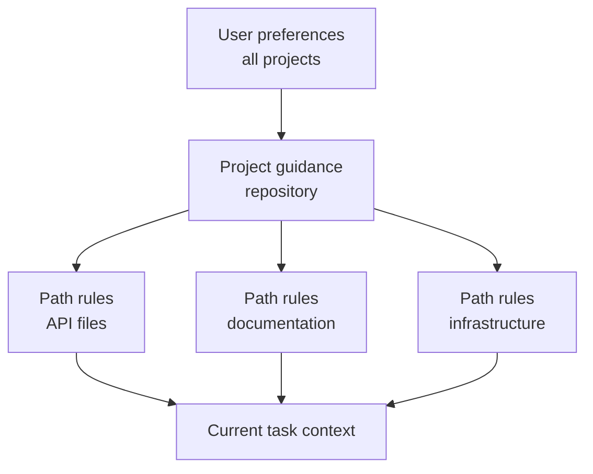

# Память, правила, Skills и CI в Claude Code

> Размещайте стабильные рекомендации там, где верна их область действия, а исполняемые ограничения — там, где ошибки недопустимы.

**Тип:** Справочник
**Языки:** Python
**Предварительные требования:** [Масштабирование Claude Code с помощью общих ограничений](../../15-claude-code-for-development-teams/), [Сессии, субагенты и контекст в Agent SDK](../../17-agent-sdk-sessions-subagents-and-context/)
**Время:** ~210 минут

## Цели обучения

- Проектировать иерархию инструкций проекта и пользователя без раздувания контекста
- Выбирать CLAUDE.md, правила для путей, Skills, команды, агентов, хуки и настройки в соответствии с их назначением
- Создавать и распространять настоящий многофайловый пакет `SKILL.md` с узкими разрешениями на инструменты
- Использовать планирование, прямое выполнение и ограниченных субагентов с явными отчётами о препятствиях
- Настраивать Claude Code без интерфейса для получения воспроизводимых свидетельств в CI
- Не допускать, чтобы устаревшая память, широкие разрешения и скрытая локальная конфигурация управляли работой команды

## Проблема

Команда хранит все инструкции в одном корневом `CLAUDE.md`: историю архитектуры,
форматирование, правила работы с базой данных, шаги развёртывания, личные предпочтения, команды и
примеры для шести языков. Всё это копируется в каждую задачу.

Разработчики добавляют личные переопределения. В CI используется другая конфигурация. Одна команда
предполагает наличие доступа на запись. Хук с широкой областью действия переформатирует посторонние файлы. В инструкциях
сказано «всегда запускать все тесты», поэтому небольшое изменение документации запускает набор тестов на 40 минут.
Когда агент игнорирует правило безопасности, команда добавляет ещё больше текста, выделенного жирным.

Проблема не в недостатке инструкций. Она заключается в области действия, приоритетах,
постепенном раскрытии информации и смешении рекомендаций с принудительным контролем.

## Основная идея

### Подбирайте механизм под задачу

| Механизм | Оптимальное применение | Чего избегать |
|-----------|----------|-------|
| `CLAUDE.md` | Краткие стабильные рекомендации для репозитория и указатели | Полные руководства, временное состояние, секреты |
| Импортированные файлы | Общие вспомогательные инструкции, хранящиеся рядом с ответственными за них компонентами | Циклические или непрозрачные графы инструкций |
| Правила для путей | Рекомендации, верные только для соответствующих файлов | Глобальные правила, копируемые в каждую задачу |
| Skill | Многократно используемый процесс или предметное руководство, загружаемое при необходимости | Разовые факты или жёсткая авторизация |
| Команда | Совместимое имя для рабочего процесса, явно запускаемого пользователем | Новые многошаговые пакеты без структуры Skill |
| Агент | Ограниченная роль с изолированным контекстом и инструментами | Детерминированные служебные функции |
| Хук | Детерминированная проверка, блокировка, нормализация или автоматизация | Неограниченные семантические суждения |
| Настройки | Конфигурация разрешений, модели, плагинов и среды выполнения | Секретные значения, зафиксированные в репозитории |

Примечание о продукте, проверено 2026-08-09: пользовательские команды были объединены со Skills.
Файлы в `.claude/commands/` остаются совместимыми, а
`.claude/skills/<name>/SKILL.md` — предпочтительный формат пакета для новых рабочих процессов.
Точные поля, приоритеты и доступность возможностей продукта могут меняться. Перед реализацией сверяйтесь с
актуальной документацией Claude Code. Программа экзамена CCAR-F от июля 2026 года
предполагает понимание иерархии, правил, команд, Skills,
агентов, памяти, планирования и рабочих процессов без интерфейса.

### Сохраняйте корневой файл инструкций небольшим

Корневой файл должен помочь компетентному новому участнику сразу начать работу правильно.

Включайте в него:

- назначение проекта и неочевидные архитектурные границы
- канонические команды сборки, тестирования и форматирования
- файлы, являющиеся источниками истины
- ограничения безопасности и области действия
- ссылки или импорты более подробных рекомендаций
- требования к проверке и внесению изменений

Исключайте:

- временный статус задачи
- сгенерированные перечни
- длинные справочники по API
- личные настройки редактора
- секретные значения
- инструкции, относящиеся только к одному каталогу

Относитесь к нему как к навигатору для адаптации в проекте, а не как к свалке знаний.

### Размещайте инструкции в самой узкой применимой области



Область пользователя содержит личные значения по умолчанию, которые не должны определять поведение команды. Область проекта
содержит версионируемые общие решения. Правила для конкретных путей загружаются только там, где
применимы их шаблоны файлов. Инструкции задачи содержат текущий запрос.

Если два правила противоречат друг другу, изучите документированный порядок приоритетов и явно укажите
источник истины проекта. Критически важный рабочий процесс не должен зависеть от скрытого локального переопределения.

### Импортируйте стабильные вспомогательные рекомендации

Используйте импорты, чтобы корневой файл оставался кратким, а ответственность за модули сохранялась.
Например, политика миграции базы данных должна находиться рядом с документацией базы данных. Указатель в
корневом файле делает её доступной для обнаружения.

Проверяйте граф импорта:

- каждая целевая сущность существует
- циклы отсутствуют
- импорт файлов с широкой областью не раскрывает секреты или нерелевантный текст
- ответственный и условие обновления чётко определены
- удаление или переименование рекомендаций приводит к заметной ошибке

Команды проверки памяти помогают выяснить, какие инструкции активны. Используйте
их для отладки конфигурации, а не для хранения невосстановимого состояния проекта.

### Используйте Skills для постепенного раскрытия информации

Skill объединяет повторяемый метод, справочные материалы, скрипты и артефакты. Его
описание помогает агенту определить применимость. Полное содержимое загружается только
при выборе Skill, сохраняя контекст для посторонней работы.

Примеры хороших Skills:

- проверка миграции базы данных
- первичный анализ инцидента
- генерация примечаний к выпуску
- контрольный список модели угроз
- интервью для принятия архитектурного решения

Skill должен определять входные данные, последовательность, свидетельства, результат и условия остановки.
Он не должен содержать секреты или выдавать разрешения.

Фактический проектный Skill находится по пути `.claude/skills/<skill-name>/SKILL.md`. Его
входной файл содержит frontmatter в формате YAML и инструкции Markdown:

```yaml
---
name: migration-review
description: Review database migration files when a change adds or modifies paths under migrations/. Use it before merge to collect forward, rollback, locking, and data-safety evidence.
allowed-tools: Read Grep Glob Bash(python3 ${CLAUDE_SKILL_DIR}/scripts/check_scope.py *)
---
```

Описание — это контракт запуска. Укажите, что делает Skill и когда он
применим, используя формулировки, которыми действительно воспользуется разработчик. Проверьте запросы, которые должны
запускать его, и близкие по смыслу запросы, которые не должны этого делать. Используйте
`disable-model-invocation: true`, если Skill должен загружаться только при явном вызове `/skill-name`.

`allowed-tools` предварительно разрешает соответствующие инструменты на ход вызова. Это не
ограничивает набор доступных инструментов, не переопределяет запрещающие правила и не сохраняется как разрешение
на всю сессию. Делайте шаблон столь же узким, как упакованная процедура, и проверяйте проектные
Skills до подтверждения доверия каталогу.

Выносите детали из `SKILL.md` и направляйте к ним явно:

| Файл Skill | Назначение | Условие загрузки |
|---|---|---|
| `SKILL.md` | Триггер, основная последовательность, условие остановки, контракт результата | При вызове Skill |
| `references/review-checklist.md` | Подробные свидетельства предметной области | Когда основная последовательность доходит до проверки |
| `scripts/check_scope.py` | Детерминированная проверка путей | Перед чтением запрошенных файлов миграции |
| `examples/accepted.md` | Один показательный формат результата | Когда формат неоднозначен |

Ссылайтесь из `SKILL.md` на каждый вспомогательный файл, чтобы Claude понимал, зачем и когда его
открывать. Определяйте пути внутри пакета через `${CLAUDE_SKILL_DIR}`, не полагаясь
на текущий рабочий каталог. Поставляемый пакет в
[`outputs/migration-review-skill/`](../outputs/migration-review-skill/) — это
готовый к запуску пример.

### Используйте команды для явно выраженного намерения пользователя

Команды полезны, когда пользователь намеренно запускает повторяемый рабочий процесс.
Определите подсказки для аргументов, разрешённые инструменты и контекст выполнения. Если команде нужна
изоляция, используйте ответвлённый контекст, когда это поддерживается и уместно.

Примеры:

- проверить один файл миграции
- сгенерировать ADR по результатам интервью
- выполнить целевой план тестирования
- изучить трассировку сбоя CI

Избегайте команд, которые без предупреждения записывают данные, выполняют развёртывание или используют широкий доступ к Bash. Имя
и контракт аргументов должны ясно показывать последствия.

Для новых задач реализуйте такой явный рабочий процесс как вызываемый пользователем Skill.
Существующие файлы `.claude/commands/<name>.md` по-прежнему создают `/<name>` и могут быть перенесены
без нарушения работы пользователей. Отдавайте предпочтение каталогу Skill, когда процедуре нужны
скрипты, справочные материалы, шаблоны, управление вызовом или распространение через
плагин.

### Используйте субагентов как ограниченных сборщиков свидетельств

Выполните `/agents`, чтобы создавать определения многократно используемых субагентов и управлять ими. Храните
проектного агента в `.claude/agents/`, чтобы его роль проверялась вместе с кодовой базой.
Поле `description` сообщает Claude, когда делегировать работу; `tools` ограничивает набор инструментов;
`maxTurns` задаёт жёсткий бюджет ходов; `isolation: worktree` предоставляет агенту,
редактирующему файлы, отдельную рабочую копию.

```markdown
---
name: migration-auditor
description: Audit migration safety when a change touches migrations/. Return evidence and blockers; do not edit.
tools: Read, Grep, Glob, Bash
maxTurns: 10
isolation: worktree
---

Inspect only the assigned migration and adjacent schema code.
Stop after ten turns or twenty minutes, whichever comes first.
Return JSON with status, evidence, blockers, and next_step.
Never replace missing evidence with an assumption.
```

Ограничение по ходам или времени — это условие остановки, а не свидетельство завершения. Родительская
сессия проверяет результат и отвечает за интеграцию. Требуйте структурированных отчётов о препятствиях,
чтобы субагент, не имеющий доступа к файлу, возвращал `status: blocked`, точное
описание препятствия, сведения о предпринятых попытках и узкий `next_step`, а не молча
расширял инструменты или область действия.

Используйте изоляцию рабочим деревом только для субагента, который редактирует файлы. Исследователю с доступом только для чтения часто
достаточно отдельного контекста. Рабочие деревья изолируют файлы и ветви, но не сеть,
учётные данные, общие метаданные Git или внешние системы.

### Распространяйте через наименьшую общую поверхность

Выбирайте способ распространения с учётом аудитории:

- Фиксируйте `.claude/skills/` и `.claude/agents/` в репозитории для одного проекта.
- Поместите Skills, агентов, хуки и определения MCP в плагин, если нескольким
  репозиториям нужен один и тот же версионируемый пакет.
- Публикуйте плагины через проверенный каталог и закрепляйте выпуск или коммит.
- Используйте управляемые настройки для политик организации и ограничений каталогов,
  а не как хранилище процедур всех команд.

Проект может объявить каталог и включить проверенные плагины в
`.claude/settings.json`:

```json
{
  "extraKnownMarketplaces": {
    "company-tools": {
      "source": {"source": "github", "repo": "company/claude-plugins"},
      "autoUpdate": false
    }
  },
  "enabledPlugins": {
    "migration-review@company-tools": true
  }
}
```

Доверие каталогу по-прежнему важно, а управляемый параметр `strictKnownMarketplaces` может ограничить
источники, которые пользователям разрешено добавлять до любой операции с сетью или файловой системой. Проверяйте
издателя, версию, компоненты, скрипты, хуки, серверы MCP, разрешения,
обновления и откат. Настройки проекта — это конфигурация команды; управляемые настройки —
непереопределяемая политика организации.

### Используйте правила для путей как локальную политику

Шаблоны путей могут выражать такие правила:

- изменения API требуют контрактных тестов
- файлы миграции допускают только добавление
- документация следует определённому стилю
- конфигурация производственной среды не может содержать секреты в явном виде

Проверяйте поведение шаблонов. Правило, которое никогда не срабатывает, создаёт ложную уверенность. Шаблон,
соответствующий всему репозиторию, вновь приводит к раздуванию корневого файла.

### Разделяйте планирование, исследование и выполнение

Используйте режим планирования, когда область или стратегия требует согласования до внесения изменений. Для вопросов
о кодовой базе, требующих только чтения и способных раздуть контекст основной задачи,
используйте субагента-исследователя. Выполняйте работу напрямую, если изменение уже ограничено,
а следующее безопасное действие очевидно.

Когда требований не хватает, полезен формат интервью. Задавайте вопросы,
ответы на которые существенно меняют реализацию, фиксируйте решения, а затем приступайте к работе.

Примеры и тесты повышают единообразие, когда демонстрируют фактическую
границу приёмки. Не добавляйте примеры, которые лишь повторяют инструкции.

### Сделайте тесты частью контракта взаимодействия

Для задачи с кодом:

1. Определите поведение и минимальную релевантную проверку.
2. По возможности подтвердите или напишите падающий тест.
3. Внесите ограниченное изменение.
4. Запустите целевые тесты.
5. Запустите более широкие проверки, соразмерные риску.
6. Проверьте фактический артефакт или поведение.
7. Сообщите точные свидетельства и оставшуюся неопределённость.

Claude может предложить и выполнить этот цикл, но прохождение контрольного этапа определяет
детерминированный CI.

### Для решений хуков нужны точные контракты

Claude Code передаёт хукам JSON. Командный хук либо завершается с кодом `0` и выводит один
структурированный объект JSON в stdout, либо завершается с кодом `2` и записывает причину блокировки в
stderr. Не совмещайте эти варианты, поскольку JSON анализируется только при коде завершения `0`. Код завершения `1`
не блокирует большинство событий.

Схемы событий не взаимозаменяемы. `PreToolUse` использует
`hookSpecificOutput.permissionDecision` со значением `allow`, `deny`, `ask` или `defer`.
`PermissionRequest` использует `hookSpecificOutput.decision.behavior` со значением `allow` или
`deny`. Настроенные правила запрета и запроса всё равно проверяются; результат разрешения
не переопределяет соответствующее запрещающее правило.

```json
{
  "hookSpecificOutput": {
    "hookEventName": "PermissionRequest",
    "decision": {
      "behavior": "deny",
      "message": "Production access requires interactive approval"
    }
  }
}
```

Убедитесь, что код завершения `2` способен заблокировать выбранное событие. Он блокирует `PreToolUse` и
отклоняет `PermissionRequest`, но не может отменить действие, зафиксированное `PostToolUse`.

### Проектируйте CI без интерфейса как независимого проверяющего

Claude Code без интерфейса может работать неинтерактивно в режиме печати и выдавать структурированный
результат. Перед использованием проверяйте актуальные флаги и схемы. Долговечные принципы:
- начинайте с чистого коммита и объявленных входных данных
- используйте инструменты и настройки с минимальными привилегиями
- закрепляйте или записывайте модель и конфигурацию
- задавайте ограничения по времени, ходам и стоимости
- запрашивайте JSON или результат, ограниченный схемой
- отделяйте формирование замечаний от применения изменений
- при необходимости выполняйте независимую проверку
- при проверке исправлений явно включайте предыдущие замечания
- считайте детерминированные тесты и проверки политик окончательным источником решения

CI не должен наследовать интерактивную сессию разработчика. Для воспроизводимости
необходимо исходное чистое состояние.

Примечание о продукте, проверено 2026-08-09: управляемый продукт Anthropic Code Review находится на
этапе исследовательской предварительной версии для тарифов Team и Enterprise. Он и официальный GitHub
Action представляют собой разные варианты эксплуатации. Управляемый Code Review сообщает
о замечаниях к pull request, но не утверждает и не блокирует их.
`anthropics/claude-code-action@v1` выполняется внутри рабочего процесса репозитория с
явно заданными событием, разрешениями GitHub, источником секрета, настройками, инструментами, моделью и
ограничениями ходов. Ни один из вариантов не заменяет детерминированные проверки или защищённый путь слияния.

### Сохраняйте замечания между запусками

Если один запуск обнаруживает проблемы, а другой проверяет исправления, сохраняйте замечания как структурированные
артефакты со стабильными идентификаторами, файлами, свидетельствами, серьёзностью и статусом. Передача только
описания на естественном языке может привести к потере точной формулировки проверяемого утверждения.

Проверка исправлений получает исходное замечание, текущий diff, релевантные
тесты и правило приёмки. Вся исходная беседа ей не нужна.

## Создание

## Интерактивная лабораторная работа

```figure
19-memory-rule-precedence
```

Используйте интерактивный анализатор приоритетов, чтобы направить стабильные факты проекта, рекомендации
для конкретных путей, многократно используемые Skills, команды и детерминированные хуки в их самую узкую
применимую область. Конфликтующие уровни показывают, почему скрытая локальная политика не может управлять CI.

## Практическая лабораторная работа

Нарушьте один документированный шаблон пути, проверьте, для каких путей фикстур загружается правило, и
исправьте область действия, не перемещая узкие рекомендации обратно в корневой файл. Затем запустите
поставляемую проверку Skill с одним путём миграции и одной попыткой обхода каталога:

```bash
python3 outputs/migration-review-skill/scripts/check_scope.py migrations/2026_add_index.sql
python3 outputs/migration-review-skill/scripts/check_scope.py ../secrets.sql
```

## Поставляемый артефакт

Заполненный файл [`outputs/configuration-scope-audit.md`](../outputs/configuration-scope-audit.md)
фиксирует проверенные фикстуры шаблонов, одну границу разрешения и запрета, ограниченного субагента,
распространение плагина, точный вывод хука и контракт чистого CI. Каталог
[`outputs/migration-review-skill/`](../outputs/migration-review-skill/)
содержит настоящий `SKILL.md`, детерминированный скрипт и загружаемую по требованию справку.

## Проверка

Проверьте результат без Claude, доступа к сети или учётных данных:

```bash
cd certifications/claude/lessons/19-claude-code-memory-rules-skills-and-ci
python3 code/main.py
python3 -m unittest discover -s code/tests -v
```

Тест проверяет выбор механизма и устранение проблем в CI.

## Связь с итоговым проектом

Повторно используйте результат в разделе конфигурации Claude Code итогового проекта
Architect Foundations.

Спроектируйте командную конфигурацию для репозитория с кодом API на Python, миграциями
базы данных и документацией.

### Корневые рекомендации

Ограничьте их одной удобочитаемой страницей. Включите карту проекта, канонические команды,
ограничения безопасности и ссылки на правила для путей.

### Правила для путей

Создайте отдельные правила для:

- `src/api/**`: тесты контрактов и авторизации
- `migrations/**`: требования добавления без изменения существующего содержимого и отката
- `docs/**`: проверки стиля и ссылок

### Skills и команды

Установите поставляемый пакет проверки миграций как
`.claude/skills/migration-review/`, проверьте один запрос, который должен его запустить, и один близкий запрос, который не должен, и сохраните
его узкое разрешение `allowed-tools`. Перенесите явную команду `/adr` в Skill,
когда ей потребуются шаблоны или скрипты.

Определите через `/agents` одного аудитора миграций с доступом только для чтения. Задайте ему `maxTurns`,
структурированный результат `status` / `evidence` / `blockers` / `next_step` и правило
останавливаться, а не делать предположения при отсутствии свидетельств.

### Хуки

- перед записью: блокировать файлы вне объявленной области
- после редактирования: запускать средство форматирования только для изменённых файлов
- перед Bash: запрещать разрушительные команды или команды, выводящие секреты
- при остановке: требовать точные свидетельства проверки

### Проверка в CI

Запустите с чистого состояния проверку только для чтения, которая выдаёт замечания в JSON. Отдельное задание применяет
детерминированные тесты и проверки политик. Сохраните оба артефакта.

Затем проверьте отладку конфигурации: добавьте шаблон пути, который не даёт совпадений, и
докажите, что аудит его обнаруживает.

## Применение

Конфигурацию следует проверять так же, как код. Изменения могут влиять на разрешения,
контекст, инструменты и автоматизированное поведение.

Требуйте проверки для:

- новых серверов MCP или плагинов
- более широких разрешений на инструменты
- хуков, которые записывают данные или запускают команды
- изменений модели или провайдера
- новых импортов и шаблонов путей
- Skills, обращающихся к внешним системам
- агентов с более широким набором инструментов, увеличенными ограничениями ходов или изоляцией рабочим деревом
- каталогов плагинов, включённых плагинов и политики автоматического обновления
- рабочих процессов CI, способных применять изменения

Фиксируйте текущее поведение с помощью небольших задач-фикстур. Тест конфигурации может
проверять, что рекомендации по миграции загружаются только для путей миграций, опасная
команда блокируется, а команда проверки возвращает ожидаемую схему.

## Принципы выбора на экзамене

Если инструкции слишком велики или относятся только к части файлов, переносите их в правила с ограниченной
областью действия или Skills. Если условие нельзя нарушать ни при каких обстоятельствах, используйте детерминированные
настройки, разрешения, хуки или CI, а не более настойчивые формулировки промпта.

Предпочитайте ответы, которые:

- сохраняют `CLAUDE.md` кратким и версионируемым
- используют импорты и правила для конкретных путей для узких рекомендаций
- упаковывают многократно используемые рабочие процессы как Skills или явные команды
- определяют описания триггеров Skill, вспомогательные файлы и узкие разрешения на вызов
- ограничивают субагентов набором инструментов, ходами, ответственностью и структурированными отчётами о препятствиях
- распространяют конфигурацию одного проекта напрямую, а межпроектные пакеты — как проверенные плагины
- при необходимости ответвляют контекст для изолированной работы команды
- используют планирование или исследование перед масштабным редактированием
- запускают CI без интерфейса из чистого состояния со структурированным выводом
- проверяют исправления по идентификаторам предыдущих замечаний

## Распространённые ошибки

### Корневой файл как энциклопедия

Всё загружается везде. Важные ограничения конкурируют с нерелевантными
деталями и устаревают, когда за них никто не отвечает.

### Личная конфигурация как командная политика

Локальное поведение нельзя проверить или воспроизвести в CI. Общие решения размещайте в
области проекта.

### Хук как скрытая система сборки

Непрозрачная автоматизация делает команды непредсказуемыми, а сбои — трудными для локализации. Делайте
хуки небольшими и наблюдаемыми.

### Проверка ИИ как единственный контрольный этап

Замечания модели помогают принимать решения. Детерминированные тесты, схемы, политика безопасности
и согласования обеспечивают соблюдение инвариантов.

## Упражнения

1. Сократите разросшийся корневой файл инструкций до одностраничного навигатора.
2. Спроектируйте правила для путей и напишите пути фикстур, доказывающие, что каждый шаблон срабатывает.
3. Преобразуйте промпт рабочего процесса на 200 строк в многофайловый Skill с тестом триггера, справочным файлом и детерминированным скриптом.
4. Создайте через `/agents` субагента с доступом только для чтения; ограничьте число ходов и проверьте его отчёт о блокирующем препятствии.
5. Проверьте запрет `PreToolUse` и запрет `PermissionRequest`, используя их разные структуры JSON.
6. Упакуйте Skill и агента как плагин, закрепите его в тестовом каталоге и задокументируйте откат.
7. Создайте схему проверки без интерфейса и только для чтения со стабильными идентификаторами замечаний.

## Ключевые термины

| Термин | Как обычно говорят | Что это означает на самом деле |
|------|-----------------|------------------------|
| CLAUDE.md | Постоянная память модели | Версионируемые рекомендации проекта, загружаемые в соответствии с документированной областью действия |
| Правило для пути | Дополнительный промпт | Рекомендации, активируемые только для совпадающих путей файлов |
| Skill | Псевдоним команды | Многократно используемый процесс с инструкциями, справочными материалами, инструментами и результатами, загружаемый по требованию |
| Команда | Магия автоматизации | Явно запускаемый пользователем рабочий процесс с аргументами, инструментами и правилами работы с контекстом |
| `allowed-tools` | Песочница | Временное предварительное разрешение соответствующих инструментов на время хода вызова Skill |
| Субагент | Неограниченный параллельный исполнитель | Отдельный контекст с объявленной ролью, инструментами, бюджетом ходов и контрактом результата |
| Плагин | Файл промпта | Версионируемый пакет Skills, агентов, хуков, серверов MCP и связанной конфигурации |
| Хук | Инструкция модели | Детерминированный код, выполняемый вокруг события жизненного цикла |
| Режим без интерфейса | Интерактивный чат без пользовательского интерфейса | Неинтерактивное выполнение с объявленными входными данными и машиночитаемым результатом |

## Дополнительные материалы

- [Документация по памяти Claude Code](https://code.claude.com/docs/en/memory)
- [Skills в Claude Code](https://code.claude.com/docs/en/skills)
- [Субагенты Claude Code](https://code.claude.com/docs/en/sub-agents)
- [Рабочие деревья Claude Code](https://code.claude.com/docs/en/worktrees)
- [Настройки Claude Code](https://code.claude.com/docs/en/settings)
- [Каталоги плагинов Claude Code](https://code.claude.com/docs/en/plugin-marketplaces)
- [Хуки Claude Code](https://code.claude.com/docs/en/hooks)
- [Управляемый Code Review в Claude Code](https://code.claude.com/docs/en/code-review)
- [GitHub Actions в Claude Code](https://code.claude.com/docs/en/github-actions)
- [Режим Claude Code без интерфейса](https://code.claude.com/docs/en/headless)
- Этап 14, уроки с 33 по 38: исполняемые инструкции, состояние, область действия и проверка
