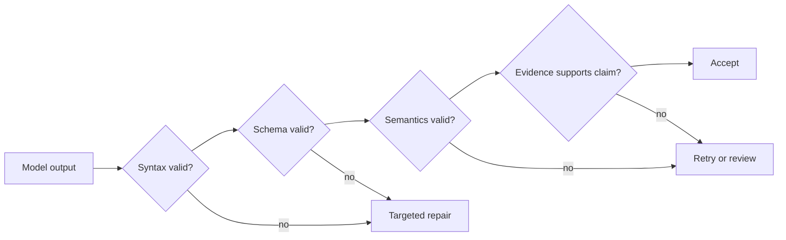

# Надёжное извлечение, пакетная обработка и независимые рецензенты

> Корректный JSON доказывает, что структура сохранилась. Но он не доказывает, что сохранились факты.

**Тип:** Справочный материал
**Языки:** Python
**Предварительные требования:** [Проверяйте утверждение, а не уверенность](../../05-output-evaluation-and-validation/), [Структурированный вывод — недоверенный контракт](../../09-structured-output-and-defensive-parsing/); этап 14, урок 39
**Время:** ~135 минут

## Цели обучения

- Определять критерии извлечения, снижающие число ложноположительных результатов и неоднозначных меток
- Целенаправленно использовать схемы, примеры, поля, допускающие пустые значения, перечисления и фрагменты доказательств
- Разделять проверку синтаксиса, схемы, семантики и происхождения данных
- Проектировать ограниченные повторные попытки и проходы независимого рецензента
- Выбирать обработку в реальном времени или пакетную обработку исходя из требований рабочего процесса

## Проблема

Конвейер извлекает обязательства из договоров в корректный JSON. Каждая запись соответствует
схеме. Но специалисты по юридической проверке отклоняют 18 процентов записей.

Модель заполняет отсутствующие даты правдоподобными значениями, помечает справочные формулировки
как обязательства и сопоставляет незнакомые категории с ближайшим значением enum. Цикл повторных
попыток отправляет тот же промпт снова, пока результат не пройдёт проверку. Поскольку проверяются
только типы, выдуманные значения просто приобретают всё более уверенное форматирование.

Команда решила задачу сериализации и ошибочно приняла это за корректность.

## Концепция

### Сначала определите правила принятия решений, затем схему

Схема определяет, какие поля существуют. Критерии определяют, что им соответствует.

Для средства извлечения обязательств задайте следующие правила:

- обязанная сторона должна быть указана явно или связана с обязательством однозначным образом
- требуемое действие должно быть предписано, а не просто упомянуто в обсуждении
- условие наступления и срок извлекаются только при наличии подтверждения
- фрагмент доказательства должен содержать утверждение
- неизвестные значения остаются `null`
- для неподдерживаемой категории используется `other` с примечанием либо запускается проверка
- исключения и отрицания влияют на результат

Без этих правил разметчики, модель и оценщик фактически выполняют разные задачи.

### Используйте примеры с несколькими демонстрациями (few-shot) для пограничных случаев

Примеры особенно полезны там, где обоснованные мнения людей могут различаться.

Добавьте:

- однозначный положительный пример
- почти подходящий пример
- обязательство с отрицанием
- отсутствующую дату, представленную как `null`
- категорию, которой нет в enum
- два обязательства в одном абзаце
- противоречащие друг другу положения

Каждый пример должен показывать не только ответ, но и его обоснование. Не переполняйте
контекст избыточными простыми случаями.

### Обеспечьте возможность представить отсутствие значения

Если значение поля может быть неизвестно, в схеме требуется явное состояние для этого случая. Требование
обязательной строки побуждает модель выдумывать данные.

```json
{
  "type": "object",
  "properties": {
    "party": {"type": ["string", "null"]},
    "action": {"type": "string"},
    "deadline": {"type": ["string", "null"]},
    "category": {
      "type": "string",
      "enum": ["payment", "delivery", "reporting", "other"]
    },
    "evidence_span": {"type": "string"},
    "needs_review": {"type": "boolean"}
  },
  "required": ["party", "action", "deadline", "category", "evidence_span", "needs_review"],
  "additionalProperties": false
}
```

Сочетание обязательного поля с допустимым пустым значением требует явного решения: указать подтверждённое
значение или известное отсутствие. Оно предотвращает незаметный пропуск поля.

### Используйте инструменты для типизированного вывода

Инструмент извлечения без побочных эффектов может передавать схему. Когда приложению нужна
типизированная запись, выбор инструмента может сделать её обязательной. Строгие возможности схемы способны
гарантировать корректность структуры там, где их поддерживают текущие API.

Не вызывайте инструмент, выполняющий реальное действие, только ради получения структурированного вывода. Извлечение и
выполнение требуют разных полномочий.

### Выполняйте проверку на четырёх уровнях



#### Синтаксис

Можно ли разобрать полезную нагрузку?

#### Схема

Корректны ли поля, типы, значения enum и ограничения?

#### Семантика

Соблюдаются ли взаимосвязи между полями? Срок не может предшествовать дате вступления в силу,
если это запрещено в предметной области. Результат `needs_review` со значением false не может сочетаться с
неподдерживаемой категорией.

#### Происхождение данных

Действительно ли фрагмент доказательства подтверждает извлечённое утверждение и взят ли он
из правильной версии источника?

Только два последних уровня обнаруживают многие уверенные галлюцинации.

### Возвращайте минимальную полезную ошибку

При исправлении возвращайте структурированную информацию об ошибке проверки:

```json
{
  "category": "semantic_validation",
  "field": "deadline",
  "message": "The extracted date does not appear in the evidence span.",
  "allowed_action": "Set deadline to null or select a supported span."
}
```

Не ограничивайтесь фразой «попробуйте ещё раз». Сохраняйте исходный источник и предыдущий результат. Ограничивайте
число повторных попыток. При повторяющейся семантической ошибке передавайте случай на следующий уровень, а не превращайте
неопределённость в дополнительные задержки и затраты.

### Разделяйте генератор и рецензента

Генератор извлекает данные. Рецензент получает источник, запись-кандидат и
рубрику проверки. Он проверяет:

- наличие необходимых доказательств
- подтверждение фрагментом каждого утверждения с непустым значением
- правильную обработку отрицаний и исключений
- соответствие категории определению
- отсутствие выдуманных значений вместо неизвестных
- наличие отметок о противоречиях и неоднозначности

Для большей независимости используйте свежий контекст. Рецензент возвращает идентификаторы замечаний,
поля, доказательства и решение. Он не переписывает запись незаметно.

Измеряйте точность и полноту рецензента по человеческой разметке. Модель-судья — это
инструмент, а не эталонная истина.

### Выбирайте пакетную обработку в соответствии с рабочим процессом

В общедоступном руководстве CCAR-F за июль 2026 года указаны 50-процентное снижение стоимости
Message Batches, окно обработки до 24 часов без гарантированного SLA по задержке
и отсутствие многошагового вызова инструментов в рамках одного пакетного запроса. Это актуальные на указанную дату
справочные факты для экзамена, а не обещание неизменности цен или ограничений
сервиса. Перед развёртыванием уточните текущие цены, ограничения, сроки хранения и совместимость возможностей
в [документации Message Batches](https://platform.claude.com/docs/en/build-with-claude/batch-processing).

Пакетная обработка подходит для:

- крупномасштабного офлайн-извлечения
- наборов данных для оценивания
- ночной классификации
- ретроспективного заполнения данных и повторной обработки
- независимой проверки после генерации

Обработка в реальном времени подходит для:

- интерактивного ответа пользователю
- задач со строгим малым пределом задержки
- адаптивного использования инструментов в рамках того же запроса
- рабочих процессов, требующих немедленного одобрения или обратной связи

Не используйте пакетную обработку, если следующий шаг зависит от внешнего действия, результат которого модель должна
увидеть в ходе запроса. Заранее вычислите входные данные или разделите рабочий процесс на задания.

### Обеспечьте возможность сверки пакетных заданий

Назначьте каждому элементу стабильный `custom_id`. Сохраняйте версию источника, версию схемы,
версию промпта и ожидаемое расположение вывода. Результаты могут возвращаться в произвольном порядке.

Обрабатывайте:

- успех
- ошибку проверки
- ошибку провайдера
- истечение срока
- повторную отправку
- частичное завершение задания
- повторную попытку после изменения источника

Никогда не сопоставляйте результаты с входными данными по позиции в массиве.

### Оценивайте значимую для вас ошибку

Для извлечения измеряйте:

- точность и полноту по полям
- точное или нормализованное совпадение, где это уместно
- долю утверждений, подтверждённых доказательствами
- долю ложноположительных результатов для полей с высоким риском
- калибровку пустых значений
- матрицу ошибок по категориям
- расхождения между рецензентами
- стоимость и задержку в расчёте на принятую запись

Средние значения могут скрыть опасный класс ложноположительных результатов. Разбивайте метрики по типу документа,
языку, длине и риску.

## Создание

## Интерактивная лабораторная работа

```figure
20-batch-review-confidence
```

Используйте симулятор уверенности и проверки, чтобы проводить записи через уровни проверки синтаксиса, схемы,
семантики и происхождения данных. Изменяйте цену ложноположительного результата и охват
рецензирования, чтобы увидеть, почему корректного JSON и уверенности модели недостаточно в качестве критериев
готовности к выпуску.

## Практическая лабораторная работа

Замените одну подтверждённую дату выдуманным значением, выполните проверку на всех четырёх уровнях
и направьте не прошедшую проверку запись на экспертное разрешение, а не на очередную слепую повторную попытку.

## Готовый артефакт

Заполненный файл [`outputs/extraction-review-report.md`](../outputs/extraction-review-report.md)
содержит пакетное задание со стабильными значениями `custom_id`, неизвестными значениями в полях, допускающих пустые значения, перемешанными результатами,
замечаниями рецензента и состоянием экспертного разрешения.

## Проверка

Запустите детерминированное средство проверки:

```bash
cd certifications/claude/lessons/20-reliable-extraction-batch-and-reviewers
python3 code/main.py
python3 -m unittest discover -s code/tests -v
```

Тест проверяет решения об исправлении, пакетной обработке и рецензировании.

## Связь с итоговым проектом

Перенесите проверенный отчёт в сценарий извлечения Architect Foundations как
доказательство для всех четырёх уровней проверки.

Создайте конвейер извлечения изменений в политиках поддержки.

### Контракт вывода

Извлекайте идентификатор политики, дату вступления в силу, затронутый регион, тип действия, пороговое значение,
фрагмент доказательства, версию источника и состояние проверки. Каждое поле с неопределённым значением должно
допускать пустое значение или иметь явное состояние `other`.

### Набор данных

Создайте не менее 40 примеров:

- 15 однозначных изменений
- 10 справочных формулировок без изменений
- 5 отрицаний или исключений
- 5 случаев с отсутствующими датами или пороговыми значениями
- 5 конфликтующих версий

### Проходы

1. генератор со строгой схемой
2. детерминированная проверка синтаксиса и схемы
3. семантическая проверка взаимосвязей
4. независимый рецензент доказательств
5. экспертное разрешение расхождений человеком

### Эксперимент

Сравните критерии без примеров (zero-shot), пограничные примеры с несколькими демонстрациями (few-shot) и генератор с
рецензентом. Укажите ложноположительные результаты, степень подтверждения доказательствами, стоимость и задержку.

### Проектирование пакетной обработки

Отправляйте записи со стабильными идентификаторами. В тесте рандомизируйте порядок результатов. Внесите частичный
сбой и докажите, что сверка сохраняет завершённые записи и повторно обрабатывает только безопасные
элементы.

## Применение

В рабочей среде храните исходные данные отдельно от нормализованного результата извлечения. Сохраняйте
версию источника и смещения фрагментов доказательств. При изменении критериев или схемы создавайте
новую версию вывода, а не перезаписывайте исторические решения.

Если человек исправляет запись, сохраняйте код причины. Используйте расхождения, чтобы улучшать
критерии и набор для оценивания до изменения промпта.

Для извлечения с высоким риском проверку можно стратифицировать: проверять каждое поле с серьёзными последствиями,
каждую запись со слабыми доказательствами или документ нового типа, а также случайную выборку обычных случаев.

## Типовые решения для экзамена

Если JSON корректен, но его содержимое неверно, добавьте семантическую проверку и проверку доказательств.
Если решения на границе категорий нестабильны, используйте явные критерии и
примеры с несколькими демонстрациями.

Предпочитайте ответы, которые:

- используют `null` или `other`, а не выдуманные значения
- требуют типизированный вывод, не запуская реального действия
- возвращают конкретные ошибки проверки с ограничением повторных попыток
- разделяют генератор и рецензента
- используют пакетную обработку для асинхронных нагрузок, не зависящих от инструментов
- сверяют результаты по стабильным идентификаторам

## Распространённые ошибки

### Считать схему эквивалентом истины

Типы не могут доказать, что значение присутствует в источнике или следует из него.

### Обязательные поля, не допускающие пустого значения

Модель выдумывает правдоподобное значение, потому что контракт не позволяет представить
его отсутствие.

### Бесконечное исправление

Один и тот же неоднозначный источник порождает повторяющиеся догадки. После ограниченного числа
попыток передайте случай на следующий уровень.

### Незаметное переписывание рецензентом

Система теряет информацию о том, какое утверждение не прошло проверку и почему. До любого
контролируемого исправления возвращайте структурированные замечания.

## Упражнения

1. Добавьте семантическое правило, связывающее пороговое значение и валюту.
2. Разработайте отрицательные примеры, которые сокращают число ложных обязательств.
3. Откалибруйте рецензента по человеческой разметке и сообщите о расхождениях.
4. Реализуйте сверку по стабильным идентификаторам для перемешанных результатов пакетной обработки.
5. Сравните стоимость принятой записи для одношагового конвейера и конвейера с рецензентом.

## Ключевые термины

| Термин | Как обычно говорят | Что это означает на самом деле |
|------|-----------------|------------------------|
| Структурированный вывод | Корректные данные | Данные, соответствующие машиночитаемой структуре |
| Семантическая проверка | Проверка схемы | Проверка того, что значения и взаимосвязи имеют смысл в предметной области |
| Проверка происхождения данных | Корректная ссылка | Доказательство того, что данные источника подтверждают конкретное извлечённое утверждение |
| Допускающий пустое значение | Необязательное поле | Явное допустимое состояние для неизвестного или отсутствующего значения |
| Пакетная обработка | Более быстрый API | Асинхронная обработка, оптимизированная для больших объёмов офлайн-данных и иных ограничений по стоимости или задержке |
| Экспертное разрешение | Повторная попытка | Квалифицированное решение, устраняющее расхождение между оценщиками или метками |

## Дополнительные материалы

- [Документация по структурированному выводу Claude](https://platform.claude.com/docs/en/build-with-claude/structured-outputs)
- [Документация Claude Message Batches](https://platform.claude.com/docs/en/build-with-claude/message-batches)
- Этап 11, урок 03: структурированный вывод с основ
- Этап 14, урок 39: агенты-рецензенты
- Этап 17, урок 15: архитектура пакетной обработки
