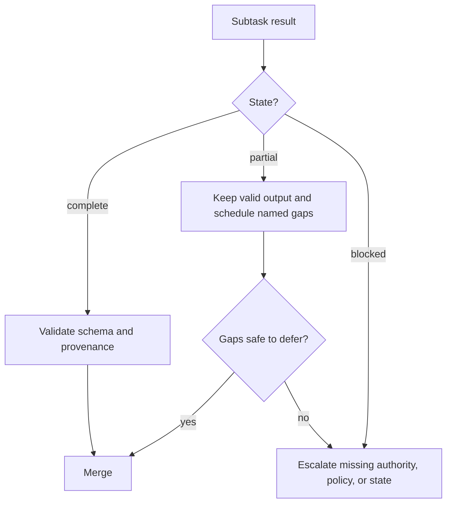

# Сделайте большой контекст наблюдаемым

> Большое контекстное окно может вместить больше свидетельств. Но оно не сообщит, какие из них были замечены, актуальны, авторитетны или безопасны для принятия решений.

**Тип:** Справочник
**Языки:** Python
**Предварительные требования:** [Сессии, субагенты и контекст Agent SDK](../../17-agent-sdk-sessions-subagents-and-context/), [Контракты инструментов, ошибки и поэтапное раскрытие](../../18-tool-contracts-errors-and-progressive-discovery/), [Надёжное извлечение, пакетная обработка и независимые рецензенты](../../20-reliable-extraction-batch-and-reviewers/)
**Время:** ~150 минут

## Цели обучения

- Размещать и извлекать критически важные факты так, чтобы снизить риск потери информации в середине контекста.
- Сокращать вывод инструментов без потери происхождения данных, ошибок, противоречий и значимых для решения подробностей.
- Передавать полные, частичные и заблокированные результаты через агентные рабочие процессы.
- Использовать манифесты, черновики, субагентов и компактизацию для разных задач в больших кодовых базах.
- Калибровать уверенность и распределять проверку людьми по уровням с учётом свидетельств и последствий.
- Сохранять идентичность источника, даты, противоречия и тип содержимого на всех этапах — от загрузки до отображения.

## Проблема

Координатор миграции получает 140 файлов, три архитектурных документа, отчёт о зависимостях, журналы тестов и результаты четырёх субагентов. Промпт помещается в заявленное контекстное окно.

И всё же итоговый план нарушает правило безопасности. Это правило встречается лишь однажды, примерно в середине длинного архитектурного документа. Результат инструмента с упоминанием проваленного интеграционного теста сократили до фразы «тесты в основном пройдены». У одного из субагентов истекло время ожидания после проверки 18 из 24 файлов, но его текстовая сводка выглядит полной. При извлечении Markdown-таблица утратила связи между столбцами, поэтому устаревшая зависимость выглядит поддерживаемой.

Номинальный лимит токенов нигде не был превышен. Система дала сбой, потому что важные факты были неудачно размещены, метаданные исчезли, частичная работа выглядела завершённой, а правило эскалации никто не определил.

Надёжность контекста — это не способность вместить больше текста. Это способность сохранять нужное состояние, явно показывать неопределённость и направлять решения по соответствующему маршруту, когда свидетельств недостаточно.

## Основная идея

### У контекста есть топология внимания

Модели не считают каждый токен одинаково полезным для любой задачи. В длинных входных данных свидетельства бывает сложнее найти, особенно когда значимый факт окружён похожим или противоречащим ему материалом. Это явление часто называют потерей информации в середине контекста (lost in the middle).

Размещайте информацию осознанно:

1. Поместите задачу, решение, жёсткие ограничения и контракт вывода перед свидетельствами.
2. Группируйте свидетельства по устойчивому идентификатору, например по файлу, утверждению, источнику или подсистеме.
3. Разместите текущий вопрос непосредственно перед тем местом, где модель должна на него ответить.
4. Повторите рядом с итоговым запросом лишь несколько критически важных ограничений.
5. Извлекайте узкие, релевантные текущему решению свидетельства вместо переноса всего архива.

Не повторяйте все правила и в начале, и в конце. Повторения расходуют контекст и могут усиливать влияние устаревших инструкций. Выделяйте только те инварианты, пропуск которых приведёт к существенному сбою.

```text
goal and hard constraints
current manifest and unresolved gaps
relevant evidence blocks with metadata
decision-specific question
required result and escalation schema
```

Если свидетельства можно надёжно отбирать, поиск обычно эффективнее одного огромного промпта. Большое контекстное окно — это запас вместимости для оставшихся сложных случаев, а не разрешение пренебречь информационной архитектурой.

### Свидетельствам нужна оболочка

Одного необработанного текста недостаточно. Оборачивайте каждую важную единицу в структурированные метаданные:

```json
{
  "evidence_id": "policy-auth-017",
  "source_uri": "repo://docs/security/authentication.md",
  "source_version": "git:3a91c7e",
  "content_type": "text/markdown",
  "effective_date": "2026-07-15",
  "observed_at": "2026-08-08T10:30:00Z",
  "authority": "approved-architecture-policy",
  "scope": ["services/auth/**"],
  "extractor": "markdown-section-v2",
  "location": {"heading": "Token rotation", "lines": [88, 112]},
  "status": "active"
}
```

Значения приведены для примера. Оболочка отвечает на вопросы, на которые не может ответить обычный текст:

- Какую версию видел агент?
- Это была утверждённая политика, черновик или сгенерированная сводка?
- К каким файлам или утверждениям она применяется?
- Можно ли проверить исходный фрагмент?
- Есть ли другой, более новый или авторитетный источник?

Сохраняйте связь исходного содержимого и метаданных при каждой передаче. Аккуратную сводку без идентификации источников сложно проверить.

### Сокращайте вывод инструментов с учётом его ценности для решения

Вывод инструментов может занимать бо́льшую часть контекста. При сокращении нужно удалять повторы, а не состояние.

Сохраняйте:

- идентификаторы вызова инструмента и трассировки;
- команду или запрос и ограниченную область применения;
- статус выхода или завершения;
- структурированные ошибки и сведения о возможности повторной попытки;
- затронутые файлы, записи или утверждения;
- проваленные проверки и минимальный подтверждающий фрагмент;
- количества, итоговые значения и число пропущенных элементов;
- версии источников и временные метки;
- противоречия и нерешённые пробелы;
- указатель на полный внешний артефакт.

Удаляйте или выносите за пределы контекста:

- повторяющиеся строки о ходе выполнения;
- дублирующиеся кадры стека;
- успешные строки, не содержащие отдельных свидетельств;
- декоративное форматирование;
- большие объёмы данных, уже сохранённые по устойчивой ссылке.

По возможности используйте детерминированный адаптер:

```json
{
  "status": "partial",
  "summary": "18 of 24 files reviewed; 2 findings; 6 files not processed",
  "findings": ["finding-014", "finding-015"],
  "errors": [
    {
      "category": "dependency_timeout",
      "retryable": true,
      "scope": ["services/payments/**"],
      "trace_id": "trace-8801"
    }
  ],
  "full_artifact": "artifact://review/run-224"
}
```

Фраза «в основном пройдено» стирает самое важное различие: какая именно часть не была пройдена.

### Полное, частичное и заблокированное выполнение — полноценные состояния

В каждом контракте задачи должны быть определены три исхода:

- **Полное:** каждая обязательная часть соответствует контракту вывода.
- **Частичное:** есть корректно выполненная работа, но отсутствует явно указанная часть области или свидетельств.
- **Заблокированное:** для безопасного продолжения нужны новые полномочия, политика, данные или внешнее состояние.

Частичное выполнение — не сбой, но и не полное выполнение. Координатор может сохранить корректные выводы, повторно обработать только подходящие пробелы и не дать этапу синтеза истолковать отсутствие работы как отсутствие проблем.



Для ошибок необходимо указывать категорию, возможность повторной попытки, безопасное сообщение, затронутую область, ссылку на частичный результат и предлагаемое следующее действие. При истечении времени ожидания повторная попытка может быть оправданна. Отказ в авторизации повтором не исправить. При неоднозначной политике нужен ответственный владелец, а не дополнительные токены.

### Эскалируйте причину, а не тревогу

При эскалации следует называть недостающее решение:

| Условие | Безопасная реакция |
|---|---|
| Недостающие свидетельства | Указать необходимый источник и затронутый вывод |
| Противоречащие друг другу авторитетные источники | Сохранить оба, применить документированное правило приоритета или направить владельцу |
| Пробел в политике | Остановить регулируемое действие и запросить правило у владельца политики |
| Недостаточные разрешения | Запросить доступ в ограниченной области или выбрать утверждённый альтернативный путь |
| Повторяющийся семантический сбой | Прекратить ограниченные повторные попытки и запросить разрешение разногласий |
| Неизвестный внешний побочный эффект | Сверить состояние перед повторной попыткой |

Не эскалируйте ситуацию сообщением «модель не уверена». Предоставьте идентификаторы источников, выполненные проверки, точное описание неоднозначности, последствия, срок и доступные безопасные варианты.

### Для больших кодовых баз нужны четыре разных инструмента памяти

Эти механизмы связаны между собой, но не взаимозаменяемы.

#### Манифест

Манифест — это долговечная карта: идентификаторы файлов, владельцы, назначение, зависимости, состояние проверки, хеши, обнаруженные проблемы и нерешённые задачи. Он помогает контролировать охват и восстанавливаться после сбоев. Манифест остаётся авторитетным источником за пределами беседы.

#### Черновик

Черновик (scratchpad) предназначен для временных рассуждений в рамках текущей ограниченной задачи: поисковых гипотез, файлов-кандидатов и следующих проверок. Его можно удалить. Никогда не храните в нём единственную копию решения, одобрения или выполненного действия.

#### Субагент

Субагент получает изолированный контекст для решения ограниченного вопроса. Он возвращает структурированный результат со ссылками на файлы и свидетельства. Изоляция снижает конкуренцию за контекст, но координатор всё равно должен обеспечивать соблюдение правил охвата и объединения.

#### Компактизация

Компактизация (compaction) сжимает растущую сессию до текущей цели, ограничений, проверенной работы, открытых пробелов, ссылок на свидетельства и следующего действия. Она управляет размером контекста, но не гарантирует истинность или долговечность состояния.

Используйте их вместе:

```text
manifest says what exists and what is done
scratchpad helps decide the next bounded search
subagent isolates one reasoning responsibility
compaction rebuilds a smaller current working set
```

При работе с большим репозиторием начните со структуры и карт зависимостей, а затем извлекайте минимальный связный срез. Поручайте субагентам с ограниченной областью проверять конкретные подсистемы. Возвращайте нормализованные результаты в манифест. Выполняйте итоговую межфайловую проверку по манифесту и принятым свидетельствам, а не по необработанным стенограммам.

### Уверенность следует калибровать по свидетельствам

Сгенерированный моделью процент не становится калиброванным только потому, что указан с двумя знаками после запятой. Выражайте уверенность через наблюдаемые свидетельства:

- класс подтверждения: прямое, вычисленное, косвенное, противоречивое или отсутствующее;
- авторитетность и актуальность источника;
- охват: отношение числа проверенных элементов к числу обязательных;
- согласие оценщиков и известные разногласия;
- новизна относительно протестированных случаев;
- последствия ошибки.

В записи о решении можно указать:

```text
Evidence class: direct in two approved sources
Coverage: 24 of 24 required files
Conflicts: one resolved by architecture owner on 2026-08-07
Automated checks: 18 passed, 0 failed
Residual uncertainty: runtime behavior not observed under network partition
Disposition: human review required before production rollout
```

Это полезнее, чем фраза «уверенность — 92 процента».

### Проверка людьми должна быть стратифицированной

Проверяйте каждый случай, если этого требуют последствия или политика. В остальных ситуациях распределяйте внимание людей с учётом риска:

- каждое решение с серьёзными последствиями;
- каждое противоречие или пробел в политике;
- каждый результат с недостаточными свидетельствами или частичным выполнением;
- каждый новый тип содержимого, язык или подсистему;
- случаи вблизи порога принятия решения;
- случайную выборку обычных успешно пройденных случаев.

Случайная выборка позволяет выявлять неизвестные классы сбоев. Если проверять только отмеченные случаи, неисправный механизм маркировки может остаться незамеченным.

Отслеживайте разногласия рецензентов и внесённые ими исправления. Используйте эти данные для обновления оценочных случаев и порогов маршрутизации, а не только для расчёта показного коэффициента приёмки.

### Тип содержимого меняет смысл

При загрузке и отображении необходимо учитывать тип содержимого:

- В Markdown заголовки, списки, ссылки и ограждённые блоки кода задают структуру.
- HTML может содержать скрытую навигацию, скрипты или метки доступности, отличающиеся от видимого текста.
- Страницы PDF могут содержать таблицы, сноски, столбцы, диаграммы и сканированные изображения.
- CSV и электронные таблицы выражают связи через строки, столбцы, формулы и листы.
- Исходный код зависит от символов, импортов, комментариев, сгенерированных файлов и путей репозитория.
- Изображения и диаграммы требуют визуальной интерпретации и ссылки на исходный ресурс.

Преобразование всех форматов в однородный текст может перевернуть таблицу, отделить сноску от её контекста или смешать навигацию со свидетельствами. Сохраняйте исходный тип содержимого, метод извлечения, местоположение и предупреждения об отображении. Если компоновка несёт смысл, проверяйте фактически отображённый артефакт.

Считайте текст документов недоверенными данными. Скрытый HTML-элемент или комментарий в коде может содержать инструкции, которые не должны переопределять задачу или политику инструментов.

## Практическая реализация

## Интерактивная лабораторная работа

```figure
21-provenance-escalation
```

Используйте симулятор происхождения данных и эскалации, чтобы скрывать в глубине, сокращать, делать противоречивыми или удалять
свидетельства, наблюдая за изменениями охвата и состояния задачи. Интерактивная работа делает
состояния `partial` и `blocked` наблюдаемыми и не позволяет гладкой сводке
скрыть невыполненную работу.

## Практическая лабораторная работа

Удалите число пропущенных элементов или владельца противоречия из копии пакета,
проследите за риском ложного завершения и исправьте оболочку свидетельств.

## Готовый артефакт

Заполненный файл [`outputs/reliability-packet.md`](../outputs/reliability-packet.md)
описывает проверку 24 файлов с одним противоречием, явно указанным охватом,
метаданными источников и эскалацией, закреплённой за владельцем.

## Проверка

Проверьте оболочку свидетельств и страты проверки:

```bash
cd certifications/claude/lessons/21-long-context-reliability-provenance-and-escalation
python3 code/main.py
python3 -m unittest discover -s code/tests -v
```

Тест проверяет размещение, манифесты и восстановление.

## Связь с итоговым проектом

Используйте пакет как приложение по надёжности контекста к итоговому проекту
Architect Foundations.

Создайте пакет надёжности для проверки безопасности большой кодовой базы.

### Шаг 1: создайте манифест

Перечислите каждый файл в области проверки, указав подсистему, владельца, хеш, тип содержимого, состояние проверки, назначенного субагента, идентификаторы обнаруженных проблем и нерешённые пробелы. Добавьте детерминированные проверки охвата.

### Шаг 2: определите бюджет контекста

Зарезервируйте место для цели, жёстких ограничений, текущего среза манифеста, релевантных свидетельств, структурированных ошибок и контракта вывода. Храните полные журналы вне контекста, используя устойчивые ссылки.

### Шаг 3: нормализуйте результаты инструментов

Напишите адаптеры для поиска, тестов и проверки файлов. Внесите истечение времени ожидания, усечённый журнал, отказ в разрешении и частичный результат поиска. Убедитесь, что в каждом случае сохраняются затронутая область и корректное поведение при повторной попытке.

### Шаг 4: добавьте правила эскалации

Создайте фикстуры для противоречащих друг другу политик, неохваченного файла, отсутствующей авторизации и неизвестного побочного эффекта. Для каждого случая должны быть указаны владелец и безопасное следующее действие.

### Шаг 5: откалибруйте проверку

Проверяйте каждую серьёзную проблему и каждый частичный результат, а также случайную выборку успешных результатов. Сопоставьте заявленный класс свидетельств с решением рецензента. Скорректируйте маршрутизацию с учётом измеренного риска ложноуспешного результата.

### Шаг 6: протестируйте отображение

Используйте одну политику в Markdown, один PDF с большим числом таблиц, один CSV и один файл исходного кода. Убедитесь, что цитаты ведут к правильному разделу, странице, диапазону ячеек или строкам и что факты, зависящие от компоновки, сохраняются.

## Применение

### Схемы принятия решений на экзамене

В сценариях, связанных с надёжностью длинного контекста:

1. Размещайте текущую цель и критически важные ограничения на чётко обозначенных границах.
2. Отбирайте релевантные свидетельства и переносите их в структурированной оболочке происхождения данных.
3. Сокращайте многословие, сохраняя сведения о сбоях, количествах, противоречиях и ссылках.
4. Явно передавайте состояния полного, частичного и заблокированного выполнения.
5. Эскалируйте пробелы в политике, полномочиях и разрешении неоднозначностей указанному владельцу.
6. Калибруйте уверенность по свидетельствам и охвату.
7. Распределяйте проверку людьми по уровням с учётом последствий, неопределённости, новизны и случайной выборки.

### Распространённые ошибки

- **Поместилось в контекст — значит, замечено:** вместимость ошибочно принимают за надёжное внимание.
- **Сводка вместо свидетельства:** исчезают идентичность источника, дата и подтверждающий фрагмент.
- **Сократить все ошибки:** единственная проваленная проверка удаляется вместе с повторяющимися журналами.
- **Частичное выполнение означает отсутствие проблем:** непроверенная область превращается в отрицательное свидетельство.
- **Повторять попытку при любом сбое:** пробелы в авторизации и политике расходуют бюджет, не изменяя состояние.
- **Черновик как база данных:** долговечные решения исчезают при изменении контекста.
- **Компактизация как проверка:** сокращённая сводка может сохранить устаревшие допущения.
- **Уверенность как процент:** точность формулировки ошибочно принимают за калибровку.
- **Загрузка всех форматов как обычного текста:** теряются таблицы, сноски, структура кода и смысл отображения.

### Упражнения

1. Измените порядок материалов в 50-страничном пакете контекста так, чтобы задача и критически важная политика оставались заметными без дублирования каждого правила.
2. Преобразуйте журнал тестов из 5 000 строк в структурированный частичный результат с указателем на полный артефакт.
3. Спроектируйте манифест и три контракта субагентов для репозитория из 300 файлов.
4. Напишите пакеты эскалации для случаев отсутствия свидетельств, конфликта политик и неизвестного побочного эффекта.
5. Составьте план стратифицированной проверки для 10 000 записей извлечения.
6. Сравните извлечение данных из Markdown-таблицы и её отображённого представления. Зафиксируйте потерянные связи.

## Ключевые термины

- **Потеря информации в середине контекста (lost in the middle):** снижение надёжности использования релевантной информации, скрытой внутри длинного контекста.
- **Оболочка происхождения данных (provenance envelope):** метаданные, сохраняющие идентичность и версию источника, даты, авторитетность, местоположение и метод извлечения.
- **Частичный результат:** корректно выполненная работа с явным указанием отсутствующей области или ошибок.
- **Манифест:** долговечный структурированный реестр области, состояния, владельцев, свидетельств и пробелов.
- **Черновик (scratchpad):** временные рабочие заметки, не являющиеся авторитетным состоянием.
- **Компактизация (compaction):** сжатие контекста беседы до меньшего рабочего набора.
- **Калибровка уверенности:** согласование выраженной уверенности или маршрутизации с измеренными свидетельствами и поведением при ошибках.
- **Стратифицированная проверка:** распределение проверки людьми по категориям риска с добавлением репрезентативной выборки.
- **Отображение с учётом типа содержимого:** сохранение структурной и визуальной семантики исходного формата.

## Дополнительные материалы

- [Руководство по экзамену Claude Certified Architect Foundations](https://everpath-course-content.s3-accelerate.amazonaws.com/instructor%2F6nizmqk8tpzpfjvt6qmmav7rh%2Fpublic%2F1783542750%2FClaude+Certified+Architect+%E2%80%93+Foundations+Exam+Guide.pdf)
- [Anthropic: рекомендации по промптам с длинным контекстом](https://platform.claude.com/docs/en/build-with-claude/prompt-engineering/long-context-tips)
- [Anthropic: контекстные окна](https://platform.claude.com/docs/en/build-with-claude/context-windows)
- [Anthropic: цитирование](https://platform.claude.com/docs/en/build-with-claude/citations)
- [Anthropic: управление контекстом Agent SDK](https://platform.claude.com/docs/en/agent-sdk/context-management)
- [AI Engineering from Scratch: проектирование контекста](../../../../../phases/11-llm-engineering/05-context-engineering/)
- [AI Engineering from Scratch: память и состояние репозитория](../../../../../phases/14-agent-engineering/34-repo-memory-and-state/)
- [AI Engineering from Scratch: передача работы между сессиями](../../../../../phases/14-agent-engineering/40-multi-session-handoff/)

Ограничения контекста, поведение компактизации, цитирование, возможности SDK, поддержка моделей и средства обработки содержимого могут изменяться. Эти источники были проверены 2026-08-08. Перед развёртыванием сверьтесь с актуальной официальной документацией и протестируйте точное поведение платформы.
