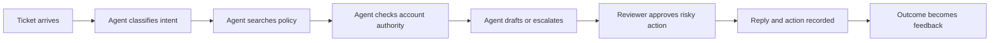

# Выявление бизнес-задач, требования и SLA

> Первое архитектурное решение — определить, за решение какой задачи вы действительно отвечаете.

**Тип:** Справочный материал
**Языки:** Python
**Предварительные требования:** Фаза 11, урок 13; фаза 14, урок 12; фаза 17, урок 08
**Время:** ~120 минут

## Цели обучения

- Преобразовывать общий запрос на ИИ в измеримую постановку задачи
- Разделять функциональные требования и требования к качеству, инфраструктуре, безопасности и жизненному циклу
- Определять метрики успеха, целевые показатели уровня обслуживания и границы эскалации
- Выявлять предположения, которые необходимо подтвердить до начала проектирования архитектуры
- Составлять документ по итогам исследования, который смогут утвердить технические и бизнес-заинтересованные стороны

## Задача

Руководитель службы поддержки просит создать агента, который автоматически решает каждое обращение.
Запрос кажется конкретным. Но это не так.

Неизвестно, какие категории обращений входят в охват, что означает «решить обращение», в какие
системы агент может вносить изменения, какими финансовыми полномочиями он обладает, какую задержку
готовы терпеть пользователи и какие действия требуют участия человека. Также неизвестно, заключается ли
реальная проблема во времени ответа, непоследовательном применении правил, очереди необработанных обращений,
затратах или удовлетворённости клиентов.

Если начать с выбора модели и перечня инструментов, вы будете оптимизировать предположение. Даже
технически впечатляющая система может оказаться неудачной, потому что улучшила не тот
показатель, автоматизировала запрещённый этап или перенесла работу с операторов на проверяющих,
не сократив общие трудозатраты.

Профессиональное проектирование архитектуры начинается с исследования задачи. На экзамене проверяется, умеете ли вы
преобразовать намерения бизнеса в решение и обосновать компромиссы. На практике
этот навык предотвращает многомесячные переделки.

## Концепция

### Начинайте с решения, а не с функции

Переформулируйте запрос как решение, у которого есть ответственный, доказательства и последствия.

Слабая постановка задачи:

```text
Build a Claude support agent.
```

Постановка в форме решения:

```text
Reduce median time to a policy-correct first response for billing questions
from 11 minutes to under 3 minutes, while keeping unsupported-refund actions at
zero and preserving human approval for refunds above the team threshold.
```

Вторая формулировка показывает, что следует измерять. Она также показывает, что не следует
автоматизировать.

На первой встрече по исследованию задачи задайте пять вопросов:

1. Какой наблюдаемый результат должен измениться?
2. Кто отвечает за этот результат?
3. Какое действие последует за выводом системы?
4. Какова цена неверного, запоздалого или отсутствующего ответа?
5. Какие ограничения не могут быть предметом компромисса?

### Классифицируйте требования до их приоритизации

Архитекторы теряют информацию, когда каждый запрос превращается в общий пункт в разделе
«требования». Используйте явные категории.

| Категория | Вопрос | Пример для службы поддержки |
|-------|----------|-----------------|
| Функциональные требования | Что должна делать система? | Прочитать обращение, найти правило, подготовить ответ |
| Качество | Насколько хорошо она должна это делать? | Ссылаться на действующую версию правил в 98 процентах оцениваемых черновиков |
| Производительность | Насколько быстро и в каком масштабе? | Задержка подготовки черновика P95 ниже 8 секунд при 40 запросах в секунду |
| Защита данных | Кто что может видеть или изменять? | Контекст учётной записи доступен только назначенным операторам |
| Безопасность | Какие результаты необходимо предотвращать или согласовывать? | Никогда не оформлять возврат средств без подтверждённого решения о наличии полномочий |
| Эксплуатационная готовность | Как обнаруживать сбои и восстанавливаться после них? | Оповещать об актуальности данных поиска и доле ошибок инструментов |
| Жизненный цикл | Кто обновляет, утверждает и выводит систему из эксплуатации? | Команда, отвечающая за правила, обеспечивает актуальность источников; платформенная команда отвечает за среду выполнения |

Такая классификация выявляет противоречия. Требование «отвечать мгновенно» конфликтует с требованием
«проводить проверку на соответствие по трём источникам». Требование «автоматизировать все возвраты» конфликтует
с требованием об утверждении человеком. Исследование выявляет эти противоречия до того,
как код превратит их в инциденты.

### Составьте схему текущего рабочего процесса

Не проектируйте систему на основе идеализированного процесса со слайда. Наблюдайте за реальной
работой.



Для каждого этапа зафиксируйте:

- входные и выходные данные
- систему учёта
- ответственную роль
- правило принятия решения
- распространённое исключение
- задержки и повторную работу
- категорию данных
- сохраняемые доказательства

Наиболее ценным изменением может оказаться поиск на этапе работы с правилами, узкий
классификатор при приёме обращения или более удобный интерфейс согласования. Автономный агент —
лишь один из возможных подходов.

### Отделяйте ценность от возможностей

Claude может быть способен подготовить ответ. Ценность для бизнеса зависит от того,
сокращает ли черновик полное время обработки с учётом проверки, повышает ли единообразие
или позволяет ли обеспечить новый уровень обслуживания.

Используйте простую гипотезу ценности:

```text
For [user or team], changing [workflow step] with [bounded capability] will
improve [business measure] from [baseline] to [target], without violating
[guardrail]. We will know after [evaluation window].
```

Каждое поле должно быть заполнено на основе доказательств либо помечено как предположение. Не
скрывайте неопределённость за убедительной архитектурной схемой.

### Превращайте риск в границу проверки

Проверка человеком — не универсальное решение для обеспечения безопасности. Для неё необходимо определить условие запуска, проверяющего,
пакет доказательств, допустимое время и резервный вариант.

Для каждого действия оцените:

- последствия ошибки
- обратимость
- уверенность, которую можно получить из доказательств
- нормативные требования или требования правил
- потенциал злоупотребления
- стоимость проверки

Черновики с незначительными последствиями и обратимыми результатами можно обрабатывать автоматически. Действия с серьёзными последствиями или
необратимые действия требуют детерминированных проверок и явно заданных полномочий. Для среднего
риска часто необходимы выборочная проверка, проверка по пороговым значениям или аудит после выполнения действия.

### Правильно определяйте SLI, SLO и SLA

Индикатор уровня обслуживания (SLI) — это измеряемый сигнал. Целевой показатель уровня обслуживания (SLO) —
внутренняя цель. Соглашение об уровне обслуживания (SLA) — обязательство, имеющее деловые или
договорные последствия.

| Уровень | Пример |
|-------|---------|
| SLI | Процент черновиков с действительной ссылкой на актуальные правила |
| SLO | Не менее 98 процентов в скользящем семидневном окне |
| SLA | Первый ответ клиенту в пределах предусмотренного договором интервала поддержки |

Не обещайте SLA по точности модели, не определив совокупность, метку,
метод измерения и действия при невыполнении целевого показателя. Утверждение «точность модели составляет 95
процентов» не имеет смысла с точки зрения эксплуатации.

Для системы ИИ предусмотрите несколько категорий индикаторов:

- качество задачи: фактическая точность, полнота, соблюдение правил
- производительность системы: задержка, доступность, пропускная способность
- экономика: стоимость успешно выполненной задачи, доля попаданий в кеш, трудозатраты на проверку
- безопасность: заблокированные небезопасные действия, ложные блокировки, точность эскалации
- эксплуатация: актуальность данных поиска, сбои инструментов, время отката

### Явно указывайте, что не входит в цели

Явно сформулированные нецели защищают систему от незаметного расширения охвата.

Примеры:

- Первая версия подготавливает ответы, но не отправляет их.
- Она обрабатывает часто задаваемые вопросы по оплате, но не закрывает учётные записи.
- Она рекомендует сумму возврата, но не может оформить возврат.
- Во время пилотного запуска она поддерживает только обращения на английском языке.

Если заинтересованная сторона не согласна, исследование выявило решение, для которого необходимо назначить ответственного.
Это и есть прогресс.

## Реализация

## Интерактивная лабораторная работа

```figure
22-sla-value-tradeoff
```

В инструменте анализа ценности и SLA изменяйте исходный уровень, целевой показатель, трудозатраты на проверку,
качество, задержку и жёсткие ограничения полномочий. Он показывает, когда система с достаточными
возможностями всё же создаёт отрицательную ценность для рабочего процесса или нарушает обязательное ограничение.

## Практическая лабораторная работа

Превратите одно исходное значение в неподтверждённое утверждение, правильно классифицируйте его и добавьте
ответственного, источник доказательств и дату принятия решения до выбора архитектуры.

## Готовый артефакт

Заполненный документ [`outputs/discovery-brief.md`](../outputs/discovery-brief.md) описывает
утверждённый пилотный проект поддержки в форме решения с измеримыми SLI, SLO, предположениями,
нецелями и ответственными.

## Проверка

Убедитесь, что факты, оценки, предпочтения и ограничения не смешаны
друг с другом:

```bash
cd certifications/claude/lessons/22-business-discovery-requirements-and-slas
python3 code/main.py
python3 -m unittest discover -s code/tests -v
```

Тест проверяет решения по исследованию задачи и уровню обслуживания.

## Связь с итоговым проектом

Используйте этот документ как первый артефакт итогового проекта Architect Professional.

До создания архитектурной схемы подготовьте одностраничный документ по итогам исследования.

```markdown
# Discovery Brief

## Outcome
- Owner:
- Current baseline:
- Target:
- Evaluation window:

## Users and Workflow
- Primary user:
- Current workflow step:
- Downstream action:
- Exceptions:

## Requirements
- Functional:
- Quality:
- Performance:
- Security:
- Safety:
- Operability:
- Lifecycle:

## Data and Authority
- Data classes:
- Systems of record:
- Read permissions:
- Write permissions:
- Human approval triggers:

## Measures
- SLIs:
- SLOs:
- Business measures:
- Guardrail measures:

## Assumptions to Test
- Assumption:
- Evidence needed:
- Owner:
- Decision date:

## Non-Goals
- Not in the first release:
```

Теперь проведите аудит предположений. Пометьте каждое утверждение как факт, оценку, предпочтение
или ограничение. Для фактов нужны источники. Для оценок нужен диапазон уверенности. Для предпочтений
нужен ответственный. Для ограничений нужен полномочный источник.

### Расставляйте приоритеты по цене ошибки

Используйте эту таблицу решений для каждого потенциального сценария использования:

| Характеристика | Низкий уровень | Средний уровень | Высокий уровень |
|-----------|-----|--------|------|
| Последствия неверного вывода | Небольшая правка | Недовольство клиента | Финансовый, юридический ущерб или ущерб безопасности |
| Обратимость | Отмена одним нажатием | Исправление вручную | Необратимо или трудно исправить |
| Чувствительность данных | Общедоступные | Внутренние | Регулируемые или секретные |
| Полномочия на действия | Только черновик | Ограниченная запись | Разрушительная операция или финансовая запись |
| Качество доказательств | Прямой источник | Частичный источник | Неоднозначные или отсутствуют |

Высокая оценка не означает автоматического запрета на использование ИИ. Она смещает архитектуру в сторону
более узкого охвата, детерминированных барьеров, более надёжных доказательств, утверждения человеком и
более осторожного развёртывания.

## Применение

Примените документ к трём вариантам архитектуры:

1. Генерация черновика с поддержкой поиска и утверждением человеком.
2. Детерминированный рабочий процесс, который вызывает Claude только для классификации и
   подготовки черновика.
3. Адаптивный агент с инструментами для работы с обращениями, правилами, учётными записями и возвратами.

Оцените каждый вариант по требованиям. Вариант с наибольшими возможностями не обязательно
лучший. Если рабочий процесс стабилен и известен, детерминированная оркестрация часто
снижает задержку, стоимость и поверхность отказов. Используйте агента, когда путь зависит от
доказательств, обнаруженных во время выполнения, а дополнительная гибкость оправдывает
сложность контроля.

Зафиксируйте выбор в записи архитектурного решения (ADR):

```markdown
# ADR: Support Resolution Pattern

## Status
Proposed

## Context
Decision, constraints, evidence, and unresolved assumptions.

## Options
1. Retrieval-assisted draft workflow
2. Deterministic multi-step workflow
3. Adaptive tool-using agent

## Decision
Chosen option and the requirement it best satisfies.

## Rejected Alternatives
Why each alternative loses under current constraints.

## Consequences
New operational work, residual risk, and reversal plan.

## Verification
Offline evaluation, pilot guardrails, SLOs, and review date.
```

## Типовые решения для экзамена

Когда сценарий начинается с общего бизнес-запроса, наиболее правильный первый шаг
обычно уменьшает неоднозначность до выбора технологии.

Предпочитайте ответ, который:

- определяет бизнес-результат и текущий исходный уровень
- выявляет пользователей, системы учёта и последующее действие
- отделяет жёсткие ограничения от предпочтений
- определяет показатели качества и эксплуатации
- назначает ответственных за проверку и жизненный цикл
- проверяет самое рискованное предположение с помощью ограниченного пилотного проекта

С осторожностью относитесь к ответам, в которых сразу выбирается крупнейшая модель, добавляется
агент или обещается автоматизация без уточнения полномочий и цены ошибки.

## Распространённые ошибки

### Превращение каждого запроса в агента

Агентная гибкость имеет свою цену: больше вызовов инструментов, шире поверхность атаки, сложнее
тестирование и менее предсказуемая задержка. Выбирайте её, только когда адаптивное планирование является
требованием.

### Представление проверки человеком как бесплатной

Очередь на проверку может стать новым узким местом. Измеряйте время проверки, согласованность
и качество эскалации.

### Использование точности без знаменателя

Укажите набор данных, совокупность, метку, оценщика и временное окно. Иначе
число не поможет принять эксплуатационное решение.

### Игнорирование ответственности после запуска

Для каждого промпта, источника, инструмента, механизма контроля, показателя и пути эскалации нужен ответственный.
Механизм контроля без ответственного незаметно деградирует.

## Упражнения

1. Переформулируйте запрос «создать ИИ-аналитика» как постановку задачи в форме решения с
   исходным уровнем, целевым показателем, защитным ограничением и ответственным.
2. Составьте схему реального рабочего процесса и найдите один этап, на котором детерминированное правило
   лучше вызова модели.
3. Определите пять SLI для рабочего процесса обеспечения соответствия требованиям с поддержкой поиска. Включите
   как минимум по одному показателю качества, безопасности, экономики и эксплуатационной готовности.
4. Составьте ADR, отклоняющую агентную архитектуру, хотя модель
   способна выполнить эту работу.
5. Спроектируйте пилотный проект, который проверяет предположение с наибольшим риском, не предоставляя
   системе доступа на запись в рабочей среде.

## Ключевые термины

| Термин | Как его обычно понимают | Что он означает на самом деле |
|------|-----------------|------------------------|
| Требование | Запрошенная функция | Проверяемое условие, которому должно соответствовать решение |
| Ограничение | Что-то неудобное | Граница, которой архитектура не может поступиться |
| SLI | Целевой показатель SLA | Измеряемый сигнал, по которому оценивают поведение сервиса |
| SLO | Обещание поставщика | Внутренняя цель для индикатора |
| SLA | Любая цель производительности | Обязательство по обслуживанию с определёнными последствиями |
| Нецель | Работа, которую без огласки отложили | Явная граница, предотвращающая разрастание охвата |
| ADR | Схема | Долговечная запись контекста, вариантов, решения и последствий |

## Дополнительные материалы

- [Руководство к экзамену Claude Certified Architect Professional](https://everpath-course-content.s3-accelerate.amazonaws.com/instructor%2F6nizmqk8tpzpfjvt6qmmav7rh%2Fpublic%2F1783542810%2FClaude+Certified+Architect+%E2%80%93+Professional+Exam+Guide.pdf) — описание общедоступных целей по жизненному циклу и архитектуре
- [Рекомендации Anthropic по созданию эффективных агентов](https://www.anthropic.com/research/building-effective-agents) — о компромиссах при выборе рабочих процессов и агентов
- [Документация Claude Platform](https://platform.claude.com/docs/en/home) — актуальные сведения о поведении продукта и API
- Фаза 11, урок 13 — о границах рабочего приложения
- Фаза 17, урок 08 — о показателях задержки, пропускной способности и полезной пропускной способности
