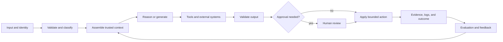

# Сквозная архитектура и компромиссы между показателями ценности

> Архитектура — это искусство расходовать сложность лишь там, где она влияет на результат.

**Тип:** Справочный материал
**Языки:** Python
**Предварительные требования:** [Исследование потребностей бизнеса, требования и SLA](../../22-business-discovery-requirements-and-slas/); этап 14, уроки 01, 12 и 28
**Время:** ~135 минут

## Цели обучения

- Спроектировать полную систему на базе Claude: от входных данных до обратной связи и эксплуатации
- Выбирать между расширенными вызовами модели, рабочими процессами, агентами и мультиагентными системами
- Декомпозировать сложную работу с учётом границ доказательств, полномочий и проверки
- Обосновывать компромиссы между стоимостью, задержкой, качеством, безопасностью и сопровождаемостью
- Определять ситуации, в которых дополнительные возможности модели не могут исправить структурный недостаток проекта

## Проблема

Команда запускает ассистента для проверки договоров. В одном промпте содержатся договор,
библиотека политик, схема извлечения, правила переговоров и запрос на итоговую
редакцию с отмеченными изменениями. Демонстрационная версия работает, промышленная — нет.

Крупные договоры превышают практически доступный бюджет контекста. Версии политик противоречат друг другу.
Модель возвращает корректный JSON с юридическим выводом, не подкреплённым источниками. Рецензенты
не видят, какой источник обосновывает каждое изменение. Повторные попытки повышают стоимость, но
не устраняют сбой. Более крупная модель улучшает текст, однако вопросы происхождения данных,
полномочий и ответственности за жизненный цикл остаются нерешёнными.

Система даёт сбой не потому, что в промпте не хватает ещё одного предложения. Причина в том,
что несколько разных обязанностей сведены к одному
вероятностному шагу.

## Концепция

### Изобразите весь цикл

Сквозная архитектура включает не только вызов модели.



Для каждого перехода задайте следующие вопросы:

- Какие данные пересекают границу?
- Какие идентификационные данные и разрешения применяются?
- Какая схема или контракт обеспечивается принудительно?
- Что происходит при тайм-ауте, неоднозначности или частичном сбое?
- Какие доказательства сохраняются?
- Кто отвечает за следующее решение?

Диаграмма архитектуры без путей обработки сбоев — всего лишь маркетинговая картинка.

### Выбирайте самый простой подход, соответствующий задаче

Есть четыре полезных исходных подхода.

#### Расширенный вызов модели

Один запрос использует выбранный контекст, поиск или инструмент и возвращает ограниченный
результат. Применяйте расширенный вызов модели (augmented model call) для классификации, извлечения, подготовки черновика или оценки, когда
шаги известны и все необходимые доказательства помещаются в один цикл взаимодействия.

Преимущества:

- минимальные накладные расходы на оркестрацию
- проще всего оценивать
- предсказуемые задержка и стоимость

Ограничения:

- плохо подходит для работы с ветвлением
- ограниченные возможности восстановления после нескольких внешних действий

#### Детерминированный рабочий процесс

Код управляет последовательностью и вызывает Claude на выбранных шагах. Применяйте этот подход, когда
бизнес-процесс стабилен, важна возможность аудита или для каждого перехода необходим
чёткий контракт.

Преимущества:

- явно заданные состояния и повторные попытки
- узкие разрешения для каждого шага
- воспроизводимые тесты

Ограничения:

- хрупкость, если путь нельзя определить заранее
- новые классы исключений требуют изменения рабочего процесса

#### Адаптивный агент

Claude выбирает следующее действие на основе наблюдений, пока не будет выполнено условие
остановки. Применяйте этот подход, когда путь определяется в ходе поиска доказательств, а перечислять все
ветви непрактично.

Преимущества:

- гибкое планирование
- подходит для исследований и исправлений с открытым сценарием

Ограничения:

- непостоянные задержка и стоимость
- более широкая область разрешений и оценивания
- риски зацикливания, отклонения от цели и ошибок инструментов

#### Мультиагентная система

Координатор делегирует изолированные задачи специалистам или независимым
рецензентам. Применяйте этот подход, когда работу можно разделить, изоляция контекста повышает
качество или для проверки необходима независимость.

Преимущества:

- параллельное выполнение
- меньший контекст для каждой роли
- независимая проверка

Ограничения:

- потери при передаче работы и её дублирование
- больше вызовов и более сложный анализ трассировки
- затраты на координацию могут превысить полученную экономию

Не выбирайте мультиагентный подход только потому, что его диаграмма выглядит солидно. Выбирайте его, когда
конкретная потребность в контексте, независимости, параллелизме или специализации оправдывает
затраты на координацию.

### Выполняйте декомпозицию вокруг контрактов

При неудачной декомпозиции следуют разделам документа или границам ответственности команд, не задаваясь вопросом,
как проверять правильность. Удачная декомпозиция создаёт контракт в каждой точке
передачи работы.

Для системы проверки договоров:

1. Приём проверяет тип файла, идентификационные данные и метаданные юрисдикции.
2. Сегментация условий договора возвращает стабильные идентификаторы и диапазоны в исходном тексте.
3. Поиск по политикам возвращает версионированные доказательства с данными об их происхождении.
4. Анализ условий возвращает результаты проверки в соответствии со схемой.
5. Независимый рецензент проверяет полноту доказательств и противоречия.
6. Редакция с отмеченными изменениями создаётся только на основе принятых результатов проверки.
7. Юрист утверждает существенные изменения.
8. Система сохраняет доказательства принятого решения и последующий результат.

У каждого шага более узкая задача, чем «проверить этот договор». Сбой можно
локализовать. Система может повторить поиск, не выполняя заново уже принятый анализ
условий, а рецензент может отклонить один результат проверки, не отбрасывая всю работу.

### Разделяйте семантические и детерминированные меры контроля

Claude полезен для неоднозначных суждений, например о том, приводит ли условие к существенному
изменению ответственности. Код лучше подходит для инвариантов: обязательных полей,
проверок разрешений, максимальной суммы возврата, допустимой юрисдикции и версии документа.

Используйте следующее правило:

```text
If a condition can be expressed as a stable predicate over trusted data,
enforce it outside the model.
```

Инструкции в промпте направляют поведение. Они не создают границу безопасности.

### Рассчитывайте бюджет для всей траектории

Стоимость — это не только входные и выходные токены одного вызова. Траектория системы может
включать поиск, несколько вызовов модели, выполнение инструментов, повторные попытки, проверку и
труд человека.

Оцените:

```text
expected task cost =
  model calls
  + retrieval and tool cost
  + retry probability times retry cost
  + human review minutes times labor rate
  + expected incident and correction cost
```

Меньшая модель, требующая больше повторных попыток, может обходиться дороже в расчёте на успешно выполненную задачу.
Более крупная модель может оказаться дешевле, если устраняет дорогостоящий этап проверки, но
установить это можно только посредством оценивания.

### Рассматривайте задержку как распределение

Средняя задержка скрывает длинный хвост распределения, с которым сталкиваются пользователи. Складываются время работы
модели и инструментов, ожидание в очереди, повторные попытки и утверждение человеком.

Используйте как минимум P50, P95 и долю тайм-аутов. Для интерактивной работы отслеживайте время до
первого полезного результата наряду с общим временем выполнения. Для фоновых задач пропускная способность
и предельный срок выполнения могут быть важнее задержки до первого токена.

Параллельное выполнение помогает только для независимой работы. Параллельные вызовы, конкурирующие за
одно ограничение частоты запросов или возвращающие результаты, которые требуют последовательного согласования, могут повысить
стоимость, не сокращая сквозное время выполнения.

### Проектируйте обратную связь как часть продукта

Обратная связь — это не набор отметок «нравится». Она должна связывать результат с
входными данными, версиями, траекторией и решением.

Сохраняйте:

- класс входных данных и уровень риска
- версии промпта, модели, инструментов и базы знаний
- идентификаторы найденных доказательств
- вызовы инструментов и структурированные ошибки
- вывод и результаты валидаторов
- правки человека и коды причин
- последующий результат

После этого цикл обратной связи позволяет принять решение: изменить промпт, исправить поиск,
скорректировать маршрутизацию, улучшить инструмент или сузить область применения.

## Практическая реализация

## Интерактивная лабораторная работа

```figure
23-architecture-tradeoff
```

С помощью интерактивного средства анализа архитектурных компромиссов сравните расширенный вызов, рабочий процесс,
агента и мультиагентную архитектуру по взвешенным данным о качестве, задержке, стоимости, безопасности,
возможности аудита и стоимости изменений. Жёсткие ограничения нельзя нивелировать
высоким суммарным баллом.

## Практическая лабораторная работа

Удалите из копии решения одну отклонённую альтернативу или одно жёсткое защитное ограничение,
посмотрите, почему проверка готовности завершается неудачно, и исправьте архитектурное обоснование.

## Итоговый артефакт

Заполненный файл [`outputs/architecture-decision.md`](../outputs/architecture-decision.md)
выбирает детерминированный рабочий процесс проверки договоров и фиксирует пути обработки сбоев и
условие пересмотра решения.

## Проверка

Запустите детерминированный верификатор пакета решений:

```bash
cd certifications/claude/lessons/23-end-to-end-architecture-and-value-tradeoffs
python3 code/main.py
python3 -m unittest discover -s code/tests -v
```

В тесте проверяются те же подходы и решения по мерам контроля.

## Связь с итоговым проектом

Перенесите ADR в раздел вариантов архитектуры итогового проекта Architect Professional.

Создайте пакет описания архитектуры для одного бизнес-процесса.

### Шаг 1. Изобразите три варианта

Изобразите архитектуры расширенного вызова, детерминированного рабочего процесса и адаптивного агента. Сохраните
одинаковые входные данные, результаты и ограничения, чтобы сравнение было объективным.

### Шаг 2. Явно оцените компромиссы

Используйте шкалу от одного до пяти и письменно обоснуйте оценки.

| Критерий | Вес | Расширенный вызов | Рабочий процесс | Агент |
|-----------|-------:|---------------:|---------:|------:|
| Качество выполнения задачи | 25 | | | |
| Задержка P95 | 15 | | | |
| Стоимость успешного результата | 15 | | | |
| Безопасность и полномочия | 20 | | | |
| Возможность аудита | 15 | | | |
| Стоимость изменений | 10 | | | |

Веса определяются на этапе исследования потребностей, а не по привычке. Если для регулируемого действия безопасность становится
жёстким ограничением, не нивелируйте его соображениями удобства при расчёте среднего балла.

### Шаг 3. Опишите пути обработки сбоев

Для каждой внешней зависимости укажите тайм-аут, повторные попытки, поведение автоматического выключателя (circuit breaker),
частичный результат, сообщение пользователю и доказательства для оператора. Для агентов укажите общий бюджет на количество циклов и
стоимость.

### Шаг 4. Определите оценивание

Создайте репрезентативный набор, охватывающий обычные, неоднозначные, состязательные случаи и
сбои зависимостей. Измеряйте качество итогового результата, качество траектории, стоимость,
задержку и безопасность.

### Шаг 5. Зафиксируйте условия пересмотра

Укажите, какие данные заставят команду сменить подход. Архитектура — это
текущее решение, а не неизменная идентичность.

## Применение

Рассмотрим исследовательскую систему, которая должна отвечать на вопросы по корпоративной отчётности.

Один расширенный вызов подходит, когда единственный поисковый запрос надёжно возвращает достаточно
доказательств. Рабочий процесс подходит, когда каждая задача проходит этапы формулирования запроса, поиска, ранжирования, ответа
и цитирования. Агент подходит, когда необходимо обнаруживать недостающие сущности, переформулировать
запросы и решать, достаточно ли доказательств. Мультиагентная архитектура подходит
только в том случае, если параллельное исследование источников или независимая проверка улучшает целевую
метрику настолько, что это оправдывает координацию.

Теперь добавьте срок подготовки ответа в один час и строгий бюджет стоимости. Оптимальная архитектура
может измениться. Архитектура всегда определяется с учётом ограничений.

## Подходы к принятию решений на экзамене

Если варианты различаются сложностью, выбирайте самую простую архитектуру, которая удовлетворяет
заданным требованиям. Прежде чем исправлять промпт, ищите структурные решения.

Сильные ответы часто предполагают следующее:

- реализация детерминированных правил в коде
- изоляция инструментов и разрешений с высоким уровнем риска
- использование рабочего процесса для известных путей и агента для действительно адаптивных путей
- добавление независимого рецензента, когда независимость является требованием
- сохранение происхождения данных при каждом преобразовании
- определение поведения при остановке, повторной попытке, частичном результате и эскалации
- оптимизация стоимости успешного результата, а не отдельного вызова

В слабых ответах часто добавляют более крупную модель, длинный промпт, дополнительных агентов или дополнительные инструменты,
не устраняя фактическую причину сбоя на границе компонентов.

## Распространённые ошибки

### Избыточные возможности

Каждый ненужный инструмент увеличивает размер промпта, неоднозначность выбора, поверхность атаки
и риск авторизации. Предоставляйте минимальный набор, необходимый для текущей роли.

### Попытка компенсировать отсутствие контракта промптом

Если два шага расходятся в представлении идентификаторов, схем или обработке ошибок, более ясные
инструкции на естественном языке не создадут надёжный интерфейс. Определите
контракт.

### Самопроверка вместо независимой проверки

Просьба «перепроверить» в том же контексте может привести к повторению того же допущения. Когда важна независимость,
используйте отдельного рецензента с явно заданными критериями и изолированными доказательствами.

### Оптимизация демонстрационного сценария

Качество промышленной системы проявляется при неоднозначности, устаревших данных, ошибках разрешений, тайм-аутах
и частичных сбоях. Учтите их до утверждения архитектуры.

## Упражнения

1. Спроектируйте варианты расширенного вызова, рабочего процесса и агента для процесса урегулирования споров
   по счетам. Выберите один вариант и укажите условие его пересмотра.
2. Найдите три инварианта рабочего процесса ИИ, которые следует реализовать в детерминированном коде.
3. Рассчитайте стоимость успешного выполнения задачи для двух моделей с разной частотой повторных попыток и
   проверок.
4. Добавьте отказ инструмента в мультиагентную исследовательскую архитектуру и определите поведение при получении частичного
   результата.
5. Составьте процедуру оценивания, выявляющую систему с хорошим итоговым текстом, но расточительными
   или небезопасными траекториями.

## Ключевые термины

| Термин | Как обычно говорят | Что это означает на самом деле |
|------|-----------------|------------------------|
| Расширенный вызов | Слабый агент | Ограниченный вызов модели, которому предоставлены выбранный контекст или инструменты |
| Рабочий процесс | Агент с фиксированными шагами | Управляемая кодом оркестрация с явно заданными переходами |
| Агент | Любое приложение на базе LLM | Управляемый моделью цикл, который выбирает действия на основе наблюдений |
| Мультиагентная система | Больше интеллекта | Несколько контекстов модели, координируемых ради изоляции, параллелизма или независимой проверки |
| Контракт | Инструкция в промпте | Машинно-проверяемая граница данных, ошибок и ответственности |
| Стоимость успешного результата | Цена токенов | Полная ожидаемая стоимость моделей, инструментов, повторных попыток, проверок и исправлений в расчёте на принятый результат |

## Дополнительные материалы

- [Создание эффективных агентов](https://www.anthropic.com/research/building-effective-agents) — о подходах к построению рабочих процессов и агентов
- [Документация Claude Agent SDK](https://platform.claude.com/docs/en/agent-sdk/overview) — о текущих возможностях среды выполнения агентов
- Этап 14, урок 01 — о цикле агента с точки зрения основных принципов
- Этап 14, урок 28 — о компромиссах оркестрации
- Этап 17, урок 08 — об измерении полезной пропускной способности и задержки
