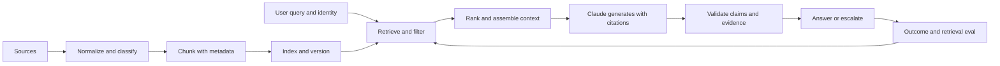

# RAG, поиск и конвейеры данных

> Ответ, подкреплённый источниками, заслуживает доверия лишь настолько, насколько надёжны дошедшие до модели свидетельства.

**Тип:** Build
**Языки:** Python
**Предварительные требования:** [Сквозная архитектура и компромиссы при выборе ценности](../../23-end-to-end-architecture-and-value-tradeoffs/); этап 11, уроки 06 и 07; этап 5, урок 23
**Время:** ~150 минут

## Цели обучения

- Проектировать границы при загрузке, разбиении на фрагменты, индексировании, поиске, генерации и цитировании
- Подбирать разреженный, плотный, гибридный, фильтруемый и итеративный поиск в соответствии со структурой данных
- Диагностировать сбои поиска до изменения модели или промпта
- Измерять качество поиска отдельно от качества ответов
- Сохранять актуальность, контроль доступа и происхождение данных на всём протяжении конвейера

## Проблема

Ассистент по внутренним политикам работает несколько месяцев. После обновления
документов он начинает уверенно отвечать на основе устаревшего порогового значения
для возврата средств. Версия модели, промпт и задержка не изменились.

Команда добавляет в промпт указание «использовать последнюю версию политики».
Ничего не улучшается. Модель не может следовать свидетельствам, которых она не
получила. В индексе находятся обе версии политики, фильтры по метаданным отсутствуют,
а средство поиска ставит устаревший фрагмент на первое место, поскольку его
формулировка точнее соответствует запросу.

Это инцидент поисковой подсистемы. Если считать его инцидентом модели, команда
потратит время впустую и может не заметить фактический сбой контроля.

## Концепция

### RAG — это система обработки данных

Генерация с дополнением поиском (RAG) объединяет две связанные системы с разными
режимами отказа.



Даже при превосходной модели система может дать сбой по следующим причинам:

- источник не был загружен;
- при синтаксическом разборе была потеряна нужная таблица;
- при разбиении на фрагменты условие оказалось отделено от исключения;
- в индексе использовались устаревшие или несовместимые представления;
- фильтры не учитывали тенанта, юрисдикцию, дату или разрешения;
- при ранжировании совпадение по ключевым словам получило приоритет перед авторитетным источником;
- при сборке контекста лучшие свидетельства были усечены;
- при генерации был процитирован один фрагмент, но сформулированное утверждение выходило за рамки подтверждаемого им содержания.

Диагностируйте первую границу, на которой произошёл сбой.

### Проектируйте фрагменты с учётом смысла и поиска

Фрагменты фиксированной длины в токенах — это отправная точка, а не универсальное
решение. Структура фрагмента должна сохранять единицу текста, которую процитировал
бы человек.

Для текстов политик удобными границами часто служат заголовки и абзацы. В
документации API сигнатуру метода следует хранить вместе с параметрами и ошибками.
В таблицах сохраняйте заголовки для каждой группы строк. В обращениях в службу
поддержки одному сообщению может требоваться контекст переписки. Для исходного
кода функции и классы лучше произвольных окон из символов.

Перекрытие помогает, когда факт пересекает границу, но оно также дублирует
свидетельства, увеличивает размер индекса и может заполнить итоговый контекст
почти одинаковым текстом. Измеряйте его влияние.

Каждому фрагменту нужны метаданные:

- стабильные идентификаторы документа и фрагмента;
- URI источника или идентификатор в системе учёта;
- версия и дата вступления в силу;
- тенант, юрисдикция, продукт или тип содержимого;
- атрибуты контроля доступа;
- версия процесса загрузки и парсера;
- родительский заголовок и позиция.

Благодаря метаданным поиск становится управляемым, а не просто основанным на
сходстве.

### Согласуйте поиск с запросом и структурой данных

#### Разреженный поиск

Поиск в стиле BM25 сопоставляет явно указанные термины. Он хорошо работает с
идентификаторами, названиями продуктов, кодами ошибок и формулировками политик,
при этом дёшев и объясним.

#### Плотный поиск

Векторные представления (эмбеддинги) сопоставляют семантическое сходство. Они
помогают, когда пользователи перефразируют понятие или лексика запроса отличается
от лексики источника. При этом они могут пропускать точные идентификаторы и
находить семантически связанный, но не авторитетный текст.

#### Гибридный поиск

Объедините кандидатов из разреженного и плотного поиска, а затем выполните слияние
или повторное ранжирование. Гибридный поиск зачастую лучше каждого отдельного
подхода обрабатывает запросы, сочетающие естественный язык и идентификаторы.

#### Поиск с фильтрацией

Применяйте доверенные метаданные и правила авторизации до того, как свидетельства
попадут к модели. Не просите Claude игнорировать фрагменты, которые пользователю
запрещено видеть. Запрещённые данные не должны попадать в контекст.

#### Итеративный поиск

Агент может переформулировать запросы, переходить по ссылкам или выявлять
недостающие свидетельства. Используйте этот подход, когда процесс обнаружения
действительно должен быть адаптивным. Задайте бюджеты на количество запросов и
ходов, время и стоимость. Стабильные конвейеры вопросов и ответов не должны по
умолчанию нести издержки агентной сложности.

### Оценивайте поиск отдельно от ответов

Если среди первых кандидатов нет правильных свидетельств, качество ответа
ограничено сверху. Сначала измеряйте качество поиска.

Полезные метрики:

- полнота при K: содержит ли набор кандидатов нужный источник;
- точность при K: какая доля набора кандидатов релевантна;
- средний обратный ранг: насколько рано появился первый релевантный источник;
- nDCG: ставит ли ранжирование наиболее релевантные источники на первые места;
- покрытие актуальных данных: использовалась ли в результатах действующая версия;
- утечка при авторизации: нарушает ли какой-либо результат права доступа вызывающей стороны.

Затем оцените генерацию:

- подтверждение утверждений процитированными свидетельствами;
- корректность и полнота цитирования;
- полнота ответа;
- отказ от ответа при недостатке свидетельств;
- выявление противоречий между источниками.

Единая сквозная оценка не покажет, какой слой нужно исправлять.

### Сохраняйте происхождение в виде данных

Сведения о происхождении не должны существовать только в форме текста,
сгенерированного после ответа. Передавайте идентификаторы источников через поиск,
сборку контекста, схему вывода и журналы.

Для каждого утверждения сохраняйте:

- идентификатор исходного документа и фрагмента;
- версию источника и дату вступления в силу;
- точный подтверждающий отрывок;
- оценку и позицию в результатах поиска;
- этапы преобразования или суммаризации.

Если источники противоречат друг другу, сообщите об этом. Не выбирайте молча
самую позднюю дату, если в предметной области нет явного правила приоритета.

### Обеспечьте атомарность и наблюдаемость обновления

Обновление документов может привести к смешанному индексу, в котором одновременно
присутствуют старые и новые фрагменты. Более безопасные подходы сначала создают и
проверяют новую версию, а затем атомарно переключают псевдоним или указатель.
Сохраняйте возможность отката, пока новый индекс не пройдёт проверки поиска и
актуальности.

Отслеживайте:

- успешность и задержку загрузки;
- количество и размер разобранного содержимого;
- активную версию каждого источника;
- версию эмбеддингов или индекса;
- долю пустых результатов и результатов с низкой оценкой;
- изменения распределения результатов поиска;
- основные запросы, на которых оценивание завершилось неудачей.

## Практическая реализация

## Интерактивная лабораторная работа

```figure
24-rag-ranking
```

Прежде чем редактировать код, воспользуйтесь лабораторной работой по ранжированию,
чтобы сравнить лексические совпадения, фильтры по метаданным, исключение устаревших
источников и поведение при разных значениях top-K. Наглядные позиции в результатах
связывают поисковое решение с полнотой, обратным рангом, актуальностью и
происхождением данных.

## Практическая лабораторная работа

Добавьте устаревший или недоступный документ в копию фикстуры и докажите, что он
не может попасть в набор кандидатов до этапа генерации.

## Готовый артефакт

[`outputs/retrieval-evidence-report.json`](../outputs/retrieval-evidence-report.json)
— это заполненный базовый отчёт, содержащий идентификаторы ранжированных фрагментов,
активные версии источников и метрики поиска.

## Проверка

Воспроизведите и проверьте результат следующими командами:

```bash
cd certifications/claude/lessons/24-rag-retrieval-and-data-pipelines/code
python3 main.py
python3 -m unittest discover tests -v
```

Тест из шести вопросов проверяет навыки диагностики и выбора метода поиска.

## Связь с итоговым проектом

Используйте отчёт о свидетельствах для проверки RAG и контрольных условий
актуальности в итоговом проекте сертификации Architect Professional.

В лабораторной работе реализован небольшой индекс в стиле BM25 на основе
стандартной библиотеки Python. Он намеренно сделан прозрачным. Промышленные
поисковые системы быстрее и функциональнее, но после этой работы подсчёт оценок
и границы метаданных не должны казаться магией.

Запустите его:

```bash
cd certifications/claude/lessons/24-rag-retrieval-and-data-pipelines/code
python3 main.py
python3 -m unittest discover tests -v
```

### Шаг 1: нормализуйте токены

`tokenize` переводит текст в нижний регистр и извлекает буквенно-цифровые термины.
Промышленным конвейерам необходимы токенизация с учётом языка, обработка полей и
тесты парсера. В уроке сохранена только концепция ранжирования.

### Шаг 2: разбейте данные на фрагменты со стабильными идентификаторами

`chunk_document` создаёт перекрывающиеся окна из слов, сохраняя идентификатор
документа, позицию, время обновления и стабильный идентификатор фрагмента.
Некорректное перекрытие вызывает ошибку на раннем этапе, а не приводит к
бесконечному циклу.

### Шаг 3: исключите неактивные источники до индексирования

`RetrievalIndex.build` игнорирует неактивные версии документов. Это упрощённое
контрольное условие актуальности. В промышленной системе активацию следует
привязать к проверенной версии индекса и атомарному переключению.

### Шаг 4: рассчитывайте оценки прозрачно

Индекс рассчитывает частоту термина, документную частоту, нормализацию по длине и
оценку обратной частоты документа. Точные термины запроса могут поднять в выдаче
источник, который действительно содержит формулировку действующей политики.

### Шаг 5: возвращайте сведения о происхождении

Каждый `RetrievalHit` содержит идентификатор документа, идентификатор фрагмента,
дату обновления, текст и оценку. Слой генерации должен использовать эти
структурированные свидетельства и возвращать ссылки утверждений на них.

### Шаг 6: оцените средство поиска

`evaluate_retrieval` рассчитывает полноту при K и средний обратный ранг по
размеченным случаям. Прежде чем менять ранжирование, добавьте обычные и
неоднозначные запросы, а также запросы с устаревшими версиями, ограничениями
доступа и состязательными входными данными.

## Применение

Промышленные системы обычно объединяют парсер документов, объектное хранилище,
разреженный или векторный индекс, фильтры по метаданным, модель повторного
ранжирования (реранкер) и конвейер оценивания. Сохраняйте те же контракты, даже
если управляемые сервисы скрывают реализацию.

Для инцидента с политикой:

1. Воспроизведите запрос и проверьте идентификаторы найденных фрагментов.
2. Уточните, какие версии источников активны в индексе.
3. Проверьте результаты синтаксического разбора и границы фрагментов рядом с пороговым значением и исключением.
4. Проверьте идентификационные данные и фильтры по метаданным.
5. Сравните наборы кандидатов из разреженного, плотного и гибридного поиска.
6. Выполните зафиксированное оценивание поиска до и после исправления.
7. Атомарно переключитесь на проверенный индекс и сохраните возможность отката.
8. Повторно оцените подтверждённость утверждений на слое генерации.

Не начинайте с изменения температуры или размера модели. Ни то ни другое не
поможет восстановить отсутствующие или запрещённые свидетельства.

## Шаблоны решений для экзамена

Если сразу после обновления документов ответы стали неверными, а модель и
задержка не изменились, в первую очередь исследуйте загрузку, индексирование,
фильтрацию и поиск.

Признаки сильных архитектурных решений:

- поиск учитывает и точные идентификаторы, и семантические перефразировки;
- фильтрация по идентификационным данным и метаданным выполняется до генерации;
- источники и индексы версионируются;
- поиск оценивается отдельно от итоговых ответов;
- сведения о происхождении передаются через контракт вывода;
- недостаточные или противоречивые свидетельства представлены явно.

Признаки слабых решений:

- указать модели запомнить последнюю версию документа;
- увеличивать контекст за счёт каждого источника;
- заменить модель, не проверив кандидатов;
- полагаться на сгенерированные цитаты без идентификаторов источников.

## Распространённые ошибки

### Больше контекста означает более надёжное обоснование

Нерелевантный контекст конкурирует за внимание и может скрыть лучшие
свидетельства. Улучшение поиска и порядка результатов часто эффективнее
увеличения объёма контекста.

### Сходство означает авторитетность

Семантическое сходство не кодирует приоритет политик, разрешения или дату
вступления в силу. Для этого нужны метаданные и правила.

### Корректная цитата означает подтверждённое утверждение

Цитата может указывать на реальный источник, который не подтверждает утверждение
целиком. Оценивайте логическое следование и охват, а не только корректность ссылки.

### Обновление означает добавление

Если добавлять новые фрагменты, не деактивируя старые версии, возникнут
противоречивые свидетельства. Рассматривайте обновление как версионируемое
развёртывание.

## Упражнения

1. Добавьте усиление с учётом полей, чтобы совпадения в заголовке получали более высокую оценку, чем совпадения в основном тексте.
2. Добавьте фильтр по юрисдикции и тест, доказывающий, что недоступные фрагменты никогда
   не появляются среди кандидатов.
3. Реализуйте функцию гибридного слияния рангов для двух ранжированных списков.
4. Создайте десять случаев поиска, в которых для точных идентификаторов и перефразировок требуются
   разные стратегии.
5. Разработайте контрольный список для атомарного обновления индекса, включающий проверку и откат.

## Ключевые термины

| Термин | Как обычно говорят | Что это на самом деле означает |
|------|-----------------|------------------------|
| Фрагмент | Фиксированное число токенов | Доступная для поиска и цитирования единица со своим идентификатором и метаданными |
| Разреженный поиск | Старый поиск по ключевым словам | Ранжирование по терминам, особенно эффективное для точной лексики и идентификаторов |
| Плотный поиск | Семантическая истина | Сходство в пространстве эмбеддингов, а не авторитетность или фактическое подтверждение |
| Гибридный поиск | Две базы данных | Слияние кандидатов, объединяющее точные и семантические сигналы |
| Полнота при K | Точность ответа | Наличие необходимых свидетельств среди первых K найденных элементов |
| Происхождение | Сгенерированная сноска | Структурированная история происхождения, передаваемая от источника к утверждению |

## Дополнительные материалы

- [Документация Claude по цитированию](https://platform.claude.com/docs/en/build-with-claude/citations) об актуальной поддержке цитат
- [Документация Claude по подсчёту токенов](https://platform.claude.com/docs/en/build-with-claude/token-counting) о планировании объёма контекста
- Этап 11, урок 06 — конвейер RAG с нуля
- Этап 11, урок 07 — расширенные методы поиска и повторного ранжирования
- Этап 19, урок 65 — гибридный разреженный и плотный поиск
