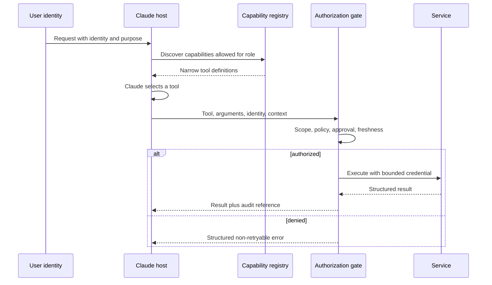

# Протоколы интеграции, идентификация и принцип минимальных привилегий

> Инструмент безопасен не потому, что Claude использует его осторожно. Он безопасен, когда система запрещает несанкционированное использование.

**Тип:** Build
**Языки:** Python
**Предварительные требования:** [Сквозная архитектура и компромиссы при выборе ценности](../../23-end-to-end-architecture-and-value-tradeoffs/); этап 13, уроки 01, 05, 06, 16 и 18
**Время:** ~150 минут

## Цели обучения

- Выбирать прямой API, CLI, MCP или межагентную интеграцию исходя из требований
- Отделять обнаружение возможностей от авторизации выполнения
- Проектировать наборы инструментов с минимальными привилегиями и сквозную передачу идентификационных данных
- Возвращать структурированные ошибки, пригодные для принятия мер, не раскрывая секреты
- Размещать механизмы одобрения, аудита и отзыва прав на границе выполнения

## Проблема

Агент службы поддержки может читать обращения, составлять ответы, оформлять возврат средств и удалять учётные записи пользователей. Большинству сотрудников поддержки нужны только первые две возможности. Команда оставляет включёнными все четыре инструмента и добавляет промпт: «Никогда не оформляй возврат средств и не удаляй учётные записи без крайней необходимости».

Это не принцип минимальных привилегий. Опасная возможность по-прежнему существует, модель по-прежнему её видит, и инъекция промпта всё ещё может быть направлена на неё. Текст с запросом подтверждения может снизить риск случайного использования, но не заменяет авторизацию.

Структурное исправление проще: не предоставлять роли ненужные возможности, передавать идентификационные данные вызывающей стороны и при выполнении инструмента проверять область доступа и наличие одобрения.

## Концепция

### Выбирайте форму интеграции исходя из границы

Протоколы частично пересекаются, но в первую очередь решают разные задачи.

| Форма | Когда подходит лучше всего | Главный компромисс |
|-------|----------|---------------|
| Прямой API | Ваше приложение знает контракт одного сервиса и требует минимальных накладных расходов | Жёсткая связанность с сервисом и собственный механизм обнаружения возможностей |
| CLI | Локальная автоматизация или автоматизация CI вокруг исполняемого файла | Сложность управления процессом, окружением и выводом |
| MCP | Хосту нужен стандартный способ обнаруживать инструменты, ресурсы или промпты на разных серверах | Ещё одна протокольная граница и модель авторизации, которые необходимо поддерживать |
| Межагентная интеграция | Один агент делегирует задачу другому автономному сервису | Более сложная семантика доверия, идентификации, хода выполнения и сбоев |

MCP не заменяет все API. Вызов стабильного внутреннего сервиса может быть понятнее и быстрее через прямой API. MCP оправдан, когда нескольким хостам нужен общий способ обнаруживать и вызывать возможности или когда инструменты должны оставаться в ведении сервера, внутри его границы.

CLI удобен для локальных рабочих процессов разработчиков и CI, но длительным задачам нужны сохраняемое состояние, отмена и получение результатов — возможностей ненадёжного дочернего процесса для этого недостаточно. Межагентная интеграция уместна, когда удалённая сторона отвечает за автономное выполнение задачи, а не просто служит конечной точкой функции.

### Разделяйте обнаружение, выбор и выполнение



Обнаружение определяет, что видит модель. Авторизация определяет, что действительно происходит. Необходимы оба механизма.

Если при обнаружении возвращаются все инструменты, модель расходует больше контекста, а выбор усложняется. Кроме того, она видит описания опасных операций. Если авторизации нет, сокрытие инструмента даёт лишь видимость защиты. Вызывающая сторона всё равно может обратиться непосредственно к конечной точке.

### Передавайте исходные идентификационные данные, а не подменяйте их

Ключ API приложения идентифицирует приложение. Он не представляет автоматически пользователя или сервис, от имени которого выполняется запрос.

Передавайте:

- идентификатор субъекта
- арендатора или организацию
- аутентифицированный сеанс
- роли и области доступа
- назначение или идентификатор обращения, если этого требует политика
- ссылку на одобрение для действия с повышенными привилегиями
- идентификаторы запроса и трассировки

Нижестоящие системы должны самостоятельно принимать решение об авторизации на основе доверенных идентификационных утверждений. Не выдавайте сервисные учётные данные с широкими полномочиями, поручая Claude имитировать разрешения пользователя.

### Применяйте принцип минимальных привилегий на четырёх уровнях

1. Набор инструментов: предоставляйте только возможности, необходимые для задачи и роли.
2. Схема инструмента: принимайте только необходимые аргументы и ограничивайте их значения.
3. Учётные данные: предоставляйте доступ только к необходимым областям и ресурсам сервиса.
4. Действие: во время выполнения повторно проверяйте текущую политику, принадлежность объекта и одобрение.

Разрешения меняются. Срок одобрения истекает. Определение инструмента могло быть загружено несколько минут назад. Авторизация во время выполнения — последний рубеж контроля.

### Проектируйте одобрение как отдельную возможность

«Сначала спросить пользователя» — неоднозначное требование. Надёжное одобрение содержит:

- точное предлагаемое действие и параметры
- ожидаемый эффект и возможность отмены
- идентификационные данные инициатора
- идентификационные данные и полномочия одобряющего лица
- срок действия
- семантику однократного или ограниченного использования
- ссылку на запись аудита

После одобрения выполните именно то действие, которое было проверено. Если аргументы изменились, запросите новое одобрение.

### Возвращайте структурированные ошибки

Сбои инструментов требуют разных способов восстановления.

```json
{
  "ok": false,
  "error": {
    "category": "authorization",
    "retryable": false,
    "message": "refunds:write scope is required",
    "safe_details": {
      "required_action": "request authorized human review"
    }
  }
}
```

Категории могут включать ошибки валидации, авторизации, отсутствия ресурса, конфликта, ограничения частоты запросов, зависимости, тайм-аута и внутренние ошибки. Сообщайте агенту, безопасно ли повторять попытку и что может изменить результат. Не возвращайте необработанные трассировки стека, токены или сообщения вышестоящих систем, содержащие секреты.

### Постепенное обнаружение уменьшает разрастание набора возможностей

Большие каталоги инструментов расходуют контекст и увеличивают число ошибок при выборе. Начните с небольшого стабильного набора и механизма поиска или реестра. Загружайте специализированные инструменты, когда в ходе задачи подтверждается потребность в них.

Постепенное обнаружение всё равно должно учитывать область доступа субъекта. Поиск не должен раскрывать существование или описание возможностей, о которых вызывающая сторона не вправе знать.

### Области доступа MCP не определяют авторизацию бизнес-операций

MCP стандартизирует обмен возможностями. Ваше приложение по-прежнему отвечает за идентификацию, изоляцию арендаторов, согласие, одобрение, политики, аудит и управление учётными данными. Защита транспорта — не авторизация, а успешное протокольное рукопожатие не предоставляет доступ ко всем инструментам.

## Практическая реализация

## Интерактивная лабораторная работа

```figure
25-identity-permission-path
```

В обозревателе пути разрешений проследите за идентификационными данными от аутентифицированного запроса через обнаружение возможностей, выбор моделью, авторизацию во время выполнения и одобрение до вызова сервиса и аудита. Изменение областей доступа показывает, почему обнаружение и авторизация являются отдельными механизмами контроля.

## Практическая лабораторная работа

Предоставьте только область доступа для обнаружения, попытайтесь выполнить операцию, затем добавьте привязанное одобрение и посмотрите, какое решение изменится, а какая граница продолжит действовать.

## Готовый артефакт

[`outputs/least-privilege-review.json`](../outputs/least-privilege-review.json) — заполненный обзор возможностей, показывающий видимые инструменты и структурированный отказ при попытке возврата средств.

## Проверка

Воспроизведите поведение и запустите все тесты авторизации:

```bash
cd certifications/claude/lessons/25-integration-protocols-identity-and-least-privilege/code
python3 main.py
python3 -m unittest discover tests -v
```

Тест проверяет правила выбора протокола, идентификации, одобрения и повторных попыток.

## Связь с итоговым проектом

Используйте отчёт в качестве подтверждения реализации идентификации и минимальных привилегий в итоговом проекте Architect Professional.

Лабораторная работа на Python со стандартной библиотекой делает эту границу наглядной.

```bash
cd certifications/claude/lessons/25-integration-protocols-identity-and-least-privilege/code
python3 main.py
python3 -m unittest discover tests -v
```

### Шаг 1: выберите основную форму

`select_protocol` требует указать одну основную потребность интеграции. Динамическому обнаружению соответствует MCP, локальной автоматизации — CLI, автономному удалённому делегированию — межагентная интеграция, а вызову известного сервиса — прямой API. При неоднозначных требованиях функция завершается ошибкой, чтобы архитектор уточнил границу.

### Шаг 2: определите контракты субъекта и инструментов

`Principal` содержит области доступа и актуальные одобрения. `ToolContract` объявляет необходимые области доступа, риск и требование одобрения. Описание объясняет поведение, но не авторизует его.

### Шаг 3: фильтруйте результаты обнаружения

`discover_tools` удаляет возможности, выходящие за область доступа субъекта. Специалист поддержки, составляющий ответы, никогда не увидит функцию удаления учётной записи.

### Шаг 4: выполняйте авторизацию при запуске

`authorize` проверяет текущие области доступа и одобрение. Если проверка не пройдена, `execute_tool` отклоняет вызов со структурированной ошибкой, для которой повторная попытка не предусмотрена.

Эта упрощённая система не реализует криптографическую идентификацию, проверку токенов или механизм политик. В рабочей среде это задачи инфраструктуры. Но система сохраняет правильное место принятия решения.

## Применение

Для системы поддержки создайте отдельные наборы инструментов для каждой роли:

- первичная обработка: чтение назначенного обращения, классификация, маршрутизация
- специалист по ответам: чтение обращения и политики, составление черновика
- специалист по проверке возврата: чтение обращения и рекомендации, одобрение или отклонение
- исполнитель возврата: выполнение только конкретного одобренного действия
- администратор: обслуживание учётных записей вне контура агента поддержки

Модель не должна получать инструменты администратора только потому, что какой-то сервис способен их предоставить. Для операции высокого риска следует использовать краткосрочные учётные данные, привязанные к одобренному действию, и создавать неизменяемую запись аудита.

Выбирая между MCP и прямым API, составьте ADR со сравнением следующих аспектов:

- количество и разнообразие хостов
- необходимость динамического обнаружения
- бюджет задержки
- зрелость существующих механизмов аутентификации и SDK
- граница развёртывания и ответственности
- потоковая передача или длительное выполнение
- нагрузка, связанная с наблюдаемостью и поддержкой

Популярность протокола — не требование.

## Подходы к принятию решений на экзамене

Если роли никогда не требуется какая-либо возможность, удалите её из конфигурации. Журналирование и подтверждение — компенсирующие меры контроля, а не реализация принципа минимальных привилегий.

Предпочитайте ответы, в которых:

- передаются аутентифицированные идентификационные данные пользователя или сервиса
- области доступа инструментов и учётных данных минимально необходимы
- авторизация повторно выполняется при запуске
- для действий с серьёзными последствиями используется актуальное одобрение
- возвращаются категоризированные ошибки с указанием возможности повторной попытки
- протокол выбирается исходя из границы интеграции
- для большого каталога применяется постепенное обнаружение возможностей

Отклоняйте ответы, предполагающие, что более качественный промпт, более крупная модель или успешное подключение MCP решает задачу авторизации.

## Распространённые ошибки

### Одна сервисная учётная запись для всех пользователей

Нижестоящий сервис видит только широкие полномочия приложения. Ограничения для отдельных пользователей становятся правилами промпта вместо политики, которую можно принудительно применить.

### Подтверждение без привязки

Пользователь одобряет возврат 50 долларов, после чего аргументы меняются на 500. Одобрение должно быть привязано к действию, параметрам, идентификационным данным и времени.

### Описания инструментов как механизмы контроля

Описания помогают при выборе. С точки зрения безопасности это недоверенный текст, который и сам может содержать инъекцию промпта.

### Повторные попытки при ошибках авторизации

Повторные попытки не создадут разрешение. Пометьте ошибку как не допускающую повторную попытку и направьте запрос в соответствующий процесс одобрения или предоставления доступа.

## Упражнения

1. Добавьте авторизацию на уровне ресурсов, чтобы субъект мог читать только назначенные ему обращения.
2. Создайте подписанную запись об одобрении для однократного использования и отклоняйте изменённые аргументы.
3. Определите интерфейс постепенного обнаружения, скрывающий имена недоступных инструментов.
4. Сравните MCP и прямой API для трёх внутренних сервисов при бюджете задержки 200 мс.
5. Проведите проверку описаний и результатов инструментов методом красной команды на косвенные инъекции промпта.

## Ключевые термины

| Термин | Как обычно говорят | Что это означает на самом деле |
|------|-----------------|------------------------|
| Аутентификация | Разрешение на действие | Подтверждение идентичности |
| Авторизация | Вход в систему | Решение о том, может ли данный субъект выполнить данное действие |
| Область доступа | Правило промпта | Ограниченное разрешение, закреплённое в доверенных учётных данных или решении политики |
| Обнаружение | Авторизация | Поиск возможности, не связанный с разрешением на её выполнение |
| Принцип минимальных привилегий | Добавить подтверждение | Удаление ненужных возможностей и минимизация полномочий на каждой оставшейся границе |
| Одобрение | Пользователь сказал «да» | Ограниченная по времени и привязанная к идентификационным данным авторизация точных параметров действия |

## Дополнительные материалы

- [Спецификация MCP](https://modelcontextprotocol.io/specification/latest) — актуальное описание поведения протокола
- [Спецификация авторизации MCP](https://modelcontextprotocol.io/specification/latest/basic/authorization) — требования к авторизации на уровне протокола
- [Документация Claude по использованию инструментов](https://platform.claude.com/docs/en/agents-and-tools/tool-use/overview) — актуальные контракты инструментов
- Этап 13, урок 05 — проектирование схем
- Этап 13, урок 18 — аутентификация MCP в рабочей среде
- Этап 17, урок 25 — средства контроля секретов и аудита
