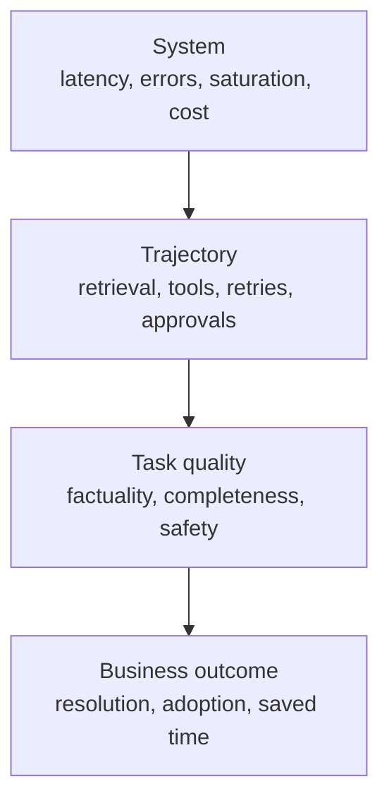

# Наблюдаемость, задержка и стоимость в рабочей среде

> Успешный вызов API всё равно может означать провал задачи.

**Тип:** Build
**Языки:** Python
**Предварительные требования:** [RAG, поиск и конвейеры данных](../../24-rag-retrieval-and-data-pipelines/); этап 11, урок 10; этап 17, уроки 08, 13 и 27
**Время:** ~150 минут

## Цели обучения

- Разделять надёжность системы, качество выполнения задачи и бизнес-результат
- Проектировать журналы, метрики и трассы для запросов Claude и траекторий агентов
- Диагностировать задержку модели, поиска, инструментов, очередей и повторных попыток
- Измерять совокупную стоимость и стоимость успешного результата
- Определять оповещения и критерии допуска к развёртыванию на основе целей обслуживания

## Проблема

Рабочая панель мониторинга сообщает, что 99.9 процента вызовов API завершились
успешно. Но клиенты всё равно жалуются.

Модель возвращает HTTP 200, однако в некоторых ответах используются устаревшие
источники. Вызов инструмента завершается по тайм-ауту, а агент незаметно продолжает
работу. Длинные промпты не попадают в кеш, потому что в их начале размещена временная
метка. Задержка P95 удвоилась, хотя среднее значение выглядит приемлемым. Более
дешёвая модель снизила стоимость вызова, но увеличила число повторных попыток и
проверок человеком.

Панель мониторинга измеряет успешность передачи данных. Продукт зависит от успешности
задачи. Наблюдаемость должна связывать эти показатели.

## Основная идея

### Наблюдайте за четырьмя уровнями



Системные сигналы показывают, сработали ли компоненты. Сигналы траектории показывают,
что делало приложение. Сигналы качества показывают, соответствовал ли результат
задаче. Бизнес-сигналы показывают, создал ли рабочий процесс ценность.

Не сводите их к одному полю «успех».

### Журналы, метрики и трассы решают разные задачи

Журналы фиксируют отдельные события: запрос принят, поиск не вернул кандидатов,
инструмент отклонил авторизацию, вывод не прошёл проверку схемы, проверяющий передал
случай на следующий уровень. Используйте структурированные поля, чтобы специалисты
могли группировать и фильтровать события.

Метрики агрегируют поведение во времени: частоту запросов, частоту ошибок, задержку
P95, использование токенов, попадания в кеш, полноту поиска, долю успешно выполненных
задач и стоимость успешного результата. На их основе работают панели мониторинга и
оповещения.

Трассы связывают всю траекторию. Одна трасса должна показывать вызовы модели, поиск,
выполнение инструментов, валидацию, повторные попытки и одобрение человеком, включая
временные связи между родительскими и дочерними операциями. Без трассы медленный
запрос выглядит как один непрозрачный блок.

### Трассируйте семантический контракт

Фиксируйте достаточно информации, чтобы воспроизвести и классифицировать результат:

- безопасные идентификаторы трассы, запроса, сеанса и пользователя
- версии приложения, промпта, модели, инструмента, знаний и оценивания
- класс входных данных и уровень риска
- количество токенов, а также операции чтения из кеша и записи в него
- причины остановки и имена инструментов
- длительность работы инструмента и структурированную категорию ошибки
- решения валидаторов и политик
- результаты оценщика и правки человека
- конечное состояние и последующий результат

Не записывайте в журналы секреты, учётные данные в открытом виде и избыточные
персональные данные. Для конфиденциальных входных данных вместо открытого текста
храните хеши, классы, количества или ссылки с контролем доступа.

### Разделяйте успешность системы и успешность задачи

Успешность системы показывает, завершился ли запрос согласно протоколу. Успешность
задачи показывает, соответствовал ли вывод заданным критериям. Корректный ответ JSON
может содержать фактические ошибки. Агент может завершить работу штатно, не выполнив
запрошенное изменение состояния.

Для агентных систем оценивайте оба аспекта:

- конечное состояние: существует ли требуемый артефакт или состояние системы?
- траектория: правильно ли использовались инструменты, разрешения, доказательства и бюджеты?

Одного сопоставления текста недостаточно для оценки обоих аспектов.

### Раскладывайте задержку на составляющие

Сквозная задержка включает:

```text
queue + context assembly + model + retrieval + tools + validation + retries + approval
```

Отслеживайте P50 и P95 для каждого крупного участка трассы. P50 описывает обычный
путь. P95 выявляет медленные инструменты, длинные контексты, ограничения частоты
запросов и повторные попытки.

Для потоковых интерфейсов учитывайте время до первого полезного вывода. Время до
первого токена может выглядеть хорошим, пока пользователь ждёт цитаты, результаты
работы инструментов или окончательный проверенный ответ.

Для фоновых и пакетных систем измеряйте соблюдение сроков выполнения и пропускную
способность. Обработка одного элемента пакета за 30 секунд может быть приемлемой,
если всё задание укладывается в установленное бизнесом временное окно.

### Оптимизируйте на основе данных

Распространённые способы снижения задержки:

- направлять простые задачи подходящей более быстрой модели
- сокращать нерелевантный контекст
- располагать стабильные префиксы промпта так, чтобы их можно было кешировать
- извлекать меньше кандидатов, но более высокого качества
- выполнять независимые вызовы инструментов параллельно
- переносить неинтерактивные нагрузки в пакетную обработку
- ограничивать бюджеты времени, ходов и повторных попыток
- кешировать детерминированные результаты инструментов, если требования к актуальности это допускают

Каждый из этих способов может повлиять на качество или безопасность. Измеряйте
компромисс на репрезентативном наборе для оценивания.

### Измеряйте стоимость успешного результата

Цена токенов — лишь одна из составляющих.

```text
total cost = model + cache writes and reads + tools + infrastructure + review + correction
cost per success = total cost / accepted task outcomes
```

Неудачные запросы тоже стоят денег. Как и безопасные отказы, повторные попытки,
время проверяющих и устранение последствий инцидентов. Отдельно сообщайте стоимость
входных и выходных данных, кеша и инструментов, чтобы команда могла влиять на эти
показатели.

При выборе модели или варианта архитектуры имеет значение именно сравнение стоимости
успешного результата.

### Учитывайте структуру кеша промптов

Кеширование промптов позволяет повторно использовать стабильный префикс. Изменения
в начале могут сделать недействительным всё, что следует за ними. Размещайте
стабильные определения инструментов, системные инструкции и объёмные справочные
материалы перед динамическим содержимым пользователя, если актуальная документация
поддерживает такую структуру кеша.

Отслеживайте количество токенов, прочитанных из кеша и записанных в него. Флаг
возможности кеширования без метрики доли попаданий — это не оптимизация.

Определения инструментов, настройки модели, конфигурация рассуждений и другие
изменения запроса могут влиять на работу кеша. Сверяйтесь с актуальной официальной
документацией, поскольку детали меняются.

### Создавайте оповещения, требующие действий

Настраивайте оповещения на ситуации, требующие решений от пользователей и
специалистов, а не на каждое изменение метрики.

Полезные оповещения включают:

- снижение доли успешно выполненных задач ниже SLO в течение значимого интервала
- отказ механизма безопасности или попытку несанкционированного действия
- превышение задержкой P95 допустимого для пользователей уровня
- отставание в обновлении данных для поиска
- всплеск ошибок определённой категории у инструмента
- резкое падение доли попаданий в кеш после развёртывания
- превышение бюджетного ограничения для стоимости успешного результата
- расхождение оценщиков или дрейф меток

Для каждого оповещения нужны ответственный, инструкция по реагированию, ссылка на
доказательства и путь эскалации. Если никто не знает, какое действие должно за ним
последовать, это всего лишь украшение панели мониторинга.

### Ограничивайте риск с помощью поэтапного развёртывания

Оценивание вне рабочей среды необходимо, но недостаточно. В рабочем трафике появляются
новые запросы, данные, нагрузки и интеграции.

Используйте:

1. теневое оценивание без влияния на пользователей
2. небольшой канареечный запуск для отдельных арендаторов или доли трафика
3. контролируемое расширение с автоматическим откатом
4. полное развёртывание после прохождения критериев качества, задержки, стоимости и безопасности

Сравнивайте со стабильной базовой версией и разделяйте результаты по классам задач.
Общее улучшение может скрыть серьёзную регрессию в сегменте высокого риска.

## Практическая реализация

## Интерактивная лабораторная работа

```figure
26-latency-cost-slo
```

В обозревателе SLO независимо изменяйте успешность задач, долю попаданий в кеш,
стоимость повторных попыток, P50 и P95. Он выявляет варианты, в которых более дешёвые
вызовы или исправная передача данных всё равно не проходят критерии пользы для
пользователя, качества или стоимости успешного результата.

## Практическая лабораторная работа

Добавьте дешёвую трассу неудачной попытки и убедитесь, что стоимость успешного
результата возрастает, хотя цена единицы снижается. Затем определите первый критерий,
который должен заблокировать развёртывание.

## Готовый артефакт

[`outputs/release-scorecard.json`](../outputs/release-scorecard.json) — заполненное
сравнение базовой и новой версий с независимыми критериями качества, задержки,
кеширования и экономики.

## Проверка

Воспроизведите и протестируйте агрегацию:

```bash
cd certifications/claude/lessons/26-production-observability-latency-and-cost/code
python3 main.py
python3 -m unittest discover tests -v
```

Тест проверяет решения по диагностике и развёртыванию.

## Связь с итоговым проектом

Перенесите оценочную карту в критерии оценивания, наблюдаемости и канареечного
развёртывания итогового проекта Architect Professional.

В лабораторной работе синтетические записи трасс агрегируются только средствами Python.

```bash
cd certifications/claude/lessons/26-production-observability-latency-and-cost/code
python3 main.py
python3 -m unittest discover tests -v
```

### Шаг 1: представьте траекторию одной задачи

`Trace` хранит компактную сквозную запись: вариант, задержку, количество токенов,
стоимость, результат системы, результат задачи, состояние кеша и категорию ошибки.
В рабочей среде трасса содержала бы дочерние участки и ссылки с контролем доступа,
а не один плоский объект.

### Шаг 2: агрегируйте, не скрывая сбои

`summarize` отдельно сообщает об успешности системы и задачи. Функция вычисляет P50
и P95 методом ближайшего ранга, долю чтений из кеша, категории ошибок, общую стоимость
и стоимость успешно выполненной задачи. Стоимость неудачных попыток остаётся в
числителе.

### Шаг 3: сравните варианты

`by_variant` не позволяет усреднить кешируемую или маршрутизируемую реализацию вместе
с базовой версией. Сравнивайте качество, задержку и стоимость в совокупности.

### Шаг 4: оцените цели обслуживания

`evaluate_objectives` применяет минимальный порог успешности задач и максимальные
пороги задержки и стоимости. Вариант должен пройти все обязательные критерии. Нельзя
компенсировать провал безопасности или качества более низкой стоимостью.

## Применение

Начните с одного вопроса о рабочей среде: «Почему после выпуска снизилась успешность
задач?»

Отфильтруйте трассы по приложению и версии выпуска. Разделите их по классам входных
данных. Сначала проверьте системные ошибки, затем участки поиска и инструментов,
после чего — результаты валидаторов и оценщиков. Сравните версии промпта, модели,
знаний и инструментов. Найдите самое раннее отклонение от траектории базовой версии.

Если задержка P95 растёт, а P50 остаётся стабильной, изучите поведение медленного
пути: повторные попытки, ограничения частоты запросов, большие входные данные,
тайм-ауты инструментов и ожидание одобрения. Если стоимость растёт при стабильной
цене токенов, проверьте число вызовов, длину контекста, попадания в кеш и проверки
человеком.

Ведите оценочную карту выпуска:

| Критерий | Базовая версия | Новая версия | Требование |
|------|----------|-----------|----------|
| Доля успешно выполненных задач | | | отсутствие регрессии в группах высокого риска |
| Доля успешных проверок безопасности | | | 100 процентов для обязательных мер контроля |
| Задержка P95 | | | в пределах SLO |
| Стоимость успешного результата | | | в пределах бюджета |
| Полнота поиска | | | в пределах допуска |
| Минуты проверки человеком | | | отсутствие скрытой нагрузки на рабочий процесс |

## Принципы выбора ответа на экзамене

Если успешность API высока, но пользователи сообщают о плохих результатах, добавьте
или изучите данные о семантическом качестве и траектории. Если неправильные ответы
появились после обновления документов, сначала трассируйте поиск, а не меняйте модели.

Предпочитайте ответы, которые:

- совместно используют журналы, метрики и трассы
- разделяют успешность передачи, задачи и бизнес-результата
- отслеживают P95, а не только средние значения
- сравнивают стоимость успешного результата
- версионируют промпты, модели, инструменты и знания
- допускают развёртывание по критериям качества, задержки, стоимости и безопасности
- назначают для каждого оповещения ответственного и инструкцию по реагированию

## Распространённые ошибки

### Запись полных промптов в журнал по умолчанию

Это может привести к утечке персональных данных, секретов или регулируемой информации.
Фиксируйте минимальный объём безопасных доказательств, а доступ к конфиденциальным
ссылкам контролируйте.

### Одна агрегированная оценка качества

Она может скрыть регрессии для отдельного языка, уровня риска, задачи или клиента.
Разделяйте результаты по этим признакам.

### Средняя задержка

Небольшая группа медленных запросов может ухудшить опыт пользователей, даже когда
среднее значение остаётся стабильным. Отслеживайте задержку в хвосте распределения
и долю тайм-аутов.

### Стоимость одного вызова

Этот показатель поощряет дешёвые неудачи. Используйте стоимость принятого результата
и учитывайте проверки и исправления.

## Упражнения

1. Добавьте в лабораторную работу дочерние участки трассы для поиска и двух инструментов.
2. Добавьте группы по риску входных данных и докажите, что общее улучшение может скрыть
   критическую регрессию.
3. Создайте эксперимент по инвалидации кеша и измерьте долю попаданий, P95 и стоимость.
4. Спроектируйте оповещение об ошибках авторизации инструментов, назначив ответственного и составив инструкцию по реагированию.
5. Напишите политику канареечного развёртывания, которая выполняет откат при отказе любой обязательной меры контроля.

## Ключевые термины

| Термин | Как обычно говорят | Что это означает на самом деле |
|------|-----------------|------------------------|
| Журнал | Отладочный текст | Структурированное событие с безопасными доказательствами и идентификаторами |
| Метрика | Любое число | Агрегированные во времени данные, используемые для понимания или управления поведением |
| Трасса | Идентификатор запроса | Связанные временные данные и результат полной траектории |
| Успешность задачи | HTTP 200 | Запрошенный результат соответствует критериям и ограничениям задачи |
| Задержка P95 | Самый медленный запрос | Значение, не позднее которого завершаются 95 процентов измеренных запросов |
| Стоимость успешного результата | Цена модели | Общая ожидаемая стоимость, разделённая на число принятых результатов задач |

## Дополнительные материалы

- [Документация API об использовании Claude и стоимости](https://platform.claude.com/docs/en/build-with-claude/usage-cost-api) для актуальной информации об отчётности по использованию
- [Документация по кешированию промптов](https://platform.claude.com/docs/en/build-with-claude/prompt-caching) для актуальной информации о работе кеша
- Этап 17, урок 13 — наблюдаемость LLM
- Этап 17, урок 27 — управление финансами LLM
- Этап 17, уроки 20 и 21 — поэтапная доставка и A/B-тестирование
