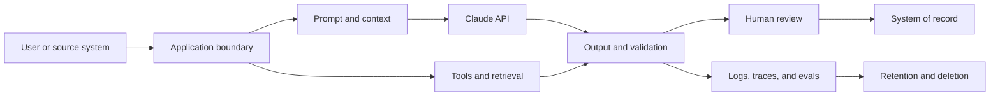

# Корпоративное управление, соответствие требованиям и проверка человеком

> Управление — это система, которая определяет, кто и какой риск вправе принимать и с чьими данными.

**Тип:** Справочный материал
**Языки:** Python
**Предварительные требования:** [Определите полномочия для возможностей системы](../../06-governance-safety-and-responsible-use/), [Протоколы интеграции, идентификация и принцип наименьших привилегий](../../25-integration-protocols-identity-and-least-privilege/); этап 17, урок 26
**Время:** ~150 минут

## Цели обучения

- Преобразовывать требования политик и нормативные обязательства в технические меры контроля с назначенными ответственными
- Классифицировать данные и отображать их движение через промпты, инструменты, хранилища, журналы и проверку
- Проектировать проверку человеком с учётом риска, полномочий и обратимости
- Оценивать предвзятость, справедливость, прозрачность и возможность оспаривания с учётом контекста
- Формировать доказательства для утверждения, мониторинга, реагирования на инциденты и аудита

## Проблема

Команда медицинской организации предлагает рабочий процесс с Claude, который резюмирует сообщения пациентов,
рекомендует категорию для их маршрутизации и составляет черновик ответа. В проектном документе сказано:
«Модель не хранит данные, все результаты проверяет человек, а система
соответствует требованиям HIPAA».

Ни одно из этих утверждений не является архитектурой.

Данные могут присутствовать в полезной нагрузке API, файлах, кешах, хранилищах пакетной обработки, журналах, трассировках,
системах поддержки и инструментах проверяющих. Формулировка «проверка человеком» ничего не говорит о квалификации проверяющего,
доступных ему доказательствах, рабочей нагрузке или полномочиях. Соответствие требованиям зависит от
конкретного варианта использования, договоров, конфигурации, региона, мер контроля и юридического анализа.
Архитектор не может заявить о нём одним предложением.

Правильный ответ — не автоматический отказ, а проект с надлежащим управлением,
картой данных, решениями по рискам, ответственными за меры контроля, доказательствами и передачей вопросов
специалистам по безопасности, конфиденциальности, праву, медицине или нормативному соответствию, когда это необходимо.

Этот урок учит принимать архитектурные решения. Он не является юридической консультацией.

## Концепция

### Начните с решения по риску

Управление начинается с определения:

- решения или действия, на которое влияет система
- людей, которые могут получить пользу или понести вред
- задействованных классов данных
- типов ошибок и злоупотреблений
- обратимости
- необходимых полномочий
- применимых внутренних и внешних обязательств организации
- ответственного, который принимает остаточный риск

Не начинайте с универсального списка защитных ограничений. Фильтр контента, очередь утверждения
или шифрование полезны лишь тогда, когда устраняют конкретно названный риск на
определённой границе.

### Отобразите движение данных по всей системе



Для каждого перехода и хранилища зафиксируйте:

- категорию и назначение данных
- источник и, где применимо, субъекта персональных данных
- обязательные и необязательные поля
- идентификацию и доступ
- шифрование и владение ключами
- границу провайдера и субобработчика
- требования к региону или резидентности данных
- порядок хранения и удаления
- использование для улучшения или оценивания модели
- доказательства для расследования инцидентов и аудита доступа

У возможностей продукта могут различаться условия хранения данных и критерии допустимости использования. Файлы,
пакетная обработка, выполнение кода, коннекторы MCP, размещённые сессии и стандартные
запросы Messages могут относиться к разным границам. Проверьте актуальную официальную
документацию и свой договор для конкретного сочетания возможностей.

### Сначала минимизируйте, затем защищайте

Меры безопасности надёжнее, если ненужные данные вообще не попадают в систему.

Действуйте в следующем порядке:

1. Удалите поля, которые не нужны для задачи.
2. Используйте псевдонимизацию или агрегирование, если идентификация не требуется.
3. Ограничьте выбор возможности продукта или границы провайдера исходя из явных требований.
4. Ограничьте идентификационные данные, область действия, сроки хранения и журналы.
5. Защитите оставшиеся данные с помощью шифрования, мониторинга и средств реагирования на инциденты.

Фраза «попросить Claude не запоминать» не является мерой контроля хранения. Сроки хранения определяются
конфигурацией и условиями договора.

### Создайте матрицу мер контроля

Меры контроля делятся на несколько типов.

| Тип | Назначение | Пример |
|------|---------|---------|
| Превентивная | Предотвратить небезопасное событие | Проверка области действия блокирует несанкционированную запись |
| Выявляющая | Обнаружить проблему | Оповещение об утечке конфиденциального поля в выборке результатов |
| Корректирующая | Ограничить или устранить вред | Отозвать доступ, откатить маршрут модели, исправить затронутую запись |
| Управленческая | Назначить полномочия и организовать их пересмотр | Назначенный ответственный повторно утверждает вариант использования после существенного изменения |

Для каждой меры контроля зафиксируйте ответственного, реализацию, доказательства, тест, действия при отказе
и частоту пересмотра. Мера контроля без ответственного и теста — лишь надежда.

### Применяйте защитные ограничения модели и системы послойно

Используйте несколько границ:

- валидацию и классификацию входных данных
- отделение доверенных источников от недоверенного содержимого
- инструкции и примеры в промпте
- минимально необходимый набор инструментов
- аутентификацию и авторизацию
- проверку схемы и семантики вывода
- ограничения действий и утверждение
- мониторинг после развёртывания и тесты методом red teaming

Защитные ограничения в промпте влияют на генерацию. Системные защитные ограничения обеспечивают соблюдение инвариантов.
Они не заменяют друг друга.

### Проектируйте проверку человеком как меру контроля

Участие человека в контуре (human-in-the-loop) полезно, когда проверяющий способен улучшить решение и обладает
необходимыми для этого информацией, временем, компетенцией и полномочиями.

Определите:

- условие запуска: класс риска, недостаток доказательств, конфликт, неопределённость или попадание случая в выборку
- проверяющего: роль и квалификацию
- пакет: исходные доказательства, вывод модели, траекторию вызовов инструментов, флаги и предлагаемое действие
- решение: утвердить, отредактировать, отклонить, передать на следующий уровень или запросить доказательства
- уровень обслуживания: допустимое время и пропускную способность очереди
- резервный вариант: безопасное поведение, если проверка недоступна
- аудит: идентификатор проверяющего, обоснование, временную метку и итоговое действие

Избегайте предвзятости автоматизации. У проверяющих должна быть причина изучать доказательства, а не только
безупречно оформленный ответ, подталкивающий к формальному одобрению. Можно показывать выдержки из источников
до сгенерированных выводов или требовать структурированные коды причин.

### Соотносите проверку с риском

| Риск | Пример | Схема проверки |
|------|---------|----------------|
| Низкий | Внутренний черновик, который легко отменить | Автоматические проверки и выборочная проверка человеком |
| Средний | Рекомендация для клиента | Проверка по пороговому условию или при исключении |
| Высокий | Финансовое, юридическое, клиническое или разрушительное действие | Утверждение квалифицированным специалистом до выполнения действия |
| Неизвестный | Новый вариант использования или недостаточные доказательства | Приостановить, передать на следующий уровень и собрать доказательства |

Оценка уверенности, выданная той же моделью, не является надёжной границей безопасности. Используйте
наблюдаемые доказательства, откалиброванных оценщиков, детерминированные условия и
проверку квалифицированным специалистом.

### Рассматривайте справедливость как контекстное требование

Предвзятость — это систематическая ошибка или репрезентация, способная поставить людей в невыгодное положение.
Единой универсальной метрики справедливости не существует.

Задайте вопросы:

- Какое решение принимается?
- Для каких групп могут различаться частота ошибок или доступ?
- Какие защищаемые или чувствительные атрибуты присутствуют, выводятся косвенно или заменяются прокси-признаками?
- Какое определение справедливости соответствует правовому и этическому контексту?
- Какие компромиссы возникают между точностью, конфиденциальностью и индивидуальным подходом?
- Кто уполномочен выбирать и пересматривать критерий?

Тестируйте репрезентативные срезы и, где уместно, группы на пересечении признаков. Малый
размер выборки создаёт неопределённость, которую следует отражать в отчёте, а не скрывать.

### Обеспечьте прозрачность и возможность оспаривания

Разным людям нужны разные объяснения.

- Конечные пользователи должны знать, когда ИИ существенно влияет на взаимодействие и как
  оспорить результат, причинивший вред.
- Проверяющим нужны доказательства, сведения о неопределённости и контекст мер контроля.
- Эксплуатирующим систему специалистам нужны версии, трассировки и категории отказов.
- Аудиторам нужны сопоставление с политиками, тесты, сведения об ответственности и сохранённые доказательства.
- Руководителям нужны сведения об остаточном риске, влиянии на бизнес и статусе решения.

Не раскрывайте цепочку рассуждений или конфиденциальные системные инструкции в качестве
объяснения. Предоставляйте причины со ссылками на источники, применённые правила, значимые факторы и
порядок обжалования с участием человека.

### Планируйте изменения

Проводите повторную оценку при существенном изменении любого из следующих элементов:

- варианта использования или затрагиваемой группы людей
- модели или провайдера
- промпта или полномочий инструмента
- источника данных, срока хранения или региона
- результата оценивания или характера инцидентов
- закона, политики или договора
- масштаба развёртывания

Версионируйте оценку рисков и доказательства эффективности мер контроля. Разрешение на запуск не
распространяется на не связанную с ним будущую систему.

## Практическая реализация

## Интерактивная лабораторная работа

```figure
27-governance-approval-flow
```

В обозревателе процесса утверждения меняйте последствия, обратимость, доказательства,
квалификацию проверяющего, пропускную способность очереди и резервный вариант. Так становится видно, когда
метка «проверка человеком» обозначает реальную меру контроля, а когда — лишь узкое место.

## Практическая лабораторная работа

Удалите резервный вариант для проверки или одного ответственного за меру контроля из копии пакета,
изучите заблокированное состояние и исправьте схему управления.

## Готовый артефакт

Заполненный файл [`outputs/governance-control-packet.md`](../outputs/governance-control-packet.md)
содержит реестр рисков, границу данных, превентивные, выявляющие, корректирующие и
управленческие меры контроля, а также обеспеченный персоналом процесс утверждения.

## Проверка

Детерминированно проверьте назначение ответственных и действия при отказе:

```bash
cd certifications/claude/lessons/27-enterprise-governance-compliance-and-hitl
python3 code/main.py
python3 -m unittest discover -s code/tests -v
```

Тест проверяет решения по управлению и повторной оценке.

## Связь с итоговым проектом

Используйте этот пакет в разделе об управлении и проверке человеком итогового проекта
Architect Professional.

Создайте пакет управления для высокорискового рабочего процесса с Claude.

### Шаг 1: реестр рисков

```markdown
| Risk | Cause | Affected party | Impact | Likelihood | Control | Owner | Residual risk |
|------|-------|----------------|--------|------------|---------|-------|---------------|
```

Включите случайный отказ, неправомерное использование, инъекцию промпта, доступ изнутри организации, отказ зависимости,
устаревшие знания, несправедливые результаты и перегрузку проверяющего.

### Шаг 2: карта данных

Перечислите каждую полезную нагрузку, хранилище, журнал, кеш, набор для оценивания, интерфейс для человека и
внешний сервис. Укажите назначение данных, минимальный набор полей, срок хранения, удаление,
идентификацию, регион и договорную границу.

### Шаг 3: матрица мер контроля

```markdown
| Control | Risk addressed | Boundary | Owner | Evidence | Test | On failure |
|---------|----------------|----------|-------|----------|------|------------|
```

Включите как минимум по одной превентивной, выявляющей, корректирующей и управленческой мере контроля.

### Шаг 4: проектирование проверки человеком

Укажите условия запуска, требования к квалификации проверяющего, пакет доказательств, действия, SLO очереди,
резервный вариант и аудиторскую запись. Рассчитайте ожидаемый объём проверок. Если очередь не может
соблюсти SLO, проект не завершён.

### Шаг 5: утверждение и повторная оценка

Перечислите технические решения, а также решения по безопасности, конфиденциальности, предметной области и бизнесу, для которых нужны
отдельные ответственные. Определите условия существенных изменений и дату следующего пересмотра.

## Применение

Для рабочего процесса с сообщениями пациентов более безопасная первая версия могла бы составлять черновик рекомендации
по маршрутизации для квалифицированного проверяющего, не отправляя ответ и не изменяя
медицинскую карту. Она использует минимально необходимые поля, доверенные клинические источники,
строгую авторизацию по клиентам и ролям, вывод со ссылками на источники, проверки ключевых слов
высокого риска и доказательств, а также безопасный резервный вариант при недоступности очереди проверяющих.

Затем команда проверяет:

- точность выполнения задачи по классам сообщений
- ложноотрицательные результаты для срочных случаев
- демографические и языковые срезы, где это разрешено и уместно
- подтверждение источниками и обработку устаревших данных
- согласованность решений проверяющих, затрачиваемое время и переопределения
- меры контроля конфиденциальности, доступа, хранения и удаления
- порядок действий при инцидентах, откате и аудите

Ответственные за юридические вопросы, конфиденциальность, безопасность и клиническую практику решают, удовлетворяют ли полученные
доказательства применимым обязательствам. Архитектор предоставляет карту,
меры контроля, тесты и заключение об остаточном риске.

## Подходы к принятию решений на экзамене

Если сценарий включает регулируемые или конфиденциальные данные, не делайте вывод, что
внутреннее использование автоматически разрешено. Минимизируйте и классифицируйте данные, проверьте политику и
договор и привлеките уполномоченное лицо.

Предпочитайте ответы, которые:

- удаляют или анонимизируют ненужные идентификаторы
- отображают границы данных и сроки хранения для конкретных возможностей
- послойно применяют меры контроля на уровне модели и детерминированные меры контроля
- ставят высокорисковые действия в зависимость от утверждения квалифицированным специалистом
- тестируют репрезентативные срезы и неблагоприятные случаи
- предоставляют доказательства и путь обжалования или передачи на следующий уровень
- называют ответственных за меры контроля и условия повторной оценки

Избегайте ответов, в которых промпт, уверенность модели, формальная проверка или заявление поставщика
считаются полноценным управлением.

## Распространённые ошибки

### Соответствие требованиям на основании названия продукта

Допустимость использования может зависеть от возможности, конфигурации, договора, региона и потока
данных. Проверяйте конкретную архитектуру.

### Проверка человеком для галочки

Неквалифицированный или перегруженный проверяющий без доказательств не способен надёжно снижать
риск.

### Ведение журналов для аудита без минимизации

Подробные журналы могут образовать новое хранилище конфиденциальных данных. Сохраняйте минимум доказательств,
применяя надлежащие меры контроля доступа и удаления.

### Одна метрика справедливости

Разные определения справедливости могут противоречить друг другу. Выбирайте определение с учётом контекста, закона, вреда и
решения заинтересованных сторон, а затем сообщайте о компромиссах.

## Упражнения

1. Постройте карту данных для рабочего процесса поддержки, использующего файлы, коннектор MCP, пакетное
   оценивание и проверку человеком.
2. Спроектируйте очередь проверок для 10,000 ежедневных задач с долей срабатывания 5 процентов и
   рассчитайте потребность в персонале.
3. Напишите тест меры контроля, доказывающий, что данные неавторизованного клиента никогда не попадают в контекст
   модели.
4. Определите порядок оспаривания для пользователя, пострадавшего от решения с участием ИИ.
5. Сформулируйте критерии существенных изменений, требующие повторной оценки управления.

## Ключевые термины

| Термин | Как обычно говорят | Что это на самом деле означает |
|------|-----------------|------------------------|
| Управление | Документ с политикой | Решения, ответственность, меры контроля, доказательства и проверка на протяжении жизненного цикла системы |
| Минимизация данных | Всё зашифровать | Не собирать и не отправлять поля, которые не требуются для цели обработки |
| Участие человека в контуре | Человек видит результат | Определённая мера контроля с условием запуска, квалифицированным ответственным, доказательствами, полномочиями и резервным вариантом |
| Остаточный риск | Скрытая проблема | Риск, остающийся после применения мер контроля и явно принятый уполномоченным ответственным |
| Справедливость | Одинаковая точность | Контекстный критерий с компромиссами и затрагиваемыми заинтересованными сторонами |
| Возможность оспаривания | Поддержка клиентов | Реальный порядок оспаривания, пересмотра и исправления результата |

## Дополнительные материалы

- [Документация о хранении данных Claude API](https://platform.claude.com/docs/en/manage-claude/api-and-data-retention) с актуальными границами для конкретных возможностей
- [Anthropic Trust Center](https://trust.anthropic.com/) с актуальными материалами по безопасности и соответствию требованиям
- [Конституция Claude](https://www.anthropic.com/constitution) — опубликованная Anthropic система принципов поведения модели
- Этап 17, урок 26 — архитектура соответствия требованиям
- Этап 18, уроки 20 и 21 — предвзятость и справедливость
