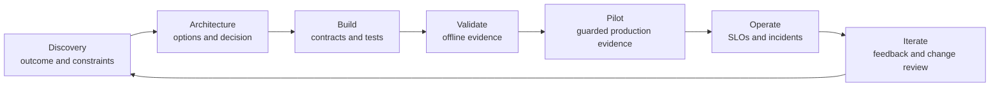

# Коммуникация с заинтересованными сторонами, ADR и владение жизненным циклом

> Архитектура не считается переданной, когда закончена диаграмма. Она передана, когда следующий владелец способен реализовать принятое решение на практике.

**Тип:** Справочный материал
**Языки:** Python
**Предварительные требования:** [Исследование бизнес-задачи, требования и SLA](../../22-business-discovery-requirements-and-slas/), [Корпоративное управление, соответствие требованиям и проверка человеком](../../27-enterprise-governance-compliance-and-hitl/); этап 17, урок 23
**Время:** ~135 минут

## Цели обучения

- Представлять одну архитектуру на уровне руководства, продукта, инженерной реализации и контрольных функций
- Составлять записи решений, сохраняющие компромиссы и условия пересмотра
- Преобразовывать проект в рекомендации по реализации, контрольные точки внедрения и явно назначенную ответственность
- Определять критерии приёмки при передаче и операционную готовность
- Управлять обратной связью и изменениями на протяжении жизненного цикла системы

## Проблема

Архитектор представляет руководящему комитету подробную диаграмму
мультиагентной системы. На диаграмме показаны маршруты моделей, серверы MCP,
векторные индексы, очереди событий, оценщики и трассировка. Никто не может
ответить на три основных вопроса:

- Какое бизнес-решение предлагается утвердить?
- Какой риск сохраняется после применения предложенных мер контроля?
- Кто будет владеть системой после запуска?

Позднее тот же проект передают инженерам в виде слайда. Критически важные решения
остаются только в памяти участников встреч. Операционная команда не получает ни SLO,
ни правила отката. Команда по политикам не знает, что отвечает за актуальность знаний.
Рецензенты узнают о своей очереди только во время пилотного запуска.

Проект может быть технически корректным и при этом непригодным для передачи.
Коммуникация и владение жизненным циклом входят в архитектурные обязанности.

## Концепция

### Для одной системы нужны разные представления

Разным заинтересованным сторонам нужны разные решения, а не разные версии истины.

| Аудитория | Основной вопрос | Минимально необходимые свидетельства |
|----------|------------------|------------------|
| Руководство | Стоит ли ожидаемая ценность остаточного риска и требуемых инвестиций? | результат, исходный уровень, целевой показатель, варианты, диапазон затрат, решение по риску |
| Продуктовая и операционная команды | Как изменятся рабочий процесс и пользовательский опыт? | пользовательский путь, исключения, проверка, SLO, план освоения системы пользователями |
| Инженеры | Что необходимо построить и как должны вести себя границы? | компоненты, контракты, идентификация, ошибки, версии, тесты |
| Безопасность и конфиденциальность | Где данные и полномочия пересекают границы? | карта данных, модель угроз, меры контроля, сроки хранения, свидетельства |
| Владелец предметной области | Корректен ли результат для реальной задачи? | примеры для оценивания, источники, политика, эскалация, владение изменениями |
| SRE и поддержка | Как обнаруживать и ограничивать сбои и восстанавливаться после них? | телеметрия, оповещения, инструкции, откат, зависимости |

Не упрощайте материал, исключая само решение. Представляйте одно и то же решение
через свидетельства, которыми пользуется каждая аудитория.

### Сформируйте архитектурное повествование

Полезное рассмотрение следует последовательности принятия решения:

1. Текущий рабочий процесс и измеримая проблема.
2. Ограничения и риски, определяющие решение.
3. Рассмотренные варианты.
4. Рекомендуемая архитектура и причины её преимущества.
5. Последствия и отклонённые альтернативы.
6. План проверки и развёртывания.
7. Остаточный риск и необходимые согласования.
8. Владение в процессе эксплуатации и внесения изменений.

Если начать с диаграммы компонентов, аудитории придётся самостоятельно восстанавливать
эту логику. Сначала изложите логику.

### Используйте диаграмму для ответа на один вопрос



Контекстная диаграмма показывает, кто и что пересекает границу системы. Диаграмма
потоков данных показывает, куда перемещаются конфиденциальные данные. Диаграмма
последовательности показывает, как выполняется одна траектория. Диаграмма развёртывания
показывает владение средой выполнения. Карта мер контроля показывает, где риск
предотвращается, обнаруживается и устраняется.

Одна перегруженная диаграмма не отвечает хорошо ни на один из этих вопросов.

### Фиксируйте решения, а не стенограммы встреч

Запись архитектурного решения (ADR) должна быть достаточно краткой для чтения и достаточно полной для последующего пересмотра.

Обязательные поля:

- статус и владелец решения
- контекст и ограничения
- варианты и свидетельства
- решение и обоснование
- последствия и остаточный риск
- отклонённые альтернативы
- план проверки
- условия пересмотра и дата проверки

Отклонённые альтернативы важны. Без них будущая команда повторит тот же анализ
или изменит проект, не понимая, какое ограничение при этом нарушается.

Явно указывайте степень уверенности. «По нашей оценке» честнее и полезнее, чем
представление непроверенного значения задержки или стоимости как факта.

### Преобразуйте архитектуру в контракты

Для рекомендаций по реализации нужны границы, которые можно проверять автоматически:

- схемы запросов и ответов
- требования к идентификации и авторизации
- правила управления версиями и совместимости
- поведение при истечении времени ожидания, повторной попытке, отмене и обеспечении идемпотентности
- структурированные категории ошибок
- классификация данных и сроки хранения
- владение промптами, моделями, инструментами и знаниями
- тестовые данные для оценивания и критерии допуска релиза
- поля наблюдаемости и маскирование конфиденциальных данных

Пакет архитектурной документации должен ссылаться на эти контракты, а не дублировать
каждую строку реализации.

### Определяйте владение на уровне решений

Формулировка «за это отвечает команда ИИ» слишком общая.

Назначьте владельцев для:

- бизнес-результата
- продуктового рабочего процесса и коммуникации с пользователями
- промпта и контракта вывода
- выбора моделей и маршрутизации
- инструментов и интеграционного сервиса
- актуальности источников знаний
- идентификации и разрешений
- меток оценивания и порогов приёмки
- мер безопасности и обеспечения соответствия требованиям
- SLO среды выполнения и реагирования на инциденты
- управления поставщиками и затратами
- вывода из эксплуатации и прекращения поддержки

Разделяйте того, кто рекомендует изменение, и того, кто уполномочен принять
связанный с ним риск.

### Спроектируйте приёмку при передаче

Передача завершена, когда принимающая команда способна безопасно эксплуатировать
и изменять систему, а не когда ей отправлена ссылка на документ.

Критерии приёмки:

- владельцы и контакты для эскалации подтверждены
- архитектура и ADR актуальны
- зависимости и доступ предоставлены
- панели мониторинга и оповещения работают
- инструкции отработаны в ходе учений по сбоям
- набор для оценивания запускается, а исходные показатели сохранены
- откат протестирован
- хранение и удаление данных проверены
- очередь рецензентов укомплектована
- известные ограничения доведены до заинтересованных сторон
- процессы управления изменениями и инцидентами согласованы

Проведите совместную приёмочную проверку. Принимающий владелец должен
продемонстрировать восстановление после имитируемого сбоя.

### Планируйте освоение системы пользователями как часть рабочего процесса

Системы ИИ меняют подход людей к работе. Обучения только интерфейсу недостаточно.
Пользователи должны знать:

- какие задачи входят в область применения
- какие свидетельства следует проверять
- когда нужно редактировать, отклонять или эскалировать результат
- какие данные разрешено вводить
- что регистрирует система
- как сообщать о вредоносном или некорректном поведении
- что происходит при недоступности сервиса

Оценивайте освоение системы пользователями по результату и качеству, а не только по числу входов в систему.
Высокий показатель использования может быть следствием принудительного процесса
или многократных переделок.

### Сообщайте об инцидентах через влияние и решение

Во время инцидента отделяйте подтверждённые факты, текущее влияние, меры по
смягчению последствий и неизвестные аспекты.

```text
Impact: Which users, tasks, or records may be affected?
Evidence: What telemetry or evaluation confirms it?
Containment: What capability is disabled or routed safely?
Recovery: What must pass before restoration?
Follow-up: Which control, owner, or assumption changes?
```

Не стройте предположений о намерениях модели. Описывайте наблюдаемое поведение
системы и реакцию средств контроля.

### Поддерживайте связь свидетельств на всём жизненном цикле

Каждый результат в рабочей среде должен прослеживаться до:

- требования и решения
- версии системы и конфигурации
- свидетельств тестирования и согласования
- развёртывания и трассы выполнения
- проверки или переопределения человеком
- последующего результата
- запроса на изменение, если свидетельства выявили проблему

Эта цепочка помогает при отладке, управлении и обоснованном последовательном улучшении.

## Создание

## Интерактивная лабораторная работа

```figure
28-adr-lifecycle
```

Используйте обозреватель жизненного цикла ADR, чтобы провести одно решение от
исследования через реализацию, проверку, пилотный запуск, эксплуатацию, инцидент
и повторное рассмотрение. Измените свидетельство или условие пересмотра и посмотрите,
какой владелец должен действовать следующим.

## Практическая лабораторная работа

Смоделируйте неудачный результат настольных учений из-за устаревших поисковых данных,
проследите путь изменившихся свидетельств до владельца решения и обновите ADR,
а не только диаграмму.

## Готовый артефакт

Заполненный файл [`outputs/delivery-handoff-packet.md`](../outputs/delivery-handoff-packet.md)
связывает решение руководства, ADR, инженерные контракты, операционные учения
и карту владения.

## Проверка

Проверьте решения, владельцев, подтверждение восстановления и измеримый триггер пересмотра:

```bash
cd certifications/claude/lessons/28-stakeholder-communication-adrs-and-lifecycle
python3 code/main.py
python3 -m unittest discover -s code/tests -v
```

Проверочный тест охватывает решения по коммуникации и жизненному циклу.

## Связь с итоговым проектом

Используйте проверенный пакет передачи как заключительный раздел передачи итогового
проекта для сертификации Architect Professional.

Создайте пакет передачи из пяти артефактов.

### 1. Краткое описание решения для руководства

Одна страница: проблема, исходный уровень, целевой показатель, варианты, рекомендация,
диапазон инвестиций, основные риски, проверка и запрашиваемое решение.

### 2. Запись архитектурного решения

Зафиксируйте выбранный шаблон и как минимум две отклонённые альтернативы. Включите
условия пересмотра.

### 3. Указатель инженерных контрактов

```markdown
| Boundary | Contract | Owner | Version rule | Failure rule | Test |
|----------|----------|-------|--------------|--------------|------|
```

### 4. Контрольный список операционной готовности

Включите панели мониторинга, оповещения, инструкции, доступ, оценивание, откат,
зависимости, ресурсы для проверки и коммуникацию при инцидентах.

### 5. Карта владения и изменений

```markdown
| Decision or asset | Operating owner | Change approver | Evidence | Review trigger |
|-------------------|-----------------|-----------------|----------|----------------|
```

Проведите настольные учения. Смоделируйте ситуацию, в которой устаревшие поисковые
данные приводят к небезопасным рекомендациям, сбой сервиса авторизации и дрейф оценщика.
Принимающая команда должна определить влияние, ограничить соответствующую функцию, восстановить
работу на заведомо безопасной версии и зафиксировать владельца последующих действий.

## Применение

Для корпоративного ассистента по исследованиям подготовьте следующие представления:

- Для руководства: сокращение длительности аналитического цикла, целевой показатель
  качества свидетельств, бюджет и остаточный риск нарушения конфиденциальности.
- Для продуктовой команды: путь запроса, состояние недостаточности свидетельств,
  работа с цитатами и канал обратной связи.
- Для инженеров: контракты поиска релевантных данных, модели, инструментов, идентификации и оценивания.
- Для службы безопасности: границы арендаторов, разрешения источников, журналы,
  сроки хранения и меры контроля инцидентов.
- Для операционной команды: панели мониторинга актуальности, задержки, стоимости,
  ошибок и качества с правилами отката.

Факты остаются согласованными. Детализация определяется решением, за которое отвечает каждая аудитория.

По завершении пилотного запуска проверяйте не только точность. Сравните затраты
времени аналитиков, проверку цитат, нагрузку на рецензентов, освоение системы пользователями по классам задач,
стоимость одного принятого отчёта и инциденты. Решите, следует ли расширить, пересмотреть,
ограничить или остановить систему.

## Шаблоны решений для экзамена

Когда в сценарии спрашивается, как сообщать о компромиссах, изложите бизнес-последствия,
технические свидетельства, отклонённые альтернативы и остаточный риск на языке,
подходящем для аудитории.

Предпочитайте ответы, которые:

- предполагают структурированное исследование до принятия обязательств
- документируют контекст, варианты и последствия
- назначают владельцев промптов, данных, инструментов, мер контроля, метрик и эксплуатации
- определяют контракты реализации и поведения при сбоях
- требуют подтверждения операционной готовности и приёмки передачи
- связывают обратную связь с версионируемыми решениями об изменениях

Избегайте ответов, предлагающих передать диаграмму без SLO, инструкций, оценщиков,
назначенных владельцев или возможности отката.

## Распространённые ошибки

### Одна презентация для любой аудитории

В результате руководство либо тонет в деталях реализации, либо инженеры получают
расплывчатые заявления. Используйте согласованные представления, адаптированные к решениям.

### Архитектура как артефакт запуска

Архитектура меняется с появлением новых свидетельств, ростом масштаба, изменениями
зависимостей и рисков. Версионируйте решения и диаграммы на протяжении эксплуатации.

### Владение, заданное названием команды

Название команды не определяет, кто обновляет устаревший источник, принимает изменение
в оценивании или реагирует на оповещение. Назначайте ответственных за конкретные решения.

### Освоение системы пользователями равно ценности

Использование может расти, даже если качество, нагрузка на рецензентов или общее время
обработки ухудшаются. Измеряйте результат.

## Упражнения

1. Преобразуйте техническую архитектуру в одностраничное краткое описание решения для руководства.
2. Составьте ADR с измеримым условием пересмотра.
3. Разработайте учения по передаче для инструмента, который начинает возвращать частичные результаты.
4. Назначьте владельцев каждого изменяемого артефакта в приложении RAG.
5. Разработайте систему показателей освоения системы пользователями, включающую качество, переделки и доверие пользователей.

## Ключевые термины

| Термин | Что обычно говорят | Что это означает на самом деле |
|------|-----------------|------------------------|
| Заинтересованная сторона | Любой приглашённый на встречу | Человек или группа, которые владеют решением или результатом, влияют на него либо испытывают его последствия |
| ADR | Архитектурная документация | Сфокусированная запись одного решения, его контекста, альтернатив и последствий |
| Передача | Отправка документов | Подтверждённая свидетельствами передача способности к эксплуатации и принятой ответственности |
| Операционная готовность | Развёртывание прошло успешно | Владельцы, меры контроля, наблюдаемость, восстановление, оценивание и поддержка проверены на практике |
| Освоение системы пользователями | Число пользователей | Устойчивое использование рабочего процесса, которое даёт ожидаемый результат без скрытой нагрузки |
| Условие пересмотра | Недостаточная уверенность | Свидетельство, запускающее запланированное изменение архитектуры или области применения |

## Дополнительные материалы

- [Документация платформы Claude](https://platform.claude.com/docs/en/home) об актуальных границах реализации
- [Создание эффективных агентов](https://www.anthropic.com/research/building-effective-agents) о том, как объяснять выбор рабочих процессов и агентов
- Этап 17, урок 23 — практики SRE
- Этап 14, урок 40 — структурированная передача технических решений
- Этап 17, урок 24 — реагирование на инциденты и восстановление эксплуатации
