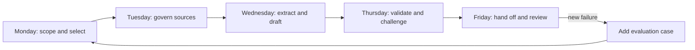

# Выпустите результат недельной работы, а не идеальный промпт

> Итоговый проект — это управляемый рабочий процесс принятия решений: источники поступают на вход, утверждения проверяются, полномочия остаются у человека, а состояние передаётся дальше.

**Тип:** Build
**Языки:** Python
**Предварительные требования:** [Выберите минимальную среду, способную выполнить работу](../../01-claude-product-and-model-landscape/), [Превратите запрос в проверяемый контракт](../../03-prompting-and-task-decomposition/), [Поместите каждый факт в подходящий вид контекста](../../04-context-knowledge-memory-and-caching/), [Проверяйте утверждение, а не уверенность](../../05-output-evaluation-and-validation/), [Ограничьте возможности рамками полномочий](../../06-governance-safety-and-responsible-use/), [Спроектируйте передачу работы до автоматизации](../../07-workflow-design-and-human-handoffs/)
**Время:** ~4 часа в течение одной смоделированной рабочей недели

## Цели обучения

- Объединить выбор продукта, создание промптов, управление знаниями, валидацию, управление, устранение неполадок и проектирование передачи работы.
- Создать еженедельный процесс подготовки обзора на основе источников с явными контрольными точками.
- Реализовать детерминированный валидатор на Python для проверки источников, утверждений, управления и готовности к передаче работы.
- Выполнить обычные сценарии и сценарии с ошибками, прежде чем рекомендовать выпуск.
- Предоставлять свидетельства готовности, а не заявлять о безопасности рабочего процесса.

## Задача

Вы руководите операционной деятельностью в Northstar Field Services — вымышленной компании с семью региональными командами. Каждую пятницу руководству нужен краткий обзор задержек в обслуживании, инцидентов, затронувших клиентов, исключений из правил и двух решений на следующую неделю.

Текущий процесс ненадёжен. Руководители регионов присылают обновления в разных форматах. Аналитик переносит факты в документ, согласует противоречивые даты и запрашивает одобрение у трёх человек. Иногда в итоговом обзоре отсутствует один из регионов или остаётся исправленное значение из старого сообщения.

Руководство просит вас «автоматизировать еженедельный отчёт с помощью Claude». Этот запрос сам по себе не является решением. Обзор влияет на распределение персонала и коммуникацию с клиентами. Некоторые входные данные содержат сведения о клиентах. Для исключений из правил требуется уполномоченный ответственный. Убедительно написанный черновик без доказательств может ускорить принятие неверного решения.

Ваша задача — спроектировать ограниченный рабочий процесс с поддержкой Claude. Claude может извлекать и сопоставлять данные, а также готовить черновик. Детерминированные проверки подтверждают точные свойства. За публикацию и решения со значимыми последствиями отвечает уполномоченный человек.

## Концепция

### Результат — это цепочка доказательств

Вы создадите пять связанных артефактов:

1. Описание сценария использования и запись о выборе продукта.
2. Актуализируемый реестр источников и фиксированный еженедельный снимок.
3. Поэтапный контракт промпта.
4. Результат валидации связей между утверждениями и доказательствами, а также требований управления.
5. Пакет для передачи работы человеку с резервным вариантом.



Каждый день завершается контрольной точкой. Если проверка не пройдена, не передавайте неопределённость на следующий этап.

### Возможности валидатора на Python намеренно ограничены

Код итогового проекта не вызывает Claude. Он демонстрирует важную архитектурную границу: точные свойства рабочего процесса следует проверять детерминированным кодом.

Валидатор проверяет следующее:

- В пакете присутствуют обязательные разделы.
- У каждого активного источника указаны владелец, уровень авторитетности, дата, конфиденциальность и стабильный идентификатор.
- Утверждения ссылаются на известные источники.
- Утверждения со значимыми последствиями опираются на прямые или расчётные доказательства.
- Устаревшие и противоречивые доказательства явно обозначены.
- Выбранная среда одобрена для соответствующего класса данных.
- Для действий с серьёзными последствиями или необратимых действий назначен уполномоченный ответственный.
- При передаче работы указаны решение, срок, резервный вариант и следующий ответственный.

Валидатор не может определить, достаточно ли этична политика, компетентен ли проверяющий и истинно ли утверждение источника. Это остаётся ответственностью организации и людей.

## Практическая реализация

## Интерактивная лабораторная работа

```figure
29-associate-capstone-readiness
```

Используйте панель готовности на протяжении всей пятидневной работы. Она связывает цель, источники, этапы промпта, обоснование утверждений, полномочия, передачу работы и резервный вариант, чтобы безупречно оформленный обзор не мог скрыть непройденную проверку.

## Практическая лабораторная работа

Выполните описанный ниже пятидневный рабочий процесс, а затем поочерёдно намеренно нарушьте проверки среды, источников, обоснованности утверждений, полномочий и передачи работы.

## Готовый артефакт

Практическими результатами служат подготовленный контрольный список и заполненный файл [`outputs/demo-readiness-report.json`](../outputs/demo-readiness-report.json).

## Проверка

Воспроизведите успешно прошедший проверку пакет и все тесты, сначала моделирующие ошибки, с помощью приведённых ниже команд; доступ к сети и учётные данные не требуются. Итоговой индивидуальной проверкой служит тест урока.

## Связь с итоговым проектом

Заполненный пакет — это подтверждающий материал итогового проекта для сертификационного маршрута Associate, который проверяет другой человек.

### Понедельник: определите рамки решения и среду продукта

Сформулируйте решение одним предложением:

```text
By Friday at 15:00, the operations director will choose no more than two
staffing or process changes for the following week using the approved regional snapshot.
```

Определите, что не входит в рамки задачи:

- Никаких автоматических сообщений клиентам.
- Никакого ранжирования эффективности сотрудников.
- Никаких изменений в графиках персонала.
- Никаких юридических или нормативных заключений.
- Никакого использования данных с ограниченным доступом.

Сравните возможные среды. Разовый чат прост в использовании, но плохо подходит для поддерживаемых инструкций и регулярно используемого набора источников. Project может подойти для совместной повторяющейся работы, если одобрены его текущие условия, средства управления тарифным планом и порядок обработки данных. API может подойти, когда требуются программная загрузка данных, валидация и интеграция с аудитом. Research полезен для получения актуальных внешних фактов, но не заменяет утверждённую внутреннюю политику.

Зафиксируйте не только название продукта, но и обоснование решения:

```text
Surface:
Why it fits:
Data class allowed:
Current terms checked on:
Unsupported requirements:
Fallback surface or manual path:
```

Контрольная точка: ответственный утверждает цель, среду, класс данных и запрещённые действия.

### Вторник: зафиксируйте доказательства и установите правила управления ими

Создайте реестр источников для следующих материалов:

- Семь региональных файлов состояния.
- Экспорт из системы регистрации инцидентов.
- Утверждённая политика обслуживания.
- Таблица доступной численности персонала.
- Протокол решений за предыдущую неделю.

Для каждого источника нужны стабильный идентификатор, владелец, класс авторитетности, дата вступления в силу, дата проверки и уровень конфиденциальности. Пометьте записи обсуждений как справочный материал, а не как политику. Удалите имена клиентов, если они не нужны для принятия решения.

Зафиксируйте снимок еженедельных источников в документально указанное время. Факт, изменившийся после этого момента, должен проходить через процесс внесения исправлений или обработки исключений. Иначе черновик, проверяющий и руководитель могут опираться на разные версии данных.

Определите порядок авторитетности:

```text
1. Approved service policy and signed incident status
2. Current regional status submitted before the cutoff
3. Prior decision record
4. Discussion notes, for leads only and never as sole support
```

Контрольная точка: представлены все семь регионов либо явно отмечено их отсутствие; источники прошли проверки актуальности и разрешений; для разрешения каждого противоречия назначен ответственный.

### Среда: декомпозируйте работу

Не запрашивайте итоговый обзор за один шаг. Используйте четыре ограниченных этапа.

**Этап 1, извлечение:** верните структурированные строки с регионом, задержкой, затронутой услугой, идентификатором инцидента, исключением из правил, идентификатором источника и неопределённостью. Не рекомендуйте никаких действий.

**Этап 2, согласование:** проверьте охват регионов, итоговые значения, повторяющиеся инциденты, противоречия в датах и поля без подтверждения. Остановитесь, если остаётся блокирующая проблема.

**Этап 3, анализ:** выявите закономерности и предложите не более трёх возможных действий. Для каждого действия нужны подтверждающие выводы, ограничения политики, вероятная польза, недостатки и ответственный, который может его одобрить.

**Этап 4, подготовка черновика:** создайте обзор для руководства, используя только прошедшие валидацию строки и утверждённые результаты анализа. Включите требуемые решения, доказательства, исключения и известную неопределённость.

Используйте контракт промпта для каждого этапа. Укажите иерархию источников, условия отказа от ответа, формат вывода и критерии приёмки. Сохраняйте версии, чтобы можно было воспроизвести неудачный результат.

Контрольная точка: структурированные извлечённые данные сверены со снимком до начала анализа.

### Четверг: проведите валидацию и критическую проверку

Запустите прилагаемый валидатор:

```bash
cd certifications/claude/lessons/29-associate-workflow-capstone
python3 code/main.py
```

Демонстрационный пакет должен вернуть статус `ready_for_human_review`. Теперь намеренно нарушьте его:

- Задайте для `approved_surface` значение false.
- Удалите владельца источника.
- Укажите идентификатор несуществующего источника.
- Пометьте утверждение со значимыми последствиями как предположение.
- Удалите ответственного за решение.
- Сделайте действие необратимым.

Запустите модульные тесты:

```bash
python3 -m unittest discover -s code/tests -v
```

Затем создайте матрицу «утверждение — доказательство» для фактического черновика. Ссылка должна подтверждать именно то утверждение, для которого она приведена. Проверяйте итоговые значения с помощью кода или электронной таблицы, а не модели-оценщика. Передайте отдельному проверяющему критерии оценки и доказательства. Попросите его сообщать о выявленных проблемах, а не незаметно переписывать черновик.

Используйте следующие уровни допуска к выпуску:

- **Блокировать:** неодобренные данные или среда, неизвестный источник, неверный итог, неподтверждённое утверждение со значимыми последствиями, отсутствие полномочий на принятие решения.
- **Доработать:** неполный охват, неразрешённое противоречие, устаревший источник, неясно обозначенная неопределённость.
- **Улучшить качество:** повторы, неудачный заголовок или некритичная проблема с тоном.

Контрольная точка: все блокирующие проблемы устранены. Оставшаяся неопределённость явно отражена в пакете для человека.

### Пятница: передайте работу и замкните цикл

Заполните [`outputs/checklist.md`](../outputs/checklist.md). Подготовьте пакет для проверки:

```text
Decision: Choose up to two next-week interventions.
Owner: Operations director.
Deadline: Friday 15:00.
Snapshot: Weekly source registry version and cutoff.
Candidate: Brief version and prompt version.
Evidence: Claim IDs, source IDs, calculations.
Checks: Passed, failed, and manually reviewed.
Uncertainty: Missing region, conflicting date, or weak support.
Options: Approve, revise, reject, escalate.
Fallback: Publish the manual template or delay with notice.
```

Директор утверждает решение, а не «ИИ». Зафиксируйте, кто и что утвердил и на основании какого снимка. Если после утверждения источник изменился, аннулируйте допуск к публикации и проверьте изменения.

После смоделированного выпуска проведите короткий ретроспективный анализ:

- Какой этап потребовал больше всего времени специалистов?
- Какая проверка выявила самый серьёзный дефект?
- Стало ли сложнее выносить какое-либо важное суждение?
- Для какого источника нужно лучше определить ответственность?
- Какой сбой следует добавить в набор для оценивания?
- Следует ли оставить рабочий процесс вспомогательным, перейти к ограниченной автоматизации или вернуться к ручному выполнению?

## Применение

### Полный пакет доказательств

Предоставляемые материалы должны содержать:

- Запись о выборе среды с датой проверки.
- Реестр из десяти источников либо его сокращённый эквивалент, в котором представлен каждый обязательный класс источников.
- Четыре контракта для этапов промпта.
- Не менее десяти сценариев оценивания: четыре обычных, три пограничных, три управленческих или состязательных.
- Матрицу «утверждение — доказательство» для каждого утверждения со значимыми последствиями.
- Вывод валидатора для одного успешно прошедшего и трёх не прошедших проверку пакетов.
- Вывод успешно выполненных модульных тестов.
- Заполненный контрольный список передачи работы человеку.
- Ретроспективный анализ объёмом в одну страницу с одним конкретным изменением рабочего процесса.

### Принципы принятия решений в итоговом проекте

Используйте эти принципы при проверке своей работы или ответе на экзаменационные сценарии:

1. **Нет утверждённой цели — остановитесь.** Наличие возможностей не создаёт разрешения.
2. **Нет авторитетных доказательств — воздержитесь от ответа или эскалируйте.** Дополнительные промпты не создают источник.
3. **Точное свойство — детерминированная проверка.** Итоговые значения и схемы не требуют субъективного оценивания.
4. **Серьёзные последствия — полномочия у человека.** Предоставьте человеку доказательства и право отклонить решение.
5. **Повторяющийся сбой — исправьте систему.** Добавьте сценарий, средство контроля или правило для источников.
6. **Изменяемый факт о продукте — проверяйте актуальные сведения.** Зафиксируйте среду, дату и источник.

### Распространённые ошибки

- **Начинать с итогового промпта:** проблемы с рамками задачи и источниками превращаются в проблемы текста.
- **Загружать весь архив:** устаревшие доказательства начинают конкурировать с действующей политикой.
- **Доверять синтаксису ссылок:** указанный источник может не подтверждать утверждение.
- **Заставлять проверяющего заново восстанавливать состояние:** время на передачу работы сводит на нет обещанную экономию.
- **В первую очередь автоматизировать публикацию:** обратимость и полномочия остаются без внимания.
- **Считать тесты доказательством безопасности:** модульные тесты охватывают реализованные правила, а не фактическое положение дел в организации.
- **Жёстко закреплять в проекте текущие сведения о продукте:** условия, возможности, модели, стоимость и ограничения меняются.

### Упражнения

1. Замените вымышленный сценарий одной реальной повторяющейся задачей, сохранив пятидневные контрольные точки.
2. Добавьте в валидатор правило для политики, характерной только для вашего рабочего процесса.
3. Напишите не проходящий тест до реализации этого правила.
4. Сравните один огромный промпт с четырёхэтапным процессом на одних и тех же десяти сценариях.
5. Попросите проверяющего выполнить передачу работы, используя только ваш пакет. Зафиксируйте каждый факт, который ему пришлось запросить.
6. Рассчитайте стоимость одного принятого обзора с учётом времени на проверку и доработку.

## Ключевые термины

- **Рабочий процесс принятия решений:** последовательность действий, которая преобразует управляемые доказательства в проверенное действие или рекомендацию.
- **Снимок источников:** фиксированный версионируемый набор доказательств, используемый для одного запуска.
- **Утверждение со значимыми последствиями:** утверждение, которое существенно влияет на решение или действие.
- **Пакет валидации:** структурированные источники, утверждения, параметры управления и состояние передачи работы, проверяемые перед выпуском.
- **Уровень допуска к выпуску:** статус блокировки, доработки или качества, определяемый последствиями.
- **Ответственный за решение:** человек, наделённый полномочиями и несущий ответственность за окончательный выбор.
- **Проверка изменений:** повторная валидация изменений, внесённых после предыдущего утверждения.
- **Свидетельства готовности:** результаты тестов, сценарии с ошибками, утверждения и подтверждение наличия резервного варианта, а не общее заверение.

## Дополнительные материалы

- [Руководство по экзамену Claude Certified Associate Foundations](https://everpath-course-content.s3-accelerate.amazonaws.com/instructor%2F6nizmqk8tpzpfjvt6qmmav7rh%2Fpublic%2F1783542847%2FClaude+Certified+Associate+%E2%80%93+Foundations+Exam+Guide.pdf)
- [Anthropic: создание эффективных агентов](https://www.anthropic.com/research/building-effective-agents)
- [Anthropic: определение критериев успеха и создание оценок](https://platform.claude.com/docs/en/test-and-evaluate/develop-tests)
- [Anthropic: API и хранение данных](https://platform.claude.com/docs/en/manage-claude/api-and-data-retention)
- [AI Engineering from Scratch: контракты рамок задачи](../../../../../phases/14-agent-engineering/36-scope-contracts/)
- [AI Engineering from Scratch: контрольные точки верификации](../../../../../phases/14-agent-engineering/38-verification-gates/)
- [AI Engineering from Scratch: передача работы между сессиями](../../../../../phases/14-agent-engineering/40-multi-session-handoff/)

Официальная спецификация экзамена и поведение продуктов Claude могут измениться. Этот итоговый проект соответствует руководству, действующему с июля 2026 года, и источникам, проверенным 2026-08-08. Прежде чем полагаться на сведения, относящиеся к конкретному выпуску, проверьте актуальные руководство, условия использования продуктов, модели, ограничения и средства управления.
