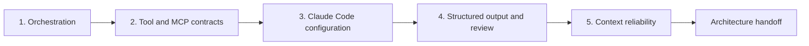

# Защитите одну архитектуру в шести контекстах

> Архитектура — это набор границ, которые сохраняются, когда меняется сценарий, отказывает инструмент, а доказательства остаются неполными.

**Тип:** Build
**Языки:** Python
**Предварительные требования:** [Оркестрация нескольких агентов и делегирование](../../16-multi-agent-orchestration-and-delegation/), [Контракты инструментов, ошибки и прогрессивное обнаружение](../../18-tool-contracts-errors-and-progressive-discovery/), [Память, правила, Skills и CI в Claude Code](../../19-claude-code-memory-rules-skills-and-ci/), [Надёжное извлечение, пакетная обработка и независимые рецензенты](../../20-reliable-extraction-batch-and-reviewers/), [Сделайте большой контекст наблюдаемым](../../21-long-context-reliability-provenance-and-escalation/)
**Время:** ~6 часов в течение двух сосредоточенных сессий

## Цели обучения

- Защищать архитектурные решения во всех пяти областях CCAR-F.
- Адаптировать единый метод принятия решений к шести общедоступным контекстам сценариев, не заучивая одну топологию.
- Реализовывать детерминированные проверки оркестрации, инструментов, Claude Code, структурированного вывода и надёжности контекста.
- Создавать наборы отказов, проверяющие частичные результаты, устаревшее состояние, небезопасные инструменты и недопустимый вывод.
- Подготовить пакет архитектурных материалов для рецензента с явным описанием компромиссов и эскалации.

## Задача

Архитектор готовит шесть диаграмм для шести ожидаемых вариантов использования. В диаграмме поддержки используется цикл агента. В диаграмме работы с кодом используется Claude Code. В диаграмме исследования есть субагенты. В диаграмме извлечения используется JSON.

Во время рецензирования архитектор не может объяснить, почему один шаг выполняется инструментом, а другой — субагентом. На диаграммах отсутствуют семантика повторных попыток, область действия конфигурации, частичные результаты, версии источников и полномочия человека. Каждый проект работает только при благоприятном развитии событий.

Вопросы по архитектуре на основе сценариев проверяют способность переносить знания. Названия и бизнес-детали меняются, но одни и те же решения повторяются:

- Какая последовательность детерминирована, а какой выбор требует рассуждения модели?
- Какому контексту должна принадлежать каждая задача?
- Какие инструменты видимы, разрешены и допускают повторный вызов?
- Где должны находиться общие рекомендации для Claude Code?
- Как типизированный результат становится семантически обоснованным и подтверждённым доказательствами?
- Какое состояние сохраняется после сбоя, сжатия контекста, возобновления работы и передачи человеку?

В этом итоговом проекте создаётся единый метод проектирования архитектуры, который применяется ко всем шести общедоступным контекстам.

## Концепция

### Шесть контекстов — это призмы, а не шаблоны

В общедоступном руководстве CCAR-F за июль 2026 года названы следующие контексты сценариев:

1. Агент для решения обращений в службу поддержки.
2. Генерация кода с помощью Claude Code.
3. Исследование с несколькими агентами.
4. Повышение продуктивности разработчиков с помощью Claude.
5. Claude Code для CI/CD.
6. Извлечение структурированных данных.

Этот курс не воспроизводит экзаменационные сценарии. Вы создадите оригинальную систему Cedar Bridge для вымышленной компании, разрабатывающей программное обеспечение и оказывающей услуги. Каждая призма подвергает нагрузке отдельную часть одной и той же архитектуры.

| Призма | Оригинальная задача Cedar Bridge | Основной отказ, который нужно учесть при проектировании |
|---|---|---|
| Поддержка | Подготовить проект решения на основе действующей политики и материалов обращения | Несанкционированное действие или устаревшая политика |
| Генерация кода | Исправить парсер запросов в монорепозитории | Слишком широкая область изменений или отсутствие контракта между файлами |
| Исследование | Сравнить три подхода к миграции | Дублирование работы, конфликты или неполные источники |
| Продуктивность разработчиков | Преобразовать утверждённое решение в ADR и план задач | Устаревшее состояние беседы или скрытая локальная конфигурация |
| CI/CD | Проверить запрос на слияние из чистой рабочей копии | Неограниченные разрешения или невоспроизводимые замечания |
| Извлечение | Нормализовать уведомления об изменениях в записи | Корректная схема с выдуманными или неподтверждёнными значениями |

Вам не нужны шесть не связанных друг с другом платформ. Нужны базовая архитектура и явно заданные точки вариативности.

### Используйте пятиэтапную систему принятия решений



#### Этап 1. Агентная архитектура и оркестрация

Определите задачи, предварительные условия, границы контекста, разрешённые инструменты, состояния полного или частичного выполнения и правила объединения. Используйте код для фиксированного порядка действий, а рассуждение модели — для семантического выбора. Для использования субагента нужна причина: изоляция, специализация, независимая проверка или безопасное распараллеливание.

В сценарии поддержки исследователь политик и аналитик обращения после его регистрации могут работать независимо. Проект решения зависит от результатов их обоих. Утверждённый исполнитель находится за отдельной границей полномочий и не входит в цикл подготовки рекомендаций, доступный только для чтения.

В исследовании распараллеливайте работу по непересекающимся вопросам и объединяйте результаты по идентификаторам утверждений. При работе с кодом используйте манифест и ограниченных по области исследователей, а не поручайте каждому агенту весь репозиторий.

#### Этап 2. Проектирование инструментов и интеграция MCP

Каждому инструменту нужны одно действие и один объект, положительные и отрицательные указания по выбору, закрытая схема, область разрешений, объявление побочных эффектов и контракт структурированных ошибок. Инструменту записи необходимы актуальная авторизация, идемпотентность и сверка результатов.

Используйте ресурсы MCP для контекстных данных, инструменты — для действий по запросу модели, а промпты — для многократно используемых шаблонов, вызываемых пользователем. Прогрессивное обнаружение уменьшает размер каталога, но должно сохранять область доступа.

Для проверки в CI должно быть достаточно интерфейсов чтения, поиска и тестирования. Не предоставляйте разрешение на развёртывание в рабочей среде лишь потому, что рабочий процесс выполняется в конвейере.

#### Этап 3. Конфигурация и рабочие процессы Claude Code

Храните рекомендации проекта краткими, версионируемыми и общими. Требования к конкретным файлам размещайте в правилах для путей. Оформляйте повторно используемые методы как Skills, а явно запускаемые пользователем рабочие процессы — как команды. Используйте хуки для детерминированного контроля области действий и команд.

Составляйте план до внесения масштабных изменений. Исследуйте систему в изолированных контекстах с доступом только для чтения. CI начинает работу с чистого коммита, объявленными настройками, ограниченным набором инструментов, структурированными замечаниями и детерминированными тестами. Он не возобновляет интерактивную сессию разработчика.

#### Этап 4. Проектирование промптов и структурированный вывод

Определите критерии оценивания до формулировки промпта. Для неоднозначных суждений используйте граничные примеры. Предусмотрите возможность представления неизвестных значений. Применяйте схемы там, где они поддерживаются, а затем проверяйте синтаксис, схему, семантику и происхождение данных.

Ограничивайте количество повторных попыток и передавайте в ответ минимальную полезную ошибку валидации. Разделяйте контексты генератора и рецензента. Пакетная обработка подходит для асинхронных независимых элементов, но не для адаптивного цикла инструментов, которому необходимо учитывать промежуточные результаты.

#### Этап 5. Управление контекстом и надёжность

Чётко располагайте жёсткие ограничения и текущий вопрос. Извлекайте минимальный релевантный фрагмент доказательств вместе с метаданными источника. Сокращайте журналы, не удаляя сведения об отказах или покрытии. Сохраняйте манифесты и побочные эффекты вне беседы. Передавайте состояния полного, частичного выполнения и блокировки.

Уверенность определяется классом доказательств, покрытием, конфликтами, новизной и измеренными ошибками. Проверка человеком разделяется по последствиям и неопределённости и дополняется случайной выборкой обычных успешных результатов.

### Качество архитектуры проявляется при отказах

Диаграмма показывает компоненты. Пакет сценария показывает поведение системы под нагрузкой:

- Один источник превышает время ожидания после возврата корректных частичных результатов.
- Инструмент сообщает о конфликте, при котором нельзя бездумно повторять попытку.
- Субагент нарушает схему результатов.
- CI получает скрытую локальную инструкцию, отсутствующую в репозитории.
- Запись извлечения представляет собой корректный JSON, но ссылается на неверную версию.
- Возобновлённая сессия содержит устаревший план после изменения ветки.
- Две утверждённые политики противоречат друг другу, а правило приоритета отсутствует.

Для каждого отказа укажите способы обнаружения и локализации, повторную попытку или эскалацию, долговременное состояние и ответственного человека.

## Практическая работа

## Интерактивная лабораторная работа

```figure
31-architect-foundation-readiness
```

Используйте матрицу готовности, чтобы проверить все пять этапов архитектуры через призму шести сценариев. Измените инвариант инструмента, конфигурации, валидации или контекста и проследите, какие сценарии будут заблокированы, вместо того чтобы полагаться на единственную топологию.

## Практическая лабораторная работа

Запустите по одному набору отказов для каждой области архитектуры и опишите межсценарное изменение, которое устраняет проблему, не ослабляя общий инвариант.

## Готовый артефакт

Практическими результатами являются пакет архитектурных материалов и заполненный файл [`outputs/demo-readiness-report.json`](../outputs/demo-readiness-report.json).

## Проверка

Воспроизведите отчёт и запустите ориентированные на отказы тесты с помощью приведённых ниже команд. Тест урока проверяет отдельные решения по переносу знаний.

## Связь с итоговым проектом

Заполненный пакет, межсценарные изменения, ADR и независимая проверка образуют итоговую работу Architect Foundations.

### Шаг 1. Выберите одну основную призму

Выберите одну призму Cedar Bridge или замените её собственным оригинальным сценарием. Запишите:

```text
Decision supported:
Users and affected people:
Input sources and sensitivity:
Allowed actions:
Prohibited actions:
Latency and volume:
Failure consequence:
Human authority:
```

Не начинайте с фразы «использовать многоагентную систему». Начните с решения и границ.

### Шаг 2. Заполните пакет архитектурных материалов

Скопируйте [`outputs/architecture-packet.md`](../outputs/architecture-packet.md). Заполните раздел каждой области. Пакет должен содержать:

- Контекст и то, что не является целью.
- Граф зависимостей задач и состояния результатов.
- Матрицу возможностей ролей и инструментов.
- Контракты инструментов и MCP со структурированными ошибками.
- Решения об инструкциях, правилах, Skill, командах, хуках и CI для Claude Code.
- Контракт промпта, схему, валидаторы, ограничение повторных попыток и независимую проверку.
- Бюджет контекста, манифест, происхождение данных, эскалацию и проверку человеком.
- Угрозы, альтернативы, ввод в эксплуатацию и восстановление.

### Шаг 3. Представьте пакет в формате JSON

Используйте структуру, показанную во включённом Python-валидаторе. Валидатор намеренно проверяет архитектурные инварианты, а не качество текста.

Запустите корректный пример:

```bash
cd certifications/claude/lessons/31-architect-foundations-scenario-capstone
python3 code/main.py
```

Затем сохраните свой пакет и выполните:

```bash
python3 code/main.py --input outputs/my-scenario.json
```

Программа проверяет:

- Наличие обязательных разделов и известный контекст сценария.
- Уникальность задач, известные предварительные условия, ацикличность зависимостей и распределение инструментов.
- Границы выбора инструментов, структурированные ошибки, авторизацию и идемпотентность.
- Общие рекомендации для Claude Code, правила с ограниченной областью действия и новую структурированную проверку в CI.
- Четыре уровня валидации, ограниченное число повторных попыток, неизвестные состояния и разделение рецензентов.
- Поля происхождения данных, состояния результатов, причины эскалации и стратифицированную проверку.
- Полный пакет передачи архитектуры.

Она не может доказать, что модель всегда сделает правильный выбор, политика действительна или ответственный сотрудник обладает необходимой квалификацией. Добавьте оценивание для конкретного сценария и организационную проверку.

### Шаг 4. Запустите тесты, ориентированные на отказы

Выполните:

```bash
python3 -m unittest discover -s code/tests -v
```

Создайте хотя бы по одному дополнительному набору данных для каждой области:

| Область | Внесённый отказ | Ожидаемое решение |
|---|---|---|
| Оркестрация | Циклическая зависимость или отсутствие частичного состояния | Заблокировать |
| Инструменты и MCP | Инструмент записи не обладает идемпотентностью | Заблокировать |
| Claude Code | CI наследует интерактивное состояние | Заблокировать |
| Структурированный вывод | Схема пройдена, но уровень происхождения данных отсутствует | Заблокировать |
| Надёжность | Для конфликта политик отсутствует путь эскалации | Заблокировать |

Не ослабляйте валидатор, чтобы неисправный пакет прошёл проверку. Исправьте проект или объясните, почему инвариант неприменим, и замените его эквивалентной мерой контроля.

### Шаг 5. Перенесите архитектуру на все шесть призм

Для каждого оставшегося контекста опишите изменение на одной странице:

```text
What remains unchanged:
New source or authority boundary:
New tool or MCP requirement:
New Claude Code configuration requirement:
New validation or output requirement:
New context or escalation risk:
Control removed and why:
Control added and why:
```

Примеры допустимых изменений:

- Для поддержки добавляются контроль актуальности политики и утверждение до возврата средств.
- Для генерации кода добавляются область репозитория, правила для путей и тесты.
- Для исследования добавляются объединение на уровне утверждений и сохранение конфликтов источников.
- Для повышения продуктивности разработчиков добавляются краткая иерархия памяти проекта и явные команды.
- Для CI/CD добавляются неинтерактивная проверка из чистого состояния и разрешения только на чтение.
- Для извлечения добавляются допускающие null неизвестные значения, диапазоны доказательств и сверка пакета.

Основные требования к происхождению данных, ошибкам, ограниченным полномочиям и проверке должны сохраняться для каждой призмы.

### Шаг 6. Обоснуйте компромиссы

Составьте три записи об архитектурных решениях:

1. Один агент или координатор и субагенты.
2. Непосредственный каталог инструментов или MCP и прогрессивное обнаружение.
3. Интерактивная обработка или асинхронная пакетная обработка.

Для каждой записи укажите контекст, выбранный вариант, отклонённые альтернативы, последствия, доказательства, условие пересмотра и владельца. ADR — это не предпочтение продукта. Такая запись объясняет, почему выбор подходит для данного сценария.

### Шаг 7. Проведите независимую проверку

Передайте новому рецензенту пакет, вывод валидатора, наборы угроз и рубрику оценивания. Не передавайте убедительно сформулированную стенограмму обсуждения проекта. Требуйте, чтобы замечания содержали стабильные идентификаторы, затронутую область, доказательства, степень серьёзности и необходимое исправление.

Затем архитектор устраняет указанную в каждом замечании проблему либо отклоняет замечание, приводя доказательства. Снова запустите детерминированную валидацию и сохраните окончательный пакет передачи.

## Применение

### Метод работы с экзаменационным сценарием

При чтении сценария:

1. Запишите последствия, доказательства и границу полномочий.
2. Изобразите детерминированные предварительные условия до выбора агентов.
3. Предоставьте каждой роли минимально необходимый набор инструментов.
4. Отделите общую конфигурацию от локального контекста пользователя.
5. Отличайте структурную корректность от семантической корректности и корректности происхождения данных.
6. Передавайте частичные результаты и эскалируйте пробелы, для которых повторные попытки невозможны.
7. Выбирайте минимальную архитектуру, сохраняющую все необходимые инварианты.

Не выбирайте вариант лишь потому, что в нём упомянуто больше возможностей Claude. Выбирайте меру контроля, которая устраняет указанный отказ, не создавая более серьёзного.

### Материалы для сдачи

Полная итоговая работа содержит:

- Один заполненный основной пакет архитектурных материалов.
- Один корректный пакет JSON и вывод валидатора.
- Пять страниц с межсценарными изменениями.
- Не менее пяти добавленных наборов отказов — по одному на область.
- Три ADR с отклонёнными альтернативами.
- Замечания независимого рецензента и решения по ним.
- Вывод успешно пройденных тестов.
- Одно заявление об остаточном риске и ответственности человека.

### Распространённые ошибки

- **Сначала топология:** агенты выбираются до определения требований и зависимостей.
- **Субагент как функция:** детерминированные утилиты без необходимости получают отдельные контексты рассуждения.
- **Описание инструмента как авторизация:*** естественный язык заменяет принудительное применение правил на уровне сервиса.
- **Личная конфигурация как политика команды:** CI и коллеги не могут воспроизвести поведение.
- **Схема как истина:** неподтверждённые значения проходят проверку типов.
- **Возобновление как восстановление:** устаревшая беседа заменяет сверку с внешним состоянием.
- **Отдельный проект для каждого названия сценария:** общие архитектурные принципы не переносятся.
- **Насыщенность возможностями как показатель зрелости архитектуры:** дополнительные компоненты увеличивают затраты, но не закрывают сценарий отказа.

### Упражнения

1. Удалите одного субагента из своего проекта и определите, изменится ли качество.
2. Замените инструмент действия ресурсом MCP там, где модели нужен только контекст.
3. Перенесите одну глобальную инструкцию в протестированное правило для пути.
4. Добавьте семантический валидатор, который обнаруживает ложное утверждение, соответствующее схеме.
5. Сожмите длинную сессию в пакет возобновления и докажите, что внешнее состояние по-прежнему имеет приоритет.
6. Обменяйтесь пакетами архитектурных материалов с другим учащимся и запустите наборы отказов друг друга.

## Ключевые термины

- **Призма сценария (scenario lens):** бизнес-контекст, используемый для стресс-тестирования общих архитектурных решений.
- **Точка вариативности (variation point):** компонент или политика, которые должны меняться в зависимости от сценария, в то время как основные инварианты сохраняются.
- **Матрица возможностей (capability matrix):** сопоставление ролей с разрешёнными инструментами, данными и действиями.
- **Архитектурный инвариант (architecture invariant):** условие, которое должно выполняться для всех компонентов и отказов.
- **Набор отказов (failure fixture):** контролируемый сценарий, подтверждающий работу механизмов обнаружения и восстановления.
- **Межсценарное изменение (cross-scenario delta):** явно заданное изменение, необходимое для адаптации одной архитектуры к другому контексту.
- **Остаточный риск (residual risk):** известный риск, остающийся после применения мер контроля, с указанием владельца и решения.
- **Передача архитектуры (architecture handoff):** пакет решений, доказательств, мер контроля, пробелов и дальнейших зон ответственности, необходимый для безопасной реализации.

## Дополнительные материалы

- [Claude Certified Architect Foundations Exam Guide](https://everpath-course-content.s3-accelerate.amazonaws.com/instructor%2F6nizmqk8tpzpfjvt6qmmav7rh%2Fpublic%2F1783542750%2FClaude+Certified+Architect+%E2%80%93+Foundations+Exam+Guide.pdf)
- [Anthropic: создание эффективных агентов](https://www.anthropic.com/research/building-effective-agents)
- [Anthropic: Claude Agent SDK](https://platform.claude.com/docs/en/agent-sdk/overview)
- [Anthropic: использование инструментов](https://platform.claude.com/docs/en/agents-and-tools/tool-use/overview)
- [Спецификация Model Context Protocol](https://modelcontextprotocol.io/specification/latest)
- [Anthropic: структурированный вывод](https://platform.claude.com/docs/en/build-with-claude/structured-outputs)
- [AI Engineering from Scratch: паттерны оркестрации](../../../../../phases/14-agent-engineering/28-orchestration-patterns/)
- [AI Engineering from Scratch: долговременное выполнение](../../../../../phases/15-autonomous-systems/12-durable-execution/)
- [AI Engineering from Scratch: агент-рецензент](../../../../../phases/14-agent-engineering/39-reviewer-agent/)

Поведение Agent SDK, Claude Code, API, MCP, контекста, модели и пакетной обработки может изменяться. Общедоступная спецификация экзамена и справочные материалы были проверены 2026-08-08. Перед фиксацией деталей реализации сверьтесь с актуальной официальной документацией и конкретной средой выполнения.
