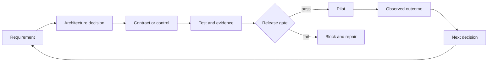

# Итоговый проект по системе Architect Professional

> Создайте пакет доказательств, позволяющий обосновать производственную архитектуру.

**Тип:** Build
**Языки:** Python
**Предварительные требования:** [Выберите наименьшую поверхность, достаточную для выполнения работы](../../01-claude-product-and-model-landscape/), [Используйте более широкие возможности там, где сбой обходится дорого](../../02-model-selection-and-token-economics/), [Превратите запрос в проверяемый контракт](../../03-prompting-and-task-decomposition/), [Помещайте каждый факт в контекст подходящего типа](../../04-context-knowledge-memory-and-caching/), [Проверяйте утверждение, а не уверенность](../../05-output-evaluation-and-validation/), [Ограничивайте полномочиями доступ к возможностям](../../06-governance-safety-and-responsible-use/), [Messages API — это конечный автомат](../../08-messages-api-and-application-lifecycle/), [Структурированный вывод — это ненадёжный контракт](../../09-structured-output-and-defensive-parsing/), [Цикл использования инструментов — это контролируемое делегирование](../../10-tool-use-and-agentic-loops/), [MCP отделяет возможности от хоста](../../11-mcp-server-design-and-integration/), [Agent SDK — это каркас, а не разрешение](../../12-claude-agent-sdk-and-hooks/), [Безопасность находится за пределами промпта](../../13-application-security-and-secrets/), [Оценивания превращают поведение агента в инженерные доказательства](../../14-evals-testing-debugging-and-observability/), [Claude Code масштабируется благодаря общим ограничениям](../../15-claude-code-for-development-teams/), [Оркестрация нескольких агентов и делегирование](../../16-multi-agent-orchestration-and-delegation/), [Контракты инструментов, ошибки и последовательное обнаружение](../../18-tool-contracts-errors-and-progressive-discovery/), [Исследование бизнеса, требования и SLA](../../22-business-discovery-requirements-and-slas/), [Сквозная архитектура и компромиссы ценности](../../23-end-to-end-architecture-and-value-tradeoffs/), [RAG, поиск и конвейеры данных](../../24-rag-retrieval-and-data-pipelines/), [Протоколы интеграции, идентификация и принцип наименьших привилегий](../../25-integration-protocols-identity-and-least-privilege/), [Производственная наблюдаемость, задержка и стоимость](../../26-production-observability-latency-and-cost/), [Корпоративное управление, соответствие требованиям и проверка человеком](../../27-enterprise-governance-compliance-and-hitl/), [Взаимодействие с заинтересованными сторонами, ADR и ответственность за жизненный цикл](../../28-stakeholder-communication-adrs-and-lifecycle/)
**Время:** ~8–12 часов

## Цели обучения

- Подготовить архитектуру производственной системы Claude от исследования до эксплуатации
- Обосновать решения по архитектурному паттерну, модели, контексту, RAG, интеграции и мерам контроля
- Подтвердить качество, задержку, стоимость, безопасность и защищённость с помощью явных шлюзов
- Сформировать пакет материалов по управлению, развёртыванию, инструкциям по эксплуатации и ответственности за жизненный цикл
- Представить одно и то же решение руководителям, инженерам, специалистам по контролю и эксплуатации

## Задача

Спроектируйте управляемую корпоративную систему решения обращений в службу поддержки для компании, работающей
в нескольких регионах.

Сейчас команда обрабатывает 40,000 обращений в неделю. Большая часть обращений
связана с оплатой и доставкой. Медианное время первого ответа составляет 11 минут. Изменения политик
еженедельно появляются в документах и внутренних системах. Проверки выявляют непоследовательное
цитирование источников, а ранее автоматизированная система оформляла возвраты средств сверх полномочий сотрудников.

Предлагаемая система может классифицировать обращения, находить актуальные политики, читать ограниченный
контекст учётной записи, составлять проекты ответов и рекомендовать действия. Она не должна удалять
учётные записи. Для выполнения возврата средств требуются явные полномочия и новое подтверждение человеком.
Компания ожидает поэтапного развёртывания, измеримого качества, обработки данных с учётом региона
и передачи системы команде платформы поддержки для эксплуатации.

От вас не требуется максимизировать автономность. Нужно спроектировать наилучшую систему
с учётом ограничений и доказать её готовность.

## Обязательные результаты

Используйте шаблон `outputs/architecture-packet-template.md`. Ваш пакет должен
содержать десять взаимосвязанных артефактов.

### 1. Краткий отчёт об исследовании

Определите результат, исходные показатели, цель, защитные ограничения, пользователей, текущий рабочий процесс, данные,
полномочия, допущения и то, что не входит в цели.

Как минимум разграничьте:

- время первого ответа и полное время решения обращения
- техническое завершение системой и успешное выполнение задачи согласно политикам
- рекомендацию и полномочия на выполнение
- внутреннюю цель и договорное обязательство
- известные факты и оценки

### 2. Варианты архитектуры и ADR

Сравните как минимум:

1. подготовку проектов ответов с поиском релевантных данных и полной проверкой человеком
2. детерминированный рабочий процесс с ограниченными этапами модели
3. адаптивного агента, использующего инструменты

Выберите один вариант. Зафиксируйте доказательства, последствия, отклонённые альтернативы и
условие пересмотра решения. Если вы используете несколько агентов, обоснуйте каждую границу контекста или
независимого проверяющего. Большее число компонентов не повышает оценку.

### 3. Сквозные представления системы

Создайте диаграммы Mermaid для следующих аспектов:

- контекст системы
- поток данных и идентификационных сведений
- одна последовательность обработки обычного обращения
- одна последовательность обработки высокорискового возврата средств
- развёртывание и зоны ответственности
- путь сбоя и частичного результата

Для каждого внешнего соединения должны быть указаны схема, идентификационные сведения, тайм-аут, повторная попытка, доказательства и
ответственный.

### 4. План моделей, промптов и контекста

Определите классы задач и критерии выбора модели для каждого из них. Учтите требования к качеству,
задержке, стоимости, контексту и рассуждению. Не фиксируйте сведения о продуктах
без даты проверки.

Спроектируйте:

- границы системных и пользовательских инструкций
- примеры с несколькими демонстрациями (few-shot) там, где требуется единообразие суждений
- стабильный префикс и план кеширования промптов
- сокращение и уплотнение контекста
- структурированный вывод и семантическую валидацию
- версионирование промптов и моделей

### 5. Проектирование знаний и RAG

Определите ответственных за источники, синтаксический разбор, форму фрагментов, метаданные, разреженный или плотный
поиск, фильтры, повторное ранжирование, сборку контекста, происхождение данных, конфликты источников,
актуальность, активацию версий и откат.

Создайте оценивание поиска с обычными, неоднозначными, устаревшими, неавторизованными и
состязательными случаями. Оценивайте поиск отдельно от качества ответа.

### 6. Проектирование интеграции и идентификации

Выбирайте границы прямого API, CLI, MCP или взаимодействия между агентами исходя из требований.
Применяйте принцип наименьших привилегий к обнаружению инструментов, схемам, учётным данным и действиям.

Спроектируйте механизм получения нового подтверждения для возвратов средств. Свяжите подтверждение с субъектом, суммой, учётной записью,
причиной, сроком действия и однократным использованием. Определите структурированные ошибки для валидации,
авторизации, конфликтов, ограничений частоты запросов, зависимостей и тайм-аутов.

### 7. Оценивание и производственные доказательства

Создайте репрезентативный эталонный набор и план оценивания со смешанными методами.

Включите:

- полноту поиска и актуальность
- подтверждённость утверждений и охват цитирования
- соблюдение политик и полноту
- траекторию вызовов инструментов и авторизации
- предотвращение небезопасных действий
- задержку P50 и P95
- стоимость одной принятой задачи
- согласованность проверяющих и затрачиваемое ими время
- страты высокого риска, а также региональные или языковые страты

Сравните исходный вариант с предлагаемой системой. Определите жёсткие шлюзы, результаты которых нельзя
нивелировать усреднением.

### 8. Управление и проверка человеком

Подготовьте реестр рисков, карту данных, матрицу мер контроля, схему проверки, план обеспечения справедливости,
порядок оспаривания, план доказательств для инцидентов и триггеры существенных изменений.

Укажите, какие вопросы требуют согласования со специалистами по безопасности, конфиденциальности, праву, соблюдению требований, финансам или
предметной области. Не заявляйте о соблюдении законодательства от имени этих ответственных лиц.

### 9. Развёртывание и эксплуатация

Спланируйте теневой режим, канареечное развёртывание, контролируемое расширение, откат, панели мониторинга, оповещения, инструкции по эксплуатации,
мощности, отказы зависимостей и поведение очереди проверяющих.

Для каждого оповещения должны быть определены ответственный и действие. Для каждой производственной версии должен существовать проверенный безопасный
вариант отката. Проведите командное моделирование инцидентов для устаревшей политики, недоступности авторизации, инъекции промпта
через обращение и дрейфа оценщика.

### 10. Пакет для заинтересованных сторон и передачи системы

Подготовьте:

- одностраничную аналитическую записку для руководства
- рабочий процесс продукта и план его внедрения
- индекс инженерных контрактов
- сводку мер контроля безопасности и конфиденциальности
- контрольный список готовности к эксплуатации и передаче системы

До приёмки принимающая команда должна продемонстрировать мониторинг, безопасное отключение, откат,
оценивание и эскалацию инцидентов.

## Метод архитектурного проектирования

Используйте единую цепочку доказательств во всём пакете.



Если компонент нельзя связать с требованием, подумайте, действительно ли он необходим.
Если для требования нет меры контроля или теста, архитектура неполна. Если
тест не влияет на выпуск, это всего лишь отчёт.

## Практическая реализация

## Интерактивная лабораторная работа

```figure
32-architect-professional-readiness
```

Используйте панель профессиональной готовности, чтобы связать требования с решениями,
мерами контроля, доказательствами, шлюзами выпуска, результатами пилотного проекта и ответственными за жизненный цикл. Критические
сбои авторизации, безопасности и отката остаются видимыми независимо от
взвешенной оценки готовности.

## Практическая лабораторная работа

Проверьте архитектуру поддержки с одним невыполненным требованием, одной непроверенной жёсткой
мерой контроля, одним непройденным шлюзом оценивания и одной тренировкой отката, исправляя каждую проблему на границе ответственности
соответствующего владельца.

## Готовый артефакт

Шаблон пакета, заполненный
[`outputs/reference-architecture-packet.md`](../outputs/reference-architecture-packet.md),
заполненный [`outputs/demo-readiness-report.json`](../outputs/demo-readiness-report.json)
и [`outputs/scored-rubric.md`](../outputs/scored-rubric.md) — это практические
результаты. Выпуск оценённого эталонного варианта в производство остаётся заблокированным,
пока не будет пройден указанный для него действующий жёсткий шлюз и не будут приняты доказательства передачи системы.

## Проверка

Лабораторная работа на Python проверяет структуру пакета архитектурных материалов. Она не
оценивает правильность вашего бизнес-решения. Она выявляет более базовый класс
проблем: отсутствие ответственных, неизмеримые требования, непроверенные жёсткие меры контроля,
непройденные шлюзы оценивания, отсутствие отката и решения без условия пересмотра.

```bash
cd certifications/claude/lessons/32-architect-professional-system-capstone/code
python3 main.py
python3 -m unittest discover tests -v
```

### Шаг 1. Закодируйте требования

Каждый `Requirement` содержит категорию, проверяемую формулировку, признак измеримости и
ответственного. В своём пакете замените этот признак явным контрактом измерения.

### Шаг 2. Закодируйте решения

Каждый `Decision` фиксирует контекст, выбор, отклонённые варианты, последствие,
условие пересмотра и ответственного. Рекомендация без альтернатив не может
продемонстрировать умение оценивать компромиссы.

### Шаг 3. Закодируйте меры контроля

Каждый `Control` содержит риск, тип, ответственного, доказательства, статус проверки и
признак жёсткого шлюза выпуска. Непройденный жёсткий шлюз блокирует выпуск независимо
от средней готовности.

### Шаг 4. Оцените шлюзы

`EvaluationGate` поддерживает минимальные, максимальные пороговые значения и проверку равенства. Используйте его для
качества, задержки, стоимости и результатов мер контроля с нулевой терпимостью. Для настоящих шлюзов также нужны
доверительные интервалы, требования к выборке и охват сегментов.

### Шаг 5. Примите решение о выпуске

`release_decision` возвращает все результаты проверки и количество блокирующих проблем. Отсутствие описания того, что не входит в цели,
отмечается в отчёте, но не блокирует выпуск в этой учебной реализации. Ваш совет по проверке может
сделать это шлюзом.

Воспроизведите отчёт и запустите все детерминированные шлюзы с помощью приведённых выше команд.
Тест из шести вопросов проверяет индивидуальное архитектурное мышление.

## Связь с итоговым проектом

Заполненный пакет из десяти артефактов, его защита, тренировки и принятая передача системы
образуют итоговую работу Architect Professional.

## Защита архитектуры

Представьте пакет за 20 минут, а затем ответьте на следующие вопросы:

1. Почему этот паттерн проще самой сильной из отклонённых альтернатив?
2. Какое требование обосновывает каждый вызов модели и агента?
3. Что происходит, когда поиск возвращает недостаточные или противоречивые доказательства?
4. Какие идентификационные сведения поступают каждому инструменту и как проверяются полномочия?
5. Какие доказательства блокируют выпуск?
6. Откуда вы знаете, что более дешёвый вариант дешевле в расчёте на успешный результат?
7. Что проверяющий может увидеть, решить и передать на эскалацию?
8. Какие сведения о продукте нужно повторно проверить перед развёртыванием?
9. Кто отвечает за каждый источник, меру контроля, показатель, оповещение и инцидент?
10. Какие доказательства заставили бы вас пересмотреть архитектурное решение?

В ответах необходимо ссылаться на артефакты и доказательства. «Модель обладает нужными возможностями» — не
обоснование.

## Критерии оценки

| Область | Вес | Свидетельства освоения |
|------|-------:|---------------------|
| Проектирование решения | 17 | Варианты соответствуют требованиям; декомпозиция и обратная связь заданы явно |
| Модели, промпты, контекст | 13 | Выбор и повторное использование основаны на измеренных компромиссах |
| Интеграция | 19 | RAG, протоколы, идентификация и принцип наименьших привилегий согласованы |
| Оценивание и оптимизация | 16 | Репрезентативные тесты и эксплуатационные сигналы определяют решение о выпуске |
| Управление и риски | 14 | Для данных, мер контроля, проверок, справедливости и согласований назначены ответственные |
| Жизненный цикл для заинтересованных сторон | 14 | Решения преобразуются в поставку, внедрение, передачу системы и изменения |
| Эксплуатация для разработчиков | 7 | Командная конфигурация, отладка, инструкции по эксплуатации и зоны ответственности пригодны для работы |

Используйте эти критерии для самопроверки и независимой проверки. Это инструмент учебной программы,
а не официальная модель выставления баллов на экзамене.

## Паттерны принятия решений на экзамене

На экзамене Professional оценивается умение принимать решения на протяжении жизненного цикла. Когда несколько вариантов выглядят
разумными, выбирайте тот, который учитывает указанное ограничение на правильной
границе системы и создаёт доказательства, которые может проверить другой ответственный.

Структурные приоритеты:

- уточняйте до автоматизации
- минимизируйте до введения защитных мер
- выполняйте поиск и фильтрацию до генерации
- проверяйте полномочия в момент выполнения
- проверяйте семантические утверждения, а не только синтаксис
- оценивайте полную траекторию и конечное состояние
- блокируйте выпуск при непройденных жёстких мерах контроля
- развёртывайте постепенно
- назначайте ответственных вплоть до внесения изменений и вывода из эксплуатации

## Распространённые ошибки в итоговом проекте

### Качественная диаграмма без решений

Добавьте требования, альтернативы, последствия и условия пересмотра.

### Длинный список мер контроля без доказательств

Для каждой меры контроля укажите ответственного, тест, результат, реакцию на сбой и триггер проверки.

### Оценивание только с успешными сценариями

Добавьте неоднозначность, устаревшие данные, конфликтующие источники, инъекцию промпта, сбой авторизации,
тайм-аут инструмента, сегменты высокого риска и перегрузку проверяющих.

### Очередь проверки человеком без расчёта мощности

Оцените объём, время, квалификацию, SLO, резервный вариант и эскалацию.

### Передача системы без доказательства восстановления

Проведите тренировку. Эксплуатационная команда должна восстановить проверенное безопасное состояние без того, чтобы
архитектор объяснял каждый шаг.

## Упражнения

1. Замените сценарий поддержки рабочим процессом анализа документов в регулируемой сфере и
   определите, какие меры контроля и ответственные изменятся.
2. Добавьте статистическую достоверность и минимальные размеры выборки в `EvaluationGate`.
3. Сделайте меры контроля авторизации и устаревших источников жёсткими шлюзами в машиночитаемом
   пакете.
4. Попросите независимого проверяющего найти пять требований без теста или ответственного.
5. Зафиксируйте реальное решение о пересмотре после имитации регрессии в канареечном развёртывании.

## Ключевые термины

| Термин | Что обычно говорят | Что это означает на самом деле |
|------|-----------------|------------------------|
| Пакет архитектурных материалов | Длинный проектный документ | Взаимосвязанные решения, контракты, доказательства, меры контроля, зоны ответственности и восстановление |
| Жёсткий шлюз | Метрика с большим весом | Условие, блокирующее выпуск независимо от средних значений |
| Готовность | Код готов | Подтверждённая способность выполнять требования и безопасно работать при сбоях |
| Защита архитектуры | Навык презентации | Основанное на доказательствах объяснение решений, последствий и отклонённых альтернатив |
| Ответственный за эксплуатацию | Команда развёртывания | Роль, отвечающая за SLO, инциденты, изменения и вывод из эксплуатации |

## Дополнительные материалы

- [Руководство по экзамену Claude Certified Architect Professional](https://everpath-course-content.s3-accelerate.amazonaws.com/instructor%2F6nizmqk8tpzpfjvt6qmmav7rh%2Fpublic%2F1783542810%2FClaude+Certified+Architect+%E2%80%93+Professional+Exam+Guide.pdf)
- [Документация платформы Claude](https://platform.claude.com/docs/en/home)
- [Создание эффективных агентов](https://www.anthropic.com/research/building-effective-agents)
- Все уроки маршрута Architect Professional
