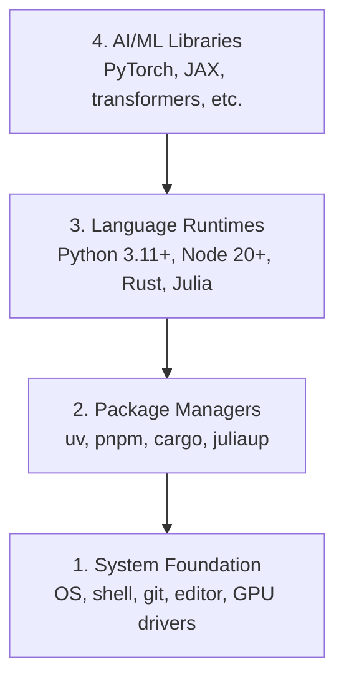

# Среда разработки

> Ваши инструменты формируют ваше мышление. Настройте их один раз — и сразу правильно.

**Тип:** Build
**Языки:** Python, Node.js, Rust
**Предварительные требования:** Нет
**Время:** ~45 минут

## Цели обучения

- Настроить с нуля инструментарий Python 3.11+, Node.js 20+ и Rust
- Настроить виртуальные окружения и менеджеры пакетов для воспроизводимых сборок
- Проверить доступ к GPU через CUDA/MPS и выполнить тестовую операцию с тензором
- Понять четырёхуровневый стек: система, пакеты, среды выполнения, библиотеки ИИ

## Проблема

Вам предстоит изучать инженерию ИИ на протяжении 200+ уроков с использованием Python, TypeScript, Rust и Julia. Если ваше окружение сломано, каждый урок превращается в борьбу с инструментами вместо обучения.

Большинство людей пропускают настройку окружения. Затем они тратят часы на отладку ошибок импорта, конфликтов версий и отсутствующих драйверов CUDA. Мы сделаем это один раз и как следует.

## Концепция

Окружение для инженерии ИИ состоит из четырёх уровней:



Мы устанавливаем снизу вверх. Каждый уровень зависит от того, что находится под ним.

```figure
s0-env-stack
```

## Создаём

### Шаг 1: Основа системы

Проверьте вашу систему и установите базовые инструменты.

```bash
# macOS
xcode-select --install
brew install git curl wget

# Ubuntu/Debian
sudo apt update && sudo apt install -y build-essential git curl wget

# Windows (use WSL2)
wsl --install -d Ubuntu-24.04
```

### Шаг 2: Python с uv

Мы используем `uv` — он в 10-100 раз быстрее pip и автоматически управляет виртуальными окружениями.

```bash
curl -LsSf https://astral.sh/uv/install.sh | sh

uv python install 3.12

uv venv
source .venv/bin/activate  # or .venv\Scripts\activate on Windows

uv pip install numpy matplotlib jupyter
```

Проверка:

```python
import sys
print(f"Python {sys.version}")

import numpy as np
print(f"NumPy {np.__version__}")
a = np.array([1, 2, 3])
print(f"Vector: {a}, dot product with itself: {np.dot(a, a)}")
```

### Шаг 3: Node.js с pnpm

Для уроков по TypeScript (агенты, MCP-серверы, веб-приложения).

```bash
curl -fsSL https://fnm.vercel.app/install | bash
fnm install 22
fnm use 22

npm install -g pnpm

node -e "console.log('Node', process.version)"
```

**macOS / Apple Silicon (M1/M2/M3/M4):** Если установщик останавливается с ошибкой `Error: Cannot install under Rosetta 2 in ARM default prefix (/opt/homebrew)`, значит, терминал запущен через Rosetta 2 (`arch` выводит `i386`), а Homebrew установлен в нативной версии arm64. Установите fnm, принудительно используя arm64, подключите его к командной оболочке, а затем снова выполните приведённые выше команды, начиная с `fnm install 22`:

```bash
arch -arm64 brew install fnm
echo 'eval "$(fnm env --use-on-cd)"' >> ~/.zshrc
source ~/.zshrc
```

### Шаг 4: Rust

Для уроков, критичных к производительности (инференс, системное программирование).

```bash
curl --proto '=https' --tlsv1.2 -sSf https://sh.rustup.rs | sh

rustc --version
cargo --version
```

### Шаг 5: Julia (опционально)

Для уроков с большим объёмом математики, где Julia особенно хороша.

```bash
curl -fsSL https://install.julialang.org | sh

julia -e 'println("Julia ", VERSION)'
```

### Шаг 6: Настройка GPU (если он у вас есть)

**NVIDIA (Linux / Windows):**

```bash
nvidia-smi

# Install PyTorch with CUDA
uv pip install torch torchvision torchaudio --index-url https://download.pytorch.org/whl/cu124
```

**macOS / Apple Silicon (M1/M2/M3/M4):** На Mac нет CUDA — это ожидаемо, а не признак сбоя. **Не** передавайте `--index-url .../cuXXX`: эти пакеты предназначены только для Linux/Windows, поэтому установка завершится ошибкой. Установите обычную сборку, в которую входит GPU-бэкенд Apple MPS (Metal):

```bash
uv pip install torch torchvision torchaudio
```

Проверка (работает на любой платформе):

```python
import torch
print(f"CUDA available: {torch.cuda.is_available()}")           # False on macOS — expected
print(f"MPS available:  {torch.backends.mps.is_available()}")   # True on Apple Silicon
if torch.cuda.is_available():
    print(f"GPU: {torch.cuda.get_device_name(0)}")
```

Нет GPU? Не проблема. Большинство уроков работают на CPU. Для уроков с интенсивным обучением используйте Google Colab или облачные GPU.

### Шаг 7: Проверьте всё

Запустите скрипт проверки:

```bash
python phases/00-setup-and-tooling/01-dev-environment/code/verify.py
```

## Применяем

Теперь ваше окружение готово к любому уроку этого курса. Вот что и где вы будете использовать:

| Язык | Где используется | Менеджер пакетов |
|----------|---------|-----------------|
| Python | Фазы 1-12 (ML, DL, NLP, компьютерное зрение, аудио, LLM) | uv |
| TypeScript | Фазы 13-17 (инструменты, агенты, свормы, инфраструктура) | pnpm |
| Rust | Фазы 12, 15-17 (системы, критичные к производительности) | cargo |
| Julia | Фаза 1 (математические основы) | Pkg |

## Публикуем

Этот урок производит скрипт проверки, который любой может запустить, чтобы проверить своё окружение.

См. `outputs/prompt-env-check.md` — промпт, который помогает ИИ-ассистентам диагностировать проблемы окружения.

## Упражнения

1. Запустите скрипт проверки и исправьте все сбои
2. Создайте виртуальное окружение Python для этого курса и установите PyTorch
3. Напишите «hello world» на всех четырёх языках и запустите каждый из них
