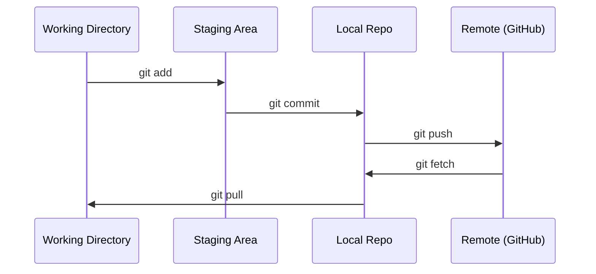

# Git и совместная работа

> Система контроля версий — это не опция. Каждый эксперимент, каждая модель, каждый урок, который вы создаёте здесь, отслеживается.

**Тип:** Learn
**Языки:** --
**Предварительные требования:** Фаза 0, Урок 01
**Время:** ~30 минут

## Цели обучения

- Настроить идентификацию в git и использовать ежедневный рабочий процесс add, commit и push
- Создавать и объединять ветки для изолированных экспериментов, не ломая main
- Написать `.gitignore`, исключающий контрольные точки моделей и большие бинарные файлы
- Просматривать историю коммитов с помощью `git log`, чтобы понимать эволюцию проекта

## Проблема

Вам предстоит написать сотни файлов кода на протяжении 20 фаз. Без системы контроля версий вы потеряете работу, сломаете то, что не сможете отменить, и не сможете совместно работать с другими.

Git — это инструмент. GitHub — место, где хранится код. Этот урок охватывает то, что нужно для этого курса, и ничего больше.

## Концепция



Три вещи, которые нужно запомнить:
1. Сохраняйте часто (`git commit`)
2. Отправляйте на удалённый репозиторий (`git push`)
3. Создавайте ветку для экспериментов (`git checkout -b experiment`)

```figure
s0-commit-dag
```

## Создаём

### Шаг 1: Настройка git

```bash
git config --global user.name "Your Name"
git config --global user.email "you@example.com"
```

### Шаг 2: Ежедневный рабочий процесс

```bash
git status
git add file.py
git commit -m "Add perceptron implementation"
git push origin main
```

### Шаг 3: Ветки для экспериментов

```bash
git checkout -b experiment/new-optimizer

# ... make changes, commit ...

git checkout main
git merge experiment/new-optimizer
```

### Шаг 4: Работа с репозиторием этого курса

Вы не можете отправлять изменения напрямую в репозиторий курса — доступ на запись есть только у сопровождающих. Сначала создайте его форк на GitHub (кнопка Fork в правом верхнем углу), чтобы `origin` указывал на вашу копию:

```bash
git clone https://github.com/YOUR-USERNAME/ai-engineering-from-scratch.git
cd ai-engineering-from-scratch

git checkout -b my-progress
# work through lessons, commit your code
git push origin my-progress
```

## Применяем

Для этого курса вам нужны именно эти команды:

| Команда | Когда |
|---------|------|
| `git clone` | Получить репозиторий курса |
| `git add` + `git commit` | Сохранить свою работу |
| `git push` | Создать резервную копию на GitHub |
| `git checkout -b` | Попробовать что-то, не ломая main |
| `git log --oneline` | Посмотреть, что вы уже сделали |

Это всё. Для этого курса вам не нужны rebase, cherry-pick или подмодули.

## Упражнения

1. Создайте форк этого репозитория, клонируйте свой форк, создайте ветку с именем `my-progress`, создайте файл, закоммитьте его и отправьте в удалённый репозиторий
2. Создайте `.gitignore`, исключающий файлы контрольных точек моделей (`.pt`, `.pth`, `.safetensors`)
3. Посмотрите историю коммитов этого репозитория с помощью `git log --oneline` и изучите, как добавлялись уроки

## Ключевые термины

| Термин | Что говорят люди | Что это на самом деле означает |
|------|----------------|----------------------|
| Commit | «Сохранение» | Снимок всего вашего проекта в определённый момент времени |
| Branch | «Копия» | Указатель на коммит, который продвигается вперёд по мере вашей работы |
| Merge | «Объединение кода» | Перенос изменений из одной ветки и применение их к другой |
| Remote | «Облако» | Копия вашего репозитория, размещённая где-то ещё (GitHub, GitLab) |
