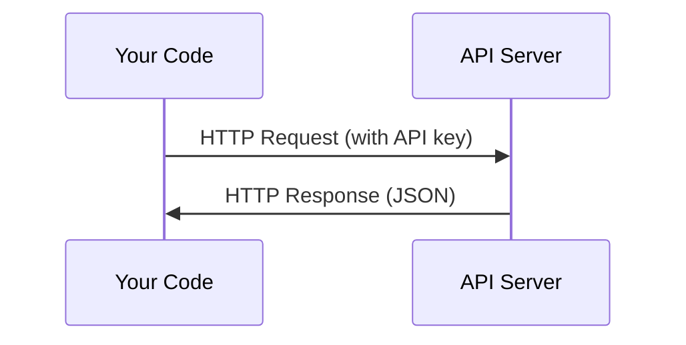

# API и ключи

> Любой API ИИ работает одинаково: отправляете запрос, получаете ответ. Детали меняются, паттерн — нет.

**Тип:** Build
**Языки:** Python, TypeScript
**Предварительные требования:** Фаза 0, Урок 01
**Время:** ~30 минут

## Цели обучения

- Безопасно хранить API-ключи с помощью переменных окружения и файлов `.env`
- Выполнить вызов API LLM, используя как Python SDK от Anthropic, так и «сырой» HTTP
- Сравнить форматы запросов и ответов SDK и «сырого» HTTP для отладки
- Распознавать и обрабатывать типичные ошибки API, включая ошибки аутентификации и ограничения частоты запросов

## Проблема

Начиная с фазы 11, вы будете вызывать API LLM (Anthropic, OpenAI, Google). В фазах 13-16 вы будете строить агентов, которые используют эти API в циклах. Вам нужно знать, как работают API-ключи, как безопасно их хранить и как выполнить свой первый вызов API.

## Концепция



Каждый вызов API включает:
1. Конечную точку (URL)
2. API-ключ (аутентификация)
3. Тело запроса (то, что вы хотите)
4. Тело ответа (то, что вы получаете обратно)

```figure
s0-secret-inject
```

## Создаём

### Шаг 1: Безопасно храните API-ключи

Никогда не помещайте API-ключи в код. Используйте переменные окружения.

```bash
export ANTHROPIC_API_KEY="sk-ant-..."
export OPENAI_API_KEY="sk-..."
```

Или используйте файл `.env` (добавьте его в `.gitignore`):

```
ANTHROPIC_API_KEY=sk-ant-...
OPENAI_API_KEY=sk-...
```

### Шаг 2: Первый вызов API (Python)

```python
import os

import anthropic

client = anthropic.Anthropic()

MODEL = os.environ.get("LLM_MODEL", "claude-sonnet-5")

response = client.messages.create(
    model=MODEL,
    max_tokens=256,
    messages=[{"role": "user", "content": "What is a neural network in one sentence?"}]
)

print(response.content[0].text)
```

`LLM_MODEL` задаёт идентификатор модели Anthropic; по умолчанию используется недатированный псевдоним Sonnet. Другие провайдеры (OpenAI, Google и остальные) используют ту же схему из ключа и идентификатора модели, но у каждого из них свои SDK, конечная точка и схема запросов и ответов.

### Шаг 3: Первый вызов API (TypeScript)

```typescript
import Anthropic from "@anthropic-ai/sdk";

const client = new Anthropic();

const MODEL = process.env.LLM_MODEL ?? "claude-sonnet-5";

const response = await client.messages.create({
  model: MODEL,
  max_tokens: 256,
  messages: [{ role: "user", content: "What is a neural network in one sentence?" }],
});

console.log(response.content[0].text);
```

### Шаг 4: «Сырой» HTTP (без SDK)

```python
import os
import urllib.request
import json

url = "https://api.anthropic.com/v1/messages"
headers = {
    "Content-Type": "application/json",
    "x-api-key": os.environ["ANTHROPIC_API_KEY"],
    "anthropic-version": "2023-06-01",
}
body = json.dumps({
    "model": os.environ.get("LLM_MODEL", "claude-sonnet-5"),
    "max_tokens": 256,
    "messages": [{"role": "user", "content": "What is a neural network in one sentence?"}],
}).encode()

req = urllib.request.Request(url, data=body, headers=headers, method="POST")
with urllib.request.urlopen(req) as resp:
    result = json.loads(resp.read())
    print(result["content"][0]["text"])
```

Именно это делают SDK «под капотом». Понимание «сырого» HTTP-вызова помогает при отладке.

## Применяем

Для этого курса:

| API | Когда он вам нужен | Бесплатный тариф |
|-----|-----------------|-----------|
| Anthropic (Claude) | Фазы 11-16 (агенты, инструменты) | $5 кредита при регистрации |
| OpenAI | Фаза 11 (сравнение) | $5 кредита при регистрации |
| Hugging Face | Фазы 4-10 (модели, наборы данных) | Бесплатно |

Вам не нужны все они прямо сейчас. Настраивайте их, когда этого требует урок.

## Публикуем

Этот урок производит:
- `outputs/prompt-api-troubleshooter.md` — диагностика типичных ошибок API

## Упражнения

1. Получите API-ключ Anthropic и выполните свой первый вызов API
2. Попробуйте версию с «сырым» HTTP и сравните формат ответа с версией на SDK
3. Намеренно используйте неверный API-ключ и прочитайте сообщение об ошибке

## Ключевые термины

| Термин | Что говорят люди | Что это на самом деле означает |
|------|----------------|----------------------|
| API key | «Пароль для API» | Уникальная строка, идентифицирующая вашу учётную запись и авторизующая запросы |
| Rate limit | «Меня троттлят» | Максимальное количество запросов в минуту/час для предотвращения злоупотреблений и обеспечения справедливого использования |
| Token | «Слово» (в контексте API) | Единица тарификации: входные и выходные токены подсчитываются и оплачиваются отдельно |
| Streaming | «Ответы в реальном времени» | Получение ответа слово за словом вместо ожидания полного ответа |
