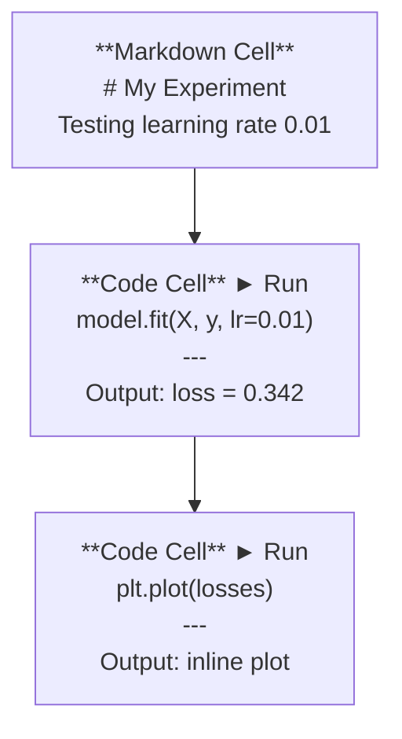
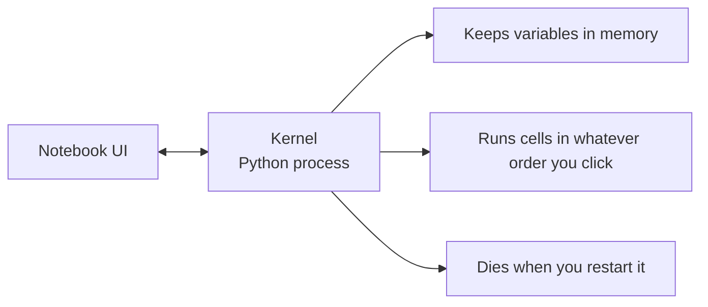

# Jupyter Notebooks

> Блокноты — это лабораторный стол инженерии ИИ. Здесь вы прототипируете, а затем переносите то, что работает, в продакшен.

**Тип:** Build
**Языки:** Python
**Предварительные требования:** Фаза 0, Урок 01
**Время:** ~30 минут

## Цели обучения

- Установить и запустить JupyterLab, Jupyter Notebook или VS Code с расширением Jupyter
- Использовать магические команды (`%timeit`, `%%time`, `%matplotlib inline`) для бенчмаркинга и визуализации прямо в блокноте
- Различать, когда использовать блокноты, а когда скрипты, и применять рабочий процесс «исследуй в блокнотах, поставляй в скриптах»
- Распознавать и избегать типичных ловушек блокнотов: выполнение ячеек не по порядку, скрытое состояние и утечки памяти

## Проблема

Каждая статья по ИИ, туториал и соревнование на Kaggle используют блокноты Jupyter. Они позволяют запускать код по частям, видеть вывод прямо в блокноте, смешивать код с объяснениями и быстро итерировать. Если вы пытаетесь изучать ИИ без блокнотов, это всё равно что делать домашнее задание по математике без черновика.

Но у блокнотов есть настоящие ловушки. Люди используют их для всего подряд, включая то, для чего они совершенно не годятся. Знание того, когда использовать блокнот, а когда скрипт, избавит вас от кошмаров отладки в будущем.

## Концепция

Блокнот — это список ячеек. Каждая ячейка — это либо код, либо текст.



Ядро (kernel) — это процесс Python, работающий в фоне. Когда вы запускаете ячейку, она отправляет код в ядро, которое выполняет его и возвращает результат. Все ячейки используют одно и то же ядро, поэтому переменные сохраняются между ячейками.



Эта часть про «порядок, в котором вы кликаете» — одновременно и суперсила, и мина замедленного действия.

```figure
s0-cell-order
```

## Создаём

### Шаг 1: Выберите свой интерфейс

Три варианта, один формат:

| Интерфейс | Установка | Лучше всего подходит для |
|-----------|---------|----------|
| JupyterLab | `pip install jupyterlab` затем `jupyter lab` | Полноценный опыт IDE, несколько вкладок, файловый браузер, терминал |
| Jupyter Notebook | `pip install notebook` затем `jupyter notebook` | Просто, легковесно, один блокнот за раз |
| VS Code | Установите расширение «Jupyter» | Уже в вашем редакторе, интеграция с git, отладка |

Все три читают и записывают один и тот же файл `.ipynb`. Выбирайте то, что вам нравится. JupyterLab — самый распространённый вариант в работе с ИИ.

```bash
pip install jupyterlab
jupyter lab
```

### Шаг 2: Сочетания клавиш, которые важны

Вы работаете в двух режимах. Нажмите `Escape` для режима команд (синяя полоса слева), `Enter` для режима редактирования (зелёная полоса).

**Режим команд (используется чаще всего):**

| Клавиша | Действие |
|-----|--------|
| `Shift+Enter` | Выполнить ячейку, перейти к следующей |
| `A` | Вставить ячейку выше |
| `B` | Вставить ячейку ниже |
| `DD` | Удалить ячейку |
| `M` | Преобразовать в markdown |
| `Y` | Преобразовать в код |
| `Z` | Отменить операцию с ячейкой |
| `Ctrl+Shift+H` | Показать все сочетания клавиш |

**Режим редактирования:**

| Клавиша | Действие |
|-----|--------|
| `Tab` | Автодополнение |
| `Shift+Tab` | Показать сигнатуру функции |
| `Ctrl+/` | Переключить комментарий |

`Shift+Enter` — это то, что вы будете использовать тысячу раз в день. Выучите это первым.

### Шаг 3: Типы ячеек

**Ячейки с кодом** выполняют Python и показывают вывод:

```python
import numpy as np
data = np.random.randn(1000)
data.mean(), data.std()
```

Вывод: `(0.0032, 0.9987)`

**Ячейки markdown** отображают форматированный текст. Используйте их, чтобы документировать, что вы делаете и почему. Поддерживает заголовки, полужирный шрифт, курсив, математику LaTeX (`$E = mc^2$`), таблицы и изображения.

### Шаг 4: Магические команды

Это не Python. Это специфичные для Jupyter команды, начинающиеся с `%` (строчная магия) или `%%` (магия ячейки).

**Замерьте время выполнения кода:**

```python
%timeit np.random.randn(10000)
```

Вывод: `45.2 us +/- 1.3 us per loop`

```python
%%time
model.fit(X_train, y_train, epochs=10)
```

Вывод: `Wall time: 2.34 s`

`%timeit` запускает код много раз и усредняет результат. `%%time` запускает его один раз. Используйте `%timeit` для микробенчмарков, `%%time` — для прогонов обучения.

**Включите встроенные графики:**

```python
%matplotlib inline
```

Теперь каждый `plt.plot()` или `plt.show()` отображается прямо в блокноте.

**Устанавливайте пакеты, не покидая блокнот:**

```python
!pip install scikit-learn
```

Префикс `!` запускает любую команду оболочки.

**Проверьте переменные окружения:**

```python
%env CUDA_VISIBLE_DEVICES
```

### Шаг 5: Отображение насыщенного вывода прямо в блокноте

Блокноты автоматически отображают последнее выражение в ячейке. Но вы можете это контролировать:

```python
import pandas as pd

df = pd.DataFrame({
    "model": ["Linear", "Random Forest", "Neural Net"],
    "accuracy": [0.72, 0.89, 0.94],
    "training_time": [0.1, 2.3, 45.6]
})
df
```

Это отображает отформатированную HTML-таблицу, а не текстовый дамп. То же самое с графиками:

```python
import matplotlib.pyplot as plt

plt.figure(figsize=(8, 4))
plt.plot([1, 2, 3, 4], [1, 4, 2, 3])
plt.title("Inline Plot")
plt.show()
```

График появляется прямо под ячейкой. Именно поэтому блокноты доминируют в работе с ИИ. Вы видите данные, график и код вместе.

Для изображений:

```python
from IPython.display import Image, display
display(Image(filename="architecture.png"))
```

### Шаг 6: Google Colab

Colab — это бесплатный блокнот Jupyter в облаке. Он предоставляет вам GPU, предустановленные библиотеки и интеграцию с Google Drive. Настройка не требуется.

1. Перейдите на [colab.research.google.com](https://colab.research.google.com)
2. Загрузите любой файл `.ipynb` из этого курса
3. Runtime > Change runtime type > T4 GPU (бесплатно)

Отличия Colab от локального Jupyter:
- Файлы не сохраняются между сессиями (сохраняйте на Drive или скачивайте)
- Предустановлено: numpy, pandas, matplotlib, torch, tensorflow, sklearn
- `from google.colab import files` для загрузки/скачивания файлов
- `from google.colab import drive; drive.mount('/content/drive')` для постоянного хранилища
- Сессии завершаются по тайм-ауту после 90 минут бездействия (бесплатный тариф)

## Применяем

### Блокноты и скрипты: когда что использовать

| Используйте блокноты для | Используйте скрипты для |
|-------------------|-----------------|
| Исследования набора данных | Конвейеров обучения |
| Прототипирования модели | Переиспользуемых утилит |
| Визуализации результатов | Всего, что содержит `if __name__` |
| Объяснения своей работы | Кода, который запускается по расписанию |
| Быстрых экспериментов | Продакшен-кода |
| Упражнений курса | Пакетов и библиотек |

Правило: **исследуй в блокнотах, поставляй в скриптах**.

Типичный рабочий процесс в ИИ:
1. Исследуйте данные в блокноте
2. Прототипируйте свою модель в блокноте
3. Как только это заработает, перенесите код в файлы `.py`
4. Импортируйте эти файлы `.py` обратно в блокнот для дальнейших экспериментов

### Типичные ловушки

**Выполнение ячеек не по порядку.** Вы запускаете ячейку 5, затем ячейку 2, затем ячейку 7. Блокнот работает на вашей машине, но ломается, когда кто-то запускает его сверху вниз. Решение: Kernel > Restart & Run All перед тем, как поделиться блокнотом.

**Скрытое состояние.** Вы удаляете ячейку, но переменная, которую она создала, всё ещё в памяти. Блокнот выглядит чистым, но зависит от ячейки-призрака. Решение: регулярно перезапускайте ядро.

**Утечки памяти.** Загрузка набора данных на 4 ГБ, обучение модели, загрузка другого набора данных. Ничего не освобождается. Решение: `del variable_name` и `gc.collect()` или перезапуск ядра.

## Публикуем

Этот урок производит:
- `outputs/prompt-notebook-helper.md` для отладки проблем с блокнотами

## Упражнения

1. Откройте JupyterLab, создайте блокнот и используйте `%timeit`, чтобы сравнить включение по списку и numpy для создания массива из 100 000 случайных чисел
2. Создайте блокнот с ячейками markdown и кода, который загружает CSV, отображает датафрейм и строит график. Затем запустите Kernel > Restart & Run All, чтобы убедиться, что он работает сверху вниз
3. Возьмите код из `code/notebook_tips.py`, вставьте его в блокнот Colab и запустите с бесплатным GPU

## Ключевые термины

| Термин | Что говорят люди | Что это на самом деле означает |
|------|----------------|----------------------|
| Kernel | «Штука, которая выполняет мой код» | Отдельный процесс Python, который выполняет ячейки и хранит переменные в памяти |
| Cell | «Блок кода» | Независимо выполняемая единица в блокноте — код или markdown |
| Magic command | «Трюки Jupyter» | Специальные команды с префиксом `%` или `%%`, управляющие окружением блокнота |
| `.ipynb` | «Файл блокнота» | JSON-файл, содержащий ячейки, вывод и метаданные. Расшифровывается как IPython Notebook |

## Дополнительные материалы

- [Документация JupyterLab](https://jupyterlab.readthedocs.io/) — полный набор возможностей
- [Google Colab FAQ](https://research.google.com/colaboratory/faq.html) — ограничения и возможности, специфичные для Colab
- [28 советов по Jupyter Notebook](https://www.dataquest.io/blog/jupyter-notebook-tips-tricks-shortcuts/) — приёмы для продвинутых пользователей
