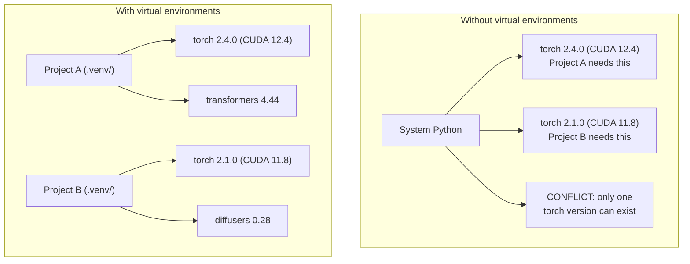

# Виртуальные окружения Python

> Ад зависимостей реален. Виртуальные окружения — лекарство от него.

**Тип:** Build**Языки:** Shell**Предварительные требования:** Фаза 0, Урок 01**Время:** ~30 минут
## Учебные цели

- Создавать изолированные виртуальные окружения с помощью `uv`, `venv` или `conda`
- Писать `pyproject.toml` с опциональными группами зависимостей и генерировать lock-файлы для воспроизводимости
- Диагностировать и устранять типичные ошибки: глобальные установки, смешивание pip/conda, несовпадение версий CUDA
- Реализовать пофазовую стратегию окружений для проектов с конфликтующими зависимостями

## Проблема

Вы устанавливаете PyTorch 2.4 для проекта дообучения. На следующей неделе другому проекту нужен PyTorch 2.1, потому что его сборка CUDA зафиксирована. Вы обновляете глобально — ломается первый проект. Откатываетесь назад — ломается второй.

Это и есть ад зависимостей. В работе с AI/ML он возникает постоянно, потому что:

- PyTorch, JAX и TensorFlow поставляют собственные привязки CUDA
- библиотеки моделей фиксируют конкретные версии фреймворков
- глобальный `pip install` перезаписывает всё, что было установлено раньше
- сборки под CUDA 11.8 не работают с драйверами CUDA 12.x (и наоборот)

Решение: у каждого проекта — своё изолированное окружение со своими пакетами.

## Концепция



```figure
s0-env-isolation
```

## Реализация

### Вариант 1: uv venv (рекомендуется)

`uv` — самый быстрый менеджер пакетов Python (в 10–100 раз быстрее pip). Он управляет виртуальными окружениями, версиями Python и разрешением зависимостей в одном инструменте.

```bash
curl -LsSf https://astral.sh/uv/install.sh | sh

uv python install 3.12

cd your-project
uv venv
source .venv/bin/activate
```

Установка пакетов:

```bash
uv pip install torch numpy
```

Создание проекта с `pyproject.toml` за один шаг:

```bash
uv init my-ai-project
cd my-ai-project
uv add torch numpy matplotlib
```

### Вариант 2: venv (встроенный)

Если `uv` установить не получается, Python поставляется со встроенным `venv`:

```bash
python3 -m venv .venv
source .venv/bin/activate  # Linux/macOS
.venv\Scripts\activate     # Windows

pip install torch numpy
```

Медленнее, чем `uv`, но работает везде, где установлен Python.

### Вариант 3: conda (когда это нужно)

Conda управляет зависимостями, не относящимися к Python, например CUDA toolkit, cuDNN и C-библиотеками. Используйте её, когда:

- нужна конкретная версия CUDA toolkit без установки в систему целиком
- вы работаете на общем кластере, где нельзя устанавливать системные пакеты
- инструкция по установке библиотеки прямо говорит «используйте conda»

```bash
# Install miniconda (not the full Anaconda)
curl -LsSf https://repo.anaconda.com/miniconda/Miniconda3-latest-Linux-x86_64.sh -o miniconda.sh
bash miniconda.sh -b

conda create -n myproject python=3.12
conda activate myproject

conda install pytorch torchvision torchaudio pytorch-cuda=12.4 -c pytorch -c nvidia
```

Одно правило: если для окружения вы используете conda, используйте conda для всех пакетов в этом окружении. Подмешивание `pip install` в окружение conda вызывает конфликты зависимостей, которые мучительно отлаживать.

### Для этого курса: пофазовая стратегия

Можно было бы создать одно окружение на весь курс. Не делайте так. Разным фазам нужны разные (иногда конфликтующие) зависимости.

Стратегия:

```
ai-engineering-from-scratch/
├── .venv/                    <-- shared lightweight env for phases 0-3
├── phases/
│   ├── 04-neural-networks/
│   │   └── .venv/            <-- PyTorch env
│   ├── 05-cnns/
│   │   └── .venv/            <-- same PyTorch env (symlink or shared)
│   ├── 08-transformers/
│   │   └── .venv/            <-- might need different transformer versions
│   └── 11-llm-apis/
│       └── .venv/            <-- API SDKs, no torch needed
```

Скрипт в `code/env_setup.sh` создаёт базовое окружение для этого курса.

## Основы pyproject.toml

У каждого проекта Python должен быть `pyproject.toml`. Он заменяет `setup.py`, `setup.cfg` и `requirements.txt` одним файлом.

```toml
[project]
name = "ai-engineering-from-scratch"
version = "0.1.0"
requires-python = ">=3.11"
dependencies = [
    "numpy>=1.26",
    "matplotlib>=3.8",
    "jupyter>=1.0",
    "scikit-learn>=1.4",
]

[project.optional-dependencies]
torch = ["torch>=2.3", "torchvision>=0.18"]
llm = ["anthropic>=0.39", "openai>=1.50"]
```

Затем установка:

```bash
uv pip install -e ".[torch]"    # base + PyTorch
uv pip install -e ".[llm]"     # base + LLM SDKs
uv pip install -e ".[torch,llm]" # everything
```

## Lock-файлы

Lock-файл фиксирует каждую зависимость (включая транзитивные) на точной версии. Это гарантирует воспроизводимость: любой, кто устанавливает из lock-файла, получает ровно тот же набор пакетов.

```bash
# uv generates uv.lock automatically when using uv add
uv add numpy

# pip-tools approach
uv pip compile pyproject.toml -o requirements.lock
uv pip install -r requirements.lock
```

Коммитьте lock-файл в git. Когда кто-то клонирует репозиторий, он устанавливает пакеты из lock-файла и получает идентичные версии.

## Типичные ошибки

### 1. Установка глобально

```bash
pip install torch  # BAD: installs to system Python

source .venv/bin/activate
pip install torch  # GOOD: installs to virtual environment
```

Проверьте, куда устанавливаются пакеты:

```bash
which python       # should show .venv/bin/python, not /usr/bin/python
which pip           # should show .venv/bin/pip
```

### 2. Смешивание pip и conda

```bash
conda create -n myenv python=3.12
conda activate myenv
conda install pytorch -c pytorch
pip install some-other-package   # BAD: can break conda's dependency tracking
conda install some-other-package # GOOD: let conda manage everything
```

Если без pip внутри conda не обойтись (некоторые пакеты доступны только через pip), сначала установите все пакеты conda, а pip-пакеты — последними.

### 3. Забыли активировать окружение

```bash
python train.py           # uses system Python, missing packages
source .venv/bin/activate
python train.py           # uses project Python, packages found
```

Приглашение оболочки должно показывать имя окружения:

```
(.venv) $ python train.py
```

### 4. Коммит .venv в git

```bash
echo ".venv/" >> .gitignore
```

Виртуальные окружения весят от 200 МБ до 2 ГБ. Они локальные и не переносятся между машинами. Вместо этого коммитьте `pyproject.toml` и lock-файл.

### 5. Несовпадение версии CUDA

```bash
nvidia-smi                # shows driver CUDA version (e.g., 12.4)
python -c "import torch; print(torch.version.cuda)"  # shows PyTorch CUDA version

# These must be compatible.
# PyTorch CUDA version must be <= driver CUDA version.
```

## Применение

Запустите скрипт настройки, чтобы создать окружение курса:

```bash
bash phases/00-setup-and-tooling/06-python-environments/code/env_setup.sh
```

Он создаёт `.venv` в корне репозитория с установленными и проверенными базовыми зависимостями.

## Упражнения

1. Запустите `env_setup.sh` и убедитесь, что все проверки проходят
2. Создайте второе виртуальное окружение, установите в нём другую версию numpy и убедитесь, что оба окружения изолированы друг от друга
3. Напишите `pyproject.toml` для проекта, которому нужны и PyTorch, и Anthropic SDK
4. Намеренно установите пакет глобально (не активируя venv), посмотрите, куда он попал, а затем удалите его

## Ключевые термины

| Термин | Как говорят | Что это означает на самом деле |
|------|----------------|----------------------|
| Virtual environment | «венв» | Изолированный каталог, содержащий интерпретатор Python и пакеты, отдельный от системного Python |
| Lockfile | «зафиксированные зависимости» | Файл, перечисляющий каждый пакет с его точной версией, гарантирующий идентичные установки на разных машинах |
| pyproject.toml | «новый setup.py» | Стандартный файл конфигурации проекта Python, заменяющий setup.py/setup.cfg/requirements.txt |
| Transitive dependency | «зависимость зависимости» | Пакет B зависит от C; если вы устанавливаете A, который зависит от B, то C — транзитивная зависимость A |
| CUDA mismatch | «мой GPU не работает» | PyTorch скомпилирован под другую версию CUDA, чем та, что поддерживает драйвер вашего GPU |
