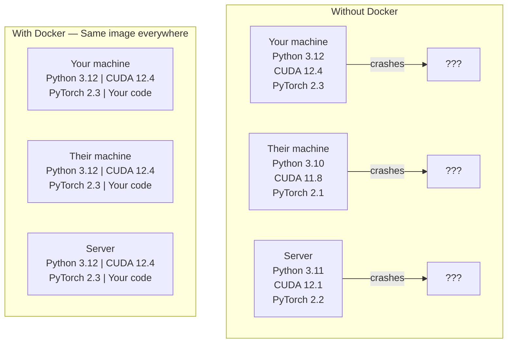

# Docker для AI

> Контейнеры делают «у меня на машине работает» пережитком прошлого.

**Тип:** Build**Языки:** Docker**Предварительные требования:** Фаза 0, Уроки 01 and 03**Время:** ~60 минут
## Учебные цели

- Собрать GPU-совместимый Docker-образ с CUDA, PyTorch и AI-библиотеками из Dockerfile
- Монтировать каталоги хоста как тома, чтобы сохранять модели, наборы данных и код между пересборками контейнера
- Настроить NVIDIA Container Toolkit для доступа к GPU внутри контейнеров
- Оркестрировать многосервисные AI-приложения (сервер инференса + векторная база данных) с помощью Docker Compose

## Проблема

Вы обучили модель на ноутбуке с PyTorch 2.3, CUDA 12.4 и Python 3.12. У коллеги — PyTorch 2.1, CUDA 11.8 и Python 3.10. Ваша модель падает на его машине. Ваш Dockerfile работает на обеих.

AI-проекты — это кошмар зависимостей. Типичный стек включает Python, PyTorch, драйверы CUDA, cuDNN, системные C-библиотеки и специализированные пакеты вроде flash-attn, которым нужны точные версии компилятора. Docker упаковывает всё это в единый образ, который одинаково работает везде.

## Концепция

Docker оборачивает ваш код, среду выполнения, библиотеки и системные инструменты в изолированную единицу — контейнер. Считайте это лёгкой виртуальной машиной, только вместо собственного ядра ОС она использует ядро хоста, поэтому запускается за секунды, а не минуты.



### Почему AI-проектам Docker нужен больше, чем большинству

1. **Драйверы GPU хрупкие.** Код под CUDA 12.4 не работает с CUDA 11.8. Docker изолирует CUDA toolkit внутри контейнера, при этом деля драйвер GPU хоста через NVIDIA Container Toolkit.

2. **Веса моделей большие.** Модель на 7 млрд параметров весит 14 ГБ в fp16. Вы не хотите перекачивать её при каждой пересборке. Тома Docker позволяют смонтировать каталог с моделями с хоста.

3. **Многосервисные архитектуры — обычное дело.** Реальное AI-приложение — это не просто Python-скрипт. Это сервер инференса, векторная база данных для RAG, возможно, веб-фронтенд. Docker Compose оркестрирует всё это одной командой.

### Ключевой словарь

| Термин | Что это значит |
|------|---------------|
| Image | Read-only-шаблон. Ваш рецепт. Собирается из Dockerfile. |
| Container | Запущенный экземпляр образа. Ваша кухня. |
| Dockerfile | Инструкции для сборки образа. Слой за слоем. |
| Volume | Постоянное хранилище, которое переживает перезапуски контейнера. |
| docker-compose | Инструмент для описания многоконтейнерных приложений в YAML. |

### Типичные паттерны контейнеров в AI

```
Dev Container
  Full toolkit. Editor support. Jupyter. Debugging tools.
  Used during development and experimentation.

Training Container
  Minimal. Just the training script and dependencies.
  Runs on GPU clusters. No editor, no Jupyter.

Inference Container
  Optimized for serving. Small image. Fast cold start.
  Runs behind a load balancer in production.
```

```figure
s0-image-layers
```

## Реализация

### Шаг 1: установка Docker

```bash
# macOS
brew install --cask docker
open /Applications/Docker.app

# Ubuntu
curl -fsSL https://get.docker.com | sh
sudo usermod -aG docker $USER
# Log out and back in for group change to take effect
```

Проверка:

```bash
docker --version
docker run hello-world
```

### Шаг 2: установка NVIDIA Container Toolkit (Linux с GPU NVIDIA)

Это даёт контейнерам Docker доступ к вашему GPU. Пользователи macOS и Windows (WSL2) могут пропустить этот шаг; Docker Desktop обрабатывает проброс GPU на этих платформах иначе.

```bash
distribution=$(. /etc/os-release;echo $ID$VERSION_ID)
curl -fsSL https://nvidia.github.io/libnvidia-container/gpgkey | sudo gpg --dearmor -o /usr/share/keyrings/nvidia-container-toolkit-keyring.gpg
curl -s -L https://nvidia.github.io/libnvidia-container/$distribution/libnvidia-container.list | \
    sed 's#deb https://#deb [signed-by=/usr/share/keyrings/nvidia-container-toolkit-keyring.gpg] https://#g' | \
    sudo tee /etc/apt/sources.list.d/nvidia-container-toolkit.list

sudo apt-get update
sudo apt-get install -y nvidia-container-toolkit
sudo nvidia-ctk runtime configure --runtime=docker
sudo systemctl restart docker
```

Проверьте доступ к GPU внутри контейнера:

```bash
docker run --rm --gpus all nvidia/cuda:12.4.1-base-ubuntu22.04 nvidia-smi
```

Если вы видите информацию о своём GPU, toolkit работает.

### Шаг 3: разбираемся в базовых образах

Правильный выбор базового образа экономит часы отладки.

```
nvidia/cuda:12.4.1-devel-ubuntu22.04
  Full CUDA toolkit. Compilers included.
  Use for: building packages that need nvcc (flash-attn, bitsandbytes)
  Size: ~4 GB

nvidia/cuda:12.4.1-runtime-ubuntu22.04
  CUDA runtime only. No compilers.
  Use for: running pre-built code
  Size: ~1.5 GB

pytorch/pytorch:2.6.0-cuda12.4-cudnn9-runtime
  PyTorch pre-installed on top of CUDA.
  Use for: skipping the PyTorch install step
  Size: ~6 GB

python:3.12-slim
  No CUDA. CPU only.
  Use for: inference on CPU, lightweight tools
  Size: ~150 MB
```

### Шаг 4: пишем Dockerfile для AI-разработки

Вот Dockerfile из `code/Dockerfile`. Разберём его по частям:

```dockerfile
FROM nvidia/cuda:12.4.1-devel-ubuntu22.04

ENV DEBIAN_FRONTEND=noninteractive
ENV PYTHONUNBUFFERED=1

RUN apt-get update && apt-get install -y --no-install-recommends \
    software-properties-common \
    git \
    curl \
    build-essential \
    && add-apt-repository -y ppa:deadsnakes/ppa \
    && apt-get update && apt-get install -y --no-install-recommends \
    python3.12 \
    python3.12-venv \
    python3.12-dev \
    && rm -rf /var/lib/apt/lists/*

RUN update-alternatives --install /usr/bin/python python /usr/bin/python3.12 1

RUN curl -sSL https://raw.githubusercontent.com/pypa/get-pip/3b73145063be545b649ad9ca83ea8da5fc915a4f/public/get-pip.py -o /tmp/get-pip.py \
    && echo "a341e1a43e38001c551a1508a73ff23636a11970b61d901d9a1cad2a18f57055  /tmp/get-pip.py" | sha256sum -c - \
    && python /tmp/get-pip.py \
    && rm /tmp/get-pip.py \
    && update-alternatives --install /usr/bin/pip pip /usr/local/bin/pip3.12 1

RUN python -m pip install --no-cache-dir --upgrade pip setuptools wheel

RUN python -m pip install --no-cache-dir \
    torch==2.6.0+cu124 \
    torchvision==0.21.0+cu124 \
    torchaudio==2.6.0+cu124 \
    --index-url https://download.pytorch.org/whl/cu124

RUN python -m pip install --no-cache-dir \
    numpy \
    pandas \
    scikit-learn \
    matplotlib \
    jupyter \
    transformers \
    datasets \
    accelerate \
    safetensors

WORKDIR /workspace

VOLUME ["/workspace", "/models"]

EXPOSE 8888

CMD ["python"]
```

Сборка:

```bash
docker build -t ai-dev -f phases/00-setup-and-tooling/07-docker-for-ai/code/Dockerfile .
```

В первый раз это займёт некоторое время (загрузка базового образа CUDA + PyTorch). Последующие сборки используют кешированные слои.

Запуск:

```bash
docker run --rm -it --gpus all \
    -v $(pwd):/workspace \
    -v ~/models:/models \
    ai-dev python -c "import torch; print(f'PyTorch {torch.__version__}, CUDA: {torch.cuda.is_available()}')"
```

Запуск Jupyter внутри контейнера:

```bash
docker run --rm -it --gpus all \
    -v $(pwd):/workspace \
    -v ~/models:/models \
    -p 8888:8888 \
    ai-dev jupyter notebook --ip=0.0.0.0 --port=8888 --no-browser --allow-root
```

### Шаг 5: монтирование томов для данных и моделей

Монтирование томов критично важно для AI-работы. Без него ваши скачанные 14 ГБ модели исчезают при остановке контейнера.

```bash
# Mount your code
-v $(pwd):/workspace

# Mount a shared models directory
-v ~/models:/models

# Mount datasets
-v ~/datasets:/data
```

Внутри тренировочного скрипта загружайте с примонтированного пути:

```python
from transformers import AutoModel

model = AutoModel.from_pretrained("/models/llama-7b")
```

Модель находится на файловой системе хоста. Пересобирайте контейнер сколько угодно раз без повторной загрузки.

### Шаг 6: Docker Compose для многосервисных AI-приложений

Реальному RAG-приложению нужны сервер инференса и векторная база данных. Docker Compose запускает оба одной командой.

См. `code/docker-compose.yml`:

```yaml
services:
  ai-dev:
    build:
      context: .
      dockerfile: Dockerfile
    deploy:
      resources:
        reservations:
          devices:
            - driver: nvidia
              count: all
              capabilities: [gpu]
    volumes:
      - ../../../:/workspace
      - ~/models:/models
      - ~/datasets:/data
    ports:
      - "8888:8888"
    stdin_open: true
    tty: true
    command: jupyter notebook --ip=0.0.0.0 --port=8888 --no-browser --allow-root

  qdrant:
    image: qdrant/qdrant:v1.12.5
    ports:
      - "6333:6333"
      - "6334:6334"
    volumes:
      - qdrant_data:/qdrant/storage

volumes:
  qdrant_data:
```

Запуск всего сразу:

```bash
cd phases/00-setup-and-tooling/07-docker-for-ai/code
docker compose up -d
```

Теперь ваш контейнер AI-разработки может обращаться к векторной базе данных по адресу `http://qdrant:6333` по имени сервиса. Docker Compose автоматически создаёт общую сеть.

Проверьте соединение изнутри AI-контейнера:

```python
from qdrant_client import QdrantClient

client = QdrantClient(host="qdrant", port=6333)
print(client.get_collections())
```

Остановка всего:

```bash
docker compose down
```

Добавьте `-v`, чтобы также удалить том qdrant:

```bash
docker compose down -v
```

### Шаг 7: полезные команды Docker для AI-работы

```bash
# List running containers
docker ps

# List all images and their sizes
docker images

# Remove unused images (reclaim disk space)
docker system prune -a

# Check GPU usage inside a running container
docker exec -it <container_id> nvidia-smi

# Copy a file from container to host
docker cp <container_id>:/workspace/results.csv ./results.csv

# View container logs
docker logs -f <container_id>
```

## Применение

Теперь у вас есть воспроизводимая среда AI-разработки. На протяжении оставшейся части курса:

- используйте `docker compose up`, чтобы запускать среду разработки и векторную базу данных вместе
- монтируйте код, модели и данные как тома, чтобы ничего не терялось между пересборками
- когда уроку требуется новый Python-пакет, добавляйте его в Dockerfile и пересобирайте
- делитесь своим Dockerfile с коллегами по команде — они получат точно такую же среду

### Нет GPU?

Уберите флаг `--gpus all` и блок deploy для NVIDIA. Контейнер по-прежнему работает для уроков на CPU. PyTorch обнаруживает отсутствие CUDA и автоматически переключается на CPU.

## Упражнения

1. Соберите Dockerfile и выполните `python -c "import torch; print(torch.__version__)"` внутри контейнера
2. Запустите стек docker-compose и убедитесь, что Qdrant доступен из AI-контейнера по адресу `http://qdrant:6333/collections`
3. Добавьте `flask` в Dockerfile, пересоберите и запустите простой API-сервер на порту 5000. Пробросьте порт через `-p 5000:5000`
4. Измерьте размер образа с помощью `docker images`. Попробуйте сменить базовый образ с `devel` на `runtime` и сравните размеры

## Ключевые термины

| Термин | Как говорят | Что это означает на самом деле |
|------|----------------|----------------------|
| Container | «лёгкая VM» | Изолированный процесс, использующий ядро хоста, со своей файловой системой и сетью |
| Image layer | «кешированный шаг» | Каждая инструкция Dockerfile создаёт слой. Неизменённые слои кешируются, поэтому пересборки быстрые |
| NVIDIA Container Toolkit | «GPU в Docker» | Хук среды выполнения, который открывает доступ к GPU хоста для контейнеров через флаг `--gpus` |
| Volume mount | «общая папка» | Каталог хоста, смонтированный внутрь контейнера. Изменения сохраняются после остановки контейнера |
| Base image | «отправная точка» | Образ в `FROM`, на котором строится ваш Dockerfile. Определяет, что предустановлено |
