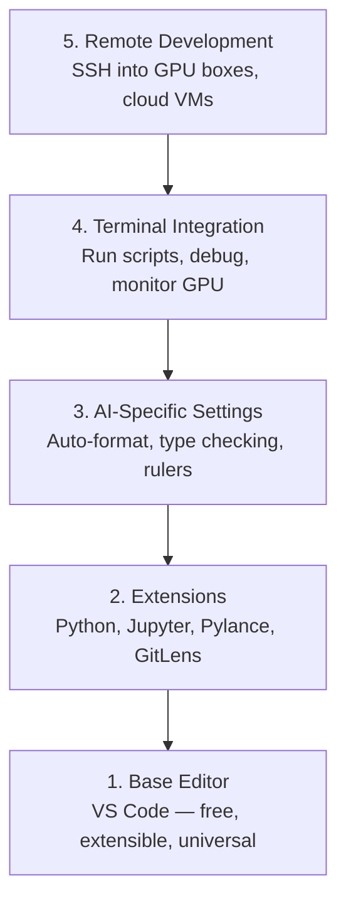

# Настройка редактора

> Ваш редактор — второй пилот. Настройте его один раз, чтобы он не мешал, а начал приносить пользу.

**Тип:** Build**Языки:** --**Предварительные требования:** Фаза 0, Урок 01**Время:** ~20 минут
## Учебные цели

- Установить VS Code с базовыми расширениями для Python, Jupyter, линтинга и удалённого SSH
- Настроить автоформатирование при сохранении, проверку типов и прокрутку вывода в ноутбуках для AI-рабочих процессов
- Настроить Remote SSH для редактирования и отладки кода на удалённых GPU-машинах так, будто они локальные
- Оценить альтернативы редактору (Cursor, Windsurf, Neovim) и их компромиссы для AI-работы

## Проблема

Вы проведёте тысячи часов внутри редактора, пиша Python, запуская ноутбуки, отлаживая циклы обучения и подключаясь по SSH к GPU-машинам. Плохо настроенный редактор превращает каждую сессию в источник трения: нет автодополнения, нет подсказок типов, нет встроенных ошибок, ручное форматирование и неудобный терминальный рабочий процесс.

Правильная настройка занимает 20 минут. Пропуск этого шага обходится вам в 20 минут каждый день.

## Концепция

Настройка редактора для инженерии ИИ требует пяти вещей:



```figure
s0-lsp-roundtrip
```

## Реализация

### Шаг 1: установка VS Code

VS Code — рекомендуемый редактор. Он бесплатный, работает на любой ОС, имеет полноценную поддержку ноутбуков Jupyter, а экосистема расширений покрывает всё, что нужно для AI-работы.

Скачайте его на [code.visualstudio.com](https://code.visualstudio.com/).

Проверьте из терминала:

```bash
code --version
```

Если на macOS команда `code` не находится, откройте VS Code, нажмите `Cmd+Shift+P`, введите «Shell Command» и выберите «Install 'code' command in PATH».

### Шаг 2: установка базовых расширений

Откройте встроенный терминал в VS Code (`` Ctrl+` `` на всех платформах) и установите расширения, важные для AI-работы:

```bash
code --install-extension ms-python.python
code --install-extension ms-python.vscode-pylance
code --install-extension ms-toolsai.jupyter
code --install-extension eamodio.gitlens
code --install-extension ms-vscode-remote.remote-ssh
code --install-extension ms-python.debugpy
code --install-extension ms-python.black-formatter
code --install-extension charliermarsh.ruff
```

Что делает каждое из них:

| Расширение | Зачем |
|-----------|-----|
| Python | Поддержка языка, обнаружение виртуальных окружений, запуск/отладка |
| Pylance | Быстрая проверка типов, автодополнение, разрешение импортов |
| Jupyter | Запуск ноутбуков внутри VS Code, обозреватель переменных |
| GitLens | Видно, кто и что изменил, встроенный git blame |
| Remote SSH | Открыть папку на удалённой GPU-машине так, будто она локальная |
| Debugpy | Пошаговая отладка для Python |
| Black Formatter | Автоформатирование при сохранении, единообразный стиль |
| Ruff | Быстрый линтинг, отлавливает типичные ошибки |

Файл `code/.vscode/extensions.json` в этом уроке содержит полный список рекомендаций. Когда вы откроете папку проекта, VS Code предложит их установить.

### Шаг 3: настройка параметров

Скопируйте параметры из `code/.vscode/settings.json` этого урока или примените их вручную через `Settings > Open Settings (JSON)`.

Ключевые параметры для AI-работы:

```jsonc
{
    "python.analysis.typeCheckingMode": "basic",
    "editor.formatOnSave": true,
    "editor.rulers": [88, 120],
    "notebook.output.scrolling": true,
    "files.autoSave": "afterDelay"
}
```

Почему это важно:

- **Проверка типов на уровне basic**: отлавливает неправильные типы аргументов до запуска. Экономит время отладки при несовпадении форм тензоров и неверных параметрах API.
- **Форматирование при сохранении**: больше никогда не думать о форматировании. Black делает это сам.
- **Линейки на 88 и 120**: Black переносит строки на 88. Отметка на 120 показывает, когда docstring'и и комментарии становятся слишком длинными.
- **Прокрутка вывода ноутбука**: циклы обучения выводят тысячи строк. Без прокрутки панель вывода взрывается.
- **Автосохранение**: вы забудете сохранить файл. Ваш тренировочный скрипт запустит устаревший код. Автосохранение это предотвращает.

### Шаг 4: интеграция с терминалом

Встроенный терминал VS Code — это место, где вы запускаете тренировочные скрипты, следите за GPU и управляете окружениями.

Настройте его правильно:

```jsonc
{
    "terminal.integrated.defaultProfile.osx": "zsh",
    "terminal.integrated.defaultProfile.linux": "bash",
    "terminal.integrated.fontSize": 13,
    "terminal.integrated.scrollback": 10000
}
```

Полезные сочетания клавиш:

| Действие | macOS | Linux/Windows |
|--------|-------|---------------|
| Переключить терминал | `` Ctrl+` `` | `` Ctrl+` `` |
| Новый терминал | `` Ctrl+Shift+` `` | `` Ctrl+Shift+` `` |
| Разделить терминал | `Cmd+\` | `Ctrl+Shift+5` |

Разделённые терминалы полезны: один — для запуска скрипта, другой — для мониторинга GPU через `nvidia-smi -l 1` или `watch -n 1 nvidia-smi`.

### Шаг 5: удалённая разработка (SSH на GPU-машины)

Это самое важное расширение для AI-работы. Вы будете запускать обучение на удалённых машинах (облачные VM, серверы лаборатории, Lambda, Vast.ai). Remote SSH позволяет открывать удалённую файловую систему, редактировать файлы, запускать терминалы и отлаживать код так, будто всё локально.

Настройка:

1. Установите расширение Remote SSH (сделано на шаге 2).
2. Нажмите `Ctrl+Shift+P` (или `Cmd+Shift+P`), введите «Remote-SSH: Connect to Host».
3. Введите `user@your-gpu-box-ip`.
4. VS Code автоматически установит свой серверный компонент на удалённой машине.

Для доступа без пароля настройте SSH-ключи:

```bash
ssh-keygen -t ed25519 -C "your-email@example.com"
ssh-copy-id user@your-gpu-box-ip
```

Добавьте хост в `~/.ssh/config` для удобства:

```
Host gpu-box
    HostName 203.0.113.50
    User ubuntu
    IdentityFile ~/.ssh/id_ed25519
    ForwardAgent yes
```

Теперь `Remote-SSH: Connect to Host > gpu-box` подключается мгновенно.

## Альтернативы

### Cursor

[cursor.com](https://cursor.com) — это форк VS Code со встроенной генерацией кода с помощью ИИ. Он использует ту же экосистему расширений и тот же формат параметров. Если вы используете Cursor, всё из этого урока по-прежнему применимо. Импортируйте те же `settings.json` и `extensions.json`.

### Windsurf

[windsurf.com](https://windsurf.com) — ещё один AI-first форк VS Code. Та же история: те же расширения, тот же формат параметров, та же поддержка Remote SSH.

### Vim/Neovim

Если вы уже используете Vim или Neovim и продуктивны в нём — оставайтесь там. Минимальная настройка для AI-работы на Python:

- **pyright** или **pylsp** для проверки типов (через Mason или ручную установку)
- **nvim-lspconfig** для интеграции с языковым сервером
- **jupyter-vim** или **molten-nvim** для выполнения кода в стиле ноутбука
- **telescope.nvim** для поиска по файлам и символам
- **none-ls.nvim** с black и ruff для форматирования и линтинга

Если вы ещё не используете Vim, не начинайте сейчас. Кривая обучения будет конкурировать с изучением инженерии ИИ. Используйте VS Code.

## Применение

С этой настройкой ваш ежедневный рабочий процесс выглядит так:

1. Откройте папку проекта в VS Code (или подключитесь через Remote SSH к GPU-машине).
2. Пишите Python в редакторе с автодополнением, подсказками типов и встроенными ошибками.
3. Запускайте ноутбуки Jupyter прямо внутри с помощью расширения Jupyter.
4. Используйте встроенный терминал для тренировочных скриптов, `uv pip install` и мониторинга GPU.
5. Просматривайте изменения с помощью GitLens перед коммитом.

## Упражнения

1. Установите VS Code и все расширения, перечисленные в шаге 2
2. Скопируйте `settings.json` из этого урока в свою конфигурацию VS Code
3. Откройте Python-файл и убедитесь, что Pylance показывает подсказки типов, а Black форматирует при сохранении
4. Если у вас есть доступ к удалённой машине, настройте Remote SSH и откройте на ней папку

## Ключевые термины

| Термин | Как говорят | Что это означает на самом деле |
|------|----------------|----------------------|
| LSP | «движок автодополнения» | Language Server Protocol: стандарт, по которому редакторы получают информацию о типах, автодополнение и диагностику от специфичного для языка сервера |
| Pylance | «плагин для Python» | Языковой сервер Python от Microsoft, использующий Pyright для проверки типов и IntelliSense |
| Remote SSH | «работа на сервере» | Расширение VS Code, запускающее лёгкий сервер на удалённой машине и передающее интерфейс на ваш локальный редактор |
| Format on save | «автопретти» | Редактор запускает форматтер (Black, Ruff) при каждом сохранении, поэтому стиль кода всегда единообразен |
