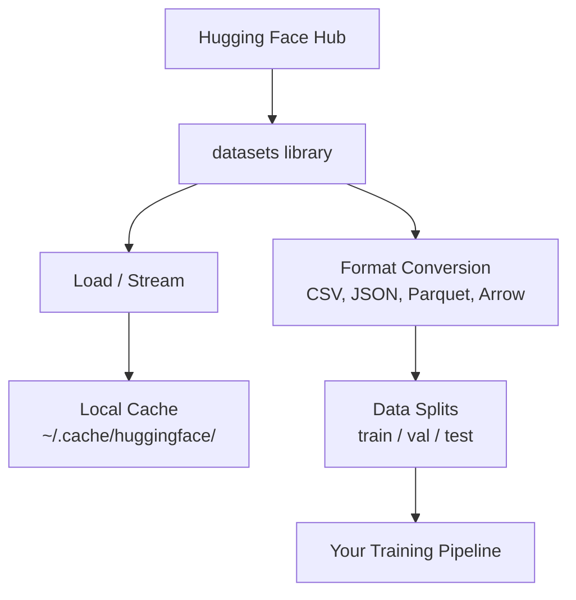

# Управление данными

> Данные — это топливо. То, как вы ими управляете, определяет скорость вашего движения.

**Тип:** Build**Язык:** Python
**Предварительные требования:** Фаза 0, Урок 01**Время:** ~45 минут
## Учебные цели

- Загружать, стримить и кешировать наборы данных с помощью библиотеки Hugging Face `datasets`
- Конвертировать между форматами CSV, JSON, Parquet и Arrow и объяснять их компромиссы
- Создавать воспроизводимые разбиения train/validation/test с фиксированными случайными seed
- Управлять большими файлами моделей и наборов данных с помощью `.gitignore`, Git LFS или DVC

## Проблема

Каждый AI-проект начинается с данных. Нужно найти наборы данных, скачать их, сконвертировать между форматами, разбить для обучения и оценки и версионировать, чтобы эксперименты были воспроизводимы. Делать это вручную каждый раз — медленно и чревато ошибками. Нужен повторяемый рабочий процесс.

## Концепция



Библиотека Hugging Face `datasets` — стандартный способ загружать данные для AI-работы. Она из коробки обрабатывает загрузку, кеширование, конвертацию форматов и стриминг.

```figure
s0-data-pipeline
```

## Реализация

### Шаг 1: установка библиотеки datasets

```bash
pip install datasets huggingface_hub
```

### Шаг 2: загрузка набора данных

```python
from datasets import load_dataset

dataset = load_dataset("stanfordnlp/imdb")
print(dataset)
print(dataset["train"][0])
```

Это скачивает набор данных IMDB с отзывами о фильмах. После первой загрузки данные загружаются из кеша по пути `~/.cache/huggingface/datasets/`.

### Шаг 3: стриминг больших наборов данных

Некоторые наборы данных слишком велики, чтобы поместиться на диск. Стриминг загружает их построчно без скачивания всего набора целиком.

```python
dataset = load_dataset("wikimedia/wikipedia", "20220301.en", split="train", streaming=True)

for i, example in enumerate(dataset):
    print(example["title"])
    if i >= 4:
        break
```

Стриминг даёт вам `IterableDataset`. Вы обрабатываете строки по мере их поступления. Потребление памяти остаётся постоянным независимо от размера набора данных.

### Шаг 4: форматы наборов данных

Библиотека `datasets` использует Apache Arrow под капотом. Вы можете конвертировать в другие форматы в зависимости от того, что нужно вашему конвейеру.

```python
dataset = load_dataset("stanfordnlp/imdb", split="train")

dataset.to_csv("imdb_train.csv")
dataset.to_json("imdb_train.json")
dataset.to_parquet("imdb_train.parquet")
```

Сравнение форматов:

| Формат | Размер | Скорость чтения | Лучше всего для |
|--------|------|-----------|----------|
| CSV | Большой | Медленно | Читаемость человеком, электронные таблицы |
| JSON | Большой | Медленно | API, вложенные данные |
| Parquet | Малый | Быстро | Аналитика, колоночные запросы |
| Arrow | Малый | Быстрее всего | Обработка в памяти (что `datasets` использует внутри) |

Для AI-работы Parquet — лучший формат хранения. Arrow — то, с чем вы работаете в памяти. CSV и JSON — для обмена данными.

### Шаг 5: разбиения данных

Каждому ML-проекту нужны три разбиения:

- **Train**: на этом модель обучается (обычно 80%)
- **Validation**: по этому вы проверяете прогресс во время обучения (обычно 10%)
- **Test**: финальная оценка после завершения обучения (обычно 10%)

Некоторые наборы данных поставляются уже разбитыми. Когда это не так, разбивайте сами:

```python
dataset = load_dataset("stanfordnlp/imdb", split="train")

split = dataset.train_test_split(test_size=0.2, seed=42)
train_val = split["train"].train_test_split(test_size=0.125, seed=42)

train_ds = train_val["train"]
val_ds = train_val["test"]
test_ds = split["test"]

print(f"Train: {len(train_ds)}, Val: {len(val_ds)}, Test: {len(test_ds)}")
```

Всегда задавайте seed для воспроизводимости. Один и тот же seed каждый раз даёт одно и то же разбиение.

### Шаг 6: загрузка и кеширование моделей

Модели — большие файлы. Библиотека `huggingface_hub` отвечает за их загрузку и кеширование.

```python
from huggingface_hub import hf_hub_download, snapshot_download

model_path = hf_hub_download(
    repo_id="sentence-transformers/all-MiniLM-L6-v2",
    filename="config.json"
)
print(f"Cached at: {model_path}")

model_dir = snapshot_download("sentence-transformers/all-MiniLM-L6-v2")
print(f"Full model at: {model_dir}")
```

Модели кешируются в `~/.cache/huggingface/hub/`. После загрузки они мгновенно доступны при последующих запусках.

### Шаг 7: работа с большими файлами

Веса моделей и большие наборы данных не должны попадать в git. Три варианта:

**Вариант A: .gitignore (самый простой)**

```
*.bin
*.safetensors
*.pt
*.onnx
data/*.parquet
data/*.csv
models/
```

**Вариант B: Git LFS (отслеживание больших файлов в git)**

```bash
git lfs install
git lfs track "*.bin"
git lfs track "*.safetensors"
git add .gitattributes
```

Git LFS хранит указатели в вашем репозитории, а сами файлы — на отдельном сервере. GitHub бесплатно даёт 1 ГБ.

**Вариант C: DVC (система контроля версий данных)**

```bash
pip install dvc
dvc init
dvc add data/training_set.parquet
git add data/training_set.parquet.dvc data/.gitignore
git commit -m "Track training data with DVC"
```

DVC создаёт небольшие файлы `.dvc`, указывающие на ваши данные. Сами данные хранятся в S3, GCS или другом удалённом хранилище.

| Подход | Сложность | Лучше всего для |
|----------|-----------|----------|
| .gitignore | Низкая | Личные проекты, скачанные данные, которые можно заново получить |
| Git LFS | Средняя | Команды, делящиеся весами моделей через git |
| DVC | Высокая | Воспроизводимые эксперименты, большие наборы данных, команды |

Для этого курса `.gitignore` достаточно. Используйте DVC, когда нужно воспроизводить точные эксперименты на разных машинах.

### Шаг 8: паттерны хранения

**Локальное хранение** подходит для наборов данных размером до ~10 ГБ. Кеш HF обрабатывает это автоматически.

**Облачное хранение** — для всего более крупного или общего для нескольких машин:

```python
import os

local_path = os.path.expanduser("~/.cache/huggingface/datasets/")

# s3_path = "s3://my-bucket/datasets/"
# gcs_path = "gs://my-bucket/datasets/"
```

DVC напрямую интегрируется с S3 и GCS:

```bash
dvc remote add -d myremote s3://my-bucket/dvc-store
dvc push
```

Для этого курса локального хранения достаточно. Облачное хранение становится актуальным, когда вы дообучаете модели на удалённых GPU-инстансах.

## Наборы данных, используемые в этом курсе

| Набор данных | Уроки | Размер | Чему учит |
|---------|---------|------|----------------|
| IMDB | Токенизация, классификация | 84 MB | Основы классификации текста |
| WikiText | Языковое моделирование | 181 MB | Предсказание следующего токена |
| SQuAD | Системы ответов на вопросы | 35 MB | Ответы на вопросы, спаны |
| Common Crawl (subset) | Эмбеддинги | Варьируется | Крупномасштабная обработка текста |
| MNIST | Основы компьютерного зрения | 21 MB | Основы классификации изображений |
| COCO (subset) | Мультимодальность | Варьируется | Пары изображение-текст |

Скачивать всё это сейчас не обязательно. Каждый урок указывает, что ему нужно.

## Применение

Запустите вспомогательный скрипт, чтобы убедиться, что всё работает:

```bash
python code/data_utils.py
```

Он скачивает небольшой набор данных, конвертирует его, разбивает и выводит сводку.

## Результат

Этот урок производит:
- `code/data_utils.py` — переиспользуемая утилита загрузки и кеширования данных
- `outputs/prompt-data-helper.md` — промпт для поиска подходящего набора данных под задачу

## Упражнения

1. Загрузите набор данных `glue` с конфигурацией `mrpc` и просмотрите первые 5 примеров
2. Стримите набор данных `c4` и посчитайте, сколько примеров вы можете обработать за 10 секунд
3. Сконвертируйте набор данных в Parquet и сравните размер файла с CSV
4. Создайте разбиение train/val/test 70/15/15 с фиксированным seed и проверьте размеры

## Ключевые термины

| Термин | Как говорят | Что это означает на самом деле |
|------|----------------|----------------------|
| Dataset split | «тренировочные данные» | Именованное подмножество (train/val/test), используемое на разных этапах жизненного цикла ML |
| Streaming | «ленивая загрузка» | Обработка данных построчно из удалённого источника без скачивания всего набора данных |
| Parquet | «сжатый CSV» | Колоночный файловый формат, оптимизированный для аналитических запросов и эффективности хранения |
| Arrow | «быстрый dataframe» | Колоночный формат в памяти, используемый библиотекой datasets внутри для чтения без копирования |
| Git LFS | «git для больших файлов» | Расширение, хранящее большие файлы вне git-репозитория, оставляя указатели в системе контроля версий |
| DVC | «git для данных» | Система контроля версий для наборов данных и моделей, интегрирующаяся с облачным хранилищем |
| Cache | «уже скачано» | Локальная копия ранее полученных данных, по умолчанию хранящаяся в ~/.cache/huggingface/ |
