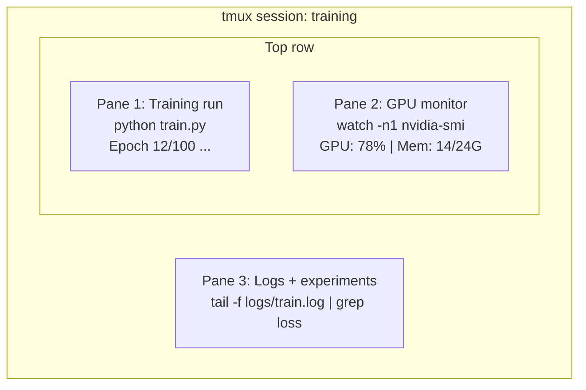

# Терминал и оболочка

> Терминал — место, где живут AI-инженеры. Освойтесь здесь.

**Тип:** Learn**Языки:** --**Предварительные требования:** Фаза 0, Урок 01**Время:** ~35 минут
## Учебные цели

- Использовать конвейеры, перенаправления и `grep` для фильтрации и обработки логов обучения из командной строки
- Создавать постоянные сессии tmux с несколькими панелями для параллельного обучения и мониторинга GPU
- Отслеживать системные и GPU-ресурсы с помощью `htop`, `nvtop` и `nvidia-smi`
- Передавать файлы между локальной и удалённой машинами с помощью SSH, `scp` и `rsync`

## Проблема

Вы проведёте в терминале больше времени, чем в любом редакторе. Тренировочные запуски, мониторинг GPU, чтение логов в реальном времени, удалённые SSH-сессии, управление окружениями. Каждый AI-рабочий процесс затрагивает оболочку. Если вы медлительны здесь — вы медлительны везде.

Этот урок охватывает навыки работы с терминалом, важные для AI-работы. Никакой истории Unix. Никакого глубокого погружения в скриптинг на Bash. Только то, что нужно.

## Концепция



Три процесса работают одновременно. Один терминал. Вы можете отсоединиться, уйти домой, подключиться обратно по SSH и присоединиться снова. Обучение продолжает работать.

```figure
s0-shell-pipeline
```

## Реализация

### Шаг 1: узнайте свою оболочку

Проверьте, какую оболочку вы используете:

```bash
echo $SHELL
```

Большинство систем используют `bash` или `zsh`. Обе подходят. Команды в этом курсе работают в любой из них.

Что важно знать:

```bash
# Move around
cd ~/projects/ai-engineering-from-scratch
pwd
ls -la

# History search (most useful shortcut you'll learn)
# Ctrl+R then type part of a previous command
# Press Ctrl+R again to cycle through matches

# Clear terminal
clear   # or Ctrl+L

# Cancel a running command
# Ctrl+C

# Suspend a running command (resume with fg)
# Ctrl+Z
```

### Шаг 2: конвейеры и перенаправления

Конвейеры соединяют команды между собой. Так вы обрабатываете логи, фильтруете вывод и связываете инструменты в цепочки. Вы будете использовать это постоянно.

```bash
# Count how many times "loss" appears in a log
cat train.log | grep "loss" | wc -l

# Extract just the loss values from training output
grep "loss:" train.log | awk '{print $NF}' > losses.txt

# Watch a log file update in real time, filtering for errors
tail -f train.log | grep --line-buffered "ERROR"

# Sort experiments by final accuracy
grep "final_accuracy" results/*.log | sort -t= -k2 -n -r

# Redirect stdout and stderr to separate files
python train.py > output.log 2> errors.log

# Redirect both to the same file
python train.py > train_full.log 2>&1
```

Три перенаправления, которые вам нужны:

| Символ | Что он делает |
|--------|-------------|
| `>` | Записать stdout в файл (перезаписать) |
| `>>` | Дописать stdout в файл |
| `2>` | Записать stderr в файл |
| `2>&1` | Направить stderr туда же, куда и stdout |
| `\|` | Передать stdout одной команды как stdin следующей |

### Шаг 3: фоновые процессы

Тренировочные запуски длятся часами. Вы не хотите держать терминал открытым всё это время.

```bash
# Run in background (output still goes to terminal)
python train.py &

# Run in background, immune to hangup (closing terminal won't kill it)
nohup python train.py > train.log 2>&1 &

# Check what's running in background
jobs
ps aux | grep train.py

# Bring a background job to foreground
fg %1

# Kill a background process
kill %1
# or find its PID and kill that
kill $(pgrep -f "train.py")
```

Разница между `&`, `nohup` и `screen`/`tmux`:

| Метод | Переживает закрытие терминала? | Можно присоединиться заново? |
|--------|-------------------------|---------------|
| `command &` | Нет | Нет |
| `nohup command &` | Да | Нет (смотрите файл лога) |
| `screen` / `tmux` | Да | Да |

Для всего, что длится дольше нескольких минут, используйте tmux.

### Шаг 4: tmux

tmux позволяет создавать постоянные терминальные сессии с несколькими панелями. Это самый полезный инструмент для управления тренировочными запусками.

```bash
# Install
# macOS
brew install tmux
# Ubuntu
sudo apt install tmux

# Start a named session
tmux new -s training

# Split horizontally
# Ctrl+B then "

# Split vertically
# Ctrl+B then %

# Navigate between panes
# Ctrl+B then arrow keys

# Detach (session keeps running)
# Ctrl+B then d

# Reattach
tmux attach -t training

# List sessions
tmux ls

# Kill a session
tmux kill-session -t training
```

Типичная сессия AI-рабочего процесса:

```bash
tmux new -s train

# Pane 1: start training
python train.py --epochs 100 --lr 1e-4

# Ctrl+B, " to split, then run GPU monitor
watch -n1 nvidia-smi

# Ctrl+B, % to split vertically, tail the logs
tail -f logs/experiment.log

# Now detach with Ctrl+B, d
# SSH out, go get coffee, come back
# tmux attach -t train
```

### Шаг 5: мониторинг с htop и nvtop

```bash
# System processes (better than top)
htop

# GPU processes (if you have NVIDIA GPU)
# Install: sudo apt install nvtop (Ubuntu) or brew install nvtop (macOS)
nvtop

# Quick GPU check without nvtop
nvidia-smi

# Watch GPU usage update every second
watch -n1 nvidia-smi

# See which processes are using the GPU
nvidia-smi --query-compute-apps=pid,name,used_memory --format=csv
```

Сочетания клавиш `htop`, которые вы будете использовать:
- `F6` или `>` для сортировки по столбцу (сортировка по памяти, чтобы найти утечки памяти)
- `F5` для переключения в древовидный вид (видны дочерние процессы)
- `F9` для завершения процесса
- `/` для поиска по имени процесса

### Шаг 6: SSH для удалённых GPU-машин

Когда вы арендуете облачный GPU (Lambda, RunPod, Vast.ai), вы подключаетесь по SSH.

```bash
# Basic connection
ssh user@gpu-box-ip

# With a specific key
ssh -i ~/.ssh/my_gpu_key user@gpu-box-ip

# Copy files to remote
scp model.pt user@gpu-box-ip:~/models/

# Copy files from remote
scp user@gpu-box-ip:~/results/metrics.json ./

# Sync a whole directory (faster for many files)
rsync -avz ./data/ user@gpu-box-ip:~/data/

# Port forward (access remote Jupyter/TensorBoard locally)
ssh -L 8888:localhost:8888 user@gpu-box-ip
# Now open localhost:8888 in your browser

# SSH config for convenience
# Add to ~/.ssh/config:
# Host gpu
#     HostName 192.168.1.100
#     User ubuntu
#     IdentityFile ~/.ssh/gpu_key
#
# Then just:
# ssh gpu
```

### Шаг 7: полезные алиасы для AI-работы

Добавьте их в `~/.bashrc` или `~/.zshrc`:

```bash
source phases/00-setup-and-tooling/10-terminal-and-shell/code/shell_aliases.sh
```

Или скопируйте те, что вам нужны. Ключевые алиасы:

```bash
# GPU status at a glance
alias gpu='nvidia-smi --query-gpu=index,name,utilization.gpu,memory.used,memory.total,temperature.gpu --format=csv,noheader'

# Kill all Python training processes
alias killtraining='pkill -f "python.*train"'

# Quick virtual environment activate
alias ae='source .venv/bin/activate'

# Watch training loss
alias watchloss='tail -f logs/*.log | grep --line-buffered "loss"'
```

Полный набор смотрите в `code/shell_aliases.sh`.

### Шаг 8: типичные терминальные паттерны для AI

Они регулярно встречаются на практике:

```bash
# Run training, log everything, notify when done
python train.py 2>&1 | tee train.log; echo "DONE" | mail -s "Training complete" you@email.com

# Compare two experiment logs side by side
diff <(grep "accuracy" exp1.log) <(grep "accuracy" exp2.log)

# Find the largest model files (clean up disk space)
find . -name "*.pt" -o -name "*.safetensors" | xargs du -h | sort -rh | head -20

# Download a model from Hugging Face
wget https://huggingface.co/model/resolve/main/model.safetensors

# Untar a dataset
tar xzf dataset.tar.gz -C ./data/

# Count lines in all Python files (see how big your project is)
find . -name "*.py" | xargs wc -l | tail -1

# Check disk space (training data fills disks fast)
df -h
du -sh ./data/*

# Environment variable check before training
env | grep -i cuda
env | grep -i torch
```

## Применение

Вот когда каждый инструмент вступает в игру в этом курсе:

| Инструмент | Когда используется |
|------|----------------|
| tmux | Каждый тренировочный запуск (фазы 3+) |
| `tail -f` + `grep` | Мониторинг логов обучения |
| `nohup` / `&` | Быстрые фоновые задачи |
| `htop` / `nvtop` | Отладка медленного обучения, ошибок OOM |
| SSH + `rsync` | Работа на облачных GPU |
| Конвейеры и перенаправления | Обработка результатов экспериментов |
| Алиасы | Экономия времени на повторяющихся командах |

## Упражнения

1. Установите tmux, создайте сессию с тремя панелями и запустите `htop` в одной, `watch -n1 date` в другой, а Python-скрипт — в третьей. Отсоединитесь и присоединитесь заново.
2. Добавьте алиасы из `code/shell_aliases.sh` в конфигурацию своей оболочки и перезагрузите её командой `source ~/.zshrc` (или `~/.bashrc`).
3. Создайте фейковый лог обучения командой `for i in $(seq 1 100); do echo "epoch $i loss: $(echo "scale=4; 1/$i" | bc)"; sleep 0.1; done > fake_train.log`, а затем используйте `grep`, `tail` и `awk`, чтобы извлечь только значения потерь.
4. Настройте запись в SSH-конфиге для сервера, к которому у вас есть доступ (или используйте `localhost`, чтобы потренироваться в синтаксисе).

## Ключевые термины

| Термин | Как говорят | Что это означает на самом деле |
|------|----------------|----------------------|
| Shell | «терминал» | Программа, которая интерпретирует ваши команды (bash, zsh, fish) |
| tmux | «терминальный мультиплексор» | Программа, позволяющая запускать несколько терминальных сессий внутри одного окна и отсоединяться/присоединяться заново |
| Pipe | «эта штука с чертой» | Оператор `\|`, передающий вывод одной команды как ввод другой |
| PID | «ID процесса» | Уникальный номер, присваиваемый каждому запущенному процессу, используемый для мониторинга или завершения |
| nohup | «без обрыва связи» | Запускает команду, устойчивую к сигналу разрыва соединения, поэтому закрытие терминала её не убивает |
| SSH | «подключение к серверу» | Secure Shell, зашифрованный протокол для выполнения команд на удалённой машине |
