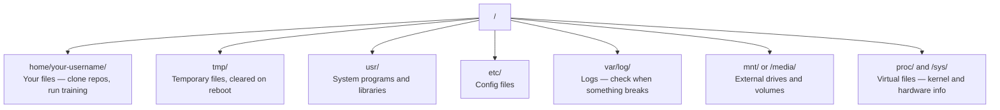

# Linux для ИИ

> Большая часть ИИ работает на Linux. Вам нужно знать достаточно, чтобы не застрять.

**Тип:** Learn**Языки:** --**Предварительные требования:** Фаза 0, Урок 01**Время:** ~30 минут
## Учебные цели

- Перемещаться по файловой системе Linux и выполнять основные файловые операции из командной строки
- Управлять правами доступа к файлам с помощью `chmod` и `chown`, чтобы устранять ошибки «Permission denied»
- Устанавливать системные пакеты с помощью `apt` и настраивать новую GPU-машину для работы с ИИ
- Определять различия между macOS и Linux, которые обычно сбивают с толку разработчиков, работающих на удалённых машинах

## Проблема

Вы разрабатываете на macOS или Windows. Но как только вы подключаетесь по SSH к облачной GPU-машине, арендуете инстанс Lambda или поднимаете машину EC2, вы оказываетесь в Ubuntu. Терминал — ваш единственный интерфейс. Нет ни Finder, ни Explorer, ни графического интерфейса. Если вы не умеете перемещаться по файловой системе, устанавливать пакеты и управлять процессами из командной строки, вы застрянете, оплачивая часы простоя GPU, пока гуглите «как распаковать файл в Linux».

Это руководство по выживанию. Оно охватывает именно то, что нужно для работы на удалённой машине с Linux при работе с ИИ. Ничего лишнего.

## Структура файловой системы

Linux организует всё под единым корнем `/`. Здесь нет `C:\` или `/Volumes`. Каталоги, с которыми вы реально будете иметь дело:



Ваш домашний каталог — это `~` или `/home/your-username`. Почти всё, что вы делаете, происходит здесь.

## Основные команды

Это 15 команд, которые покрывают 95% того, что вам понадобится на удалённой GPU-машине.

### Перемещение

```bash
pwd                         # Where am I?
ls                          # What's here?
ls -la                      # What's here, including hidden files with details?
cd /path/to/dir             # Go there
cd ~                        # Go home
cd ..                       # Go up one level
```

### Файлы и каталоги

```bash
mkdir my-project            # Create a directory
mkdir -p a/b/c              # Create nested directories in one shot

cp file.txt backup.txt      # Copy a file
cp -r src/ src-backup/      # Copy a directory (recursive)

mv old.txt new.txt          # Rename a file
mv file.txt /tmp/           # Move a file

rm file.txt                 # Delete a file (no trash, it's gone)
rm -rf my-dir/              # Delete a directory and everything inside
```

`rm -rf` — необратимая операция. Отменить её нельзя. Дважды проверьте путь, прежде чем нажать enter.

### Чтение файлов

```bash
cat file.txt                # Print entire file
head -20 file.txt           # First 20 lines
tail -20 file.txt           # Last 20 lines
tail -f log.txt             # Follow a log file in real time (Ctrl+C to stop)
less file.txt               # Scroll through a file (q to quit)
```

### Поиск

```bash
grep "error" training.log           # Find lines containing "error"
grep -r "learning_rate" .           # Search all files in current directory
grep -i "cuda" config.yaml          # Case-insensitive search

find . -name "*.py"                 # Find all Python files under current dir
find . -name "*.ckpt" -size +1G     # Find checkpoint files larger than 1GB
```

## Права доступа

У каждого файла в Linux есть владелец и биты прав доступа. Вы столкнётесь с этим, когда скрипты не будут запускаться или вы не сможете писать в каталог.

```bash
ls -l train.py
# -rwxr-xr-- 1 user group 2048 Mar 19 10:00 train.py
#  ^^^             owner permissions: read, write, execute
#     ^^^          group permissions: read, execute
#        ^^        everyone else: read only
```

Типичные исправления:

```bash
chmod +x train.sh           # Make a script executable
chmod 755 deploy.sh         # Owner: full, others: read+execute
chmod 644 config.yaml       # Owner: read+write, others: read only

chown user:group file.txt   # Change who owns a file (needs sudo)
```

Когда появляется «Permission denied», это почти всегда проблема прав доступа. `chmod +x` или `sudo` устранят большинство таких случаев.

## Управление пакетами (apt)

Ubuntu использует `apt`. Так вы устанавливаете программное обеспечение на уровне системы.

```bash
sudo apt update             # Refresh the package list (always do this first)
sudo apt install -y htop    # Install a package (-y skips confirmation)
sudo apt install -y build-essential  # C compiler, make, etc. Needed by many Python packages
sudo apt install -y tmux    # Terminal multiplexer (keep sessions alive after disconnect)

apt list --installed        # What's installed?
sudo apt remove htop        # Uninstall
```

Типичные пакеты, которые вы установите на новой GPU-машине:

```bash
sudo apt update && sudo apt install -y \
    build-essential \
    git \
    curl \
    wget \
    tmux \
    htop \
    unzip \
    python3-venv
```

## Пользователи и sudo

Обычно вы входите как обычный пользователь. Некоторые операции требуют доступа root (администратора).

```bash
whoami                      # What user am I?
sudo command                # Run a single command as root
sudo su                     # Become root (exit to go back, use sparingly)
```

На облачных GPU-инстансах вы обычно единственный пользователь и уже имеете доступ sudo. Не выполняйте всё от root. Используйте sudo только при необходимости.

## Процессы и systemd

Когда ваше обучение зависает или нужно проверить, что запущено:

```bash
htop                        # Interactive process viewer (q to quit)
ps aux | grep python        # Find running Python processes
kill 12345                  # Gracefully stop process with PID 12345
kill -9 12345               # Force kill (use when graceful doesn't work)
nvidia-smi                  # GPU processes and memory usage
```

systemd управляет сервисами (фоновыми демонами). Вы будете использовать его при запуске серверов инференса:

```bash
sudo systemctl start nginx          # Start a service
sudo systemctl stop nginx           # Stop it
sudo systemctl restart nginx        # Restart it
sudo systemctl status nginx         # Check if it's running
sudo systemctl enable nginx         # Start automatically on boot
```

## Дисковое пространство

На GPU-машинах часто ограничено дисковое пространство. Модели и наборы данных быстро его заполняют.

```bash
df -h                       # Disk usage for all mounted drives
df -h /home                 # Disk usage for /home specifically

du -sh *                    # Size of each item in current directory
du -sh ~/.cache             # Size of your cache (pip, huggingface models land here)
du -sh /data/checkpoints/   # Check how big your checkpoints are

# Find the biggest space hogs
du -h --max-depth=1 / 2>/dev/null | sort -hr | head -20
```

Типичные способы освободить место:

```bash
# Clear pip cache
pip cache purge

# Clear apt cache
sudo apt clean

# Remove old checkpoints you don't need
rm -rf checkpoints/epoch_01/ checkpoints/epoch_02/
```

## Сеть

Вы будете скачивать модели, передавать файлы и обращаться к API из командной строки.

```bash
# Download files
wget https://example.com/model.bin                   # Download a file
curl -O https://example.com/data.tar.gz              # Same thing with curl
curl -s https://api.example.com/health | python3 -m json.tool  # Hit an API, pretty-print JSON

# Transfer files between machines
scp model.bin user@remote:/data/                     # Copy file to remote machine
scp user@remote:/data/results.csv .                  # Copy file from remote to local
scp -r user@remote:/data/checkpoints/ ./local-dir/   # Copy directory

# Sync directories (faster than scp for large transfers, resumes on failure)
rsync -avz --progress ./data/ user@remote:/data/
rsync -avz --progress user@remote:/results/ ./results/
```

Используйте `rsync` вместо `scp` для всего крупного. Он передаёт только изменённые байты и справляется с прерванными соединениями.

## tmux: сохраняем сессии активными

Когда вы подключаетесь по SSH к удалённой машине, закрытие ноутбука убивает ваше обучение. tmux это предотвращает.

```bash
tmux new -s train           # Start a new session named "train"
# ... start your training, then:
# Ctrl+B, then D            # Detach (training keeps running)

tmux ls                     # List sessions
tmux attach -t train        # Reattach to session

# Inside tmux:
# Ctrl+B, then %            # Split pane vertically
# Ctrl+B, then "            # Split pane horizontally
# Ctrl+B, then arrow keys   # Switch between panes
```

Всегда запускайте длительные задачи обучения внутри tmux. Всегда.

## WSL2 для пользователей Windows

Если вы на Windows, WSL2 даёт вам настоящую среду Linux без двойной загрузки.

```bash
# In PowerShell (admin)
wsl --install -d Ubuntu-24.04

# After restart, open Ubuntu from Start menu
sudo apt update && sudo apt upgrade -y
```

WSL2 запускает настоящее ядро Linux. Всё, что описано в этом уроке, работает внутри него. Ваши файлы Windows находятся в `/mnt/c/Users/YourName/` изнутри WSL.

Проброс GPU работает при установленных драйверах NVIDIA на стороне Windows. Установите драйвер NVIDIA для Windows (не для Linux), и CUDA станет доступна внутри WSL2.

## Подводные камни: от macOS к Linux

Вещи, которые собьют вас с толку, если вы пришли из macOS:

| macOS | Linux | Примечания |
|-------|-------|-------|
| `brew install` | `sudo apt install` | Иногда разные названия пакетов. `brew install htop` и `sudo apt install htop` работают одинаково, но `brew install readline` и `sudo apt install libreadline-dev` — нет. |
| `open file.txt` | `xdg-open file.txt` | Но на удалённой машине у вас не будет графического интерфейса. Используйте `cat` или `less`. |
| `pbcopy` / `pbpaste` | Недоступно | Передача в буфер обмена / из буфера обмена по SSH не существует. |
| `~/.zshrc` | `~/.bashrc` | macOS по умолчанию использует zsh. Большинство серверов Linux используют bash. |
| `/opt/homebrew/` | `/usr/bin/`, `/usr/local/bin/` | Бинарные файлы находятся в разных местах. |
| `sed -i '' 's/a/b/' file` | `sed -i 's/a/b/' file` | macOS-версии sed нужна пустая строка после `-i`. В Linux — нет. |
| Файловая система без учёта регистра | Файловая система с учётом регистра | `Model.py` и `model.py` — это два разных файла в Linux. |
| Окончания строк `\n` | Окончания строк `\n` | Так же. Но Windows использует `\r\n`, что ломает bash-скрипты. Запустите `dos2unix`, чтобы исправить. |

## Карточка быстрого доступа

```
Navigation:     pwd, ls, cd, find
Files:          cp, mv, rm, mkdir, cat, head, tail, less
Search:         grep, find
Permissions:    chmod, chown, sudo
Packages:       apt update, apt install
Processes:      htop, ps, kill, nvidia-smi
Services:       systemctl start/stop/restart/status
Disk:           df -h, du -sh
Network:        curl, wget, scp, rsync
Sessions:       tmux new/attach/detach
```

```figure
s0-process-fork
```

## Упражнения

1. Подключитесь по SSH к любой машине с Linux (или откройте WSL2) и перейдите в свой домашний каталог. Создайте каталог проекта, создайте в нём три пустых файла с помощью `touch`, затем выведите их список с помощью `ls -la`.
2. Установите `htop` через apt, запустите его и определите, какой процесс использует больше всего памяти.
3. Запустите сессию tmux, выполните в ней `sleep 300`, отключитесь, выведите список сессий и снова подключитесь.
4. Используйте `df -h`, чтобы проверить доступное дисковое пространство, затем используйте `du -sh ~/.cache/*`, чтобы найти, что занимает место в вашем кеше.
5. Передайте файл с локальной машины на удалённую с помощью `scp`, затем выполните ту же передачу с помощью `rsync` и сравните впечатления.
