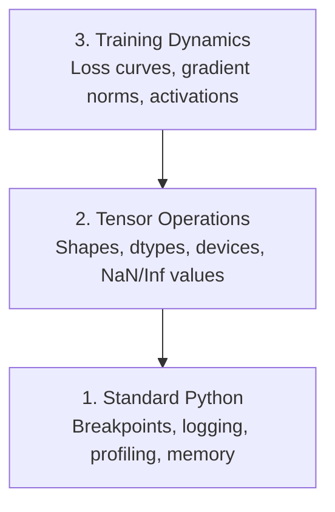

# Отладка и профилирование

> Худшие баги в ИИ не приводят к падению. Они тихо обучаются на мусоре и показывают красивую кривую потерь.

**Тип:** Build**Язык:** Python
**Предварительные требования:** Урок 1 (Dev Environment), basic PyTorch familiarity**Время:** ~60 минут
## Учебные цели

- Использовать условный `breakpoint()` и `debug_print` для проверки форм тензоров, типов данных и значений NaN в процессе обучения
- Профилировать циклы обучения с помощью `cProfile`, `line_profiler` и `tracemalloc`, чтобы находить узкие места
- Обнаруживать типичные ошибки в ИИ: несовпадение форм, NaN в функции потерь, утечку данных и тензоры на неверном устройстве
- Настроить TensorBoard для визуализации кривых потерь, гистограмм весов и распределений градиентов

## Проблема

Код ИИ падает иначе, чем обычный код. Веб-приложение падает со стектрейсом. Неправильно настроенный цикл обучения работает 8 часов, сжигает $200 на GPU-время и выдаёт модель, которая предсказывает среднее значение для любого входа. Код ни разу не выдал ошибку. Баг заключался в тензоре на неверном устройстве, забытом `.detach()` или в утечке меток в признаки.

Вам нужны инструменты отладки, которые ловят такие тихие сбои до того, как они потратят впустую ваше время и вычислительные ресурсы.

## Концепция

Отладка ИИ работает на трёх уровнях:



Большинство людей сразу переходят к уровню 3 (разглядывание TensorBoard). Но 80% ошибок в ИИ живут на уровнях 1 и 2.

```figure
s0-flame-hot
```

## Создаём

### Часть 1: отладка через print (да, это работает)

Отладку через print принято недооценивать. Напрасно. Для кода с тензорами точечный вызов print превосходит пошаговое исполнение в отладчике, потому что вам нужно увидеть формы, типы данных и диапазоны значений одновременно.

```python
def debug_print(name, tensor):
    print(f"{name}: shape={tensor.shape}, dtype={tensor.dtype}, "
          f"device={tensor.device}, "
          f"min={tensor.min().item():.4f}, max={tensor.max().item():.4f}, "
          f"mean={tensor.mean().item():.4f}, "
          f"has_nan={tensor.isnan().any().item()}")
```

Вызывайте это после каждой подозрительной операции. Когда баг найден, удалите print-вызовы. Просто.

### Часть 2: отладчик Python (pdb и breakpoint)

Встроенный отладчик недооценён для работы с ИИ. Вставьте `breakpoint()` в свой цикл обучения и исследуйте тензоры интерактивно.

```python
def training_step(model, batch, criterion, optimizer):
    inputs, labels = batch
    outputs = model(inputs)
    loss = criterion(outputs, labels)

    if loss.item() > 100 or torch.isnan(loss):
        breakpoint()

    loss.backward()
    optimizer.step()
```

Когда отладчик активируется, полезные команды:

- `p outputs.shape` — проверить формы
- `p loss.item()` — посмотреть значение функции потерь
- `p torch.isnan(outputs).sum()` — посчитать NaN
- `p model.fc1.weight.grad` — проверить градиенты
- `c` — продолжить, `q` — выйти

Это условная отладка. Вы останавливаетесь только тогда, когда что-то выглядит неправильно. Для запуска обучения на 10 000 шагов это имеет значение.

### Часть 3: логирование в Python

Замените print-вызовы логированием, когда отладка выходит за рамки быстрой проверки.

```python
import logging

logging.basicConfig(
    level=logging.INFO,
    format="%(asctime)s [%(levelname)s] %(message)s",
    handlers=[
        logging.FileHandler("training.log"),
        logging.StreamHandler()
    ]
)
logger = logging.getLogger(__name__)

logger.info("Starting training: lr=%.4f, batch_size=%d", lr, batch_size)
logger.warning("Loss spike detected: %.4f at step %d", loss.item(), step)
logger.error("NaN loss at step %d, stopping", step)
```

Логирование даёт вам временные метки, уровни серьёзности и вывод в файл. Когда запуск обучения падает в 3 часа ночи, вам нужен файл лога, а не вывод терминала, который уже прокрутился за пределы экрана.

### Часть 4: замер времени участков кода

Знание того, куда уходит время, — первый шаг к оптимизации.

```python
import time

class Timer:
    def __init__(self, name=""):
        self.name = name

    def __enter__(self):
        self.start = time.perf_counter()
        return self

    def __exit__(self, *args):
        elapsed = time.perf_counter() - self.start
        print(f"[{self.name}] {elapsed:.4f}s")

with Timer("data loading"):
    batch = next(dataloader_iter)

with Timer("forward pass"):
    outputs = model(batch)

with Timer("backward pass"):
    loss.backward()
```

Типичная находка: загрузка данных занимает 60% времени обучения. Решение — `num_workers > 0` в вашем DataLoader, а не более быстрый GPU.

### Часть 5: cProfile и line_profiler

Когда нужно больше, чем ручные таймеры:

```bash
python -m cProfile -s cumtime train.py
```

Это показывает каждый вызов функции, отсортированный по совокупному времени. Для построчного профилирования:

```bash
pip install line_profiler
```

```python
@profile
def train_step(model, data, target):
    output = model(data)
    loss = F.cross_entropy(output, target)
    loss.backward()
    return loss

# Run with: kernprof -l -v train.py
```

### Часть 6: профилирование памяти

#### Память CPU с tracemalloc

```python
import tracemalloc

tracemalloc.start()

# your code here
model = build_model()
data = load_dataset()

snapshot = tracemalloc.take_snapshot()
top_stats = snapshot.statistics("lineno")
for stat in top_stats[:10]:
    print(stat)
```

#### Память CPU с memory_profiler

```bash
pip install memory_profiler
```

```python
from memory_profiler import profile

@profile
def load_data():
    raw = read_csv("data.csv")       # watch memory jump here
    processed = preprocess(raw)       # and here
    return processed
```

Запустите с `python -m memory_profiler your_script.py`, чтобы увидеть построчное использование памяти.

#### Память GPU с PyTorch

```python
import torch

if torch.cuda.is_available():
    print(torch.cuda.memory_summary())

    print(f"Allocated: {torch.cuda.memory_allocated() / 1e9:.2f} GB")
    print(f"Cached: {torch.cuda.memory_reserved() / 1e9:.2f} GB")
```

Когда вы сталкиваетесь с OOM (Out of Memory, нехватка памяти):

1. Уменьшите размер пакета (первое, что стоит попробовать, всегда)
2. Используйте `torch.cuda.empty_cache()`, чтобы освободить кешированную память
3. Используйте `del tensor`, а затем `torch.cuda.empty_cache()` для крупных промежуточных значений
4. Используйте смешанную точность (`torch.cuda.amp`), чтобы вдвое уменьшить использование памяти
5. Используйте контрольные точки градиента (gradient checkpointing) для очень глубоких моделей

### Часть 7: типичные ошибки в ИИ и как их ловить

#### Несовпадение форм

Самая частая ошибка. Тензор имеет форму `[batch, features]`, когда модель ожидает `[batch, channels, height, width]`.

```python
def check_shapes(model, sample_input):
    print(f"Input: {sample_input.shape}")
    hooks = []

    def make_hook(name):
        def hook(module, inp, out):
            in_shape = inp[0].shape if isinstance(inp, tuple) else inp.shape
            out_shape = out.shape if hasattr(out, "shape") else type(out)
            print(f"  {name}: {in_shape} -> {out_shape}")
        return hook

    for name, module in model.named_modules():
        hooks.append(module.register_forward_hook(make_hook(name)))

    with torch.no_grad():
        model(sample_input)

    for h in hooks:
        h.remove()
```

Запустите это один раз с тестовым пакетом. Это отобразит каждое преобразование форм в вашей модели.

#### NaN в функции потерь

NaN в функции потерь означает, что что-то «взорвалось». Типичные причины:

- Слишком высокая скорость обучения
- Деление на ноль в пользовательской функции потерь
- Логарифм нуля или отрицательного числа
- Взрывающиеся градиенты в RNN

```python
def detect_nan(model, loss, step):
    if torch.isnan(loss):
        print(f"NaN loss at step {step}")
        for name, param in model.named_parameters():
            if param.grad is not None:
                if torch.isnan(param.grad).any():
                    print(f"  NaN gradient in {name}")
                if torch.isinf(param.grad).any():
                    print(f"  Inf gradient in {name}")
        return True
    return False
```

#### Утечка данных

Ваша модель показывает 99% точности на тестовом наборе. Звучит отлично. Это баг.

```python
def check_data_leakage(train_set, test_set, id_column="id"):
    train_ids = set(train_set[id_column].tolist())
    test_ids = set(test_set[id_column].tolist())
    overlap = train_ids & test_ids
    if overlap:
        print(f"DATA LEAKAGE: {len(overlap)} samples in both train and test")
        return True
    return False
```

Также проверяйте временную утечку данных: использование будущих данных для предсказания прошлого. Сортируйте по временной метке перед разбиением.

#### Неверное устройство

Тензоры на разных устройствах (CPU и GPU) вызывают ошибки выполнения. Но иногда тензор незаметно остаётся на CPU, пока всё остальное на GPU, и обучение просто идёт медленно.

```python
def check_devices(model, *tensors):
    model_device = next(model.parameters()).device
    print(f"Model device: {model_device}")
    for i, t in enumerate(tensors):
        if t.device != model_device:
            print(f"  WARNING: tensor {i} on {t.device}, model on {model_device}")
```

### Часть 8: основы TensorBoard

TensorBoard показывает, что происходит внутри обучения с течением времени.

```bash
pip install tensorboard
```

```python
from torch.utils.tensorboard import SummaryWriter

writer = SummaryWriter("runs/experiment_1")

for step in range(num_steps):
    loss = train_step(model, batch)

    writer.add_scalar("loss/train", loss.item(), step)
    writer.add_scalar("lr", optimizer.param_groups[0]["lr"], step)

    if step % 100 == 0:
        for name, param in model.named_parameters():
            writer.add_histogram(f"weights/{name}", param, step)
            if param.grad is not None:
                writer.add_histogram(f"grads/{name}", param.grad, step)

writer.close()
```

Запустите его:

```bash
tensorboard --logdir=runs
```

На что обращать внимание:

- **Функция потерь не снижается**: слишком низкая скорость обучения или проблема архитектуры модели
- **Функция потерь сильно колеблется**: слишком высокая скорость обучения
- **Функция потерь уходит в NaN**: численная нестабильность (см. раздел про NaN выше)
- **Потери на обучении снижаются, потери на валидации растут**: переобучение
- **Гистограммы весов схлопываются к нулю**: затухающие градиенты
- **Гистограммы градиентов взрываются**: нужна обрезка градиентов (gradient clipping)

### Часть 9: отладчик VS Code

Для интерактивной отладки настройте VS Code с помощью `launch.json`:

```json
{
    "version": "0.2.0",
    "configurations": [
        {
            "name": "Debug Training",
            "type": "debugpy",
            "request": "launch",
            "program": "${file}",
            "console": "integratedTerminal",
            "justMyCode": false
        }
    ]
}
```

Устанавливайте точки останова, кликая по полю рядом со строками. Используйте панель Variables, чтобы проверять свойства тензоров. Debug Console позволяет выполнять произвольные выражения Python прямо во время работы программы.

Это полезно для пошагового прохождения конвейеров предобработки данных, когда вы хотите видеть каждое преобразование.

## Применяем

Вот рабочий процесс отладки, который ловит большинство ошибок в ИИ:

1. **Перед обучением**: запустите `check_shapes` с тестовым пакетом. Убедитесь, что размерности входа и выхода соответствуют ожиданиям.
2. **Первые 10 шагов**: используйте `debug_print` для функции потерь, выходов и градиентов. Убедитесь, что нигде нет NaN и значения находятся в разумных диапазонах.
3. **Во время обучения**: логируйте функцию потерь, скорость обучения и нормы градиентов. Используйте TensorBoard для визуализации.
4. **Когда что-то ломается**: вставьте `breakpoint()` в точке сбоя. Исследуйте тензоры интерактивно.
5. **Для производительности**: замерьте время загрузки данных против прямого и обратного прохода. Профилируйте память, если вы близки к OOM.

## Публикуем

Запустите скрипт набора инструментов отладки:

```bash
python phases/00-setup-and-tooling/12-debugging-and-profiling/code/debug_tools.py
```

См. `outputs/prompt-debug-ai-code.md` — промпт, который помогает диагностировать ошибки, специфичные для ИИ.

## Упражнения

1. Запустите `debug_tools.py` и прочитайте вывод каждого раздела. Измените фиктивную модель, чтобы вызвать NaN (подсказка: деление на ноль в прямом проходе), и посмотрите, как детектор его ловит.
2. Профилируйте цикл обучения с помощью `cProfile` и определите самую медленную функцию.
3. Используйте `tracemalloc`, чтобы найти, какая строка в вашем конвейере загрузки данных выделяет больше всего памяти.
4. Настройте TensorBoard для простого запуска обучения и определите, переобучается ли модель.
5. Используйте `breakpoint()` внутри цикла обучения. Потренируйтесь исследовать формы тензоров, устройства и значения градиентов из приглашения отладчика.
