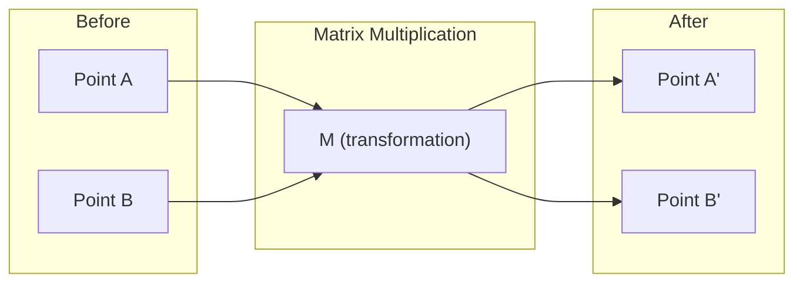
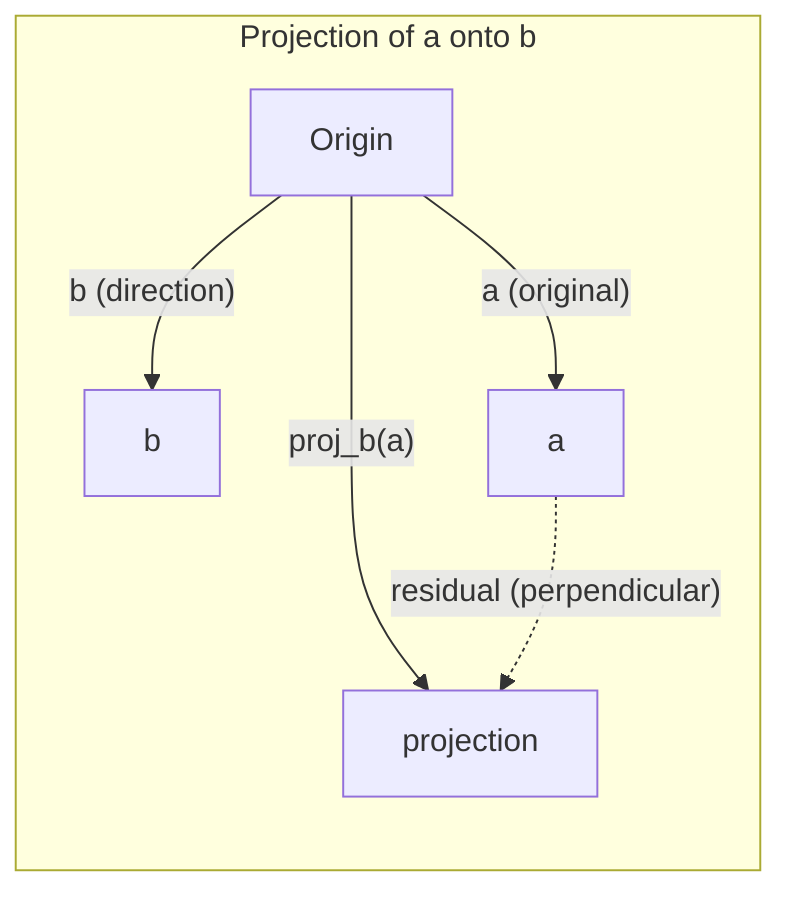

# Интуитивное понимание линейной алгебры

> Любая модель ИИ — это всего лишь матричная математика в нарядной шляпе.

**Тип:** Learn
**Языки:** Python, Julia
**Предварительные требования:** Этап 0
**Время:** ~60 минут

## Цели обучения

- Реализовать с нуля на Python операции с векторами и матрицами (сложение, скалярное произведение, умножение матриц)
- Объяснить геометрический смысл скалярного произведения, проекции и процесса Грама — Шмидта
- Определять линейную независимость, ранг и базис набора векторов с помощью приведения матрицы к ступенчатому виду
- Связать понятия линейной алгебры с их применением в ИИ: эмбеддингами, оценками внимания и LoRA

## Задача

Откройте любую статью по машинному обучению. Уже на первой странице вы увидите векторы, матрицы, скалярные произведения и преобразования. Без интуитивного понимания линейной алгебры это лишь символы. С таким пониманием можно увидеть, что на самом деле делает нейронная сеть: перемещает точки в пространстве.

Не нужно быть математиком. Нужно увидеть геометрический смысл этих операций, а затем самостоятельно их запрограммировать.

## Основная идея

### Векторы — это точки (и направления)

Вектор — всего лишь список чисел. Но у этих чисел есть смысл: это координаты в пространстве.

**Двумерный вектор [3, 2]:**

| x | y | Точка |
|---|---|-------|
| 3 | 2 | Вектор направлен от начала координат (0,0) к точке (3, 2) на плоскости |

Длина вектора равна sqrt(3^2 + 2^2) = sqrt(13), а направлен он вверх и вправо.

В ИИ векторы представляют всё:
- Слово → вектор из 768 чисел (его «смысл» в пространстве эмбеддингов)
- Изображение → вектор из миллионов значений пикселей
- Пользователь → вектор предпочтений

### Матрицы — это преобразования

Матрица преобразует один вектор в другой. Она может поворачивать, масштабировать, растягивать или проецировать.



В ИИ матрицы И ЕСТЬ модель:
- Веса нейронной сети → матрицы, преобразующие вход в выход
- Оценки внимания → матрицы, определяющие, на чём сосредоточиться
- Эмбеддинги → матрицы, сопоставляющие словам векторы

### Скалярное произведение измеряет сходство

Скалярное произведение двух векторов показывает, насколько они похожи.

```
a · b = a₁×b₁ + a₂×b₂ + ... + aₙ×bₙ

Same direction:      a · b > 0  (similar)
Perpendicular:       a · b = 0  (unrelated)
Opposite direction:  a · b < 0  (dissimilar)
```

Именно так работают поисковые системы, рекомендательные системы и RAG: они находят векторы с большими скалярными произведениями.

### Линейная независимость

Векторы линейно независимы, если ни один вектор в наборе нельзя представить как комбинацию остальных. Если v1, v2, v3 независимы, они порождают трёхмерное пространство. Если один из них является комбинацией остальных, они порождают лишь плоскость.

Почему это важно для ИИ: столбцы матрицы признаков должны быть линейно независимыми. Если два признака идеально коррелируют (линейно зависимы), модель не может различить их влияние. Это вызывает мультиколлинеарность в регрессии: матрица весов становится неустойчивой, и малые изменения входных данных приводят к резким скачкам выхода.

**Конкретный пример:**

```
v1 = [1, 0, 0]
v2 = [0, 1, 0]
v3 = [2, 1, 0]   # v3 = 2*v1 + v2
```

v1 и v2 независимы: ни один из них не является скалярным кратным или комбинацией другого. Но v3 = 2*v1 + v2, поэтому {v1, v2, v3} — зависимый набор. Все три вектора лежат в плоскости xy. Как бы вы их ни комбинировали, получить [0, 0, 1] невозможно. Векторов три, но степеней свободы лишь две.

В наборе данных: если feature_3 = 2*feature_1 + feature_2, добавление feature_3 не даёт модели никакой новой информации. Хуже того, оно делает нормальные уравнения вырожденными: единственного решения для весов не существует.

### Базис и ранг

Базис — минимальный набор линейно независимых векторов, порождающих всё пространство. Число базисных векторов равно размерности пространства.

Стандартный базис трёхмерного пространства — {[1,0,0], [0,1,0], [0,0,1]}. Но любые три независимых вектора в трёхмерном пространстве образуют допустимый базис. Выбор базиса — это выбор системы координат.

Ранг матрицы = число линейно независимых столбцов = число линейно независимых строк. Если ранг < min(rows, cols), матрица имеет неполный ранг. Это означает:
- Система имеет бесконечно много решений (либо ни одного)
- При преобразовании теряется информация
- Матрицу нельзя обратить

| Ситуация | Ранг | Что это означает для ML |
|-----------|------|---------------------|
| Полный ранг (rank = min(m, n)) | Максимально возможный | Существует единственное решение задачи наименьших квадратов. Модель хорошо обусловлена. |
| Неполный ранг (rank < min(m, n)) | Ниже максимального | Признаки избыточны. Решений для весов бесконечно много. Нужна регуляризация. |
| Ранг 1 | 1 | Каждый столбец — масштабированная копия одного вектора. Все данные лежат на прямой. |
| Почти неполный ранг (малые сингулярные значения) | Численно низкий | Матрица плохо обусловлена. Незначительный шум во входных данных вызывает большие изменения выхода. Используйте усечение SVD или гребневую регрессию. |

### Проекция

Проекция вектора **a** на вектор **b** даёт компоненту **a** в направлении **b**:

```
proj_b(a) = (a dot b / b dot b) * b
```

Остаток (a - proj_b(a)) перпендикулярен b. Это ортогональное разложение лежит в основе аппроксимации методом наименьших квадратов.

Проекции встречаются в ML повсюду:
- Линейная регрессия минимизирует расстояние от наблюдений до пространства столбцов — решение И ЕСТЬ проекция
- PCA проецирует данные на направления максимальной дисперсии
- Внимание в трансформерах вычисляет проекции запросов на ключи



**Пример:** a = [3, 4], b = [1, 0]

proj_b(a) = (3*1 + 4*0) / (1*1 + 0*0) * [1, 0] = 3 * [1, 0] = [3, 0]

При проецировании отбрасывается y-компонента. Это снижение размерности в простейшем виде: отбросить направления, которые вас не интересуют.

### Процесс Грама — Шмидта

Это преобразование любого набора независимых векторов в ортонормированный базис. Ортонормированность означает, что каждый вектор имеет длину 1, а любая пара векторов перпендикулярна.

Алгоритм:
1. Взять первый вектор и нормализовать его
2. Взять второй вектор, вычесть его проекцию на первый и нормализовать
3. Взять третий вектор, вычесть его проекции на все предыдущие векторы и нормализовать
4. Повторить для оставшихся векторов

```
Input:  v1, v2, v3, ... (linearly independent)

u1 = v1 / |v1|

w2 = v2 - (v2 dot u1) * u1
u2 = w2 / |w2|

w3 = v3 - (v3 dot u1) * u1 - (v3 dot u2) * u2
u3 = w3 / |w3|

Output: u1, u2, u3, ... (orthonormal basis)
```

Именно так изнутри работает QR-разложение. Q — ортонормированный базис, а R содержит коэффициенты проекций. QR-разложение применяется для:
- Решения линейных систем (оно устойчивее исключения Гаусса)
- Вычисления собственных значений (QR-алгоритм)
- Регрессии методом наименьших квадратов (стандартный численный метод)

```figure
eigen-directions
```

## Создаём самостоятельно

### Шаг 1. Векторы с нуля (Python)

```python
class Vector:
    def __init__(self, components):
        self.components = list(components)
        self.dim = len(self.components)

    def __add__(self, other):
        return Vector([a + b for a, b in zip(self.components, other.components)])

    def __sub__(self, other):
        return Vector([a - b for a, b in zip(self.components, other.components)])

    def dot(self, other):
        return sum(a * b for a, b in zip(self.components, other.components))

    def magnitude(self):
        return sum(x**2 for x in self.components) ** 0.5

    def normalize(self):
        mag = self.magnitude()
        return Vector([x / mag for x in self.components])

    def cosine_similarity(self, other):
        return self.dot(other) / (self.magnitude() * other.magnitude())

    def __repr__(self):
        return f"Vector({self.components})"


a = Vector([1, 2, 3])
b = Vector([4, 5, 6])

print(f"a + b = {a + b}")
print(f"a · b = {a.dot(b)}")
print(f"|a| = {a.magnitude():.4f}")
print(f"cosine similarity = {a.cosine_similarity(b):.4f}")
```

### Шаг 2. Матрицы с нуля (Python)

```python
class Matrix:
    def __init__(self, rows):
        self.rows = [list(row) for row in rows]
        self.shape = (len(self.rows), len(self.rows[0]))

    def __matmul__(self, other):
        if isinstance(other, Vector):
            return Vector([
                sum(self.rows[i][j] * other.components[j] for j in range(self.shape[1]))
                for i in range(self.shape[0])
            ])
        rows = []
        for i in range(self.shape[0]):
            row = []
            for j in range(other.shape[1]):
                row.append(sum(
                    self.rows[i][k] * other.rows[k][j]
                    for k in range(self.shape[1])
                ))
            rows.append(row)
        return Matrix(rows)

    def transpose(self):
        return Matrix([
            [self.rows[j][i] for j in range(self.shape[0])]
            for i in range(self.shape[1])
        ])

    def __repr__(self):
        return f"Matrix({self.rows})"


rotation_90 = Matrix([[0, -1], [1, 0]])
point = Vector([3, 1])

rotated = rotation_90 @ point
print(f"Original: {point}")
print(f"Rotated 90°: {rotated}")
```

### Шаг 3. Почему это важно для ИИ

```python
import random

random.seed(42)
weights = Matrix([[random.gauss(0, 0.1) for _ in range(3)] for _ in range(2)])
input_vector = Vector([1.0, 0.5, -0.3])

output = weights @ input_vector
print(f"Input (3D): {input_vector}")
print(f"Output (2D): {output}")
print("This is what a neural network layer does -- matrix multiplication.")
```

### Шаг 4. Версия на Julia

```julia
a = [1.0, 2.0, 3.0]
b = [4.0, 5.0, 6.0]

println("a + b = ", a + b)
println("a · b = ", a ⋅ b)       # Julia supports unicode operators
println("|a| = ", √(a ⋅ a))
println("cosine = ", (a ⋅ b) / (√(a ⋅ a) * √(b ⋅ b)))

# Matrix-vector multiplication
W = [0.1 -0.2 0.3; 0.4 0.5 -0.1]
x = [1.0, 0.5, -0.3]
println("Wx = ", W * x)
println("This is a neural network layer.")
```

### Шаг 5. Линейная независимость и проекция с нуля (Python)

```python
def is_linearly_independent(vectors):
    n = len(vectors)
    dim = len(vectors[0].components)
    mat = Matrix([v.components[:] for v in vectors])
    rows = [row[:] for row in mat.rows]
    rank = 0
    for col in range(dim):
        pivot = None
        for row in range(rank, len(rows)):
            if abs(rows[row][col]) > 1e-10:
                pivot = row
                break
        if pivot is None:
            continue
        rows[rank], rows[pivot] = rows[pivot], rows[rank]
        scale = rows[rank][col]
        rows[rank] = [x / scale for x in rows[rank]]
        for row in range(len(rows)):
            if row != rank and abs(rows[row][col]) > 1e-10:
                factor = rows[row][col]
                rows[row] = [rows[row][j] - factor * rows[rank][j] for j in range(dim)]
        rank += 1
    return rank == n


def project(a, b):
    scalar = a.dot(b) / b.dot(b)
    return Vector([scalar * x for x in b.components])


def gram_schmidt(vectors):
    orthonormal = []
    for v in vectors:
        w = v
        for u in orthonormal:
            proj = project(w, u)
            w = w - proj
        if w.magnitude() < 1e-10:
            continue
        orthonormal.append(w.normalize())
    return orthonormal


v1 = Vector([1, 0, 0])
v2 = Vector([1, 1, 0])
v3 = Vector([1, 1, 1])
basis = gram_schmidt([v1, v2, v3])
for i, u in enumerate(basis):
    print(f"u{i+1} = {u}")
    print(f"  |u{i+1}| = {u.magnitude():.6f}")

print(f"u1 · u2 = {basis[0].dot(basis[1]):.6f}")
print(f"u1 · u3 = {basis[0].dot(basis[2]):.6f}")
print(f"u2 · u3 = {basis[1].dot(basis[2]):.6f}")
```

## Используем готовое

Теперь сделаем то же самое с NumPy — именно его вы будете использовать на практике:

```python
import numpy as np

a = np.array([1, 2, 3], dtype=float)
b = np.array([4, 5, 6], dtype=float)

print(f"a + b = {a + b}")
print(f"a · b = {np.dot(a, b)}")
print(f"|a| = {np.linalg.norm(a):.4f}")
print(f"cosine = {np.dot(a, b) / (np.linalg.norm(a) * np.linalg.norm(b)):.4f}")

W = np.random.randn(2, 3) * 0.1
x = np.array([1.0, 0.5, -0.3])
print(f"Wx = {W @ x}")
```

### Ранг, проекция и QR-разложение с NumPy

```python
import numpy as np

A = np.array([[1, 2], [2, 4]])
print(f"Rank: {np.linalg.matrix_rank(A)}")

a = np.array([3, 4])
b = np.array([1, 0])
proj = (np.dot(a, b) / np.dot(b, b)) * b
print(f"Projection of {a} onto {b}: {proj}")

Q, R = np.linalg.qr(np.random.randn(3, 3))
print(f"Q is orthogonal: {np.allclose(Q @ Q.T, np.eye(3))}")
print(f"R is upper triangular: {np.allclose(R, np.triu(R))}")
```

### PyTorch: тензоры — это векторы с автоматическим дифференцированием

```python
import torch

x = torch.randn(3, requires_grad=True)
y = torch.tensor([1.0, 0.0, 0.0])

similarity = torch.dot(x, y)
similarity.backward()

print(f"x = {x.data}")
print(f"y = {y.data}")
print(f"dot product = {similarity.item():.4f}")
print(f"d(dot)/dx = {x.grad}")
```

Градиент скалярного произведения по x — это просто y. PyTorch вычислил его автоматически. Каждая операция в нейронной сети строится из подобных операций — умножений матриц, скалярных произведений, проекций, — а автоматическое дифференцирование отслеживает градиенты через все эти операции.

Вы только что с нуля реализовали то, что NumPy делает одной строкой. Теперь вы знаете, что происходит внутри.

## Результат

Этот урок создаёт:
- `outputs/prompt-linear-algebra-tutor.md` — промпт для ИИ-ассистентов, помогающий обучать линейной алгебре через геометрическую интуицию

## Связи

Всё в этом уроке связано с конкретными частями современного ИИ:

| Понятие | Где встречается |
|---------|------------------|
| Скалярное произведение | Оценки внимания в трансформерах, косинусное сходство в RAG |
| Умножение матриц | Каждый слой нейронной сети, каждое линейное преобразование |
| Линейная независимость | Отбор признаков, предотвращение мультиколлинеарности |
| Ранг | Определение разрешимости системы, LoRA (низкоранговая адаптация) |
| Проекция | Линейная регрессия (проецирование на пространство столбцов), PCA |
| Процесс Грама — Шмидта / QR-разложение | Численные решатели, вычисление собственных значений |
| Ортонормированный базис | Устойчивые численные вычисления, преобразования отбеливания |

LoRA заслуживает отдельного упоминания. Она дообучает большие языковые модели, раскладывая обновления весов на матрицы низкого ранга. Вместо обновления матрицы весов 4096x4096 (16M параметров) LoRA обновляет две матрицы размеров 4096x16 и 16x4096 (131K параметров). Ограничение ранга 16 означает, что LoRA предполагает: обновление весов лежит в 16-мерном подпространстве полного 4096-мерного пространства. Вот линейная алгебра в реальной работе.

## Упражнения

1. Реализуйте `Vector.angle_between(other)`, возвращающий угол в градусах между двумя векторами
2. Создайте двумерную матрицу масштабирования, которая удваивает x-координату и утраивает y-координату, а затем примените её к вектору [1, 1]
3. Для 5 случайных векторов, подобных векторам слов (размерности 50), найдите два наиболее похожих с помощью косинусного сходства
4. Убедитесь, что результат процесса Грама — Шмидта действительно ортонормирован: проверьте, что скалярное произведение каждой пары равно 0, а длина каждого вектора равна 1
5. Создайте матрицу 3x3 ранга 2. Проверьте её методом `rank()`. Затем объясните, какой геометрический объект порождают её столбцы.
6. Спроецируйте вектор [1, 2, 3] на [1, 1, 1]. Что полученный результат означает геометрически?

## Ключевые термины

| Термин | Как обычно говорят | Что это означает на самом деле |
|------|----------------|----------------------|
| Вектор | «Стрелка» | Список чисел, представляющий точку или направление в n-мерном пространстве |
| Матрица | «Таблица чисел» | Преобразование, отображающее векторы из одного пространства в другое |
| Скалярное произведение | «Перемножить и сложить» | Мера сонаправленности двух векторов — основа поиска по сходству |
| Эмбеддинг | «Какая-то магия ИИ» | Вектор, представляющий смысл чего-либо (слова, изображения, пользователя) |
| Линейная независимость | «Они не пересекаются» | Ни один вектор в наборе нельзя представить как комбинацию остальных |
| Ранг | «Сколько измерений» | Число линейно независимых столбцов (или строк) матрицы |
| Проекция | «Тень» | Компонента одного вектора в направлении другого |
| Базис | «Оси координат» | Минимальный набор независимых векторов, порождающих пространство |
| Ортонормированность | «Перпендикулярные единичные векторы» | Векторы, которые попарно перпендикулярны и каждый из которых имеет длину 1 |
