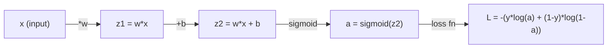
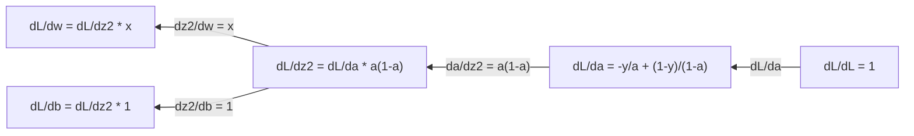
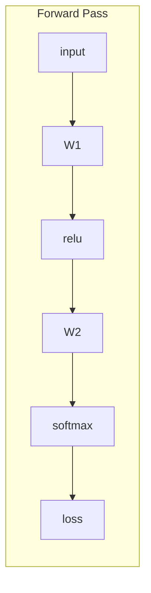
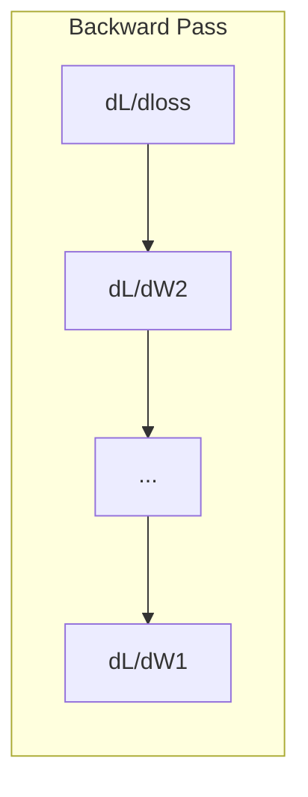

# Математический анализ для машинного обучения

> Производные показывают, куда идти под уклон. Это всё, что нужно нейронной сети, чтобы обучаться.

**Тип:** Learn
**Язык:** Python
**Предварительные требования:** Фаза 1, Уроки 01–03
**Время:** ~60 минут

## Цели обучения

- Вычислять численные и аналитические производные для распространённых в ML функций (x^2, сигмоида, перекрёстная энтропия)
- Реализовать градиентный спуск с нуля для минимизации функции потерь в одномерном и двумерном случаях
- Вывести градиент модели линейной регрессии и обучить её, вручную обновляя веса
- Объяснить матрицу Гессе, приближения рядом Тейлора и их связь с методами оптимизации

## Проблема

У вас есть нейронная сеть с миллионами весов. Каждый вес — это регулятор. Нужно понять, в какую сторону повернуть каждый регулятор, чтобы модель ошибалась чуть меньше. Математический анализ даёт это направление.

Без математического анализа обучение нейронной сети сводилось бы к случайным изменениям в надежде на удачу. С производными вы точно знаете, как каждый вес влияет на ошибку. Вы каждый раз поворачиваете каждый регулятор в нужную сторону.

## Концепция

### Что такое производная?

Производная измеряет скорость изменения. Для функции y = f(x) производная f'(x) отвечает на вопрос: если немного сдвинуть x, насколько изменится y?

Геометрически производная — это наклон касательной в точке.

**f(x) = x^2:**

| x | f(x) | f'(x) (наклон) |
|---|------|---------------|
| 0 | 0    | 0 (плоско, в нижней точке) |
| 1 | 1    | 2 |
| 2 | 4    | 4 (наклон касательной в этой точке) |
| 3 | 9    | 6 |

При x=2 наклон равен 4. Если сдвинуть x немного вправо, y увеличится примерно в 4 раза больше этого сдвига. При x=0 наклон равен 0 — вы находитесь на дне чаши.

Формальное определение:

```
f'(x) = lim   f(x + h) - f(x)
        h->0  -----------------
                     h
```

В коде предел опускают и просто берут очень маленькое h. Это и есть численная производная.

### Частные производные: по одной переменной за раз

У реальных функций много входов. Функция потерь нейронной сети зависит от тысяч весов. Частная производная фиксирует все переменные, кроме одной, и берёт производную по этой одной переменной.

```
f(x, y) = x^2 + 3xy + y^2

df/dx = 2x + 3y     (treat y as a constant)
df/dy = 3x + 2y     (treat x as a constant)
```

Каждая частная производная отвечает на вопрос: если сдвинуть только этот один вес, как изменится потеря?

### Градиент: вектор всех частных производных

Градиент собирает все частные производные в один вектор. Для функции f(x, y, z) градиент равен:

```
grad f = [ df/dx, df/dy, df/dz ]
```

Градиент указывает направление наискорейшего возрастания. Чтобы минимизировать функцию, нужно двигаться в противоположном направлении.

**Контурный график f(x,y) = x^2 + y^2:**

Функция образует форму чаши, а линии уровня — концентрические окружности. Минимум находится в точке (0, 0).

| Точка | grad f | -grad f (направление спуска) |
|-------|--------|----------------------------|
| (1, 1) | [2, 2] (указывает вверх по склону, от минимума) | [-2, -2] (указывает вниз по склону, к минимуму) |
| (0, 0) | [0, 0] (плоско, в минимуме) | [0, 0] |

Это градиентный спуск в картинке. Вычислите градиент, поменяйте его знак, сделайте шаг.

### Связь с оптимизацией

Обучение нейронной сети — это оптимизация. У вас есть функция потерь L(w1, w2, ..., wn), которая измеряет, насколько ошибается модель. Вы хотите её минимизировать.

```
Gradient descent update rule:

  w_new = w_old - learning_rate * dL/dw

For every weight:
  1. Compute the partial derivative of loss with respect to that weight
  2. Subtract a small multiple of it from the weight
  3. Repeat
```

Скорость обучения контролирует размер шага. Слишком большая — вы проскакиваете минимум. Слишком маленькая — вы ползёте.

**Ландшафт потерь (одномерный срез):**

Функция потерь L(w) образует кривую с пиками и впадинами при изменении веса w.

| Признак | Описание |
|---------|-------------|
| Глобальный минимум | Самая низкая точка на всей кривой — лучшее решение |
| Локальный минимум | Впадина, которая ниже соседних точек, но не самая низкая в целом |
| Наклон | Градиентный спуск следует по склону вниз из любой стартовой точки |

Градиентный спуск следует по склону вниз. Он может застрять в локальном минимуме, но в пространствах высокой размерности (миллионы весов) это редко становится практической проблемой.

### Численные и аналитические производные

Есть два способа вычислить производную.

Аналитический: применить правила математического анализа вручную. Для f(x) = x^2 производная равна f'(x) = 2x. Точно. Быстро.

Численный: приблизить, используя определение. Вычислить f(x+h) и f(x-h) для очень маленького h, затем взять разность.

```
Numerical (central difference):

f'(x) ~= f(x + h) - f(x - h)
          -----------------------
                  2h

h = 0.0001 works well in practice
```

Численные производные медленнее, но работают для любой функции. Аналитические производные быстрые, но требуют вывода формулы вручную. Фреймворки для нейронных сетей используют третий подход — автоматическое дифференцирование, которое вычисляет точные производные механически. Вы увидите это в Фазе 3.

### Производные вручную для простых функций

Это производные, которые вы будете видеть в ML снова и снова.

```
Function        Derivative       Used in
--------        ----------       -------
f(x) = x^2     f'(x) = 2x      Loss functions (MSE)
f(x) = wx + b  f'(w) = x        Linear layer (gradient w.r.t. weight)
                f'(b) = 1        Linear layer (gradient w.r.t. bias)
                f'(x) = w        Linear layer (gradient w.r.t. input)
f(x) = e^x     f'(x) = e^x     Softmax, attention
f(x) = ln(x)   f'(x) = 1/x     Cross-entropy loss
f(x) = 1/(1+e^-x)  f'(x) = f(x)(1-f(x))   Sigmoid activation
```

Для f(x) = x^2:

```
f(x) = x^2    f'(x) = 2x

  x    f(x)   f'(x)   meaning
  -2    4      -4      slope tilts left (decreasing)
  -1    1      -2      slope tilts left (decreasing)
   0    0       0      flat (minimum!)
   1    1       2      slope tilts right (increasing)
   2    4       4      slope tilts right (increasing)
```

Для f(w) = wx + b при x=3, b=1:

```
f(w) = 3w + 1    f'(w) = 3

The derivative with respect to w is just x.
If x is big, a small change in w causes a big change in output.
```

### Правило цепочки (chain rule)

Когда функции являются композицией друг друга, правило цепочки показывает, как их дифференцировать.

```
If y = f(g(x)), then dy/dx = f'(g(x)) * g'(x)

Example: y = (3x + 1)^2
  outer: f(u) = u^2       f'(u) = 2u
  inner: g(x) = 3x + 1    g'(x) = 3
  dy/dx = 2(3x + 1) * 3 = 6(3x + 1)
```

Нейронные сети — это цепочки функций: вход -> линейный слой -> активация -> линейный слой -> активация -> потеря. Обратное распространение ошибки — это правило цепочки, применённое многократно от выхода к входу. Это и есть весь алгоритм.

### Матрица Гессе

Градиент показывает наклон. Матрица Гессе показывает кривизну.

Матрица Гессе — это матрица частных производных второго порядка. Для функции f(x1, x2, ..., xn) элемент (i, j) матрицы Гессе равен:

```
H[i][j] = d^2f / (dx_i * dx_j)
```

Для функции двух переменных f(x, y):

```
H = | d^2f/dx^2    d^2f/dxdy |
    | d^2f/dydx    d^2f/dy^2 |
```

**Что матрица Гессе говорит о критической точке (где градиент = 0):**

| Свойство матрицы Гессе | Значение | Пример поверхности |
|-----------------|---------|-----------------|
| Положительно определена (все собственные значения > 0) | Локальный минимум | Чаша, обращённая вверх |
| Отрицательно определена (все собственные значения < 0) | Локальный максимум | Чаша, обращённая вниз |
| Неопределена (смешанные знаки собственных значений) | Седловая точка | Форма седла |

**Пример:** f(x, y) = x^2 - y^2 (седловая функция)

```
df/dx = 2x       df/dy = -2y
d^2f/dx^2 = 2    d^2f/dy^2 = -2    d^2f/dxdy = 0

H = | 2   0 |
    | 0  -2 |

Eigenvalues: 2 and -2 (one positive, one negative)
--> Saddle point at (0, 0)
```

Сравните с f(x, y) = x^2 + y^2 (чаша):

```
H = | 2  0 |
    | 0  2 |

Eigenvalues: 2 and 2 (both positive)
--> Local minimum at (0, 0)
```

**Почему матрица Гессе важна в ML:**

Метод Ньютона использует матрицу Гессе, чтобы делать более удачные шаги оптимизации, чем градиентный спуск. Вместо того чтобы просто следовать наклону, он учитывает кривизну:

```
Newton's update:    w_new = w_old - H^(-1) * gradient
Gradient descent:   w_new = w_old - lr * gradient
```

Метод Ньютона сходится быстрее, потому что матрица Гессе «перемасштабирует» градиент: крутые направления получают меньшие шаги, плоские — большие.

Загвоздка в том, что для нейронной сети с N параметрами матрица Гессе имеет размер N x N. Модели с 1 миллионом параметров потребовалась бы матрица из 1 триллиона элементов. Именно поэтому используются приближения.

| Метод | Что использует | Стоимость | Сходимость |
|--------|-------------|------|-------------|
| Градиентный спуск | Только первые производные | O(N) за шаг | Медленная (линейная) |
| Метод Ньютона | Полная матрица Гессе | O(N^3) за шаг | Быстрая (квадратичная) |
| L-BFGS | Приближение Гессе по истории градиентов | O(N) за шаг | Средняя (суперлинейная) |
| Adam | Адаптивные скорости для каждого параметра (приближение диагонали Гессе) | O(N) за шаг | Средняя |
| Natural gradient | Матрица информации Фишера (статистический аналог Гессе) | O(N^2) за шаг | Быстрая |

На практике Adam — оптимизатор по умолчанию для глубокого обучения. Он дёшево приближает информацию второго порядка, отслеживая скользящее среднее и дисперсию градиентов для каждого параметра.

### Приближение рядом Тейлора

Любую гладкую функцию можно локально приблизить многочленом:

```
f(x + h) = f(x) + f'(x)*h + (1/2)*f''(x)*h^2 + (1/6)*f'''(x)*h^3 + ...
```

Чем больше членов ряда учтено, тем точнее приближение — но только вблизи точки x.

**Почему ряд Тейлора важен для ML:**

- **Приближение первого порядка = градиентный спуск.** Используя f(x + h) ~ f(x) + f'(x)*h, вы делаете линейное приближение. Градиентный спуск минимизирует эту линейную модель, выбирая h = -lr * f'(x).

- **Приближение второго порядка = метод Ньютона.** Используя f(x + h) ~ f(x) + f'(x)*h + (1/2)*f''(x)*h^2, вы получаете квадратичную модель. Минимизация этой модели даёт h = -f'(x)/f''(x) — шаг Ньютона.

- **Проектирование функции потерь.** MSE и перекрёстная энтропия гладкие, а значит их разложения Тейлора хорошо себя ведут. Это не случайность. Гладкие функции потерь делают оптимизацию предсказуемой.

```
Approximation order    What it captures    Optimization method
-------------------    -----------------   -------------------
0th order (constant)   Just the value      Random search
1st order (linear)     Slope               Gradient descent
2nd order (quadratic)  Curvature           Newton's method
Higher orders          Finer structure     Rarely used in ML
```

Ключевая идея: вся оптимизация на основе градиента на самом деле сводится к локальному приближению функции потерь и шагу к минимуму этого приближения.

### Интегралы в ML

Производные показывают скорость изменения. Интегралы вычисляют накопление — площадь под кривой.

В ML вы редко считаете интегралы вручную, но эта концепция встречается повсюду:

**Вероятность.** Для непрерывной случайной величины с плотностью p(x):
```
P(a < X < b) = integral from a to b of p(x) dx
```
Площадь под кривой плотности вероятности между a и b — это вероятность попадания в этот диапазон.

**Математическое ожидание.** Средний результат, взвешенный по вероятности:
```
E[f(X)] = integral of f(x) * p(x) dx
```
Ожидаемая потеря по распределению данных — это интеграл. Обучение минимизирует эмпирическое приближение этого интеграла.

**KL-дивергенция.** Измеряет, насколько различаются два распределения:
```
KL(p || q) = integral of p(x) * log(p(x) / q(x)) dx
```
Используется в VAE, дистилляции знаний и байесовском выводе.

**Нормировочные константы.** В байесовском выводе:
```
p(w | data) = p(data | w) * p(w) / integral of p(data | w) * p(w) dw
```
Знаменатель — это интеграл по всем возможным значениям параметров. Часто он неразрешим аналитически, поэтому используются приближения вроде MCMC и вариационного вывода.

| Понятие интеграла | Где встречается в ML |
|-----------------|----------------------|
| Площадь под кривой | Вероятность по функциям плотности |
| Математическое ожидание | Функции потерь, минимизация риска |
| KL-дивергенция | VAE, оптимизация политики, дистилляция |
| Нормировка | Байесовские апостериорные распределения, знаменатель softmax |
| Маргинальное правдоподобие | Сравнение моделей, нижняя граница доказательства (ELBO) |

### Многомерное правило цепочки в вычислительном графе

Правило цепочки применяется не только к скалярным функциям, вытянутым в линию. В нейронной сети переменные расходятся и сливаются. Вот как производные текут через простой прямой проход:



Обратный проход вычисляет градиенты справа налево:



Каждая стрелка умножает на локальную производную. Градиент для любого параметра — это произведение всех локальных производных вдоль пути от потери до этого параметра. Когда пути ветвятся и сливаются, вклады суммируются (многомерное правило цепочки).

Это и есть всё обратное распространение ошибки: правило цепочки, систематически применённое через вычислительный граф, от выхода к входам.

### Матрица Якоби

Когда функция отображает вектор в вектор (как слой нейронной сети), её производная — это матрица. Матрица Якоби содержит все частные производные каждого выхода по каждому входу.

Для f: R^n -> R^m матрица Якоби J имеет размер m x n:

| | x1 | x2 | ... | xn |
|---|---|---|---|---|
| f1 | df1/dx1 | df1/dx2 | ... | df1/dxn |
| f2 | df2/dx1 | df2/dx2 | ... | df2/dxn |
| ... | ... | ... | ... | ... |
| fm | dfm/dx1 | dfm/dx2 | ... | dfm/dxn |

Вручную вычислять матрицы Якоби для нейронных сетей вам не придётся — это делает PyTorch. Но знание о её существовании помогает понимать формы тензоров в обратном распространении: если слой отображает R^n в R^m, его матрица Якоби имеет размер m x n. Градиент течёт назад через транспонированную матрицу.

### Почему это важно для нейронных сетей

Каждый вес в нейронной сети получает градиент. Градиент показывает, как скорректировать этот вес, чтобы уменьшить потерю.





Обновление каждого веса:
- `W1 = W1 - lr * dL/dW1`
- `W2 = W2 - lr * dL/dW2`

Прямой проход вычисляет предсказание и потерю. Обратный проход вычисляет градиент потери по каждому весу. Затем каждый вес делает небольшой шаг вниз по склону. Повторить миллионы раз. Это и есть глубокое обучение.

```figure
derivative-tangent
```

## Реализация

### Шаг 1: Численная производная с нуля

```python
def numerical_derivative(f, x, h=1e-7):
    return (f(x + h) - f(x - h)) / (2 * h)

def f(x):
    return x ** 2

for x in [-2, -1, 0, 1, 2]:
    numerical = numerical_derivative(f, x)
    analytical = 2 * x
    print(f"x={x:2d}  f'(x) numerical={numerical:.6f}  analytical={analytical:.1f}")
```

Численная производная совпадает с аналитической до многих знаков после запятой.

### Шаг 2: Частные производные и градиенты

```python
def numerical_gradient(f, point, h=1e-7):
    gradient = []
    for i in range(len(point)):
        point_plus = list(point)
        point_minus = list(point)
        point_plus[i] += h
        point_minus[i] -= h
        partial = (f(point_plus) - f(point_minus)) / (2 * h)
        gradient.append(partial)
    return gradient

def f_multi(point):
    x, y = point
    return x**2 + 3*x*y + y**2

grad = numerical_gradient(f_multi, [1.0, 2.0])
print(f"Numerical gradient at (1,2): {[f'{g:.4f}' for g in grad]}")
print(f"Analytical gradient at (1,2): [2*1+3*2, 3*1+2*2] = [{2*1+3*2}, {3*1+2*2}]")
```

### Шаг 3: Градиентный спуск для поиска минимума f(x) = x^2

```python
x = 5.0
lr = 0.1
for step in range(20):
    grad = 2 * x
    x = x - lr * grad
    print(f"step {step:2d}  x={x:8.4f}  f(x)={x**2:10.6f}")
```

Начиная с x=5, каждый шаг приближает x к 0 (минимуму).

### Шаг 4: Градиентный спуск для двумерной функции

```python
def f_2d(point):
    x, y = point
    return x**2 + y**2

point = [4.0, 3.0]
lr = 0.1
for step in range(30):
    grad = numerical_gradient(f_2d, point)
    point = [p - lr * g for p, g in zip(point, grad)]
    loss = f_2d(point)
    if step % 5 == 0 or step == 29:
        print(f"step {step:2d}  point=({point[0]:7.4f}, {point[1]:7.4f})  f={loss:.6f}")
```

### Шаг 5: Сравнение численных и аналитических производных

```python
import math

test_functions = [
    ("x^2",      lambda x: x**2,          lambda x: 2*x),
    ("x^3",      lambda x: x**3,          lambda x: 3*x**2),
    ("sin(x)",   lambda x: math.sin(x),   lambda x: math.cos(x)),
    ("e^x",      lambda x: math.exp(x),   lambda x: math.exp(x)),
    ("1/x",      lambda x: 1/x,           lambda x: -1/x**2),
]

x = 2.0
print(f"{'Function':<12} {'Numerical':>12} {'Analytical':>12} {'Error':>12}")
print("-" * 50)
for name, f, df in test_functions:
    num = numerical_derivative(f, x)
    ana = df(x)
    err = abs(num - ana)
    print(f"{name:<12} {num:12.6f} {ana:12.6f} {err:12.2e}")
```

### Шаг 6: Численное вычисление матрицы Гессе

```python
def hessian_2d(f, x, y, h=1e-5):
    fxx = (f(x + h, y) - 2 * f(x, y) + f(x - h, y)) / (h ** 2)
    fyy = (f(x, y + h) - 2 * f(x, y) + f(x, y - h)) / (h ** 2)
    fxy = (f(x + h, y + h) - f(x + h, y - h) - f(x - h, y + h) + f(x - h, y - h)) / (4 * h ** 2)
    return [[fxx, fxy], [fxy, fyy]]

def saddle(x, y):
    return x ** 2 - y ** 2

def bowl(x, y):
    return x ** 2 + y ** 2

H_saddle = hessian_2d(saddle, 0.0, 0.0)
H_bowl = hessian_2d(bowl, 0.0, 0.0)
print(f"Saddle Hessian: {H_saddle}")  # [[2, 0], [0, -2]] -- mixed signs
print(f"Bowl Hessian:   {H_bowl}")    # [[2, 0], [0, 2]]  -- both positive
```

Матрица Гессе седловой функции имеет собственные значения 2 и -2 (смешанные знаки, что подтверждает седловую точку). У чаши собственные значения 2 и 2 (оба положительные, что подтверждает минимум).

### Шаг 7: Приближение Тейлора на практике

```python
import math

def taylor_approx(f, f_prime, f_double_prime, x0, h, order=2):
    result = f(x0)
    if order >= 1:
        result += f_prime(x0) * h
    if order >= 2:
        result += 0.5 * f_double_prime(x0) * h ** 2
    return result

x0 = 0.0
for h in [0.1, 0.5, 1.0, 2.0]:
    true_val = math.sin(h)
    t1 = taylor_approx(math.sin, math.cos, lambda x: -math.sin(x), x0, h, order=1)
    t2 = taylor_approx(math.sin, math.cos, lambda x: -math.sin(x), x0, h, order=2)
    print(f"h={h:.1f}  sin(h)={true_val:.4f}  order1={t1:.4f}  order2={t2:.4f}")
```

Вблизи x0=0, sin(x) ~ x (приближение Тейлора первого порядка). Приближение отличное для малых h, но перестаёт работать для больших h. Именно поэтому градиентный спуск лучше всего работает с маленькой скоростью обучения — каждый шаг предполагает, что линейное приближение точно.

### Шаг 8: Почему это важно для нейронной сети

```python
import random

random.seed(42)

w = random.gauss(0, 1)
b = random.gauss(0, 1)
lr = 0.01

xs = [1.0, 2.0, 3.0, 4.0, 5.0]
ys = [3.0, 5.0, 7.0, 9.0, 11.0]

for epoch in range(200):
    total_loss = 0
    dw = 0
    db = 0
    for x, y in zip(xs, ys):
        pred = w * x + b
        error = pred - y
        total_loss += error ** 2
        dw += 2 * error * x
        db += 2 * error
    dw /= len(xs)
    db /= len(xs)
    total_loss /= len(xs)
    w -= lr * dw
    b -= lr * db
    if epoch % 40 == 0 or epoch == 199:
        print(f"epoch {epoch:3d}  w={w:.4f}  b={b:.4f}  loss={total_loss:.6f}")

print(f"\nLearned: y = {w:.2f}x + {b:.2f}")
print(f"Actual:  y = 2x + 1")
```

Каждый обучающий цикл на основе градиента следует этому шаблону: предсказать, вычислить потерю, вычислить градиенты, обновить веса.

## Применение

С NumPy те же операции выполняются быстрее и компактнее:

```python
import numpy as np

x = np.array([1, 2, 3, 4, 5], dtype=float)
y = np.array([3, 5, 7, 9, 11], dtype=float)

w, b = np.random.randn(), np.random.randn()
lr = 0.01

for epoch in range(200):
    pred = w * x + b
    error = pred - y
    loss = np.mean(error ** 2)
    dw = np.mean(2 * error * x)
    db = np.mean(2 * error)
    w -= lr * dw
    b -= lr * db

print(f"Learned: y = {w:.2f}x + {b:.2f}")
```

Вы только что реализовали градиентный спуск с нуля. PyTorch автоматизирует вычисление градиента, но цикл обновления идентичен.

## Упражнения

1. Реализуйте `numerical_second_derivative(f, x)`, дважды вызвав `numerical_derivative`. Проверьте, что вторая производная x^3 в точке x=2 равна 12.
2. Используйте градиентный спуск для поиска минимума f(x, y) = (x - 3)^2 + (y + 1)^2. Начните с точки (0, 0). Ответ должен сойтись к (3, -1).
3. Добавьте момент (momentum) в цикл градиентного спуска: поддерживайте вектор скорости, который накапливает прошлые градиенты. Сравните скорость сходимости с моментом и без него на функции f(x) = x^4 - 3x^2.

## Ключевые термины

| Термин | Что говорят | Что это на самом деле означает |
|------|----------------|----------------------|
| Производная (Derivative) | «Наклон» | Скорость изменения функции в точке. Показывает, насколько изменится выход при единичном изменении входа. |
| Частная производная (Partial derivative) | «Производная по одной переменной» | Производная по одной переменной при фиксированных всех остальных. |
| Градиент (Gradient) | «Направление наискорейшего возрастания» | Вектор всех частных производных. Указывает направление, в котором функция растёт быстрее всего. |
| Градиентный спуск (Gradient descent) | «Идти под уклон» | Вычесть градиент (умноженный на скорость обучения) из параметров, чтобы уменьшить потерю. Основа обучения нейронных сетей. |
| Скорость обучения (Learning rate) | «Размер шага» | Скаляр, который контролирует, насколько большим будет каждый шаг градиентного спуска. Слишком большая: расхождение. Слишком маленькая: медленная сходимость. |
| Правило цепочки (Chain rule) | «Перемножить производные» | Правило дифференцирования составных функций: df/dx = df/dg * dg/dx. Математическая основа обратного распространения ошибки. |
| Матрица Якоби (Jacobian) | «Матрица производных» | Когда функция отображает векторы в векторы, матрица Якоби — это матрица всех частных производных выходов по входам. |
| Численная производная (Numerical derivative) | «Конечные разности» | Приближение производной путём вычисления функции в двух близких точках и расчёта наклона между ними. |
| Обратное распространение ошибки (Backpropagation) | «Reverse-mode autodiff» | Вычисление градиентов послойно от выхода к входу с помощью правила цепочки. То, как обучаются нейронные сети. |
| Матрица Гессе (Hessian) | «Матрица вторых производных» | Матрица всех частных производных второго порядка. Описывает кривизну функции. Положительно определённая матрица Гессе в критической точке означает локальный минимум. |
| Ряд Тейлора (Taylor series) | «Полиномиальное приближение» | Приближение функции вблизи точки с помощью её производных: f(x+h) ~ f(x) + f'(x)h + (1/2)f''(x)h^2 + ... Основа для понимания того, почему работают градиентный спуск и метод Ньютона. |
| Интеграл (Integral) | «Площадь под кривой» | Накопление величины по диапазону. В ML интегралы определяют вероятности, математические ожидания и KL-дивергенцию. |

## Дополнительные материалы

- [3Blue1Brown: Essence of Calculus](https://www.3blue1brown.com/topics/calculus) - визуальная интуиция для производных, интегралов и правила цепочки
- [Stanford CS231n: Backpropagation](https://cs231n.github.io/optimization-2/) - как градиенты текут через слои нейронной сети
