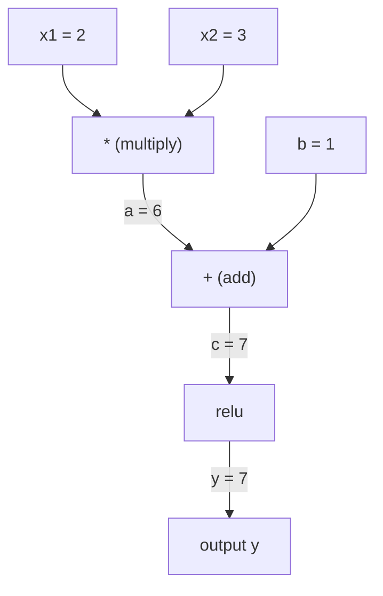
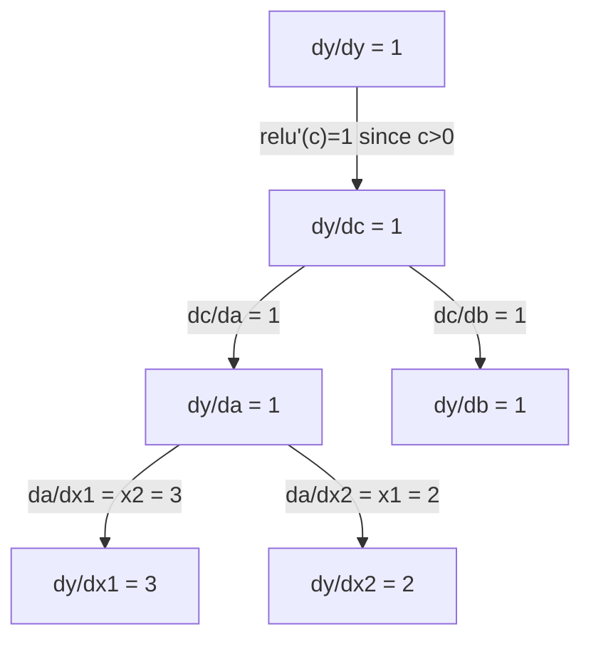

# Правило цепочки и автоматическое дифференцирование

> Правило цепочки — это двигатель, который стоит за каждой обучающейся нейронной сетью.

**Тип:** Build
**Язык:** Python
**Предварительные требования:** Фаза 1, Урок 04 (Производные и градиенты)
**Время:** ~90 минут

## Цели обучения

- Построить минимальный движок autograd (класс Value), который записывает операции и вычисляет градиенты через reverse-mode autodiff
- Реализовать прямой и обратный проходы через вычислительный граф с использованием топологической сортировки
- Построить и обучить многослойный перцептрон на задаче XOR, используя только собственный движок autograd
- Проверить корректность autodiff с помощью gradient checking относительно численных конечных разностей

## Проблема

Вы умеете вычислять производные простых функций. Но нейронная сеть — не простая функция. Это сотни функций, скомпонованных вместе: матричное умножение, добавление смещения, применение активации, снова матричное умножение, softmax, потеря перекрёстной энтропии. Выход — это функция от функции от функции.

Чтобы обучить сеть, нужен градиент потери по каждому отдельному весу. Сделать это вручную невозможно для миллионов параметров. Сделать это численно (конечными разностями) — слишком медленно.

Правило цепочки даёт математику. Автоматическое дифференцирование даёт алгоритм. Вместе они позволяют вычислять точные градиенты через произвольные композиции функций за время, пропорциональное одному прямому проходу.

Именно так работают PyTorch, TensorFlow и JAX. Вы построите миниатюрную версию с нуля.

## Концепция

### Правило цепочки

Если `y = f(g(x))`, производная `y` по `x` равна:

```
dy/dx = dy/dg * dg/dx = f'(g(x)) * g'(x)
```

Перемножьте производные вдоль цепочки. Каждое звено вносит свою локальную производную.

Пример: `y = sin(x^2)`

```
g(x) = x^2       g'(x) = 2x
f(g) = sin(g)     f'(g) = cos(g)

dy/dx = cos(x^2) * 2x
```

Для более глубоких композиций цепочка продолжается:

```
y = f(g(h(x)))

dy/dx = f'(g(h(x))) * g'(h(x)) * h'(x)
```

Каждый слой нейронной сети — это одно звено этой цепочки.

### Вычислительные графы

Вычислительный граф делает правило цепочки наглядным. Каждая операция становится узлом. Данные текут через граф вперёд. Градиенты текут назад.

**Прямой проход (вычисление значений):**



**Обратный проход (вычисление градиентов):**



Обратный проход применяет правило цепочки в каждом узле, распространяя градиенты от выхода к входам.

### Прямой режим и обратный режим

Есть два способа применить правило цепочки к графу.

**Прямой режим (forward mode)** начинает с входов и проталкивает производные вперёд. Он вычисляет `dx/dx = 1` и распространяет это через каждую операцию. Хорош, когда входов мало, а выходов много.

```
Forward mode: seed dx/dx = 1, propagate forward

  x = 2       (dx/dx = 1)
  a = x^2     (da/dx = 2x = 4)
  y = sin(a)  (dy/dx = cos(a) * da/dx = cos(4) * 4 = -2.615)
```

**Обратный режим (reverse mode)** начинает с выхода и тянет градиенты назад. Он вычисляет `dy/dy = 1` и распространяет это через каждую операцию в обратном порядке. Хорош, когда входов много, а выходов мало.

```
Reverse mode: seed dy/dy = 1, propagate backward

  y = sin(a)  (dy/dy = 1)
  a = x^2     (dy/da = cos(a) = cos(4) = -0.654)
  x = 2       (dy/dx = dy/da * da/dx = -0.654 * 4 = -2.615)
```

У нейронных сетей миллионы входов (весов) и один выход (потеря). Обратный режим вычисляет все градиенты за один обратный проход. Именно поэтому обратное распространение ошибки использует обратный режим.

| Режим | Начальное значение | Направление | Лучше всего, когда |
|------|------|-----------|-----------|
| Прямой (Forward) | `dx_i/dx_i = 1` | От входа к выходу | Мало входов, много выходов |
| Обратный (Reverse) | `dy/dy = 1` | От выхода к входу | Много входов, мало выходов (нейронные сети) |

### Дуальные числа для прямого режима

Прямой режим можно элегантно реализовать с помощью дуальных чисел. Дуальное число имеет вид `a + b*epsilon`, где `epsilon^2 = 0`.

```
Dual number: (value, derivative)

(2, 1) means: value is 2, derivative w.r.t. x is 1

Arithmetic rules:
  (a, a') + (b, b') = (a+b, a'+b')
  (a, a') * (b, b') = (a*b, a'*b + a*b')
  sin(a, a')         = (sin(a), cos(a)*a')
```

Задайте входной переменной начальную производную 1. Производная автоматически распространяется через каждую операцию.

### Построение движка autograd

Движку autograd нужны три вещи:

1. **Обёртка значений.** Обернуть каждое число в объект, который хранит своё значение и градиент.
2. **Запись графа.** Каждая операция записывает свои входы и функцию локального градиента.
3. **Обратный проход.** Топологически отсортировать граф, затем пройти по нему в обратном порядке, применяя правило цепочки в каждом узле.

Именно это и делает `autograd` в PyTorch. Класс `torch.Tensor` оборачивает значения, записывает операции при `requires_grad=True` и вычисляет градиенты при вызове `.backward()`.

### Как autograd PyTorch работает под капотом

Когда вы пишете код PyTorch:

```python
x = torch.tensor(2.0, requires_grad=True)
y = x ** 2 + 3 * x + 1
y.backward()
print(x.grad)  # 7.0 = 2*x + 3 = 2*2 + 3
```

Внутри PyTorch:

1. Создаёт узел `Tensor` для `x` с `requires_grad=True`
2. Каждая операция (`**`, `*`, `+`) создаёт новый узел и записывает функцию обратного прохода
3. `y.backward()` запускает reverse-mode autodiff по записанному графу
4. `grad_fn` каждого узла вычисляет локальные градиенты и передаёт их родительским узлам
5. Градиенты накапливаются в атрибутах `.grad` через сложение (а не замену)

Граф динамический (define-by-run). Новый граф строится на каждом прямом проходе. Именно поэтому PyTorch поддерживает управляющие конструкции (if/else, циклы) внутри моделей.

```figure
chain-rule
```

## Создаём

### Шаг 1: Класс Value

```python
class Value:
    def __init__(self, data, children=(), op=''):
        self.data = data
        self.grad = 0.0
        self._backward = lambda: None
        self._prev = set(children)
        self._op = op

    def __repr__(self):
        return f"Value(data={self.data:.4f}, grad={self.grad:.4f})"
```

Каждый `Value` хранит своё числовое значение, свой градиент (изначально ноль), функцию обратного прохода и указатели на дочерние узлы, из которых он был получен.

### Шаг 2: Арифметические операции с отслеживанием градиента

```python
    def __add__(self, other):
        other = other if isinstance(other, Value) else Value(other)
        out = Value(self.data + other.data, (self, other), '+')
        def _backward():
            self.grad += out.grad
            other.grad += out.grad
        out._backward = _backward
        return out

    def __mul__(self, other):
        other = other if isinstance(other, Value) else Value(other)
        out = Value(self.data * other.data, (self, other), '*')
        def _backward():
            self.grad += other.data * out.grad
            other.grad += self.data * out.grad
        out._backward = _backward
        return out

    def relu(self):
        out = Value(max(0, self.data), (self,), 'relu')
        def _backward():
            self.grad += (1.0 if out.data > 0 else 0.0) * out.grad
        out._backward = _backward
        return out
```

Каждая операция создаёт замыкание, которое умеет вычислять локальные градиенты и умножать их на градиент, пришедший сверху (`out.grad`). `+=` обрабатывает случай, когда значение используется в нескольких операциях.

### Шаг 3: Обратный проход

```python
    def backward(self):
        topo = []
        visited = set()
        def build_topo(v):
            if v not in visited:
                visited.add(v)
                for child in v._prev:
                    build_topo(child)
                topo.append(v)
        build_topo(self)

        self.grad = 1.0
        for v in reversed(topo):
            v._backward()
```

Топологическая сортировка гарантирует, что градиент каждого узла полностью вычислен до того, как он распространится на его дочерние узлы. Начальный градиент равен 1.0 (dy/dy = 1).

### Шаг 4: Больше операций для полноценного движка

Базовый класс Value обрабатывает сложение, умножение и relu. Настоящему движку autograd нужно больше. Вот операции, которые понадобятся для построения нейронных сетей:

```python
    def __neg__(self):
        return self * -1

    def __sub__(self, other):
        return self + (-other)

    def __radd__(self, other):
        return self + other

    def __rmul__(self, other):
        return self * other

    def __rsub__(self, other):
        return other + (-self)

    def __pow__(self, n):
        out = Value(self.data ** n, (self,), f'**{n}')
        def _backward():
            self.grad += n * (self.data ** (n - 1)) * out.grad
        out._backward = _backward
        return out

    def __truediv__(self, other):
        return self * (other ** -1) if isinstance(other, Value) else self * (Value(other) ** -1)

    def exp(self):
        import math
        e = math.exp(self.data)
        out = Value(e, (self,), 'exp')
        def _backward():
            self.grad += e * out.grad
        out._backward = _backward
        return out

    def log(self):
        import math
        out = Value(math.log(self.data), (self,), 'log')
        def _backward():
            self.grad += (1.0 / self.data) * out.grad
        out._backward = _backward
        return out

    def tanh(self):
        import math
        t = math.tanh(self.data)
        out = Value(t, (self,), 'tanh')
        def _backward():
            self.grad += (1 - t ** 2) * out.grad
        out._backward = _backward
        return out
```

**Почему важна каждая операция:**

| Операция | Правило обратного прохода | Используется в |
|-----------|--------------|---------|
| `__sub__` | Переиспользует add + neg | Вычисление потери (pred - target) |
| `__pow__` | n * x^(n-1) | Полиномиальные активации, MSE (error^2) |
| `__truediv__` | Переиспользует mul + pow(-1) | Нормализация, масштабирование скорости обучения |
| `exp` | exp(x) * upstream | Softmax, логарифмическое правдоподобие |
| `log` | (1/x) * upstream | Потеря перекрёстной энтропии, логарифмы вероятностей |
| `tanh` | (1 - tanh^2) * upstream | Классическая функция активации |

Хитрость в том, что `__sub__` и `__truediv__` определены через уже существующие операции. Они получают корректные градиенты бесплатно, потому что правило цепочки распространяется через лежащие в основе операции add/mul/pow.

### Шаг 5: Мини-MLP с нуля

Имея полноценный класс Value, можно построить нейронную сеть. Без PyTorch. Без NumPy. Только Value и правило цепочки.

```python
import random

class Neuron:
    def __init__(self, n_inputs):
        self.w = [Value(random.uniform(-1, 1)) for _ in range(n_inputs)]
        self.b = Value(0.0)

    def __call__(self, x):
        act = sum((wi * xi for wi, xi in zip(self.w, x)), self.b)
        return act.tanh()

    def parameters(self):
        return self.w + [self.b]

class Layer:
    def __init__(self, n_inputs, n_outputs):
        self.neurons = [Neuron(n_inputs) for _ in range(n_outputs)]

    def __call__(self, x):
        return [n(x) for n in self.neurons]

    def parameters(self):
        return [p for n in self.neurons for p in n.parameters()]

class MLP:
    def __init__(self, sizes):
        self.layers = [Layer(sizes[i], sizes[i+1]) for i in range(len(sizes)-1)]

    def __call__(self, x):
        for layer in self.layers:
            x = layer(x)
        return x[0] if len(x) == 1 else x

    def parameters(self):
        return [p for layer in self.layers for p in layer.parameters()]
```

`Neuron` вычисляет `tanh(w1*x1 + w2*x2 + ... + b)`. `Layer` — это список нейронов. `MLP` складывает слои друг на друга. Каждый вес — это `Value`, поэтому вызов `loss.backward()` распространяет градиенты на каждый параметр.

**Обучение на XOR:**

```python
random.seed(42)
model = MLP([2, 4, 1])  # 2 inputs, 4 hidden neurons, 1 output

xs = [[0, 0], [0, 1], [1, 0], [1, 1]]
ys = [-1, 1, 1, -1]  # XOR pattern (using -1/1 for tanh)

for step in range(100):
    preds = [model(x) for x in xs]
    loss = sum((p - y) ** 2 for p, y in zip(preds, ys))

    for p in model.parameters():
        p.grad = 0.0
    loss.backward()

    lr = 0.05
    for p in model.parameters():
        p.data -= lr * p.grad

    if step % 20 == 0:
        print(f"step {step:3d}  loss = {loss.data:.4f}")

print("\nPredictions after training:")
for x, y in zip(xs, ys):
    print(f"  input={x}  target={y:2d}  pred={model(x).data:6.3f}")
```

Это micrograd. Полноценный цикл обучения нейронной сети на чистом Python с автоматическим дифференцированием. Каждый коммерческий фреймворк для глубокого обучения делает то же самое в огромном масштабе.

### Шаг 6: Gradient checking

Как убедиться, что ваш autodiff корректен? Сравнить его с численными производными. Это и есть gradient checking.

```python
def gradient_check(build_expr, x_val, h=1e-7):
    x = Value(x_val)
    y = build_expr(x)
    y.backward()
    autodiff_grad = x.grad

    y_plus = build_expr(Value(x_val + h)).data
    y_minus = build_expr(Value(x_val - h)).data
    numerical_grad = (y_plus - y_minus) / (2 * h)

    diff = abs(autodiff_grad - numerical_grad)
    return autodiff_grad, numerical_grad, diff
```

Проверьте это на сложном выражении:

```python
def expr(x):
    return (x ** 3 + x * 2 + 1).tanh()

ad, num, diff = gradient_check(expr, 0.5)
print(f"Autodiff:  {ad:.8f}")
print(f"Numerical: {num:.8f}")
print(f"Difference: {diff:.2e}")
# Difference should be < 1e-5
```

Gradient checking необходим при реализации новых операций. Если в вашем обратном проходе есть ошибка, численная проверка её обнаружит. Каждая серьёзная реализация глубокого обучения запускает gradient checks в процессе разработки.

**Когда использовать gradient checking:**

| Ситуация | Нужен ли gradient check? |
|-----------|-------------------|
| Добавление новой операции в ваш autograd | Да, всегда |
| Отладка обучающего цикла, который не сходится | Да, сначала проверьте градиенты |
| Обучение в продакшене | Нет, слишком медленно (2 прямых прохода на параметр) |
| Юнит-тесты для кода autograd | Да, автоматизируйте это |

### Шаг 7: Проверка вручную

```python
x1 = Value(2.0)
x2 = Value(3.0)
a = x1 * x2          # a = 6.0
b = a + Value(1.0)    # b = 7.0
y = b.relu()          # y = 7.0

y.backward()

print(f"y = {y.data}")          # 7.0
print(f"dy/dx1 = {x1.grad}")   # 3.0 (= x2)
print(f"dy/dx2 = {x2.grad}")   # 2.0 (= x1)
```

Проверка вручную: `y = relu(x1*x2 + 1)`. Поскольку `x1*x2 + 1 = 7 > 0`, relu — тождественная функция.
`dy/dx1 = x2 = 3`. `dy/dx2 = x1 = 2`. Движок даёт то же самое.

## Применяем

### Проверка относительно PyTorch

```python
import torch

x1 = torch.tensor(2.0, requires_grad=True)
x2 = torch.tensor(3.0, requires_grad=True)
a = x1 * x2
b = a + 1.0
y = torch.relu(b)
y.backward()

print(f"PyTorch dy/dx1 = {x1.grad.item()}")  # 3.0
print(f"PyTorch dy/dx2 = {x2.grad.item()}")  # 2.0
```

Те же градиенты. Ваш движок вычисляет тот же результат, что и PyTorch, потому что математика одна и та же: reverse-mode autodiff через правило цепочки.

### Более сложное выражение

```python
a = Value(2.0)
b = Value(-3.0)
c = Value(10.0)
f = (a * b + c).relu()  # relu(2*(-3) + 10) = relu(4) = 4

f.backward()
print(f"df/da = {a.grad}")  # -3.0 (= b)
print(f"df/db = {b.grad}")  #  2.0 (= a)
print(f"df/dc = {c.grad}")  #  1.0
```

## Результат

Этот урок производит:
- `outputs/skill-autodiff.md` — навык построения и отладки систем autograd
- `code/autodiff.py` — минимальный движок autograd, который можно расширять

Класс Value, построенный здесь, — это основа для цикла обучения нейронной сети в Фазе 3.

## Упражнения

1. Добавьте `__pow__` в класс Value, чтобы можно было вычислять `x ** n`. Проверьте, что `d/dx(x^3)` при `x=2` равно `12.0`.

2. Добавьте `tanh` как функцию активации. Проверьте, что `tanh'(0) = 1`, а `tanh'(2) = 0.0707` (приблизительно).

3. Постройте вычислительный граф для одного нейрона: `y = relu(w1*x1 + w2*x2 + b)`. Вычислите все пять градиентов и сверьте их с PyTorch.

4. Реализуйте forward-mode autodiff с помощью дуальных чисел. Создайте класс `Dual` и проверьте, что он даёт те же производные, что и ваш движок в обратном режиме.

## Ключевые термины

| Термин | Что говорят | Что это на самом деле означает |
|------|----------------|----------------------|
| Правило цепочки (Chain rule) | «Перемножить производные» | Производная составных функций равна произведению локальных производных каждой функции, вычисленных в нужной точке |
| Вычислительный граф (Computational graph) | «Схема сети» | Направленный ациклический граф, где узлы — это операции, а рёбра несут значения (вперёд) или градиенты (назад) |
| Прямой режим (Forward mode) | «Проталкивать производные вперёд» | Autodiff, который распространяет производные от входов к выходам. Один проход на каждую входную переменную. |
| Обратный режим (Reverse mode) | «Backpropagation» | Autodiff, который распространяет градиенты от выходов к входам. Один проход на каждую выходную переменную. |
| Autograd | «Автоматические градиенты» | Система, которая записывает операции над значениями, строит граф и вычисляет точные градиенты с помощью правила цепочки |
| Дуальные числа (Dual numbers) | «Значение плюс производная» | Числа вида a + b*epsilon (epsilon^2 = 0), которые несут информацию о производной через арифметические операции |
| Топологическая сортировка (Topological sort) | «Порядок зависимостей» | Упорядочивание узлов графа так, чтобы каждый узел шёл после всех своих зависимостей. Необходимо для корректного распространения градиентов. |
| Накопление градиента (Gradient accumulation) | «Складывать, а не заменять» | Когда значение попадает в несколько операций, его градиент — это сумма всех входящих вкладов градиента |
| Динамический граф (Dynamic graph) | «Define by run» | Вычислительный граф, перестраиваемый на каждом прямом проходе, что позволяет использовать управляющие конструкции Python внутри моделей (стиль PyTorch) |
| Gradient checking | «Численная проверка» | Сравнение градиентов autodiff с численными градиентами конечных разностей для проверки корректности. Необходимо при отладке. |
| MLP | «Многослойный перцептрон» | Нейронная сеть с одним или несколькими скрытыми слоями нейронов. Каждый нейрон вычисляет взвешенную сумму плюс смещение, затем применяет функцию активации. |
| Нейрон (Neuron) | «Взвешенная сумма + активация» | Базовая единица: output = activation(w1*x1 + w2*x2 + ... + b). Веса и смещение — обучаемые параметры. |

## Дополнительные материалы

- [3Blue1Brown: Backpropagation calculus](https://www.youtube.com/watch?v=tIeHLnjs5U8) -- визуальное объяснение правила цепочки в нейронных сетях
- [PyTorch Autograd mechanics](https://pytorch.org/docs/stable/notes/autograd.html) -- как устроена реальная система
- [Baydin et al., Automatic Differentiation in Machine Learning: a Survey](https://arxiv.org/abs/1502.05767) -- исчерпывающий справочник
