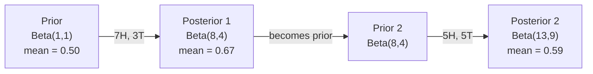

# Теорема Байеса

> Вероятность — о том, чего вы ожидаете. Теорема Байеса — о том, чему вы учитесь.

**Тип:** Build
**Язык:** Python
**Предварительные требования:** Фаза 1, Урок 06 (Основы теории вероятностей)
**Время:** ~75 минут

## Цели обучения

- Применять теорему Байеса для вычисления апостериорных вероятностей на основе априорных вероятностей, правдоподобия и свидетельства
- Построить с нуля наивный байесовский текстовый классификатор со сглаживанием Лапласа и вычислениями в лог-пространстве
- Сравнить оценки MLE и MAP и объяснить, как MAP соответствует L2-регуляризации
- Реализовать последовательное байесовское обновление с использованием сопряжённых Beta-Binomial априорных распределений для A/B-тестирования

## Проблема

Медицинский тест имеет точность 99%. Вы получили положительный результат. Каков шанс, что вы действительно больны?

Большинство людей отвечают 99%. Реальный ответ зависит от того, насколько редка болезнь. Если ею болеет 1 человек из 10 000, положительный результат даёт лишь около 1% шанса быть больным. Остальные 99% положительных результатов — ложные тревоги у здоровых людей.

Это не хитрый вопрос. Это теорема Байеса. Каждый спам-фильтр, каждая медицинская диагностика, каждая модель машинного обучения, количественно оценивающая неопределённость, использует именно это рассуждение. Вы начинаете с убеждения. Вы видите свидетельство. Вы обновляете убеждение.

Если вы создаёте ML-системы, не понимая этого, вы будете неверно интерпретировать выходы модели, устанавливать плохие пороги и выпускать самоуверенные предсказания.

## Концепция

### От совместной вероятности к теореме Байеса

Из Урока 06 вы уже знаете, что условная вероятность выглядит так:

```
P(A|B) = P(A and B) / P(B)
```

И симметрично:

```
P(B|A) = P(A and B) / P(A)
```

Оба выражения имеют общий числитель: P(A and B). Приравняем их и преобразуем:

```
P(A and B) = P(A|B) * P(B) = P(B|A) * P(A)

Therefore:

P(A|B) = P(B|A) * P(A) / P(B)
```

Это и есть теорема Байеса. Четыре величины, одно уравнение.

### Четыре составляющие

| Часть | Название | Что это означает |
|------|------|---------------|
| P(A\|B) | Апостериорная вероятность | Ваше обновлённое убеждение об A после наблюдения свидетельства B |
| P(B\|A) | Правдоподобие | Насколько вероятно свидетельство B, если A истинно |
| P(A) | Априорная вероятность | Ваше убеждение об A до наблюдения какого-либо свидетельства |
| P(B) | Свидетельство | Полная вероятность наблюдения B при всех возможных вариантах |

Член свидетельства P(B) выступает нормализатором. Его можно раскрыть с помощью закона полной вероятности:

```
P(B) = P(B|A) * P(A) + P(B|not A) * P(not A)
```

### Пример с медицинским тестом

Болезнь поражает 1 человека из 10 000. Тест имеет точность 99% (обнаруживает 99% больных, даёт ложноположительный результат в 1% случаев).

```
P(sick)          = 0.0001     (prior: disease is rare)
P(positive|sick) = 0.99       (likelihood: test catches it)
P(positive|healthy) = 0.01    (false positive rate)

P(positive) = P(positive|sick) * P(sick) + P(positive|healthy) * P(healthy)
            = 0.99 * 0.0001 + 0.01 * 0.9999
            = 0.000099 + 0.009999
            = 0.010098

P(sick|positive) = P(positive|sick) * P(sick) / P(positive)
                 = 0.99 * 0.0001 / 0.010098
                 = 0.0098
                 = 0.98%
```

Меньше 1%. Доминирует априорная вероятность. Когда состояние редкое, даже точные тесты в основном дают ложные срабатывания. Именно поэтому врачи назначают подтверждающие тесты.

### Пример со спам-фильтром

Вы получили письмо со словом «lottery». Это спам?

```
P(spam)                = 0.3      (30% of email is spam)
P("lottery"|spam)      = 0.05     (5% of spam emails contain "lottery")
P("lottery"|not spam)  = 0.001    (0.1% of legitimate emails contain "lottery")

P("lottery") = 0.05 * 0.3 + 0.001 * 0.7
             = 0.015 + 0.0007
             = 0.0157

P(spam|"lottery") = 0.05 * 0.3 / 0.0157
                  = 0.955
                  = 95.5%
```

Одно слово сдвигает вероятность с 30% до 95.5%. Настоящий спам-фильтр применяет теорему Байеса к сотням слов одновременно.

### Наивный байесовский классификатор: предположение о независимости

Наивный байесовский классификатор расширяет это на несколько признаков, предполагая, что все признаки условно независимы при заданном классе:

```
P(class | feature_1, feature_2, ..., feature_n)
  = P(class) * P(feature_1|class) * P(feature_2|class) * ... * P(feature_n|class)
    / P(feature_1, feature_2, ..., feature_n)
```

«Наивная» часть — это предположение о независимости. В тексте вхождения слов не независимы («New» и «York» коррелируют). Но на практике это предположение работает на удивление хорошо, потому что классификатору нужно лишь ранжировать классы, а не выдавать калиброванные вероятности.

Поскольку знаменатель одинаков для всех классов, его можно опустить и сравнивать только числители:

```
score(class) = P(class) * product of P(feature_i | class)
```

Выбирается класс с наибольшим значением.

### Оценка максимального правдоподобия (MLE)

Как получить P(feature|class) из обучающих данных? Подсчётом.

```
P("free"|spam) = (number of spam emails containing "free") / (total spam emails)
```

Это и есть MLE: выбор значений параметров, при которых наблюдаемые данные наиболее вероятны. Вы максимизируете функцию правдоподобия, которая для дискретных счётчиков сводится к относительной частоте.

Проблема: если слово ни разу не встретилось в спаме во время обучения, MLE присваивает ему нулевую вероятность. Одно невиданное слово обнуляет всё произведение. Исправляется это сглаживанием Лапласа:

```
P(word|class) = (count(word, class) + 1) / (total_words_in_class + vocabulary_size)
```

Добавление 1 к каждому счётчику гарантирует, что ни одна вероятность никогда не станет нулевой.

### Максимум апостериорной вероятности (MAP)

MLE задаёт вопрос: какие параметры максимизируют P(data|parameters)?

MAP задаёт вопрос: какие параметры максимизируют P(parameters|data)?

По теореме Байеса:

```
P(parameters|data) proportional to P(data|parameters) * P(parameters)
```

MAP добавляет априорное распределение над самими параметрами. Если вы считаете, что параметры должны быть маленькими, вы кодируете это как априорное распределение, штрафующее большие значения. Это идентично L2-регуляризации в ML. Штраф «ridge» в ridge-регрессии буквально представляет собой гауссовское априорное распределение на веса.

| Оценка | Оптимизирует | Эквивалент в ML |
|------------|-----------|---------------|
| MLE | P(data\|params) | Обучение без регуляризации |
| MAP | P(data\|params) * P(params) | L2- / L1-регуляризация |

### Байесовский подход против частотного: практическая разница

Частотники рассматривают параметры как фиксированные неизвестные величины. Они спрашивают: «Если бы я повторил этот эксперимент много раз, что бы произошло?»

Байесианцы рассматривают параметры как распределения. Они спрашивают: «Учитывая то, что я наблюдал, во что я верю относительно параметров?»

Для построения ML-систем практическая разница такова:

| Аспект | Частотный подход | Байесовский подход |
|--------|-------------|----------|
| Результат | Точечная оценка | Распределение по значениям |
| Неопределённость | Доверительные интервалы (о процедуре) | Достоверные интервалы (о параметре) |
| Мало данных | Может переобучиться | Априорное распределение действует как регуляризация |
| Вычисления | Обычно быстрее | Часто требует сэмплирования (MCMC) |

Большая часть промышленного ML — частотная (SGD, точечные оценки). Байесовские методы раскрываются, когда нужна калиброванная неопределённость (медицинские решения, критичные для безопасности системы) или когда данных мало (обучение с несколькими примерами, холодный старт).

### Почему байесовское мышление важно для ML

Связь глубже, чем просто аналогия:

**Априорные распределения — это регуляризация.** Гауссовское априорное распределение на веса — это L2-регуляризация. Лапласовское — это L1. Каждый раз, добавляя член регуляризации, вы делаете байесовское утверждение о том, каких значений параметров вы ожидаете.

**Апостериорные распределения — это неопределённость.** Единственная предсказанная вероятность ничего не говорит о том, насколько модель уверена в этой оценке. Байесовские методы дают вам распределение: «Я думаю, что P(spam) находится между 0.8 и 0.95».

**Байесовские обновления — это онлайн-обучение.** Сегодняшнее апостериорное распределение становится завтрашним априорным. Когда ваша модель видит новые данные, она обновляет свои убеждения инкрементально, вместо переобучения с нуля.

**Сравнение моделей — это байесовский подход.** Байесовский информационный критерий (BIC), маргинальное правдоподобие и байесовские факторы — все они используют байесовское рассуждение для выбора между моделями без переобучения.

```figure
bayes-update
```

## Создаём

### Шаг 1: Функция теоремы Байеса

```python
def bayes(prior, likelihood, false_positive_rate):
    evidence = likelihood * prior + false_positive_rate * (1 - prior)
    posterior = likelihood * prior / evidence
    return posterior

result = bayes(prior=0.0001, likelihood=0.99, false_positive_rate=0.01)
print(f"P(sick|positive) = {result:.4f}")
```

### Шаг 2: Наивный байесовский классификатор

```python
import math
from collections import defaultdict

class NaiveBayes:
    def __init__(self, smoothing=1.0):
        self.smoothing = smoothing
        self.class_counts = defaultdict(int)
        self.word_counts = defaultdict(lambda: defaultdict(int))
        self.class_word_totals = defaultdict(int)
        self.vocab = set()

    def train(self, documents, labels):
        for doc, label in zip(documents, labels):
            self.class_counts[label] += 1
            words = doc.lower().split()
            for word in words:
                self.word_counts[label][word] += 1
                self.class_word_totals[label] += 1
                self.vocab.add(word)

    def predict(self, document):
        words = document.lower().split()
        total_docs = sum(self.class_counts.values())
        vocab_size = len(self.vocab)
        best_class = None
        best_score = float("-inf")
        for cls in self.class_counts:
            score = math.log(self.class_counts[cls] / total_docs)
            for word in words:
                count = self.word_counts[cls].get(word, 0)
                total = self.class_word_totals[cls]
                score += math.log((count + self.smoothing) / (total + self.smoothing * vocab_size))
            if score > best_score:
                best_score = score
                best_class = cls
        return best_class
```

Логарифмические вероятности предотвращают underflow. Перемножение множества малых вероятностей даёт числа, слишком крошечные для формата с плавающей точкой. Суммирование логарифмов вероятностей численно устойчиво и математически эквивалентно.

### Шаг 3: Обучение на спам-данных

```python
train_docs = [
    "win free money now",
    "free lottery ticket winner",
    "claim your prize today free",
    "urgent offer free cash",
    "congratulations you won free",
    "meeting tomorrow at noon",
    "project update attached",
    "can we schedule a call",
    "quarterly report review",
    "lunch on thursday sounds good",
    "team standup notes attached",
    "please review the pull request",
]

train_labels = [
    "spam", "spam", "spam", "spam", "spam",
    "ham", "ham", "ham", "ham", "ham", "ham", "ham",
]

classifier = NaiveBayes()
classifier.train(train_docs, train_labels)

test_messages = [
    "free money waiting for you",
    "meeting rescheduled to friday",
    "you won a free prize",
    "please review the attached report",
]

for msg in test_messages:
    print(f"  '{msg}' -> {classifier.predict(msg)}")
```

### Шаг 4: Изучаем выученные вероятности

```python
def show_top_words(classifier, cls, n=5):
    vocab_size = len(classifier.vocab)
    total = classifier.class_word_totals[cls]
    probs = {}
    for word in classifier.vocab:
        count = classifier.word_counts[cls].get(word, 0)
        probs[word] = (count + classifier.smoothing) / (total + classifier.smoothing * vocab_size)
    sorted_words = sorted(probs.items(), key=lambda x: x[1], reverse=True)
    for word, prob in sorted_words[:n]:
        print(f"    {word}: {prob:.4f}")

print("\nTop spam words:")
show_top_words(classifier, "spam")
print("\nTop ham words:")
show_top_words(classifier, "ham")
```

## Применяем

Scikit-learn поставляется с готовыми к промышленному использованию реализациями наивного байесовского классификатора:

```python
from sklearn.feature_extraction.text import CountVectorizer
from sklearn.naive_bayes import MultinomialNB
from sklearn.metrics import classification_report

vectorizer = CountVectorizer()
X_train = vectorizer.fit_transform(train_docs)
clf = MultinomialNB()
clf.fit(X_train, train_labels)

X_test = vectorizer.transform(test_messages)
predictions = clf.predict(X_test)
for msg, pred in zip(test_messages, predictions):
    print(f"  '{msg}' -> {pred}")
```

Тот же алгоритм. CountVectorizer выполняет токенизацию и построение словаря. MultinomialNB внутренне выполняет сглаживание и вычисления с логарифмами вероятностей. Ваша версия с нуля делает то же самое за 40 строк.

## Публикуем

Класс NaiveBayes, построенный здесь, демонстрирует весь конвейер: токенизацию, оценку вероятностей со сглаживанием Лапласа, предсказание в лог-пространстве. Код в `code/bayes.py` работает от начала до конца без зависимостей помимо стандартной библиотеки Python.

### Сопряжённые априорные распределения

Когда априорное и апостериорное распределения принадлежат одному семейству распределений, априорное распределение называется «сопряжённым». Это делает байесовское обновление алгебраически чистым — вы получаете апостериорное распределение в замкнутой форме без численного интегрирования.

| Правдоподобие | Сопряжённое априорное | Апостериорное | Пример |
|-----------|----------------|-----------|---------|
| Bernoulli | Beta(a, b) | Beta(a + successes, b + failures) | Оценка смещённости монеты |
| Normal (known variance) | Normal(mu_0, sigma_0) | Normal(weighted mean, smaller variance) | Калибровка датчика |
| Poisson | Gamma(a, b) | Gamma(a + sum of counts, b + n) | Моделирование частоты поступлений |
| Multinomial | Dirichlet(alpha) | Dirichlet(alpha + counts) | Тематическое моделирование, языковые модели |

Почему это важно: без сопряжённых априорных распределений для приближения апостериорного распределения нужны сэмплирование Монте-Карло или вариационный вывод. С сопряжёнными априорными распределениями достаточно обновить два числа.

Бета-распределение — самое распространённое сопряжённое априорное распределение на практике. Beta(a, b) представляет ваше убеждение о параметре-вероятности. Среднее значение равно a/(a+b). Чем больше a+b, тем сконцентрированнее (увереннее) распределение.

Частные случаи бета-априорного распределения:
- Beta(1, 1) = равномерное. У вас нет мнения о параметре.
- Beta(10, 10) = пик в 0.5. Вы сильно уверены, что параметр близок к 0.5.
- Beta(1, 10) = смещено к 0. Вы считаете, что параметр мал.

Правило обновления предельно простое:

```
Prior:     Beta(a, b)
Data:      s successes, f failures
Posterior: Beta(a + s, b + f)
```

Никаких интегралов. Никакого сэмплирования. Просто сложение.

### Последовательное байесовское обновление

Байесовский вывод по своей природе последователен. Сегодняшнее апостериорное распределение становится завтрашним априорным. Именно так реальные системы обучаются инкрементально, не переобрабатывая все исторические данные.

Конкретный пример: оценка того, честная ли монета.

**День 1: данных ещё нет.**
Начинаем с Beta(1, 1) — равномерного априорного распределения. У вас нет мнения.
- Среднее априорного: 0.5
- Априорное распределение плоское на [0, 1]

**День 2: наблюдаем 7 орлов, 3 решки.**
Posterior = Beta(1 + 7, 1 + 3) = Beta(8, 4)
- Среднее апостериорного: 8/12 = 0.667
- Свидетельство указывает на смещение монеты в сторону орла

**День 3: наблюдаем ещё 5 орлов, 5 решек.**
Используем вчерашнее апостериорное распределение как сегодняшнее априорное.
Posterior = Beta(8 + 5, 4 + 5) = Beta(13, 9)
- Среднее апостериорного: 13/22 = 0.591
- Сбалансированные новые данные притянули оценку обратно к 0.5



Порядок наблюдений не важен. Beta(1,1), обновлённое сразу всеми 12 орлами и 8 решками, даёт Beta(13, 9) — тот же результат. Последовательное и пакетное обновление математически эквивалентны. Но последовательное обновление позволяет принимать решения на каждом шаге, не храня исходные данные.

Это основа онлайн-обучения в промышленных ML-системах. Thompson-сэмплирование для бандитов, инкрементальные рекомендательные системы и потоковые детекторы аномалий — все они используют этот паттерн.

### Связь с A/B-тестированием

A/B-тестирование — это байесовский вывод в замаскированном виде.

Постановка задачи: вы тестируете два цвета кнопки. Вариант A (синий) и вариант B (зелёный). Вы хотите узнать, какой из них получает больше кликов.

Байесовский A/B-тест:

1. **Априорное распределение.** Начинаем с Beta(1, 1) для обоих вариантов. Нет предпочтения заранее.
2. **Данные.** Вариант A: 50 кликов из 1000 просмотров. Вариант B: 65 кликов из 1000 просмотров.
3. **Апостериорные распределения.**
   - A: Beta(1 + 50, 1 + 950) = Beta(51, 951). Среднее = 0.051
   - B: Beta(1 + 65, 1 + 935) = Beta(66, 936). Среднее = 0.066
4. **Решение.** Вычисляем P(B > A) — вероятность того, что истинный коэффициент конверсии B выше, чем у A.

Вычислить P(B > A) аналитически сложно. Но с Монте-Карло это тривиально:

```
1. Draw 100,000 samples from Beta(51, 951)  -> samples_A
2. Draw 100,000 samples from Beta(66, 936)  -> samples_B
3. P(B > A) = fraction of samples where B > A
```

Если P(B > A) > 0.95, вы выпускаете вариант B. Если значение между 0.05 и 0.95, вы продолжаете собирать данные. Если P(B > A) < 0.05, вы выпускаете вариант A.

Преимущества перед частотным A/B-тестированием:
- Вы получаете прямое утверждение о вероятности: «есть 97% шанс, что B лучше»
- Никакой путаницы с p-значениями. Никаких оговорок вроде «не удалось отвергнуть нулевую гипотезу».
- Вы можете проверять результаты в любой момент, не завышая частоту ложных срабатываний (нет «проблемы подглядывания»)
- Вы можете включать априорные знания (например, предыдущие тесты показывают, что коэффициенты конверсии обычно составляют 3-8%)

| Аспект | Частотный A/B | Байесовский A/B |
|--------|----------------|--------------|
| Результат | p-значение | P(B > A) |
| Интерпретация | «Насколько удивительны эти данные, если A=B?» | «Насколько вероятно, что B лучше A?» |
| Ранняя остановка | Завышает число ложных срабатываний | Безопасна в любой момент (при удачно выбранном априорном распределении и корректно заданной модели) |
| Априорные знания | Не используются | Кодируются как бета-априорное распределение |
| Правило принятия решения | p < 0.05 | P(B > A) > порог |

## Упражнения

1. **Множественные тесты.** Пациент получает два независимых положительных результата теста (оба с точностью 99%, распространённость болезни 1 на 10 000). Каково P(sick) после обоих тестов? Используйте апостериорное распределение из первого теста как априорное для второго.

2. **Влияние сглаживания.** Запустите спам-классификатор со значениями сглаживания 0.01, 0.1, 1.0 и 10.0. Как меняются вероятности топ-слов? Что происходит при smoothing=0 и слове, встречающемся только в ham?

3. **Добавьте признаки.** Расширьте класс NaiveBayes так, чтобы использовать также длину сообщения (короткое/длинное) как признак наряду со счётчиками слов. Оцените P(short|spam) и P(short|ham) по обучающим данным и включите это в оценку предсказания.

4. **MAP вручную.** Дано наблюдение (7 орлов из 10 подбрасываний монеты), вычислите MAP-оценку смещённости, используя априорное распределение Beta(2,2). Сравните с MLE-оценкой (7/10).

## Ключевые термины

| Термин | Что говорят люди | Что это на самом деле означает |
|------|----------------|----------------------|
| Prior | «Моё изначальное предположение» | P(hypothesis) до наблюдения свидетельства. В ML: член регуляризации. |
| Likelihood | «Насколько хорошо данные подходят» | P(evidence\|hypothesis). Насколько вероятны наблюдаемые данные при конкретной гипотезе. |
| Posterior | «Моё обновлённое убеждение» | P(hypothesis\|evidence). Априорная вероятность, умноженная на правдоподобие, затем нормализованная. |
| Evidence | «Нормализующая константа» | P(data) по всем гипотезам. Гарантирует, что апостериорное распределение суммируется в 1. |
| Naive Bayes | «Тот простой текстовый классификатор» | Классификатор, предполагающий, что признаки независимы при заданном классе. Хорошо работает несмотря на ложное предположение. |
| Laplace smoothing | «Сглаживание добавлением единицы» | Добавление небольшого счётчика к каждому признаку, чтобы предотвратить нулевые вероятности из-за невиданных данных. |
| MLE | «Просто используй частоты» | Выбор параметров, максимизирующих P(data\|parameters). Без априорного распределения. Может переобучиться на малых данных. |
| MAP | «MLE с априорным распределением» | Выбор параметров, максимизирующих P(data\|parameters) * P(parameters). Эквивалентно регуляризованному MLE. |
| Log-probability | «Работа в лог-пространстве» | Использование log(P) вместо P, чтобы избежать underflow с плавающей точкой при перемножении множества малых чисел. |
| False positive | «Ложная тревога» | Тест говорит «положительно», но истинное состояние отрицательное. Порождает ошибку базовой частоты (base rate fallacy). |

## Дополнительные материалы

- [3Blue1Brown: теорема Байеса](https://www.youtube.com/watch?v=HZGCoVF3YvM) — наглядное объяснение на примере медицинского теста
- [Stanford CS229: генеративные алгоритмы обучения](https://cs229.stanford.edu/notes2022fall/cs229-notes2.pdf) — наивный байесовский классификатор и его связь с дискриминативными моделями
- [Think Bayes](https://greenteapress.com/wp/think-bayes/) — бесплатная книга, байесовская статистика с кодом на Python
- [scikit-learn: наивный байесовский классификатор](https://scikit-learn.org/stable/modules/naive_bayes.html) — готовые к промышленному использованию реализации и когда использовать каждый вариант
