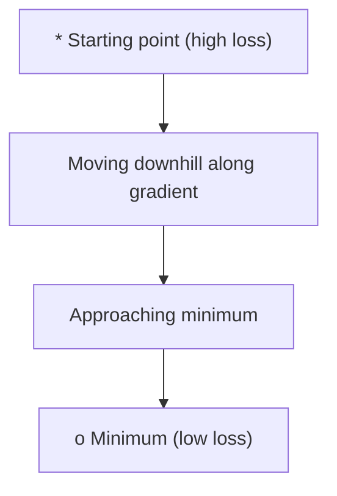
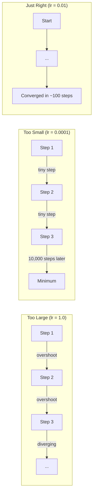
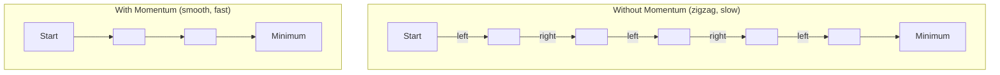
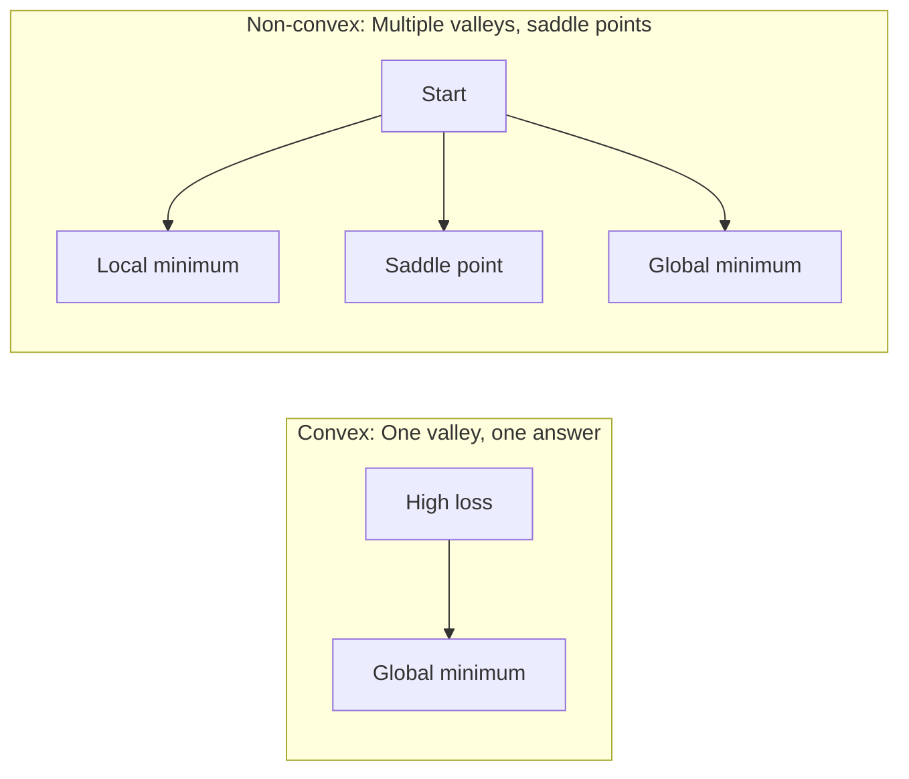
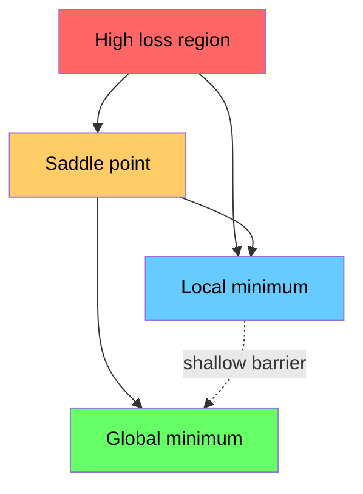

# Оптимизация

> Обучение нейронной сети — это не что иное, как поиск дна долины.

**Тип:** Build
**Язык:** Python
**Предварительные требования:** Фаза 1, Уроки 04-05 (Производные, Градиенты)
**Время:** ~75 минут

## Цели обучения

- Реализовать с нуля обычный градиентный спуск, SGD с моментом и Adam
- Сравнить сходимость оптимизаторов на функции Розенброка и объяснить, почему Adam адаптирует скорость обучения для каждого веса
- Различать выпуклые и невыпуклые ландшафты функции потерь и объяснить роль седловых точек в пространствах высокой размерности
- Настроить расписания скорости обучения (ступенчатое затухание, косинусное отжигание, разогрев) для стабильности обучения

## Проблема

У вас есть функция потерь. Она показывает, насколько неправа ваша модель. У вас есть градиенты. Они показывают, в каком направлении потери увеличиваются. Теперь вам нужна стратегия движения вниз по склону.

Наивный подход прост: двигаться против направления градиента. Масштабировать шаг числом, называемым скоростью обучения. Повторять. Это градиентный спуск, и он работает. Но у слова «работает» есть оговорки. Слишком большая скорость обучения — и вы полностью перескакиваете долину, отскакивая от стенок. Слишком маленькая — и вы ползёте к ответу тысячи ненужных шагов. Попадаете в седловую точку — и останавливаетесь, даже не найдя минимум.

Каждый оптимизатор в глубоком обучении — это ответ на один и тот же вопрос: как быстрее и надёжнее добраться до дна долины?

## Концепция

### Что означает оптимизация

Оптимизация — это поиск входных значений, минимизирующих (или максимизирующих) функцию. В машинном обучении такой функцией являются потери. Входные значения — это веса модели. Обучение — это оптимизация.

```
minimize L(w) where:
  L = loss function
  w = model weights (could be millions of parameters)
```

### Градиентный спуск (обычный)

Простейший оптимизатор. Вычислить градиент потерь по каждому весу. Сдвинуть каждый вес в направлении, противоположном его градиенту. Масштабировать шаг скоростью обучения.

```
w = w - lr * gradient
```

Это весь алгоритм. Одна строка.



### Скорость обучения: самый важный гиперпараметр

Скорость обучения контролирует размер шага. Она определяет всё в отношении сходимости.



Формулы для правильной скорости обучения не существует. Вы находите её экспериментально. Типичные отправные точки: 0.001 для Adam, 0.01 для SGD с моментом.

### SGD против пакетного против мини-пакетного

Обычный градиентный спуск вычисляет градиент по всему набору данных перед тем, как сделать один шаг. Это называется пакетным градиентным спуском (batch gradient descent). Он стабилен, но медленный.

Стохастический градиентный спуск (SGD) вычисляет градиент по одному случайному образцу и сразу делает шаг. Он шумный, но быстрый.

Мини-пакетный градиентный спуск — золотая середина. Вычислить градиент по небольшому пакету (32, 64, 128, 256 образцов), затем сделать шаг. Именно это используют все на практике.

| Вариант | Размер пакета | Качество градиента | Скорость на шаг | Шум |
|---------|-----------|-----------------|---------------|-------|
| Batch GD | Весь набор данных | Точное | Медленно | Отсутствует |
| SGD | 1 образец | Очень шумное | Быстро | Высокий |
| Мини-пакетный | 32-256 | Хорошая оценка | Сбалансированно | Умеренный |

Шум в SGD и мини-пакетном градиентном спуске — не баг. Он помогает выбраться из неглубоких локальных минимумов и седловых точек.

### Момент: шар, катящийся вниз по склону

Обычный градиентный спуск учитывает только текущий градиент. Если градиент зигзагообразно меняется (обычное дело в узких долинах), прогресс идёт медленно. Момент решает эту проблему, накапливая прошлые градиенты в член скорости.

```
v = beta * v + gradient
w = w - lr * v
```

Аналогия: шар, катящийся вниз по склону. Он не останавливается и не начинает заново на каждой неровности. Он набирает скорость в устойчивых направлениях и гасит колебания.



`beta` (обычно 0.9) контролирует, сколько истории сохранять. Более высокое beta означает больше момента, более плавные траектории, но более медленную реакцию на смену направления.

### Adam: адаптивные скорости обучения

Разным весам нужны разные скорости обучения. Вес, который редко получает большие градиенты, должен делать более крупные шаги, когда это всё же происходит. Вес, постоянно получающий огромные градиенты, должен делать более мелкие шаги.

Adam (Adaptive Moment Estimation) отслеживает две величины для каждого веса:

1. Первый момент (m): скользящее среднее градиентов (как в моменте)
2. Второй момент (v): скользящее среднее квадратов градиентов (величина градиента)

```
m = beta1 * m + (1 - beta1) * gradient
v = beta2 * v + (1 - beta2) * gradient^2

m_hat = m / (1 - beta1^t)    bias correction
v_hat = v / (1 - beta2^t)    bias correction

w = w - lr * m_hat / (sqrt(v_hat) + epsilon)
```

Деление на `sqrt(v_hat)` — ключевая идея. Веса с большими градиентами делятся на большое число (небольшой эффективный шаг). Веса с малыми градиентами делятся на маленькое число (большой эффективный шаг). Каждый вес получает собственную адаптивную скорость обучения.

Гиперпараметры по умолчанию: `lr=0.001, beta1=0.9, beta2=0.999, epsilon=1e-8`. Эти значения по умолчанию хорошо работают для большинства задач.

### Расписания скорости обучения

Фиксированная скорость обучения — это компромисс. В начале обучения нужны большие шаги для быстрого прогресса. В конце обучения нужны маленькие шаги для тонкой настройки около минимума.

Распространённые расписания:

| Расписание | Формула | Сценарий использования |
|----------|---------|----------|
| Step decay | lr = lr * factor every N epochs | Простой ручной контроль |
| Exponential decay | lr = lr_0 * decay^t | Плавное уменьшение |
| Cosine annealing | lr = lr_min + 0.5 * (lr_max - lr_min) * (1 + cos(pi * t / T)) | Трансформеры, современное обучение |
| Warmup + decay | Linear ramp up, then decay | Крупные модели, предотвращает раннюю нестабильность |

### Выпуклость против невыпуклости

Выпуклая функция имеет один минимум. Градиентный спуск всегда его находит. Квадратичная функция вида `f(x) = x^2` выпукла.

Функции потерь нейронных сетей невыпуклые. У них много локальных минимумов, седловых точек и плоских областей.



На практике локальные минимумы в высокоразмерных нейронных сетях редко становятся проблемой. У большинства локальных минимумов значения потерь близки к глобальному минимуму. Настоящее препятствие — седловые точки (плоские в одних направлениях, изогнутые в других). Момент и шум от мини-пакетов помогают их избегать.

### Визуализация ландшафта потерь

Потери — это функция от всех весов. Для модели с 1 миллионом весов ландшафт потерь существует в пространстве размерностью 1 000 001. Мы визуализируем его, выбирая два случайных направления в пространстве весов и строя график потерь вдоль этих направлений, получая 2D-поверхность.



Острые минимумы плохо обобщаются. Плоские минимумы обобщаются хорошо. Это одна из причин, почему SGD с моментом часто превосходит Adam по итоговой точности на тесте: его шум мешает застреванию в острых минимумах.

```figure
gradient-descent
```

## Создаём

### Шаг 1: Определяем тестовую функцию

Функция Розенброка — классический бенчмарк оптимизации. Её минимум находится в точке (1, 1) внутри узкой изогнутой долины, которую легко найти, но трудно проследить.

```
f(x, y) = (1 - x)^2 + 100 * (y - x^2)^2
```

```python
def rosenbrock(params):
    x, y = params
    return (1 - x) ** 2 + 100 * (y - x ** 2) ** 2

def rosenbrock_gradient(params):
    x, y = params
    df_dx = -2 * (1 - x) + 200 * (y - x ** 2) * (-2 * x)
    df_dy = 200 * (y - x ** 2)
    return [df_dx, df_dy]
```

### Шаг 2: Обычный градиентный спуск

```python
class GradientDescent:
    def __init__(self, lr=0.001):
        self.lr = lr

    def step(self, params, grads):
        return [p - self.lr * g for p, g in zip(params, grads)]
```

### Шаг 3: SGD с моментом

```python
class SGDMomentum:
    def __init__(self, lr=0.001, momentum=0.9):
        self.lr = lr
        self.momentum = momentum
        self.velocity = None

    def step(self, params, grads):
        if self.velocity is None:
            self.velocity = [0.0] * len(params)
        self.velocity = [
            self.momentum * v + g
            for v, g in zip(self.velocity, grads)
        ]
        return [p - self.lr * v for p, v in zip(params, self.velocity)]
```

### Шаг 4: Adam

```python
class Adam:
    def __init__(self, lr=0.001, beta1=0.9, beta2=0.999, epsilon=1e-8):
        self.lr = lr
        self.beta1 = beta1
        self.beta2 = beta2
        self.epsilon = epsilon
        self.m = None
        self.v = None
        self.t = 0

    def step(self, params, grads):
        if self.m is None:
            self.m = [0.0] * len(params)
            self.v = [0.0] * len(params)

        self.t += 1

        self.m = [
            self.beta1 * m + (1 - self.beta1) * g
            for m, g in zip(self.m, grads)
        ]
        self.v = [
            self.beta2 * v + (1 - self.beta2) * g ** 2
            for v, g in zip(self.v, grads)
        ]

        m_hat = [m / (1 - self.beta1 ** self.t) for m in self.m]
        v_hat = [v / (1 - self.beta2 ** self.t) for v in self.v]

        return [
            p - self.lr * mh / (vh ** 0.5 + self.epsilon)
            for p, mh, vh in zip(params, m_hat, v_hat)
        ]
```

### Шаг 5: Запускаем и сравниваем

```python
def optimize(optimizer, func, grad_func, start, steps=5000):
    params = list(start)
    history = [params[:]]
    for _ in range(steps):
        grads = grad_func(params)
        params = optimizer.step(params, grads)
        history.append(params[:])
    return history

start = [-1.0, 1.0]

gd_history = optimize(GradientDescent(lr=0.0005), rosenbrock, rosenbrock_gradient, start)
sgd_history = optimize(SGDMomentum(lr=0.0001, momentum=0.9), rosenbrock, rosenbrock_gradient, start)
adam_history = optimize(Adam(lr=0.01), rosenbrock, rosenbrock_gradient, start)

for name, history in [("GD", gd_history), ("SGD+M", sgd_history), ("Adam", adam_history)]:
    final = history[-1]
    loss = rosenbrock(final)
    print(f"{name:6s} -> x={final[0]:.6f}, y={final[1]:.6f}, loss={loss:.8f}")
```

Ожидаемый результат: Adam сходится быстрее всех. SGD с моментом идёт по более плавной траектории. Обычный GD прогрессирует медленно вдоль узкой долины.

## Применяем

На практике используйте оптимизаторы PyTorch или JAX. Они обрабатывают группы параметров, затухание весов, обрезку градиентов и ускорение на GPU.

```python
import torch

model = torch.nn.Linear(784, 10)

sgd = torch.optim.SGD(model.parameters(), lr=0.01, momentum=0.9)
adam = torch.optim.Adam(model.parameters(), lr=0.001)
adamw = torch.optim.AdamW(model.parameters(), lr=0.001, weight_decay=0.01)

scheduler = torch.optim.lr_scheduler.CosineAnnealingLR(adam, T_max=100)
```

Практические правила:

- Начинайте с Adam (lr=0.001). Он работает для большинства задач без настройки.
- Переходите на SGD с моментом (lr=0.01, momentum=0.9), когда нужна максимальная итоговая точность и есть время на настройку.
- Используйте AdamW (Adam с раздельным затуханием весов) для трансформеров.
- Всегда используйте расписание скорости обучения для запусков обучения длиннее нескольких эпох.
- Если обучение нестабильно, уменьшите скорость обучения. Если обучение слишком медленное, увеличьте её.

## Публикуем

Этот урок создаёт промпт для выбора правильного оптимизатора. См. `outputs/prompt-optimizer-guide.md`.

Классы оптимизаторов, построенные здесь, снова появятся в Фазе 3, когда мы будем обучать нейронную сеть с нуля.

## Упражнения

1. **Перебор скорости обучения.** Запустите обычный градиентный спуск на функции Розенброка со скоростями обучения [0.0001, 0.0005, 0.001, 0.005, 0.01]. Постройте график или выведите итоговые потери после 5000 шагов для каждого значения. Найдите наибольшую скорость обучения, при которой всё ещё происходит сходимость.

2. **Сравнение момента.** Запустите SGD с моментом со значениями [0.0, 0.5, 0.9, 0.99] на функции Розенброка. Отслеживайте потери на каждом шаге. Какое значение момента сходится быстрее всего? Какое перескакивает?

3. **Выход из седловой точки.** Определите функцию `f(x, y) = x^2 - y^2` (седловая точка в начале координат). Начните в точке (0.01, 0.01). Сравните поведение обычного GD, SGD с моментом и Adam. Какой из них выходит из седловой точки?

4. **Реализуйте затухание скорости обучения.** Добавьте расписание экспоненциального затухания в класс GradientDescent: `lr = lr_0 * 0.999^step`. Сравните сходимость с затуханием и без него на функции Розенброка.

## Ключевые термины

| Термин | Что говорят люди | Что это на самом деле означает |
|------|----------------|----------------------|
| Gradient descent | «Иди вниз по склону» | Обновление весов вычитанием градиента, масштабированного скоростью обучения. Самый базовый оптимизатор. |
| Learning rate | «Размер шага» | Скаляр, контролирующий, насколько далеко каждое обновление сдвигает веса. Слишком большое значение вызывает расхождение. Слишком маленькое расходует вычисления впустую. |
| Momentum | «Продолжай катиться» | Накопление прошлых градиентов в вектор скорости. Гасит колебания и ускоряет движение в устойчивых направлениях. |
| SGD | «Случайное сэмплирование» | Стохастический градиентный спуск. Вычисление градиента на случайном подмножестве вместо полного набора данных. На практике почти всегда означает мини-пакетный SGD. |
| Mini-batch | «Кусок данных» | Небольшое подмножество обучающих данных (32-256 образцов), используемое для оценки градиента. Балансирует скорость и точность градиента. |
| Adam | «Оптимизатор по умолчанию» | Adaptive Moment Estimation. Отслеживает скользящие средние градиентов и квадратов градиентов для каждого веса, чтобы дать каждому весу собственную скорость обучения. |
| Bias correction | «Исправление холодного старта» | Первый и второй моменты Adam изначально равны нулю. Коррекция смещения делит на (1 - beta^t), чтобы компенсировать это на ранних шагах. |
| Learning rate schedule | «Меняй lr со временем» | Функция, регулирующая скорость обучения в процессе обучения. Большие шаги в начале, маленькие в конце. |
| Convex function | «Одна долина» | Функция, у которой любой локальный минимум является глобальным. Градиентный спуск всегда его находит. Функции потерь нейронных сетей невыпуклые. |
| Saddle point | «Плоская точка, но не минимум» | Точка, где градиент равен нулю, но она является минимумом в одних направлениях и максимумом в других. Часто встречается в пространствах высокой размерности. |
| Loss landscape | «Рельеф» | Функция потерь, построенная над пространством весов. Визуализируется срезом вдоль двух случайных направлений. |
| Convergence | «Добрались» | Оптимизатор достиг точки, где дальнейшие шаги не приводят к значимому уменьшению потерь. |

## Дополнительные материалы

- [Sebastian Ruder: обзор алгоритмов оптимизации градиентного спуска](https://ruder.io/optimizing-gradient-descent/) — исчерпывающий обзор всех основных оптимизаторов
- [Почему момент действительно работает (Distill)](https://distill.pub/2017/momentum/) — интерактивная визуализация динамики момента
- [Adam: A Method for Stochastic Optimization (Kingma & Ba, 2014)](https://arxiv.org/abs/1412.6980) — оригинальная статья про Adam, доступная для чтения и короткая
- [Visualizing the Loss Landscape of Neural Nets (Li et al., 2018)](https://arxiv.org/abs/1712.09913) — статья, показавшая различие между острыми и плоскими минимумами
