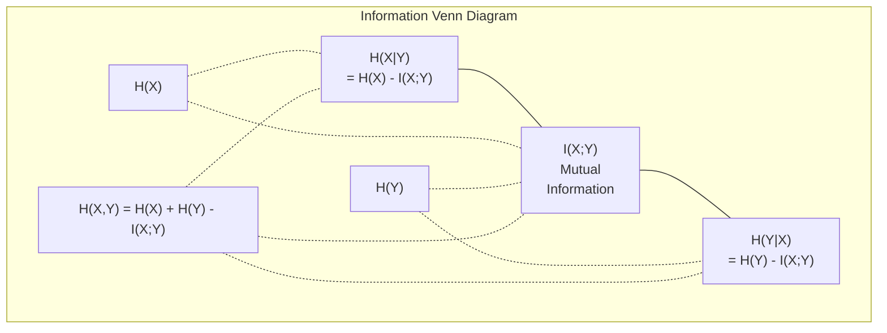

# Теория информации

> Теория информации измеряет удивление. Функции потерь построены на её основе.

**Тип:** Learn
**Язык:** Python
**Предварительные требования:** Фаза 1, Урок 06 (Вероятность)
**Время:** ~60 минут

## Цели обучения

- Вычислить энтропию, перекрёстную энтропию и KL-дивергенцию с нуля и объяснить их взаимосвязь
- Вывести, почему минимизация перекрёстной энтропии эквивалентна максимизации логарифмического правдоподобия
- Вычислить взаимную информацию между признаками и целевой переменной для ранжирования важности признаков
- Объяснить перплексию как эффективный размер словаря, из которого выбирает языковая модель

## Проблема

Вы вызываете `CrossEntropyLoss()` в каждой модели классификации, которую обучаете. Вы видите «перплексию» в каждой статье про языковые модели. Вы читаете про KL-дивергенцию в VAE, дистилляции и RLHF. Это не разрозненные концепции. Все они — одна и та же идея в разных обличьях.

Теория информации даёт вам язык для рассуждения о неопределённости, сжатии и предсказании. Клод Шеннон изобрёл её в 1948 году для решения задач коммуникации. Оказывается, обучение нейронной сети — это задача коммуникации: модель пытается передать правильную метку через зашумлённый канал обученных весов.

Этот урок строит все формулы с нуля, чтобы вы увидели, откуда они берутся и почему работают.

## Концепция

### Информационное содержание (удивление)

Когда происходит что-то маловероятное, оно несёт больше информации. Монета упала орлом? Не удивительно. Выигрыш в лотерею? Очень удивительно.

Информационное содержание события с вероятностью p равно:

```
I(x) = -log(p(x))
```

Использование логарифма по основанию 2 даёт биты. Использование натурального логарифма даёт наты. Одна и та же идея, разные единицы.

```
Event              Probability    Surprise (bits)
Fair coin heads    0.5            1.0
Rolling a 6        0.167          2.58
1-in-1000 event    0.001          9.97
Certain event      1.0            0.0
```

Достоверные события несут нулевую информацию. Вы уже знали, что они произойдут.

### Энтропия (среднее удивление)

Энтропия — это ожидаемое удивление по всем возможным исходам распределения.

```
H(P) = -sum( p(x) * log(p(x)) )  for all x
```

Честная монета имеет максимальную энтропию для бинарной переменной: 1 бит. Смещённая монета (99% орлов) имеет низкую энтропию: 0.08 бит. Вы уже знаете, что произойдёт, поэтому каждое подбрасывание почти ничего вам не сообщает.

```
Fair coin:    H = -(0.5 * log2(0.5) + 0.5 * log2(0.5)) = 1.0 bit
Biased coin:  H = -(0.99 * log2(0.99) + 0.01 * log2(0.01)) = 0.08 bits
```

Энтропия измеряет неустранимую неопределённость в распределении. Ниже неё сжать нельзя.

### Перекрёстная энтропия (функция потерь, которую вы используете каждый день)

Перекрёстная энтропия измеряет среднее удивление при использовании распределения Q для кодирования событий, которые на самом деле приходят из распределения P.

```
H(P, Q) = -sum( p(x) * log(q(x)) )  for all x
```

P — истинное распределение (метки). Q — предсказания вашей модели. Если Q идеально совпадает с P, перекрёстная энтропия равна энтропии. Любое несоответствие делает её больше.

В классификации P — это one-hot вектор (истинный класс имеет вероятность 1, всё остальное — 0). Это упрощает перекрёстную энтропию до:

```
H(P, Q) = -log(q(true_class))
```

Это и есть вся формула потерь перекрёстной энтропии для классификации. Максимизируйте предсказанную вероятность правильного класса.

### KL-дивергенция (расстояние между распределениями)

KL-дивергенция измеряет, сколько дополнительного удивления вы получаете, используя Q вместо P.

```
D_KL(P || Q) = sum( p(x) * log(p(x) / q(x)) )  for all x
             = H(P, Q) - H(P)
```

Перекрёстная энтропия — это энтропия плюс KL-дивергенция. Поскольку энтропия истинного распределения постоянна во время обучения, минимизация перекрёстной энтропии — то же самое, что минимизация KL-дивергенции. Вы подталкиваете распределение своей модели к истинному распределению.

KL-дивергенция несимметрична: D_KL(P || Q) != D_KL(Q || P). Это не настоящая метрика расстояния.

### Взаимная информация

Взаимная информация измеряет, сколько знание одной переменной сообщает о другой.

```
I(X; Y) = H(X) - H(X|Y)
        = H(X) + H(Y) - H(X, Y)
```

Если X и Y независимы, взаимная информация равна нулю. Знание одной ничего не говорит о другой. Если они полностью коррелированы, взаимная информация равна энтропии любой из переменных.

При отборе признаков высокая взаимная информация между признаком и целевой переменной означает, что признак полезен. Низкая взаимная информация означает, что это шум.

### Условная энтропия

H(Y|X) измеряет, сколько неопределённости остаётся относительно Y после наблюдения X.

```
H(Y|X) = H(X,Y) - H(X)
```

Два крайних случая:
- Если X полностью определяет Y, то H(Y|X) = 0. Знание X устраняет всю неопределённость относительно Y. Пример: X = температура в Цельсиях, Y = температура в Фаренгейтах.
- Если X ничего не говорит о Y, то H(Y|X) = H(Y). Знание X никак не уменьшает вашу неопределённость. Пример: X = подбрасывание монеты, Y = завтрашняя погода.

Условная энтропия всегда неотрицательна и никогда не превышает H(Y):

```
0 <= H(Y|X) <= H(Y)
```

В машинном обучении условная энтропия встречается в деревьях решений. На каждом разбиении алгоритм выбирает признак X, минимизирующий H(Y|X) — признак, устраняющий наибольшую неопределённость относительно метки Y.

### Совместная энтропия

H(X,Y) — это энтропия совместного распределения X и Y вместе.

```
H(X,Y) = -sum sum p(x,y) * log(p(x,y))   for all x, y
```

Ключевое свойство:

```
H(X,Y) <= H(X) + H(Y)
```

Равенство выполняется, когда X и Y независимы. Если они разделяют информацию, совместная энтропия меньше суммы отдельных энтропий. «Недостающая» энтропия — это в точности взаимная информация.



Взаимосвязи:
- H(X,Y) = H(X) + H(Y|X) = H(Y) + H(X|Y)
- I(X;Y) = H(X) - H(X|Y) = H(Y) - H(Y|X)
- H(X,Y) = H(X) + H(Y) - I(X;Y)

### Взаимная информация (подробнее)

Взаимная информация I(X;Y) количественно оценивает, насколько знание одной переменной уменьшает неопределённость относительно другой.

```
I(X;Y) = H(X) - H(X|Y)
       = H(Y) - H(Y|X)
       = H(X) + H(Y) - H(X,Y)
       = sum sum p(x,y) * log(p(x,y) / (p(x) * p(y)))
```

Свойства:
- I(X;Y) >= 0 всегда. Вы никогда не теряете информацию, наблюдая что-либо.
- I(X;Y) = 0 тогда и только тогда, когда X и Y независимы.
- I(X;Y) = I(Y;X). Она симметрична, в отличие от KL-дивергенции.
- I(X;X) = H(X). Переменная делится со собой всей своей информацией.

**Взаимная информация для отбора признаков.** В ML вам нужны признаки, информативные относительно целевой переменной. Взаимная информация даёт вам принципиальный способ ранжировать признаки:

1. Для каждого признака X_i вычислите I(X_i; Y), где Y — целевая переменная.
2. Ранжируйте признаки по значению MI.
3. Оставьте k лучших признаков.

Это работает для любой связи между признаком и целевой переменной — линейной, нелинейной, монотонной или нет. Корреляция улавливает только линейные связи. MI улавливает всё.

| Метод | Обнаруживает | Вычислительная стоимость | Работает с категориальными данными? |
|--------|---------|-------------------|---------------------|
| Pearson correlation | Линейные связи | O(n) | Нет |
| Spearman correlation | Монотонные связи | O(n log n) | Нет |
| Mutual information | Любую статистическую зависимость | O(n log n) с биннингом | Да |

### Сглаживание меток и перекрёстная энтропия

Стандартная классификация использует жёсткие целевые значения: [0, 0, 1, 0]. Истинный класс получает вероятность 1, всё остальное — 0. Сглаживание меток заменяет их мягкими целевыми значениями:

```
soft_target = (1 - epsilon) * hard_target + epsilon / num_classes
```

При epsilon = 0.1 и 4 классах:
- Жёсткая цель:  [0, 0, 1, 0]
- Мягкая цель:  [0.025, 0.025, 0.925, 0.025]

С точки зрения теории информации сглаживание меток увеличивает энтропию распределения целевых значений. Жёсткие one-hot цели имеют энтропию 0 — неопределённости нет. Мягкие цели имеют положительную энтропию.

Почему это помогает:
- Предотвращает доведение логитов моделью до экстремальных значений (для идеального соответствия one-hot цели под перекрёстной энтропией потребовались бы бесконечные логиты)
- Действует как регуляризация: модель не может быть уверена на 100%
- Улучшает калибровку: предсказанные вероятности лучше отражают истинную неопределённость
- Уменьшает разрыв между поведением при обучении и при инференсе

Потери перекрёстной энтропии со сглаживанием меток принимают вид:

```
L = (1 - epsilon) * CE(hard_target, prediction) + epsilon * H_uniform(prediction)
```

Второй член штрафует предсказания, далёкие от равномерного распределения — прямую регуляризацию уверенности.

### Почему перекрёстная энтропия — ГЛАВНАЯ функция потерь для классификации

Три точки зрения, один и тот же вывод.

**Взгляд с позиции теории информации.** Перекрёстная энтропия измеряет, сколько битов вы тратите впустую, используя распределение вашей модели вместо истинного распределения. Её минимизация делает вашу модель самым эффективным кодировщиком реальности.

**Взгляд с позиции максимального правдоподобия.** Для N обучающих образцов с истинными классами y_i:

```
Likelihood     = product( q(y_i) )
Log-likelihood = sum( log(q(y_i)) )
Negative log-likelihood = -sum( log(q(y_i)) )
```

Последняя строка — это потери перекрёстной энтропии. Минимизация перекрёстной энтропии = максимизация правдоподобия обучающих данных при вашей модели.

**Взгляд с позиции градиента.** Градиент перекрёстной энтропии по логитам — это просто (predicted - true). Чистый, стабильный и быстрый в вычислении. Именно поэтому она идеально сочетается с softmax.

### Биты против натов

Единственное различие — основание логарифма.

```
log base 2   -> bits      (information theory tradition)
log base e   -> nats      (machine learning convention)
log base 10  -> hartleys  (rarely used)
```

1 нат = 1/ln(2) бит = 1.4427 бита. PyTorch и TensorFlow по умолчанию используют натуральный логарифм (наты).

### Перплексия

Перплексия — это экспонента от перекрёстной энтропии. Она показывает эффективное число равновероятных вариантов, между которыми модель испытывает неопределённость.

```
Perplexity = 2^H(P,Q)   (if using bits)
Perplexity = e^H(P,Q)   (if using nats)
```

Языковая модель с перплексией 50 в среднем настолько же «растеряна», как если бы ей приходилось выбирать равномерно из 50 возможных следующих токенов. Чем меньше, тем лучше.

GPT-2 достигла перплексии ~30 на распространённых бенчмарках. Современные модели демонстрируют однозначные значения для хорошо представленных доменов.

```figure
entropy-kl
```

## Создаём

### Шаг 1: Информационное содержание и энтропия

```python
import math

def information_content(p, base=2):
    if p <= 0 or p > 1:
        return float('inf') if p <= 0 else 0.0
    return -math.log(p) / math.log(base)

def entropy(probs, base=2):
    return sum(
        p * information_content(p, base)
        for p in probs if p > 0
    )

fair_coin = [0.5, 0.5]
biased_coin = [0.99, 0.01]
fair_die = [1/6] * 6

print(f"Fair coin entropy:   {entropy(fair_coin):.4f} bits")
print(f"Biased coin entropy: {entropy(biased_coin):.4f} bits")
print(f"Fair die entropy:    {entropy(fair_die):.4f} bits")
```

### Шаг 2: Перекрёстная энтропия и KL-дивергенция

```python
def cross_entropy(p, q, base=2):
    total = 0.0
    for pi, qi in zip(p, q):
        if pi > 0:
            if qi <= 0:
                return float('inf')
            total += pi * (-math.log(qi) / math.log(base))
    return total

def kl_divergence(p, q, base=2):
    return cross_entropy(p, q, base) - entropy(p, base)

true_dist = [0.7, 0.2, 0.1]
good_model = [0.6, 0.25, 0.15]
bad_model = [0.1, 0.1, 0.8]

print(f"Entropy of true dist:     {entropy(true_dist):.4f} bits")
print(f"CE (good model):          {cross_entropy(true_dist, good_model):.4f} bits")
print(f"CE (bad model):           {cross_entropy(true_dist, bad_model):.4f} bits")
print(f"KL divergence (good):     {kl_divergence(true_dist, good_model):.4f} bits")
print(f"KL divergence (bad):      {kl_divergence(true_dist, bad_model):.4f} bits")
```

### Шаг 3: Перекрёстная энтропия как функция потерь классификации

```python
def softmax(logits):
    max_logit = max(logits)
    exps = [math.exp(z - max_logit) for z in logits]
    total = sum(exps)
    return [e / total for e in exps]

def cross_entropy_loss(true_class, logits):
    probs = softmax(logits)
    return -math.log(probs[true_class])

logits = [2.0, 1.0, 0.1]
true_class = 0

probs = softmax(logits)
loss = cross_entropy_loss(true_class, logits)

print(f"Logits:      {logits}")
print(f"Softmax:     {[f'{p:.4f}' for p in probs]}")
print(f"True class:  {true_class}")
print(f"Loss:        {loss:.4f} nats")
print(f"Perplexity:  {math.exp(loss):.2f}")
```

### Шаг 4: Перекрёстная энтропия равна отрицательному логарифмическому правдоподобию

```python
import random

random.seed(42)

n_samples = 1000
n_classes = 3
true_labels = [random.randint(0, n_classes - 1) for _ in range(n_samples)]
model_logits = [[random.gauss(0, 1) for _ in range(n_classes)] for _ in range(n_samples)]

ce_loss = sum(
    cross_entropy_loss(label, logits)
    for label, logits in zip(true_labels, model_logits)
) / n_samples

nll = -sum(
    math.log(softmax(logits)[label])
    for label, logits in zip(true_labels, model_logits)
) / n_samples

print(f"Cross-entropy loss:      {ce_loss:.6f}")
print(f"Negative log-likelihood: {nll:.6f}")
print(f"Difference:              {abs(ce_loss - nll):.2e}")
```

### Шаг 5: Взаимная информация

```python
def mutual_information(joint_probs, base=2):
    rows = len(joint_probs)
    cols = len(joint_probs[0])

    margin_x = [sum(joint_probs[i][j] for j in range(cols)) for i in range(rows)]
    margin_y = [sum(joint_probs[i][j] for i in range(rows)) for j in range(cols)]

    mi = 0.0
    for i in range(rows):
        for j in range(cols):
            pxy = joint_probs[i][j]
            if pxy > 0:
                mi += pxy * math.log(pxy / (margin_x[i] * margin_y[j])) / math.log(base)
    return mi

independent = [[0.25, 0.25], [0.25, 0.25]]
dependent = [[0.45, 0.05], [0.05, 0.45]]

print(f"MI (independent): {mutual_information(independent):.4f} bits")
print(f"MI (dependent):   {mutual_information(dependent):.4f} bits")
```

## Применяем

Те же концепции с использованием NumPy — так, как вы будете применять их на практике:

```python
import numpy as np

def np_entropy(p):
    p = np.asarray(p, dtype=float)
    mask = p > 0
    result = np.zeros_like(p)
    result[mask] = p[mask] * np.log(p[mask])
    return -result.sum()

def np_cross_entropy(p, q):
    p, q = np.asarray(p, dtype=float), np.asarray(q, dtype=float)
    mask = p > 0
    return -(p[mask] * np.log(q[mask])).sum()

def np_kl_divergence(p, q):
    return np_cross_entropy(p, q) - np_entropy(p)

true = np.array([0.7, 0.2, 0.1])
pred = np.array([0.6, 0.25, 0.15])
print(f"Entropy:    {np_entropy(true):.4f} nats")
print(f"Cross-ent:  {np_cross_entropy(true, pred):.4f} nats")
print(f"KL div:     {np_kl_divergence(true, pred):.4f} nats")
```

Вы построили с нуля то, что `torch.nn.CrossEntropyLoss()` делает внутри себя. Теперь вы знаете, почему потери снижаются во время обучения: предсказанное распределение вашей модели становится ближе к истинному распределению, измеряемое в натах потраченной впустую информации.

## Упражнения

1. Вычислите энтропию английского алфавита, предполагая равномерное распределение (26 букв). Затем оцените её, используя реальные частоты букв. Какая выше и почему?

2. Модель выдаёт логиты [5.0, 2.0, 0.5] для образца с истинным классом 1. Вычислите потери перекрёстной энтропии вручную, затем проверьте с помощью вашей функции `cross_entropy_loss`. Какие логиты дали бы нулевые потери?

3. Покажите, что KL-дивергенция несимметрична. Выберите два распределения P и Q и вычислите D_KL(P || Q) и D_KL(Q || P). Объясните, почему они отличаются.

4. Постройте функцию, вычисляющую перплексию для последовательности предсказаний токенов. Дан список пар (true_token_index, predicted_logits), верните перплексию последовательности.

## Ключевые термины

| Термин | Что говорят люди | Что это на самом деле означает |
|------|----------------|----------------------|
| Information content | «Удивление» | Число битов (или натов), необходимых для кодирования события: -log(p) |
| Entropy | «Случайность» | Среднее удивление по всем исходам распределения. Измеряет неустранимую неопределённость. |
| Cross-entropy | «Функция потерь» | Среднее удивление при использовании распределения модели Q для кодирования событий из истинного распределения P. |
| KL divergence | «Расстояние между распределениями» | Лишние биты, потраченные впустую при использовании Q вместо P. Равна перекрёстной энтропии минус энтропия. Несимметрична. |
| Mutual information | «Насколько связаны X и Y» | Снижение неопределённости относительно X при знании Y. Ноль означает независимость. |
| Softmax | «Превратить логиты в вероятности» | Экспонирование и нормализация. Отображает любой вещественнозначный вектор в допустимое распределение вероятностей. |
| Perplexity | «Насколько модель растеряна» | Экспонента от перекрёстной энтропии. Эффективный размер словаря, из которого модель выбирает на каждом шаге. |
| Bits | «Единица Шеннона» | Информация, измеренная логарифмом по основанию 2. Один бит разрешает один честный бросок монеты. |
| Nats | «Единица ML» | Информация, измеренная натуральным логарифмом. Используется PyTorch и TensorFlow по умолчанию. |
| Negative log-likelihood | «Потери NLL» | Идентична потерям перекрёстной энтропии для one-hot меток. Её минимизация максимизирует вероятность правильных предсказаний. |

## Дополнительные материалы

- [Shannon 1948: A Mathematical Theory of Communication](https://people.math.harvard.edu/~ctm/home/text/others/shannon/entropy/entropy.pdf) — оригинальная статья, всё ещё доступная для чтения
- [Наглядная теория информации (Chris Olah)](https://colah.github.io/posts/2015-09-Visual-Information/) — лучшее визуальное объяснение энтропии и KL-дивергенции
- [Документация PyTorch CrossEntropyLoss](https://pytorch.org/docs/stable/generated/torch.nn.CrossEntropyLoss.html) — как фреймворк реализует то, что вы только что построили
