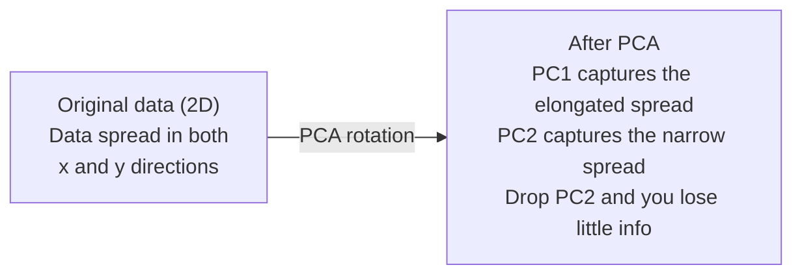

# Снижение размерности

> В многомерных данных есть структура. Чтобы найти её, нужно посмотреть под правильным углом.

**Тип:** Build
**Язык:** Python
**Предварительные требования:** Фаза 1, Уроки 01 (Интуиция линейной алгебры), 02 (Векторы, матрицы и операции), 03 (Собственные значения и собственные векторы), 06 (Вероятность и распределения)
**Время:** ~90 минут

## Цели обучения

- Реализовать PCA с нуля: центрировать данные, вычислить ковариационную матрицу, выполнить собственное разложение и спроецировать данные
- Использовать долю объяснённой дисперсии и метод локтя для выбора числа главных компонент
- Сравнить PCA, t-SNE и UMAP для визуализации цифр MNIST в 2D и объяснить их компромиссы
- Применить ядерный PCA с RBF-ядром для разделения нелинейных структур данных, с которыми не справляется стандартный PCA

## Проблема

У вас есть набор данных с 784 признаками на каждый образец. Возможно, это значения пикселей рукописных цифр. Возможно — уровни экспрессии генов. Возможно — сигналы поведения пользователей. Вы не можете визуализировать 784 измерения. Вы не можете построить их график. Вы даже не можете о них помыслить.

Но большинство из этих 784 признаков избыточны. Реальная информация умещается на гораздо меньшей поверхности. Рукописной «7» не нужны 784 независимых числа для описания. Нужно всего несколько: угол штриха, длина перекладины, насколько цифра наклонена. Всё остальное — шум.

Снижение размерности находит эту меньшую поверхность. Оно берёт ваши 784-мерные данные и сжимает их до 2, 10 или 50 измерений, сохраняя структуру, которая имеет значение.

## Концепция

### Проклятие размерности

Многомерные пространства неинтуитивны. По мере роста числа измерений ломаются три вещи.

**Расстояние теряет смысл.** В многомерных пространствах расстояние между любыми двумя случайными точками сходится к одному и тому же значению. Если каждая точка находится примерно на одном и том же расстоянии от всех остальных, поиск ближайших соседей перестаёт работать.

```
Dimension    Avg distance ratio (max/min between random points)
2            ~5.0
10           ~1.8
100          ~1.2
1000         ~1.02
```

**Объём концентрируется в углах.** Единичный гиперкуб в d измерениях имеет 2^d углов. В 100 измерениях почти весь объём находится в углах, далеко от центра. Точки данных расходятся к краям, и вашим моделям не хватает данных во внутренней области.

**Вам нужно экспоненциально больше данных.** Чтобы сохранить ту же плотность образцов в пространстве, переход от 2D к 20D означает, что вам нужно в 10^18 раз больше данных. Их никогда не бывает достаточно. Снижение размерности возвращает плотность данных к работоспособному уровню.

### PCA: найти направления, которые имеют значение

Метод главных компонент (Principal Component Analysis, PCA) находит оси, вдоль которых ваши данные варьируются сильнее всего. Он поворачивает вашу систему координат так, что первая ось захватывает наибольшую дисперсию, вторая — следующую по величине, и так далее.

Алгоритм:

```
1. Center the data        (subtract the mean from each feature)
2. Compute covariance     (how features move together)
3. Eigendecomposition     (find the principal directions)
4. Sort by eigenvalue     (biggest variance first)
5. Project               (keep top k eigenvectors, drop the rest)
```

Почему собственное разложение? Ковариационная матрица симметрична и положительно полуопределена. Её собственные векторы — это ортогональные направления в пространстве признаков. Собственные значения показывают, сколько дисперсии захватывает каждое направление. Собственный вектор с наибольшим собственным значением указывает вдоль направления максимальной дисперсии.



- **До PCA:** облако данных вытянуто по диагонали вдоль осей x и y
- **После PCA:** система координат повёрнута так, что PC1 совпадает с направлением максимальной дисперсии (вытянутый разброс), а PC2 — с направлением минимальной дисперсии (узкий разброс)
- **Снижение размерности:** отбрасывание PC2 проецирует данные на PC1, теряя очень мало информации

### Доля объяснённой дисперсии

Каждая главная компонента захватывает долю общей дисперсии. Доля объяснённой дисперсии показывает, сколько именно.

```
Component    Eigenvalue    Explained ratio    Cumulative
PC1          4.73          0.473              0.473
PC2          2.51          0.251              0.724
PC3          1.12          0.112              0.836
PC4          0.89          0.089              0.925
...
```

Когда накопленная объяснённая дисперсия достигает 0.95, вы знаете, что это число компонент захватывает 95% информации. Всё, что после этого, — в основном шум.

### Выбор числа компонент

Три стратегии:

1. **Порог.** Оставьте достаточно компонент, чтобы объяснить 90–95% дисперсии.
2. **Метод локтя.** Постройте график объяснённой дисперсии по компонентам. Найдите резкий обрыв.
3. **Итоговая производительность.** Используйте PCA как предобработку. Переберите значения k и измерьте точность вашей модели. Лучшее k — там, где точность выходит на плато.

### t-SNE: сохранение окрестностей

t-распределённое стохастическое вложение соседей (t-Distributed Stochastic Neighbor Embedding, t-SNE) предназначено для визуализации. Оно отображает многомерные данные в 2D (или 3D), сохраняя, какие точки находятся рядом друг с другом.

Интуиция: в исходном пространстве вычисляется распределение вероятностей по парам точек на основе расстояний между ними. Близкие точки получают высокую вероятность. Далёкие точки — низкую. Затем находится такое расположение в 2D, при котором сохраняется то же распределение вероятностей. Точки, которые были соседями в 784 измерениях, остаются соседями в 2D.

Ключевые свойства t-SNE:
- Нелинейный. Может разворачивать сложные многообразия, с которыми не справляется PCA.
- Стохастический. Разные запуски дают разные расположения.
- Параметр перплексии управляет тем, сколько соседей учитывается (типичный диапазон: 5–50).
- Расстояния между кластерами на выходе не несут смысла. Значение имеют только сами кластеры.
- Медленный на больших наборах данных. По умолчанию O(n^2).

### UMAP: быстрее, лучше сохраняет глобальную структуру

Равномерная аппроксимация и проекция многообразия (Uniform Manifold Approximation and Projection, UMAP) работает похоже на t-SNE, но с двумя преимуществами:
- Быстрее. Использует приближённые графы ближайших соседей вместо вычисления всех попарных расстояний.
- Лучше сохраняет глобальную структуру. Относительное расположение кластеров на выходе, как правило, более осмысленно, чем в t-SNE.

UMAP строит взвешенный граф в многомерном пространстве («нечёткое топологическое представление»), а затем находит маломерное расположение, которое как можно точнее сохраняет этот граф.

Ключевые параметры:
- `n_neighbors`: сколько соседей определяют локальную структуру (аналог перплексии). Большие значения сохраняют больше глобальной структуры.
- `min_dist`: насколько плотно точки упаковываются на выходе. Меньшие значения создают более плотные кластеры.

### Что когда использовать

| Метод | Применение | Что сохраняет | Скорость |
|--------|----------|-----------|-------|
| PCA | Предобработка перед обучением | Глобальную дисперсию | Быстро (точно), работает с миллионами образцов |
| PCA | Быстрая разведочная визуализация | Линейную структуру | Быстро |
| t-SNE | 2D-графики публикационного качества | Локальные окрестности | Медленно (в идеале < 10 тыс. образцов) |
| UMAP | Масштабируемая 2D-визуализация | Локальную структуру + частично глобальную | Средне (справляется с миллионами) |
| PCA | Сокращение признаков для моделей | Признаки, ранжированные по дисперсии | Быстро |
| t-SNE / UMAP | Понимание структуры кластеров | Разделение кластеров | От среднего до медленного |

Эмпирическое правило: используйте PCA для предобработки и сжатия данных. Используйте t-SNE или UMAP, когда нужно визуализировать структуру в 2D.

### Ядерный PCA

Стандартный PCA находит линейные подпространства. Он поворачивает вашу систему координат и отбрасывает оси. Но что, если данные лежат на нелинейном многообразии? Окружность в 2D нельзя разделить никакой прямой. Стандартный PCA здесь не поможет.

Ядерный PCA применяет PCA в многомерном пространстве признаков, порождённом ядерной функцией, не вычисляя явно координаты в этом пространстве. Это и есть ядерный трюк (kernel trick) — та же идея, что лежит в основе SVM.

Алгоритм:
1. Вычислить матрицу ядра K, где K_ij = k(x_i, x_j)
2. Центрировать матрицу ядра в пространстве признаков
3. Выполнить собственное разложение центрированной матрицы ядра
4. Старшие собственные векторы (масштабированные на 1/sqrt(eigenvalue)) — это проекции

Распространённые ядерные функции:

| Ядро | Формула | Подходит для |
|--------|---------|----------|
| RBF (гауссово ядро) | exp(-gamma * \|\|x - y\|\|^2) | Большинства нелинейных данных, гладких многообразий |
| Полиномиальное | (x . y + c)^d | Полиномиальных зависимостей |
| Сигмоидное | tanh(alpha * x . y + c) | Отображений, похожих на нейросетевые |

Когда использовать ядерный PCA, а когда стандартный PCA:

| Критерий | Стандартный PCA | Ядерный PCA |
|-----------|-------------|------------|
| Структура данных | Линейное подпространство | Нелинейное многообразие |
| Скорость | O(min(n^2 d, d^2 n)) | O(n^2 d + n^3) |
| Интерпретируемость | Компоненты — линейные комбинации признаков | У компонент нет прямой интерпретации через признаки |
| Масштабируемость | Работает с миллионами образцов | Матрица ядра имеет размер n x n, ограничена памятью |
| Реконструкция | Прямое обратное преобразование | Требует аппроксимации прообраза |

Классический пример: концентрические окружности в 2D. Два кольца точек, одно внутри другого. Стандартный PCA проецирует оба кольца на одну и ту же прямую — бесполезно для классификации. Ядерный PCA с RBF-ядром отображает внутреннюю и внешнюю окружности в разные области, делая их линейно разделимыми.

### Ошибка реконструкции

Насколько хорошо ваше снижение размерности? Вы сжали 784 измерения до 50. Что вы потеряли?

Измерение ошибки реконструкции:
1. Спроецировать данные в k измерений: X_reduced = X @ W_k
2. Восстановить: X_hat = X_reduced @ W_k^T
3. Вычислить MSE: mean((X - X_hat)^2)

Для PCA ошибка реконструкции имеет чёткую связь с объяснённой дисперсией:

```
Reconstruction error = sum of eigenvalues NOT included
Total variance = sum of ALL eigenvalues
Fraction lost = (sum of dropped eigenvalues) / (sum of all eigenvalues)
```

Доля объяснённой дисперсии для каждой компоненты:

```
explained_ratio_k = eigenvalue_k / sum(all eigenvalues)
```

Построение графика накопленной объяснённой дисперсии в зависимости от числа компонент даёт кривую «локтя». Правильное число компонент — там, где:
- кривая выполаживается (убывающая отдача)
- накопленная дисперсия пересекает выбранный порог (обычно 0.90 или 0.95)
- производительность итоговой задачи выходит на плато

Ошибка реконструкции полезна не только для выбора k. Её можно использовать для обнаружения аномалий: образцы с высокой ошибкой реконструкции — это выбросы, не вписывающиеся в изученное подпространство. На этом основано обнаружение аномалий на базе PCA в промышленных системах.

```figure
pca-axes
```

## Создаём

### Шаг 1: PCA с нуля

```python
import numpy as np

class PCA:
    def __init__(self, n_components):
        self.n_components = n_components
        self.components = None
        self.mean = None
        self.eigenvalues = None
        self.explained_variance_ratio_ = None

    def fit(self, X):
        self.mean = np.mean(X, axis=0)
        X_centered = X - self.mean

        cov_matrix = np.cov(X_centered, rowvar=False)

        eigenvalues, eigenvectors = np.linalg.eigh(cov_matrix)

        sorted_idx = np.argsort(eigenvalues)[::-1]
        eigenvalues = eigenvalues[sorted_idx]
        eigenvectors = eigenvectors[:, sorted_idx]

        self.components = eigenvectors[:, :self.n_components].T
        self.eigenvalues = eigenvalues[:self.n_components]
        total_var = np.sum(eigenvalues)
        self.explained_variance_ratio_ = self.eigenvalues / total_var

        return self

    def transform(self, X):
        X_centered = X - self.mean
        return X_centered @ self.components.T

    def fit_transform(self, X):
        self.fit(X)
        return self.transform(X)
```

### Шаг 2: Тест на синтетических данных

```python
np.random.seed(42)
n_samples = 500

t = np.random.uniform(0, 2 * np.pi, n_samples)
x1 = 3 * np.cos(t) + np.random.normal(0, 0.2, n_samples)
x2 = 3 * np.sin(t) + np.random.normal(0, 0.2, n_samples)
x3 = 0.5 * x1 + 0.3 * x2 + np.random.normal(0, 0.1, n_samples)

X_synthetic = np.column_stack([x1, x2, x3])

pca = PCA(n_components=2)
X_reduced = pca.fit_transform(X_synthetic)

print(f"Original shape: {X_synthetic.shape}")
print(f"Reduced shape:  {X_reduced.shape}")
print(f"Explained variance ratios: {pca.explained_variance_ratio_}")
print(f"Total variance captured: {sum(pca.explained_variance_ratio_):.4f}")
```

### Шаг 3: Цифры MNIST в 2D

```python
from sklearn.datasets import fetch_openml

mnist = fetch_openml("mnist_784", version=1, as_frame=False, parser="auto")
X_mnist = mnist.data[:5000].astype(float)
y_mnist = mnist.target[:5000].astype(int)

pca_mnist = PCA(n_components=50)
X_pca50 = pca_mnist.fit_transform(X_mnist)
print(f"50 components capture {sum(pca_mnist.explained_variance_ratio_):.2%} of variance")

pca_2d = PCA(n_components=2)
X_pca2d = pca_2d.fit_transform(X_mnist)
print(f"2 components capture {sum(pca_2d.explained_variance_ratio_):.2%} of variance")
```

### Шаг 4: Сравнение со sklearn

```python
from sklearn.decomposition import PCA as SklearnPCA
from sklearn.manifold import TSNE

sklearn_pca = SklearnPCA(n_components=2)
X_sklearn_pca = sklearn_pca.fit_transform(X_mnist)

print(f"\nOur PCA explained variance:     {pca_2d.explained_variance_ratio_}")
print(f"Sklearn PCA explained variance: {sklearn_pca.explained_variance_ratio_}")

diff = np.abs(np.abs(X_pca2d) - np.abs(X_sklearn_pca))
print(f"Max absolute difference: {diff.max():.10f}")

tsne = TSNE(n_components=2, perplexity=30, random_state=42)
X_tsne = tsne.fit_transform(X_mnist)
print(f"\nt-SNE output shape: {X_tsne.shape}")
```

### Шаг 5: Сравнение с UMAP

```python
try:
    from umap import UMAP

    reducer = UMAP(n_components=2, n_neighbors=15, min_dist=0.1, random_state=42)
    X_umap = reducer.fit_transform(X_mnist)
    print(f"UMAP output shape: {X_umap.shape}")
except ImportError:
    print("Install umap-learn: pip install umap-learn")
```

## Применяем

PCA как предобработка перед классификатором:

```python
from sklearn.decomposition import PCA as SklearnPCA
from sklearn.linear_model import LogisticRegression
from sklearn.model_selection import train_test_split
from sklearn.metrics import accuracy_score

X_train, X_test, y_train, y_test = train_test_split(
    X_mnist, y_mnist, test_size=0.2, random_state=42
)

results = {}
for k in [10, 30, 50, 100, 200]:
    pca_k = SklearnPCA(n_components=k)
    X_tr = pca_k.fit_transform(X_train)
    X_te = pca_k.transform(X_test)

    clf = LogisticRegression(max_iter=1000, random_state=42)
    clf.fit(X_tr, y_train)
    acc = accuracy_score(y_test, clf.predict(X_te))
    var_captured = sum(pca_k.explained_variance_ratio_)
    results[k] = (acc, var_captured)
    print(f"k={k:>3d}  accuracy={acc:.4f}  variance={var_captured:.4f}")
```

Производительность выходит на плато задолго до 784 измерений. Это плато и есть ваша рабочая точка.

## Публикуем

Этот урок производит:
- `outputs/skill-dimensionality-reduction.md` — навык выбора подходящего метода снижения размерности для конкретной задачи

## Упражнения

1. Измените класс PCA, чтобы он поддерживал `inverse_transform`. Восстановите цифры MNIST из 10, 50 и 200 компонент. Выведите ошибку реконструкции (среднюю квадратичную ошибку — среднее квадратов разностей с исходными данными) для каждого случая.

2. Запустите t-SNE на том же подмножестве MNIST со значениями перплексии 5, 30 и 100. Опишите, как меняется результат. Почему перплексия влияет на плотность кластеров?

3. Возьмите набор данных с 50 признаками, из которых информативны только 5 (сгенерируйте его с помощью `sklearn.datasets.make_classification`). Примените PCA и проверьте, правильно ли кривая объяснённой дисперсии показывает, что данные фактически пятимерны.

## Ключевые термины

| Термин | Как обычно говорят | Что это означает на самом деле |
|------|----------------|----------------------|
| Проклятие размерности | «Слишком много признаков» | Расстояния, объёмы и плотность данных ведут себя контринтуитивно по мере роста числа измерений. Моделям требуется экспоненциально больше данных, чтобы это компенсировать. |
| PCA | «Снизить размерность» | Повернуть систему координат так, чтобы оси совпали с направлениями максимальной дисперсии, а затем отбросить оси с низкой дисперсией. |
| Главная компонента | «Важное направление» | Собственный вектор ковариационной матрицы. Направление в пространстве признаков, вдоль которого данные варьируются сильнее всего. |
| Доля объяснённой дисперсии | «Сколько информации несёт эта компонента» | Доля общей дисперсии, захваченная одной главной компонентой. Сумма первых k долей показывает, сколько сохраняют k компонент. |
| Ковариационная матрица | «Как коррелируют признаки» | Симметричная матрица, в которой элемент (i,j) измеряет, насколько согласованно изменяются признаки i и j. Диагональные элементы — это дисперсии отдельных признаков. |
| t-SNE | «Тот график с кластерами» | Нелинейный метод, отображающий многомерные данные в 2D за счёт сохранения попарных вероятностей соседства. Хорош для визуализации, но не для предобработки. |
| UMAP | «Более быстрый t-SNE» | Нелинейный метод, основанный на топологическом анализе данных. Сохраняет как локальную, так и частично глобальную структуру. Масштабируется лучше, чем t-SNE. |
| Перплексия | «Ручка настройки t-SNE» | Управляет эффективным числом соседей, которые учитывает каждая точка. Низкая перплексия фокусируется на очень локальной структуре. Высокая перплексия охватывает более широкие закономерности. |
| Многообразие | «Поверхность, на которой живут данные» | Маломерная поверхность, вложенная в пространство большей размерности. Смятый в 3D лист бумаги — это 2D-многообразие. |

## Дополнительные материалы

- [A Tutorial on Principal Component Analysis](https://arxiv.org/abs/1404.1100) (Shlens) — понятный вывод PCA с нуля
- [Как эффективно использовать t-SNE](https://distill.pub/2016/misread-tsne/) (Wattenberg et al.) — интерактивное руководство по подводным камням t-SNE и выбору параметров
- [Документация UMAP](https://umap-learn.readthedocs.io/) — теория и практические рекомендации от авторов UMAP
