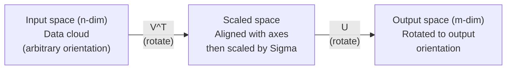
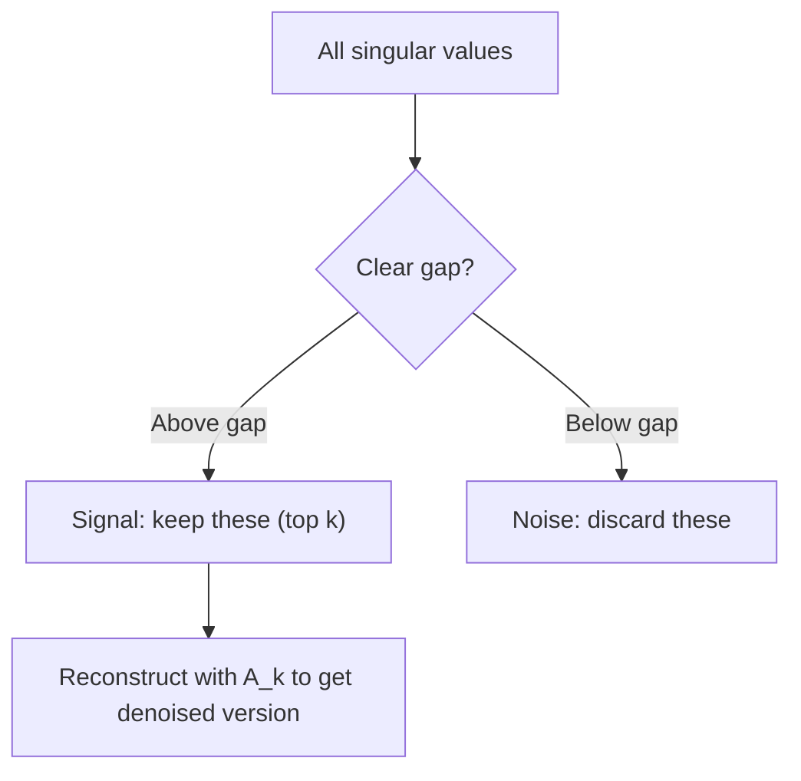

# Сингулярное разложение

> SVD — это швейцарский нож линейной алгебры. Оно есть у каждой матрицы. Оно нужно каждому специалисту по данным.

**Тип:** Build
**Языки:** Python, Julia
**Предварительные требования:** Фаза 1, Уроки 01 (Интуиция линейной алгебры), 02 (Векторы и операции с матрицами), 03 (Преобразования матриц)
**Время:** ~120 минут

## Цели обучения

- Реализовать SVD с помощью степенной итерации и объяснить геометрический смысл U, Sigma и V^T
- Применить усечённое SVD для сжатия изображений и измерить соотношение степени сжатия и ошибки реконструкции
- Вычислить псевдообратную матрицу Мура — Пенроуза через SVD для решения переопределённых систем методом наименьших квадратов
- Связать SVD с PCA, рекомендательными системами (латентные факторы) и латентно-семантическим анализом в NLP

## Проблема

У вас есть матрица 1000x2000. Возможно, это оценки пользователей фильмам. Возможно — таблица частот терминов в документах. Возможно — значения пикселей изображения. Вам нужно сжать её, убрать шум, найти в ней скрытую структуру или решить с её помощью систему методом наименьших квадратов. Собственное разложение работает только для квадратных матриц. И даже тогда требует, чтобы у матрицы был полный набор линейно независимых собственных векторов.

SVD работает с любой матрицей. Любой формы. Любого ранга. Без условий. Оно раскладывает матрицу на три множителя, которые раскрывают геометрию того, что матрица делает с пространством. Это самое общее и самое полезное разложение во всей линейной алгебре.

## Концепция

### Что SVD делает геометрически

Каждая матрица, независимо от формы, последовательно выполняет три операции: поворот, масштабирование, поворот. SVD делает это разложение явным.

```
A = U * Sigma * V^T

      m x n     m x m    m x n    n x n
     (any)    (rotate)  (scale)  (rotate)
```

Для любой матрицы A SVD раскладывает её на:
- V^T поворачивает векторы во входном пространстве (n-мерном)
- Sigma масштабирует вдоль каждой оси (растягивает или сжимает)
- U поворачивает результат в выходное пространство (m-мерное)



Представьте это так. Вы передаёте SVD матрицу. Оно отвечает: «Эта матрица берёт сферу входов, сначала поворачивает её на V^T, затем растягивает в эллипсоид с помощью Sigma, а затем поворачивает эллипсоид на U». Сингулярные числа — это длины осей эллипсоида.

### Полное разложение

Для матрицы A формы m x n:

```
A = U * Sigma * V^T

where:
  U     is m x m, orthogonal (U^T U = I)
  Sigma is m x n, diagonal (singular values on the diagonal)
  V     is n x n, orthogonal (V^T V = I)

The singular values sigma_1 >= sigma_2 >= ... >= sigma_r > 0
where r = rank(A)
```

Столбцы U называются левыми сингулярными векторами. Столбцы V называются правыми сингулярными векторами. Диагональные элементы Sigma называются сингулярными числами. Они всегда неотрицательны и по соглашению отсортированы по убыванию.

### Левые сингулярные векторы, сингулярные числа, правые сингулярные векторы

Каждый компонент SVD имеет свой геометрический смысл.

**Правые сингулярные векторы (столбцы V):** образуют ортонормированный базис входного пространства (R^n). Это направления во входном пространстве, которые матрица отображает в ортогональные направления выходного пространства. Думайте о них как о естественной системе координат для области определения.

**Сингулярные числа (диагональ Sigma):** это коэффициенты масштабирования. i-е сингулярное число показывает, насколько матрица растягивает векторы вдоль i-го правого сингулярного вектора. Нулевое сингулярное число означает, что матрица полностью «схлопывает» это направление.

**Левые сингулярные векторы (столбцы U):** образуют ортонормированный базис выходного пространства (R^m). i-й левый сингулярный вектор — это направление в выходном пространстве, куда попадает i-й правый сингулярный вектор (после масштабирования).

Связь между ними:

```
A * v_i = sigma_i * u_i

The matrix A takes the i-th right singular vector v_i,
scales it by sigma_i, and maps it to the i-th left singular vector u_i.
```

Это даёт покоординатную картину того, что делает любая матрица.

### Форма внешнего произведения

SVD можно записать как сумму матриц ранга 1:

```
A = sigma_1 * u_1 * v_1^T + sigma_2 * u_2 * v_2^T + ... + sigma_r * u_r * v_r^T

Each term sigma_i * u_i * v_i^T is a rank-1 matrix (an outer product).
The full matrix is the sum of r such matrices, where r is the rank.
```

Эта форма — основа аппроксимации низкого ранга. Каждое слагаемое добавляет один слой структуры. Первое слагаемое захватывает самый важный паттерн. Второе — следующий по важности. И так далее. Усечение этой суммы даёт наилучшую возможную аппроксимацию при заданном ранге.

```
Rank-1 approx:    A_1 = sigma_1 * u_1 * v_1^T
                  (captures the dominant pattern)

Rank-2 approx:    A_2 = sigma_1 * u_1 * v_1^T + sigma_2 * u_2 * v_2^T
                  (captures the two most important patterns)

Rank-k approx:    A_k = sum of top k terms
                  (optimal by the Eckart-Young theorem)
```

### Связь с собственным разложением

SVD и собственное разложение глубоко связаны между собой. Сингулярные числа и векторы матрицы A напрямую следуют из собственных значений и собственных векторов A^T A и A A^T.

```
A^T A = V * Sigma^T * U^T * U * Sigma * V^T
      = V * Sigma^T * Sigma * V^T
      = V * D * V^T

where D = Sigma^T * Sigma is a diagonal matrix with sigma_i^2 on the diagonal.

So:
- The right singular vectors (V) are eigenvectors of A^T A
- The singular values squared (sigma_i^2) are eigenvalues of A^T A

Similarly:
A A^T = U * Sigma * V^T * V * Sigma^T * U^T
      = U * Sigma * Sigma^T * U^T

So:
- The left singular vectors (U) are eigenvectors of A A^T
- The eigenvalues of A A^T are also sigma_i^2
```

Эта связь говорит нам о трёх вещах:
1. Сингулярные числа всегда вещественны и неотрицательны (это квадратные корни из собственных значений положительно полуопределённой матрицы).
2. SVD можно вычислить через собственное разложение A^T A, но это возводит число обусловленности в квадрат и теряет численную точность. Специализированные алгоритмы SVD этого избегают.
3. Когда A квадратна и симметрична и положительно полуопределена, SVD и собственное разложение совпадают.

### Усечённое SVD: аппроксимация низкого ранга

Теорема Эккарта — Янга — Мирского утверждает, что наилучшая аппроксимация A рангом k (как по норме Фробениуса, так и по спектральной норме) получается, если оставить только k старших сингулярных чисел и соответствующие им векторы:

```
A_k = U_k * Sigma_k * V_k^T

where:
  U_k     is m x k  (first k columns of U)
  Sigma_k is k x k  (top-left k x k block of Sigma)
  V_k     is n x k  (first k columns of V)

Approximation error = sigma_{k+1}  (in spectral norm)
                    = sqrt(sigma_{k+1}^2 + ... + sigma_r^2)  (in Frobenius norm)
```

Это не просто «хорошая» аппроксимация. Это доказуемо наилучшая возможная аппроксимация ранга k. Никакая другая матрица ранга k не ближе к A.

| Компонент | Относительная величина | Оставлен в аппроксимации ранга 3? |
|-----------|-------------------|------------------------|
| sigma_1 | Наибольшая | Да |
| sigma_2 | Большая | Да |
| sigma_3 | Средне-большая | Да |
| sigma_4 | Средняя | Нет (ошибка) |
| sigma_5 | Средне-малая | Нет (ошибка) |
| sigma_6 | Малая | Нет (ошибка) |
| sigma_7 | Очень малая | Нет (ошибка) |
| sigma_8 | Крошечная | Нет (ошибка) |

Оставляем 3 старших: A_3 захватывает три наибольших сингулярных числа. Ошибка = оставшиеся значения (от sigma_4 до sigma_8).

Если сингулярные числа убывают быстро, небольшое k захватывает большую часть матрицы. Если они убывают медленно, у матрицы нет структуры низкого ранга.

### Сжатие изображений с помощью SVD

Изображение в оттенках серого — это матрица интенсивностей пикселей. Изображение 800x600 содержит 480 000 значений. SVD позволяет аппроксимировать его гораздо меньшим числом значений.

```
Original image: 800 x 600 = 480,000 values

SVD with rank k:
  U_k:      800 x k values
  Sigma_k:  k values
  V_k:      600 x k values
  Total:    k * (800 + 600 + 1) = k * 1401 values

  k=10:   14,010 values   (2.9% of original)
  k=50:   70,050 values  (14.6% of original)
  k=100: 140,100 values  (29.2% of original)

  The compression ratio improves as k gets smaller,
  but visual quality degrades.
```

Ключевое наблюдение: у естественных изображений сингулярные числа быстро убывают. Первые несколько сингулярных чисел захватывают общую структуру (формы, градиенты). Более поздние захватывают мелкие детали и шум. Усечение до ранга 50 часто даёт изображение, почти неотличимое от оригинала, при этом используя на 85% меньше памяти.

### SVD для рекомендательных систем

Netflix Prize сделал этот подход знаменитым. У вас есть матрица оценок пользователь-фильм, где большинство значений отсутствует.

```
             Movie1  Movie2  Movie3  Movie4  Movie5
  User1      [  5      ?       3       ?       1  ]
  User2      [  ?      4       ?       2       ?  ]
  User3      [  3      ?       5       ?       ?  ]
  User4      [  ?      ?       ?       4       3  ]

  ? = unknown rating
```

Идея в том, что эта матрица оценок имеет низкий ранг. Вкусы пользователей не являются полностью независимыми. Есть небольшое число латентных факторов (боевик против драмы, старое против нового, интеллектуальное против чувственного), которые объясняют большую часть предпочтений.

SVD на (заполненной) матрице оценок раскладывает её на:
- U: профили пользователей в пространстве латентных факторов
- Sigma: важность каждого латентного фактора
- V^T: профили фильмов в пространстве латентных факторов

Предсказанная оценка пользователя для фильма — это скалярное произведение его профиля пользователя и профиля фильма (взвешенное сингулярными числами). Аппроксимация низкого ранга заполняет отсутствующие значения.

На практике используются варианты вроде инкрементного SVD Саймона Фанка (Simon Funk) или ALS (поочерёдный метод наименьших квадратов), которые напрямую работают с отсутствующими данными. Но суть та же: разложение на латентные факторы через SVD.

### SVD в NLP: латентно-семантический анализ

Латентно-семантический анализ (Latent Semantic Analysis, LSA), также называемый латентным семантическим индексированием (Latent Semantic Indexing, LSI), применяет SVD к матрице термин-документ.

```
             Doc1   Doc2   Doc3   Doc4
  "cat"      [  3      0      1      0  ]
  "dog"      [  2      0      0      1  ]
  "fish"     [  0      4      1      0  ]
  "pet"      [  1      1      1      1  ]
  "ocean"    [  0      3      0      0  ]

After SVD with rank k=2:

  Each document becomes a point in 2D "concept space."
  Each term becomes a point in the same 2D space.
  Documents about similar topics cluster together.
  Terms with similar meanings cluster together.

  "cat" and "dog" end up near each other (land pets).
  "fish" and "ocean" end up near each other (water concepts).
  Doc1 and Doc3 cluster if they share similar topics.
```

LSA был одним из первых успешных методов выявления семантической схожести в необработанном тексте. Он работает потому, что синонимичные термины, как правило, встречаются в похожих документах, поэтому SVD группирует их в одни и те же латентные измерения. Современные векторные представления слов (Word2Vec, GloVe) можно считать наследниками этой идеи.

### SVD для подавления шума

В зашумлённых данных сигнал сосредоточен в старших сингулярных числах, а шум распределён по всем сингулярным числам. Усечение убирает уровень шума.

**Сингулярные числа чистого сигнала:**

| Компонент | Величина | Тип |
|-----------|-----------|------|
| sigma_1 | Очень большая | Сигнал |
| sigma_2 | Большая | Сигнал |
| sigma_3 | Средняя | Сигнал |
| sigma_4 | Почти нулевая | Незначима |
| sigma_5 | Почти нулевая | Незначима |

**Сингулярные числа зашумлённого сигнала (шум добавляется ко всем):**

| Компонент | Величина | Тип |
|-----------|-----------|------|
| sigma_1 | Очень большая | Сигнал |
| sigma_2 | Большая | Сигнал |
| sigma_3 | Средняя | Сигнал |
| sigma_4 | Малая | Шум |
| sigma_5 | Малая | Шум |
| sigma_6 | Малая | Шум |
| sigma_7 | Малая | Шум |



Это используется в обработке сигналов, научных измерениях и очистке данных. Всякий раз, когда у вас есть матрица, искажённая аддитивным шумом, усечённое SVD — принципиальный способ отделить сигнал от шума.

### Псевдообратная матрица через SVD

Псевдообратная матрица Мура — Пенроуза A+ обобщает обращение матрицы на неквадратные и вырожденные матрицы. SVD делает её вычисление тривиальным.

```
If A = U * Sigma * V^T, then:

A+ = V * Sigma+ * U^T

where Sigma+ is formed by:
  1. Transpose Sigma (swap rows and columns)
  2. Replace each non-zero diagonal entry sigma_i with 1/sigma_i
  3. Leave zeros as zeros

For A (m x n):      A+ is (n x m)
For Sigma (m x n):  Sigma+ is (n x m)
```

Псевдообратная матрица решает задачи метода наименьших квадратов. Если Ax = b не имеет точного решения (переопределённая система), то x = A+ b — это решение методом наименьших квадратов (минимизирующее ||Ax - b||).

```
Overdetermined system (more equations than unknowns):

  [1  1]         [3]
  [2  1] x   =   [5]       No exact solution exists.
  [3  1]         [6]

  x_ls = A+ b = V * Sigma+ * U^T * b

  This gives the x that minimizes the sum of squared residuals.
  Same result as the normal equations (A^T A)^(-1) A^T b,
  but numerically more stable.
```

### Преимущества численной устойчивости

Вычисление собственного разложения A^T A возводит сингулярные числа в квадрат (собственные значения A^T A равны sigma_i^2). Это возводит число обусловленности в квадрат, усиливая численные ошибки.

```
Example:
  A has singular values [1000, 1, 0.001]
  Condition number of A: 1000 / 0.001 = 10^6

  A^T A has eigenvalues [10^6, 1, 10^{-6}]
  Condition number of A^T A: 10^6 / 10^{-6} = 10^{12}

  Computing SVD directly: works with condition number 10^6
  Computing via A^T A:     works with condition number 10^{12}
                           (6 extra digits of precision lost)
```

Современные алгоритмы SVD (бидиагонализация Голуба — Кахана) работают напрямую с A, никогда не формируя A^T A. Именно поэтому всегда стоит предпочитать `np.linalg.svd(A)` вместо `np.linalg.eig(A.T @ A)`.

### Связь с PCA

PCA — ЭТО SVD на центрированных данных. Это не аналогия. Это буквально одно и то же вычисление.

```
Given data matrix X (n_samples x n_features), centered (mean subtracted):

Covariance matrix: C = (1/(n-1)) * X^T X

PCA finds eigenvectors of C. But:

  X = U * Sigma * V^T    (SVD of X)

  X^T X = V * Sigma^2 * V^T

  C = (1/(n-1)) * V * Sigma^2 * V^T

So the principal components are exactly the right singular vectors V.
The explained variance for each component is sigma_i^2 / (n-1).

In sklearn, PCA is implemented using SVD, not eigendecomposition.
It is faster and more numerically stable.
```

Это значит, что всё, что вы узнали о снижении размерности в Уроке 10, под капотом — это SVD. PCA — самое распространённое применение SVD в машинном обучении.

```figure
svd-rank-reconstruction
```

## Создаём

### Шаг 1: SVD с нуля с помощью степенной итерации

Идея: чтобы найти наибольшее сингулярное число и его векторы, применяется степенная итерация к A^T A (или A A^T). Затем матрица «дефлируется», и процесс повторяется для следующего сингулярного числа.

```python
import numpy as np

def power_iteration(M, num_iters=100):
    n = M.shape[1]
    v = np.random.randn(n)
    v = v / np.linalg.norm(v)

    for _ in range(num_iters):
        Mv = M @ v
        v = Mv / np.linalg.norm(Mv)

    eigenvalue = v @ M @ v
    return eigenvalue, v

def svd_from_scratch(A, k=None):
    m, n = A.shape
    if k is None:
        k = min(m, n)

    sigmas = []
    us = []
    vs = []

    A_residual = A.copy().astype(float)

    for _ in range(k):
        AtA = A_residual.T @ A_residual
        eigenvalue, v = power_iteration(AtA, num_iters=200)

        if eigenvalue < 1e-10:
            break

        sigma = np.sqrt(eigenvalue)
        u = A_residual @ v / sigma

        sigmas.append(sigma)
        us.append(u)
        vs.append(v)

        A_residual = A_residual - sigma * np.outer(u, v)

    U = np.column_stack(us) if us else np.empty((m, 0))
    S = np.array(sigmas)
    V = np.column_stack(vs) if vs else np.empty((n, 0))

    return U, S, V
```

### Шаг 2: Тест и сравнение с NumPy

```python
np.random.seed(42)
A = np.random.randn(5, 4)

U_ours, S_ours, V_ours = svd_from_scratch(A)
U_np, S_np, Vt_np = np.linalg.svd(A, full_matrices=False)

print("Our singular values:", np.round(S_ours, 4))
print("NumPy singular values:", np.round(S_np, 4))

A_reconstructed = U_ours @ np.diag(S_ours) @ V_ours.T
print(f"Reconstruction error: {np.linalg.norm(A - A_reconstructed):.8f}")
```

### Шаг 3: Демонстрация сжатия изображений

```python
def compress_image_svd(image_matrix, k):
    U, S, Vt = np.linalg.svd(image_matrix, full_matrices=False)
    compressed = U[:, :k] @ np.diag(S[:k]) @ Vt[:k, :]
    return compressed

image = np.random.seed(42)
rows, cols = 200, 300
image = np.random.randn(rows, cols)

for k in [1, 5, 10, 20, 50]:
    compressed = compress_image_svd(image, k)
    error = np.linalg.norm(image - compressed) / np.linalg.norm(image)
    original_size = rows * cols
    compressed_size = k * (rows + cols + 1)
    ratio = compressed_size / original_size
    print(f"k={k:>3d}  error={error:.4f}  storage={ratio:.1%}")
```

### Шаг 4: Подавление шума

```python
np.random.seed(42)
clean = np.outer(np.sin(np.linspace(0, 4*np.pi, 100)),
                 np.cos(np.linspace(0, 2*np.pi, 80)))
noise = 0.3 * np.random.randn(100, 80)
noisy = clean + noise

U, S, Vt = np.linalg.svd(noisy, full_matrices=False)
denoised = U[:, :5] @ np.diag(S[:5]) @ Vt[:5, :]

print(f"Noisy error:    {np.linalg.norm(noisy - clean):.4f}")
print(f"Denoised error: {np.linalg.norm(denoised - clean):.4f}")
print(f"Improvement:    {(1 - np.linalg.norm(denoised - clean) / np.linalg.norm(noisy - clean)):.1%}")
```

### Шаг 5: Псевдообратная матрица

```python
A = np.array([[1, 1], [2, 1], [3, 1]], dtype=float)
b = np.array([3, 5, 6], dtype=float)

U, S, Vt = np.linalg.svd(A, full_matrices=False)
S_inv = np.diag(1.0 / S)
A_pinv = Vt.T @ S_inv @ U.T

x_svd = A_pinv @ b
x_lstsq = np.linalg.lstsq(A, b, rcond=None)[0]
x_pinv = np.linalg.pinv(A) @ b

print(f"SVD pseudoinverse solution:  {x_svd}")
print(f"np.linalg.lstsq solution:   {x_lstsq}")
print(f"np.linalg.pinv solution:    {x_pinv}")
```

## Применяем

Полностью рабочие демонстрации находятся в `code/svd.py`. Запустите его, чтобы увидеть, как SVD применяется для сжатия изображений, рекомендательных систем, латентно-семантического анализа и подавления шума.

```bash
python svd.py
```

Версия на Julia в `code/svd.jl` демонстрирует те же концепции с использованием встроенной функции `svd()` и пакета `LinearAlgebra` в Julia.

```bash
julia svd.jl
```

## Публикуем

Этот урок производит:
- `outputs/skill-svd.md` — навык понимания того, когда и как применять SVD в реальных проектах

## Упражнения

1. Реализуйте полное SVD с нуля без использования степенной итерации. Вместо этого вычислите собственное разложение A^T A, чтобы получить V и сингулярные числа, а затем вычислите U = A V Sigma^{-1}. Сравните численную точность с вашей версией на степенной итерации и с NumPy.

2. Загрузите настоящее изображение в оттенках серого (или преобразуйте изображение в оттенки серого). Сожмите его до рангов 1, 5, 10, 25, 50, 100. Для каждого ранга вычислите степень сжатия и относительную ошибку. Найдите ранг, при котором изображение становится визуально приемлемым.

3. Постройте крошечную рекомендательную систему. Создайте матрицу оценок пользователь-фильм размером 10x8 с несколькими известными значениями. Заполните отсутствующие значения средними по строкам. Вычислите SVD и восстановите аппроксимацию ранга 3. Используйте восстановленную матрицу, чтобы предсказать отсутствующие оценки. Проверьте, что предсказания разумны.

4. Создайте матрицу термин-документ размером 100x50 с 3 синтетическими темами. У каждой темы есть 5 связанных терминов. Добавьте шум. Примените SVD и убедитесь, что 3 старших сингулярных числа намного больше остальных. Спроецируйте документы в 3D латентное пространство и проверьте, что документы из одной темы группируются вместе.

5. Сгенерируйте чистую матрицу низкого ранга (ранг 3, размер 50x40) и добавьте гауссов шум разных уровней (sigma = 0.1, 0.5, 1.0, 2.0). Для каждого уровня шума найдите оптимальный ранг усечения, перебирая k от 1 до 40 и измеряя ошибку реконструкции относительно чистой матрицы. Постройте график того, как оптимальное k меняется с уровнем шума.

## Ключевые термины

| Термин | Как обычно говорят | Что это означает на самом деле |
|------|----------------|----------------------|
| SVD | «Разложить любую матрицу» | Разложить A на U Sigma V^T, где U и V ортогональны, а Sigma диагональна с неотрицательными элементами. Работает для любой матрицы любой формы. |
| Сингулярное число | «Насколько важен этот компонент» | i-й диагональный элемент Sigma. Измеряет, насколько матрица растягивает вдоль i-го главного направления. Всегда неотрицательно, отсортировано по убыванию. |
| Левый сингулярный вектор | «Выходное направление» | Столбец U. Направление в выходном пространстве, в которое отображается i-й правый сингулярный вектор (после масштабирования на sigma_i). |
| Правый сингулярный вектор | «Входное направление» | Столбец V. Направление во входном пространстве, которое матрица отображает в i-й левый сингулярный вектор (после масштабирования на sigma_i). |
| Усечённое SVD | «Аппроксимация низкого ранга» | Оставить только k старших сингулярных чисел и их векторы. Даёт доказуемо наилучшую аппроксимацию исходной матрицы рангом k (теорема Эккарта — Янга). |
| Ранг | «Истинная размерность» | Число ненулевых сингулярных чисел. Показывает, сколько независимых направлений матрица реально использует. |
| Псевдообратная матрица | «Обобщённая обратная матрица» | V Sigma+ U^T. Обращает ненулевые сингулярные числа, оставляет нули нулями. Решает задачи метода наименьших квадратов для неквадратных или вырожденных матриц. |
| Число обусловленности | «Насколько чувствительно к ошибкам» | sigma_max / sigma_min. Большое число обусловленности означает, что малые изменения на входе вызывают большие изменения на выходе. SVD раскрывает это напрямую. |
| Латентный фактор | «Скрытая переменная» | Измерение в пространстве низкого ранга, обнаруженное SVD. В рекомендациях латентный фактор может соответствовать предпочтению жанра. В NLP — теме. |
| Норма Фробениуса | «Общий размер матрицы» | Квадратный корень из суммы квадратов элементов. Равна квадратному корню из суммы квадратов сингулярных чисел. Используется для измерения ошибки аппроксимации. |
| Теорема Эккарта — Янга | «SVD даёт наилучшее сжатие» | Для любого целевого ранга k усечённое SVD минимизирует ошибку аппроксимации среди всех возможных матриц ранга k. |
| Степенная итерация | «Найти наибольший собственный вектор» | Многократно умножать случайный вектор на матрицу и нормализовать. Сходится к собственному вектору с наибольшим собственным значением. Строительный блок многих алгоритмов SVD. |

## Дополнительные материалы

- [Gilbert Strang: Linear Algebra and Its Applications, глава 7](https://math.mit.edu/~gs/linearalgebra/) — подробное изложение SVD с применениями
- [3Blue1Brown: Что такое SVD?](https://www.youtube.com/watch?v=vSczTbgc8Rc) — геометрическая интуиция для SVD
- [Мы рекомендуем сингулярное разложение](https://www.ams.org/publicoutreach/feature-column/fcarc-svd) — доступный обзор от Американского математического общества
- [Netflix Prize и матричная факторизация](https://sifter.org/~simon/journal/20061211.html) — оригинальный пост в блоге Саймона Фанка о SVD для рекомендаций
- [Латентно-семантический анализ](https://en.wikipedia.org/wiki/Latent_semantic_analysis) — исходное применение SVD в NLP
- [Numerical Linear Algebra, Трефетен и Бау](https://people.maths.ox.ac.uk/trefethen/text.html) — золотой стандарт для понимания алгоритмов SVD и их численных свойств
